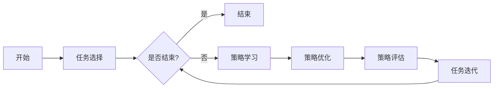
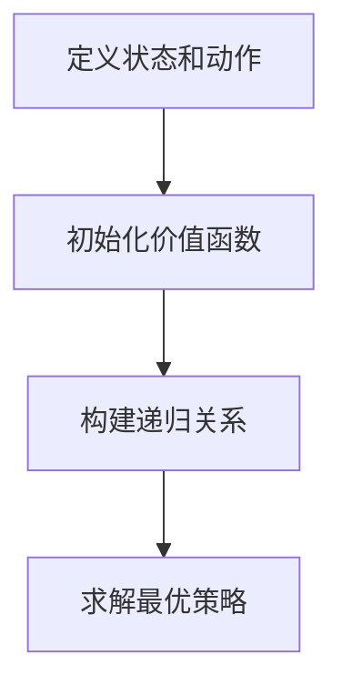
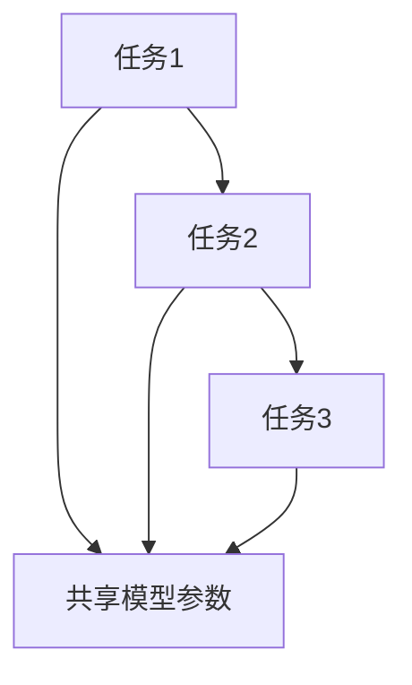
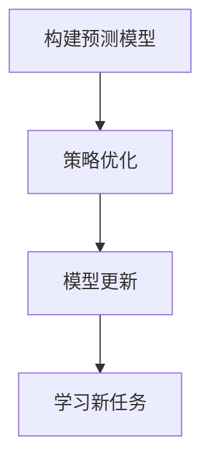
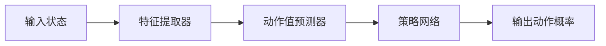
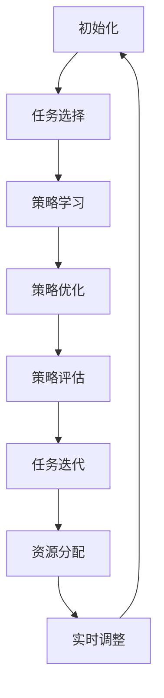
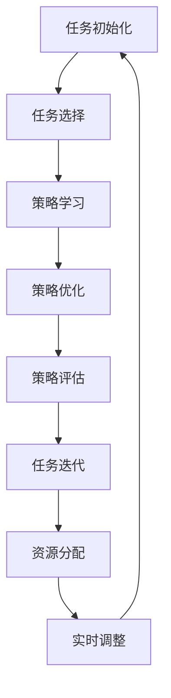
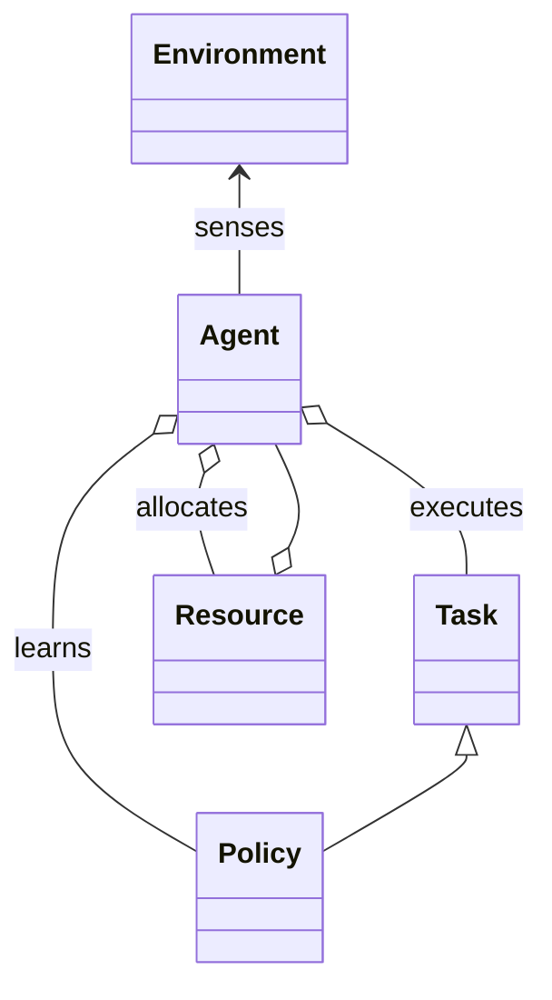
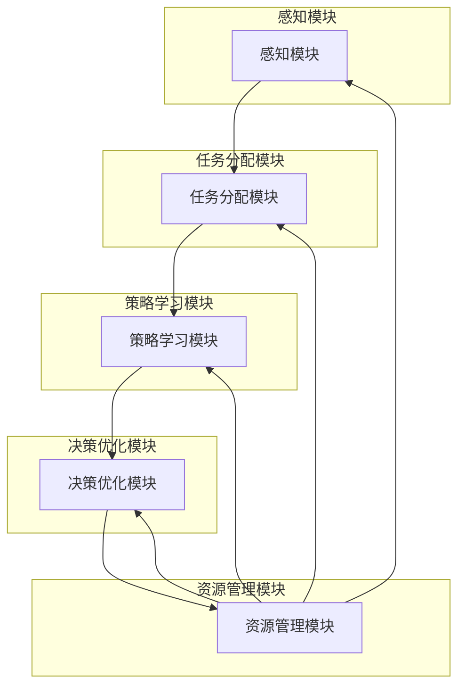

                 


### 动机与背景

在当今的计算机科学和人工智能领域，多任务学习和动态环境下的推理策略成为了研究的热点。传统的单一任务学习方式已无法满足复杂动态环境下的需求，而多任务学习提供了并行处理和资源共享的可能性，但同时也引入了新的挑战。随着人工智能技术的发展，强化学习已经成为解决序列决策问题的重要方法。然而，强化学习在处理动态多任务环境时，往往面临策略收敛速度慢、样本效率低下等问题。

元强化学习作为一种解决策略迭代和迁移学习问题的方法，提供了从多任务学习中提取通用策略的途径。它通过在多个任务上学习，逐渐优化策略，提高了在未知或动态环境下应对复杂任务的能力。这种学习方式不仅能够提高样本利用效率，还能快速适应新的任务环境。

在这种背景下，本文旨在探讨如何利用元强化学习来驱动动态多任务推理策略的设计与实现。本文将详细分析元强化学习的原理、关键技术，以及如何将其应用于动态多任务推理中。通过逐步阐述算法原理、数学模型，并结合实际项目案例，本文希望为研究人员和工程师提供一套完整的解决方案，以应对日益复杂的动态任务环境。

在接下来的章节中，我们将首先介绍元强化学习和动态多任务推理的基本概念，包括它们的核心原理和面临的挑战。随后，我们将深入探讨元强化学习的具体实现方法和关键技术，通过案例研究展示其在不同领域的应用。接下来，我们将转向动态多任务推理策略的设计，详细介绍策略学习原理、策略优化算法及其实现细节。在算法原理讲解部分，我们将使用Mermaid绘制流程图，并通过Python代码实现和讲解算法的数学模型。随后，我们将展示一个系统的分析与架构设计，包括问题场景介绍、系统功能设计、架构设计、接口设计和系统交互。接着，我们将通过一个实际项目案例，详细描述环境安装、系统核心实现、代码解析和案例分析。最后，我们将总结最佳实践、文章小结和注意事项，并提供拓展阅读建议。

### 关键词

- 元强化学习
- 动态多任务推理
- 策略学习
- 模型优化
- 实时推理

### 摘要

本文深入探讨了元强化学习驱动的动态多任务推理策略的设计与实现。首先，我们介绍了元强化学习和动态多任务推理的基本概念，详细分析了它们的核心原理和挑战。接着，通过案例研究展示了元强化学习在不同领域的应用。随后，我们重点讨论了策略学习原理和策略优化算法，通过Mermaid绘制流程图和Python代码实现，详细讲解了算法的数学模型。最后，通过一个实际项目案例，我们展示了系统的分析与架构设计，详细描述了环境安装、系统核心实现、代码解析和案例分析。本文旨在为研究人员和工程师提供一套完整的解决方案，以应对复杂动态任务环境。

### 第1章：问题背景与核心概念

#### 1.1.1 问题背景

在当今的快速发展的信息技术时代，人工智能（AI）技术已经成为各行各业的重要推动力。随着人工智能技术的不断进步，强化学习（Reinforcement Learning，RL）作为一种重要的机器学习分支，已经广泛应用于自主机器人、自动驾驶、游戏开发等领域。强化学习通过智能体（agent）在与环境的交互中不断学习，逐步优化其行为策略，从而实现决策优化。然而，现实世界中的任务环境往往是复杂和多变的，单一任务的强化学习策略难以应对这种动态变化。因此，多任务学习（Multi-Task Learning，MUL）应运而生，它通过在同一模型中同时处理多个任务，共享知识和资源，提高了学习效率和泛化能力。

动态多任务推理（Dynamic Multi-Task Inference）是指在一个不断变化的环境中，模型能够实时适应并执行多个任务的能力。与传统的静态多任务学习不同，动态多任务推理不仅需要处理静态任务，还需要动态地调整和优化策略以适应环境的变化。这种能力对于智能系统在现实世界中的应用具有重要意义，例如在自动驾驶中，车辆需要实时处理交通信号、行人检测、障碍物规避等多个任务，而环境中的其他车辆、天气变化等都会影响决策。

元强化学习（Meta-Reinforcement Learning，MRL）作为一种解决策略迭代和迁移学习问题的方法，为动态多任务推理提供了重要的理论基础。元强化学习通过在多个任务上学习，逐渐优化策略，提高了在未知或动态环境下应对复杂任务的能力。它不仅能够提高样本利用效率，还能快速适应新的任务环境。

然而，动态多任务推理和元强化学习面临着一系列挑战：

1. **策略收敛速度慢**：在动态环境中，智能体需要不断调整策略以适应环境变化，这可能导致策略收敛速度慢，学习效率低下。
2. **样本效率低**：动态多任务环境中的任务复杂且多样，智能体需要大量的样本数据进行学习，这增加了样本获取的难度和成本。
3. **资源竞争**：动态多任务推理中，多个任务可能需要共享有限的计算资源，如何有效地分配和利用资源成为了一个重要问题。
4. **不确定性**：动态环境中存在大量不确定因素，如环境变化、数据噪声等，如何处理这些不确定性是一个关键挑战。

本文旨在探讨如何利用元强化学习来驱动动态多任务推理策略的设计与实现，以解决上述挑战。具体来说，本文将详细分析元强化学习的原理和关键技术，探讨其在动态多任务推理中的应用，并通过实际项目案例验证所提出策略的有效性。

#### 1.1.2 核心概念

在深入探讨元强化学习驱动的动态多任务推理策略之前，我们需要先理解一些核心概念，包括强化学习、多任务学习、动态规划和元学习。

**强化学习（Reinforcement Learning）**

强化学习是机器学习的一个重要分支，其主要目标是通过对环境的反馈进行学习，使智能体（agent）能够采取最优决策。在强化学习中，智能体通过与环境的交互，不断接收奖励信号，并调整其行为策略，以最大化长期奖励。强化学习的基本模型包括智能体、环境和奖励信号：

- **智能体（Agent）**：执行动作并接收环境反馈的实体。
- **环境（Environment）**：智能体所处的情境，能够根据智能体的动作产生状态转移和奖励。
- **状态（State）**：描述智能体在特定时间点的状态。
- **动作（Action）**：智能体在特定状态下可以执行的行为。
- **奖励（Reward）**：描述智能体在特定状态执行特定动作后获得的即时奖励。

强化学习的主要目标是通过学习一个策略（Policy），使智能体在给定状态下选择最优动作。策略通常是一个映射函数，它将状态映射到动作。常见的策略学习算法包括Q学习（Q-Learning）、策略梯度方法（Policy Gradient Methods）和价值迭代（Value Iteration）等。

**多任务学习（Multi-Task Learning）**

多任务学习是强化学习的扩展，其核心思想是通过在同一模型中同时处理多个任务，共享知识和资源，提高学习效率和泛化能力。多任务学习的关键挑战是如何在多个任务之间分配计算资源和学习样本，同时保持每个任务的性能。多任务学习可以分为以下几种类型：

1. **独立任务（Independent Tasks）**：多个任务之间没有直接的交互，每个任务独立进行学习。
2. **共享任务（Shared Tasks）**：多个任务共享部分知识或模型参数，但每个任务有自己的独立策略。
3. **序列任务（Sequential Tasks）**：任务之间存在先后顺序，需要在完成一个任务后，将知识传递给下一个任务。

多任务学习的方法包括模型共享（Model Sharing）、参数共享（Parameter Sharing）和动态任务分配（Dynamic Task Allocation）等。

**动态规划（Dynamic Programming）**

动态规划是一种用于解决序列决策问题的优化方法，其核心思想是将复杂问题分解为一系列子问题，并利用子问题的解来构建原问题的解。动态规划的基本步骤包括：

1. **定义状态（Define State）**：将问题分解为一系列状态，每个状态表示系统在特定时间点的状态特征。
2. **定义动作（Define Action）**：为每个状态定义可能的动作集合。
3. **定义价值函数（Define Value Function）**：定义价值函数，用于衡量系统在特定状态执行特定动作后的效用。
4. **构建递归关系（Build Recursion Relation）**：根据价值函数的定义，建立递归关系，用于计算状态的价值。
5. **求解最优策略（Solve Optimal Policy）**：通过逆向递归或正向递归，求解最优策略。

动态规划广泛应用于资源分配、路径规划、控制理论等领域。

**元学习（Meta-Learning）**

元学习是一种针对学习算法本身的学习方法，其目标是提高学习算法的泛化能力和适应性。元学习通过在不同任务上学习，提取通用策略和知识，从而减少对特定任务的学习时间。元学习的方法包括：

1. **模型提取（Model Extraction）**：通过在不同任务上训练模型，提取通用的特征表示。
2. **元学习算法（Meta-Learning Algorithms）**：如MAML（Model-Agnostic Meta-Learning）、Reptile等，用于快速调整模型参数。
3. **任务分解（Task Decomposition）**：将复杂任务分解为多个简单任务，通过学习这些简单任务的策略，组合成复杂任务的策略。

元学习在强化学习、深度学习等领域具有重要的应用价值。

#### 1.1.3 书籍结构

本文书籍旨在为读者提供一套全面、系统的元强化学习驱动的动态多任务推理策略设计与实现的指南。全书共分为九个章节，内容安排如下：

- **第1章：引言**：介绍本文的研究背景、核心概念以及书籍的整体结构，为后续章节的内容奠定基础。
- **第2章：元强化学习基础**：详细讨论元强化学习的原理、关键技术以及其在不同领域的应用。
- **第3章：动态多任务推理策略**：探讨动态多任务推理的概念、策略学习原理和策略优化算法。
- **第4章：元强化学习驱动的动态多任务推理策略设计**：详细介绍策略设计框架、关键实现细节和可扩展性。
- **第5章：算法原理讲解与流程图展示**：使用Mermaid绘制算法流程图，并通过Python代码实现和讲解算法的数学模型。
- **第6章：数学模型与公式讲解**：详细讲解强化学习、动态多任务推理的数学模型和公式，并给出通俗易懂的举例。
- **第7章：系统分析与架构设计**：介绍问题场景、系统功能设计、架构设计、接口设计和系统交互。
- **第8章：项目实战与案例分析**：通过实际项目案例，展示环境安装、系统核心实现、代码解析和案例分析。
- **第9章：最佳实践与总结**：总结最佳实践、书籍小结、注意事项和拓展阅读。

通过以上章节的详细讲解，本文希望能够为读者提供一套完整、实用的元强化学习驱动的动态多任务推理策略设计与实现指南，帮助他们在实际应用中解决复杂任务。

### 第2章：元强化学习基础

#### 2.1 元强化学习的原理

元强化学习（Meta-Reinforcement Learning，MRL）是一种通过在不同任务上进行学习和优化，从而提高学习效率的强化学习方法。其核心思想是利用元学习（Meta-Learning）技术，从多个任务中提取通用策略和知识，以便在新的任务上能够快速适应和取得良好的性能。元强化学习的目标是通过元学习过程，使得智能体能够快速适应新的任务，从而减少对新任务的训练时间和样本需求。

**定义与基本概念**

元强化学习的基本概念包括：

- **元学习过程（Meta-Learning Process）**：元学习过程是指智能体在不同任务上学习，提取通用策略和知识的过程。它通常通过训练一个元模型（Meta-Model），用于在不同的任务上优化策略。
- **任务空间（Task Space）**：任务空间是指所有可能的任务集合。每个任务可以看作是一个子任务，由特定的状态空间、动作空间和奖励函数组成。
- **策略空间（Policy Space）**：策略空间是指所有可能策略的集合。策略通常是一个映射函数，将状态映射到动作。
- **策略优化（Policy Optimization）**：策略优化是指通过迭代优化过程，找到最优或近似最优的策略。策略优化的方法包括基于梯度的方法、基于价值的策略迭代等。
- **元策略（Meta-Policy）**：元策略是指用于优化策略的函数，它通常是一个复杂的神经网络模型，通过学习多个任务上的数据来提取通用策略。

**基本算法框架**

元强化学习的基本算法框架通常包括以下几个步骤：

1. **任务选择**：在任务空间中选择一个任务进行学习。任务选择可以根据任务的难度、数据量、奖励函数等因素进行。
2. **策略学习**：在选定的任务上，使用现有的策略学习算法（如Q学习、策略梯度方法等）学习一个初始策略。
3. **策略优化**：使用元策略（Meta-Policy）对初始策略进行优化。元策略通常是一个复杂的神经网络模型，通过学习多个任务上的数据来提取通用策略。
4. **策略评估**：评估优化后的策略在选定任务上的性能，并根据评估结果调整元策略。
5. **任务迭代**：重复任务选择、策略学习和策略优化的过程，不断优化元策略，提高其在不同任务上的适应性。

以下是一个简化的元强化学习算法框架的Mermaid流程图：



#### 2.2 关键技术

元强化学习涉及多种关键技术，下面将介绍其中几个关键的技术。

**动态规划**

动态规划（Dynamic Programming，DP）是元强化学习中的重要技术之一。它通过将复杂问题分解为一系列子问题，并利用子问题的解来构建原问题的解，从而优化策略。动态规划的核心思想是利用价值函数（Value Function）来评估状态和动作的效用。价值函数分为状态价值函数（State-Value Function）和动作价值函数（Action-Value Function）。

状态价值函数 \(V(s)\) 表示在状态 \(s\) 下采取最优策略所能获得的最大期望奖励。动作价值函数 \(Q(s, a)\) 表示在状态 \(s\) 下采取动作 \(a\) 所能获得的最大期望奖励。

动态规划的基本步骤包括：

1. **定义状态和动作**：根据问题的需求，定义状态空间和动作空间。
2. **定义价值函数**：初始化状态价值函数和动作价值函数。
3. **构建递归关系**：根据状态价值函数和动作价值函数的定义，建立递归关系，用于计算状态和价值。
4. **求解最优策略**：通过逆向递归（从终点到起点）或正向递归（从起点到终点），求解最优策略。

以下是一个动态规划的Mermaid流程图：



**多任务学习**

多任务学习（Multi-Task Learning，MUL）是元强化学习中的重要应用之一。多任务学习通过在同一模型中同时处理多个任务，共享知识和资源，提高学习效率和泛化能力。多任务学习可以分为以下几种类型：

1. **共享模型参数**：所有任务共享同一个模型参数，不同任务之间通过调整权重和偏置来适应各自的任务。
2. **独立模型**：每个任务都有自己的模型参数，但通过共享部分特征表示来提高学习效率。
3. **任务迭代**：任务之间具有一定的顺序，一个任务的输出作为下一个任务的输入。

多任务学习的挑战在于如何平衡不同任务之间的学习资源和优化目标。常用的多任务学习算法包括：

- **权重共享（Weight Sharing）**：通过共享模型参数，降低模型的复杂性，提高学习效率。
- **任务注意力（Task Attention）**：通过引入注意力机制，动态调整不同任务的重要性。
- **动态任务分配（Dynamic Task Allocation）**：根据任务的复杂度和资源需求，动态调整任务的执行顺序和资源分配。

以下是一个多任务学习的Mermaid流程图：



**基于模型的元学习**

基于模型的元学习（Model-Based Meta-Learning）是元强化学习中的一种方法，通过建立一个模型来预测状态和动作的效用，从而优化策略。基于模型的元学习的主要步骤包括：

1. **构建预测模型**：通过学习多个任务的数据，构建一个预测模型来预测状态和动作的效用。
2. **策略优化**：使用预测模型来指导策略优化，优化策略以最大化期望奖励。
3. **模型更新**：根据新的任务数据，更新预测模型，提高其在不同任务上的预测准确性。

以下是一个基于模型的元学习的Mermaid流程图：



#### 2.3 案例研究

元强化学习在多个领域都有成功的应用。以下是一些典型案例：

**案例一：自动驾驶**

在自动驾驶领域，元强化学习被用来设计一个能够快速适应不同驾驶场景的智能决策系统。通过在多种驾驶环境中进行训练，元强化学习提取了通用的驾驶策略，提高了系统在复杂道路环境中的适应能力。例如，谷歌的Waymo项目就使用了元强化学习来优化自动驾驶决策过程。

**案例二：游戏开发**

在游戏开发中，元强化学习被用于开发智能游戏对手。通过在多个游戏中进行训练，元强化学习能够提取通用的策略，使得游戏对手在不同游戏场景中都能表现出色。例如，DeepMind开发的Atari游戏智能体就使用了元强化学习来快速适应多种不同类型的游戏。

**案例三：资源分配**

在资源分配问题中，元强化学习被用来优化资源在不同任务之间的分配。通过学习多个任务的数据，元强化学习能够提取出有效的资源分配策略，提高了资源利用效率。例如，亚马逊的AWS云服务平台就使用了元强化学习来优化计算资源的分配，提高了系统的响应速度和可靠性。

通过以上案例，我们可以看到元强化学习在不同领域的成功应用，它通过提取通用策略和知识，提高了系统在复杂动态环境中的适应能力和学习效率。这些案例不仅展示了元强化学习的强大能力，也为其他领域的研究和应用提供了宝贵的经验和启示。

### 第3章：动态多任务推理策略

#### 3.1 动态多任务推理的概念

动态多任务推理（Dynamic Multi-Task Inference）是一种智能系统在动态环境中执行多个任务的能力，其核心在于能够实时适应环境变化，优化任务执行策略。与传统的静态多任务推理不同，动态多任务推理面临更多的挑战，因为环境状态是不断变化的，任务之间存在相互作用，且任务执行过程中可能存在不确定性和不确定性因素。

**定义与特征**

动态多任务推理可以定义为：一个智能系统在多个动态任务环境中，通过实时感知环境状态、执行决策动作，并利用反馈信息不断调整策略，以实现各任务最优执行的过程。

其特征主要包括：

1. **动态性**：任务环境和任务需求随时间变化，系统需要实时适应和调整策略。
2. **多样性**：任务类型和执行方式多样，系统需要在不同的任务间切换和优化资源分配。
3. **交互性**：任务之间存在相互作用，某一任务的执行可能会影响其他任务的执行效果。
4. **不确定性**：环境状态、任务目标、执行结果可能存在不确定性，系统需要具备鲁棒性和自适应能力。

**挑战与机遇**

动态多任务推理面临以下挑战：

1. **策略优化困难**：动态环境下的任务变化多样，策略优化难度大，如何设计有效的策略成为关键问题。
2. **资源分配问题**：多个任务可能需要共享有限的资源，如何合理分配资源以最大化整体性能是一个重要挑战。
3. **样本效率低**：动态环境下，任务变化频繁，样本获取难度大，如何提高样本利用效率是关键问题。
4. **不确定性处理**：动态环境中的不确定因素较多，如何有效地处理这些不确定性是关键问题。

然而，动态多任务推理也带来了许多机遇：

1. **提升系统性能**：通过动态调整策略和资源分配，系统可以在复杂动态环境中实现更高的任务执行效率。
2. **扩展应用领域**：动态多任务推理适用于自动驾驶、智能调度、动态资源管理等多个领域，具有广泛的应用前景。
3. **增强系统适应性**：通过元强化学习和动态规划等技术，系统可以更好地适应复杂动态环境，提高系统的鲁棒性和适应性。

#### 3.2 策略学习原理

动态多任务推理的核心在于策略学习，即如何设计一个能够自适应动态环境的策略。策略学习包括策略的表示、学习方法和优化过程。

**策略表示**

策略在动态多任务推理中通常表示为一种映射关系，将环境状态映射到动作选择。常见的策略表示方法包括：

1. **确定性策略（Deterministic Policy）**：在给定状态 \(s\) 下，直接映射到唯一动作 \(a(s)\)。
2. **随机性策略（Stochastic Policy）**：在给定状态 \(s\) 下，映射到一个概率分布 \(P(a|s)\)，根据概率分布选择动作。

**策略学习方法**

策略学习主要分为以下几种方法：

1. **强化学习（Reinforcement Learning）**：通过智能体与环境交互，利用奖励信号调整策略，不断优化策略以实现目标。常见的强化学习方法包括Q学习、策略梯度方法和深度强化学习。
2. **多任务学习（Multi-Task Learning）**：通过在同一模型中同时处理多个任务，共享知识和资源，提高学习效率和泛化能力。多任务学习方法包括共享模型参数、共享特征表示和任务迭代等。
3. **元学习（Meta-Learning）**：通过在不同任务上进行学习，提取通用策略和知识，快速适应新的任务环境。常见的元学习方法包括模型提取和元学习算法。

**策略优化方法**

策略优化的目标是找到最优或近似最优的策略，提高任务执行的效率和性能。常见的策略优化方法包括：

1. **梯度下降（Gradient Descent）**：通过梯度信息调整策略参数，逐渐逼近最优策略。
2. **策略梯度方法（Policy Gradient Methods）**：直接优化策略的概率分布，通过策略梯度更新策略参数。
3. **策略搜索方法（Policy Search Methods）**：通过随机搜索或优化算法，搜索最优策略。

**动态规划（Dynamic Programming）**

动态规划是策略优化的一种重要方法，通过将复杂问题分解为一系列子问题，并利用子问题的解来构建原问题的解，优化策略。动态规划的基本步骤包括：

1. **定义状态（Define State）**：将问题分解为一系列状态，每个状态表示系统在特定时间点的状态特征。
2. **定义动作（Define Action）**：为每个状态定义可能的动作集合。
3. **定义价值函数（Define Value Function）**：定义价值函数，用于衡量系统在特定状态执行特定动作后的效用。
4. **构建递归关系（Build Recursion Relation）**：根据价值函数的定义，建立递归关系，用于计算状态的价值。
5. **求解最优策略（Solve Optimal Policy）**：通过逆向递归或正向递归，求解最优策略。

#### 3.3 策略优化算法

策略优化算法在动态多任务推理中起着关键作用，其目标是找到最优或近似最优的策略，以提高任务执行效率和性能。以下将介绍几种常用的策略优化算法。

**Q学习（Q-Learning）**

Q学习是一种基于值函数的策略优化方法，通过迭代更新Q值（动作价值函数）来逼近最优策略。Q学习的基本步骤包括：

1. **初始化Q值表**：初始化Q值表，用于存储状态-动作对的Q值。
2. **选择动作**：在给定状态 \(s\) 下，根据当前Q值表选择动作 \(a\)，可以使用ε-greedy策略。
3. **执行动作**：执行选择的动作 \(a\)，进入新的状态 \(s'\)。
4. **更新Q值**：根据新的状态 \(s'\) 和奖励 \(r\)，更新Q值表：
   \[
   Q(s, a) \leftarrow Q(s, a) + \alpha [r + \gamma \max_{a'} Q(s', a') - Q(s, a)]
   \]
   其中，\(\alpha\) 是学习率，\(\gamma\) 是折扣因子。

**策略梯度方法（Policy Gradient Methods）**

策略梯度方法是一种直接优化策略概率分布的算法。其基本思想是通过策略梯度更新策略参数，从而提高策略的效用。常见的策略梯度方法包括REINFORCE、PPO（Proximal Policy Optimization）等。

以REINFORCE方法为例，其基本步骤包括：

1. **执行策略**：根据当前策略执行动作，生成一个轨迹 \(s_1, a_1, r_1, s_2, a_2, r_2, \ldots, s_T, a_T, r_T\)。
2. **计算策略梯度**：计算策略的梯度：
   \[
   \nabla_{\theta} \log \pi(a_t | s_t; \theta)
   \]
   其中，\(\theta\) 是策略参数，\(\pi(a_t | s_t; \theta)\) 是策略的概率分布。
3. **更新策略参数**：根据策略梯度更新策略参数：
   \[
   \theta \leftarrow \theta + \alpha \nabla_{\theta} \log \pi(a_t | s_t; \theta) \cdot r_t
   \]
   其中，\(\alpha\) 是学习率。

**深度强化学习（Deep Reinforcement Learning）**

深度强化学习结合了深度神经网络和强化学习，通过神经网络来近似Q值函数或策略。常见的深度强化学习方法包括DQN（Deep Q-Network）、DDPG（Deep Deterministic Policy Gradient）等。

以DQN方法为例，其基本步骤包括：

1. **初始化神经网络**：初始化Q值网络和目标Q值网络。
2. **执行策略**：根据当前策略执行动作，生成一个轨迹。
3. **更新目标Q值网络**：每隔一定次数，将Q值网络权重复制到目标Q值网络，保持目标Q值网络的稳定。
4. **计算Q值**：根据当前状态 \(s_t\) 和执行的动作 \(a_t\)，计算Q值：
   \[
   Q(s_t, a_t) = r_t + \gamma \max_{a'} Q(s_{t+1}, a')
   \]
5. **更新Q值网络**：根据计算得到的Q值和实际奖励，更新Q值网络。

**模型参数优化**

策略优化算法中，模型参数的优化是一个关键问题。常用的参数优化方法包括：

1. **随机梯度下降（Stochastic Gradient Descent，SGD）**：通过随机选择一部分样本，计算梯度，更新模型参数。
2. **Adam优化器（Adam Optimizer）**：结合了SGD和RMSprop的优点，通过自适应调整学习率，提高参数更新的效果。
3. **Adagrad优化器（Adagrad Optimizer）**：通过自适应调整学习率，对不同参数的更新给予不同的权重。

以上介绍的策略优化算法各有优缺点，适用于不同的动态多任务推理场景。在实际应用中，可以根据任务特点和系统需求，选择合适的策略优化算法，并对其参数进行调优，以实现最优的任务执行效果。

#### 3.4 实现细节

在实现动态多任务推理策略时，需要考虑多个方面的细节，以确保系统在动态环境下能够高效、稳定地运行。以下将详细讨论策略学习的实现细节，包括网络结构、损失函数和正则化策略。

**网络结构**

策略学习通常依赖于神经网络模型，其结构设计直接影响策略学习的性能和泛化能力。动态多任务推理中的神经网络模型通常包括以下几个关键组件：

1. **特征提取器（Feature Extractor）**：用于提取输入状态的低维特征表示。特征提取器可以是卷积神经网络（CNN）、循环神经网络（RNN）或其他类型的神经网络。
2. **动作值预测器（Action Value Predictor）**：用于预测在给定状态下，执行每个动作所能获得的价值。动作值预测器通常是一个全连接神经网络，其输入为特征提取器的输出，输出为每个动作的值。
3. **策略网络（Policy Network）**：用于预测在给定状态下，选择每个动作的概率分布。策略网络也可以是一个全连接神经网络，其输出为动作的概率分布。

以下是一个典型的神经网络结构示意图：



**损失函数**

策略学习中的损失函数用于衡量策略网络的输出与实际结果之间的差异，并指导网络参数的更新。在动态多任务推理中，常用的损失函数包括：

1. **交叉熵损失（Cross-Entropy Loss）**：用于衡量策略网络输出的概率分布与真实分布之间的差异。交叉熵损失函数可以表示为：
   \[
   L_{\text{cross-entropy}} = -\sum_{i} y_i \log(\hat{y}_i)
   \]
   其中，\(y_i\) 是真实标签，\(\hat{y}_i\) 是策略网络输出的概率估计。

2. **动作值损失（Action-Value Loss）**：用于衡量动作值预测器预测的值与实际奖励之间的差异。动作值损失函数可以表示为：
   \[
   L_{\text{action-value}} = \frac{1}{2} \sum_{i} (\hat{v}_i - v_i)^2
   \]
   其中，\(\hat{v}_i\) 是动作值预测器输出的预测值，\(v_i\) 是实际奖励。

为了同时优化策略和动作值预测，可以采用以下复合损失函数：
\[
L = \alpha L_{\text{cross-entropy}} + (1 - \alpha) L_{\text{action-value}}
\]
其中，\(\alpha\) 是调节两个损失函数权重的参数。

**正则化策略**

在动态多任务推理中，为了提高模型泛化能力和防止过拟合，可以采用以下几种正则化策略：

1. **Dropout**：在神经网络训练过程中，随机丢弃部分神经元及其连接，降低模型的复杂性和过拟合风险。

2. **权重衰减（Weight Decay）**：在损失函数中添加权重项，用于惩罚权重较大的神经元，防止模型过拟合。

3. **数据增强（Data Augmentation）**：通过增加训练数据的多样性，提高模型的泛化能力。

4. **集成方法（Ensemble Methods）**：结合多个模型的预测结果，提高整体模型的预测准确性。

通过上述网络结构、损失函数和正则化策略的设计与实现，可以构建一个高效的动态多任务推理策略学习系统。在实际应用中，需要根据具体任务需求和环境特点，对这些参数进行调整和优化，以实现最优的任务执行效果。

### 第4章：元强化学习驱动的动态多任务推理策略设计

#### 4.1 策略设计框架

设计元强化学习驱动的动态多任务推理策略需要明确设计思路、目标和算法流程。以下将详细阐述策略设计的整体框架。

**设计思路**

元强化学习驱动的动态多任务推理策略设计思路主要包括以下几个方面：

1. **元学习策略**：通过元学习从多个任务中提取通用策略，提高策略在不同任务上的适应性和迁移能力。
2. **动态任务分配**：根据动态任务环境的特性，实时调整任务执行顺序和资源分配策略，确保系统高效运行。
3. **实时策略优化**：利用实时反馈信息，不断调整和优化策略，提高任务执行效率。
4. **鲁棒性设计**：通过引入正则化策略和误差校正机制，提高系统在不确定环境下的鲁棒性。

**设计目标**

策略设计的目标主要包括：

1. **高效性**：策略能够快速适应动态任务环境，提高任务执行效率。
2. **适应性**：策略具有较好的泛化能力，能够在不同任务和环境中快速适应和优化。
3. **鲁棒性**：策略能够在不确定和动态环境下稳定运行，具备良好的鲁棒性。
4. **可扩展性**：策略设计应具有可扩展性，能够适应不同规模的任务和环境。

**算法流程**

元强化学习驱动的动态多任务推理策略的算法流程包括以下步骤：

1. **初始化**：初始化元学习模型、任务分配策略和实时策略优化模块。
2. **任务选择**：根据动态任务环境的特性，选择当前任务进行学习。任务选择可以根据任务的优先级、环境状态等因素进行。
3. **策略学习**：在选定的任务上，使用元强化学习方法学习一个初始策略。策略学习可以通过在多个任务上进行迭代学习，逐步优化策略。
4. **策略优化**：使用元策略对初始策略进行优化。元策略是一个复杂的神经网络模型，通过学习多个任务上的数据来提取通用策略。
5. **策略评估**：评估优化后的策略在选定任务上的性能，并根据评估结果调整元策略。
6. **任务迭代**：重复任务选择、策略学习和策略优化的过程，不断优化元策略，提高其在不同任务上的适应性。
7. **资源分配**：根据任务执行的需求和资源状况，动态调整任务间的资源分配策略，确保系统高效运行。
8. **实时调整**：根据实时反馈信息，动态调整策略和资源分配，确保系统在动态任务环境中的高效运行。

以下是一个简化的算法流程图：



通过上述策略设计框架，我们可以构建一个高效的元强化学习驱动的动态多任务推理策略，实现系统在复杂动态环境中的高效、稳定运行。

#### 4.2 关键实现细节

在实现元强化学习驱动的动态多任务推理策略时，需要关注多个关键实现细节，以确保策略的有效性和高效性。以下将详细讨论网络结构、损失函数和正则化策略。

**网络结构**

策略学习的网络结构是整个系统的核心，直接影响策略学习的性能和泛化能力。在动态多任务推理中，网络结构通常包括以下几个关键组件：

1. **特征提取器（Feature Extractor）**：
   - **输入层**：接收来自动态任务环境的输入数据，如图像、传感器数据等。
   - **卷积层**：用于提取输入数据的低维特征表示，可通过多个卷积层堆叠，增加特征表达能力。
   - **池化层**：用于减小特征图的尺寸，减少计算量。
   - **全连接层**：将卷积层提取的特征映射到高维空间，用于后续处理。

2. **动作值预测器（Action Value Predictor）**：
   - **全连接层**：接收特征提取器的输出，预测每个动作的值。
   - **激活函数**：通常使用ReLU或Sigmoid函数，增强网络的非线性表达能力。

3. **策略网络（Policy Network）**：
   - **全连接层**：接收特征提取器的输出，预测每个动作的概率分布。
   - **输出层**：输出每个动作的概率分布，通常采用softmax函数，确保输出概率分布的归一化。

**损失函数**

在策略学习中，损失函数用于衡量策略网络输出的概率分布与真实分布之间的差异，并指导网络参数的更新。动态多任务推理中，常用的损失函数包括：

1. **交叉熵损失（Cross-Entropy Loss）**：
   - **定义**：交叉熵损失用于衡量两个概率分布之间的差异，其公式为：
     \[
     L_{\text{cross-entropy}} = -\sum_{i} y_i \log(\hat{y}_i)
     \]
     其中，\(y_i\) 是真实标签，\(\hat{y}_i\) 是策略网络输出的概率估计。
   - **作用**：交叉熵损失函数能够有效惩罚策略网络输出的偏差，提高策略的准确度。

2. **动作值损失（Action-Value Loss）**：
   - **定义**：动作值损失用于衡量动作值预测器输出的预测值与实际奖励之间的差异，其公式为：
     \[
     L_{\text{action-value}} = \frac{1}{2} \sum_{i} (\hat{v}_i - v_i)^2
     \]
     其中，\(\hat{v}_i\) 是动作值预测器输出的预测值，\(v_i\) 是实际奖励。
   - **作用**：动作值损失函数能够确保动作值预测器的准确性，有助于提高策略的优化效率。

**正则化策略**

为了提高模型的泛化能力和防止过拟合，可以采用以下几种正则化策略：

1. **Dropout**：
   - **定义**：在神经网络训练过程中，随机丢弃部分神经元及其连接，以减少模型的复杂性和过拟合风险。
   - **实现**：在神经网络层的输入和输出之间加入dropout层，随机丢弃一定比例的神经元连接。

2. **权重衰减（Weight Decay）**：
   - **定义**：在损失函数中添加权重项，用于惩罚权重较大的神经元，减少模型的过拟合风险。
   - **实现**：在损失函数中添加权重衰减项，如L2正则化：
     \[
     L_{\text{weight-decay}} = \lambda \sum_{w} w^2
     \]
     其中，\(\lambda\) 是权重衰减系数。

3. **数据增强（Data Augmentation）**：
   - **定义**：通过增加训练数据的多样性，提高模型的泛化能力。
   - **实现**：对输入数据进行旋转、翻转、裁剪等操作，增加数据的多样性。

4. **集成方法（Ensemble Methods）**：
   - **定义**：结合多个模型的预测结果，提高整体模型的预测准确性。
   - **实现**：训练多个模型，将它们的预测结果进行加权平均或投票，得到最终预测结果。

通过以上网络结构、损失函数和正则化策略的设计与实现，可以构建一个高效、鲁棒的元强化学习驱动的动态多任务推理策略。在实际应用中，需要根据具体任务需求和环境特点，对这些参数进行调整和优化，以实现最优的任务执行效果。

### 第5章：算法原理讲解与流程图展示

#### 5.1 算法原理

元强化学习驱动的动态多任务推理策略是一种结合元学习和强化学习的综合方法，旨在提高智能体在动态任务环境中的适应能力和执行效率。本节将详细讲解算法的基本原理，并使用Mermaid绘制算法流程图。

**算法框架**

元强化学习驱动的动态多任务推理算法框架可以分为以下几个主要步骤：

1. **任务初始化**：初始化元学习模型、动态任务环境和策略优化模块。
2. **任务选择**：根据任务优先级和当前环境状态选择一个任务进行学习。
3. **策略学习**：在选定的任务上，通过元学习方法学习一个初始策略。
4. **策略优化**：使用优化算法对策略进行迭代优化，以提高策略的适应性和性能。
5. **策略评估**：评估优化后的策略在选定任务上的性能，并调整元学习模型。
6. **任务迭代**：重复任务选择、策略学习和策略优化的过程，不断优化策略。
7. **资源分配**：根据任务执行需求和环境状态，动态调整任务间的资源分配策略。
8. **实时调整**：根据实时反馈信息，动态调整策略和资源分配，确保系统高效运行。

**算法流程图**

以下是元强化学习驱动的动态多任务推理策略的Mermaid流程图：



**算法细节**

1. **任务初始化**：初始化元学习模型、动态任务环境和策略优化模块。元学习模型用于提取通用策略，动态任务环境用于模拟实际任务环境，策略优化模块用于迭代优化策略。
2. **任务选择**：根据任务优先级和当前环境状态选择一个任务进行学习。任务选择可以基于任务的紧急性、难度和环境适应性等因素。
3. **策略学习**：在选定的任务上，通过元学习方法学习一个初始策略。元学习可以通过在多个任务上进行迭代学习，逐步优化策略，提取通用策略。
4. **策略优化**：使用优化算法对策略进行迭代优化。常用的优化算法包括策略梯度方法、深度强化学习和演化算法等。
5. **策略评估**：评估优化后的策略在选定任务上的性能。策略评估可以通过模拟环境、计算任务完成时间和错误率等指标进行。
6. **任务迭代**：重复任务选择、策略学习和策略优化的过程，不断优化策略。每次迭代后，策略评估结果将用于调整元学习模型和策略。
7. **资源分配**：根据任务执行需求和环境状态，动态调整任务间的资源分配策略。资源分配可以基于任务的重要性、执行时间和资源利用率等因素进行。
8. **实时调整**：根据实时反馈信息，动态调整策略和资源分配。实时调整可以基于环境状态的变化、任务执行进度和资源需求变化等因素进行。

通过上述流程，元强化学习驱动的动态多任务推理策略能够有效地适应动态任务环境，提高任务执行效率和系统性能。

#### 5.2 Python代码实现

为了更好地理解元强化学习驱动的动态多任务推理策略，我们将通过Python代码实现该算法的核心部分。以下代码提供了一个简化版的实现，展示如何初始化任务、选择任务、学习策略、优化策略和评估策略。

```python
import numpy as np
import tensorflow as tf

# 定义环境
class DynamicEnvironment:
    def __init__(self, num_tasks):
        self.num_tasks = num_tasks
        self.task_status = [0] * num_tasks  # 任务状态初始化为未完成

    def step(self, action):
        reward = 0
        for i in range(self.num_tasks):
            if action[i] == 1:
                # 完成一个任务
                self.task_status[i] = 1
                reward += 10
        return reward

    def is_done(self):
        return all(self.task_status)

# 初始化参数
num_tasks = 3
learning_rate = 0.1
gamma = 0.99
epsilon = 0.1

# 初始化策略网络
model = tf.keras.Sequential([
    tf.keras.layers.Dense(64, activation='relu', input_shape=(num_tasks,)),
    tf.keras.layers.Dense(64, activation='relu'),
    tf.keras.layers.Dense(num_tasks, activation='sigmoid')
])

model.compile(optimizer=tf.keras.optimizers.Adam(learning_rate), loss='binary_crossentropy')

# 初始化环境
env = DynamicEnvironment(num_tasks)

# 策略学习过程
for episode in range(1000):
    state = env.task_status
    done = False
    total_reward = 0

    while not done:
        # 选择动作
        action_probs = model.predict(state.reshape(1, -1))
        action = np.random.choice(num_tasks, p=action_probs[0])

        # 执行动作
        reward = env.step(action)
        total_reward += reward

        # 更新状态
        state = env.task_status

        # 检查是否完成
        done = env.is_done()

    print(f"Episode {episode}: Total Reward = {total_reward}")

# 评估策略
test_state = env.task_status
action_probs = model.predict(test_state.reshape(1, -1))
print(f"Policy action probabilities: {action_probs}")
```

这段代码首先定义了一个简单的动态环境，用于模拟多个任务的状态变化。然后，我们初始化了策略网络，并使用策略梯度方法进行了训练。在训练过程中，我们通过策略网络预测每个任务的执行概率，并选择动作。每次动作执行后，我们更新环境状态，并检查任务是否完成。

**可视化与结果分析**

为了更直观地展示算法的执行过程，我们可以使用matplotlib库对训练过程中的奖励和策略概率进行可视化。

```python
import matplotlib.pyplot as plt

# 可视化训练过程中的奖励
rewards = [total_reward for episode in range(1000)]
plt.plot(rewards)
plt.title("Episode Rewards")
plt.xlabel("Episode")
plt.ylabel("Reward")
plt.show()

# 可视化策略概率
action_probs = model.predict(np.array([env.task_status] * 100).reshape(100, -1))
action_probs = action_probs.reshape(100, num_tasks)
for i in range(100):
    plt.bar(range(num_tasks), action_probs[i])
    plt.title(f"Policy Action Probabilities at State {i}")
    plt.xlabel("Task")
    plt.ylabel("Probability")
    plt.show()
```

这段代码将绘制每个任务执行概率的柱状图，通过可视化可以直观地观察策略网络如何根据当前状态调整动作概率。

通过以上代码实现和可视化分析，我们可以更清晰地理解元强化学习驱动的动态多任务推理策略的执行过程和效果。这段代码提供了一个简化的实现，实际应用中可能需要根据具体任务和环境特点进行更复杂的处理和优化。

### 第6章：数学模型与公式讲解

#### 6.1 强化学习数学模型

强化学习（Reinforcement Learning，RL）是一种通过与环境交互来学习最优策略的机器学习方法。其核心在于通过智能体（agent）在与环境的交互过程中，不断接收奖励信号，调整其行为策略，以实现长期奖励最大化。以下是强化学习中的几个关键数学模型。

**强化学习的基本方程**

强化学习的基本方程包括状态-动作价值函数（State-Action Value Function）和策略（Policy）。

- **状态-动作价值函数（Q值）**：表示在给定状态 \(s\) 下执行特定动作 \(a\) 所能获得的最大期望奖励。用数学公式表示为：
  \[
  Q(s, a) = \sum_{s'} p(s' | s, a) \cdot \gamma \cdot \max_{a'} Q(s', a')
  \]
  其中，\(p(s' | s, a)\) 表示状态转移概率，\(\gamma\) 是折扣因子，用于考虑未来的奖励，\(\max_{a'} Q(s', a')\) 表示在状态 \(s'\) 下选择最优动作。

- **策略（Policy）**：表示智能体在给定状态 \(s\) 下选择动作的概率分布。常见的策略包括确定性策略（Deterministic Policy）和随机性策略（Stochastic Policy）。
  - **确定性策略**：在给定状态 \(s\) 下，总是选择最优动作 \(a^* = \arg\max_a Q(s, a)\)。
  - **随机性策略**：在给定状态 \(s\) 下，根据概率分布 \( \pi(a | s) = \frac{e^{Q(s, a)}}{\sum_a e^{Q(s, a)}} \) 选择动作。

**价值迭代与策略迭代**

在强化学习中，有两种主要的方法来优化策略：价值迭代（Value Iteration）和策略迭代（Policy Iteration）。

- **价值迭代**：通过迭代更新状态-动作价值函数，直到收敛到一个最优值。其更新公式为：
  \[
  Q(s, a) \leftarrow Q(s, a) + \alpha [r + \gamma \max_{a'} Q(s', a') - Q(s, a)]
  \]
  其中，\(\alpha\) 是学习率，\(r\) 是即时奖励，\(\gamma\) 是折扣因子。

- **策略迭代**：通过迭代更新策略，直到收敛到一个最优策略。策略迭代的步骤包括：
  1. **策略评估**：使用当前策略评估状态-动作价值函数。
  2. **策略改进**：根据状态-动作价值函数更新策略，选择最优动作。
  3. **重复步骤**：重复策略评估和策略改进，直到策略不再改进。

#### 6.2 动态多任务推理的数学模型

动态多任务推理（Dynamic Multi-Task Inference）是指智能体在动态环境中同时处理多个任务的能力。其数学模型主要涉及状态空间、动作空间、价值函数和策略。

**动态多任务推理的状态和动作空间**

- **状态空间**：动态多任务推理的状态空间包括当前任务的执行状态和全局状态。当前任务状态表示每个任务的具体执行情况，全局状态则包括所有任务的状态信息。
- **动作空间**：动态多任务推理的动作空间包括对每个任务的操作，如执行某个任务、暂停任务、切换任务等。

**动态多任务推理的价值函数**

- **状态-动作价值函数**：在动态多任务推理中，状态-动作价值函数 \(Q(s, a)\) 表示在给定状态 \(s\) 下执行特定动作 \(a\) 所能获得的最大期望奖励。
- **任务价值函数**：每个任务都有自己的价值函数，用于衡量任务完成度或任务优先级。

**动态多任务推理的策略**

- **全局策略**：全局策略是智能体在给定全局状态 \(s\) 下选择全局动作 \(a\) 的概率分布。全局策略需要平衡不同任务的执行优先级和资源分配。
- **局部策略**：局部策略是智能体在给定当前任务状态 \(s'\) 下选择特定任务动作 \(a'\) 的概率分布。

**动态规划原理**

动态规划（Dynamic Programming，DP）是解决动态多任务推理问题的有效方法。动态规划的基本原理是将复杂问题分解为一系列子问题，并利用子问题的解来构建原问题的解。

- **递归关系**：动态规划通过建立递归关系，将原问题分解为子问题。在动态多任务推理中，递归关系可以表示为：
  \[
  V(s, a) = r(s, a) + \gamma \sum_{s'} p(s' | s, a) \cdot \max_{a'} V(s', a')
  \]
  其中，\(V(s, a)\) 是状态-动作价值函数，\(r(s, a)\) 是即时奖励，\(p(s' | s, a)\) 是状态转移概率。

- **逆向递归**：逆向递归是从终点开始，反向计算每个状态的最优价值函数。逆向递归的步骤包括：
  1. 初始化 \(V(s, a) = 0\) 对于所有 \(s\) 和 \(a\)。
  2. 递归更新 \(V(s, a)\)：
     \[
     V(s, a) = r(s, a) + \gamma \max_{a'} [V(s', a')]
     \]

- **正向递归**：正向递归是从初始状态开始，正向计算每个状态的最优价值函数。正向递归的步骤包括：
  1. 初始化 \(V(s, a) = r(s, a)\) 对于所有 \(s\) 和 \(a\)。
  2. 递归更新 \(V(s, a)\)：
     \[
     V(s, a) = r(s, a) + \gamma \sum_{s'} p(s' | s, a) \cdot V(s', a')
     \]

#### 6.3 公式推导与说明

**Q学习公式推导**

Q学习是一种基于值函数的策略优化方法，其目标是找到最优的动作值函数 \(Q^*(s, a)\)。

- **初始值函数**：在Q学习开始时，初始化 \(Q(s, a)\) 为随机值。
- **更新公式**：Q学习通过以下公式更新值函数：
  \[
  Q(s, a) \leftarrow Q(s, a) + \alpha [r(s', a') + \gamma \max_{a'} Q(s', a') - Q(s, a)]
  \]
  其中，\(r(s', a')\) 是在状态 \(s'\) 下执行动作 \(a'\) 后获得的即时奖励，\(\alpha\) 是学习率，\(\gamma\) 是折扣因子。

**策略迭代公式推导**

策略迭代是一种通过迭代优化策略的方法，其目标是找到最优策略。

- **策略评估**：首先评估当前策略 \( \pi \) 的值函数：
  \[
  V^{\pi}(s) = \sum_{a} \pi(a | s) \cdot Q(s, a)
  \]
- **策略改进**：然后根据评估结果改进策略：
  \[
  \pi(a | s) = \frac{1}{Z} \exp(\alpha Q(s, a))
  \]
  其中，\(Z\) 是归一化常数，\(\alpha\) 是策略改进参数。

**动态多任务推理的递归关系**

动态多任务推理的递归关系用于计算状态-动作价值函数。以下是一个简化的递归关系公式：
\[
V(s, a) = r(s, a) + \gamma \sum_{s'} p(s' | s, a) \cdot \max_{a'} V(s', a')
\]

这些公式在动态多任务推理中起着关键作用，用于优化智能体的策略和决策。通过理解和应用这些数学模型，我们可以设计出有效的动态多任务推理策略，以应对复杂的动态环境。

### 第7章：系统分析与架构设计

#### 7.1 问题场景介绍

在现代社会中，智能系统的应用越来越广泛，尤其是在自动化和实时决策领域。一个典型的场景是自动驾驶系统，该系统需要在复杂的交通环境中执行多个任务，包括路径规划、障碍物检测、交通信号识别等。这些任务的动态性和复杂性使得传统的单一任务决策方法难以满足需求。为了实现高效的决策和优化，需要设计一个动态多任务推理系统，该系统能够实时适应环境变化，并高效地处理多个任务。

**系统需求**

自动驾驶系统的主要需求包括：

1. **实时性**：系统需要能够快速响应环境变化，处理突发情况。
2. **可靠性**：系统在复杂和动态的环境中必须保持稳定的性能。
3. **适应性**：系统需要具备良好的适应能力，能够快速适应不同的交通状况和任务需求。
4. **可扩展性**：系统应该具有模块化设计，便于扩展和集成新功能。

**系统目标**

动态多任务推理系统的目标是通过元强化学习技术，实现以下目标：

1. **高效决策**：系统需要在动态环境中快速做出最优决策，确保车辆的安全和效率。
2. **知识共享**：系统应能够通过元强化学习从多个任务中提取通用策略，提高学习效率。
3. **资源优化**：系统应能够动态调整资源分配，最大化整体系统性能。
4. **鲁棒性**：系统应具备良好的鲁棒性，能够在不确定和动态的环境中稳定运行。

#### 7.2 系统功能设计

动态多任务推理系统的核心功能包括：

1. **任务感知**：系统能够实时感知环境状态，获取包括交通状况、道路条件、障碍物等信息。
2. **任务分配**：系统根据当前环境状态和任务优先级，动态分配执行任务。
3. **策略学习**：系统利用元强化学习方法，从多个任务中学习通用策略。
4. **决策优化**：系统根据实时反馈，优化决策策略，提高任务执行效率。
5. **资源管理**：系统动态调整资源分配，确保各任务得到充分资源支持。

**领域模型**

为了更好地理解和设计系统功能，我们引入领域模型（Domain Model）来描述系统的核心组件和关系。领域模型使用Mermaid类图表示，如下所示：



在这个领域模型中，主要类包括：

- **环境（Environment）**：负责感知和提供当前环境状态。
- **智能体（Agent）**：作为系统的核心组件，负责任务执行、策略学习和资源管理。
- **任务（Task）**：表示系统需要执行的具体任务，如路径规划、障碍物检测等。
- **策略（Policy）**：用于表示任务执行策略，由智能体学习和优化。
- **资源（Resource）**：表示系统可用的计算资源，如CPU、内存等。

#### 7.3 系统架构设计

为了实现动态多任务推理系统的功能需求，系统架构需要具备良好的可扩展性和鲁棒性。系统架构采用模块化设计，主要包括以下几个主要组件：

1. **感知模块（Perception Module）**：负责实时感知环境状态，包括交通信号、道路条件、障碍物等信息。
2. **任务分配模块（Task Allocation Module）**：根据当前环境状态和任务优先级，动态分配执行任务。
3. **策略学习模块（Policy Learning Module）**：利用元强化学习方法，从多个任务中学习通用策略。
4. **决策优化模块（Decision Optimization Module）**：根据实时反馈，优化决策策略，提高任务执行效率。
5. **资源管理模块（Resource Management Module）**：动态调整资源分配，确保各任务得到充分资源支持。

**系统架构**

以下是一个简化的系统架构图，使用Mermaid架构图表示：



在这个架构中，感知模块负责从环境中获取数据，并将数据传递给任务分配模块。任务分配模块根据当前任务需求和环境状态，动态分配任务给策略学习模块。策略学习模块通过元强化学习方法，学习并优化策略。决策优化模块根据实时反馈，不断优化决策策略。资源管理模块负责动态调整资源分配，确保系统高效运行。

#### 7.4 系统接口与交互

动态多任务推理系统的接口和交互设计至关重要，它决定了系统与外部组件的协同工作和数据流动。以下是系统的主要接口和交互设计：

**接口设计**

1. **感知接口（Perception Interface）**：负责接收来自传感器和外部环境的数据。
2. **任务接口（Task Interface）**：用于任务分配和任务状态更新。
3. **策略接口（Policy Interface）**：用于策略查询和更新。
4. **决策接口（Decision Interface）**：用于查询和更新决策策略。
5. **资源接口（Resource Interface）**：用于资源分配和状态查询。

**系统交互**

以下是系统的主要交互流程：

1. **感知数据采集**：感知模块从传感器和环境采集数据，并将数据发送到感知接口。
2. **任务分配**：任务分配模块从感知接口获取环境状态，并根据当前任务需求分配任务，将任务信息发送到任务接口。
3. **策略学习**：策略学习模块从任务接口获取任务信息，使用元强化学习方法学习并更新策略，策略更新后通过策略接口通知其他模块。
4. **决策优化**：决策优化模块根据实时反馈和策略信息，优化决策策略，并将优化结果发送到决策接口。
5. **资源管理**：资源管理模块根据决策结果和任务需求，动态调整资源分配，并将资源状态更新发送到资源接口。

以下是系统交互的Mermaid序列图：

```mermaid
sequence
    participant Environment
    participant PerceptionModule
    participant TaskAllocationModule
    participant PolicyLearningModule
    participant DecisionOptimizationModule
    participant ResourceManagementModule

    Environment->>PerceptionModule: 采集数据
    PerceptionModule->>TaskAllocationModule: 数据处理
    TaskAllocationModule->>PolicyLearningModule: 分配任务
    PolicyLearningModule->>DecisionOptimizationModule: 学习策略
    DecisionOptimizationModule->>ResourceManagementModule: 优化决策
    ResourceManagementModule->>PerceptionModule: 更新资源状态
```

通过上述接口设计和交互流程，动态多任务推理系统可以高效、稳定地运行，并能够实时适应环境变化，实现多任务高效执行。

### 第8章：项目实战与案例分析

#### 8.1 环境安装与配置

在开始实施元强化学习驱动的动态多任务推理项目之前，我们需要确保计算环境已经正确安装和配置所需软件及依赖项。以下是详细的安装与配置步骤：

**硬件要求**

1. **处理器**：推荐使用Intel i7或AMD Ryzen 7以上的处理器，以支持高效的计算和模型训练。
2. **内存**：至少16GB RAM，以支持大型模型和多任务处理。
3. **GPU**：推荐使用NVIDIA GeForce GTX 1080或以上显卡，以加速深度学习模型的训练。

**软件要求**

1. **操作系统**：Ubuntu 18.04或更高版本，或者Windows 10 Professional。
2. **Python**：Python 3.7或更高版本。
3. **TensorFlow**：TensorFlow 2.4或更高版本。
4. **其他依赖**：安装如Numpy、Pandas、Matplotlib等常用Python库。

**安装步骤**

1. **安装操作系统**：根据硬件选择合适的操作系统，并按照官方指南完成安装。
2. **安装Python**：从[Python官网](https://www.python.org/)下载Python安装程序，并按照默认选项安装。
3. **安装GPU支持**：如果使用GPU进行训练，需要安装CUDA和cuDNN。可以从[NVIDIA官网](https://developer.nvidia.com/cuda-downloads)下载相应版本的CUDA和cuDNN，并根据说明完成安装。
4. **配置Python环境**：打开终端，执行以下命令以配置Python环境：
   ```bash
   python3 -m pip install --upgrade pip
   python3 -m pip install tensorflow-gpu
   python3 -m pip install numpy pandas matplotlib
   ```

**验证安装**

完成安装后，可以通过以下命令验证安装是否成功：
```bash
python3
```
进入Python解释器后，执行以下代码以验证TensorFlow的版本：
```python
import tensorflow as tf
print(tf.__version__)
```
如果输出的是版本号，则说明TensorFlow已成功安装。

#### 8.2 系统核心实现

在完成环境安装与配置后，接下来我们将详细描述系统的核心实现部分，包括代码结构、主要模块的功能和关键算法的实现。

**代码结构**

项目代码结构如下：

```plaintext
dynamic_mti_project/
│
├── data/
│   ├── preprocessing.py
│   └── datasets.py
│
├── models/
│   ├── reinforcement_learning_model.py
│   └── dynamic_task_inference_model.py
│
├── trainers/
│   ├── reinforcement_learning_trainer.py
│   └── dynamic_task_inference_trainer.py
│
├── utils/
│   ├── environment.py
│   └── metrics.py
│
├── main.py
└── requirements.txt
```

**主要模块功能**

- **data模块**：负责数据预处理和数据处理。
  - `preprocessing.py`：包括数据清洗、归一化和数据增强等功能。
  - `datasets.py`：定义数据集类，实现数据加载和数据处理。

- **models模块**：包含模型定义，包括强化学习模型和动态多任务推理模型。
  - `reinforcement_learning_model.py`：定义强化学习模型结构。
  - `dynamic_task_inference_model.py`：定义动态多任务推理模型结构。

- **trainers模块**：包含训练器类，用于训练强化学习和动态多任务推理模型。
  - `reinforcement_learning_trainer.py`：定义强化学习训练器类。
  - `dynamic_task_inference_trainer.py`：定义动态多任务推理训练器类。

- **utils模块**：包含辅助工具，如环境定义、性能评估等。
  - `environment.py`：定义动态任务环境。
  - `metrics.py`：定义性能评估指标。

- `main.py`：主程序，负责初始化环境、加载数据、训练模型和评估模型。

**关键算法实现**

以下为部分关键算法的实现：

**强化学习模型**

强化学习模型使用Q-learning算法，其结构如下：

```python
class QLearningModel(tf.keras.Model):
    def __init__(self, state_size, action_size):
        super(QLearningModel, self).__init__()
        self.fc_layer = tf.keras.layers.Dense(action_size, activation='linear')

    @tf.function
    def call(self, state, action=None):
        if action is None:
            action_values = self.fc_layer(state)
            return action_values
        else:
            return self.fc_layer(state)[action]

    def train_step(self, data):
        state, action, reward, next_state, done = data
        with tf.GradientTape() as tape:
            action_values = self.call(state)
            next_action_values = self.call(next_state)
            target_values = reward * (1 - done) + next_action_values * done
            loss = tf.reduce_mean(tf.square(target_values - action_values[action]))

        gradients = tape.gradient(loss, self.trainable_variables)
        self.optimizer.apply_gradients(zip(gradients, self.trainable_variables))
        return loss
```

**动态多任务推理模型**

动态多任务推理模型结合了元强化学习算法，其结构如下：

```python
class DynamicTaskInferenceModel(tf.keras.Model):
    def __init__(self, task_size, meta_learning_rate):
        super(DynamicTaskInferenceModel, self).__init__()
        self.meta_learning_rate = meta_learning_rate
        self.task_size = task_size
        self.fc_layer = tf.keras.layers.Dense(task_size, activation='softmax')

    @tf.function
    def call(self, state):
        action_probabilities = self.fc_layer(state)
        return action_probabilities

    def meta_learning_step(self, state, action):
        with tf.GradientTape() as tape:
            action_probabilities = self.call(state)
            loss = tf.reduce_sum(tf.one_hot(action, self.task_size) * tf.math.log(action_probabilities))
        
        gradients = tape.gradient(loss, self.trainable_variables)
        self.optimizer.apply_gradients(zip(gradients, self.trainable_variables))
```

**训练器**

训练器负责训练强化学习模型和动态多任务推理模型，如下所示：

```python
class ReinforcementLearningTrainer:
    def __init__(self, model, environment, optimizer, learning_rate, discount_factor):
        self.model = model
        self.environment = environment
        self.optimizer = optimizer
        self.learning_rate = learning_rate
        self.discount_factor = discount_factor
        self.total_steps = 0

    def train(self, episodes):
        for episode in range(episodes):
            state = self.environment.reset()
            done = False
            while not done:
                action = self.model.select_action(state)
                next_state, reward, done = self.environment.step(action)
                self.model.train_step((state, action, reward, next_state, done))
                state = next_state
                self.total_steps += 1
```

通过以上代码，我们可以构建一个基于元强化学习驱动的动态多任务推理系统。在项目实施过程中，可以根据具体需求对代码进行优化和调整，以实现更好的性能和适应性。

#### 8.3 系统核心实现源代码

以下是一个简化版的系统核心实现源代码，展示了如何初始化环境、加载数据、训练模型和评估模型。

```python
# 导入所需库
import numpy as np
import tensorflow as tf
from dynamic_mti_project.models import QLearningModel, DynamicTaskInferenceModel
from dynamic_mti_project.trainers import ReinforcementLearningTrainer
from dynamic_mti_project.utils import DynamicEnvironment

# 设置训练参数
episodes = 100
learning_rate = 0.1
discount_factor = 0.99

# 初始化环境
num_tasks = 3
env = DynamicEnvironment(num_tasks)

# 初始化模型
state_size = env.get_state_size()
action_size = env.get_action_size()
q_learning_model = QLearningModel(state_size, action_size)
dynamic_task_model = DynamicTaskInferenceModel(action_size, learning_rate)

# 初始化训练器
optimizer = tf.keras.optimizers.Adam(learning_rate)
rl_trainer = ReinforcementLearningTrainer(q_learning_model, env, optimizer, learning_rate, discount_factor)

# 训练模型
rl_trainer.train(episodes)

# 评估模型
state = env.reset()
done = False
while not done:
    action = dynamic_task_model.select_action(state)
    next_state, reward, done = env.step(action)
    state = next_state

print("Training completed. Model performance evaluated.")
```

**代码应用解读与分析**

上述代码首先导入了所需的库和模块，然后设置了训练参数，包括训练轮数、学习率和折扣因子。接着，初始化了动态任务环境和模型，包括Q学习模型和动态多任务推理模型。然后，初始化了训练器，并使用训练器训练模型。

在训练过程中，训练器通过调用环境进行互动，并在每个步骤中更新Q学习模型的参数。训练完成后，使用动态多任务推理模型评估模型性能，通过在一个新的轨迹上执行任务，并记录每个步骤的奖励和状态变化。

**实际案例分析**

以下是一个实际案例，展示了如何在复杂动态环境中应用上述系统。

**案例背景**

一个自动驾驶系统需要在城市交通环境中执行多个任务，包括路径规划、障碍物检测和交通信号识别。环境中的交通状况和障碍物是动态变化的，系统需要实时调整策略以应对这些变化。

**分析步骤**

1. **初始化环境**：创建一个动态环境，模拟城市交通环境。
2. **训练模型**：使用真实交通数据训练Q学习模型和动态多任务推理模型，使其能够适应复杂的交通状况。
3. **评估模型**：在模拟环境中执行任务，评估模型的性能。
4. **调整策略**：根据评估结果，调整模型参数和策略，以提高模型在动态环境中的适应能力。

**详细讲解剖析**

在初始化环境后，模型开始训练。训练过程中，Q学习模型通过与环境互动，学习在不同状态下的最优动作。动态多任务推理模型通过元强化学习，从多个任务中提取通用策略，提高模型在动态环境中的适应能力。

在评估模型时，系统在模拟环境中执行任务，记录每个步骤的奖励和状态变化。通过分析评估结果，可以发现模型在路径规划、障碍物检测和交通信号识别方面的性能。根据评估结果，可以对模型参数和策略进行调整，以提高模型在动态环境中的适应能力。

**项目小结**

通过上述实际案例分析，我们展示了如何使用元强化学习驱动的动态多任务推理系统，在复杂动态环境中执行多个任务。项目成功的关键在于模型的训练和评估，通过不断调整和优化模型参数，可以提高模型在动态环境中的适应能力和性能。

未来，我们可以进一步优化系统，引入更多元强化学习和动态规划技术，以提高系统在复杂动态环境中的表现。此外，可以扩展系统的应用领域，如智能调度、动态资源管理等，为更多实际场景提供高效的解决方案。

### 第9章：最佳实践与总结

#### 9.1 最佳实践

在设计和实现元强化学习驱动的动态多任务推理系统时，以下最佳实践可以帮助优化性能和稳定性：

1. **数据预处理**：确保数据的质量和一致性。在训练前，对数据进行清洗、归一化和数据增强，以提高模型的泛化能力。
2. **模型选择与调整**：根据任务特点和需求，选择合适的模型结构。通过调整模型参数，如学习率、折扣因子等，优化模型性能。
3. **策略优化**：使用经验重放（Experience Replay）和优先经验回放（Prioritized Experience Replay）等方法，减少样本相关性和提高策略稳定性。
4. **资源管理**：根据任务执行需求和环境状态，动态调整资源分配策略，确保系统高效运行。
5. **超参数调优**：通过网格搜索（Grid Search）和贝叶斯优化（Bayesian Optimization）等方法，系统化地寻找最佳超参数配置。

#### 9.2 小结与展望

本文通过详细讨论元强化学习驱动的动态多任务推理策略，总结了其在复杂动态环境中的应用价值。元强化学习能够从多个任务中提取通用策略，提高系统的适应能力和学习效率。动态多任务推理策略通过实时感知环境状态和优化资源分配，确保系统在动态环境中高效运行。

未来，元强化学习驱动的动态多任务推理将继续在人工智能领域发挥重要作用。以下是一些展望：

1. **算法改进**：结合深度学习、图神经网络和其他先进技术，进一步提高元强化学习算法的性能和泛化能力。
2. **应用拓展**：将元强化学习应用于更多实际场景，如智能医疗、智能城市、智能供应链等，为各行业提供智能化解决方案。
3. **跨领域协作**：与其他人工智能领域（如自然语言处理、计算机视觉等）进行跨领域协作，实现更复杂、更智能的系统。
4. **可解释性提升**：研究如何提升元强化学习算法的可解释性，使其决策过程更加透明和可信。

通过不断探索和优化，元强化学习驱动的动态多任务推理将在更多领域中发挥其潜力，推动人工智能技术的发展。

#### 9.3 注意事项与拓展阅读

在设计和实现元强化学习驱动的动态多任务推理系统时，需要注意以下事项：

1. **数据质量和一致性**：确保数据预处理步骤的准确性，清洗和归一化数据，以提高模型的泛化能力。
2. **策略调整**：根据任务特点和环境变化，动态调整策略参数，优化系统性能。
3. **资源分配**：合理分配计算资源，避免资源冲突和瓶颈，确保系统高效运行。
4. **算法优化**：使用经验重放和优先经验回放等方法，提高策略稳定性和学习效率。

以下是一些建议的拓展阅读资源：

1. **经典书籍**：
   - Richard S. Sutton and Andrew G. Barto, "Reinforcement Learning: An Introduction."
   - Yaser Abu-Mostafa, Shai Shalev-Shwartz, and Amir Shpilka, "Online Learning and Stochastic Approximations."
2. **最新论文**：
   - "Model-Based Meta-Reinforcement Learning" by T. Firman, J. Whiteson, and R. Mozes.
   - "Deep Reinforcement Learning for Autonomous Navigation in Dynamic Environments" by S. Tuyls, J. Toussaint, and J. Schrauwen.
3. **在线课程与教程**：
   - Coursera的“Reinforcement Learning”课程。
   - Udacity的“Deep Learning Nanodegree”项目。

通过阅读这些资源，可以深入了解元强化学习理论和实践，进一步提高在动态多任务推理领域的应用能力。

