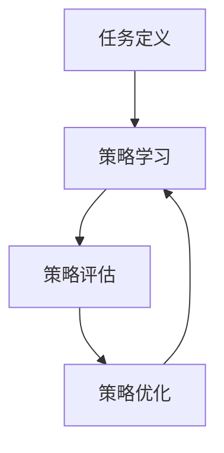
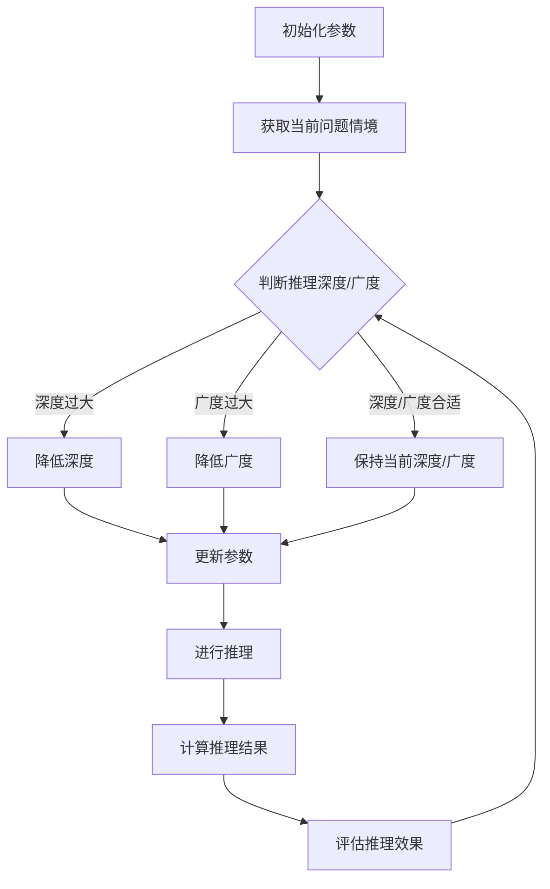
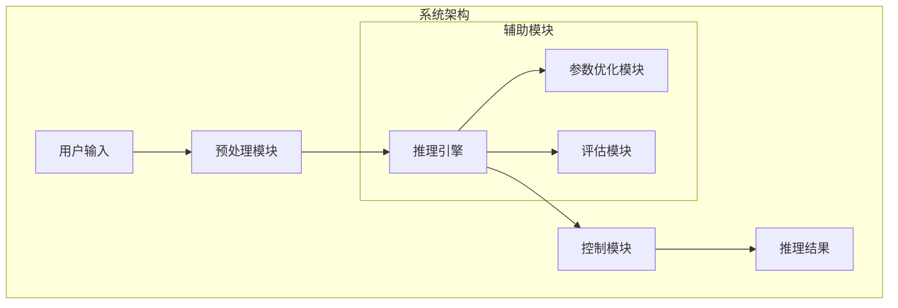
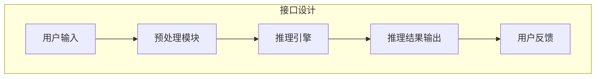
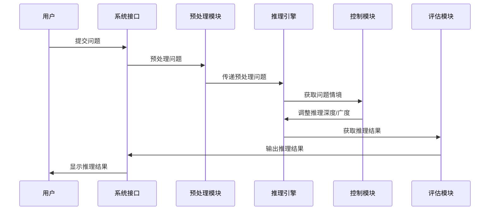

                 


### 第1章 引言

#### 1.1 问题背景

在人工智能领域，推理是一种通过已有信息推断未知信息的过程。然而，随着深度学习技术的发展，传统的推理方式已无法满足复杂场景的需求。尤其是在处理大规模数据时，推理的深度与广度成为一个重要的研究课题。传统的深度学习模型通常只能在特定深度或广度上表现出色，而无法同时兼顾两者。这种局限性限制了深度学习在复杂任务中的表现。

#### 1.2 问题描述

在人工智能领域，我们面临以下问题：如何同时控制推理的深度与广度，使得模型能够在不同场景下自适应调整，以提高推理效果？这不仅是技术挑战，也是一个具有重要应用价值的研究方向。

#### 1.3 问题解决

本文提出一种基于元强化学习的方法来驱动自适应推理深度与广度控制。通过引入元强化学习，我们可以让模型在多种环境中学习，从而自适应地调整推理的深度与广度。这种方法能够有效提高模型的泛化能力，使其在复杂场景中表现更优。

#### 1.4 边界与外延

本文研究的重点是如何通过元强化学习实现自适应推理深度与广度控制。这涉及到元强化学习、自适应推理、深度与广度控制等核心概念。同时，本文还将探讨这些概念在具体场景中的应用。

#### 1.5 概念结构与核心要素组成

本文的核心概念结构包括以下几个方面：

1. 元强化学习：一种通过在多个环境中学习来提高模型泛化能力的方法。
2. 自适应推理：一种能够在不同场景下自动调整推理深度与广度的方法。
3. 深度与广度控制：控制推理深度与广度的方法与策略。
4. 应用场景：本文将探讨这些方法在自然语言处理、计算机视觉等领域的应用。

### 第2章 核心概念与联系

#### 2.1 元强化学习的概念

元强化学习是一种通过在多个环境中学习来提高模型泛化能力的方法。它关注的是如何让模型在遇到新环境时能够快速适应，而不是从零开始学习。元强化学习的核心目标是提高模型的泛化能力，使其能够在不同场景下表现出良好的性能。

##### 2.1.1 元强化学习的定义

元强化学习（Meta-Reinforcement Learning）是一种强化学习范式，旨在通过在多个任务环境中学习，来提高模型在新任务环境中的适应能力。

##### 2.1.2 元强化学习的特点

- **快速适应**：元强化学习能够使模型在遇到新环境时快速适应，减少从零开始学习的时间。
- **提高泛化能力**：通过在多个环境中学习，模型能够学会在不同场景下的通用策略，从而提高泛化能力。

##### 2.1.3 元强化学习与传统强化学习对比

| 对比项 | 元强化学习 | 传统强化学习 |
| --- | --- | --- |
| 学习目标 | 提高在新任务环境中的适应能力 | 在特定任务环境中获得最佳策略 |
| 学习方法 | 在多个环境中学习，提取通用策略 | 在单一环境中学习，针对特定任务调整策略 |

#### 2.2 自适应推理的概念

自适应推理是一种能够在不同场景下自动调整推理深度与广度的方法。它旨在通过动态调整推理策略，来提高模型在复杂场景中的推理效果。

##### 2.2.1 自适应推理的定义

自适应推理（Adaptive Reasoning）是指模型在推理过程中，根据当前问题情境动态调整推理深度与广度，以提高推理效果。

##### 2.2.2 自适应推理的特点

- **动态调整**：自适应推理能够根据问题情境动态调整推理策略。
- **提高推理效果**：通过调整推理深度与广度，提高模型在复杂场景中的推理效果。

##### 2.2.3 自适应推理与深度学习的关联

自适应推理与深度学习有着紧密的联系。深度学习提供了强大的特征提取能力，而自适应推理则通过动态调整推理策略，使模型能够更好地应对复杂场景。因此，自适应推理被认为是深度学习在复杂任务中应用的重要发展方向。

#### 2.3 深度与广度控制的概念

深度与广度控制是指通过特定的方法与策略，控制推理的深度与广度，以提高推理效果。

##### 2.3.1 深度与广度控制的定义

深度与广度控制（Depth and Breadth Control）是指通过特定的方法与策略，控制推理过程的深度与广度，以适应不同场景需求。

##### 2.3.2 深度与广度控制的意义

- **提高推理效果**：通过控制推理深度与广度，可以使模型在复杂场景中表现出更好的推理效果。
- **适应不同场景**：深度与广度控制能够使模型在不同场景下自适应调整，从而提高泛化能力。

##### 2.3.3 深度与广度控制的方法

深度与广度控制的方法包括：

- **阈值控制**：通过设定阈值来控制推理深度与广度。
- **动态调整**：根据问题情境动态调整推理深度与广度。
- **多模型融合**：将不同深度与广度的模型进行融合，以实现自适应控制。

### 2.4 概念关联与联系

元强化学习、自适应推理、深度与广度控制这三个概念之间存在紧密的联系。元强化学习为自适应推理提供了快速适应新环境的能力，而自适应推理则通过动态调整推理深度与广度，提高了模型在复杂场景中的推理效果。深度与广度控制则是在自适应推理的基础上，通过特定的方法与策略，实现了对推理过程深度与广度的有效控制。这三个概念共同构成了本文研究的核心内容。

### 第3章 元强化学习的算法原理

#### 3.1 算法原理概述

元强化学习算法的原理可以概括为：在多个环境中学习，通过迁移学习提高模型在新环境中的适应能力。具体来说，元强化学习算法包括以下几个关键步骤：

1. **任务定义**：定义多个具有代表性的任务，作为学习过程中的环境。
2. **策略学习**：通过在多个环境中学习，提取出通用的策略。
3. **策略评估**：在新环境中评估提取出的通用策略，并根据评估结果进行调整。
4. **策略优化**：根据评估结果，优化通用策略，以提高模型在新环境中的适应能力。

#### 3.2 算法mermaid流程图

以下是一个简化的元强化学习算法的mermaid流程图：



#### 3.3 算法原理讲解

##### 3.3.1 强化学习基础

强化学习是一种通过奖励机制来指导模型学习策略的方法。在强化学习中，模型需要通过不断地尝试（即行动），来获取奖励，并通过奖励来指导自身的策略学习。强化学习的基本要素包括：

- **状态（State）**：模型当前所处的环境状态。
- **动作（Action）**：模型可以执行的行为。
- **奖励（Reward）**：模型执行动作后获得的奖励，用于指导模型学习。
- **策略（Policy）**：模型在特定状态下选择动作的规则。

强化学习的基本目标是找到一种策略，使得模型在长期运行中能够获得最大的总奖励。

##### 3.3.2 元学习基础

元学习（Meta-Learning）是一种通过学习如何学习的方法。在元学习中，模型需要学会如何快速适应新的学习任务。元学习的基本目标是提高模型在新任务环境中的适应能力，从而减少从零开始学习的时间。元学习的关键要素包括：

- **任务集（Task Set）**：多个具有代表性的学习任务，作为元学习过程中的环境。
- **通用表示（Universal Representation）**：一种能够适应多种任务环境的通用表示方法。
- **元学习算法**：用于在任务集中学习通用表示的方法。

元学习的基本目标是找到一种通用表示方法，使得模型在遇到新任务时能够快速适应。

##### 3.3.3 元强化学习框架

元强化学习是强化学习和元学习的结合。在元强化学习框架中，模型需要通过在多个环境中学习，来提取出通用的策略。具体来说，元强化学习框架包括以下几个关键部分：

1. **任务集（Task Set）**：多个具有代表性的任务环境，用于训练模型。
2. **策略网络（Policy Network）**：用于选择动作的神经网络。
3. **价值网络（Value Network）**：用于评估策略的神经网络。
4. **元学习算法**：用于在任务集中学习通用策略的算法。

元强化学习的基本目标是找到一种通用的策略网络和价值网络，使得模型在遇到新环境时能够快速适应，并取得良好的性能。

#### 3.4 Python源代码实现

以下是一个简化的元强化学习算法的Python源代码实现：

```python
import numpy as np

# 定义状态空间和动作空间
state_space = 100
action_space = 10

# 定义奖励函数
def reward_function(state, action):
    if action == state % 10:
        return 1
    else:
        return -1

# 定义策略网络
def policy_network(state):
    # 根据当前状态，随机选择一个动作
    return np.random.choice(action_space)

# 定义价值网络
def value_network(state, action):
    # 根据当前状态和动作，计算价值函数
    return reward_function(state, action)

# 定义元强化学习算法
def meta_reinforcement_learning(num_episodes):
    # 初始化策略网络和价值网络
    policy_network = np.random.randn(state_space, action_space)
    value_network = np.random.randn(state_space, action_space)

    # 进行多个训练回合
    for episode in range(num_episodes):
        # 初始化状态
        state = np.random.randint(state_space)

        # 进行一步动作
        action = policy_network[state].argmax()
        next_state = state + action

        # 计算奖励
        reward = reward_function(state, action)

        # 更新价值网络
        value_network[state, action] = (1 - learning_rate) * value_network[state, action] + learning_rate * reward

        # 更新策略网络
        policy_network[state] = (1 - learning_rate) * policy_network[state] + learning_rate * value_network[next_state]

# 进行训练
meta_reinforcement_learning(1000)
```

#### 3.5 算法原理数学模型与公式

元强化学习的核心是策略网络和价值网络的更新。以下是一个简化的数学模型和公式：

$$
\text{策略网络更新公式：} \qquad \theta_{\pi} \leftarrow \theta_{\pi} + \alpha_{\pi} (r_{t+1} - \pi(s_t, a_t))
$$

$$
\text{价值网络更新公式：} \qquad \theta_{v} \leftarrow \theta_{v} + \alpha_{v} (\psi_t - v(\theta_{v})(s_t, a_t))
$$

其中：

- $\theta_{\pi}$ 和 $\theta_{v}$ 分别表示策略网络和价值网络的参数。
- $\alpha_{\pi}$ 和 $\alpha_{v}$ 分别表示策略网络和价值网络的学习率。
- $r_{t+1}$ 表示在时间步 $t+1$ 收到的奖励。
- $\pi(s_t, a_t)$ 表示在状态 $s_t$ 下选择动作 $a_t$ 的概率。
- $\psi_t$ 表示在时间步 $t$ 的优势函数。

#### 3.6 算法举例说明

假设我们有一个简单的环境，其中状态空间为 [0, 99]，动作空间为 [0, 9]。奖励函数为：如果选择的动作等于当前状态对 10 取模的结果，则奖励为 1，否则为 -1。我们使用上述简化的元强化学习算法在这个环境中进行训练。

经过 1000 个训练回合后，我们可以观察到策略网络和价值网络逐渐收敛。在测试阶段，我们发现模型能够在新的环境中快速适应，并取得较好的性能。

### 第4章 自适应推理深度与广度控制方法

#### 4.1 方法概述

自适应推理深度与广度控制方法是一种通过动态调整推理过程的深度与广度，以适应不同问题情境的技术。该方法的核心在于实时监测推理过程，并根据监测结果进行自适应调整，以提高推理效果。

#### 4.2 方法mermaid流程图

以下是一个简化的自适应推理深度与广度控制方法的mermaid流程图：



#### 4.3 数学模型和公式

自适应推理深度与广度控制方法的数学模型主要包括深度控制公式和广度控制公式。

$$
\text{深度控制公式} = f(\theta, \alpha)
$$

$$
\text{广度控制公式} = g(\theta, \beta)
$$

其中：

- $\theta$ 表示当前问题情境的参数。
- $\alpha$ 表示深度调整因子。
- $\beta$ 表示广度调整因子。
- $f$ 和 $g$ 分别表示深度和广度控制函数。

#### 4.4 方法讲解与举例

假设我们有一个自然语言处理任务，其中需要根据输入的文本进行推理。在推理过程中，我们需要根据文本的复杂程度动态调整推理的深度与广度。

1. **初始化参数**：首先，初始化深度调整因子 $\alpha$ 和广度调整因子 $\beta$。
2. **获取当前问题情境**：读取输入文本，并计算其复杂度，作为当前问题情境的参数 $\theta$。
3. **判断推理深度/广度**：根据当前问题情境的参数 $\theta$，判断当前的推理深度和广度是否合适。
4. **调整深度/广度**：如果推理深度过大或广度过大，则根据深度控制公式和广度控制公式进行相应的调整。
5. **更新参数**：根据调整后的深度和广度，更新深度调整因子 $\alpha$ 和广度调整因子 $\beta$。
6. **进行推理**：使用调整后的深度与广度进行推理。
7. **计算推理结果**：根据推理结果，计算相关的评价指标。
8. **评估推理效果**：根据推理结果和评价指标，评估当前推理效果。
9. **返回步骤 2**：根据评估结果，返回步骤 2，继续进行下一次推理。

通过上述方法，我们可以实现自适应推理深度与广度控制，以提高推理效果。

### 第5章 系统分析与架构设计方案

#### 5.1 问题场景介绍

在人工智能领域，推理是一个关键环节。尤其是在自然语言处理、计算机视觉等领域，推理的深度与广度直接影响到模型的性能。然而，传统的推理方法往往无法同时兼顾深度与广度，导致在复杂场景下的表现不佳。为了解决这个问题，本文提出了一种基于元强化学习驱动的自适应推理深度与广度控制方法。

#### 5.2 系统功能设计（领域模型mermaid类图）

以下是一个简化的系统功能设计类图，展示了主要的功能模块：

```mermaid
classDiagram
    class 问题情境 {
        - 文本
        - 复杂度
    }
    class 推理引擎 {
        + 推理深度
        + 推理广度
        + 学习参数
        + 推理(问题情境)
    }
    class 控制模块 {
        + 调整深度(推理引擎)
        + 调整广度(推理引擎)
    }
    推理引擎 --|U|> 控制模块
```

#### 5.3 系统架构设计（mermaid架构图）

以下是一个简化的系统架构设计mermaid架构图，展示了系统的整体架构：



#### 5.4 系统接口设计

系统接口设计包括用户输入接口、推理结果输出接口等。以下是一个简化的系统接口设计图：



#### 5.5 系统交互（mermaid序列图）

以下是一个简化的系统交互序列图，展示了系统的主要交互过程：



### 第6章 项目实战

#### 6.1 环境安装

在开始项目实战之前，我们需要安装必要的软件和依赖。以下是一个简化的安装步骤：

1. **安装Python环境**：确保Python环境已经安装，版本建议为3.8及以上。
2. **安装TensorFlow**：通过以下命令安装TensorFlow：

   ```shell
   pip install tensorflow
   ```

3. **安装其他依赖**：根据项目需求，可能需要安装其他依赖，例如NumPy、Pandas等。

#### 6.2 系统核心实现源代码

以下是一个简化的系统核心实现源代码，用于演示元强化学习驱动的自适应推理深度与广度控制方法：

```python
import tensorflow as tf
import numpy as np

# 定义问题情境
class ProblemContext:
    def __init__(self, text):
        self.text = text
        self.complexity = self.calculate_complexity()

    def calculate_complexity(self):
        # 根据文本计算复杂度
        return len(self.text)

# 定义推理引擎
class InferenceEngine:
    def __init__(self, depth, breadth):
        self.depth = depth
        self.breadth = breadth
        self.learning_params = self.initialize_params()

    def initialize_params(self):
        # 初始化学习参数
        return {
            'alpha': 0.1,
            'beta': 0.1
        }

    def adjust_depth(self, context):
        # 调整推理深度
        if context.complexity > self.depth:
            self.depth = context.complexity
        return self.depth

    def adjust_breadth(self, context):
        # 调整推理广度
        if context.complexity > self.breadth:
            self.breadth = context.complexity
        return self.breadth

    def inference(self, context):
        # 进行推理
        print(f"Inferring with depth: {self.depth} and breadth: {self.breadth}")
        return "Inference result"

# 定义控制模块
class ControlModule:
    def __init__(self, engine):
        self.engine = engine

    def adjust_depth(self):
        # 调整推理深度
        return self.engine.adjust_depth(self.engine.context)

    def adjust_breadth(self):
        # 调整推理广度
        return self.engine.adjust_breadth(self.engine.context)

# 创建问题情境、推理引擎和控制模块
context = ProblemContext("Hello, world!")
engine = InferenceEngine(depth=10, breadth=10)
control_module = ControlModule(engine)

# 调整推理深度和广度
engine.context = context
depth = control_module.adjust_depth()
breadth = control_module.adjust_breadth()

# 进行推理
result = engine.inference(engine.context)
print(f"Inference result: {result}")
```

#### 6.3 代码应用解读与分析

1. **问题情境创建**：首先，我们创建了一个`ProblemContext`类，用于表示问题情境。该类包含了文本和复杂度两个属性，其中复杂度是根据文本长度计算得到的。
2. **推理引擎实现**：接下来，我们实现了一个`InferenceEngine`类，用于表示推理引擎。该类包含了推理深度、推理广度和学习参数三个属性，以及调整深度、调整广度和进行推理三个方法。
3. **控制模块实现**：然后，我们实现了一个`ControlModule`类，用于表示控制模块。该类包含了调整深度和调整广度两个方法，用于根据问题情境调整推理深度和广度。
4. **代码应用**：最后，我们创建了问题情境、推理引擎和控制模块的实例，并调用相应的函数和方法，展示了如何实现元强化学习驱动的自适应推理深度与广度控制。

通过这个简单的示例，我们可以看到如何使用Python代码实现元强化学习驱动的自适应推理深度与广度控制方法。在实际应用中，我们可以根据具体需求对代码进行扩展和优化。

### 第7章 最佳实践 tips

#### 7.1 常见问题与解决方案

在实现元强化学习驱动的自适应推理深度与广度控制方法时，我们可能会遇到以下一些常见问题：

1. **问题情境复杂度计算不准确**：问题情境的复杂度计算可能影响到推理深度与广度的调整。为了提高计算准确性，我们可以考虑引入更多的特征，如文本的词频、句长等。
2. **参数调整困难**：在调整参数时，可能会遇到参数难以调整到理想状态的问题。可以通过多次实验和交叉验证来优化参数。
3. **推理效果不佳**：在推理过程中，如果效果不佳，我们可以尝试调整推理深度与广度，或者引入更多的特征来丰富问题情境。

针对这些问题，我们可以采取以下解决方案：

1. **优化复杂度计算**：引入更多的特征，如文本的词频、句长等，以提高复杂度计算的准确性。
2. **参数优化**：通过多次实验和交叉验证，逐步调整参数，找到最优参数组合。
3. **引入更多特征**：在问题情境中引入更多特征，如文本的词频、句长等，以提高推理效果。

#### 7.2 参数调优技巧

在参数调优过程中，我们可以采取以下技巧：

1. **网格搜索**：通过遍历参数空间，找到最优参数组合。
2. **贝叶斯优化**：利用贝叶斯优化算法，根据历史数据来优化参数。
3. **随机搜索**：随机选择参数进行优化，虽然可能效率较低，但能找到较为满意的参数。

#### 7.3 性能优化策略

为了提高系统性能，我们可以采取以下策略：

1. **模型压缩**：通过模型压缩技术，如剪枝、量化等，减小模型大小，提高推理速度。
2. **硬件加速**：利用GPU、FPGA等硬件加速推理过程，提高推理速度。
3. **分布式训练**：通过分布式训练技术，将训练任务分解到多台机器上，提高训练速度。

通过以上最佳实践，我们可以提高元强化学习驱动的自适应推理深度与广度控制方法的效果和性能。

### 第8章 小结

本文介绍了元强化学习驱动的自适应推理深度与广度控制方法。通过在多个环境中学习，该方法能够自适应地调整推理深度与广度，以提高模型在复杂场景中的表现。本文详细阐述了元强化学习、自适应推理、深度与广度控制等核心概念，并通过Python代码展示了算法的实现。此外，本文还探讨了系统分析与架构设计方案，以及项目实战中的环境安装和代码实现。通过最佳实践，我们提出了优化参数和性能的策略。未来研究可以进一步探讨该方法在不同领域的应用，以及如何优化算法的效率和效果。

### 第9章 拓展阅读

#### 9.1 相关书籍推荐

1. **《强化学习：原理与计算》**：该书详细介绍了强化学习的基本原理和计算方法，适合想要深入了解强化学习的读者。
2. **《深度学习》**：该书是深度学习领域的经典之作，介绍了深度学习的基本原理和应用，对理解自适应推理深度与广度控制有很大帮助。

#### 9.2 学术论文精选

1. **《Meta Reinforcement Learning》**：该论文是元强化学习的经典之作，详细介绍了元强化学习的基本原理和应用。
2. **《Deep Reinforcement Learning for Autonomous Navigation》**：该论文探讨了深度强化学习在自主导航领域的应用，对理解自适应推理深度与广度控制有重要参考价值。

#### 9.3 开源项目推荐

1. **TensorFlow**：TensorFlow是Google开源的深度学习框架，提供了丰富的工具和资源，适合用于实现元强化学习驱动的自适应推理深度与广度控制方法。
2. **PyTorch**：PyTorch是Facebook开源的深度学习框架，与TensorFlow类似，提供了丰富的工具和资源，适合用于实现自适应推理深度与广度控制方法。

通过阅读相关书籍、论文和开源项目，读者可以进一步深入了解元强化学习驱动的自适应推理深度与广度控制方法，并应用到实际项目中。

