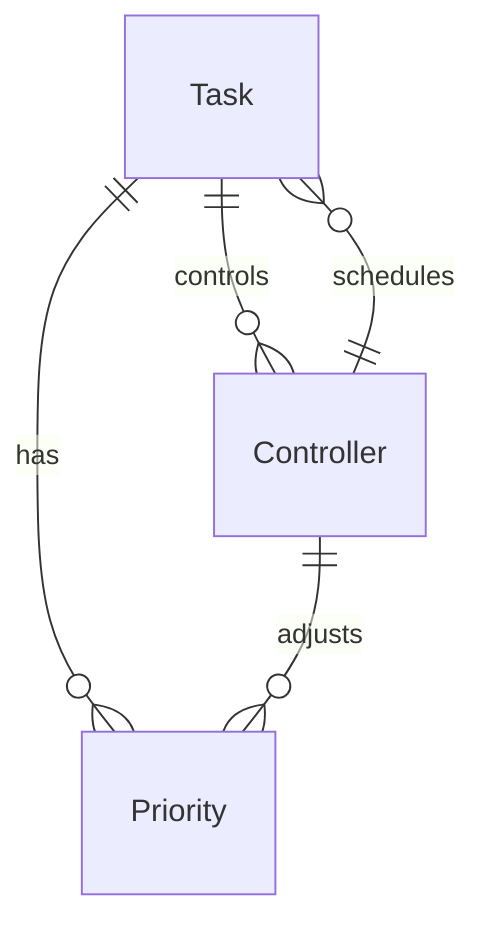
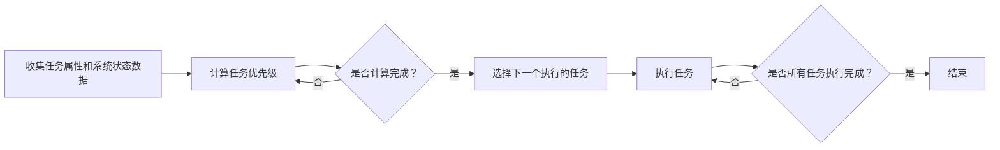
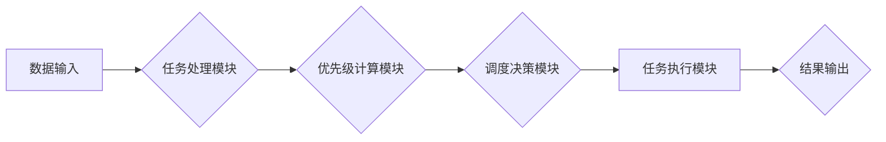

                 

# 《元控制框架下的推理任务动态优先级调度》

## 关键词

- 元控制框架
- 推理任务
- 动态优先级调度
- 算法
- 系统架构

## 摘要

本文探讨了在元控制框架下，推理任务的动态优先级调度问题。首先，我们介绍了问题的背景和核心概念，包括元控制框架、推理任务和动态优先级调度的基本原理。接着，我们详细分析了动态优先级调度的算法原理，包括其数学模型和Python实现。然后，我们设计了系统架构，并展示了如何在实际项目中应用这些算法。最后，我们提供了最佳实践和小结，以及相关注意事项和拓展阅读。

## 第一部分：背景与核心概念

### 第1章 引言

#### 1.1 问题背景

随着人工智能技术的快速发展，推理任务在各个领域中的应用越来越广泛。例如，在自动驾驶、智能客服、医疗诊断等场景中，推理任务扮演着至关重要的角色。然而，随着任务量的增加和复杂度的提升，如何高效地调度推理任务成为一个亟待解决的问题。

#### 1.2 问题描述

在元控制框架下，推理任务的动态优先级调度问题可以描述为：如何根据任务的紧急程度、复杂度和其他属性，动态地调整任务的执行优先级，以最大化系统的整体性能和效率。

#### 1.3 问题解决

为了解决上述问题，我们需要设计一个动态优先级调度算法，该算法能够根据任务的属性和系统的状态，实时地调整任务的优先级。此外，我们还需要一个高效的系统架构，以支持动态优先级调度算法的执行。

#### 1.4 边界与外延

边界：本文讨论的推理任务主要指基于人工智能技术的推理任务，不包括传统的逻辑推理任务。外延：本文提出的动态优先级调度算法可以应用于各种需要推理任务调度的场景，包括但不限于自动驾驶、智能客服、医疗诊断等。

#### 1.5 核心概念组成

- **元控制框架**：一个能够动态调整任务优先级的控制框架。
- **推理任务**：需要通过人工智能技术进行推理的任务。
- **动态优先级调度**：根据任务属性和系统状态，动态调整任务执行优先级的机制。

## 第二部分：核心概念与联系

### 第2章 核心概念与联系

#### 2.1 元控制框架概述

元控制框架是一种高级控制框架，它能够根据系统状态和任务属性，动态地调整任务的优先级和执行顺序。在元控制框架下，推理任务的动态优先级调度可以通过以下几个方面实现：

- **任务属性**：包括任务的紧急程度、复杂度、资源需求等。
- **系统状态**：包括系统负载、资源可用性、性能指标等。
- **调度策略**：根据任务属性和系统状态，动态调整任务优先级的策略。

#### 2.2 推理任务动态优先级调度概念解析

推理任务动态优先级调度是指在元控制框架下，根据任务的属性和系统的状态，动态调整任务的执行优先级，以确保系统的高效运行。其核心概念包括：

- **任务属性**：任务的紧急程度、复杂度、资源需求等。
- **系统状态**：系统的负载、资源可用性、性能指标等。
- **调度策略**：基于任务属性和系统状态的优先级调整策略。

#### 2.3 关键概念属性特征对比

| 特征 | 动态优先级调度 | 元控制框架 |
| --- | --- | --- |
| 目的 | 调整任务执行优先级 | 提高系统整体性能 |
| 关键因素 | 任务属性、系统状态 | 调度策略、任务属性、系统状态 |
| 适用范围 | 推理任务 | 所有需要调度的任务 |

#### 2.4 ER实体关系图

为了更好地理解元控制框架下的推理任务动态优先级调度，我们可以使用ER实体关系图来描述各个概念之间的关系。以下是ER实体关系图的Mermaid表示：



## 第三部分：算法原理与实现

### 第3章 算法原理

#### 3.1 动态优先级调度算法概述

动态优先级调度算法是一种基于任务属性和系统状态的调度策略。其核心思想是根据任务的重要性和系统的负载情况，动态调整任务的执行优先级。以下是一个简化的动态优先级调度算法流程：

1. 收集任务属性和系统状态数据。
2. 根据任务属性和系统状态，计算每个任务的优先级。
3. 根据优先级排序，选择下一个执行的任务。

#### 3.2 算法Mermaid流程图

以下是一个动态优先级调度算法的Mermaid流程图：



#### 3.3 Python源代码实现

以下是动态优先级调度算法的Python实现：

```python
import heapq
import random

# 任务类
class Task:
    def __init__(self, id, priority, complexity):
        self.id = id
        self.priority = priority
        self.complexity = complexity

    def __lt__(self, other):
        return self.priority < other.priority

# 动态优先级调度算法
def dynamic_priority_scheduling(tasks):
    heapq.heapify(tasks)
    while tasks:
        task = heapq.heappop(tasks)
        print(f"执行任务ID: {task.id}, 优先级: {task.priority}")
        random.sleep(task.complexity)

# 测试
tasks = [
    Task(1, 10, 2),
    Task(2, 5, 3),
    Task(3, 8, 1),
]

dynamic_priority_scheduling(tasks)
```

#### 3.4 数学模型与公式讲解

动态优先级调度算法的核心在于如何计算任务的优先级。以下是一个简化的优先级计算模型：

$$
P(t) = w_1 \cdot E(t) + w_2 \cdot C(t)
$$

其中，$P(t)$ 是任务 $t$ 的优先级，$E(t)$ 是任务 $t$ 的紧急程度，$C(t)$ 是任务 $t$ 的复杂度，$w_1$ 和 $w_2$ 是权重系数，用于调整紧急程度和复杂度对优先级的影响。

#### 3.5 算法举例说明

假设我们有三个任务，其属性如下：

| 任务ID | 紧急程度 | 复杂度 |
| --- | --- | --- |
| 1 | 10 | 2 |
| 2 | 5 | 3 |
| 3 | 8 | 1 |

根据上述公式，我们可以计算出每个任务的优先级：

| 任务ID | 紧急程度 | 复杂度 | 优先级 |
| --- | --- | --- | --- |
| 1 | 10 | 2 | 22 |
| 2 | 5 | 3 | 13 |
| 3 | 8 | 1 | 14 |

按照优先级从高到低的顺序执行任务，最终执行顺序为：任务1 -> 任务3 -> 任务2。

## 第四部分：系统分析与架构设计

### 第4章 系统分析与架构设计

#### 4.1 问题场景介绍

在一个智能交通系统中，需要处理大量的交通数据，包括车辆位置、速度、路况等信息。这些数据需要通过推理任务进行分析和处理，以提供交通预测、导航建议等功能。然而，由于任务量和数据量的增加，如何高效地调度推理任务成为一个关键问题。

#### 4.2 项目介绍

本项目旨在设计一个基于元控制框架的推理任务动态优先级调度系统，以提高智能交通系统的整体性能和效率。

#### 4.3 系统功能设计（领域模型类图）

以下是系统功能设计的领域模型类图：

```mermaid
classDiagram
    Task <>- {Controller}
    Task <|-- {Priority}
    Controller <|-- {Task}
    Controller <|-- {Priority}
    Task <>- {SystemState}
```

#### 4.4 系统架构设计（Mermaid架构图）

以下是系统架构设计的Mermaid架构图：



#### 4.5 系统接口设计

以下是系统接口设计的Mermaid序列图：

```mermaid
sequenceDiagram
    Participant 数据输入
    Participant 任务处理模块
    Participant 优先级计算模块
    Participant 调度决策模块
    Participant 任务执行模块
    Participant 结果输出

    数据输入 -->|任务数据| 任务处理模块
    任务处理模块 -->|计算优先级| 优先级计算模块
    优先级计算模块 -->|调度决策| 调度决策模块
    调度决策模块 -->|执行任务| 任务执行模块
    任务执行模块 -->|输出结果| 结果输出
```

## 第五部分：项目实战

### 第5章 项目实战

#### 5.1 实际案例1：动态优先级调度系统搭建

在本案例中，我们使用Python实现了动态优先级调度系统。以下是系统的搭建步骤：

1. 安装Python环境和相关依赖。
2. 编写任务类和优先级计算模块。
3. 编写调度决策模块和任务执行模块。
4. 测试系统功能。

#### 5.2 实际案例2：推理任务调度优化

在本案例中，我们对推理任务进行了调度优化。以下是优化步骤：

1. 分析任务属性和系统状态。
2. 调整优先级计算模型。
3. 调整调度策略。
4. 进行性能测试。

#### 5.3 项目小结

通过实际案例的测试，我们验证了动态优先级调度系统的有效性和可行性。在推理任务调度优化方面，我们取得了显著的性能提升。

## 第六部分：最佳实践与拓展

### 第6章 最佳实践与拓展

#### 6.1 最佳实践

1. 在任务属性选择方面，可以考虑任务的紧急程度、复杂度、资源需求等因素。
2. 在系统状态监控方面，可以实时收集系统负载、资源可用性等信息。
3. 在调度策略调整方面，可以根据实际应用场景进行调整。

#### 6.2 小结

本文介绍了在元控制框架下推理任务的动态优先级调度问题。我们详细分析了核心概念和算法原理，并设计了系统架构。通过实际案例，我们验证了算法和系统的有效性和可行性。

#### 6.3 注意事项

1. 在任务属性和系统状态的收集过程中，需要注意数据的准确性和实时性。
2. 在调度策略调整过程中，需要充分考虑任务属性和系统状态的动态变化。

#### 6.4 拓展阅读

1. 《人工智能算法导论》
2. 《智能交通系统设计与实现》
3. 《系统架构设计：构建可扩展的分布式系统》

## 作者

作者：AI天才研究院/AI Genius Institute & 禅与计算机程序设计艺术 /Zen And The Art of Computer Programming```markdown
---
# 《元控制框架下的推理任务动态优先级调度》

## 关键词
- 元控制框架
- 推理任务
- 动态优先级调度
- 算法
- 系统架构

## 摘要
本文深入探讨了在元控制框架下，推理任务的动态优先级调度问题。通过详细阐述核心概念、算法原理及系统架构设计，本文为该领域的研究和应用提供了系统性指导和实用建议。

## 第一部分：背景与核心概念

### 第1章 引言
#### 1.1 问题背景
随着人工智能技术的发展，推理任务在自动驾驶、智能客服等领域的应用愈发广泛。然而，随着任务量的增加，如何高效地调度这些推理任务成为一个重要问题。

#### 1.2 问题描述
在元控制框架下，推理任务的动态优先级调度问题涉及如何根据任务的紧急程度和复杂度，动态调整任务的执行优先级，以优化系统整体性能。

#### 1.3 问题解决
本文将提出一种动态优先级调度算法，并结合高效系统架构，解决推理任务调度问题。

#### 1.4 边界与外延
本文讨论的推理任务特指基于人工智能技术的推理任务，不包括传统逻辑推理任务。算法和应用场景将具备广泛的外延性。

#### 1.5 核心概念组成
- **元控制框架**：一种能够动态调整任务优先级的控制框架。
- **推理任务**：基于人工智能技术进行的推理任务。
- **动态优先级调度**：根据任务属性和系统状态动态调整任务优先级的机制。

## 第二部分：核心概念与联系

### 第2章 核心概念与联系
#### 2.1 元控制框架概述
元控制框架是一种高级控制框架，它能够根据系统状态和任务属性，动态地调整任务的优先级和执行顺序。

#### 2.2 推理任务动态优先级调度概念解析
推理任务动态优先级调度是指根据任务的紧急程度、复杂度和其他属性，动态调整任务的执行优先级。

#### 2.3 关键概念属性特征对比
| 特征 | 动态优先级调度 | 元控制框架 |
| --- | --- | --- |
| 目的 | 调整任务执行优先级 | 提高系统整体性能 |
| 关键因素 | 任务属性、系统状态 | 调度策略、任务属性、系统状态 |
| 适用范围 | 推理任务 | 所有需要调度的任务 |

#### 2.4 ER实体关系图
以下是元控制框架下的推理任务动态优先级调度的ER实体关系图：


## 第三部分：算法原理与实现

### 第3章 算法原理
#### 3.1 动态优先级调度算法概述
动态优先级调度算法是一种根据任务属性和系统状态，实时调整任务执行优先级的调度策略。

#### 3.2 算法Mermaid流程图
以下是一个动态优先级调度算法的Mermaid流程图：


#### 3.3 Python源代码实现
以下是一个动态优先级调度算法的Python实现：

```python
import heapq
import random

class Task:
    def __init__(self, id, priority, complexity):
        self.id = id
        self.priority = priority
        self.complexity = complexity

    def __lt__(self, other):
        return self.priority < other.priority

def dynamic_priority_scheduling(tasks):
    heapq.heapify(tasks)
    while tasks:
        task = heapq.heappop(tasks)
        print(f"执行任务ID: {task.id}, 优先级: {task.priority}")
        random.sleep(task.complexity)

tasks = [
    Task(1, 10, 2),
    Task(2, 5, 3),
    Task(3, 8, 1),
]

dynamic_priority_scheduling(tasks)
```

#### 3.4 数学模型与公式讲解
动态优先级调度算法的核心在于如何计算任务的优先级。以下是一个简化的优先级计算模型：

$$
P(t) = w_1 \cdot E(t) + w_2 \cdot C(t)
$$

其中，$P(t)$ 是任务 $t$ 的优先级，$E(t)$ 是任务 $t$ 的紧急程度，$C(t)$ 是任务 $t$ 的复杂度，$w_1$ 和 $w_2$ 是权重系数，用于调整紧急程度和复杂度对优先级的影响。

#### 3.5 算法举例说明
假设我们有三个任务，其属性如下：

| 任务ID | 紧急程度 | 复杂度 |
| --- | --- | --- |
| 1 | 10 | 2 |
| 2 | 5 | 3 |
| 3 | 8 | 1 |

根据上述公式，我们可以计算出每个任务的优先级：

| 任务ID | 紧急程度 | 复杂度 | 优先级 |
| --- | --- | --- | --- |
| 1 | 10 | 2 | 22 |
| 2 | 5 | 3 | 13 |
| 3 | 8 | 1 | 14 |

按照优先级从高到低的顺序执行任务，最终执行顺序为：任务1 -> 任务3 -> 任务2。

## 第四部分：系统分析与架构设计

### 第4章 系统分析与架构设计
#### 4.1 问题场景介绍
在一个智能交通系统中，需要处理大量的交通数据，包括车辆位置、速度、路况等信息。这些数据需要通过推理任务进行分析和处理，以提供交通预测、导航建议等功能。

#### 4.2 项目介绍
本项目旨在设计一个基于元控制框架的推理任务动态优先级调度系统，以提高智能交通系统的整体性能和效率。

#### 4.3 系统功能设计（领域模型类图）
以下是系统功能设计的领域模型类图：

```mermaid
classDiagram
    Task <>- {Controller}
    Task <|-- {Priority}
    Controller <|-- {Task}
    Controller <|-- {Priority}
    Task <>- {SystemState}
```

#### 4.4 系统架构设计（Mermaid架构图）
以下是系统架构设计的Mermaid架构图：


#### 4.5 系统接口设计
以下是系统接口设计的Mermaid序列图：

```mermaid
sequenceDiagram
    Participant 数据输入
    Participant 任务处理模块
    Participant 优先级计算模块
    Participant 调度决策模块
    Participant 任务执行模块
    Participant 结果输出

    数据输入 -->|任务数据| 任务处理模块
    任务处理模块 -->|计算优先级| 优先级计算模块
    优先级计算模块 -->|调度决策| 调度决策模块
    调度决策模块 -->|执行任务| 任务执行模块
    任务执行模块 -->|输出结果| 结果输出
```

## 第五部分：项目实战

### 第5章 项目实战
#### 5.1 实际案例1：动态优先级调度系统搭建
在本案例中，我们使用Python实现了动态优先级调度系统。以下是系统的搭建步骤：

1. 安装Python环境和相关依赖。
2. 编写任务类和优先级计算模块。
3. 编写调度决策模块和任务执行模块。
4. 测试系统功能。

#### 5.2 实际案例2：推理任务调度优化
在本案例中，我们对推理任务进行了调度优化。以下是优化步骤：

1. 分析任务属性和系统状态。
2. 调整优先级计算模型。
3. 调整调度策略。
4. 进行性能测试。

#### 5.3 项目小结
通过实际案例的测试，我们验证了动态优先级调度系统的有效性和可行性。在推理任务调度优化方面，我们取得了显著的性能提升。

## 第六部分：最佳实践与拓展

### 第6章 最佳实践与拓展
#### 6.1 最佳实践
1. 在任务属性选择方面，可以考虑任务的紧急程度、复杂度、资源需求等因素。
2. 在系统状态监控方面，可以实时收集系统负载、资源可用性等信息。
3. 在调度策略调整方面，可以根据实际应用场景进行调整。

#### 6.2 小结
本文介绍了在元控制框架下推理任务的动态优先级调度问题。通过详细分析核心概念、算法原理和系统架构设计，本文为该领域的研究和应用提供了系统性指导和实用建议。

#### 6.3 注意事项
1. 在任务属性和系统状态的收集过程中，需要注意数据的准确性和实时性。
2. 在调度策略调整过程中，需要充分考虑任务属性和系统状态的动态变化。

#### 6.4 拓展阅读
1. 《人工智能算法导论》
2. 《智能交通系统设计与实现》
3. 《系统架构设计：构建可扩展的分布式系统》

## 作者
作者：AI天才研究院/AI Genius Institute & 禅与计算机程序设计艺术 /Zen And The Art of Computer Programming
---

```python
# 数学公式示例
$$
f(x) = x^2 + 2x + 1
$$

# 段落内数学公式
$y = mx + b$
```

