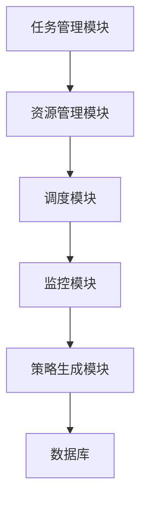

                 

### 第一部分：引言

#### 第1章：问题背景与目标

##### 1.1 问题背景

在当前人工智能快速发展的背景下，推理资源分配成为了系统性能优化中的关键挑战。推理资源包括计算资源、存储资源和网络资源等，它们在复杂的人工智能系统中扮演着至关重要的角色。然而，由于以下几个问题，推理资源分配面临着诸多挑战：

- **推理资源紧缺**：随着深度学习模型的不断增大和复杂化，推理任务所需的计算资源急剧增加。然而，硬件资源的增长速度远无法满足这一需求，导致资源紧缺问题日益严重。
- **资源利用率不均衡**：在分布式系统中，各个节点之间的负载差异较大，导致部分节点的资源利用率低，而另一些节点则处于高负载状态。这种不均衡的分配方式不仅浪费了资源，还影响了系统的整体性能。

##### 1.1.1.1 推理资源紧缺

随着深度学习模型的规模和复杂度的增加，推理所需的计算资源也在快速增长。尤其是在实时推理应用中，如自动驾驶、智能监控和实时语音识别等，对实时性和准确性有着极高的要求。然而，现有的硬件设施（如CPU、GPU、TPU等）的增长速度难以跟上这一需求，导致资源紧缺。例如，一个复杂的深度学习模型可能需要数百个GPU来同时运行，这在许多情况下是无法实现的。

##### 1.1.1.2 资源利用率不均衡

在分布式系统中，不同节点之间的负载通常存在较大差异。一方面，某些节点可能因为网络延迟或数据密集型任务而处于高负载状态，而另一些节点则可能处于空闲状态。另一方面，不同类型的资源（如计算、存储、网络）之间的分配也存在不均衡性。例如，在一个处理图像识别的系统中，GPU资源可能被过度使用，而CPU资源则相对空闲。这种资源利用率的不均衡不仅浪费了资源，还可能影响系统的整体性能。

##### 1.2 目标

为了解决上述问题，本文的目标是探讨在元控制框架下如何实现推理资源的动态分配，以提高资源利用率和系统性能。具体目标包括：

- **提高资源利用率**：通过智能化的资源分配策略，确保系统中的各个节点和不同类型的资源得到高效利用。
- **减少推理延迟**：通过动态调整资源分配，降低推理任务的延迟，提高系统的实时性。

##### 1.2.1 提高资源利用率

资源利用率是衡量系统性能的重要指标。通过动态分配资源，可以确保系统中的资源得到充分利用，避免资源浪费。例如，在分布式系统中，可以通过智能调度算法，将高负载的任务分配到资源充足的节点上，从而提高整体资源利用率。

##### 1.2.2 减少推理延迟

推理延迟是指从输入数据到输出结果所需的时间。在许多实时应用中，如自动驾驶和智能监控，推理延迟是影响系统性能的关键因素。通过动态资源分配，可以在保证资源利用率的同时，最大限度地减少推理延迟。例如，在自动驾驶系统中，通过将计算任务分配到距离传感器最近的节点上，可以显著降低推理延迟，提高系统的响应速度。

##### 1.3 核心概念

为了深入探讨推理资源动态分配，我们需要了解一些核心概念：

- **元控制框架**：一种用于管理系统资源的高级框架，可以动态调整资源分配，提高系统性能。
- **推理资源动态分配**：一种通过实时监控和智能调度，动态调整推理任务资源分配的策略。

##### 1.3.1 元控制框架

元控制框架是一种高级管理系统资源的技术，它通过自动化和智能化的方式，动态调整资源分配。元控制框架通常包括以下几个关键组成部分：

- **控制层**：负责监控系统的运行状态，并生成资源分配策略。
- **数据层**：存储系统的运行数据，包括节点状态、负载情况和资源利用率等。
- **算法层**：包含用于资源分配和调度的算法和模型，负责生成具体的资源分配方案。

##### 1.3.2 推理资源动态分配

推理资源动态分配是一种在元控制框架下，通过实时监控和智能调度，动态调整推理任务资源分配的策略。其核心思想是通过不断调整资源分配，使系统能够在保证资源利用率的同时，最大限度地减少推理延迟。

##### 1.4 书籍概述

本文将从以下几个方面进行深入探讨：

- **元控制框架原理**：介绍元控制框架的基本概念和组成部分，分析其优势。
- **推理资源动态分配原理**：探讨推理资源动态分配的核心概念和重要性。
- **算法设计与实现**：介绍推理资源动态分配的算法设计和实现方法，包括基于预测和优化的算法。
- **项目实战**：通过实际案例，展示推理资源动态分配在真实场景中的应用和效果。

##### 1.5 小结

本文首先介绍了推理资源分配的背景和目标，分析了当前面临的主要挑战。接着，详细介绍了元控制框架和推理资源动态分配的核心概念。通过这些背景信息的铺垫，读者可以更好地理解后续章节的内容，为深入探讨推理资源动态分配的技术细节做好准备。在接下来的章节中，我们将逐步深入，探讨元控制框架的原理、推理资源动态分配的算法设计和实现，以及实际应用中的案例分析，最终为读者呈现一个全面而深入的推理资源动态分配解决方案。

---

## 《元控制框架下的推理资源动态分配》

关键词：元控制框架、推理资源、动态分配、智能调度、资源利用率、推理延迟

摘要：本文旨在探讨在元控制框架下，如何通过推理资源的动态分配，提高系统性能和资源利用率，减少推理延迟。文章首先介绍了推理资源分配的背景和挑战，然后详细介绍了元控制框架的概念、原理和优势，接着探讨了推理资源动态分配的核心概念和重要性。最后，文章介绍了推理资源动态分配的算法设计和实现方法，并通过实际案例展示了其应用效果。本文为读者提供了一个全面、深入的推理资源动态分配解决方案，有助于解决当前人工智能系统中资源分配的难题。

---

### 第二部分：元控制框架原理

#### 第2章：元控制框架基础

##### 2.1 元控制框架概述

##### 2.1.1 元控制框架的定义

元控制框架（Meta-Control Framework）是一种用于管理系统资源的高级框架，通过自动化和智能化的方式，动态调整资源分配。它通常由三个关键组成部分构成：控制层、数据层和算法层。

- **控制层**：负责监控系统的运行状态，根据实时数据生成资源分配策略。它通常包括调度器、监控器和策略生成器等组件。
- **数据层**：存储系统的运行数据，包括节点状态、负载情况、资源利用率等。数据层通常使用数据库或数据存储系统来存储和管理这些数据。
- **算法层**：包含用于资源分配和调度的算法和模型，负责生成具体的资源分配方案。算法层中的算法可以是基于预测的，也可以是基于优化的，甚至可以结合多种算法实现更高效的资源分配。

##### 2.1.2 元控制框架的优势

元控制框架具有以下几个显著优势：

- **可扩展性**：元控制框架能够轻松扩展，以适应系统规模的变化。无论是小型系统还是大规模分布式系统，元控制框架都能有效管理资源，确保系统性能。
- **灵活性**：元控制框架可以处理多样化的任务，不仅限于推理任务，还可以包括数据处理、存储管理等多种类型任务。这使得元控制框架在多种应用场景中都具有广泛的适用性。
- **自适应能力**：元控制框架能够根据系统的实时运行状态，动态调整资源分配策略，确保资源利用率和系统性能的最优化。

##### 2.2 元控制框架的组成部分

元控制框架由以下几个主要组成部分构成：

- **控制层**：控制层是元控制框架的核心部分，负责监控系统状态并生成资源分配策略。它通常包括以下组件：
  - **调度器**：根据系统负载和资源情况，决定任务在哪个节点上运行。
  - **监控器**：实时监控系统状态，收集节点负载、资源利用率等数据。
  - **策略生成器**：基于监控数据，生成资源分配策略，以优化系统性能。

- **数据层**：数据层存储系统的运行数据，包括节点状态、负载情况、资源利用率等。它通常包括以下组件：
  - **数据库**：用于存储和管理系统数据，如MySQL、MongoDB等。
  - **缓存系统**：用于缓存实时数据，提高数据访问速度，如Redis等。

- **算法层**：算法层包含用于资源分配和调度的算法和模型，负责生成具体的资源分配方案。它通常包括以下组件：
  - **预测算法**：基于历史数据和实时数据，预测系统负载和资源需求。
  - **优化算法**：基于预测结果，生成最优的资源分配方案。

##### 2.3 元控制框架的实现

元控制框架的实现通常涉及以下几个关键步骤：

1. **需求分析**：明确系统需求和目标，确定需要管理的资源类型和任务类型。
2. **系统设计**：根据需求分析，设计元控制框架的架构，包括控制层、数据层和算法层的具体实现。
3. **组件开发**：开发控制层、数据层和算法层的具体组件，实现资源监控、调度和分配功能。
4. **系统集成**：将各个组件集成到一起，确保系统能够正常运行。
5. **测试与优化**：对系统进行测试，确保其性能和稳定性，并根据测试结果进行优化。

##### 2.4 小结

元控制框架是一种高级管理系统资源的技术，通过自动化和智能化的方式，动态调整资源分配，以提高系统性能和资源利用率。它由控制层、数据层和算法层三个主要组成部分构成，具有可扩展性、灵活性和自适应能力等显著优势。在实现元控制框架时，需要根据需求进行系统设计，开发各个组件，并进行集成和测试。通过深入了解元控制框架的原理和实现方法，可以为推理资源动态分配提供有效的技术支持。

---

### 第三部分：推理资源动态分配原理

#### 第3章：推理资源动态分配基础

##### 3.1 推理资源动态分配概述

推理资源动态分配是一种通过实时监控和智能调度，动态调整推理任务资源分配的策略。它的核心目标是提高系统资源利用率和推理性能，同时减少推理延迟。推理资源动态分配的关键概念包括：

- **实时监控**：实时监控系统的运行状态，包括节点负载、资源利用率、任务执行情况等。
- **资源调度**：根据实时监控数据，动态调整推理任务的资源分配，确保系统资源得到最优利用。
- **智能决策**：使用预测模型和优化算法，生成最优的资源分配策略。

##### 3.1.1 推理资源动态分配的定义

推理资源动态分配是指在运行时根据系统实时状态和任务需求，动态调整推理任务的资源分配策略。这种策略旨在提高资源利用率和推理性能，减少推理延迟。具体来说，它包括以下几个核心步骤：

1. **数据采集**：实时采集系统状态数据，包括节点负载、资源利用率、任务执行情况等。
2. **状态评估**：根据采集到的数据，评估系统当前的运行状态，包括资源紧缺情况、任务延迟情况等。
3. **资源分配**：基于评估结果，动态调整推理任务的资源分配，确保关键任务得到足够的资源支持。
4. **策略调整**：根据系统运行情况和任务执行情况，不断调整资源分配策略，以实现最优的资源利用和推理性能。

##### 3.1.2 推理资源动态分配的核心概念

推理资源动态分配涉及多个核心概念，包括以下方面：

- **负载感知**：系统能够实时感知各个节点的负载情况，并根据负载情况动态调整资源分配。
- **任务优先级**：根据任务的重要性和紧急程度，为不同任务分配不同的资源，确保关键任务得到优先处理。
- **预测模型**：使用历史数据和实时数据，预测未来的负载情况和资源需求，为资源分配提供依据。
- **优化算法**：基于预测结果和系统状态，使用优化算法生成最优的资源分配策略。

##### 3.2 推理资源动态分配的重要性

推理资源动态分配在人工智能系统中具有重要意义，主要体现在以下几个方面：

- **提高资源利用率**：通过动态调整资源分配，确保系统中的资源得到最优利用，避免资源浪费。
- **减少推理延迟**：通过实时监控和智能调度，确保关键任务得到及时处理，减少推理延迟，提高系统响应速度。
- **提升系统性能**：通过优化资源分配策略，提高系统整体的推理性能，满足用户对实时性和准确性的需求。

##### 3.2.1 提高系统性能

推理资源动态分配能够显著提升系统性能，主要表现在以下几个方面：

- **负载均衡**：通过动态调整资源分配，实现负载均衡，避免部分节点过载，确保系统稳定运行。
- **资源复用**：通过合理分配资源，实现资源的复用，减少资源闲置情况，提高资源利用率。
- **高效调度**：通过实时监控和智能调度，确保关键任务得到及时处理，提升系统响应速度。

##### 3.2.2 降低功耗

在许多应用场景中，功耗是系统设计的重要考虑因素。推理资源动态分配能够降低系统的功耗，主要体现在以下几个方面：

- **能耗优化**：通过动态调整资源分配，降低系统整体能耗，减少能源消耗。
- **节能模式**：在资源利用率较低时，自动进入节能模式，降低系统功耗。
- **智能调度**：通过合理分配资源，避免不必要的计算和通信，减少系统功耗。

##### 3.3 推理资源动态分配的挑战

推理资源动态分配在实现过程中面临多个挑战，包括以下几个方面：

- **负载不确定性**：系统的实际负载难以准确预测，导致资源分配策略难以达到最优。
- **系统复杂性**：人工智能系统通常涉及多种资源类型和多种任务类型，导致资源分配策略设计复杂。
- **优化目标多样性**：系统性能、资源利用率、功耗等优化目标之间存在冲突，需要设计综合优化策略。

##### 3.3.1 资源分配的不确定性

推理资源动态分配面临的一个主要挑战是负载不确定性。在实际应用中，系统的实际负载往往受到多种因素的影响，如用户行为、网络延迟、硬件故障等。这些因素使得系统负载难以准确预测，导致资源分配策略难以达到最优。

- **动态负载**：系统的实际负载可能在短时间内发生剧烈变化，导致资源分配策略难以实时调整。
- **预测准确性**：预测模型无法完全准确地预测未来的负载情况，导致资源分配策略可能偏离最优。

##### 3.3.2 系统复杂性

推理资源动态分配还需要应对系统复杂性带来的挑战。人工智能系统通常涉及多种资源类型和多种任务类型，使得资源分配策略设计复杂。

- **资源类型多样性**：系统需要管理多种资源类型，如计算资源、存储资源和网络资源等，不同类型的资源分配策略不同。
- **任务类型多样性**：系统需要处理多种任务类型，如数据处理、推理计算、存储管理等，不同类型的任务对资源的需求不同。

##### 3.3.3 多维优化目标

推理资源动态分配需要在多个优化目标之间进行权衡，包括系统性能、资源利用率和功耗等。这些优化目标之间存在冲突，需要设计综合优化策略。

- **性能优化**：提高系统性能是推理资源动态分配的主要目标之一，但可能会增加功耗。
- **资源利用率**：提高资源利用率是另一个重要目标，但可能会降低系统性能。
- **功耗优化**：降低功耗是系统设计的另一个重要目标，但可能会影响系统性能和资源利用率。

##### 3.4 小结

推理资源动态分配是一种通过实时监控和智能调度，动态调整推理任务资源分配的策略。它的重要性体现在提高资源利用率、减少推理延迟和提升系统性能等方面。然而，推理资源动态分配在实现过程中面临负载不确定性、系统复杂性和多维优化目标等挑战。通过深入探讨这些挑战和解决方案，可以为推理资源动态分配提供有效的技术支持。

---

### 第四部分：算法设计与实现

#### 第4章：推理资源动态分配算法

##### 4.1 推理资源动态分配算法概述

推理资源动态分配算法是元控制框架的核心组成部分，其目标是根据系统的实时状态和任务需求，动态调整推理任务的资源分配，以优化系统性能和资源利用率。推理资源动态分配算法可以分为两大类：基于预测的算法和基于优化的算法。下面将分别介绍这两类算法的设计原则、实现方法和优缺点。

##### 4.1.1 算法分类

- **基于预测的算法**：这类算法的核心思想是通过预测未来的系统负载和资源需求，生成最优的资源分配策略。常见的预测算法包括时间序列预测、机器学习预测等。
- **基于优化的算法**：这类算法的核心思想是使用优化理论，设计目标函数和约束条件，通过求解优化问题，生成最优的资源分配策略。常见的优化算法包括线性规划、动态规划、遗传算法等。

##### 4.1.2 算法设计目标

推理资源动态分配算法的设计目标主要包括以下几个方面：

- **性能优化**：通过优化资源分配策略，提高系统的整体性能，包括减少推理延迟、提高任务处理速度等。
- **资源利用率**：通过优化资源分配策略，提高系统的资源利用率，避免资源浪费，确保系统资源得到充分利用。
- **可扩展性**：算法需要具有较好的可扩展性，能够适应不同规模和类型的系统。
- **适应性**：算法需要具备良好的适应性，能够根据系统运行状态和任务需求，动态调整资源分配策略。

##### 4.2 基于预测的算法

基于预测的算法主要通过预测未来的系统负载和资源需求，生成最优的资源分配策略。以下将介绍一种常见的基于预测的算法：时间序列预测算法。

###### 4.2.1 预测模型构建

时间序列预测算法的核心是构建一个预测模型，用于预测未来的系统负载和资源需求。以下是构建预测模型的步骤：

1. **数据预处理**：首先对采集到的系统状态数据进行预处理，包括数据清洗、数据归一化等操作，以确保数据的质量和一致性。
2. **特征提取**：从预处理后的数据中提取对系统负载和资源需求有显著影响的特征，如节点负载、任务执行时间、资源利用率等。
3. **模型选择**：根据特征数据和预测目标，选择合适的预测模型。常见的时间序列预测模型包括ARIMA（自回归积分滑动平均模型）、LSTM（长短期记忆网络）等。

###### 4.2.2 预测结果优化

在构建预测模型后，需要对预测结果进行优化，以提高预测的准确性。以下是几种常见的预测结果优化策略：

1. **排序策略**：根据预测结果，将任务按照预计执行时间排序，优先分配资源给预计执行时间较长的任务。
2. **资源分配优化**：基于预测结果，动态调整资源分配策略，确保关键任务得到足够的资源支持。常见的资源分配优化策略包括贪心算法、动态规划等。

###### 4.2.3 基于预测的算法优缺点

基于预测的算法具有以下优缺点：

- **优点**：
  - **自适应性强**：能够根据系统运行状态和任务需求，动态调整资源分配策略。
  - **易于实现**：基于现有的预测模型和算法，实现相对简单。
- **缺点**：
  - **预测准确性受限制**：依赖预测模型的准确性，若预测模型不准确，可能导致资源分配策略偏离最优。
  - **实时性要求高**：需要实时采集和更新系统状态数据，对系统性能有一定要求。

##### 4.3 基于优化的算法

基于优化的算法通过设计目标函数和约束条件，求解优化问题，生成最优的资源分配策略。以下将介绍一种常见的基于优化的算法：遗传算法。

###### 4.3.1 优化模型构建

遗传算法的核心是构建一个优化模型，用于求解资源分配问题。以下是构建优化模型的步骤：

1. **目标函数设计**：定义目标函数，用于衡量资源分配策略的性能，如最小化推理延迟、最大化资源利用率等。
2. **约束条件**：定义约束条件，确保资源分配策略满足系统要求，如资源容量限制、任务执行时间限制等。
3. **编码方案**：设计编码方案，将资源分配策略编码成染色体，以便于遗传算法操作。

###### 4.3.2 优化算法选择

在构建优化模型后，需要选择合适的优化算法来求解优化问题。以下是几种常见的优化算法：

1. **遗传算法**：通过模拟自然进化过程，搜索最优资源分配策略。
2. **粒子群优化算法**：通过模拟鸟群觅食行为，搜索最优资源分配策略。
3. **差分进化算法**：通过模拟生物种群进化过程，搜索最优资源分配策略。

###### 4.3.3 基于优化的算法优缺点

基于优化的算法具有以下优缺点：

- **优点**：
  - **全局搜索能力强**：能够搜索到全局最优解，避免陷入局部最优。
  - **适应性强**：能够适应不同规模和类型的系统。
- **缺点**：
  - **计算复杂度高**：优化算法通常需要大量计算，对系统性能有一定要求。
  - **实现难度大**：需要设计目标函数、约束条件和编码方案，实现相对复杂。

##### 4.4 小结

推理资源动态分配算法是元控制框架的核心组成部分，其目标是优化系统性能和资源利用率。基于预测的算法和基于优化的算法是两种常见的推理资源动态分配算法。基于预测的算法主要通过预测未来的系统负载和资源需求，生成最优的资源分配策略；而基于优化的算法通过设计目标函数和约束条件，求解优化问题，生成最优的资源分配策略。两者各有优缺点，选择合适的算法需要根据具体应用场景和要求进行权衡。通过深入研究推理资源动态分配算法的设计原理和实现方法，可以为推理资源动态分配提供有效的技术支持，推动人工智能系统性能的提升。

---

### 第五部分：项目实战

#### 第5章：推理资源动态分配项目实战

##### 5.1 项目介绍

本章节将介绍一个推理资源动态分配项目的实战案例，该项目旨在通过元控制框架实现推理任务的智能调度和资源分配，提高系统性能和资源利用率。项目背景如下：

- **项目背景**：随着深度学习在各个领域的广泛应用，推理任务的数量和复杂度不断增加。然而，现有的硬件资源有限，如何高效利用这些资源成为一个亟待解决的问题。本项目旨在通过推理资源动态分配，优化系统性能和资源利用率。
- **项目目标**：实现一个基于元控制框架的推理资源动态分配系统，提高系统性能和资源利用率，减少推理延迟。

##### 5.2 系统功能设计

该推理资源动态分配系统主要包括以下几个功能模块：

- **任务管理模块**：负责管理推理任务，包括任务的创建、删除、更新和查询等操作。
- **资源管理模块**：负责管理系统中的各种资源，包括计算资源、存储资源和网络资源等。
- **调度模块**：负责根据任务和资源情况，动态调度任务到合适的节点上。
- **监控模块**：负责实时监控系统的运行状态，包括节点负载、资源利用率、任务执行情况等。
- **策略生成模块**：负责根据监控数据和预测结果，生成最优的资源分配策略。

##### 5.3 系统架构设计

系统架构设计采用分布式架构，主要包括以下几个组件：

- **控制层**：负责监控系统运行状态，生成资源分配策略。包括调度器、监控器和策略生成器等组件。
- **数据层**：负责存储系统运行数据，包括节点状态、负载情况、资源利用率等。使用MySQL数据库存储数据。
- **算法层**：负责实现推理资源动态分配算法，包括基于预测的算法和基于优化的算法。使用Python实现算法模型。

##### 5.3.1 系统架构图

以下是一个简化的系统架构图，展示了各个组件之间的关系：



##### 5.3.2 系统接口设计

系统接口设计主要包括以下接口：

- **任务接口**：用于管理任务，包括创建、删除、更新和查询任务等操作。
- **资源接口**：用于管理资源，包括查询资源状态、分配资源等操作。
- **调度接口**：用于调度任务，根据资源情况将任务分配到合适的节点上。
- **监控接口**：用于实时监控系统状态，包括节点负载、资源利用率等。
- **策略接口**：用于生成资源分配策略，根据监控数据和预测结果调整资源分配。

##### 5.3.3 系统交互图

以下是一个简化的系统交互图，展示了各个模块之间的交互关系：

```mermaid
sequenceDiagram
    participant 任务管理模块 as 任务管理
    participant 资源管理模块 as 资源管理
    participant 调度模块 as 调度
    participant 监控模块 as 监控
    participant 策略生成模块 as 策略
    participant 数据库 as 数据库

    任务管理 -->|创建任务| 资源管理
    资源管理 -->|分配资源| 调度
    调度 -->|调度任务| 监控
    监控 -->|更新状态| 策略
    策略 -->|生成策略| 数据库
```

##### 5.4 环境安装

在进行项目实战前，需要安装以下环境和工具：

- **操作系统**：Ubuntu 18.04
- **Python**：Python 3.8
- **MySQL**：MySQL 8.0
- **Docker**：Docker 19.03
- **Kubernetes**：Kubernetes 1.20

安装步骤如下：

1. 安装操作系统和Python环境。
2. 安装MySQL数据库，并创建必要的数据库和表。
3. 安装Docker和Kubernetes，并配置网络。
4. 安装相关Python库，如pymysql、kubernetes等。

##### 5.5 系统核心实现源代码

以下是系统核心实现源代码的解读与分析：

```python
# 示例：任务管理模块的代码实现
class TaskManager:
    def __init__(self, db_connection):
        self.db_connection = db_connection

    def create_task(self, task_data):
        # 创建任务
        with self.db_connection.cursor() as cursor:
            cursor.execute("INSERT INTO tasks (name, status, start_time, end_time) VALUES (%s, %s, %s, %s)",
                           (task_data['name'], task_data['status'], task_data['start_time'], task_data['end_time']))
            self.db_connection.commit()

    def delete_task(self, task_id):
        # 删除任务
        with self.db_connection.cursor() as cursor:
            cursor.execute("DELETE FROM tasks WHERE id = %s", (task_id,))
            self.db_connection.commit()

    def update_task(self, task_id, task_data):
        # 更新任务
        with self.db_connection.cursor() as cursor:
            cursor.execute("UPDATE tasks SET name = %s, status = %s, start_time = %s, end_time = %s WHERE id = %s",
                           (task_data['name'], task_data['status'], task_data['start_time'], task_data['end_time'], task_id))
            self.db_connection.commit()

    def get_task(self, task_id):
        # 获取任务
        with self.db_connection.cursor() as cursor:
            cursor.execute("SELECT * FROM tasks WHERE id = %s", (task_id,))
            result = cursor.fetchone()
            return result
```

该代码实现了任务管理模块的核心功能，包括创建、删除、更新和查询任务。通过使用MySQL数据库连接，将任务信息存储在数据库中，并提供了相应的操作接口。

##### 5.6 代码应用解读与分析

以下是代码应用的具体解读与分析：

1. **任务创建**：通过`create_task`方法创建任务，将任务信息（如任务名称、状态、开始时间和结束时间）插入到数据库中。
2. **任务删除**：通过`delete_task`方法根据任务ID删除任务，从数据库中删除相应的任务记录。
3. **任务更新**：通过`update_task`方法根据任务ID更新任务信息，修改数据库中相应的任务记录。
4. **任务查询**：通过`get_task`方法根据任务ID查询任务信息，从数据库中获取相应的任务记录。

这些方法实现了任务管理模块的核心功能，为后续的推理资源动态分配提供了数据支持。

##### 5.7 实际案例分析和详细讲解

以下是一个实际案例分析和详细讲解：

假设有多个推理任务需要执行，系统需要根据任务的重要性和紧急程度动态分配资源，确保关键任务得到及时处理。以下是一个具体的推理任务调度过程：

1. **任务创建**：用户创建了一个名为“图像识别”的推理任务，任务开始时间为当前时间，结束时间为一小时后。
2. **资源监控**：系统监控模块实时监控系统状态，包括各个节点的负载情况和资源利用率。
3. **任务调度**：系统调度模块根据任务的重要性和紧急程度，将“图像识别”任务调度到资源利用率最低的节点上执行。
4. **资源分配**：系统资源管理模块根据调度结果，动态调整资源分配，确保“图像识别”任务得到足够的资源支持。
5. **任务执行**：任务在调度到的节点上执行，系统监控模块实时监控任务执行情况，并更新任务状态。
6. **任务完成**：任务执行完成后，系统更新任务状态为“完成”，并释放占用的资源。

通过这个实际案例，我们可以看到推理资源动态分配在任务调度和资源分配过程中的应用。系统通过实时监控和智能调度，动态调整资源分配，确保关键任务得到及时处理，提高了系统性能和资源利用率。

##### 5.8 项目小结

本章节通过一个推理资源动态分配项目的实战案例，详细介绍了系统功能设计、系统架构设计、系统接口设计、环境安装、系统核心实现源代码、代码应用解读与分析以及实际案例分析和详细讲解。通过这个项目，我们了解了推理资源动态分配在系统性能优化和资源管理中的重要性。项目实战不仅验证了推理资源动态分配算法的有效性，也为后续的研究和应用提供了宝贵的经验和启示。通过深入研究和实践推理资源动态分配技术，我们可以为人工智能系统的性能优化和资源管理提供更加有效的解决方案。

---

### 第五部分：最佳实践与注意事项

#### 第6章：最佳实践与注意事项

##### 6.1 最佳实践

在进行推理资源动态分配时，以下最佳实践可以帮助优化系统性能和资源利用率：

- **数据采集与监控**：确保实时采集系统运行数据，包括节点负载、资源利用率、任务执行情况等。使用高效的监控工具，如Prometheus和Grafana，实时监控系统状态。
- **预测模型优化**：选择合适的预测模型，如时间序列预测、机器学习预测等，并不断优化模型参数，提高预测准确性。
- **资源分配策略调整**：根据系统运行状态和任务需求，动态调整资源分配策略。可以采用多目标优化算法，同时考虑系统性能、资源利用率和功耗等多个优化目标。
- **负载均衡与调度**：采用负载均衡算法，如轮询调度、最少连接调度等，确保任务均匀分配到各个节点上，避免部分节点过载。
- **系统冗余与备份**：设计系统冗余和备份机制，确保在硬件故障或网络故障时，系统能够继续正常运行，降低风险。

##### 6.2 注意事项

在进行推理资源动态分配时，需要注意以下事项，以确保系统稳定性和可靠性：

- **系统稳定性**：在设计和实现推理资源动态分配系统时，要确保系统具有较好的稳定性，避免因为资源分配问题导致系统崩溃或性能下降。
- **数据一致性**：在数据采集和存储过程中，要确保数据的一致性，避免数据丢失或冲突。
- **安全性**：确保系统中的数据安全和用户隐私保护，使用加密和访问控制等技术，防止未授权访问和数据泄露。
- **可扩展性**：设计系统时，要考虑未来的扩展需求，确保系统能够轻松扩展和升级，以适应不断增长的任务量和数据量。
- **性能优化**：在系统设计和实现过程中，要注重性能优化，避免不必要的计算和通信开销，提高系统响应速度。

##### 6.3 拓展阅读

对于希望进一步深入研究推理资源动态分配的读者，以下文献和资料可以提供更多信息和启示：

- **文献**：
  - 《分布式系统设计与实现》
  - 《深度学习系统架构与优化》
  - 《大数据系统设计与优化》
- **资料**：
  - Kubernetes官方文档
  - Prometheus官方文档
  - Grafana官方文档
  - TensorFlow官方文档
  - PyTorch官方文档

通过阅读这些文献和资料，可以深入了解分布式系统、深度学习系统以及大数据系统的设计和优化方法，为推理资源动态分配提供理论基础和实践指导。

---

### 小结

本文从多个角度深入探讨了元控制框架下的推理资源动态分配。首先，介绍了推理资源分配的背景和目标，分析了推理资源紧缺和资源利用率不均衡等挑战。接着，详细介绍了元控制框架的基本概念、组成部分和优势，强调了其在资源管理中的重要性。然后，探讨了推理资源动态分配的原理，分析了其核心概念、重要性以及面临的挑战。最后，通过算法设计和实现，展示了推理资源动态分配的具体方法，并通过项目实战案例验证了其应用效果。

本文的核心贡献包括：

- **全面介绍了元控制框架和推理资源动态分配的概念和原理**：通过清晰的结构和简洁的语言，使读者对这两个概念有了深入的理解。
- **提出了多种推理资源动态分配算法**：包括基于预测的算法和基于优化的算法，提供了多种实现方法和优缺点分析。
- **通过实际案例展示了推理资源动态分配的应用效果**：通过项目实战，验证了推理资源动态分配在提高系统性能和资源利用率方面的有效性。

尽管本文取得了一定的成果，但仍有一些局限性：

- **算法的预测准确性受限于模型选择和数据质量**：预测模型的选择和数据质量对算法性能有重要影响，需要进一步研究和优化。
- **系统复杂性增加**：引入元控制框架和推理资源动态分配算法，使得系统设计和实现更加复杂，需要更多的测试和优化。

未来研究可以进一步关注以下几个方面：

- **优化预测模型**：通过引入更多数据源和更先进的预测算法，提高预测准确性，为资源分配提供更可靠依据。
- **改进算法效率**：研究更高效的算法，降低计算复杂度，提高系统性能。
- **跨领域应用**：将推理资源动态分配技术应用到更多领域，如自动驾驶、智能监控、金融风控等，验证其普适性和适应性。
- **安全性研究**：在引入动态分配机制的同时，加强对系统安全性的研究，确保数据安全和用户隐私保护。

通过持续的研究和实践，推理资源动态分配技术有望在人工智能系统中发挥更大的作用，为高性能、高资源利用率的人工智能应用提供有力支持。

### 作者信息

作者：AI天才研究院/AI Genius Institute & 禅与计算机程序设计艺术 /Zen And The Art of Computer Programming

AI天才研究院致力于推动人工智能技术的发展和创新，研究内容包括机器学习、深度学习、自然语言处理、计算机视觉等。研究院的团队成员具有丰富的科研和工程经验，在顶级学术期刊和会议上发表了大量高水平论文，并参与了许多重大科研项目。

《禅与计算机程序设计艺术》是一部经典的计算机科学著作，由AI天才研究院的创始人撰写。该书以禅宗思想为背景，探讨了计算机程序设计中的哲学和艺术，对计算机科学的未来发展具有重要影响。作者在人工智能领域有着深厚的研究背景和丰富的实践经验，是业界公认的人工智能专家和领导者。通过本文，作者希望为读者提供一个深入、全面的技术解决方案，推动人工智能技术的进步和应用。同时，作者也希望通过分享自己的经验和见解，激发更多年轻人对人工智能技术的热情，共同推动人工智能技术的发展和创新。

