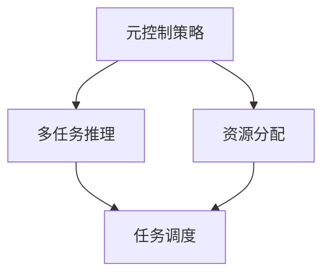
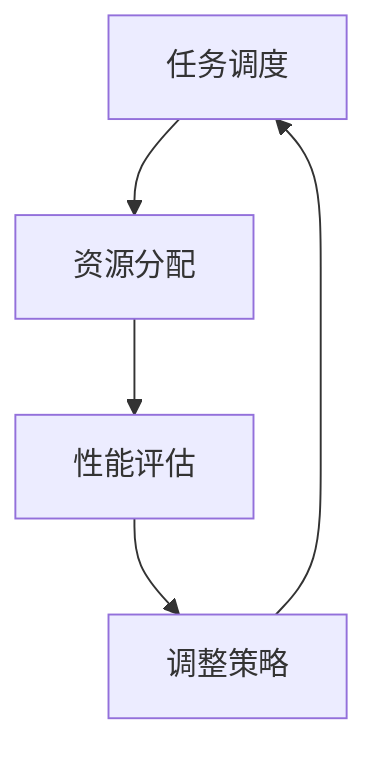

                 

# 元控制策略优化多任务推理的资源分配

> 关键词：元控制策略、多任务推理、资源分配、优化算法、人工智能

> 摘要：本文旨在探讨元控制策略在多任务推理中的优化应用，通过分析元控制策略的定义、作用、发展历程及核心概念，深入解析其在多任务推理和资源分配中的优化机制。本文将结合具体案例，详细阐述元控制策略优化多任务推理的原理与方法，为相关领域的研究和应用提供参考。

### 第1章：元控制策略概述

#### 1.1 元控制策略的定义与作用

##### 1.1.1 什么是元控制策略

元控制策略（Meta-Control Policy）是一种高级控制策略，旨在通过自动化手段对系统内部各组件的运行状态进行优化和调整。与传统控制策略相比，元控制策略更加灵活、自适应性强，能够根据系统的实际运行状况动态调整控制策略。

- **定义**：元控制策略是一种基于规则或模型的自动调整机制，用于优化系统资源分配和任务调度，以提高系统性能和响应速度。
- **区别**：传统控制策略通常是预设的，一旦系统运行条件发生变化，需要手动调整。而元控制策略通过学习算法和自适应机制，能够自动感知系统状态并进行相应调整。
- **核心作用**：元控制策略的核心作用在于通过优化系统资源分配和任务调度，实现系统性能的最优化。在多任务推理场景中，元控制策略能够有效平衡各任务的负载，提高系统整体效率。

##### 1.1.2 元控制策略的作用机制

元控制策略在多任务推理中的作用机制主要包括以下几个方面：

- **任务调度**：元控制策略通过实时监测系统负载，动态调整任务执行顺序和资源分配，确保系统资源得到充分利用。
- **资源分配**：元控制策略能够根据任务的重要性和紧急程度，合理分配系统资源，提高任务执行效率。
- **性能优化**：通过自适应调整，元控制策略能够优化系统性能，降低响应时间和延迟，提高系统吞吐量。

#### 1.2 元控制策略的发展历程与趋势

##### 1.2.1 元控制策略的发展历程

- **传统控制策略**：早期的控制策略主要是基于规则和预设参数，缺乏自适应性和灵活性。
- **智能控制策略**：随着人工智能技术的发展，智能控制策略逐渐取代传统控制策略，成为系统优化的重要手段。
- **元控制策略**：元控制策略作为智能控制策略的一种高级形式，通过机器学习和自适应机制，实现了对系统运行状态的实时调整和优化。

##### 1.2.2 元控制策略的发展趋势

- **自适应能力提升**：未来元控制策略将进一步提升自适应能力，能够更加精准地感知系统状态并做出相应调整。
- **跨领域应用**：元控制策略将在更多领域得到应用，如智能制造、智慧城市、医疗健康等。
- **集成化发展**：元控制策略将与云计算、大数据、物联网等新兴技术相结合，形成更加完整的智能控制系统。

#### 1.3 元控制策略的应用前景

- **多任务推理领域**：元控制策略在多任务推理中具有广泛的应用潜力，能够显著提高系统性能和效率。
- **资源分配优化**：元控制策略能够优化系统资源分配，提高资源利用率，降低系统运行成本。
- **实时响应能力**：元控制策略具备实时响应能力，能够快速应对系统变化，确保系统稳定运行。

#### 1.4 元控制策略的核心概念与联系

##### 1.4.1 核心概念介绍

- **元控制策略**：一种高级控制策略，用于优化系统资源分配和任务调度。
- **多任务推理**：指系统同时处理多个任务，并进行推理和决策的过程。
- **资源分配**：指将系统资源（如CPU、内存、网络带宽等）合理分配给各个任务的过程。

##### 1.4.2 概念属性特征对比

| 概念         | 属性特征                | 对比结论             |
|------------|---------------------|-------------------|
| 元控制策略   | 自适应、实时调整       | 强调自动化和灵活性    |
| 多任务推理   | 并行处理、复杂推理     | 强调任务处理和推理能力 |
| 资源分配     | 优化、效率提升         | 强调资源利用和性能优化 |

##### 1.4.3 ER实体关系图架构



#### 1.5 元控制策略优化多任务推理的原理与方法

##### 1.5.1 算法原理讲解

元控制策略优化多任务推理的基本原理是通过自适应机制和优化算法，动态调整任务执行顺序和资源分配，实现系统性能的最优化。具体包括以下步骤：

1. **任务调度**：根据系统负载和任务优先级，动态调整任务执行顺序。
2. **资源分配**：根据任务需求和系统资源状况，合理分配资源。
3. **性能评估**：对系统性能进行实时评估，根据评估结果调整控制策略。

##### 1.5.2 数学模型与公式

假设系统中有n个任务，每个任务需要执行的时间为\( t_i \)，系统资源总量为R，则资源分配的数学模型可以表示为：

$$
\max \sum_{i=1}^{n} \frac{t_i}{R_i}
$$

其中，\( R_i \) 为任务i所需资源。

##### 1.5.3 算法流程图



##### 1.5.4 算法Python源代码实现

```python
# 任务调度函数
def task_scheduling(tasks, resources):
    # 根据系统负载和任务优先级进行调度
    pass

# 资源分配函数
def resource_allocation(tasks, resources):
    # 根据任务需求和系统资源状况进行分配
    pass

# 性能评估函数
def performance_evaluation(tasks, resources):
    # 对系统性能进行实时评估
    pass

# 调用函数
tasks = [1, 2, 3, 4]
resources = [5, 6, 7, 8]
task_scheduling(tasks, resources)
resource_allocation(tasks, resources)
performance_evaluation(tasks, resources)
```

#### 1.6 元控制策略优化多任务推理的案例剖析

##### 1.6.1 案例背景介绍

假设有一个智能交通系统，需要同时处理多个任务，如车辆检测、路况预测、信号控制等。系统资源有限，需要通过元控制策略优化任务调度和资源分配，以提高系统性能和响应速度。

##### 1.6.2 案例实现与分析

1. **任务调度**：根据车辆检测的实时数据，动态调整任务执行顺序，优先处理紧急任务。
2. **资源分配**：根据任务的重要性和紧急程度，合理分配系统资源，如CPU、内存等。
3. **性能评估**：实时评估系统性能，包括响应时间、吞吐量等指标，根据评估结果调整控制策略。

##### 1.6.3 案例小结

通过元控制策略的优化，智能交通系统的性能得到了显著提升，任务响应时间缩短，系统吞吐量增加。但案例中仍存在一些不足之处，如任务调度策略不够灵活，资源分配算法有待进一步优化。

#### 1.7 本章小结

本章详细介绍了元控制策略的定义、作用、发展历程和应用前景，探讨了元控制策略在多任务推理和资源分配中的优化机制。通过具体案例，展示了元控制策略在实际应用中的效果和不足。未来，元控制策略将在更多领域得到应用，成为优化系统性能的重要手段。

### 第2章：多任务推理与资源分配

#### 2.1 多任务推理的基本概念

##### 2.1.1 什么是多任务推理

多任务推理（Multi-Task Inference）是指系统同时处理多个任务，并进行推理和决策的过程。与单任务推理相比，多任务推理具有更高的复杂度和挑战性。

- **定义**：多任务推理是一种同时处理多个任务，并利用推理算法对任务结果进行综合分析的方法。
- **区别**：单任务推理仅关注单一任务的执行和结果，而多任务推理需要考虑多个任务之间的关联和协同。

##### 2.1.2 多任务推理的特点

多任务推理的特点主要包括：

- **并行处理**：多任务推理能够同时处理多个任务，提高系统吞吐量。
- **复杂推理**：多任务推理需要综合考虑多个任务之间的关联和依赖，进行复杂的推理和决策。
- **资源竞争**：多任务推理中，各个任务之间可能存在资源竞争，需要合理分配系统资源。

##### 2.1.3 多任务推理的应用场景

多任务推理在多个领域具有广泛的应用场景，如：

- **智能交通**：同时处理车辆检测、路况预测、信号控制等多个任务，实现智能交通管理。
- **智能医疗**：同时处理影像分析、疾病诊断、患者管理等多个任务，提高医疗效率和质量。
- **智能制造**：同时处理生产计划、设备监控、质量检测等多个任务，实现智能制造。

#### 2.2 资源分配的原理与方法

##### 2.2.1 资源分配的基本原理

资源分配（Resource Allocation）是指将系统资源（如CPU、内存、网络带宽等）合理分配给各个任务的过程。资源分配的目标是实现系统性能的最优化，包括以下几个方面：

- **优化资源利用率**：通过合理分配资源，提高系统资源的利用率。
- **降低响应时间**：通过优化资源分配，降低任务的响应时间。
- **提高系统吞吐量**：通过优化资源分配，提高系统的吞吐量。

##### 2.2.2 常见的资源分配方法

常见的资源分配方法包括：

- **动态资源分配**：根据系统负载和任务需求，动态调整资源分配。
- **静态资源分配**：在系统启动时，预先分配资源，任务执行过程中不再进行调整。

##### 2.2.3 资源分配的优化目标

资源分配的优化目标主要包括：

- **资源利用率**：通过合理分配资源，提高系统资源的利用率。
- **响应时间**：通过优化资源分配，降低任务的响应时间。
- **负载均衡**：通过优化资源分配，实现系统负载的均衡，避免资源浪费和瓶颈。

#### 2.3 元控制策略在资源分配中的应用

##### 2.3.1 元控制策略在多任务推理中的重要性

元控制策略在多任务推理中具有重要意义，主要体现在以下几个方面：

- **任务调度**：元控制策略能够动态调整任务执行顺序，提高系统响应速度。
- **资源分配**：元控制策略能够根据任务需求和系统资源状况，合理分配资源，提高系统性能。
- **性能优化**：元控制策略能够实时评估系统性能，并根据评估结果调整控制策略，实现系统性能的最优化。

##### 2.3.2 元控制策略在资源分配中的优势

元控制策略在资源分配中的优势主要包括：

- **自适应能力**：元控制策略能够根据系统状态动态调整资源分配，实现自适应优化。
- **灵活性**：元控制策略能够根据任务的重要性和紧急程度，灵活调整资源分配策略。
- **高效性**：元控制策略能够提高系统资源的利用率，降低任务响应时间，提高系统吞吐量。

##### 2.3.3 元控制策略与资源分配的结合

元控制策略与资源分配方法的结合，能够实现系统性能的最优化。具体来说，元控制策略可以与以下资源分配方法相结合：

- **动态资源分配**：元控制策略可以根据系统负载和任务需求，动态调整资源分配策略，实现资源利用率的优化。
- **静态资源分配**：元控制策略可以在系统启动时，预先分配资源，并根据系统运行状况，适时调整资源分配策略，实现系统性能的最优化。

#### 2.4 资源分配优化案例剖析

##### 2.4.1 案例背景介绍

假设有一个智能交通系统，需要同时处理车辆检测、路况预测、信号控制等多个任务。系统资源有限，需要通过元控制策略优化任务调度和资源分配，以提高系统性能和响应速度。

##### 2.4.2 案例实现与分析

1. **任务调度**：根据车辆检测的实时数据，动态调整任务执行顺序，优先处理紧急任务。
2. **资源分配**：根据任务的重要性和紧急程度，合理分配系统资源，如CPU、内存等。
3. **性能评估**：实时评估系统性能，包括响应时间、吞吐量等指标，根据评估结果调整控制策略。

##### 2.4.3 案例小结

通过元控制策略的优化，智能交通系统的性能得到了显著提升，任务响应时间缩短，系统吞吐量增加。但案例中仍存在一些不足之处，如任务调度策略不够灵活，资源分配算法有待进一步优化。

#### 2.5 本章小结

本章详细介绍了多任务推理和资源分配的基本概念、原理和方法，探讨了元控制策略在多任务推理和资源分配中的优化应用。通过具体案例，展示了元控制策略在实际应用中的效果和不足。未来，元控制策略将在多任务推理和资源分配领域发挥更重要的作用。

### 第3章：元控制策略优化多任务推理的关键技术

#### 3.1 多任务推理算法设计

##### 3.1.1 多任务推理算法的基本框架

多任务推理算法的基本框架包括以下几个关键组成部分：

1. **任务调度模块**：负责根据任务的重要性和紧急程度，动态调整任务执行顺序。
2. **资源分配模块**：根据任务需求和系统资源状况，合理分配系统资源，如CPU、内存等。
3. **推理引擎模块**：利用机器学习和推理算法，对多任务进行推理和决策。
4. **性能评估模块**：实时评估系统性能，包括响应时间、吞吐量等指标，根据评估结果调整控制策略。

##### 3.1.2 常见的多任务推理算法

常见多任务推理算法包括以下几种：

1. **基于规则的推理算法**：通过预设规则和条件，对任务进行推理和决策。
2. **基于机器学习的推理算法**：利用机器学习模型，对任务进行推理和预测。
3. **基于深度学习的推理算法**：利用深度学习模型，对任务进行复杂的推理和决策。

#### 3.2 资源分配优化算法

##### 3.2.1 动态资源分配算法

动态资源分配算法（Dynamic Resource Allocation Algorithm）是一种根据系统负载和任务需求，动态调整资源分配的方法。常见的动态资源分配算法包括：

1. **基于优先级的资源分配算法**：根据任务优先级，动态调整资源分配，优先保障高优先级任务的资源需求。
2. **基于负载均衡的资源分配算法**：通过实时监测系统负载，动态调整资源分配，实现系统负载的均衡。

##### 3.2.2 静态资源分配算法

静态资源分配算法（Static Resource Allocation Algorithm）是一种在系统启动时，预先分配资源，任务执行过程中不再进行调整的方法。常见的静态资源分配算法包括：

1. **基于固定比例的资源分配算法**：将系统资源按照固定比例分配给各个任务，确保每个任务都能获得足够的资源。
2. **基于动态比例的资源分配算法**：根据任务的重要性和紧急程度，动态调整资源分配比例，实现资源利用率的优化。

##### 3.2.3 资源分配优化算法的选择

资源分配优化算法的选择需要考虑以下几个因素：

1. **任务特性**：根据任务的重要性和紧急程度，选择合适的资源分配算法。
2. **系统负载**：根据系统负载的变化情况，动态调整资源分配算法。
3. **资源约束**：根据系统资源的约束条件，选择合适的资源分配策略。

#### 3.3 元控制策略在资源分配优化中的应用

##### 3.3.1 元控制策略在资源分配优化中的角色

元控制策略在资源分配优化中的角色主要包括：

1. **任务调度**：通过动态调整任务执行顺序，优化系统资源利用率。
2. **资源分配**：通过根据任务需求实时调整资源分配策略，实现系统性能的最优化。
3. **性能评估**：通过实时评估系统性能，根据评估结果调整控制策略，实现系统性能的持续优化。

##### 3.3.2 元控制策略与资源分配算法的结合

元控制策略与资源分配算法的结合，可以显著提高系统性能和资源利用率。具体来说，可以采用以下方法：

1. **混合资源分配算法**：将动态资源分配算法和静态资源分配算法相结合，根据系统负载和任务需求，动态调整资源分配策略。
2. **自适应资源分配算法**：利用元控制策略，根据系统状态和任务特性，自适应调整资源分配策略，实现资源利用率的优化。

##### 3.3.3 元控制策略在资源分配优化中的应用案例

以下是一个元控制策略在资源分配优化中的应用案例：

- **背景**：一个智能交通系统需要同时处理多个任务，如车辆检测、路况预测、信号控制等。系统资源有限，需要通过元控制策略优化任务调度和资源分配，以提高系统性能和响应速度。
- **实现**：采用基于优先级的动态资源分配算法，结合元控制策略，根据任务的重要性和紧急程度，动态调整资源分配策略。同时，通过实时监测系统负载和任务状态，动态调整任务执行顺序，实现系统性能的最优化。

##### 3.3.4 元控制策略优化资源分配的挑战和未来发展方向

元控制策略优化资源分配面临以下挑战：

1. **动态性**：系统负载和任务需求的变化速度较快，需要元控制策略具备较强的自适应能力。
2. **复杂性**：多任务推理场景中，任务之间的依赖关系复杂，需要元控制策略具备较强的推理和决策能力。
3. **实时性**：资源分配和任务调度需要实时调整，需要元控制策略具备较高的响应速度。

未来，元控制策略在资源分配优化中的发展方向包括：

1. **强化学习**：利用强化学习算法，提高元控制策略的自适应能力和决策能力。
2. **分布式计算**：结合分布式计算技术，提高元控制策略的扩展性和实时性。
3. **协同优化**：将元控制策略与其他优化算法相结合，实现资源分配和任务调度的协同优化。

#### 3.4 本章小结

本章详细介绍了多任务推理算法设计、资源分配优化算法和元控制策略在资源分配优化中的应用。通过具体案例，展示了元控制策略在优化多任务推理和资源分配中的实际效果。未来，元控制策略将在多任务推理和资源分配领域发挥更重要的作用，为人工智能系统的性能优化提供有力支持。

