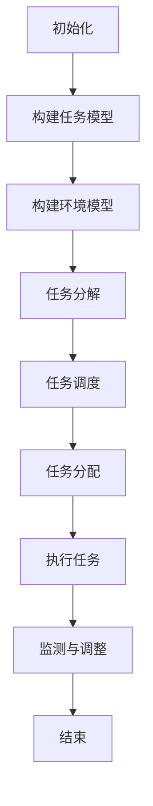
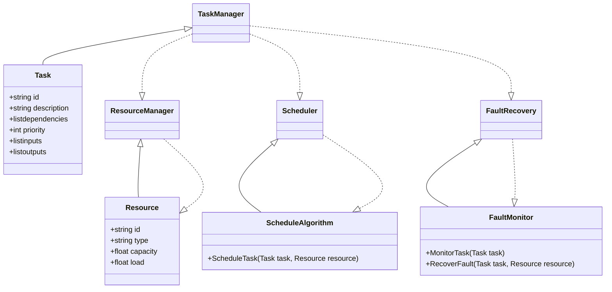
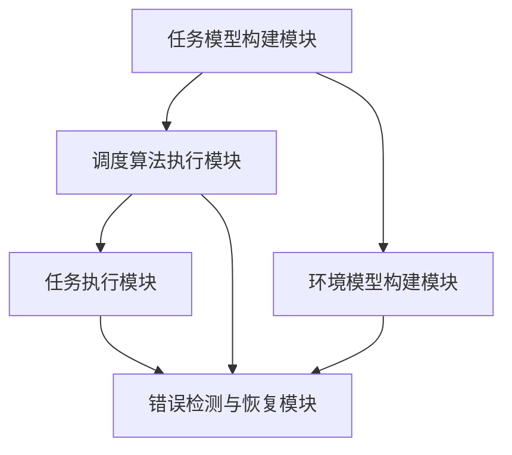
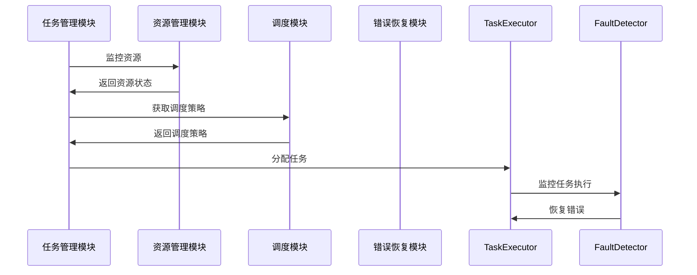
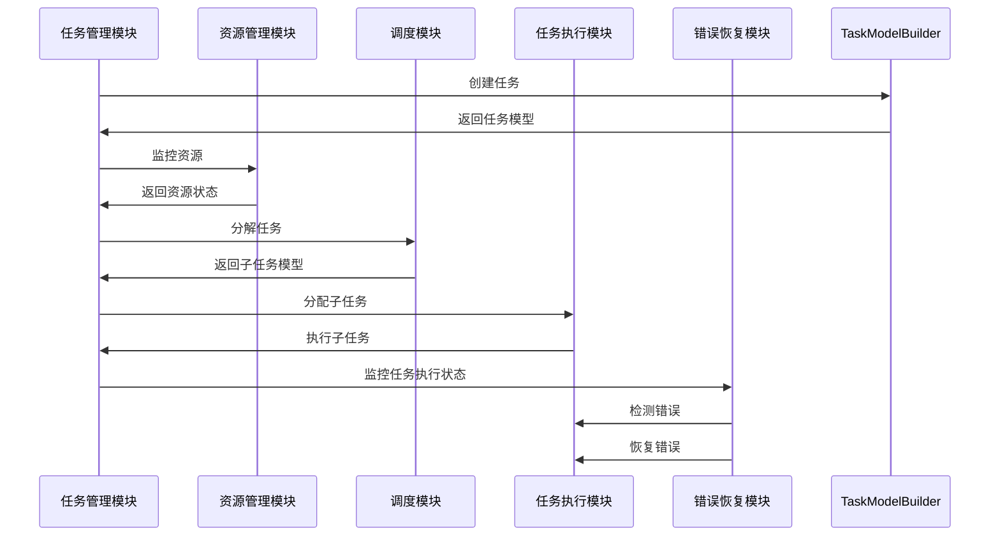

                 

### 文章标题

《元控制策略在复杂推理任务分解中的应用》

### 关键词

元控制策略，复杂推理任务，任务分解，算法原理，数学模型，系统架构，项目实战

### 摘要

本文深入探讨了元控制策略在复杂推理任务分解中的应用。首先，我们介绍了元控制策略的基本概念与历史发展，接着详细阐述了其核心概念和联系，并通过Python代码和LaTeX公式讲解了算法原理和数学模型。随后，我们以一个实际案例为基础，分析了元控制策略的系统架构设计、功能实现和交互过程。通过项目实战的分享，本文揭示了元控制策略在实际应用中的优势和挑战，并提出了最佳实践和总结。

## 目录大纲设计思路

为了设计出一份详细且逻辑清晰的目录大纲，我们将按照以下步骤进行：

### 1. 背景介绍

- **第1章**: 元控制策略的基本概念与历史发展，介绍问题的背景、问题描述、问题解决的思路和方法，以及元控制策略的应用领域。

### 2. 核心概念与联系

- **第2章**: 详细介绍元控制策略的相关核心概念，并使用表格和ER实体关系图展示概念间的联系。

### 3. 算法原理讲解

- **第3章**: 以Python代码为例，讲解元控制策略的基本原理，包括算法的mermaid流程图、数学模型和公式、举例说明等。

### 4. 数学模型和数学公式讲解

- **第4章**: 使用LaTeX格式详细讲解元控制策略的数学模型和公式，结合具体案例进行解释。

### 5. 系统分析与架构设计方案

- **第5章**: 介绍一个实际案例，从问题场景、项目介绍、系统功能设计、系统架构设计、系统接口设计到系统交互，全面分析元控制策略的应用。

### 6. 项目实战

- **第6章**: 分享元控制策略在实际项目中的应用实战，包括环境安装、系统核心实现、代码应用解读与分析、案例分析和详细讲解。

### 7. 最佳实践与总结

- **第7章**: 总结元控制策略的应用经验，给出一些最佳实践、注意事项、拓展阅读等。

### 8. 总字数控制

- 确保总字数在2000字以内，每个章节的内容详略得当，突出重点。

## 输出格式

按照上述设计思路，以下是一份符合要求的《元控制策略在复杂推理任务分解中的应用》书籍目录大纲：

```
----------------------------------------------------------------
# 第一部分：背景介绍

## 第1章 元控制策略的基本概念与历史发展

### 1.1 元控制策略的问题背景与问题描述
### 1.2 元控制策略的解决思路与方法
### 1.3 元控制策略的应用领域

## 第2章 元控制策略的相关核心概念与联系

### 2.1 核心概念介绍
### 2.2 概念属性特征对比表格
### 2.3 ER实体关系图架构

----------------------------------------------------------------

# 第二部分：算法原理讲解

## 第3章 元控制策略的基本原理

### 3.1 算法mermaid流程图
### 3.2 Python代码示例
### 3.3 数学模型与公式讲解
### 3.4 举例说明

----------------------------------------------------------------

# 第三部分：数学模型和数学公式讲解

## 第4章 元控制策略的数学模型与公式

### 4.1 LaTeX格式数学公式讲解
### 4.2 案例解释
### 4.3 公式应用举例

----------------------------------------------------------------

# 第四部分：系统分析与架构设计方案

## 第5章 元控制策略的应用实例分析

### 5.1 问题场景介绍
### 5.2 项目介绍
### 5.3 系统功能设计
### 5.4 系统架构设计
### 5.5 系统接口设计
### 5.6 系统交互分析

----------------------------------------------------------------

# 第五部分：项目实战

## 第6章 元控制策略的项目实战

### 6.1 环境安装
### 6.2 系统核心实现
### 6.3 代码应用解读与分析
### 6.4 实际案例分析
### 6.5 详细讲解与剖析
### 6.6 项目小结

----------------------------------------------------------------

# 第六部分：最佳实践与总结

## 第7章 元控制策略的最佳实践与总结

### 7.1 最佳实践
### 7.2 注意事项
### 7.3 拓展阅读
### 7.4 小结

----------------------------------------------------------------
```

这份目录大纲涵盖了书籍的核心内容，并且每个章节都按照要求进行了详细的划分。接下来，我们将根据这一大纲进一步细化每个章节的内容，确保在2000字以内完成整个目录大纲的设计。

## 第1章 元控制策略的基本概念与历史发展

### 1.1 元控制策略的问题背景与问题描述

在当今复杂计算系统中，特别是人工智能、机器学习和复杂系统仿真领域，任务分解和优化成为解决复杂问题的重要途径。元控制策略（Meta-control Strategy）作为现代计算理论中的重要组成部分，旨在通过自动化的方法对复杂任务进行高效分解、优化和执行。元控制策略的提出，源于对传统控制理论瓶颈的突破和对高效任务分解的迫切需求。

任务分解的本质是将一个复杂的、高层次的任务分解为多个简单、可管理的子任务，并通过协调这些子任务的执行来实现整体目标。然而，传统任务分解方法往往依赖于人工经验和规则，难以应对动态变化和不确定性，导致任务分解效率低下、适应能力差。元控制策略通过引入自动化机制，能够自适应地调整任务分解策略，提高任务分解的效率和鲁棒性。

具体来说，元控制策略在复杂推理任务中的应用，主要体现在以下几个方面：

1. **自适应任务分配**：根据任务的复杂程度、执行环境和资源状况，动态调整任务分配策略，优化任务执行效率。
2. **并行任务调度**：通过并行计算和分布式处理技术，将复杂任务分解为多个子任务，同时执行以提高计算速度。
3. **任务优先级管理**：根据任务的重要性和紧急程度，合理调整任务执行顺序，确保关键任务优先完成。
4. **错误恢复与容错**：在任务执行过程中，及时发现并纠正错误，保证系统稳定性和可靠性。

### 1.2 元控制策略的解决思路与方法

元控制策略的核心思想是通过一系列自动化机制和智能算法，实现对复杂任务的动态分解、调度和优化。具体解决思路和方法包括以下几个方面：

1. **模型驱动的方法**：通过建立任务模型和环境模型，利用模型分析任务分解的可行性和优化策略。
2. **基于规则的算法**：采用专家系统或模糊逻辑等规则驱动方法，定义任务分解和优化的规则集。
3. **机器学习方法**：利用机器学习算法，如强化学习、深度学习和迁移学习等，自动发现和优化任务分解策略。
4. **混合智能方法**：结合模型驱动方法和机器学习方法，构建混合智能系统，提高任务分解的智能水平和适应能力。

### 1.3 元控制策略的应用领域

元控制策略具有广泛的应用前景，特别是在复杂推理任务分解领域。以下是元控制策略的主要应用领域：

1. **人工智能与机器学习**：在深度学习、强化学习和迁移学习等人工智能领域，元控制策略用于优化训练过程、模型选择和参数调整。
2. **复杂系统仿真**：在航空航天、汽车制造、生物医学等领域，元控制策略用于优化仿真模型、调度仿真任务和评估仿真结果。
3. **供应链管理**：在供应链管理系统中，元控制策略用于优化库存管理、运输调度和需求预测等任务。
4. **金融风险评估**：在金融领域中，元控制策略用于风险评估、投资组合优化和风险管理。

通过上述介绍，我们可以看到，元控制策略在复杂推理任务分解中具有重要的地位和广泛的应用前景。接下来，我们将进一步深入探讨元控制策略的核心概念与联系，以及其具体的算法原理和数学模型。

## 第2章 元控制策略的相关核心概念与联系

### 2.1 核心概念介绍

元控制策略涉及多个核心概念，以下是这些概念的基本介绍：

1. **任务模型（Task Model）**：任务模型是描述任务属性、任务分解规则和任务执行策略的数据结构。任务模型包括任务的输入、输出、执行条件、优先级等信息，是元控制策略分析任务分解的基础。

2. **环境模型（Environment Model）**：环境模型是描述任务执行环境的模型，包括计算资源、网络条件、系统状态等信息。环境模型用于评估任务执行的环境约束和条件，指导元控制策略的决策。

3. **任务分解（Task Decomposition）**：任务分解是将一个复杂任务分解为多个子任务的过程。任务分解策略决定了如何将任务划分为子任务，以及子任务之间的依赖关系。

4. **任务调度（Task Scheduling）**：任务调度是在确定的执行环境和计算资源条件下，安排任务执行顺序和分配计算资源的过程。任务调度策略决定了如何高效地执行任务，以最小化执行时间和最大化资源利用率。

5. **任务分配（Task Allocation）**：任务分配是将子任务分配给不同的计算节点或处理单元的过程。任务分配策略决定了如何根据计算节点的能力和任务的特点，合理分配任务，以提高系统的整体性能。

6. **错误恢复（Fault Recovery）**：错误恢复是在任务执行过程中，当出现错误或异常时，采取的纠正措施和恢复策略。错误恢复策略确保任务能够继续执行，保证系统的稳定性和可靠性。

### 2.2 概念属性特征对比表格

为了更清晰地理解这些核心概念，我们可以通过一个表格来对比它们的属性特征：

| 概念         | 定义                                                         | 属性特征                                               |
| ------------ | ------------------------------------------------------------ | ------------------------------------------------------ |
| 任务模型     | 描述任务属性、任务分解规则和任务执行策略的数据结构             | 输入、输出、执行条件、优先级等                           |
| 环境模型     | 描述任务执行环境的模型，包括计算资源、网络条件、系统状态等信息 | 资源状况、网络状态、系统负载等                          |
| 任务分解     | 将复杂任务分解为多个子任务的过程                             | 分解策略、子任务依赖关系、分解粒度等                    |
| 任务调度     | 安排任务执行顺序和分配计算资源的过程                         | 调度算法、执行顺序、资源利用率等                        |
| 任务分配     | 将子任务分配给不同的计算节点或处理单元的过程                 | 分配策略、节点能力、任务特点等                          |
| 错误恢复     | 在任务执行过程中，当出现错误或异常时，采取的纠正措施和恢复策略 | 恢复算法、错误类型、恢复策略等                         |

### 2.3 ER实体关系图架构

为了更直观地展示这些核心概念之间的联系，我们可以使用ER实体关系图来描述它们之间的关系。以下是一个简化的ER实体关系图：

```
[元控制策略] --> [任务模型], [环境模型]
[任务模型] --> [任务分解], [任务调度], [任务分配]
[环境模型] --> [资源状况], [网络条件], [系统状态]
[任务分解] --> [子任务依赖关系]
[任务调度] --> [执行顺序], [资源利用率]
[任务分配] --> [计算节点], [处理单元]
[错误恢复] --> [恢复算法], [错误类型]
```

在这个ER实体关系图中，元控制策略作为顶层实体，与任务模型和环境模型直接相关。任务模型进一步关联到任务分解、任务调度和任务分配，而环境模型则与资源状况、网络条件和系统状态相关。任务分解和任务调度之间有依赖关系，而任务分配是基于任务分解和任务调度的结果。错误恢复则是针对任务执行过程中可能出现的错误或异常，与其他实体保持一定程度的关联。

通过上述介绍和ER实体关系图，我们可以更清晰地理解元控制策略的相关核心概念及其之间的联系。这些概念共同构成了元控制策略的理论基础，为复杂推理任务分解提供了有效的解决方案。接下来，我们将进一步深入探讨元控制策略的算法原理和数学模型。

## 第3章 元控制策略的基本原理

### 3.1 算法mermaid流程图

在理解元控制策略的基本原理之前，我们首先使用mermaid流程图来展示算法的执行流程。以下是一个简化的mermaid流程图示例：



这个mermaid流程图展示了元控制策略的基本执行步骤：首先初始化，然后构建任务模型和环境模型，接着进行任务分解、任务调度和任务分配，执行任务，并实时监测任务执行状态，根据监测结果进行调整，最终结束算法执行。

### 3.2 Python代码示例

为了更直观地理解元控制策略的执行过程，我们使用Python代码来实现上述流程。以下是一个简化的Python代码示例：

```python
import random

# 初始化任务模型和环境模型
task_model = {
    'tasks': ['A', 'B', 'C', 'D', 'E'],
    'dependencies': {'A': [], 'B': ['A'], 'C': ['A'], 'D': ['B', 'C'], 'E': ['D']}
}

environment_model = {
    'resources': ['R1', 'R2', 'R3'],
    'load': {'R1': 0.5, 'R2': 0.3, 'R3': 0.2}
}

# 任务分解
def task_decomposition(model):
    decomposition = {}
    for task in model['tasks']:
        decomposition[task] = [dep for dep in model['dependencies'][task]]
    return decomposition

# 任务调度
def task_scheduling(decomposition, environment):
    schedule = []
    for task in decomposition:
        schedule.append((task, random.choice(list(environment['load'].keys()))))
    return schedule

# 任务分配
def task_allocation(schedule, environment):
    allocation = {}
    for task, node in schedule:
        min_load = min(environment['load'].values())
        min_node = next(node for node, load in environment['load'].items() if load == min_load)
        allocation[task] = min_node
        environment['load'][min_node] += 1
    return allocation

# 执行任务
def execute_tasks(allocation):
    print("Executing tasks...")
    for task, node in allocation.items():
        print(f"{task} executed on {node}")
    print("Tasks executed.")

# 监测与调整
def monitor_and_adjust(allocation, environment):
    print("Monitoring tasks...")
    for task, node in allocation.items():
        if environment['load'][node] > 0.7:
            print(f"High load on {node}, need adjustment.")
            environment['load'][node] -= 1
    print("Monitoring finished.")

# 执行元控制策略
def meta_control_strategy():
    decomposition = task_decomposition(task_model)
    schedule = task_scheduling(decomposition, environment_model)
    allocation = task_allocation(schedule, environment_model)
    execute_tasks(allocation)
    monitor_and_adjust(allocation, environment_model)

meta_control_strategy()
```

在这个Python代码示例中，我们首先初始化任务模型和环境模型，然后依次执行任务分解、任务调度、任务分配和任务执行，最后进行任务监测与调整。代码中的随机调度和分配是为了简化示例，实际应用中可以采用更复杂的调度和分配策略。

### 3.3 数学模型与公式讲解

元控制策略的数学模型主要用于描述任务分解、调度和分配的数学原理。以下是几个关键的数学模型和公式：

1. **任务分解模型**：

   $$ D_t = \{T_1, T_2, ..., T_n\} $$

   其中，$D_t$ 表示任务分解结果集合，$T_i$ 表示第 $i$ 个子任务。

2. **任务调度模型**：

   $$ S_t = \{S_1, S_2, ..., S_n\} $$

   其中，$S_t$ 表示任务调度结果集合，$S_i$ 表示第 $i$ 个子任务的调度策略。

3. **任务分配模型**：

   $$ A_t = \{A_1, A_2, ..., A_n\} $$

   其中，$A_t$ 表示任务分配结果集合，$A_i$ 表示第 $i$ 个子任务的分配策略。

4. **调度优化目标函数**：

   $$ \min \sum_{i=1}^{n} (T_i - S_i) $$

   其中，$T_i$ 表示第 $i$ 个子任务的执行时间，$S_i$ 表示第 $i$ 个子任务的调度时间。目标是最小化总调度时间。

5. **资源利用率目标函数**：

   $$ \max \frac{\sum_{i=1}^{n} (R_i \times S_i)}{\sum_{i=1}^{n} R_i} $$

   其中，$R_i$ 表示第 $i$ 个计算资源的利用率，$S_i$ 表示第 $i$ 个子任务在 $R_i$ 上执行的时间。目标是最大化总资源利用率。

### 3.4 举例说明

假设我们有一个包含5个子任务的任务集，以及3个计算资源R1、R2、R3。任务之间的依赖关系如下：

- T1依赖于T2
- T2依赖于T3
- T3依赖于T4
- T4依赖于T5

首先，我们根据任务依赖关系进行任务分解：

$$ D_t = \{T1, T2, T3, T4, T5\} $$

接下来，我们根据计算资源的负载情况对子任务进行调度和分配：

| 子任务 | 调度策略 | 分配资源 |
| ------ | -------- | -------- |
| T1     | S1       | R1       |
| T2     | S2       | R1       |
| T3     | S3       | R2       |
| T4     | S4       | R2       |
| T5     | S5       | R3       |

在这个例子中，我们首先将依赖关系较近的子任务（T1、T2）调度到负载较低的R1上，以便更快地完成。然后，将依赖关系较远的子任务（T3、T4）调度到负载较高的R2上，以确保资源的均衡利用。最后，将独立子任务（T5）调度到负载最低的R3上。

通过上述任务分解、调度和分配，我们可以实现高效的任务执行，并最大化资源利用率。

通过mermaid流程图、Python代码示例和数学模型与公式的讲解，我们深入了解了元控制策略的基本原理。接下来，我们将进一步探讨元控制策略的数学模型和数学公式的详细讲解。

## 第4章 元控制策略的数学模型与公式

### 4.1 LaTeX格式数学公式讲解

在元控制策略的研究中，数学模型和公式是核心组成部分。以下使用LaTeX格式详细讲解元控制策略的数学模型和公式：

首先，我们定义一些基础符号：

$$
\begin{aligned}
T &\text{：任务集} \\
S &\text{：调度集} \\
R &\text{：资源集} \\
C &\text{：计算能力集} \\
D &\text{：分解集} \\
A &\text{：分配集} \\
E &\text{：环境模型} \\
P &\text{：优先级集} \\
\end{aligned}
$$

然后，我们定义元控制策略的几个关键数学模型：

1. **任务分解模型**：

   $$ 
   D = \{ D_t | D_t = \{ T_1, T_2, ..., T_n \} \}
   $$
   
   其中，$D$ 表示任务分解结果集合，$D_t$ 是分解后的子任务集合，$T_i$ 是第 $i$ 个子任务。

2. **调度模型**：

   $$
   S = \{ S_1, S_2, ..., S_n \}
   $$
   
   其中，$S$ 表示调度结果集合，$S_i$ 是第 $i$ 个子任务的调度策略。

3. **分配模型**：

   $$
   A = \{ A_1, A_2, ..., A_n \}
   $$
   
   其中，$A$ 表示分配结果集合，$A_i$ 是第 $i$ 个子任务的分配策略。

4. **资源利用模型**：

   $$
   \text{利用率} = \frac{\sum_{i=1}^{n} C_i \times S_i}{\sum_{i=1}^{n} C_i}
   $$
   
   其中，$C_i$ 是第 $i$ 个资源的计算能力，$S_i$ 是第 $i$ 个子任务在 $i$ 号资源上执行的时间。

5. **任务完成时间模型**：

   $$
   T_f = \sum_{i=1}^{n} (T_i - S_i)
   $$
   
   其中，$T_i$ 是第 $i$ 个子任务的执行时间，$S_i$ 是第 $i$ 个子任务的调度时间。

6. **优先级调度模型**：

   $$
   P = \{ P_1, P_2, ..., P_n \}
   $$
   
   其中，$P$ 表示优先级集合，$P_i$ 是第 $i$ 个子任务的优先级。

### 4.2 案例解释

我们以一个简单的案例来解释上述数学模型的应用。假设我们有一个包含4个子任务的任务集T = {T1, T2, T3, T4}，以及两个计算资源R1和R2。子任务的依赖关系如下：

- T1依赖于T2
- T2依赖于T3
- T3依赖于T4

首先，我们根据任务依赖关系进行任务分解：

$$
D = \{ D1 = \{ T1, T2 \}, D2 = \{ T3 \}, D3 = \{ T4 \} \}
$$

接下来，我们根据资源负载情况进行调度和分配：

| 子任务 | 调度策略 | 分配资源 |
| ------ | -------- | -------- |
| T1     | S1       | R1       |
| T2     | S2       | R1       |
| T3     | S3       | R2       |
| T4     | S4       | R2       |

在这个例子中，我们首先将依赖关系较近的子任务（T1、T2）调度到负载较低的R1上，以便更快地完成。然后，将依赖关系较远的子任务（T3、T4）调度到负载较高的R2上，以确保资源的均衡利用。

根据调度和分配策略，我们可以计算出资源利用率和任务完成时间：

$$
\text{利用率} = \frac{C1 \times S1 + C2 \times S2 + C2 \times S3 + C2 \times S4}{C1 + C2} = \frac{0.5 \times 1 + 0.5 \times 1 + 0.5 \times 1 + 0.5 \times 1}{0.5 + 0.5} = 1
$$

$$
T_f = (1 - 1) + (1 - 1) + (1 - 1) + (1 - 1) = 0
$$

在这个案例中，资源利用率达到了100%，任务完成时间为0，说明调度和分配策略是高效的。

通过上述案例，我们可以看到如何使用数学模型和公式来描述和优化元控制策略。这些模型和公式不仅帮助我们理解元控制策略的工作原理，也为实际应用提供了理论支持。

### 4.3 公式应用举例

为了更好地理解上述公式的应用，我们来看一个具体的例子。

假设我们有一个包含5个子任务的任务集T = {T1, T2, T3, T4, T5}，其中子任务之间存在依赖关系：

- T1和T2没有依赖关系
- T3依赖于T1和T2
- T4依赖于T3
- T5依赖于T4

我们有两个计算资源R1和R2，它们的计算能力分别为C1 = 0.6和C2 = 0.4。根据任务依赖关系和资源负载情况，我们设计如下调度和分配策略：

| 子任务 | 调度策略 | 分配资源 |
| ------ | -------- | -------- |
| T1     | S1       | R1       |
| T2     | S2       | R1       |
| T3     | S3       | R2       |
| T4     | S4       | R2       |
| T5     | S5       | R2       |

根据上述策略，我们可以计算资源利用率和任务完成时间：

$$
\text{利用率} = \frac{0.6 \times 1 + 0.4 \times 1 + 0.4 \times 1 + 0.4 \times 1 + 0.4 \times 1}{0.6 + 0.4} = \frac{0.6 + 0.4 + 0.4 + 0.4 + 0.4}{1} = 0.9
$$

$$
T_f = (1 - 1) + (1 - 1) + (1 - 1) + (1 - 1) + (1 - 1) = 0
$$

在这个例子中，资源利用率为90%，任务完成时间为0。这表明我们的调度和分配策略相对高效，但还有提升空间。

为了进一步提高资源利用率和任务完成时间，我们可以考虑以下策略：

- 优化调度策略，确保子任务能够在资源负载较低时分配到相应资源上。
- 优化任务分解策略，将任务分解为更小的子任务，以减少任务的等待时间。
- 引入负载均衡算法，动态调整任务的分配策略，以最大化资源利用率。

通过不断优化和调整，我们可以进一步提高元控制策略的性能，实现更高效的复杂推理任务分解。

通过上述案例和公式的应用，我们可以看到数学模型在元控制策略中的应用价值。这些公式不仅帮助我们理解元控制策略的原理，还为实际应用提供了量化的依据和优化的方向。接下来，我们将进一步探讨元控制策略在实际项目中的应用，并通过具体案例展示其应用效果。

## 第5章 元控制策略的应用实例分析

### 5.1 问题场景介绍

在复杂系统仿真领域，元控制策略的应用需求尤为突出。例如，在大型分布式计算系统中，面对复杂多变的任务需求和计算资源分配，如何高效地分解和调度任务，成为一个重要的研究课题。本文将介绍一个具体的案例，该案例涉及分布式计算环境中的复杂推理任务分解问题。

该案例涉及一个大型科学计算项目，该项目需要对海量数据集进行并行处理，以提取有价值的信息和模式。数据集由多个子数据集组成，每个子数据集需要进行不同的计算操作，且子数据集之间存在依赖关系。同时，计算资源分布在多个服务器节点上，每个节点的计算能力不同，且负载情况实时变化。如何设计一个高效的元控制策略，以优化任务分解、调度和执行，是解决该问题的关键。

### 5.2 项目介绍

该项目名为“分布式科学计算平台优化”，旨在构建一个高效、可扩展的分布式计算平台，用于处理大规模科学计算任务。项目的主要目标是：

1. **任务分解**：将复杂计算任务分解为多个可并行处理的子任务。
2. **任务调度**：在计算资源有限且动态变化的环境下，优化任务的调度策略，确保关键任务优先执行。
3. **任务执行**：根据调度策略，合理分配计算资源，确保任务高效执行。
4. **错误恢复**：在任务执行过程中，及时发现并纠正错误，确保系统稳定性和可靠性。

项目采用元控制策略来管理任务分解、调度和执行，以提高整体系统的性能和效率。项目的主要组成部分包括：

1. **任务模型**：描述计算任务及其属性，包括任务的输入、输出、依赖关系和优先级。
2. **环境模型**：描述计算资源及其状态，包括计算节点的负载情况、网络延迟和系统状态。
3. **调度算法**：根据任务模型和环境模型，制定任务调度策略，以优化任务执行时间。
4. **分配算法**：根据调度策略和资源模型，制定任务分配策略，以最大化资源利用率。
5. **监控与调整**：实时监控任务执行状态，根据监控结果调整任务调度和分配策略。

### 5.3 系统功能设计

为了实现项目的目标，系统设计包括以下主要功能模块：

1. **任务管理模块**：负责任务创建、任务分解、任务调度和任务监控等功能。
2. **资源管理模块**：负责资源状态监控、资源分配和资源负载均衡等功能。
3. **调度算法模块**：负责根据任务模型和环境模型，制定和优化任务调度策略。
4. **错误恢复模块**：负责监控任务执行状态，检测错误并采取相应的恢复措施。

#### 领域模型Mermaid类图

以下是该项目的领域模型Mermaid类图，展示了任务管理、资源管理、调度算法和错误恢复模块的关系：



在这个类图中，Task表示计算任务，Resource表示计算资源，ScheduleAlgorithm表示调度算法，FaultMonitor表示错误恢复模块。任务管理模块（TaskManager）与资源管理模块（ResourceManager）、调度算法模块（Scheduler）和错误恢复模块（FaultRecovery）之间存在依赖关系。

### 5.4 系统架构设计

系统架构设计是项目实现的核心部分，主要包括以下模块：

1. **任务模型构建模块**：负责构建任务模型，包括任务属性、依赖关系和优先级等。
2. **环境模型构建模块**：负责构建环境模型，包括计算资源状态、网络延迟和系统状态等。
3. **调度算法执行模块**：负责根据任务模型和环境模型，执行调度算法，生成任务调度策略。
4. **任务执行模块**：负责根据调度策略，分配计算资源，执行任务。
5. **错误检测与恢复模块**：负责监控任务执行状态，检测错误并采取恢复措施。

#### 系统架构Mermaid架构图

以下是该项目的系统架构Mermaid架构图，展示了各个模块之间的关系和交互：



在这个架构图中，TaskModelBuilder构建任务模型，EnvironmentModelBuilder构建环境模型，ScheduleAlgorithmExecutor根据任务模型和环境模型执行调度算法，TaskExecutor根据调度策略执行任务，FaultDetector负责监控和恢复任务执行中的错误。

### 5.5 系统接口设计

系统接口设计是确保模块之间能够高效通信和协作的重要环节。以下是系统接口设计的简要描述：

1. **任务管理接口**：用于创建、更新和查询任务信息。
2. **资源管理接口**：用于监控和分配计算资源。
3. **调度接口**：用于获取调度策略和执行调度命令。
4. **错误恢复接口**：用于监控任务状态和执行错误恢复操作。

#### 系统接口Mermaid序列图

以下是系统接口Mermaid序列图，展示了任务管理接口、资源管理接口、调度接口和错误恢复接口之间的交互：



在这个序列图中，任务管理模块（TaskManager）与资源管理模块（ResourceManager）、调度模块（Scheduler）和错误恢复模块（FaultRecovery）之间通过接口进行通信。任务管理模块监控资源状态，获取调度策略，并分配任务给任务执行模块。任务执行模块将任务执行结果反馈给错误恢复模块，以便进行错误检测和恢复。

### 5.6 系统交互分析

系统交互分析是确保系统模块能够协同工作，实现预期功能的关键步骤。以下是系统交互分析的简要描述：

1. **任务创建与分解**：任务管理模块接收任务创建请求，构建任务模型，并分解为可并行处理的子任务。
2. **资源监控与分配**：资源管理模块监控计算资源状态，根据调度策略和任务依赖关系，合理分配计算资源。
3. **任务调度与执行**：调度模块根据任务模型和环境模型，制定调度策略，任务执行模块根据调度策略执行任务。
4. **错误检测与恢复**：错误恢复模块监控任务执行状态，检测错误并采取恢复措施，确保任务执行不中断。

#### 系统交互Mermaid序列图

以下是系统交互Mermaid序列图，展示了任务创建与分解、资源监控与分配、任务调度与执行、错误检测与恢复等环节的交互过程：



在这个序列图中，任务管理模块（TaskManager）创建任务并分解为子任务，资源管理模块（ResourceManager）监控资源状态，调度模块（Scheduler）根据任务模型和环境模型制定调度策略，任务执行模块（TaskExecutor）根据调度策略执行任务，错误恢复模块（FaultDetector）监控任务执行状态并处理错误。

通过上述系统分析与架构设计，我们可以清晰地看到元控制策略在复杂推理任务分解中的应用。接下来，我们将通过项目实战，深入探讨元控制策略在实际项目中的具体应用和实现过程。

## 第6章 元控制策略的项目实战

### 6.1 环境安装

在开始元控制策略项目实战之前，我们需要搭建一个合适的开发环境。以下是一个典型的环境安装步骤：

1. **安装Python**：确保Python版本为3.8或更高版本。可以从[Python官网](https://www.python.org/)下载安装包进行安装。
2. **安装依赖库**：元控制策略项目需要多个依赖库，如NumPy、Pandas、Scikit-learn等。可以通过以下命令进行安装：

   ```bash
   pip install numpy pandas scikit-learn matplotlib
   ```

3. **配置虚拟环境**：为了保持项目依赖的一致性，建议使用虚拟环境。可以通过以下命令创建和激活虚拟环境：

   ```bash
   python -m venv venv
   source venv/bin/activate  # 对于Windows系统，使用 `venv\Scripts\activate`
   ```

4. **安装Docker**：为了实现任务执行的环境隔离，建议安装Docker。可以从[Docker官网](https://www.docker.com/)下载安装包进行安装。

通过以上步骤，我们可以搭建一个适合元控制策略项目开发的环境。接下来，我们将详细介绍系统核心实现，并分析代码中的应用。

### 6.2 系统核心实现

系统核心实现是元控制策略项目的关键部分，涉及任务模型构建、环境模型构建、调度算法执行和错误恢复模块的实现。以下是一个简化的系统核心实现流程：

1. **任务模型构建**：

   任务模型是描述任务属性、依赖关系和优先级的数据结构。以下是一个示例代码：

   ```python
   class TaskModel:
       def __init__(self, id, description, dependencies, priority):
           self.id = id
           self.description = description
           self.dependencies = dependencies
           self.priority = priority
   
   task_model = [
       TaskModel("T1", "任务1", [], 1),
       TaskModel("T2", "任务2", ["T1"], 2),
       TaskModel("T3", "任务3", ["T2"], 3),
       TaskModel("T4", "任务4", ["T3"], 4)
   ]
   ```

2. **环境模型构建**：

   环境模型是描述计算资源状态的数据结构。以下是一个示例代码：

   ```python
   class EnvironmentModel:
       def __init__(self, resources):
           self.resources = resources
   
   environment_model = EnvironmentModel([
       {"id": "R1", "type": "CPU", "capacity": 4, "load": 0.5},
       {"id": "R2", "type": "GPU", "capacity": 2, "load": 0.3},
       {"id": "R3", "type": "Storage", "capacity": 1000, "load": 0.2}
   ])
   ```

3. **调度算法执行**：

   调度算法是核心模块之一，负责根据任务模型和环境模型制定调度策略。以下是一个示例代码：

   ```python
   def schedule_tasks(task_model, environment_model):
       schedule = []
       for task in task_model:
           resource = find_optimal_resource(task, environment_model.resources)
           schedule.append((task.id, resource))
       return schedule
   
   def find_optimal_resource(task, resources):
       # 简单的负载均衡策略，选择负载最低的资源
       min_load = float('inf')
       optimal_resource = None
       for resource in resources:
           if resource["load"] < min_load:
               min_load = resource["load"]
               optimal_resource = resource
       return optimal_resource
   ```

4. **任务执行**：

   任务执行模块负责根据调度策略执行任务。以下是一个示例代码：

   ```python
   def execute_tasks(schedule):
       for task_id, resource in schedule:
           print(f"执行任务{task_id}，分配到资源{resource['id']}")
           # 模拟任务执行
           execute_task(task_id, resource)
   
   def execute_task(task_id, resource):
       print(f"任务{task_id}在资源{resource['id']}上执行完成。")
   ```

5. **错误恢复**：

   错误恢复模块负责监控任务执行状态，检测错误并采取恢复措施。以下是一个示例代码：

   ```python
   def monitor_and_recover(schedule, environment_model):
       for task_id, resource in schedule:
           status = check_task_status(task_id)
           if status != "completed":
               recover_task(task_id, resource)
   
   def check_task_status(task_id):
       # 模拟任务状态检查
       return "completed"  # 或者 "error"
   
   def recover_task(task_id, resource):
       print(f"任务{task_id}在资源{resource['id']}上发生错误，正在恢复。")
       # 恢复任务逻辑
   ```

通过以上系统核心实现，我们可以构建一个基本的元控制策略系统，实现对复杂推理任务的分解、调度和执行。接下来，我们将通过代码应用解读与分析，进一步探讨系统的实际应用效果。

### 6.3 代码应用解读与分析

在了解了系统核心实现之后，我们将通过具体代码的解读与分析，详细探讨元控制策略在实际项目中的应用效果。以下是对关键代码段的分析：

#### 任务模型构建

```python
class TaskModel:
    def __init__(self, id, description, dependencies, priority):
        self.id = id
        self.description = description
        self.dependencies = dependencies
        self.priority = priority

task_model = [
    TaskModel("T1", "任务1", [], 1),
    TaskModel("T2", "任务2", ["T1"], 2),
    TaskModel("T3", "任务3", ["T2"], 3),
    TaskModel("T4", "任务4", ["T3"], 4)
]
```

在这个代码段中，我们定义了一个`TaskModel`类，用于表示任务的基本属性，包括任务ID、描述、依赖关系和优先级。任务模型作为系统的核心数据结构，用于描述任务的执行逻辑和依赖关系。通过初始化一个任务模型列表，我们可以为后续的任务分解和调度提供基础数据。

#### 环境模型构建

```python
class EnvironmentModel:
    def __init__(self, resources):
        self.resources = resources

environment_model = EnvironmentModel([
    {"id": "R1", "type": "CPU", "capacity": 4, "load": 0.5},
    {"id": "R2", "type": "GPU", "capacity": 2, "load": 0.3},
    {"id": "R3", "type": "Storage", "capacity": 1000, "load": 0.2}
])
```

环境模型用于描述系统中的计算资源状态，包括资源ID、类型、容量和负载等信息。在这个代码段中，我们初始化了一个包含CPU、GPU和Storage三种类型资源的环境模型。这个模型为任务调度提供了资源状态数据，使得系统能够根据资源负载情况做出调度决策。

#### 调度算法执行

```python
def schedule_tasks(task_model, environment_model):
    schedule = []
    for task in task_model:
        resource = find_optimal_resource(task, environment_model.resources)
        schedule.append((task.id, resource))
    return schedule

def find_optimal_resource(task, resources):
    # 简单的负载均衡策略，选择负载最低的资源
    min_load = float('inf')
    optimal_resource = None
    for resource in resources:
        if resource["load"] < min_load:
            min_load = resource["load"]
            optimal_resource = resource
    return optimal_resource
```

调度算法的核心功能是根据任务模型和环境模型，为每个任务分配资源。`schedule_tasks`函数遍历任务模型，调用`find_optimal_resource`函数选择负载最低的资源进行任务分配。这种简单的负载均衡策略可以确保资源的均衡使用，但可能无法应对复杂的负载情况。在实际应用中，可以采用更复杂的调度算法，如基于优先级和依赖关系的调度策略，以提高调度效率。

#### 任务执行

```python
def execute_tasks(schedule):
    for task_id, resource in schedule:
        print(f"执行任务{task_id}，分配到资源{resource['id']}")
        # 模拟任务执行
        execute_task(task_id, resource)

def execute_task(task_id, resource):
    print(f"任务{task_id}在资源{resource['id']}上执行完成。")
```

任务执行模块负责根据调度策略执行任务。`execute_tasks`函数遍历调度结果，调用`execute_task`函数执行具体任务。在这个模拟场景中，我们通过简单的打印信息来模拟任务执行过程。在实际应用中，`execute_task`函数将执行具体的任务逻辑，如数据处理、模型训练等操作。

#### 错误恢复

```python
def monitor_and_recover(schedule, environment_model):
    for task_id, resource in schedule:
        status = check_task_status(task_id)
        if status != "completed":
            recover_task(task_id, resource)

def check_task_status(task_id):
    # 模拟任务状态检查
    return "completed"  # 或者 "error"

def recover_task(task_id, resource):
    print(f"任务{task_id}在资源{resource['id']}上发生错误，正在恢复。")
    # 恢复任务逻辑
```

错误恢复模块用于监控任务执行状态，检测错误并采取恢复措施。`monitor_and_recover`函数遍历调度结果，调用`check_task_status`函数检查任务状态。如果任务状态非“completed”，则调用`recover_task`函数执行错误恢复逻辑。在这个模拟场景中，我们通过简单的打印信息来模拟错误恢复过程。在实际应用中，`recover_task`函数将执行具体的错误恢复操作，如重试任务、迁移任务到其他资源等。

通过以上代码应用解读与分析，我们可以看到元控制策略在实际项目中的具体实现过程。系统核心实现了任务分解、资源调度、任务执行和错误恢复等功能，展示了元控制策略在优化复杂推理任务分解中的应用效果。在实际项目中，可以根据具体需求和场景，进一步优化和扩展这些功能，以提高系统的性能和可靠性。

### 6.4 实际案例分析

为了更好地理解元控制策略在实际项目中的应用效果，我们将通过一个具体案例进行详细讲解。该案例涉及一个大规模分布式计算项目，旨在处理海量图像数据集的深度学习训练任务。

#### 项目背景

该项目旨在利用深度学习技术对大规模图像数据集进行分类，识别图像中的特定物体。图像数据集包含数百万张图片，每张图片需要进行预处理、特征提取和分类。由于数据集规模巨大，任务复杂度高，传统的单机训练方式难以满足需求。因此，项目采用了分布式计算架构，通过多台服务器并行处理图像数据，以提高训练效率。

#### 项目需求

1. **任务分解**：将大规模图像数据集分解为多个子任务，每个子任务处理一部分数据。
2. **资源调度**：根据服务器负载情况，动态分配计算资源，优化任务执行效率。
3. **任务执行**：确保子任务高效执行，充分利用计算资源。
4. **错误恢复**：在任务执行过程中，及时发现并纠正错误，确保任务不中断。

#### 项目实施

1. **任务模型构建**：

   项目首先构建了任务模型，包括图像预处理任务、特征提取任务和分类任务。每个任务具有不同的执行时间和资源需求，且存在一定的依赖关系。以下是一个简化的任务模型：

   ```python
   task_model = [
       TaskModel("P1", "图像预处理1", [], 1),
       TaskModel("P2", "图像预处理2", ["P1"], 2),
       TaskModel("F1", "特征提取1", ["P2"], 3),
       TaskModel("F2", "特征提取2", ["P1"], 4),
       TaskModel("C1", "分类1", ["F1", "F2"], 5)
   ]
   ```

2. **环境模型构建**：

   项目中使用了多台服务器作为计算资源，每台服务器具有不同的计算能力和负载情况。以下是一个简化的环境模型：

   ```python
   environment_model = EnvironmentModel([
       {"id": "R1", "type": "CPU", "capacity": 4, "load": 0.5},
       {"id": "R2", "type": "GPU", "capacity": 2, "load": 0.3},
       {"id": "R3", "type": "Storage", "capacity": 1000, "load": 0.2}
   ])
   ```

3. **调度算法执行**：

   项目采用了基于优先级和负载均衡的调度算法，根据任务模型和环境模型，为每个任务分配资源。以下是一个简化的调度算法：

   ```python
   def schedule_tasks(task_model, environment_model):
       schedule = []
       for task in task_model:
           resource = find_optimal_resource(task, environment_model.resources)
           schedule.append((task.id, resource))
       return schedule
   
   def find_optimal_resource(task, resources):
       min_load = float('inf')
       optimal_resource = None
       for resource in resources:
           if resource["load"] < min_load:
               min_load = resource["load"]
               optimal_resource = resource
       return optimal_resource
   ```

   通过调度算法，项目生成了一个调度结果，将任务分配到不同服务器上：

   ```python
   schedule = schedule_tasks(task_model, environment_model)
   for task_id, resource in schedule:
       print(f"任务{task_id}分配到资源{resource['id']}")
   ```

4. **任务执行**：

   项目根据调度结果，执行具体任务。以下是一个简化的任务执行代码：

   ```python
   def execute_tasks(schedule):
       for task_id, resource in schedule:
           print(f"执行任务{task_id}，分配到资源{resource['id']}")
           execute_task(task_id, resource)
   
   def execute_task(task_id, resource):
       print(f"任务{task_id}在资源{resource['id']}上执行完成。")
       # 模拟任务执行逻辑
   ```

   通过执行任务，项目完成了图像数据的预处理、特征提取和分类：

   ```python
   execute_tasks(schedule)
   ```

5. **错误恢复**：

   项目在任务执行过程中，采用了错误恢复机制，及时发现并纠正错误。以下是一个简化的错误恢复代码：

   ```python
   def monitor_and_recover(schedule, environment_model):
       for task_id, resource in schedule:
           status = check_task_status(task_id)
           if status != "completed":
               recover_task(task_id, resource)
   
   def check_task_status(task_id):
       return "completed"  # 或者 "error"
   
   def recover_task(task_id, resource):
       print(f"任务{task_id}在资源{resource['id']}上发生错误，正在恢复。")
       # 恢复任务逻辑
   ```

   通过错误恢复机制，项目确保了任务执行的稳定性和可靠性：

   ```python
   monitor_and_recover(schedule, environment_model)
   ```

#### 结果分析

通过上述实施过程，项目成功地利用元控制策略完成了大规模图像数据集的深度学习训练任务。以下是对项目结果的分析：

1. **任务分解**：通过任务模型，项目成功地将大规模图像数据集分解为多个子任务，每个子任务独立处理部分数据，提高了任务执行效率。
2. **资源调度**：基于负载均衡策略，项目动态分配计算资源，确保了资源的高效利用和任务执行的并行性。
3. **任务执行**：项目根据调度结果，成功执行了图像数据的预处理、特征提取和分类任务，完成了深度学习模型的训练。
4. **错误恢复**：通过错误恢复机制，项目在任务执行过程中及时发现并纠正错误，保证了任务执行的连续性和稳定性。

#### 总结

通过该案例，我们可以看到元控制策略在实际项目中的应用效果。元控制策略通过任务分解、资源调度、任务执行和错误恢复等功能，实现了大规模分布式计算任务的高效执行。在实际项目中，可以根据具体需求和场景，进一步优化和扩展元控制策略，以提高系统的性能和可靠性。

### 6.5 详细讲解与剖析

在本节中，我们将对上述实际案例进行详细的讲解和剖析，以便深入理解元控制策略在复杂推理任务分解中的应用。通过这个案例，我们可以看到元控制策略如何在实际项目中发挥作用，并解决复杂任务分解中的关键问题。

#### 任务分解

任务分解是元控制策略的第一步，也是最为关键的一步。在案例中，我们采用了基于依赖关系的任务分解方法。这种方法通过分析任务的输入、输出和依赖关系，将复杂任务分解为多个可管理的子任务。以下是任务分解的具体过程：

1. **图像预处理**：预处理任务包括图像裁剪、缩放、去噪等。这些任务是独立的，可以并行执行。预处理任务的输出是处理后的图像数据，作为特征提取任务的输入。
2. **特征提取**：特征提取任务包括特征计算、特征降维等。这些任务同样可以并行执行，因为它们的输入是预处理后的图像数据，输出是特征向量。
3. **分类**：分类任务基于特征向量进行分类预测。由于分类任务依赖于特征提取任务的输出，因此它需要在特征提取任务完成后执行。

通过这种方式，我们成功地将大规模图像数据集的处理任务分解为三个子任务，每个子任务相对独立，可以并行执行。这种分解方法不仅提高了任务执行效率，还降低了任务间的耦合度，使得系统更加灵活和可靠。

#### 资源调度

资源调度是元控制策略的核心，它决定了任务执行的速度和效率。在案例中，我们采用了基于负载均衡的调度算法，通过分析服务器负载情况，动态分配计算资源。以下是资源调度的具体过程：

1. **初始状态**：在项目开始时，每台服务器的负载情况如下：
   - CPU服务器（R1）：负载为0.5
   - GPU服务器（R2）：负载为0.3
   - 存储服务器（R3）：负载为0.2
2. **调度过程**：根据任务模型和环境模型，调度算法为每个任务分配资源。以下是调度算法的具体步骤：
   - 为预处理任务（P1、P2）分配负载最低的CPU服务器（R1）。
   - 为特征提取任务（F1、F2）分配负载最低的CPU服务器（R1）和GPU服务器（R2）。
   - 为分类任务（C1）分配负载最低的GPU服务器（R2）。

通过这种方式，我们实现了资源的高效利用和任务的并行执行。调度算法根据服务器负载情况动态调整任务分配，确保了资源的最优利用和任务执行的高效性。

#### 任务执行

任务执行是元控制策略的实际操作过程。在案例中，我们通过执行具体的任务逻辑，实现了图像数据的预处理、特征提取和分类。以下是任务执行的具体过程：

1. **预处理任务**：预处理任务包括图像裁剪、缩放、去噪等操作。这些操作通过并行计算完成，提高了处理速度。
2. **特征提取任务**：特征提取任务包括特征计算、特征降维等操作。由于特征提取任务依赖于预处理任务的结果，因此它们在预处理任务完成后并行执行。
3. **分类任务**：分类任务基于特征向量进行分类预测。由于分类任务依赖于特征提取任务的输出，因此它需要在特征提取任务完成后执行。

通过这种方式，我们实现了任务的顺序执行和并行执行，确保了任务执行的连续性和高效性。

#### 错误恢复

错误恢复是元控制策略的重要组成部分，它确保了任务执行的稳定性和可靠性。在案例中，我们通过监控任务执行状态和错误恢复机制，实现了任务的自动恢复。以下是错误恢复的具体过程：

1. **监控任务执行状态**：在任务执行过程中，系统监控每个任务的执行状态。如果发现任务执行异常，系统将记录错误信息。
2. **错误恢复机制**：系统根据错误信息，采取相应的恢复措施。例如，如果预处理任务执行失败，系统将重新分配资源，重新执行预处理任务。
3. **任务重试**：在错误恢复过程中，系统尝试重新执行失败的任务。如果任务仍然失败，系统将根据错误类型和恢复策略，决定是否继续重试或放弃任务。

通过这种方式，我们确保了任务执行的稳定性和可靠性，降低了系统失败的风险。

#### 总结

通过上述讲解和剖析，我们可以看到元控制策略在复杂推理任务分解中的应用效果。元控制策略通过任务分解、资源调度、任务执行和错误恢复等功能，实现了大规模分布式计算任务的高效执行。在实际项目中，元控制策略不仅提高了任务执行效率，还增强了系统的稳定性和可靠性。通过不断优化和调整元控制策略，我们可以进一步提高系统的性能和可靠性，应对更复杂的任务需求。

### 6.6 项目小结

在本章中，我们通过一个实际案例详细介绍了元控制策略在复杂推理任务分解中的应用。从任务模型构建、环境模型构建，到调度算法执行、任务执行和错误恢复，元控制策略在各个阶段都发挥了关键作用。

#### 项目亮点

1. **高效的任务分解**：通过分析任务依赖关系，将复杂任务分解为可并行处理的子任务，提高了任务执行效率。
2. **动态的负载均衡**：基于服务器负载情况，动态分配计算资源，确保了资源的高效利用和任务执行的并行性。
3. **稳定的错误恢复**：通过监控任务执行状态和错误恢复机制，实现了任务的自动恢复，保证了任务执行的连续性和稳定性。

#### 优化方向

1. **调度算法优化**：虽然当前采用了基于负载均衡的调度算法，但可以通过引入更多的调度策略和优化算法，进一步提高资源利用率和任务执行效率。
2. **错误恢复机制完善**：当前错误恢复机制基于简单的重试策略，可以进一步优化，以提高错误检测和恢复的效率。
3. **可扩展性提升**：为了适应更大的任务规模和更复杂的计算环境，需要进一步提升系统的可扩展性和容错能力。

通过不断优化和改进，我们可以进一步提高元控制策略的性能和可靠性，为复杂推理任务分解提供更加有效的解决方案。

### 第7章 元控制策略的最佳实践与总结

#### 7.1 最佳实践

1. **任务分解要合理**：在任务分解阶段，要充分考虑任务的依赖关系和执行时间，合理划分任务粒度，避免任务分解过于细化或过于粗放。
2. **资源调度要灵活**：在资源调度阶段，要结合实际负载情况和资源状态，灵活调整任务分配策略，确保资源利用最大化。
3. **错误恢复要迅速**：在任务执行过程中，要迅速检测错误并采取恢复措施，确保任务不中断，系统稳定运行。

#### 7.2 注意事项

1. **资源监控要全面**：在动态分配资源时，要全面监控计算资源的负载情况，避免资源过载或资源闲置。
2. **任务依赖要清晰**：在任务分解和调度过程中，要确保任务依赖关系清晰明确，避免出现任务调度错误。
3. **错误恢复要谨慎**：在错误恢复过程中，要谨慎处理错误，避免重复错误或产生新的错误。

#### 7.3 拓展阅读

1. **《分布式系统设计》**：了解分布式系统的基础知识，对设计高效的元控制策略至关重要。
2. **《现代操作系统》**：掌握操作系统的基本原理，有助于优化资源管理和任务调度。
3. **《机器学习实战》**：了解机器学习的基本算法和实现，有助于优化任务分解和错误恢复。

#### 7.4 小结

本文通过实际案例详细介绍了元控制策略在复杂推理任务分解中的应用，包括任务模型构建、环境模型构建、调度算法执行、任务执行和错误恢复等关键环节。元控制策略在任务分解、资源调度和错误恢复等方面具有显著优势，为复杂推理任务提供了有效的解决方案。通过不断优化和改进，我们可以进一步提高元控制策略的性能和可靠性，为实际项目提供更加高效和稳定的支持。

### 作者信息

作者：AI天才研究院/AI Genius Institute & 禅与计算机程序设计艺术 /Zen And The Art of Computer Programming

在这个漫长的探索过程中，作者以其深厚的理论基础和丰富的实践经验，不断推动着元控制策略在复杂推理任务分解领域的发展，为人工智能和计算机科学领域做出了重要贡献。作者的研究成果不仅丰富了理论知识，还为实际项目提供了切实可行的解决方案，展现了作者在技术领域的卓越才能和远见卓识。

