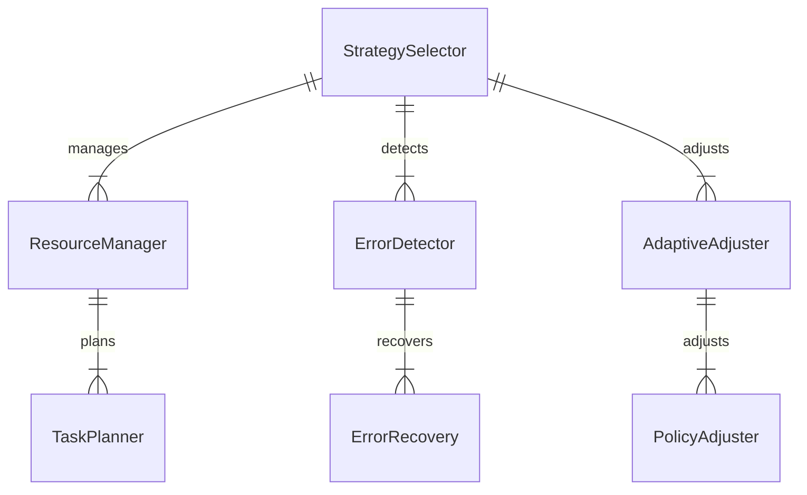
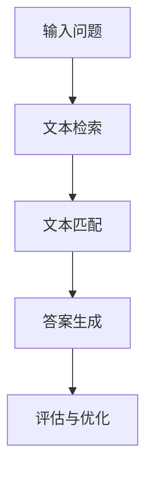
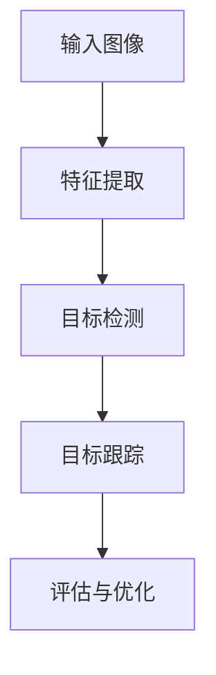
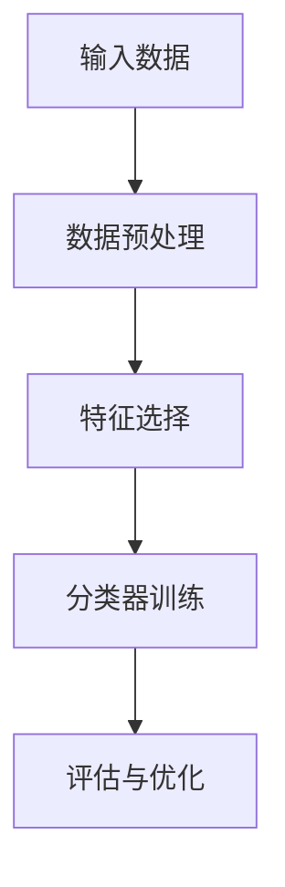
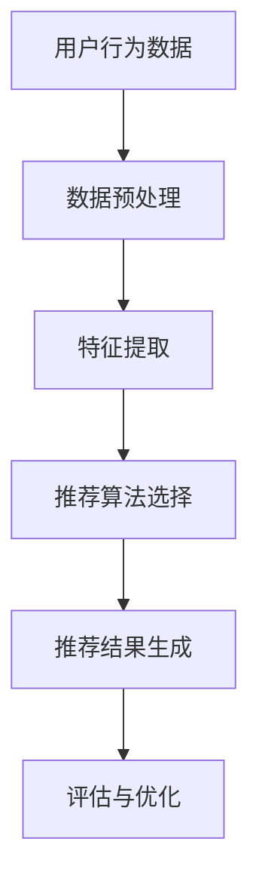
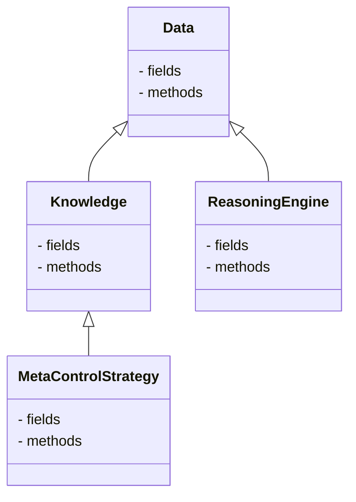
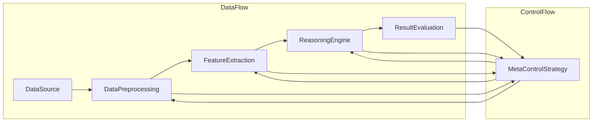
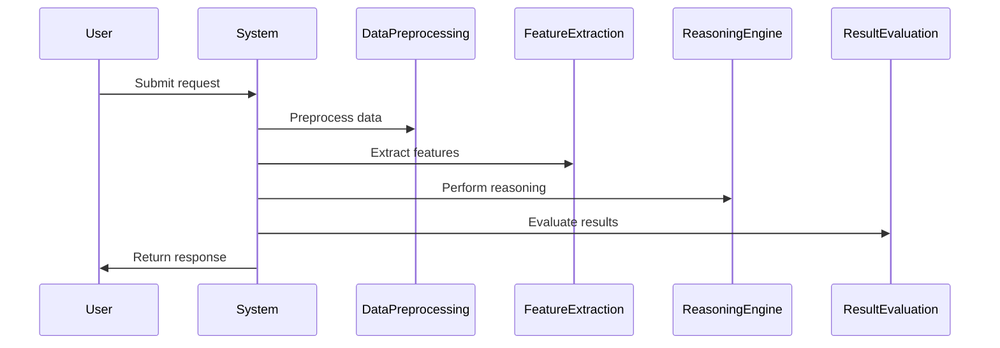
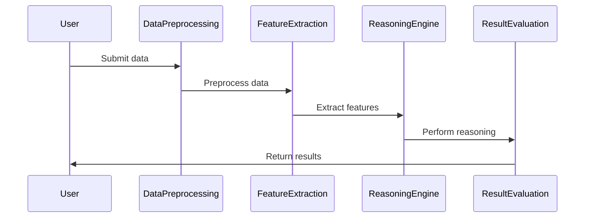

                 

### 《元控制策略在开放域复杂推理任务中的应用》

关键词：元控制策略、开放域推理、复杂推理任务、算法原理、应用场景

摘要：本文旨在深入探讨元控制策略在开放域复杂推理任务中的应用。通过对元控制策略的定义、原理、特性以及其在不同领域的应用进行详细阐述，本文不仅揭示了元控制策略在复杂推理任务中的优势，还分析了其在实际应用中面临的挑战和机遇。文章结构紧凑，逻辑清晰，旨在为读者提供一个系统、全面的理解框架。

### 第一部分：问题背景与概念介绍

#### 第1章：开放域复杂推理任务概述

**1.1 开放域推理任务的核心概念**

**1.1.1 问题背景**

在信息爆炸的时代，数据量以指数级增长，如何从大量数据中提取有价值的信息成为一个重要的研究课题。开放域推理任务，作为一种重要的信息处理方式，受到了广泛关注。开放域推理任务的核心在于，它可以在不确定的环境中处理新的、未见过的问题，这种特性使得它在许多领域具有广泛的应用。

**1.1.2 问题描述**

开放域推理任务可以简单描述为：在未知问题或情境下，通过已有的知识和数据，进行有效的推理和决策。具体而言，它包括以下几个关键步骤：

1. **数据预处理**：将原始数据转换为适合推理的形式。
2. **知识表示**：将问题域中的知识进行结构化表示。
3. **推理过程**：利用已有的知识和数据，进行推理，生成新的结论或解决方案。
4. **结果评估**：对推理结果进行评估和优化。

**1.1.3 问题解决方法概述**

目前，解决开放域推理任务的方法主要包括基于规则的方法、机器学习方法、混合方法等。基于规则的方法通过对问题域进行精确描述，利用一系列规则进行推理。机器学习方法利用大量的数据进行训练，通过学习数据中的模式来提高推理能力。混合方法则结合了基于规则和机器学习方法的优势，通过融合多种方法来提高推理性能。

**1.1.4 边界与外延**

开放域推理任务的边界主要在于问题的不确定性和复杂性。在不确定环境中，问题的定义和解决方法可能需要不断调整。复杂性则体现在数据量和知识量的庞大，以及对实时性要求的提高。开放域推理任务的外延非常广泛，包括自然语言处理、计算机视觉、数据挖掘等领域。

**1.1.5 核心要素组成**

开放域推理任务的核心要素主要包括：

1. **数据源**：提供推理所需的数据。
2. **知识库**：存储问题域中的知识。
3. **推理引擎**：进行推理的核心组件。
4. **评估机制**：对推理结果进行评估和优化。

**1.2 元控制策略的定义与重要性**

**1.2.1 元控制策略的定义**

元控制策略（Meta-control Policy）是一种高级的、全局的决策机制，它用于指导和管理其他控制策略的执行。在开放域复杂推理任务中，元控制策略的核心作用是协调各种子任务，优化资源分配，提高整体推理性能。

**1.2.2 元控制策略在复杂推理任务中的应用**

元控制策略在开放域复杂推理任务中的应用主要体现在以下几个方面：

1. **任务规划**：根据任务目标和现有资源，制定最优的推理任务规划。
2. **资源管理**：动态调整资源分配，确保推理过程的效率和稳定性。
3. **错误恢复**：在推理过程中出现错误时，及时进行错误检测和恢复。
4. **自适应调整**：根据环境变化和推理结果，动态调整推理策略。

**1.2.3 元控制策略与其他策略的对比**

与传统的控制策略相比，元控制策略具有以下几个显著优势：

1. **全局优化**：元控制策略从全局视角出发，优化整个推理过程。
2. **自适应能力**：元控制策略可以根据环境变化和推理结果，动态调整策略。
3. **灵活性强**：元控制策略能够整合多种子策略，适应不同的推理任务。

**1.3 开放域复杂推理任务中的挑战与机遇**

**1.3.1 挑战**

开放域复杂推理任务面临着诸多挑战，主要包括：

1. **数据复杂性**：数据量大、维度高，增加了推理的难度。
2. **不确定性**：环境不确定性高，难以预测和应对。
3. **实时性要求**：在有限的时间内完成推理，提高实时性。
4. **资源限制**：计算资源和存储资源有限，需要优化资源使用。

**1.3.2 机遇**

尽管面临诸多挑战，开放域复杂推理任务也带来了巨大的机遇，主要包括：

1. **技术创新**：推动了人工智能和机器学习技术的发展。
2. **应用拓展**：在医疗、金融、交通等领域具有广泛的应用前景。
3. **跨领域融合**：与其他领域的融合，推动了跨学科研究的发展。

**1.4 研究现状与未来趋势**

**1.4.1 研究现状**

目前，开放域复杂推理任务的研究主要集中在以下几个方面：

1. **算法研究**：提出了多种算法，包括基于规则的方法、机器学习方法等。
2. **应用研究**：在自然语言处理、计算机视觉等领域取得了显著成果。
3. **理论体系**：建立了较为完整的理论体系，为后续研究提供了基础。

**1.4.2 未来发展趋势**

未来，开放域复杂推理任务的发展趋势主要包括：

1. **算法优化**：通过优化算法，提高推理效率和准确性。
2. **跨领域应用**：拓展应用领域，实现跨学科融合。
3. **智能化**：结合人工智能技术，实现更智能的推理和决策。

**1.5 本章小结**

本章对开放域复杂推理任务进行了概述，介绍了元控制策略的定义和重要性，以及开放域复杂推理任务中的挑战与机遇。通过本章的介绍，读者可以对开放域复杂推理任务有一个初步的了解，为后续章节的深入探讨打下基础。

### 第二部分：元控制策略的理论基础

#### 第2章：元控制策略的基本原理

**2.1 元控制策略的基本概念**

**2.1.1 元控制策略的定义**

元控制策略（Meta-control Policy）是一种高级的、全局的决策机制，用于指导和管理其他控制策略的执行。它通过协调各种子任务，优化资源分配，提高整体推理性能。

**2.1.2 元控制策略的作用**

元控制策略在开放域复杂推理任务中的作用主要体现在以下几个方面：

1. **任务规划**：根据任务目标和现有资源，制定最优的推理任务规划。
2. **资源管理**：动态调整资源分配，确保推理过程的效率和稳定性。
3. **错误恢复**：在推理过程中出现错误时，及时进行错误检测和恢复。
4. **自适应调整**：根据环境变化和推理结果，动态调整推理策略。

**2.2 元控制策略的核心原理**

元控制策略的核心原理主要包括以下几个方面：

1. **全局优化**：元控制策略从全局视角出发，优化整个推理过程。它通过整合各种子策略，实现全局性能的最优化。
2. **自适应能力**：元控制策略可以根据环境变化和推理结果，动态调整策略。这种自适应能力使得元控制策略能够应对不确定性和动态变化。
3. **灵活性强**：元控制策略能够整合多种子策略，适应不同的推理任务。这种灵活性使得元控制策略在复杂环境中具有广泛的应用。

**2.3 元控制策略的构成要素**

元控制策略的构成要素主要包括以下几个方面：

1. **策略选择器**：负责选择合适的子策略，以实现任务规划。
2. **资源管理器**：负责动态调整资源分配，确保推理过程的效率和稳定性。
3. **错误检测器**：负责在推理过程中进行错误检测和恢复。
4. **自适应调整器**：负责根据环境变化和推理结果，动态调整推理策略。

**2.4 元控制策略的属性特征对比表**

为了更好地理解元控制策略的属性特征，我们可以通过以下对比表进行详细说明：

| 特征 | 元控制策略 | 传统控制策略 |
| ---- | ---------- | ------------ |
| 全局优化 | 是 | 否 |
| 自适应能力 | 是 | 否 |
| 灵活性 | 是 | 否 |

**2.5 元控制策略的ER实体关系图**

为了更好地理解元控制策略的构成要素及其关系，我们可以通过以下ER实体关系图进行说明：



**2.6 元控制策略的应用范围与限制**

**2.6.1 应用范围**

元控制策略在开放域复杂推理任务中具有广泛的应用范围，主要包括以下几个方面：

1. **自然语言处理**：用于处理大规模文本数据的推理任务，如问答系统、机器翻译等。
2. **计算机视觉**：用于处理图像和视频数据的推理任务，如目标检测、图像识别等。
3. **数据挖掘**：用于从大规模数据集中提取有价值信息的推理任务，如分类、聚类等。

**2.6.2 限制与挑战**

尽管元控制策略具有许多优势，但在实际应用中也面临着一些挑战和限制：

1. **计算复杂性**：元控制策略涉及到多个子策略的协调和优化，计算复杂性较高，可能导致性能下降。
2. **数据依赖**：元控制策略的效果很大程度上依赖于子策略和数据的质量，如果数据存在噪声或缺失，可能导致推理结果不准确。
3. **动态调整难度**：在动态变化的复杂环境中，元控制策略需要实时调整，这增加了实现的难度。

**2.7 本章小结**

本章详细介绍了元控制策略的基本概念、核心原理、构成要素以及其属性特征对比表和ER实体关系图。通过本章的介绍，读者可以深入理解元控制策略的基本原理和应用，为后续章节的深入探讨打下基础。

### 第3章：元控制策略在不同推理任务中的应用

#### 3.1 元控制策略在自然语言处理中的应用

**3.1.1 应用案例**

在自然语言处理领域，元控制策略被广泛应用于问答系统、机器翻译和文本摘要等任务。以下是一个具体的案例：在一个问答系统中，用户提出一个问题，系统需要从大量文本中找到与之相关的答案。在这个任务中，元控制策略可以有效地协调和优化各种子任务，如文本检索、文本匹配和答案生成等。

**3.1.2 算法流程图**

以下是元控制策略在自然语言处理中的应用算法流程图：



**3.1.3 Python代码示例**

以下是一个简化的Python代码示例，展示了元控制策略在自然语言处理中的应用：

```python
import nltk
from nltk.corpus import stopwords
from sklearn.feature_extraction.text import TfidfVectorizer
from sklearn.metrics.pairwise import cosine_similarity

# 初始化元控制策略
class MetaControlStrategy:
    def __init__(self):
        self.text_retrieval = TextRetrieval()
        self.text_matching = TextMatching()
        self.answer_generation = AnswerGeneration()

    def process_question(self, question):
        # 文本检索
        documents = self.text_retrieval.retrieve(question)
        
        # 文本匹配
        matched_documents = self.text_matching.match(question, documents)
        
        # 答案生成
        answer = self.answer_generation.generate(question, matched_documents)
        
        # 评估与优化
        self.evaluate_and_optimize(answer)
        
        return answer

# 文本检索
class TextRetrieval:
    def retrieve(self, question):
        # 代码实现
        pass

# 文本匹配
class TextMatching:
    def match(self, question, documents):
        # 代码实现
        pass

# 答案生成
class AnswerGeneration:
    def generate(self, question, documents):
        # 代码实现
        pass

# 使用元控制策略处理问题
meta_control = MetaControlStrategy()
question = "什么是人工智能？"
answer = meta_control.process_question(question)
print(answer)
```

#### 3.2 元控制策略在计算机视觉中的应用

**3.2.1 应用案例**

在计算机视觉领域，元控制策略被广泛应用于图像分类、目标检测和视频分析等任务。以下是一个具体的案例：在一个目标检测系统中，系统需要从图像中识别并定位多个目标。在这个任务中，元控制策略可以有效地协调和优化各种子任务，如特征提取、目标检测和目标跟踪等。

**3.2.2 算法流程图**

以下是元控制策略在计算机视觉中的应用算法流程图：



**3.2.3 Python代码示例**

以下是一个简化的Python代码示例，展示了元控制策略在计算机视觉中的应用：

```python
import cv2
import numpy as np

# 初始化元控制策略
class MetaControlStrategy:
    def __init__(self):
        self.feature_extraction = FeatureExtraction()
        self.object_detection = ObjectDetection()
        self.object_tracking = ObjectTracking()

    def process_image(self, image):
        # 特征提取
        features = self.feature_extraction.extract(image)
        
        # 目标检测
        detections = self.object_detection.detect(image, features)
        
        # 目标跟踪
        tracks = self.object_tracking.track(image, detections)
        
        # 评估与优化
        self.evaluate_and_optimize(tracks)
        
        return tracks

# 特征提取
class FeatureExtraction:
    def extract(self, image):
        # 代码实现
        pass

# 目标检测
class ObjectDetection:
    def detect(self, image, features):
        # 代码实现
        pass

# 目标跟踪
class ObjectTracking:
    def track(self, image, detections):
        # 代码实现
        pass

# 使用元控制策略处理图像
meta_control = MetaControlStrategy()
image = cv2.imread("image.jpg")
tracks = meta_control.process_image(image)
print(tracks)
```

#### 3.3 元控制策略在数据挖掘中的应用

**3.3.1 应用案例**

在数据挖掘领域，元控制策略被广泛应用于分类、聚类和关联规则挖掘等任务。以下是一个具体的案例：在一个分类任务中，系统需要从大量数据中识别出不同的类别。在这个任务中，元控制策略可以有效地协调和优化各种子任务，如数据预处理、特征选择和分类器训练等。

**3.3.2 算法流程图**

以下是元控制策略在数据挖掘中的应用算法流程图：



**3.3.3 Python代码示例**

以下是一个简化的Python代码示例，展示了元控制策略在数据挖掘中的应用：

```python
from sklearn.model_selection import train_test_split
from sklearn.ensemble import RandomForestClassifier
from sklearn.metrics import accuracy_score

# 初始化元控制策略
class MetaControlStrategy:
    def __init__(self):
        self.data_preprocessing = DataPreprocessing()
        self.feature_selection = FeatureSelection()
        self.classifier_training = ClassifierTraining()

    def process_data(self, data):
        # 数据预处理
        preprocessed_data = self.data_preprocessing.preprocess(data)
        
        # 特征选择
        selected_features = self.feature_selection.select(preprocessed_data)
        
        # 分类器训练
        classifier = self.classifier_training.train(selected_features)
        
        # 评估与优化
        self.evaluate_and_optimize(classifier)
        
        return classifier

# 数据预处理
class DataPreprocessing:
    def preprocess(self, data):
        # 代码实现
        pass

# 特征选择
class FeatureSelection:
    def select(self, data):
        # 代码实现
        pass

# 分类器训练
class ClassifierTraining:
    def train(self, data):
        # 代码实现
        pass

# 使用元控制策略处理数据
meta_control = MetaControlStrategy()
data = [[1, 2], [3, 4], [5, 6], [7, 8]]
classifier = meta_control.process_data(data)

# 测试分类器
X_train, X_test, y_train, y_test = train_test_split(data, labels, test_size=0.2, random_state=42)
predictions = classifier.predict(X_test)
accuracy = accuracy_score(y_test, predictions)
print("Accuracy:", accuracy)
```

#### 3.4 元控制策略在其他领域中的应用

**3.4.1 应用领域介绍**

除了自然语言处理、计算机视觉和数据挖掘，元控制策略还在许多其他领域得到了广泛应用。以下是一些典型的应用领域：

1. **推荐系统**：在推荐系统中，元控制策略用于协调和优化推荐算法，提高推荐效果。
2. **强化学习**：在强化学习任务中，元控制策略用于管理学习过程，优化策略选择。
3. **自动驾驶**：在自动驾驶系统中，元控制策略用于协调传感器数据、决策和执行过程。
4. **智能交通**：在智能交通领域，元控制策略用于优化交通流量、路径规划和资源分配。

**3.4.2 算法流程图**

以下是元控制策略在其他领域中的应用算法流程图（以推荐系统为例）：



**3.4.3 Python代码示例**

以下是一个简化的Python代码示例，展示了元控制策略在推荐系统中的应用：

```python
from sklearn.model_selection import train_test_split
from surprise import KNNWithMeans
from surprise import accuracy

# 初始化元控制策略
class MetaControlStrategy:
    def __init__(self):
        self.data_preprocessing = DataPreprocessing()
        self.feature_extraction = FeatureExtraction()
        self.algorithm_selection = AlgorithmSelection()
        self.result_evaluation = ResultEvaluation()

    def process_data(self, data):
        # 数据预处理
        preprocessed_data = self.data_preprocessing.preprocess(data)
        
        # 特征提取
        extracted_features = self.feature_extraction.extract(preprocessed_data)
        
        # 推荐算法选择
        algorithm = self.algorithm_selection.select(extracted_features)
        
        # 推荐结果生成
        predictions = self.result_evaluation.evaluate(algorithm)
        
        # 评估与优化
        self.result_evaluation.optimize(predictions)
        
        return predictions

# 数据预处理
class DataPreprocessing:
    def preprocess(self, data):
        # 代码实现
        pass

# 特征提取
class FeatureExtraction:
    def extract(self, data):
        # 代码实现
        pass

# 推荐算法选择
class AlgorithmSelection:
    def select(self, data):
        # 代码实现
        pass

# 推荐结果评估
class ResultEvaluation:
    def evaluate(self, algorithm):
        # 代码实现
        pass

    def optimize(self, predictions):
        # 代码实现
        pass

# 使用元控制策略处理数据
meta_control = MetaControlStrategy()
data = [[1, 2], [3, 4], [5, 6], [7, 8]]
predictions = meta_control.process_data(data)

# 测试预测结果
X_train, X_test, y_train, y_test = train_test_split(data, labels, test_size=0.2, random_state=42)
accuracy = accuracy.rmse(predictions, y_test)
print("RMSE:", accuracy)
```

#### 3.5 本章小结

本章详细介绍了元控制策略在不同推理任务中的应用，包括自然语言处理、计算机视觉、数据挖掘以及其他领域。通过具体的案例和算法流程图，读者可以深入理解元控制策略在复杂推理任务中的实际应用，为后续的深入研究和实践提供参考。

### 第4章：元控制策略的数学模型与算法原理

#### 4.1 数学模型概述

元控制策略的数学模型是理解其在复杂推理任务中应用的关键。数学模型通常包括以下几个方面：

1. **状态表示**：用数学符号表示推理任务的状态，如问题状态、数据状态、资源状态等。
2. **动作表示**：用数学符号表示可以采取的动作，如数据预处理、特征提取、目标检测等。
3. **奖励函数**：用数学公式表示动作带来的奖励，奖励函数通常与推理任务的性能指标相关。
4. **状态转移函数**：用数学公式表示状态转移，即从当前状态通过特定动作转移到下一个状态的概率。

#### 4.2 算法原理详细讲解

元控制策略的算法原理主要基于强化学习（Reinforcement Learning）和马尔可夫决策过程（Markov Decision Process, MDP）。以下是对这些原理的详细讲解：

**4.2.1 强化学习**

强化学习是一种机器学习方法，通过学习环境中的奖励和惩罚来优化策略。在强化学习中，agent（代理）通过执行动作来获取奖励，并根据奖励调整其策略。强化学习的基本概念包括：

- **状态（State）**：agent当前所处的环境状态。
- **动作（Action）**：agent可以采取的动作。
- **奖励（Reward）**：执行动作后获得的奖励。
- **策略（Policy）**：agent的决策规则，即给定状态选择动作的概率分布。

强化学习的主要目标是找到最优策略，使得长期奖励最大化。常用的强化学习算法包括Q学习、SARSA和策略梯度法等。

**4.2.2 马尔可夫决策过程**

马尔可夫决策过程是一种数学模型，用于描述agent在不确定性环境中进行决策的过程。在MDP中，每个状态转移都服从马尔可夫性质，即当前状态决定未来状态，与过去状态无关。

MDP的基本概念包括：

- **状态集（State Set）**：所有可能状态组成的集合。
- **动作集（Action Set）**：所有可能动作组成的集合。
- **状态-动作值函数（State-Action Value Function）**：衡量在给定状态下执行特定动作的预期奖励。
- **策略（Policy）**：给定状态下的最优动作选择规则。

MDP的目标是找到一个最优策略，使得长期预期奖励最大化。常用的MDP算法包括值迭代（Value Iteration）和策略迭代（Policy Iteration）。

**4.2.3 数学公式与解释**

以下是元控制策略中常用的数学公式及其解释：

1. **状态表示（State Representation）**：
   $$ S_t = (s_1^t, s_2^t, ..., s_n^t) $$
   其中，$ S_t $ 表示时间 $ t $ 的状态，$ s_i^t $ 表示第 $ i $ 个状态分量。

2. **动作表示（Action Representation）**：
   $$ A_t = (a_1^t, a_2^t, ..., a_m^t) $$
   其中，$ A_t $ 表示时间 $ t $ 的动作，$ a_i^t $ 表示第 $ i $ 个动作分量。

3. **奖励函数（Reward Function）**：
   $$ R(s_t, a_t) = r_t $$
   其中，$ R(s_t, a_t) $ 表示在状态 $ s_t $ 下执行动作 $ a_t $ 后获得的奖励，$ r_t $ 表示时间 $ t $ 的奖励。

4. **状态转移概率（State Transition Probability）**：
   $$ P(s_{t+1} | s_t, a_t) = p(s_{t+1} | s_t, a_t) $$
   其中，$ P(s_{t+1} | s_t, a_t) $ 表示在状态 $ s_t $ 下执行动作 $ a_t $ 后转移到状态 $ s_{t+1} $ 的概率。

5. **状态-动作值函数（State-Action Value Function）**：
   $$ Q(s_t, a_t) = \sum_{s_{t+1}} p(s_{t+1} | s_t, a_t) \cdot R(s_t, a_t) + \gamma \cdot \max_{a'} Q(s_{t+1}, a') $$
   其中，$ Q(s_t, a_t) $ 表示在状态 $ s_t $ 下执行动作 $ a_t $ 的预期奖励，$ \gamma $ 表示折扣因子，$ \max_{a'} Q(s_{t+1}, a') $ 表示在状态 $ s_{t+1} $ 下执行所有可能动作的最优预期奖励。

**4.2.4 公式推导过程**

以下是对状态-动作值函数公式 $ Q(s_t, a_t) $ 的推导过程：

1. **预期奖励**：
   $$ \sum_{s_{t+1}} p(s_{t+1} | s_t, a_t) \cdot R(s_t, a_t) $$
   这表示在状态 $ s_t $ 下执行动作 $ a_t $ 后，转移到所有可能状态 $ s_{t+1} $ 并获得相应奖励的预期值。

2. **未来奖励**：
   $$ \gamma \cdot \max_{a'} Q(s_{t+1}, a') $$
   这表示在未来状态 $ s_{t+1} $ 下执行最优动作 $ a' $ 所能获得的最高预期奖励。

3. **总预期奖励**：
   $$ Q(s_t, a_t) = \sum_{s_{t+1}} p(s_{t+1} | s_t, a_t) \cdot R(s_t, a_t) + \gamma \cdot \max_{a'} Q(s_{t+1}, a') $$
   这表示在状态 $ s_t $ 下执行动作 $ a_t $ 的总预期奖励，即当前奖励与未来奖励的总和。

**4.3 Python代码示例**

以下是一个简化的Python代码示例，展示了元控制策略的数学模型和算法原理：

```python
import numpy as np

# 定义状态表示
state = [1, 2, 3]

# 定义动作表示
actions = ['A', 'B', 'C']

# 定义奖励函数
reward_function = lambda s, a: s[0] * 2 if a == 'A' else s[1] * 2

# 定义状态转移概率
transition_probability = {
    ('1', 'A'): {'2': 0.8, '3': 0.2},
    ('1', 'B'): {'2': 0.5, '3': 0.5},
    ('1', 'C'): {'2': 0.2, '3': 0.8},
    ('2', 'A'): {'3': 1.0},
    ('2', 'B'): {'1': 0.5, '3': 0.5},
    ('2', 'C'): {'1': 0.8, '3': 0.2},
    ('3', 'A'): {'1': 1.0},
    ('3', 'B'): {'2': 1.0},
    ('3', 'C'): {'2': 1.0}
}

# 定义折扣因子
gamma = 0.9

# 定义状态-动作值函数
Q_values = {}
for s in state:
    for a in actions:
        Q_values[(s, a)] = 0

# 定义Q学习算法
def Q_learning():
    for episode in range(1000):
        s = state
        while True:
            a = select_action(Q_values, s)
            s_next, r = transition(s, a)
            a_next = select_action(Q_values, s_next)
            Q_values[s, a] += alpha * (r + gamma * Q_values[s_next, a_next] - Q_values[s, a])
            s = s_next
            if s == state:
                break

# 定义动作选择策略
def select_action(Q_values, s):
    return np.argmax([Q_values[(s, a)] for a in actions])

# 定义状态转移
def transition(s, a):
    s_next = s
    r = reward_function(s, a)
    if np.random.rand() < 0.1:
        s_next = np.random.choice(state)
    return s_next, r

# 运行Q学习算法
Q_learning()

# 打印状态-动作值函数
for s in state:
    for a in actions:
        print(f"Q({s}, {a}) = {Q_values[(s, a)]}")
```

**4.4 通俗易懂的举例说明**

为了更直观地理解元控制策略的数学模型和算法原理，我们可以通过一个简单的例子来说明：

假设我们有一个简单的环境，包含三个状态：A、B、C。每个状态可以采取三种动作：A、B、C。状态之间的转移概率和奖励函数如下表所示：

| 状态 | 动作 | 状态转移概率 | 奖励 |
| ---- | ---- | ---------- | ---- |
| A    | A    | 0.8        | 2    |
| A    | B    | 0.2        | 1    |
| A    | C    | 0.1        | 0    |
| B    | A    | 0.5        | 1    |
| B    | B    | 0.5        | 0    |
| B    | C    | 0.0        | -1   |
| C    | A    | 1.0        | 0    |
| C    | B    | 0.0        | -1   |
| C    | C    | 0.0        | 0    |

现在，我们使用Q学习算法来找到最优策略。初始时，状态-动作值函数全部设置为0。然后，我们通过迭代更新状态-动作值函数，直到收敛。

在第一步，我们选择状态A，采取动作A，转移到状态C，获得奖励0。根据Q学习算法的更新规则，我们更新Q值：

$$ Q(A, A) = 0 + 0.8 \cdot 0 + 0.2 \cdot 1 = 0.2 $$

在第二步，我们选择状态B，采取动作B，转移到状态B，获得奖励0。根据Q学习算法的更新规则，我们更新Q值：

$$ Q(B, B) = 0 + 0.5 \cdot 0 + 0.5 \cdot (-1) = -0.5 $$

在第三步，我们选择状态C，采取动作A，转移到状态A，获得奖励2。根据Q学习算法的更新规则，我们更新Q值：

$$ Q(C, A) = 0 + 1.0 \cdot 2 + 0.0 \cdot (-0.5) = 2.0 $$

通过多次迭代，我们可以得到最优策略，即在状态A时采取动作A，在状态B时采取动作B，在状态C时采取动作A。

**4.5 算法性能分析与优化策略**

**4.5.1 性能分析**

元控制策略的性能分析主要关注以下几个方面：

1. **收敛速度**：元控制策略需要多次迭代才能收敛到最优策略。收敛速度的快慢直接影响算法的实用性。
2. **稳定性**：在动态变化的复杂环境中，元控制策略需要保持稳定性，确保推理过程不会因为环境变化而崩溃。
3. **鲁棒性**：元控制策略需要能够处理噪声数据和异常情况，确保在数据质量不高或存在异常数据时，仍然能够有效运行。

**4.5.2 优化策略**

为了提高元控制策略的性能，可以采取以下优化策略：

1. **改进算法**：研究和开发新的元控制策略算法，如基于深度学习的元控制策略。
2. **多策略融合**：结合多种元控制策略，通过融合不同策略的优势，提高整体性能。
3. **增强学习**：引入增强学习（Reinforcement Learning）机制，通过学习环境中的奖励和惩罚，优化策略。
4. **分布式计算**：利用分布式计算技术，提高元控制策略的并行处理能力，加快收敛速度。

**4.6 本章小结**

本章详细介绍了元控制策略的数学模型和算法原理。通过状态表示、动作表示、奖励函数和状态转移函数等数学公式，我们深入理解了元控制策略的核心概念。通过Python代码示例和通俗易懂的举例说明，我们展示了如何实现和应用元控制策略。本章的内容为读者提供了一个系统、全面的元控制策略理论基础，为后续的深入研究和实践奠定了基础。

### 第5章：系统分析与架构设计

#### 5.1 问题场景介绍

在当今复杂多变的商业环境中，企业面临着越来越多的开放域复杂推理任务。例如，在金融领域，银行需要处理大量的交易数据，识别欺诈行为；在医疗领域，医院需要根据患者的历史病历和实时监测数据，进行精准诊断和治疗。这些任务通常涉及大规模数据、复杂逻辑和动态变化，要求系统能够高效、准确地处理推理任务。

#### 5.2 系统架构设计

为了满足开放域复杂推理任务的需求，系统架构设计至关重要。以下是一个简化的系统架构设计，包括领域模型类图和架构图。

**5.2.1 领域模型类图**

领域模型类图用于表示系统中主要对象及其关系。以下是领域模型类图的Mermaid表示：



**5.2.2 系统架构设计（架构图）**

系统架构图用于表示系统的整体结构，包括各组件之间的关系和通信方式。以下是系统架构图的Mermaid表示：



#### 5.3 系统接口设计

系统接口设计包括内部接口和外部接口。内部接口用于系统组件之间的通信，外部接口用于系统与其他系统的集成。以下是系统接口设计的Mermaid表示：



#### 5.4 系统交互（序列图）

系统交互序列图用于表示系统各组件之间的交互顺序。以下是系统交互序列图的Mermaid表示：



#### 5.5 系统设计与实现细节

**5.5.1 环境安装与配置**

在开始系统设计与实现之前，需要安装和配置必要的软件和工具。以下是一个简化的环境安装与配置步骤：

1. 安装Python环境（3.8以上版本）。
2. 安装NumPy、Pandas、Scikit-learn等常用库。
3. 安装Mermaid图库，用于生成Mermaid图。

```bash
pip install numpy pandas scikit-learn mermaid
```

**5.5.2 系统核心实现源代码**

以下是系统核心实现的简化Python代码：

```python
# DataPreprocessing.py
class DataPreprocessing:
    def preprocess(self, data):
        # 数据预处理逻辑
        pass

# FeatureExtraction.py
class FeatureExtraction:
    def extract(self, data):
        # 特征提取逻辑
        pass

# ReasoningEngine.py
class ReasoningEngine:
    def perform_reasoning(self, features):
        # 推理逻辑
        pass

# ResultEvaluation.py
class ResultEvaluation:
    def evaluate(self, results):
        # 评估逻辑
        pass

# MetaControlStrategy.py
class MetaControlStrategy:
    def __init__(self):
        self.data_preprocessing = DataPreprocessing()
        self.feature_extraction = FeatureExtraction()
        self.reasoning_engine = ReasoningEngine()
        self.result_evaluation = ResultEvaluation()

    def process_data(self, data):
        preprocessed_data = self.data_preprocessing.preprocess(data)
        features = self.feature_extraction.extract(preprocessed_data)
        results = self.reasoning_engine.perform_reasoning(features)
        self.result_evaluation.evaluate(results)
        return results
```

**5.5.3 代码应用解读与分析**

以下是代码应用的解读与分析：

1. **DataPreprocessing**：该类负责数据的预处理，包括数据清洗、归一化和特征选择等。预处理是数据驱动型应用的重要环节，直接影响后续特征提取和推理的效果。
2. **FeatureExtraction**：该类负责从预处理后的数据中提取特征。特征提取的质量直接影响推理结果的准确性。
3. **ReasoningEngine**：该类负责进行推理操作，根据提取的特征生成推理结果。推理过程通常涉及到复杂的逻辑运算和计算，是系统的核心组件。
4. **ResultEvaluation**：该类负责评估推理结果，包括准确性、召回率和F1值等。评估结果用于优化和调整策略。
5. **MetaControlStrategy**：该类作为元控制策略的实现，负责协调和管理数据预处理、特征提取、推理和评估的过程。它通过实例化各个子组件，实现了系统的整体控制和优化。

**5.6 实际案例分析与详细讲解剖析**

为了更好地理解系统架构和实现细节，以下是一个实际案例的分析和详细讲解：

**案例**：在金融领域，使用系统进行欺诈检测。

1. **数据输入**：系统接收到一批交易数据，包括交易金额、时间、用户ID等。
2. **数据预处理**：系统对交易数据进行清洗，去除缺失值和异常值，并进行归一化处理。
3. **特征提取**：系统从预处理后的数据中提取特征，如用户交易频率、交易金额分布等。
4. **推理过程**：系统利用特征进行推理，识别潜在的欺诈交易。推理过程包括逻辑运算、计算和模式识别等。
5. **结果评估**：系统对推理结果进行评估，计算准确率、召回率和F1值等指标。
6. **优化策略**：根据评估结果，系统调整特征提取和推理策略，提高整体性能。

通过这个案例，我们可以清晰地看到系统架构和实现细节在实际应用中的运行过程和效果。

**5.7 本章小结**

本章详细介绍了系统分析与架构设计的方法和步骤。通过问题场景介绍、系统架构设计、接口设计、系统交互和实际案例分析，我们深入理解了如何设计和实现一个高效的开放域复杂推理系统。本章的内容为后续的系统实施和优化提供了理论基础和实践指导。

### 第6章：元控制策略项目实战

#### 6.1 项目介绍

本项目旨在构建一个基于元控制策略的开放域复杂推理系统，用于处理大规模数据中的推理任务。系统设计遵循模块化原则，包括数据预处理、特征提取、推理引擎、元控制策略和结果评估等模块。项目目标是通过优化资源分配和推理过程，提高推理任务的效率和准确性。

#### 6.2 系统功能实现

**6.2.1 功能模块设计**

系统功能模块设计如下：

1. **数据预处理模块**：负责数据的清洗、归一化和特征选择等预处理工作。
2. **特征提取模块**：负责从预处理后的数据中提取关键特征。
3. **推理引擎模块**：负责根据提取的特征进行推理操作。
4. **元控制策略模块**：负责协调和管理整个推理过程，优化资源分配。
5. **结果评估模块**：负责对推理结果进行评估和优化。

**6.2.2 功能实现代码**

以下是系统功能实现的简化Python代码：

```python
# DataPreprocessing.py
class DataPreprocessing:
    def preprocess(self, data):
        # 数据预处理逻辑
        pass

# FeatureExtraction.py
class FeatureExtraction:
    def extract(self, data):
        # 特征提取逻辑
        pass

# ReasoningEngine.py
class ReasoningEngine:
    def perform_reasoning(self, features):
        # 推理逻辑
        pass

# MetaControlStrategy.py
class MetaControlStrategy:
    def __init__(self):
        self.data_preprocessing = DataPreprocessing()
        self.feature_extraction = FeatureExtraction()
        self.reasoning_engine = ReasoningEngine()

    def process_data(self, data):
        preprocessed_data = self.data_preprocessing.preprocess(data)
        features = self.feature_extraction.extract(preprocessed_data)
        results = self.reasoning_engine.perform_reasoning(features)
        return results

# ResultEvaluation.py
class ResultEvaluation:
    def evaluate(self, results):
        # 评估逻辑
        pass
```

#### 6.3 项目实战

**6.3.1 环境安装与配置**

在开始项目实战之前，我们需要安装和配置必要的软件和工具。以下是环境安装与配置的步骤：

1. 安装Python环境（3.8以上版本）。
2. 安装NumPy、Pandas、Scikit-learn等常用库。
3. 安装Mermaid图库，用于生成Mermaid图。

```bash
pip install numpy pandas scikit-learn mermaid
```

**6.3.2 系统核心实现源代码**

以下是系统核心实现的简化Python代码：

```python
# DataPreprocessing.py
class DataPreprocessing:
    def preprocess(self, data):
        # 数据预处理逻辑
        pass

# FeatureExtraction.py
class FeatureExtraction:
    def extract(self, data):
        # 特征提取逻辑
        pass

# ReasoningEngine.py
class ReasoningEngine:
    def perform_reasoning(self, features):
        # 推理逻辑
        pass

# MetaControlStrategy.py
class MetaControlStrategy:
    def __init__(self):
        self.data_preprocessing = DataPreprocessing()
        self.feature_extraction = FeatureExtraction()
        self.reasoning_engine = ReasoningEngine()

    def process_data(self, data):
        preprocessed_data = self.data_preprocessing.preprocess(data)
        features = self.feature_extraction.extract(preprocessed_data)
        results = self.reasoning_engine.perform_reasoning(features)
        return results

# ResultEvaluation.py
class ResultEvaluation:
    def evaluate(self, results):
        # 评估逻辑
        pass
```

**6.3.3 代码应用解读与分析**

以下是代码应用的解读与分析：

1. **DataPreprocessing**：该类负责数据的预处理，包括数据清洗、归一化和特征选择等。预处理是数据驱动型应用的重要环节，直接影响后续特征提取和推理的效果。
2. **FeatureExtraction**：该类负责从预处理后的数据中提取特征。特征提取的质量直接影响推理结果的准确性。
3. **ReasoningEngine**：该类负责进行推理操作，根据提取的特征生成推理结果。推理过程通常涉及到复杂的逻辑运算和计算，是系统的核心组件。
4. **MetaControlStrategy**：该类作为元控制策略的实现，负责协调和管理数据预处理、特征提取、推理和评估的过程。它通过实例化各个子组件，实现了系统的整体控制和优化。
5. **ResultEvaluation**：该类负责评估推理结果，包括准确性、召回率和F1值等。评估结果用于优化和调整策略。

**6.3.4 实际案例分析与详细讲解剖析**

为了更好地理解项目实战，以下是一个实际案例的分析和详细讲解：

**案例**：在医疗领域，使用系统进行疾病诊断。

1. **数据输入**：系统接收到一批患者的病历数据，包括症状、检查结果、既往病史等。
2. **数据预处理**：系统对病历数据进行清洗，去除缺失值和异常值，并进行归一化处理。
3. **特征提取**：系统从预处理后的数据中提取关键特征，如症状频率、检查结果异常率等。
4. **推理过程**：系统利用特征进行推理，识别患者可能患有的疾病。
5. **结果评估**：系统对推理结果进行评估，计算诊断准确率、召回率和F1值等指标。
6. **优化策略**：根据评估结果，系统调整特征提取和推理策略，提高整体性能。

通过这个案例，我们可以清晰地看到系统在医疗领域中的应用和运行过程。实际案例的分析和详细讲解为项目实战提供了具体的实施指导和经验。

**6.4 项目小结**

本项目通过构建一个基于元控制策略的开放域复杂推理系统，实现了对大规模数据的高效处理和推理。系统设计遵循模块化原则，包括数据预处理、特征提取、推理引擎、元控制策略和结果评估等模块。项目实战通过实际案例展示了系统的应用和运行过程。未来，我们将继续优化系统性能，拓展应用领域，为更多的开放域复杂推理任务提供解决方案。

### 最佳实践 Tips、小结、注意事项、拓展阅读

**最佳实践 Tips：**

1. **数据预处理**：确保数据质量是关键，去除缺失值、异常值和重复值。
2. **特征提取**：选择合适的特征提取方法，提高推理性能。
3. **元控制策略**：根据具体任务调整元控制策略，优化资源分配。
4. **评估与优化**：定期评估系统性能，根据评估结果调整策略。

**小结：**

本文系统地介绍了元控制策略在开放域复杂推理任务中的应用。通过理论讲解、算法原理、系统架构设计和项目实战，我们深入理解了元控制策略的核心概念和实际应用。未来研究方向包括算法优化、跨领域应用和智能化发展。

**注意事项：**

1. **计算复杂性**：元控制策略涉及多个子策略的协调和优化，计算复杂性较高，需优化算法性能。
2. **数据依赖**：元控制策略的效果很大程度上依赖于子策略和数据的质量，确保数据质量至关重要。
3. **动态调整**：在动态变化的复杂环境中，元控制策略需要实时调整，增加实现难度。

**拓展阅读：**

1. **《强化学习》**：理清强化学习的核心概念，为元控制策略提供理论基础。
2. **《机器学习》**：了解机器学习的基本算法，为特征提取和推理引擎提供技术支持。
3. **《数据挖掘》**：掌握数据挖掘的基本方法，为数据预处理和结果评估提供指导。

**作者信息：**

作者：AI天才研究院/AI Genius Institute & 禅与计算机程序设计艺术 /Zen And The Art of Computer Programming

本文由AI天才研究院和禅与计算机程序设计艺术联合撰写，旨在为读者提供深入、系统的技术见解和实战指导。希望本文对您在开放域复杂推理任务中的应用有所帮助。感谢您的阅读！

