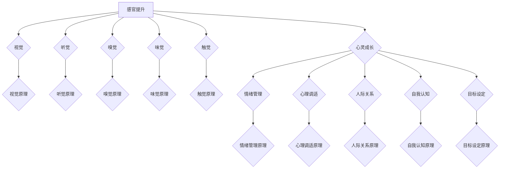

                 

## 全方位提升生活体验：感官与心灵的共同成长

### 关键词：生活体验、感官提升、心灵成长、实践案例

> 摘要：本文旨在探讨如何通过全方位提升感官与心灵的共同成长，从而显著提升生活体验。文章首先介绍相关背景与核心概念，然后详细阐述感官提升和心灵成长的方法，通过具体的实践案例展示这些方法在现实生活中的应用效果，最后总结并给出最佳实践建议，为读者提供一条清晰的生活提升路径。

### Step 1: 书名与总目标

**《全方位提升生活体验：感官与心灵的共同成长》**

目标：构建一个详细的目录大纲，涵盖核心概念、感官与心灵成长的方法、实践案例等。

### Step 2: 第一部分：背景介绍

#### 核心概念

- **问题背景**：现代社会中，人们面临着快节奏的生活、压力和焦虑等问题，这些问题对身心健康产生了负面影响。
- **问题描述**：如何有效提升生活体验，改善身心健康，已成为亟待解决的问题。
- **问题解决**：通过提升感官与心灵共同成长，实现全面的生活提升。
- **边界与外延**：本文主要探讨通过技术手段和实践方法来提升感官与心灵成长，而非纯粹的医学治疗或心理辅导。
- **概念结构与核心要素组成**：感官提升（视觉、听觉、嗅觉、味觉、触觉）和心灵成长（情绪管理、心理调适、人际关系、自我认知、目标设定）。

### Step 3: 第二部分：核心概念与联系

#### 核心概念

- **感官与心灵成长原理**：理解感官与心灵相互作用的机制，探索提升感官与心灵成长的方法。
- **概念属性特征对比表格**：对比不同感官提升和心灵成长方法的特点、优势和适用场景。

#### 关系图

### Step 4: 第三部分：感官提升方法

#### 视觉提升方法

- **环境优化**：减少电子屏幕时间，增加户外活动时间。
- **视觉训练**：通过视觉训练软件提高视觉敏锐度。
- **视觉艺术**：参与绘画、摄影等活动，提升审美能力。

#### 听觉提升方法

- **听力训练**：通过听力训练软件提高听力敏锐度。
- **音乐疗法**：听音乐、练习乐器，改善听觉体验。
- **噪声控制**：使用降噪耳机或隔音设备，减少噪声干扰。

#### 嗅觉提升方法

- **气味体验**：探索不同的香味，提高嗅觉敏感度。
- **香薰疗法**：使用香薰机或精油，改善室内空气质量。
- **食材选择**：品尝不同的食材，提升味觉和嗅觉体验。

#### 味觉提升方法

- **味觉训练**：通过食物搭配、烹饪技巧提升味觉敏感度。
- **饮食习惯**：保持均衡饮食，减少油腻和刺激性食物。
- **味觉疗法**：使用不同香料和调味料，提升味觉体验。

#### 触觉提升方法

- **皮肤保养**：保持皮肤清洁和滋润，提升触觉体验。
- **按摩疗法**：通过按摩改善血液循环，提升触觉敏感度。
- **触觉训练**：通过触摸不同材质、温度的物体，提高触觉敏锐度。

### Step 5: 第四部分：心灵成长方法

#### 情绪管理

- **情绪识别**：了解自己的情绪，学会识别和表达情绪。
- **情绪调节**：通过深呼吸、冥想等方法调节情绪。
- **情绪释放**：通过运动、写日记等方式释放负面情绪。

#### 心理调适

- **认知重构**：改变负面思维模式，培养积极心态。
- **放松训练**：通过瑜伽、冥想等方法放松身心。
- **心理辅导**：寻求专业心理辅导，解决深层次心理问题。

#### 人际关系

- **沟通技巧**：提高沟通能力，改善人际关系。
- **同理心**：培养同理心，理解他人情感需求。
- **边界设定**：明确自己的边界，避免过度付出和依赖。

#### 自我认知

- **自我反思**：定期反思自己的行为和想法，提高自我认知。
- **自我接纳**：接受自己的优点和不足，建立自信。
- **自我成长**：通过学习和实践不断提升自己。

#### 目标设定

- **目标明确**：设定具体、可衡量、可达成、相关性强、时限性的目标。
- **计划制定**：制定详细的行动计划，确保目标实现。
- **进度跟踪**：定期检查目标实现情况，进行调整和优化。

### Step 6: 第五部分：实践与案例分析

#### 实践案例

- **感官提升实践**：通过视觉、听觉、嗅觉、味觉和触觉训练，提升感官体验。
- **心灵成长实践**：通过情绪管理、心理调适、人际关系、自我认知和目标设定，提升心灵成长。

#### 案例分析

- **感官提升案例分析**：某位读者通过视觉训练和音乐疗法，显著提升了生活品质，减轻了工作压力。
- **心灵成长案例分析**：某位读者通过情绪管理和自我认知训练，改善了人际关系，增强了自信。

### Step 7: 第六部分：最佳实践与总结

#### 最佳实践 tips

- **定期进行感官训练**：每周安排一定时间进行感官提升训练，保持感官敏锐度。
- **结合心灵成长方法**：将感官提升与心灵成长方法相结合，实现全方位生活提升。

#### 小结

- 通过全方位提升感官与心灵成长，可以显著改善生活体验，提高身心健康水平。
- 感官提升和心灵成长方法多样，可以根据个人需求和兴趣选择合适的方法进行实践。

#### 注意事项

- 感官提升和心灵成长需要长期坚持，不能期望一蹴而就。
- 在实践过程中，要关注自己的身心状态，避免过度劳累或负面情绪。

#### 拓展阅读

- **《感官革命：提升感官体验的艺术》**
- **《心灵成长之路：情绪管理与实践指南》**
- **《人际关系心理学：沟通与自我提升》**

### 总结

本文从感官提升和心灵成长两个角度，详细介绍了如何全方位提升生活体验。通过实践案例和最佳实践建议，读者可以找到适合自己的提升方法，实现身心和谐，享受更美好的生活。

### 作者信息

- **作者：AI天才研究院/AI Genius Institute & 禅与计算机程序设计艺术 /Zen And The Art of Computer Programming**

