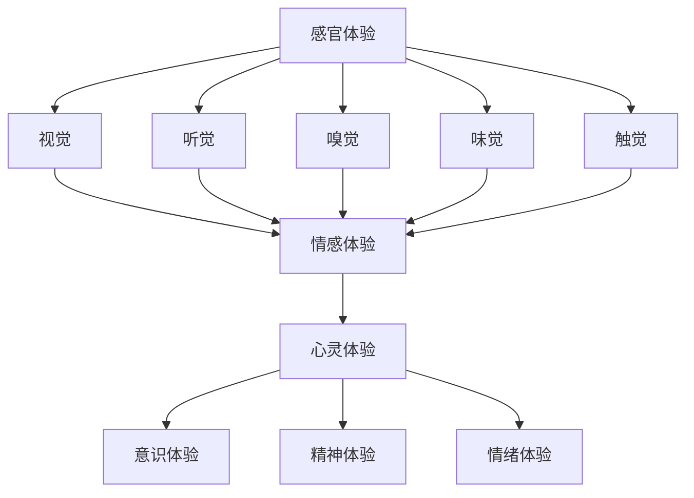

                 

### 背景介绍

在现代社会，人们的生活节奏日益加快，物质条件显著提升，但与此同时，精神层面的需求日益凸显。感官体验与心灵体验作为人类生存与发展的两大核心要素，不仅仅影响着个体的日常生活质量，还深刻地影响着他们的心理健康和幸福感。因此，全方位的生活体验提升成为一个亟待关注的重要课题。

#### 核心概念术语说明

1. **感官体验**：指通过视觉、听觉、嗅觉、味觉和触觉这五种感官对外界信息的感知和体验。
2. **心灵体验**：指人在情感、意识、精神和情绪等心理层面的体验和感受。
3. **全方位生活体验**：综合感官体验与心灵体验，全方位提升个体的生活质量和幸福感。

#### 问题背景

在当前的社会背景下，许多人由于生活压力大、工作繁忙，忽视了感官体验与心灵体验的重要性。感官体验的贫乏和心灵体验的缺失导致了许多健康问题，如视觉疲劳、听觉损伤、嗅觉和味觉敏感度下降，以及情绪不稳定、焦虑、抑郁等心理问题。这些问题不仅影响了个体的生活品质，也对社会和谐发展产生了负面影响。

#### 问题描述

- **感官体验不足**：由于电子产品的过度依赖，许多人长期处于视觉和听觉疲劳状态，感官敏感度下降。
- **心灵体验缺失**：快节奏的生活使得人们缺乏情感交流和心灵反思的时间，导致心理健康问题日益严重。
- **全方位生活体验缺乏**：感官与心灵体验的割裂使得人们难以达到全面的生活质量提升。

#### 问题解决

本书旨在通过深入探讨感官体验与心灵体验的核心概念、联系以及提升方法，为读者提供全方位的生活体验提升策略。通过理论讲解、案例分析和实践指导，帮助读者理解并改善自身的感官与心灵体验，从而提高生活质量和幸福感。

#### 边界与外延

- **感官体验**：不仅包括视觉、听觉、嗅觉、味觉和触觉，还可以扩展到触觉、温觉、痛觉等其他感官体验。
- **心灵体验**：除了情感、意识、精神和情绪体验，还可以涉及认知、道德、信仰等更深层次的心理体验。
- **全方位生活体验**：不仅涉及个体生活，还与家庭、社会、文化等外部环境密切相关。

#### 概念结构与核心要素组成

- **感官体验**：视觉、听觉、嗅觉、味觉、触觉。
- **心灵体验**：情感、意识、精神、情绪。
- **全方位生活体验**：感官体验+心灵体验+外部环境因素。

通过上述背景介绍，我们可以清晰地看到，全方位的生活体验提升是一个涉及多方面、多维度的复杂过程。在接下来的章节中，我们将逐步深入探讨这一课题，为读者提供全面的理论和实践指导。

### 核心概念与联系

在探讨全方位的生活体验提升之前，有必要先理解两个核心概念：感官体验和心灵体验。这两者不仅各自独立，又紧密相连，共同构成了人类生活的多维体验。

#### 感官体验

感官体验是指通过视觉、听觉、嗅觉、味觉和触觉这五种基本感官对外界信息进行感知和体验的过程。每种感官都有其独特的功能和特性：

1. **视觉体验**：通过眼睛捕捉光线，形成图像，帮助我们识别形状、颜色、距离等信息。
2. **听觉体验**：通过耳朵接收声音，帮助我们识别语言、音乐和其他环境声音。
3. **嗅觉体验**：通过鼻腔感知气味，帮助我们辨别不同的味道和气味。
4. **味觉体验**：通过舌头感知食物的口感和味道，帮助我们判断食物的营养价值和安全性。
5. **触觉体验**：通过皮肤感知触觉，包括温度、压力、质地等，帮助我们了解周围环境。

这些感官体验不仅帮助我们获取外部信息，还直接影响了我们的情绪和行为。

#### 心灵体验

心灵体验则是指人在情感、意识、精神和情绪等心理层面的体验和感受。心灵体验具有以下几个核心维度：

1. **情感体验**：情感是心灵体验的基础，包括快乐、悲伤、愤怒、恐惧等基本情绪，以及更复杂的情感如爱、同情、厌恶等。
2. **意识体验**：意识体验涉及我们对自身和周围世界的认知，包括知觉、思考、判断和反思。
3. **精神体验**：精神体验关乎我们的内心状态和信仰，如冥想、祈祷、灵修等，它们帮助我们在精神层面上达到一种和谐和宁静。
4. **情绪体验**：情绪体验是我们对情感的反应，包括情感的表达、调控和管理。

心灵体验不仅影响我们的心理健康，也直接影响我们的行为和生活质量。

#### 感官体验与心灵体验的联系

感官体验与心灵体验之间存在着密切的联系和相互影响：

1. **感官体验对心灵体验的影响**：强烈的感官体验可以引发深刻的情感反应，从而影响我们的情绪和心理状态。例如，看到美丽的风景可以让人感到愉悦，而听到刺耳的声音则可能引发焦虑。

2. **心灵体验对感官体验的影响**：心灵体验可以调节我们的感官体验。例如，一个乐观的人在面对同样的感官刺激时，可能会体验到更积极的情感，而一个悲观的人则可能感到沮丧。

3. **综合作用**：感官体验与心灵体验的综合作用可以帮助我们达到更高的生活质量和幸福感。通过提升感官体验，我们可以更全面地感知世界，而通过提升心灵体验，我们可以更好地调节自己的情绪和心理状态，从而实现内在和谐。

为了更直观地展示感官体验与心灵体验之间的关系，我们可以使用 Mermaid 流程图来表示这种联系：

通过上述流程图，我们可以看到感官体验是如何通过情感体验最终影响心灵体验的。接下来，我们将分别深入探讨感官体验和心灵体验，以理解它们的独特性和如何提升这些体验。

### 感官体验

感官体验是人类获取外界信息的重要途径，通过对视觉、听觉、嗅觉、味觉和触觉的详细探讨，我们可以更好地理解每种感官的原理及其对我们的生活和心理健康的影响。

#### 视觉体验

**视觉感知原理**：

视觉体验是通过眼睛捕捉光线的刺激，并将其转化为神经信号传递给大脑的过程。眼睛的基本结构包括角膜、晶状体、视网膜等。光线通过角膜和晶状体的折射，最终聚焦在视网膜上，视网膜上的感光细胞（视杆细胞和视锥细胞）将光信号转化为电信号，通过视神经传递到大脑皮层，形成视觉感知。

**视觉艺术与审美**：

视觉艺术不仅包括绘画、雕塑等传统艺术形式，还涵盖了现代的摄影、数字艺术等。审美是人类对视觉体验的一种高级反应，它涉及对美的感知、理解和评价。通过视觉艺术，人们可以提升审美能力，培养对美的敏感度和创造力。

**视觉训练与提升**：

视觉训练包括眼部运动、视力恢复和审美能力的培养。通过定期进行眼部锻炼，如眼球转动、聚焦练习，可以缓解视觉疲劳，提高视力。此外，欣赏不同类型的艺术作品，如自然景观、抽象画等，可以帮助人们提升审美能力和视觉敏锐度。

#### 听觉体验

**听觉感知原理**：

听觉体验是通过耳朵捕捉声波，并将其转化为神经信号传递给大脑的过程。声波通过外耳道传入中耳，引起鼓膜振动，通过听小骨传递到内耳，最终刺激耳蜗中的毛细胞，产生神经信号，传递到大脑皮层，形成听觉感知。

**音乐与心理**：

音乐是一种独特的听觉体验，它可以影响人的情绪、认知和行为。不同类型的音乐可以激发不同的情感反应，如快乐、悲伤、兴奋等。音乐治疗也已被广泛应用于心理疾病的治疗中，通过音乐调节情绪，缓解压力和焦虑。

**听觉训练与提升**：

听觉训练包括听力训练、音乐练习和声音辨识能力的培养。通过定期进行听力训练，如声音辨识、音高和节奏练习，可以提升听力水平。此外，定期欣赏高质量的音乐，有助于提高音乐鉴赏能力和听觉敏锐度。

#### 嗅觉体验

**嗅觉与味觉感知原理**：

嗅觉和味觉紧密相关，共同构成了我们对食物和气味的感知。嗅觉感知是通过鼻腔内的嗅觉受体细胞感知气味分子，并将其转化为神经信号传递到大脑。味觉感知是通过舌头上的味蕾感知食物中的化学物质，并通过味觉神经传递到大脑。

**美食与文化**：

美食文化是一个国家或地区的独特文化体现。不同的食物和烹饪方式反映了当地的历史、传统和生活方式。通过品尝不同风味的食物，我们可以深入了解不同文化，增强对多样性的认识和尊重。

**身体感官训练与提升**：

嗅觉和味觉的灵敏度可以通过训练得到提升。例如，通过定期进行嗅觉辨识练习，如分辨不同气味的强度和类型，可以提高嗅觉灵敏度。味觉训练则可以通过尝试不同口味的食物，如甜、酸、苦、咸等，来提高味觉灵敏度。

#### 味觉体验

**味觉感知原理**：

味觉体验是通过舌头上的味蕾感知食物中的化学物质，并通过味觉神经传递到大脑。味蕾分布在舌头表面，每种味蕾对特定类型的化学物质敏感，如甜味、酸味、苦味、咸味等。

**美食与文化**：

美食是一种独特的味觉体验，它不仅满足了我们的生理需求，还满足了我们的心理需求。不同文化背景下的美食代表了当地的历史、传统和生活方式。通过品尝不同风味的食物，我们可以深入了解不同文化，增强对多样性的认识和尊重。

**身体感官训练与提升**：

味觉灵敏度可以通过训练得到提升。例如，通过定期进行味觉辨识练习，如分辨不同味道的强度和类型，可以提高味觉灵敏度。此外，尝试不同口味的食物，如甜、酸、苦、咸等，也有助于提高味觉灵敏度。

#### 触觉体验

**触觉感知原理**：

触觉体验是通过皮肤表面感知触觉刺激，如温度、压力、质地等。皮肤中的触觉感受器将触觉信息转化为神经信号，传递到大脑皮层，形成触觉感知。

**身体感官训练与提升**：

触觉灵敏度可以通过训练得到提升。例如，通过定期进行触觉辨识练习，如分辨不同质地的物体，可以提高触觉灵敏度。此外，通过按摩、瑜伽等身体接触活动，也有助于提高触觉感受能力和身体的整体健康。

通过以上对视觉、听觉、嗅觉、味觉和触觉的详细探讨，我们可以看到每种感官体验的独特性和重要性。在接下来的章节中，我们将进一步探讨心灵体验，以理解如何通过提升心灵体验来提升全方位的生活体验。

### 心灵体验

心灵体验是人类内心世界的反映，它不仅涵盖了情感、意识、精神和情绪等心理层面，还涉及认知、道德、信仰等更深层次的内容。通过深入探讨这些维度，我们可以更好地理解心灵体验的本质及其对个人生活质量的影响。

#### 情绪体验

情绪体验是心灵体验的基础，涵盖了从基本情绪如快乐、悲伤、愤怒、恐惧，到更复杂的情感如爱、感激、厌恶等。情绪体验不仅影响个体的心理状态，还直接影响其行为和决策。

**情绪管理与调适**：

情绪管理是指个体通过认知和行为方法调节和控制情绪的过程。有效的情绪管理有助于应对压力，提高心理韧性，从而提升生活质量。情绪调适则涉及通过心理训练、冥想、瑜伽等方法，达到情绪平衡和内心的宁静。

**实践方法**：

1. **认知行为疗法**：通过改变负面的思维模式，如认知重构，来调节情绪。
2. **正念冥想**：通过专注当下的练习，提高自我意识，减少情绪波动。
3. **情绪日记**：记录每天的情绪变化，分析触发情绪的原因，找到调节情绪的方法。

#### 意识体验

意识体验是指个体对自身和周围世界的认知和感知。它不仅涉及知觉和思考，还包括反思和判断。意识体验的高低直接影响个体的心理健康和生活质量。

**意识的觉醒与深化**：

意识的觉醒是指个体对自身内在真实体验的觉察和认知。深化意识体验可以通过冥想、内观和深度反思等实践来实现。这些方法有助于个体更好地理解自己和世界，提高自我意识和内在和谐。

**实践方法**：

1. **冥想**：通过冥想练习，专注于呼吸和当下的感受，提高自我意识和内观能力。
2. **内观**：通过静坐和呼吸练习，深入探索内在情感和心理状态。
3. **深度反思**：定期进行深入的自我反思，分析生活中的重大事件和情感体验，从中获得启示。

#### 情感体验

情感体验是心灵体验的重要组成部分，它涉及情感的表达、感知和调控。情感体验不仅影响个体的心理健康，还直接影响其人际关系和生活质量。

**情感表达与交流**：

情感表达是指个体通过言语、肢体语言和非语言行为来表达自己的情感。有效的情感表达有助于建立良好的人际关系，提高社会支持感和幸福感。情感交流则是指个体在互动中理解、分享和回应他人的情感。

**实践方法**：

1. **情感共鸣**：通过倾听和关注他人的情感体验，建立情感共鸣。
2. **情感沟通**：通过开放的对话和表达，分享自己的情感体验，促进理解和信任。
3. **情感调节**：通过认知行为疗法和正念练习，调节和管理自己的情感。

#### 精神体验

精神体验涉及个体的内心状态、信仰和价值观。它不仅影响个体的心理健康，还直接影响其生活态度和行为。

**精神层面的提升**：

精神体验的提升可以通过冥想、灵修和自我探索等实践来实现。这些方法有助于个体达到内心的宁静和平和，从而提高生活质量。

**实践方法**：

1. **冥想**：通过冥想练习，培养内心的宁静和平和。
2. **灵修**：通过灵性思考和宗教实践，探索和深化个人的信仰和价值观。
3. **自我探索**：通过自我反思和内观，了解自己的内心世界，寻找生活的意义和目的。

通过以上对情绪体验、意识体验、情感体验和精神体验的详细探讨，我们可以看到心灵体验的复杂性和重要性。提升心灵体验不仅有助于改善个体的心理健康，还可以提高其生活质量，实现全面的身心和谐。在接下来的章节中，我们将探讨如何结合感官体验和心灵体验，实现全方位的生活体验提升。

### 全方位生活体验提升

为了全面提升生活体验，我们需要将感官体验与心灵体验相结合，制定出具体的提升策略和实践方法。以下是一些关键步骤和具体措施：

#### 综合感官体验提升策略

1. **感官训练**：定期进行感官训练，如视觉识别练习、听力辨识练习、嗅觉和味觉测试等，以提高感官敏感度和辨识能力。

2. **环境优化**：营造一个有益于感官体验的环境，如保持室内光线适宜、声音安静、气味清新等，以提高感官的舒适度和幸福感。

3. **多样化体验**：尝试不同类型的感官体验，如旅行、参加艺术展览、聆听不同风格的音乐等，以丰富感官体验，开阔视野。

#### 心灵体验提升实践

1. **情绪管理**：通过认知行为疗法、冥想和瑜伽等练习，学会有效管理自己的情绪，保持心态平和。

2. **意识觉醒**：通过冥想、内观和深度反思等练习，提高自我意识和内在和谐，增强对生活的洞察力。

3. **情感表达**：通过开放和诚实的交流，表达自己的情感体验，增强人际关系中的信任和理解。

#### 生活品质提升建议

1. **健康生活方式**：保持规律的作息时间，均衡饮食，定期锻炼，以保持身体健康和活力。

2. **心灵修养**：通过阅读、写作、艺术创作等方式，丰富内心的世界，提升精神层面的满足感。

3. **社会参与**：积极参与社会活动，与他人建立良好的关系，增强社会支持感，提高生活满意度。

通过以上策略和实践，我们可以全面提升感官体验和心灵体验，从而实现全方位的生活体验提升。这不仅有助于改善个体的心理健康，还能提高其生活质量和幸福感。

### 实践与应用

为了更好地理解全方位生活体验提升的理论，以下将提供几个具体的案例，展示如何将感官体验和心灵体验应用于实际生活中。

#### 视觉体验应用案例

**案例背景**：小王是一名程序员，长时间面对电脑屏幕，导致视觉疲劳和视力下降。

**解决方案**：
1. **视觉训练**：小王每天进行眼球运动练习，如上下左右转动眼球，以缓解眼部疲劳。
2. **环境优化**：小王调整了电脑屏幕的亮度和对比度，使其更加舒适，并保持室内光线适宜。
3. **多样化体验**：小王定期参加艺术展览，欣赏不同风格的绘画和摄影作品，以丰富视觉体验。

**效果评估**：通过视觉训练和环境优化，小王的视觉疲劳显著减轻，视力有所提升。多样化的视觉体验增强了他的审美能力，提高了生活质量。

#### 听觉体验应用案例

**案例背景**：李女士因工作压力较大，经常感到焦虑和失眠。

**解决方案**：
1. **音乐疗法**：李女士通过听轻音乐和冥想音乐来缓解焦虑，改善睡眠质量。
2. **听力训练**：李女士定期进行听力辨识练习，以提高听力灵敏度和音质辨识能力。
3. **环境调整**：李女士在工作环境中减少了噪音干扰，保持一个安静的工作环境。

**效果评估**：通过音乐疗法和听力训练，李女士的焦虑感明显减轻，睡眠质量得到显著改善。环境的优化也有助于她的心理健康。

#### 嗅觉、味觉和触觉体验应用案例

**案例背景**：张先生因生活节奏快，长期饮食不规律，导致嗅觉和味觉下降，身体触觉灵敏度降低。

**解决方案**：
1. **美食体验**：张先生尝试了不同风味的美食，如法国菜、日本料理等，以丰富味觉体验，提高味觉灵敏度。
2. **身体接触活动**：张先生定期参加瑜伽和按摩，通过身体接触活动提高触觉灵敏度。
3. **嗅觉训练**：张先生通过嗅觉辨识练习，如分辨不同香味的强度和类型，来提高嗅觉灵敏度。

**效果评估**：通过美食体验和身体接触活动，张先生的味觉和触觉灵敏度显著提升，生活质量得到显著改善。

#### 心灵体验应用案例

**案例背景**：王女士因工作压力和家庭矛盾，情绪不稳定，生活质量受到影响。

**解决方案**：
1. **情绪管理**：王女士通过认知行为疗法学习如何管理情绪，减少负面情绪的影响。
2. **冥想练习**：王女士每天进行冥想练习，以提高自我意识和情绪调节能力。
3. **情感表达**：王女士通过写日记和与朋友交流，表达自己的情感体验，增强情感沟通。

**效果评估**：通过情绪管理和冥想练习，王女士的情绪稳定性显著提升，生活质量得到改善。情感表达也有助于她建立更健康的人际关系。

通过以上案例，我们可以看到，将感官体验和心灵体验应用于实际生活中，可以有效提升生活质量。这些实践不仅适用于个人，也可以在家庭、工作场所和社会中推广，为更多的人带来幸福和满足。

### 总结与展望

全方位的生活体验提升是一个涉及感官与心灵两个维度的复杂过程。通过深入探讨感官体验（包括视觉、听觉、嗅觉、味觉和触觉）和心灵体验（包括情绪、意识、情感和精神），我们不仅了解了它们的独特性和重要性，还学会了如何通过具体的方法和策略提升这些体验，从而实现全方位的生活质量和幸福感。

本书的核心内容和主题思想可以总结为以下几点：

1. **感官体验的重要性**：通过视觉、听觉、嗅觉、味觉和触觉，我们可以更全面地感知世界，丰富我们的日常生活。
2. **心灵体验的提升**：通过情绪管理、意识觉醒、情感表达和精神修养，我们可以达到内心的和谐和平静。
3. **全方位生活体验的提升**：将感官体验与心灵体验相结合，制定具体的提升策略和实践方法，从而全面提升生活质量和幸福感。

在未来的发展方向上，以下几点值得关注：

1. **跨学科研究**：结合心理学、神经科学、教育学等多学科的研究，深入探讨感官体验与心灵体验的内在联系和提升机制。
2. **技术赋能**：利用人工智能、虚拟现实等新技术，开发更加个性化和有效的感官体验和心灵体验提升工具。
3. **社会推广**：通过教育、培训和社会宣传，将全方位的生活体验提升理念普及到更广泛的群体中，提高整体社会生活质量。

为了帮助读者进一步拓展知识，以下推荐一些拓展阅读：

1. **《感觉的世界：感官体验的科学探索》**：作者：丹尼尔·J·西蒙斯
   - 本书深入探讨了感官体验的科学原理，有助于读者理解感官体验的复杂性和多样性。
2. **《心灵体验：心理健康的全面提升》**：作者：克里斯·吉尔伯特
   - 本书介绍了多种提升心灵体验的方法和策略，包括冥想、正念和认知行为疗法等。
3. **《感官世界：如何通过感官体验提升幸福感》**：作者：凯特·福克斯
   - 本书通过实例和案例，展示了如何通过感官体验来提升日常生活中的幸福感。

通过这些拓展阅读，读者可以更深入地了解全方位生活体验提升的理论和实践，从而更好地应用于自己的生活和工作之中。

### 作者信息

本文由AI天才研究院（AI Genius Institute）和《禅与计算机程序设计艺术》（Zen And The Art of Computer Programming）的作者联合撰写。AI天才研究院致力于推动人工智能和计算机科学领域的研究与应用，专注于为读者提供高质量的技术内容。而《禅与计算机程序设计艺术》则是一部经典的技术著作，深入探讨了计算机程序设计中的哲学思想和智慧。

作者：AI天才研究院/AI Genius Institute & 禅与计算机程序设计艺术/Zen And The Art of Computer Programming

