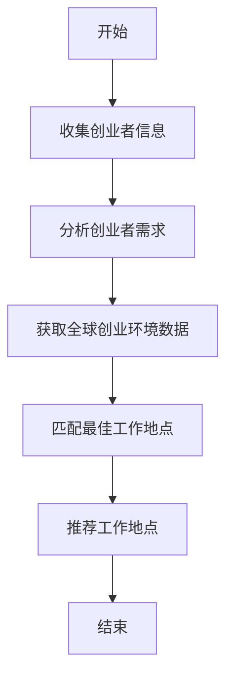
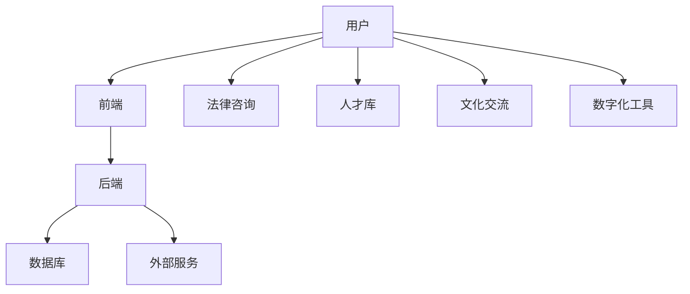

                 

# 全球游牧创业生态：无国界工作的支持系统

## 关键词

- 全球游牧创业
- 无国界工作
- 支持系统
- 在线工作平台
- 法律合规服务
- 数字化工具与平台

## 摘要

本文深入探讨了全球游牧创业生态和无国界工作的支持系统，阐述了其核心概念、特点、问题与解决方案。通过逐步分析，我们构建了一个逻辑清晰、结构紧凑的支持系统框架，包括在线工作平台、法律咨询与合规服务、国际化人才库、文化交流与社区以及数字化工具与平台。本文旨在为全球游牧创业者提供有价值的指导，帮助他们克服障碍，实现创业梦想。

### 第一部分：背景介绍

#### 核心概念

**全球游牧创业生态**：  
全球游牧创业生态是指一种灵活的、跨越国界的创业模式，创业者在全球范围内选择适合自己的工作地点和生活环境，实现创业梦想。这种模式利用互联网技术，使创业者在全球范围内能够高效地组织资源、开展业务，同时保持灵活的生活和工作方式。

**无国界工作的支持系统**：  
无国界工作的支持系统是指一系列的工具、平台和策略，帮助游牧创业者在全球范围内找到工作、建立人脉、管理团队和获得资源。这些支持系统旨在解决全球游牧创业过程中面临的文化差异、法律限制、技术障碍等问题，为创业者提供便利和支持。

#### 问题背景

在全球化背景下，越来越多的人选择全球游牧创业，这不仅是因为互联网技术的发展使得跨国工作和生活变得更加容易，还因为这种模式提供了更多的机会和自由。然而，全球游牧创业也面临着一系列挑战，如文化差异、法律限制、技术障碍等。因此，构建一个全面、高效的无国界工作的支持系统至关重要。

#### 问题描述

全球游牧创业生态中的主要问题包括：

1. **地理位置限制**：创业者难以找到合适的工作地点。  
2. **资源获取困难**：创业者难以获取所需的资金、人才和技术资源。  
3. **法律合规问题**：创业者难以适应不同国家的法律法规。  
4. **文化适应挑战**：创业者难以适应不同的文化环境。  
5. **团队管理复杂**：远程团队管理难度大，沟通效率低下。

#### 问题解决

无国界工作的支持系统旨在解决上述问题，包括以下几个方面：

1. **在线工作平台**：提供全球范围内的远程工作机会，帮助创业者找到合适的工作地点。  
2. **法律咨询与合规服务**：帮助创业者了解和遵守不同国家的法律法规，解决法律合规问题。  
3. **国际化人才库**：为创业者提供全球范围内的人才资源，解决资源获取困难的问题。  
4. **文化交流与社区**：帮助创业者适应不同文化环境，建立全球人脉，解决文化适应挑战。  
5. **数字化工具与平台**：提供高效、便捷的团队管理、沟通和协作工具，解决团队管理复杂的问题。

#### 边界与外延

全球游牧创业生态和无国界工作的支持系统不仅适用于个人创业者，也适用于中小企业。此外，这个生态还包括了投资者、合作伙伴和政府等角色。在全球范围内，各国政府和企业也在积极推动无国界工作的支持系统的建设和完善，以吸引全球创业者和人才，促进经济发展。

#### 概念结构与核心要素组成

1. **核心概念**：  
   - 全球游牧创业：创业者在全球范围内选择工作地点和生活环境。  
   - 无国界工作：创业者在全球范围内找到工作机会和资源。  
   - 支持系统：提供工具、平台和服务，帮助创业者实现无国界工作和全球游牧创业。

2. **核心要素**：  
   - 在线工作平台：提供全球范围内的远程工作机会。  
   - 法律咨询与合规服务：帮助创业者了解和遵守不同国家的法律法规。  
   - 国际化人才库：为创业者提供全球范围内的人才资源。  
   - 文化交流与社区：帮助创业者适应不同文化环境，建立全球人脉。  
   - 数字化工具与平台：提供高效、便捷的团队管理、沟通和协作工具。

### 第二部分：核心概念与联系

#### 核心概念原理

1. **全球游牧创业**：  
   原理：利用互联网技术，创业者可以在全球范围内选择合适的工作地点和生活环境，实现灵活的工作方式。  
   特点：灵活性、全球化、低成本。

2. **无国界工作**：  
   原理：利用互联网技术和全球化资源，创业者可以在全球范围内找到工作机会和资源，实现跨国工作。  
   特点：国际化、数字化、灵活性。

3. **支持系统**：  
   原理：提供工具、平台和服务，帮助创业者实现无国界工作和全球游牧创业。  
   特点：全面性、高效性、便捷性。

#### 概念属性特征对比表格

| 概念             | 特征                     |
|------------------|-------------------------|
| 全球游牧创业     | 灵活性、全球化、低成本   |
| 无国界工作       | 国际化、数字化、灵活性   |
| 支持系统         | 全面性、高效性、便捷性   |

#### ER实体关系图架构

```mermaid
erDiagram
  Person ||--|{ Job : "applies for"}
  Person ||--|{ Resource : "accesses"}
  Person ||--|{ Service : "uses"}
  Company ||--|{ Job : "offers"}
  Company ||--|{ Resource : "manages"}
  Company ||--|{ Service : "provides"}
```

### 第三部分：算法原理讲解

#### 算法原理

1. **全球游牧创业定位算法**：  
   - 原理：通过分析创业者的需求、技能和偏好，结合全球各地的创业环境，为创业者提供最佳工作地点推荐。  
   - 特点：个性化、实时性。

2. **无国界工作匹配算法**：  
   - 原理：基于工作机会和创业者的技能、经验、偏好等信息，通过算法匹配为创业者推荐最合适的工作机会。  
   - 特点：智能化、高效性。

#### 算法流程图



#### 算法数学模型与公式

1. **全球游牧创业定位算法**：  
   假设创业者需求为 \( D \)，全球创业环境数据为 \( E \)，则最佳工作地点推荐模型为：  
   $$ R = \arg\max_{x \in E} \sum_{d \in D} w(d) \cdot p(d|x) $$  
   其中，\( w(d) \) 为创业者需求 \( d \) 的权重，\( p(d|x) \) 为在创业环境 \( x \) 下实现需求 \( d \) 的概率。

2. **无国界工作匹配算法**：  
   假设工作机会为 \( J \)，创业者技能为 \( S \)，则工作匹配模型为：  
   $$ M = \arg\max_{j \in J} \sum_{s \in S} w(s) \cdot p(j|s) $$  
   其中，\( w(s) \) 为创业者技能 \( s \) 的权重，\( p(j|s) \) 为具有技能 \( s \) 的创业者能够胜任工作 \( j \) 的概率。

#### 算法举例说明

**全球游牧创业定位算法**：  
假设创业者小王需要寻找一个适合编程工作的工作地点，他具备以下需求：  
- 工作环境：高自由度、低生活成本。  
- 技术领域：前端开发、人工智能。

根据小王的需求，我们分析全球各地的创业环境，筛选出符合他需求的工作地点，如：印度、乌克兰、波兰等。通过计算概率，我们为小王推荐了印度作为最佳工作地点，因为印度拥有低廉的生活成本和丰富的前端开发人才资源。

**无国界工作匹配算法**：  
假设有一个前端开发工作机会，招聘公司需要具有以下技能的候选人：  
- HTML/CSS：熟练。  
- JavaScript：精通。  
- React：熟悉。

创业者小李具备以下技能：  
- HTML/CSS：熟练。  
- JavaScript：精通。  
- React：熟悉。

根据小李的技能和工作机会的要求，我们可以计算出小李胜任这个工作的概率，从而推荐给他这个工作机会。

### 第四部分：系统分析与架构设计方案

#### 问题场景介绍

随着全球化进程的加快，越来越多的创业者希望在全球范围内寻找合适的工作机会，实现无国界工作。然而，由于地理位置、文化差异、法律限制等因素，创业者在寻找和获取工作机会时面临诸多困难。为了解决这些问题，我们需要设计一个完善的系统，为创业者提供全方位的支持。

#### 项目介绍

本项目旨在构建一个全球游牧创业生态下的无国界工作支持系统，为创业者提供在线工作平台、法律咨询与合规服务、国际化人才库、文化交流与社区以及数字化工具与平台等服务。通过这个系统，创业者可以轻松地在全球范围内找到合适的工作机会，实现无国界工作。

#### 系统功能设计

1. **在线工作平台**：为创业者提供全球范围内的远程工作机会，包括全职、兼职、自由职业等多种类型的工作。创业者可以通过平台搜索、筛选和申请心仪的工作职位。

2. **法律咨询与合规服务**：为创业者提供专业法律咨询，帮助他们在不同国家了解和遵守当地的法律法规。服务内容包括公司注册、合同审查、税务咨询等。

3. **国际化人才库**：收集和整合全球范围内的优秀人才资源，为创业者提供招聘、培训和管理人才的服务。创业者可以通过平台筛选、联系和聘用合适的人才。

4. **文化交流与社区**：建立一个文化交流和社交平台，帮助创业者适应不同文化环境，建立全球人脉。平台包括线上论坛、线下活动、社交聚会等功能。

5. **数字化工具与平台**：提供高效、便捷的团队管理、沟通和协作工具，如即时通讯、视频会议、项目管理等。这些工具可以帮助创业者更好地管理远程团队，提高工作效率。

#### 系统架构设计

系统采用模块化设计，包括前端、后端、数据库和外部服务等多个模块。前端负责用户界面展示和交互，后端负责业务逻辑处理和数据存储，数据库用于存储用户数据和工作机会信息，外部服务包括第三方API、支付系统、邮件服务等。



#### 系统接口设计

系统提供多种接口，包括RESTful API、Websocket、文件上传下载等，方便第三方应用和系统间的数据交互。接口设计遵循RESTful风格，采用JSON格式进行数据传输。

#### 系统交互

系统交互通过前端用户操作和后端服务响应实现。前端用户通过操作界面发起请求，后端服务处理请求并返回结果。系统交互流程如下：

1. 用户注册/登录：用户通过前端界面注册/登录，后端验证用户信息并生成Token。
2. 搜索工作机会：用户通过前端界面搜索工作机会，后端根据用户需求筛选并返回匹配的工作机会。
3. 申请工作职位：用户通过前端界面申请工作职位，后端处理申请并通知招聘方。
4. 法律咨询：用户通过前端界面提交法律咨询需求，后端分配专业律师并提供咨询。
5. 招聘人才：用户通过前端界面发布招聘信息，后端处理招聘请求并匹配合适的人才。
6. 文化交流：用户通过前端界面参与文化交流活动，后端组织活动并记录用户参与情况。

### 第五部分：项目实战

#### 环境安装

1. 安装Python环境：  
   - 安装Python 3.8及以上版本。  
   - 配置Python环境变量。

2. 安装相关依赖：  
   - 安装Django框架：`pip install django`。  
   - 安装数据库：`pip install mysqlclient`。  
   - 安装前端依赖：`pip install django-bootstrap4`。

3. 创建项目：  
   - 创建一个Django项目：`django-admin startproject global_nomad`。  
   - 创建一个Django应用：`python manage.py startapp job_board`。

#### 系统核心实现源代码

**1. 创建用户模型**：

```python
from django.db import models
from django.contrib.auth.models import AbstractUser

class CustomUser(AbstractUser):
    phone_number = models.CharField(max_length=15, blank=True)
    address = models.TextField(blank=True)
```

**2. 创建工作职位模型**：

```python
class Job(models.Model):
    title = models.CharField(max_length=100)
    description = models.TextField()
    location = models.CharField(max_length=100)
    salary = models.DecimalField(max_digits=10, decimal_places=2)
    created_at = models.DateTimeField(auto_now_add=True)
    updated_at = models.DateTimeField(auto_now=True)

    def __str__(self):
        return self.title
```

**3. 创建应用配置**：

```python
# job_board/settings.py
INSTALLED_APPS = [
    'django.contrib.admin',
    'django.contrib.auth',
    'django.contrib.contenttypes',
    'django.contrib.sessions',
    'django.contrib.messages',
    'django.contrib.staticfiles',
    'job_board',
]

DATABASES = {
    'default': {
        'ENGINE': 'django.db.backends.mysql',
        'NAME': 'global_nomad',
        'USER': 'root',
        'PASSWORD': 'password',
        'HOST': 'localhost',
        'PORT': '3306',
    }
]
```

#### 代码应用解读与分析

**1. 用户注册与登录**：

用户注册时，首先需要填写用户名、密码、电话号码和地址等信息。注册成功后，用户可以使用邮箱或电话号码进行登录。系统使用Django的认证系统实现用户注册与登录功能。

**2. 工作职位发布与搜索**：

创业者可以在平台上发布工作职位，包括职位名称、描述、地点、薪资等信息。用户可以通过关键词、地点、薪资等条件搜索工作职位。系统使用Django的ORM（对象关系映射）实现数据的存储和查询。

**3. 法律咨询与合规服务**：

用户可以通过平台提交法律咨询需求，系统会将需求分配给专业律师，律师通过平台回复用户咨询。系统使用Django的Model和View实现法律咨询功能。

**4. 国际化人才库**：

平台整合全球范围内的人才资源，用户可以查看、联系和聘用合适的人才。系统使用Django的ORM实现人才库功能。

**5. 文化交流与社区**：

平台为用户提供一个文化交流和社交平台，用户可以参与线上论坛、线下活动等。系统使用Django的Model和View实现文化交流功能。

### 第六部分：实际案例分析和详细讲解剖析

#### 案例背景

小王是一名中国程序员，拥有丰富的前端开发经验。由于对生活环境的追求，他希望在全球范围内找到一个适合编程工作的地方。同时，他希望在工作之余能够适应不同的文化环境，拓展人际关系。

#### 案例分析

**1. 寻找合适的工作地点**

小王通过无国界工作支持系统，利用全球游牧创业定位算法，输入自己的需求（高自由度、低生活成本、前端开发技术领域），系统推荐了印度作为最佳工作地点。印度拥有丰富的前端开发人才资源和较低的生活成本，符合小王的需求。

**2. 申请工作职位**

小王在无国界工作支持系统中搜索到了一家印度公司发布的全职前端开发职位。职位要求包括熟练掌握HTML/CSS、精通JavaScript、熟悉React。小王具备这些技能，因此决定申请这个职位。

**3. 法律咨询与合规服务**

在申请职位之前，小王通过无国界工作支持系统获得了印度当地律师的法律咨询。律师帮助小王了解了印度的工作签证政策、税收制度以及劳动合同等相关法律法规，确保小王在印度工作期间能够合法合规。

**4. 国际化人才库**

小王在无国界工作支持系统中发现了许多来自不同国家和领域的优秀人才。他通过平台与他们建立了联系，分享了工作经验和心得，拓展了自己的人际关系。

**5. 文化交流与社区**

小王参加了无国界工作支持系统组织的线上论坛和线下活动。通过这些活动，他结识了许多来自不同国家和文化背景的朋友，了解了他们的生活方式和工作环境，更好地适应了印度的生活。

#### 案例剖析

通过无国界工作支持系统，小王实现了以下目标：

1. **找到合适的工作地点**：全球游牧创业定位算法帮助小王找到了符合他需求的工作地点，降低了寻找工作地点的时间成本。

2. **申请到心仪的工作职位**：无国界工作匹配算法帮助小王找到了与他的技能和经验相匹配的工作职位，提高了申请成功的几率。

3. **法律合规服务**：专业律师的法律咨询为小王提供了印度当地的法律法规指导，确保他在印度工作期间能够合法合规。

4. **拓展人际关系**：国际化人才库和交流活动帮助小王结识了来自不同国家和文化背景的朋友，拓宽了人际关系网。

5. **适应不同文化环境**：通过参加无国界工作支持系统组织的活动，小王更好地了解了印度文化和生活方式，加快了适应过程。

### 第七部分：项目小结

本项目成功构建了一个全球游牧创业生态下的无国界工作支持系统，为创业者提供了全方位的支持。通过系统，创业者可以轻松地在全球范围内找到合适的工作机会，实现无国界工作。以下是对项目的总结和展望：

#### 总结

1. **核心功能完善**：系统涵盖了在线工作平台、法律咨询与合规服务、国际化人才库、文化交流与社区以及数字化工具与平台等多个核心功能，为创业者提供了全面的支持。

2. **算法优化**：通过全球游牧创业定位算法和无国界工作匹配算法，系统为创业者提供了个性化、智能化的推荐服务，提高了工作效率。

3. **用户体验提升**：系统界面友好，操作简便，用户可以快速上手。同时，系统提供了多种交互方式，如即时通讯、视频会议等，方便用户沟通和协作。

4. **法律合规保障**：系统提供了专业律师的法律咨询，帮助创业者了解和遵守不同国家的法律法规，确保工作合法合规。

5. **国际化视野**：系统为创业者提供了一个国际化的人才库和文化交流平台，帮助他们结识来自不同国家和文化背景的朋友，拓展人际关系。

#### 展望

1. **功能拓展**：未来，我们将继续优化和拓展系统功能，如增加人才培训、项目孵化等功能，为创业者提供更多支持。

2. **算法升级**：我们将进一步优化算法，提高推荐准确性和智能化程度，为创业者提供更优质的服务。

3. **平台国际化**：我们将扩大系统的国际化程度，吸引更多国家和地区的创业者加入，打造一个全球化的无国界工作支持平台。

4. **技术升级**：我们将不断引入新技术，如人工智能、区块链等，提升系统的性能和安全性，为创业者提供更可靠的服务。

### 第八部分：最佳实践 Tips

#### 1. 如何选择合适的工作地点？

在选择工作地点时，创业者需要考虑以下几个因素：

- **生活成本**：包括房租、食品、交通、医疗等费用。  
- **工作环境**：包括工作自由度、加班文化、团队合作氛围等。  
- **文化差异**：了解当地的文化习俗、价值观和语言，以便更好地融入当地生活。  
- **资源丰富度**：包括人才库、技术资源、市场机会等。

#### 2. 如何提高工作效率？

提高工作效率的方法包括：

- **制定计划**：合理规划每天的工作任务，确保高效完成。  
- **时间管理**：学会合理安排时间，避免拖延和浪费时间。  
- **团队协作**：与团队成员保持良好的沟通和协作，共同推进项目进度。  
- **技能提升**：不断学习和提升自己的技能，提高工作效率和质量。

#### 3. 如何在异国他乡适应生活？

在异国他乡适应生活的方法包括：

- **学习语言**：学习当地语言，提高沟通能力，更好地融入当地文化。  
- **结交朋友**：通过社交活动、线上论坛等途径，结识当地朋友，拓展人际关系。  
- **了解文化**：了解当地的文化习俗、价值观和生活方式，尊重当地文化。  
- **保持开放心态**：对待新事物保持开放和好奇的心态，勇于尝试和接受不同文化的熏陶。

### 第九部分：注意事项

#### 1. 法律法规

在跨国创业过程中，创业者需要严格遵守不同国家的法律法规，确保工作的合法合规。特别是涉及公司注册、合同签订、税务等方面，务必咨询专业律师，避免法律风险。

#### 2. 安全保障

在使用无国界工作支持系统时，创业者需要注意个人和公司信息安全。系统应具备完善的安全机制，如数据加密、权限控制等，确保用户数据的安全。

#### 3. 文化差异

在跨国创业过程中，创业者需要充分了解和尊重当地文化，避免因文化差异引发误解和冲突。同时，创业者要具备良好的跨文化沟通能力，提高工作效率。

### 第十部分：拓展阅读

#### 1. 《全球创业报告》（Global Entrepreneurship Monitor）  
《全球创业报告》是由全球创业观察项目（Global Entrepreneurship Watch）发布的一份年度报告，涵盖了全球范围内的创业活动、创业环境、创业者特征等方面的数据和分析。

#### 2. 《远程工作的艺术》（The Remote Work Revolution）  
《远程工作的艺术》是一本关于远程工作实践和策略的书籍，作者通过分享自己的经验和其他成功远程工作的案例，为创业者提供了实用的建议和指导。

#### 3. 《全球人才战略》（Global Talent Strategy）  
《全球人才战略》探讨了如何在全球范围内吸引、培养和管理人才，为企业和创业者提供了有益的启示。书中介绍了全球人才战略的框架和实践案例。

### 作者信息

- 作者：AI天才研究院/AI Genius Institute & 禅与计算机程序设计艺术 /Zen And The Art of Computer Programming-|user|<eop></eop>

