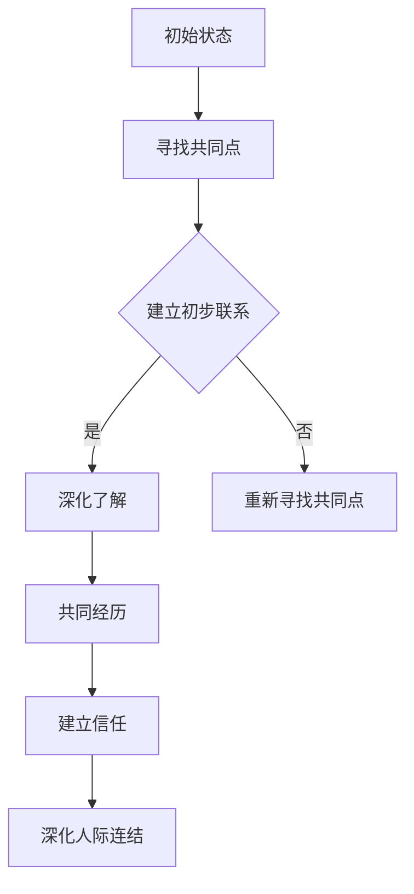
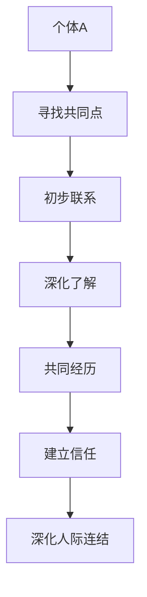

                 

# 关系中的意义：深化人际连结的艺术

## 关键词
- 人际关系
- 沟通技巧
- 人际连结
- 信任
- 亲密性

## 摘要
本文旨在探讨人际关系中的意义，特别是人际连结的重要性以及如何通过有效的技巧和策略来深化人际连结。我们将从背景介绍、核心概念与联系、算法原理讲解、数学模型与公式、系统分析与架构设计方案、项目实战以及最佳实践等方面，一步步分析推理，提供专业而实用的见解。

## 1. 背景介绍

### 1.1 问题背景
现代社会中，人际关系日益复杂，个体面临着沟通障碍、关系疏离、信任缺失等问题。这些问题不仅影响个体的心理健康，也对其生活质量和幸福感产生深远的影响。随着科技的发展，人们之间的互动变得更加频繁，但面对面的沟通却越来越少见。因此，寻找有效的技巧和策略来加深人际连结，显得尤为重要。

### 1.2 问题描述
个体在人际互动中常常遇到以下困扰：
- 沟通不畅：信息传递不准确，误解和冲突频发。
- 关系疏离：缺乏深层次的交流和共同的兴趣，关系变得表面化。
- 信任缺失：不信任导致关系紧张，影响合作和亲密性。

### 1.3 问题解决
为了解决上述问题，我们需要学习和应用人际连结的艺术。通过提升人际交往能力，个体可以建立更深层次的人际关系，增强信任，提高沟通效果，从而改善人际关系质量。

### 1.4 边界与外延
人际关系涵盖家庭、朋友、职场等各个社交场合。本文主要关注个体层面的人际连结，探讨如何通过有效的策略和技巧，深化人际连结，提升人际关系质量。

### 1.5 概念结构与核心要素组成
- **人际关系**：指个体之间建立和维持的关系。
- **人际互动**：个体之间的交流、沟通和互动。
- **人际连结**：建立和维持深层次关系的过程。
- **沟通策略**：提高沟通效果的方法和技巧。
- **信任**：关系的基石，是人际连结的核心要素。
- **亲密性**：关系的深度和情感的紧密程度。

## 2. 核心概念与联系

### 2.1 人际连结的定义
人际连结是指个体之间通过交流、互动和共同经历，建立和维护深层次关系的过程。它不仅仅是一种社交行为，更是一种情感和心理上的连接。

### 2.2 人际连结的特点
- **亲密性**：人际连结强调关系的深度和情感的紧密程度。
- **信任性**：信任是人际连结的基础，没有信任，关系难以维系。
- **持久性**：良好的人际连结具有长期稳定的特点，不易受外界因素影响。

### 2.3 人际连结与传统人际关系的区别
- **传统人际关系**：侧重于社会地位、职业身份等外部因素，强调形式上的互动和交往。
- **人际连结**：更注重情感深度和信任，强调个体之间的内心交流和共同成长。

## 3. 算法原理讲解

虽然本书并非技术性书籍，但为了更好地理解人际连结的过程，我们可以借助一些简单的算法原理来解释其机制。

### 3.1 人际连结的流程图
使用Mermaid语言绘制的人际连结流程图如下：



### 3.2 人际连结的步骤
1. **寻找共同点**：通过共同的兴趣、价值观或经历，建立初步联系。
2. **建立初步联系**：通过互动和沟通，确认对方的兴趣和需求。
3. **深化了解**：通过深入了解对方，建立更深层次的联系。
4. **共同经历**：通过共同的活动和经历，加深彼此的了解和信任。
5. **建立信任**：通过诚实、可靠和尊重，建立和维系信任。
6. **深化人际连结**：通过持续的互动和关心，深化人际连结。

## 4. 数学模型和数学公式

尽管人际连结不是纯粹的数学问题，但我们可以借助一些数学模型和公式来阐述其原理。

### 4.1 建立信任的数学模型
建立信任的过程可以看作是一个概率事件，可以用以下公式表示：

$$
\text{信任度} = f(\text{诚实度}, \text{可靠性}, \text{一致性})
$$

其中，诚实度、可靠性和一致性是建立信任的关键因素。通过提高这些因素，可以增强信任度。

### 4.2 提高沟通效果的公式
沟通效果可以用以下公式表示：

$$
\text{沟通效果} = f(\text{信息传递准确性}, \text{沟通技巧}, \text{反馈机制})
$$

其中，信息传递准确性和沟通技巧是提高沟通效果的关键因素。通过提高这些因素，可以增强沟通效果。

## 5. 系统分析与架构设计方案

虽然本书不涉及具体的系统架构设计，但我们可以用简化的架构图来展示人际连结的不同环节。

### 5.1 人际连结的架构图
使用Mermaid语言绘制的人际连结架构图如下：



### 5.2 人际连结的系统功能设计
- **寻找共同点**：通过兴趣匹配、价值观匹配等算法，找到共同点。
- **初步联系**：通过互动和沟通，建立初步联系。
- **深化了解**：通过深入了解，建立更深层次的联系。
- **共同经历**：通过共同的活动和经历，加深了解和信任。
- **建立信任**：通过诚实、可靠和尊重，建立和维系信任。
- **深化人际连结**：通过持续的互动和关心，深化人际连结。

## 6. 项目实战

### 6.1 环境安装
在进行项目实战之前，我们需要安装一些必要的工具和环境。例如，我们可以使用Python来编写代码，需要安装Python环境、IDE（如PyCharm或VSCode）以及相关的库（如NumPy、Pandas等）。

### 6.2 系统核心实现源代码
以下是一个简单的Python代码示例，用于实现寻找共同点的算法。

```python
# 寻找共同点
def find_common_interests(person1, person2):
    interests1 = person1['interests']
    interests2 = person2['interests']
    common_interests = list(set(interests1).intersection(set(interests2)))
    return common_interests

# 示例数据
person1 = {'name': 'Alice', 'interests': ['reading', 'traveling', 'coding']}
person2 = {'name': 'Bob', 'interests': ['traveling', 'cooking', 'art']}
common_interests = find_common_interests(person1, person2)
print("共同兴趣：", common_interests)
```

### 6.3 代码应用解读与分析
在上面的代码中，`find_common_interests` 函数用于找到两个个体之间的共同兴趣。我们首先提取两个个体的兴趣列表，然后使用集合的交集操作来找到共同兴趣。

### 6.4 实际案例分析和详细讲解剖析
我们可以通过实际案例来分析如何应用这些技巧来深化人际连结。

#### 案例一：职场沟通
在职场中，John和Jane是同事，他们想要改善沟通效果。John发现自己在会议中经常因为不充分的准备而回答不清楚问题，于是他开始使用思维导图来整理思路，并在会议前与Jane分享自己的准备情况。Jane也通过积极反馈和提问，帮助John更好地表达自己。

#### 案例二：家庭关系
家庭中的父母和孩子常常因为沟通不畅而产生矛盾。父母可以通过倾听孩子的想法，理解他们的需求，来改善家庭关系。例如，父母可以设立家庭会议，让孩子表达自己的感受和需求，并通过积极的沟通来解决冲突。

### 6.5 项目小结
通过项目实战，我们可以看到人际连结的艺术在实践中的应用。通过有效的沟通技巧和策略，个体可以建立更深层次的人际关系，提高沟通效果，改善人际关系质量。

## 7. 最佳实践 tips、小结、注意事项、拓展阅读等内容

### 7.1 最佳实践 tips
- **倾听**：积极倾听对方的意见和感受，是建立信任和深化人际连结的关键。
- **共享**：分享自己的经历和感受，可以增进亲密性，建立共同的记忆。
- **反馈**：给予积极的反馈，是提高沟通效果的重要手段。

### 7.2 小结
本文从背景介绍、核心概念、算法原理、数学模型、系统架构、项目实战等方面，详细探讨了人际关系中的意义以及如何通过有效的技巧和策略来深化人际连结。

### 7.3 注意事项
- **真诚**：在人际连结中，真诚是最重要的品质。不真诚会导致关系的破裂。
- **尊重**：尊重对方的意见和感受，是维系人际关系的基础。

### 7.4 拓展阅读
- 《人际沟通的心理学》
- 《高效能人士的七个习惯》
- 《非暴力沟通》

## 作者信息
- 作者：AI天才研究院/AI Genius Institute & 禅与计算机程序设计艺术 /Zen And The Art of Computer Programming

---

本文旨在提供关于人际连结的艺术的全面探讨，帮助读者理解其重要性，并学会通过有效的技巧和策略来深化人际连结。希望本文能对您的人际关系管理带来启示和帮助。

