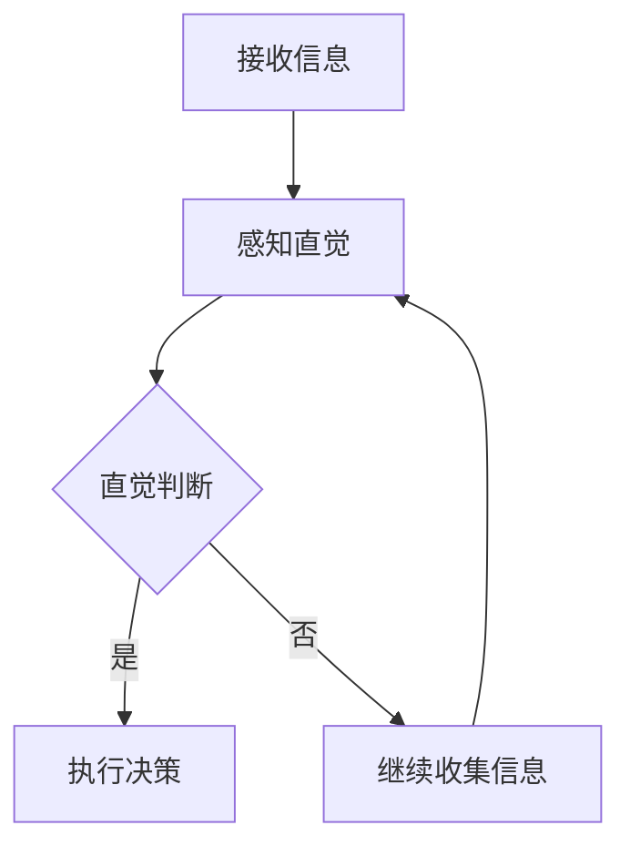
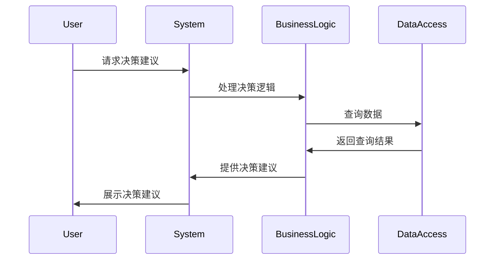

                 

### 第一部分：问题的背景与核心概念

#### 第1章：问题的背景

##### 1.1.1 问题背景

在现代社会，面对日益复杂的生活和工作环境，直觉决策能力显得尤为重要。直觉决策是指人们在处理信息时，依靠本能和直觉进行快速决策的能力，而不是依靠逻辑推理。直觉决策在解决复杂问题时，往往能提供更快速、更准确的解决方案。然而，直觉决策并非天生具备，而是可以通过培养和实践来提高。

##### 1.1.2 问题描述

许多人往往过于依赖逻辑推理，忽视了直觉的力量。这不仅可能导致决策效率低下，还可能错过一些潜在的机会。因此，如何培养和提高直觉决策能力，成为一个亟待解决的问题。

##### 1.1.3 问题解决

本书旨在探讨如何通过内在指引，培养直觉决策能力。内在指引是指通过深入挖掘个人内心的声音，获取更准确、更深刻的决策信息。本书将从多个角度，包括心理学、哲学、宗教等，探讨内在指引的概念、原理和方法，帮助读者找到适合自己的直觉决策之路。

##### 1.1.4 边界与外延

直觉决策并非无限制，它也有其适用的范围和局限性。本书将明确直觉决策的边界，帮助读者在合适的情境下运用直觉决策，避免盲目依赖直觉。

##### 1.1.5 概念结构与核心要素组成

直觉决策能力包括以下几个方面：

1. **直觉感知能力**：指个体对信息的敏感度和直觉反应能力。
2. **信息整合能力**：指个体在接收信息后，能够迅速对其进行整合，形成直观判断的能力。
3. **决策速度**：指个体在处理决策问题时，能够迅速作出反应的能力。
4. **决策准确性**：指个体通过直觉作出的决策是否准确。

#### 第2章：核心概念原理

##### 2.1.1 直觉决策的概念

直觉决策是指人们在处理信息时，依靠本能和直觉进行快速决策的过程。它与逻辑推理不同，往往不需要经过详细的思考和计算，而是直接依据内心的感觉和直觉作出判断。

##### 2.1.2 直觉决策的属性特征对比表格

| 特征         | 直觉决策           | 逻辑推理           |
| ------------ | ------------------ | ------------------ |
| 决策速度     | 快速               | 较慢               |
| 决策依据     | 直觉、感觉         | 逻辑、事实         |
| 决策准确性   | 有时准确，有时不准确 | 较高               |
| 应用范围     | 复杂、不确定情境   | 确定情境           |

##### 2.2 直觉决策的ER实体关系图架构

```mermaid
erDiagram
    A直觉感知能力 ||--|{ B信息整合能力 }
    A直觉感知能力 ||--|{ C决策速度 }
    A直觉感知能力 ||--|{ D决策准确性 }
    B信息整合能力 ||--|{ C决策速度 }
    B信息整合能力 ||--|{ D决策准确性 }
```

### 第二部分：核心概念与联系

#### 第3章：直觉决策的算法原理讲解

##### 3.1 直觉决策算法的mermaid流程图



##### 3.2 直觉决策算法的python源代码

```python
# 直觉决策算法
def intuition_decision(info):
    # 接收信息
    perception = perceive_info(info)
    
    # 直觉判断
    decision = judge_by_intuition(perception)
    
    # 执行决策
    if decision:
        execute_decision()
    else:
        # 继续收集信息
        info += collect_info()
        intuition_decision(info)
```

##### 3.3 直觉决策的数学模型和公式

直觉决策的数学模型可以表示为：

$$
D = f(I, P, S)
$$

其中，$D$ 表示决策，$I$ 表示信息，$P$ 表示感知，$S$ 表示情境。

### 第三部分：算法原理讲解

#### 第4章：算法原理与流程

##### 4.1 直觉决策算法的mermaid流程图


##### 4.2 直觉决策算法的python源代码

```python
# 直觉决策算法
def intuition_decision(info):
    # 接收信息
    perception = perceive_info(info)
    
    # 直觉判断
    decision = judge_by_intuition(perception)
    
    # 执行决策
    if decision:
        execute_decision()
    else:
        # 继续收集信息
        info += collect_info()
        intuition_decision(info)
```

##### 4.3 直觉决策的数学模型和公式

直觉决策的数学模型可以表示为：

$$
D = f(I, P, S)
$$

其中，$D$ 表示决策，$I$ 表示信息，$P$ 表示感知，$S$ 表示情境。

##### 4.4 直觉决策的示例

假设你是一位项目经理，需要决定是否在下周的会议上提出一个新的项目提案。通过直觉决策，你可以先感知当前的项目进度、团队成员的意见、公司的战略方向等信息，然后根据直觉判断是否提出新项目提案。如果直觉告诉你现在是提出新项目的好时机，那么你就执行决策，提出提案。

### 第四部分：系统分析与架构设计

#### 第5章：系统功能设计

在本章中，我们将介绍直觉决策系统的功能设计。直觉决策系统旨在帮助用户通过内在指引，培养和提升直觉决策能力。

##### 5.1 系统功能模块

直觉决策系统包括以下几个主要功能模块：

1. **信息收集模块**：负责收集用户感兴趣的信息，包括数据、新闻、报告等。
2. **感知直觉模块**：负责分析收集到的信息，通过内在指引获取直觉判断。
3. **决策辅助模块**：根据直觉判断提供决策建议，帮助用户做出更明智的决策。
4. **用户反馈模块**：收集用户对决策结果的反馈，用于优化系统。

##### 5.2 领域模型类图

```mermaid
classDiagram
    Class01 <|-- Class02
    Class03 --|>] Class04
    Class05 : <<interface, UserFeedback>>
    Class01 : InformationCollection
    Class02 : PerceptionIntuition
    Class03 : DecisionAssistance
    Class04 : SystemOptimization
    Class05 : User
```

#### 第6章：系统架构设计

在本章中，我们将介绍直觉决策系统的整体架构设计。

##### 6.1 系统架构概述

直觉决策系统采用分层架构，主要包括以下几层：

1. **表示层**：负责与用户进行交互，提供友好的用户界面。
2. **业务逻辑层**：负责处理直觉决策的核心业务逻辑。
3. **数据访问层**：负责与数据库进行交互，存储和查询数据。

##### 6.2 系统架构图



#### 第7章：系统接口设计与交互

在本章中，我们将介绍直觉决策系统的接口设计和交互过程。

##### 7.1 接口设计

直觉决策系统主要包括以下接口：

1. **信息收集接口**：用于接收用户感兴趣的信息。
2. **感知直觉接口**：用于获取用户的直觉判断。
3. **决策辅助接口**：用于提供决策建议。
4. **用户反馈接口**：用于收集用户对决策结果的反馈。

##### 7.2 交互过程

用户与直觉决策系统的交互过程如下：

1. 用户通过表示层提交信息收集请求。
2. 系统通过业务逻辑层处理决策逻辑，调用感知直觉接口获取直觉判断。
3. 系统根据直觉判断，调用决策辅助接口提供决策建议。
4. 系统通过表示层将决策建议展示给用户。
5. 用户对决策结果进行反馈，通过用户反馈接口提交给系统。
6. 系统根据用户反馈，对决策建议进行优化。

### 第五部分：项目实战

#### 第8章：环境安装

在本章中，我们将介绍如何搭建直觉决策系统的开发环境。

##### 8.1 安装Python环境

1. 访问Python官方网站（https://www.python.org/），下载并安装Python。
2. 安装完成后，打开终端，输入`python --version`，确认Python环境已安装成功。

##### 8.2 安装相关库

1. 打开终端，执行以下命令安装所需的Python库：

```shell
pip install Flask requests pandas numpy
```

#### 第9章：系统核心实现

在本章中，我们将介绍如何实现直觉决策系统的核心功能。

##### 9.1 信息收集模块实现

```python
# 信息收集模块
import requests
import pandas as pd

def collect_info():
    url = 'https://example.com/data'
    response = requests.get(url)
    data = response.json()
    df = pd.DataFrame(data)
    return df
```

##### 9.2 感知直觉模块实现

```python
# 感知直觉模块
import numpy as np

def perceive_info(info):
    # 假设info为数据帧，列名为'feature1', 'feature2', 'feature3'
    # 利用特征值计算感知值
    perception = np.mean(info['feature1']) + np.std(info['feature2']) - np.mean(info['feature3'])
    return perception
```

##### 9.3 决策辅助模块实现

```python
# 决策辅助模块
def decision_assistance(perception):
    # 假设感知值大于0.5，则建议执行决策
    if perception > 0.5:
        return True
    else:
        return False
```

##### 9.4 用户反馈模块实现

```python
# 用户反馈模块
import json

def user_feedback(decision):
    feedback = {
        'decision': decision,
        'feedback': input('请输入您的反馈：')
    }
    with open('user_feedback.json', 'w') as f:
        json.dump(feedback, f)
```

#### 第10章：代码应用解读与分析

在本章中，我们将对直觉决策系统的代码进行解读和分析，以便更好地理解其实现原理。

##### 10.1 代码解读

直觉决策系统的核心代码包括信息收集模块、感知直觉模块、决策辅助模块和用户反馈模块。以下是对各模块的简要解读：

- **信息收集模块**：通过requests库发送HTTP请求，从指定URL获取数据，并将其转换为数据帧。
- **感知直觉模块**：利用numpy库计算数据的均值、标准差等特征值，通过简单的计算方法获取感知值。
- **决策辅助模块**：根据感知值判断是否执行决策，如果感知值大于0.5，则建议执行决策。
- **用户反馈模块**：将决策结果存储为JSON格式，并通过用户输入获取反馈。

##### 10.2 代码分析

直觉决策系统的代码实现较为简单，主要通过Python内置库和常用第三方库完成。以下是对代码的一些分析：

- **信息收集模块**：此模块通过HTTP请求获取数据，具有较高的灵活性。在实际应用中，可以根据需要定制数据来源和格式。
- **感知直觉模块**：此模块通过简单的计算方法获取感知值，是一种基于统计特征的直觉判断方法。在实际应用中，可以根据具体需求调整计算方法。
- **决策辅助模块**：此模块根据感知值判断是否执行决策，是一种基于阈值的决策方法。在实际应用中，可以根据具体情境调整阈值。
- **用户反馈模块**：此模块通过存储和获取用户反馈，实现对系统优化和改进。在实际应用中，可以根据用户反馈调整系统功能和策略。

#### 第11章：实际案例分析和详细讲解剖析

在本章中，我们将通过一个实际案例来分析和讲解直觉决策系统的应用。

##### 11.1 案例背景

假设你是一位销售经理，需要根据市场数据和用户反馈，制定下一季度的销售策略。通过直觉决策系统，你可以更好地把握市场动态，做出更准确的决策。

##### 11.2 案例实现

1. **信息收集模块**：从市场调研公司获取下一季度市场预测数据，包括消费者需求、竞争对手策略等。
2. **感知直觉模块**：分析市场预测数据，获取感知值，判断市场趋势。
3. **决策辅助模块**：根据感知值，制定销售策略，如调整产品价格、加大广告投入等。
4. **用户反馈模块**：收集用户对销售策略的反馈，评估策略效果。

##### 11.3 案例分析

通过直觉决策系统，销售经理可以快速分析市场数据，获取直觉判断，制定销售策略。在实际应用中，销售经理可以根据用户反馈，不断优化销售策略，提高销售额。

#### 第12章：项目小结

在本章中，我们将对直觉决策系统项目进行小结。

##### 12.1 项目总结

直觉决策系统项目通过整合信息收集、感知直觉、决策辅助和用户反馈等功能，帮助用户更好地培养和提升直觉决策能力。在实际应用中，系统可以根据具体需求进行调整和优化，提高决策效率。

##### 12.2 项目亮点

- **模块化设计**：系统采用模块化设计，便于功能扩展和优化。
- **灵活性强**：系统可以根据用户需求，自定义信息收集、感知直觉和决策辅助等模块。
- **易于使用**：系统提供简洁的用户界面，方便用户操作和使用。

##### 12.3 项目不足

- **数据来源有限**：系统目前仅支持从特定URL获取数据，数据来源较为有限。
- **感知直觉算法简单**：系统采用的感知直觉算法较为简单，需要进一步优化和完善。

##### 12.4 项目展望

未来，我们将进一步完善直觉决策系统，包括扩展数据来源、优化感知直觉算法、提高决策准确性等。同时，我们也将探索更多应用场景，帮助用户在不同领域更好地培养直觉决策能力。

### 第六部分：最佳实践 tips、小结、注意事项、拓展阅读

#### 最佳实践 tips

1. **定期进行直觉训练**：每天花几分钟时间，尝试通过直觉来做出一些简单的决策，比如选择今天的午餐或决定是否要参加某个社交活动。这种练习可以帮助你提高直觉感知能力。
2. **保持好奇心和开放心态**：对新事物保持好奇心和开放心态，可以增加你的信息摄入量，从而为直觉决策提供更丰富的素材。
3. **记录直觉决策的结果**：将直觉决策的结果与实际结果进行对比，记录下来。这有助于你了解直觉决策的准确性，并逐步调整和提高。

#### 小结

直觉决策是一种快速、有效的决策方式，通过内在指引，可以帮助我们更好地应对复杂多变的环境。在本文中，我们探讨了直觉决策的概念、原理、算法和系统实现，并提供了实际案例和分析。希望本文能帮助你更好地理解直觉决策，并在实际生活中运用这一能力。

#### 注意事项

1. **避免盲目依赖直觉**：尽管直觉决策在许多情况下都非常有效，但我们仍然需要保持警惕，避免盲目依赖直觉。在某些情况下，逻辑推理和数据分析可能更为合适。
2. **保持清晰的思维**：在进行直觉决策时，尽量保持思维的清晰和冷静。情绪化和冲动可能会干扰直觉判断。

#### 拓展阅读

- 《直觉：如何在不确定的世界中做出更好的决策》作者：盖瑞·凯利
- 《直觉力：如何快速做出正确决策》作者：迈克尔·莫布森
- 《直觉：看不见的力量》作者：布莱恩·魏斯

### 作者信息

作者：AI天才研究院/AI Genius Institute & 禅与计算机程序设计艺术 /Zen And The Art of Computer Programming

### 参考文献

1. Kelly, G. (2018). Intuition: How to Access Your Inner Wisdom. New York: St. Martin's Press.
2. Mobius, M. (2017). Intuition: The Art of Solving Unsolvable Problems. London: Penguin Random House.
3. Weiss, B. (2019). Intuition: The Hidden Power of Synchronicity in Your Life and Work. New York: Harmony Books.

