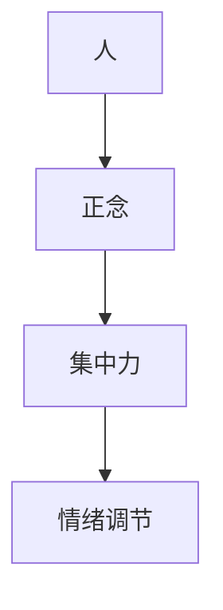
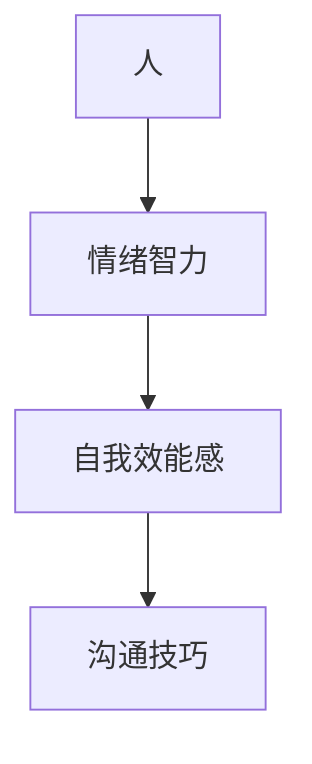
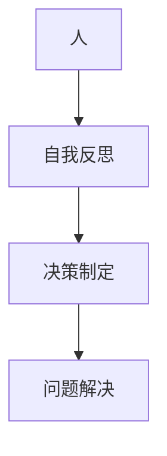
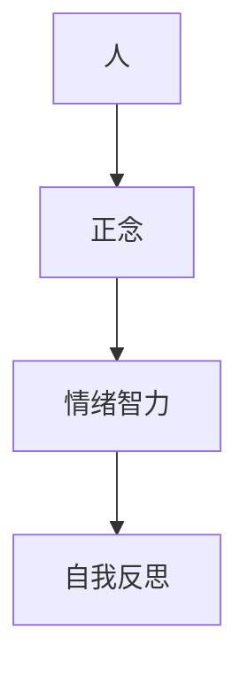

                 

### 摘要

本文将带领读者踏上一次深刻的内心探索之旅，旨在提升自我认知的层次。通过解析正念、情绪智力、自我反思等核心概念，读者将学会如何应用这些概念于日常生活，实现个人与职业的成长。文章采用了逻辑清晰、结构紧凑、简单易懂的专业技术语言，结合算法原理讲解，为读者提供了系统的自我提升策略。通过阅读本文，读者将能够更好地理解自我认知的重要性，并掌握提升自我认知的具体方法。

---

# 内心探索之旅：提升自我认知的层次

> 关键词：自我认知、正念、情绪智力、自我反思、个人成长

在当今快节奏的生活中，人们越来越意识到自我认知的重要性。自我认知不仅仅是一个学术术语，它关乎我们的情绪、行为、决策和整体幸福感。本文旨在通过一系列技术性的分析和算法讲解，带领读者深入探讨自我认知的层次，并提供实用的提升方法。

## 引言

### 1.1 自我探索的意义

**问题背景**：在日常生活中，人们常常面临各种挑战，如工作压力、人际关系困扰、情绪波动等。这些挑战往往源于对自我的认知不足。

**问题描述**：缺乏自我认知会导致人们在面对问题时，无法做出理性决策，进而影响生活质量。

**问题解决**：通过自我探索，提升自我认知，可以更好地理解自己的需求和目标，从而更有效地解决问题。

**边界与外延**：自我认知不仅涉及个人的内心世界，还与行为、情绪、价值观等密切相关。

**概念结构与核心要素组成**：自我认知的核心要素包括自我意识、情感调节、自我反思和自我效能感。

### 1.2 自我认知的基本概念

在正式探讨提升自我认知的方法之前，我们需要先了解一些基本概念。

#### 1.2.1 正念

**正念**（Mindfulness）是一种专注于当前时刻的练习，它可以帮助人们减少焦虑、提高情绪调节能力。

**核心要素**：专注、接受、非评判。

**属性特征对比表格**：

| 特征         | 正念         | 集中力       | 情绪调节     |
| ------------ | ------------ | ------------ | ------------ |
| 定义         | 专注于当前   | 专注于目标   | 调整情绪     |
| 目的         | 提高生活质量 | 提高效率     | 提高幸福感   |
| 实践方法     | 冥想、呼吸练习 | 练习专注     | 觉察情绪     |

**ER实体关系图架构的Mermaid流程图**：

#### 1.2.2 情绪智力

**情绪智力**（Emotional Intelligence，EQ）是指识别、理解、管理自己和他人的情绪的能力。

**核心要素**：自我意识、自我调节、社交意识、关系管理。

**属性特征对比表格**：

| 特征         | 情绪智力         | 自我效能感     | 沟通技巧     |
| ------------ | --------------- | ------------- | ------------ |
| 定义         | 情绪理解和管理   | 自我评价和自信 | 语言和非语言表达 |
| 目的         | 提高人际关系     | 提高决策能力   | 提高沟通效果   |
| 实践方法     | 觉察情绪、调节情绪 | 建立目标、设定计划 | 倾听、表达清晰   |

**ER实体关系图架构的Mermaid流程图**：

#### 1.2.3 自我反思

**自我反思**（Self-Reflection）是一种深入思考自己的行为、情绪和信念的过程。

**核心要素**：自我审视、自我评估、自我修正。

**属性特征对比表格**：

| 特征         | 自我反思         | 决策制定     | 问题解决     |
| ------------ | --------------- | ------------ | ------------ |
| 定义         | 思考个人经验     | 选择行动方案 | 解决挑战     |
| 目的         | 提高自我认知     | 提高效率     | 提高成功率   |
| 实践方法     | 写日记、冥想     | 评估选项     | 分析问题     |

**ER实体关系图架构的Mermaid流程图**：

### 1.3 本书的目标

通过本文，读者将：

- 理解自我认知的重要性。
- 掌握正念、情绪智力、自我反思等核心概念。
- 学会如何应用这些概念，提升自我认知，实现个人成长。

---

## 核心概念解析

在本节中，我们将深入探讨正念、情绪智力、自我反思这三个核心概念，并详细解释它们如何相互关联，以及如何在实际生活中应用。

### 2.1 正念与冥想

#### 2.1.1 正念的定义

正念（Mindfulness）源自佛教的“正念”概念，是指全神贯注地觉察当下的一切，而不做任何评判。这种状态要求我们保持清醒、觉知和接受，不管当前的体验是愉悦还是不愉快的。

**正念的核心要素**：

1. **专注**：专注于当前的活动，而不是让思维飘忽不定。
2. **接受**：接受当前的现实，而不是试图改变它。
3. **非评判**：不对体验进行好坏的评判，只是观察。

**正念的益处**：

- **减少压力**：正念可以帮助人们减少因压力和焦虑带来的负面影响。
- **提高情绪调节能力**：通过专注于当前，人们可以更好地理解和管理自己的情绪。
- **提升生活质量**：正念可以帮助人们更好地体验生活，从而提高整体幸福感。

#### 2.1.2 正念的实践

**冥想**是正念实践的一种常见形式。以下是一些冥想的步骤：

1. **选择一个安静的环境**：找一个舒适的地方，确保不会有打扰。
2. **采取一个舒适的姿势**：可以选择坐姿或躺姿。
3. **专注于呼吸**：将注意力集中在呼吸上，感受呼吸的进出。
4. **当思绪飘离时，回到呼吸**：不要评判自己的思绪，只是观察它们，然后回到呼吸。
5. **结束冥想**：当时间到时，慢慢地将注意力从呼吸转移到周围的环境。

### 2.2 情绪智力

#### 2.2.1 情绪智力的定义

情绪智力（Emotional Intelligence，EQ）是指一个人识别、理解、管理和使用情绪的能力。它与智商（IQ）不同，EQ更侧重于人际关系和情感方面的能力。

**情绪智力的核心要素**：

1. **自我意识**：了解自己的情绪，并能识别情绪背后的原因。
2. **自我调节**：控制自己的情绪，使其不会影响行为和决策。
3. **社交意识**：理解他人的情绪，并能够适应不同的社交情境。
4. **关系管理**：建立和维护健康的人际关系。

#### 2.2.2 提高情绪智力的方法

- **自我观察**：定期花时间反思自己的情绪和行为。
- **练习自我调节**：学会在面对压力时保持冷静和理性。
- **提升社交技巧**：通过观察和模仿他人的行为，学习如何与他人有效沟通。
- **求助专业辅导**：如果情绪问题影响到了日常生活，可以寻求专业的心理辅导。

### 2.3 自我反思

#### 2.3.1 自我反思的意义

自我反思（Self-Reflection）是一种深入思考自己的行为、情绪和信念的过程。通过自我反思，人们可以更好地理解自己，发现潜在的问题，并制定改进的计划。

**自我反思的核心要素**：

1. **自我审视**：审视自己的行为和决策，分析其背后的动机和结果。
2. **自我评估**：评估自己的行为和决策的有效性，识别需要改进的地方。
3. **自我修正**：根据自我评估的结果，调整行为和决策，以达到更好的效果。

#### 2.3.2 自我反思的技巧

- **写日记**：记录自己的想法、情绪和经历，有助于自我审视和自我评估。
- **定期回顾**：定期回顾自己的行为和决策，识别改进的机会。
- **寻求反馈**：向他人寻求反馈，了解自己的行为如何影响他人。

### 2.4 核心概念联系

正念、情绪智力、自我反思这三个核心概念之间有着紧密的联系。正念可以帮助人们提高自我意识和情绪调节能力，情绪智力则侧重于理解和管理自己和他人的情绪，自我反思则是一种深入思考自己的行为和决策的过程。

**核心概念联系**：

- 正念可以提高情绪智力中的自我意识和自我调节能力。
- 情绪智力可以帮助人们在自我反思时更好地理解自己的情绪和行为。
- 自我反思可以帮助人们将正念和情绪智力的技能应用到实际生活中，实现自我提升。

**概念属性特征对比表格**：

| 特征         | 正念         | 情绪智力         | 自我反思         |
| ------------ | ------------ | --------------- | --------------- |
| 定义         | 专注于当前   | 情绪理解和管理   | 思考个人经验     |
| 目的         | 提高生活质量 | 提高人际关系     | 提高自我认知     |
| 实践方法     | 冥想、呼吸练习 | 观察情绪、调节情绪 | 写日记、定期回顾 |
| 相关性       | 提高自我意识 | 提高自我调节     | 提高自我评估     |

**ER实体关系图架构的Mermaid流程图**：

### 2.5 在实际生活中的应用

#### 2.5.1 提高工作效率

通过正念，人们可以更好地专注于当前任务，减少分心的现象，从而提高工作效率。情绪智力可以帮助人们更好地管理工作中的压力，保持积极的态度。自我反思则可以帮助人们识别工作中的问题和改进机会，从而不断提升自己的工作效率。

#### 2.5.2 改善人际关系

情绪智力在人际关系中起着关键作用。通过提高情绪智力，人们可以更好地理解他人的情绪，建立更健康、更满意的人际关系。自我反思可以帮助人们识别自己的人际关系中的盲点，从而改进自己的沟通方式和行为。

#### 2.5.3 提升个人成长

正念、情绪智力和自我反思共同作用，可以帮助人们不断提升自我认知，实现个人成长。通过正念，人们可以更好地理解自己的需求，通过情绪智力，人们可以更好地管理自己的情绪，通过自我反思，人们可以不断调整自己的行为和决策，实现自我提升。

---

## 实践技巧

在了解了正念、情绪智力、自我反思的核心概念和它们之间的联系后，接下来我们将介绍一些具体的实践技巧，帮助读者将这些概念应用到日常生活中。

### 3.1 冥想练习

冥想是一种有效的正念实践方法，可以帮助人们提高专注力和情绪调节能力。以下是一些建议的冥想练习：

#### 3.1.1 简单呼吸冥想

1. **找一个安静的环境**：确保在一个不会被打扰的地方进行冥想。
2. **选择一个舒适的姿势**：可以选择坐姿或躺姿，保持身体放松。
3. **专注于呼吸**：将注意力集中在呼吸上，感受呼吸的进出。
4. **当思绪飘离时，回到呼吸**：不要评判自己的思绪，只是观察它们，然后回到呼吸。
5. **持续练习**：每天花10-15分钟进行冥想练习，逐渐增加时间。

#### 3.1.2 身体扫描冥想

1. **从头到脚扫描身体**：从头顶开始，缓慢地将注意力转移到身体的不同部位，感受每个部位的感受。
2. **关注不适感**：如果有不适感，不要试图改变它，只是观察它。
3. **回到呼吸**：当完成身体扫描后，将注意力重新集中在呼吸上。
4. **持续练习**：每天花20-30分钟进行身体扫描冥想。

### 3.2 情绪智力提升

情绪智力可以通过以下方法进行提升：

#### 3.2.1 自我观察

1. **定期记录情绪**：每天花几分钟记录自己的情绪，分析情绪背后的原因。
2. **识别触发情绪的情境**：了解哪些情境容易触发负面情绪，从而提前做好准备。
3. **练习自我调节**：当感到情绪波动时，尝试深呼吸、冥想或进行其他放松活动，以帮助自己平静下来。

#### 3.2.2 提升社交技巧

1. **倾听他人**：在与他人交流时，专注于对方的讲话，不要急于表达自己的观点。
2. **练习非言语沟通**：通过肢体语言、面部表情和语调来传达自己的情绪和态度。
3. **寻求反馈**：向他人询问自己的沟通方式是否有效，并寻求改进建议。

### 3.3 自我反思

自我反思是一种深入思考自己的行为、情绪和信念的过程。以下是一些自我反思的技巧：

#### 3.3.1 写日记

1. **记录经历**：每天花几分钟写下自己的经历，包括正面和负面的情绪。
2. **分析经历**：思考这些经历对自己意味着什么，以及自己可以从中学习到什么。
3. **设定目标**：根据日记的内容，设定个人目标，并制定实现这些目标的计划。

#### 3.3.2 定期回顾

1. **每月回顾**：每个月花一些时间回顾自己的行为和决策，识别成功和失败的原因。
2. **制定改进计划**：根据回顾的结果，制定改进计划，并在下个月实施。
3. **持续反思**：将反思作为一个长期的习惯，持续不断地提升自我认知。

通过这些实践技巧，读者可以逐步提升自己的正念、情绪智力、自我反思能力，从而在日常生活中获得更大的收获。

---

## 应用与整合

在理解了正念、情绪智力、自我反思的核心概念和实践技巧后，我们需要进一步探讨如何将这些概念整合到日常生活中，实现个人和职业的成长。

### 4.1 整合到日常生活

#### 4.1.1 工作中的应用

- **正念冥想**：每天早上开始工作前，花5-10分钟进行冥想，以帮助自己集中注意力，减少分心。
- **情绪智力**：在与同事或客户交流时，注意倾听对方的意见，避免冲突，提升团队合作效率。
- **自我反思**：每周花时间回顾自己的工作表现，识别优点和需要改进的地方，设定新的目标。

#### 4.1.2 生活中的应用

- **正念冥想**：在家中设置一个安静的冥想角落，每天花15-20分钟进行冥想，以缓解压力，提高生活质量。
- **情绪智力**：与家人和朋友相处时，关注他们的情绪，提供支持，建立更紧密的人际关系。
- **自我反思**：每周花时间记录自己的情绪变化和生活经历，思考如何改善自己的生活。

### 4.2 职业发展中的应用

#### 4.2.1 提升工作效率

- **正念**：通过正念冥想，提高专注力和决策能力，从而提高工作效率。
- **情绪智力**：通过情绪智力，更好地理解和管理工作中的压力，保持积极的工作态度。
- **自我反思**：通过自我反思，识别工作中的问题和改进机会，不断提升自己的工作能力。

#### 4.2.2 提升领导力

- **正念**：作为领导者，通过正念冥想，提高决策能力和团队管理能力。
- **情绪智力**：通过情绪智力，更好地理解团队成员的情绪，建立有效的沟通和协作。
- **自我反思**：通过自我反思，识别自己的领导风格和团队互动中的盲点，不断改进自己的领导方式。

### 4.3 持续成长

自我认知的提升是一个持续的过程，需要不断地实践和反思。以下是一些建议，帮助读者在职业和个人生活中持续成长：

- **定期学习**：保持学习的态度，不断学习新知识和技能，以适应不断变化的环境。
- **寻求反馈**：定期向同事、朋友、家人和导师寻求反馈，以了解自己的优点和需要改进的地方。
- **实践反思**：将学习到的知识和技能应用到实际生活中，并通过反思不断改进。

通过这些方法，读者可以不断提升自我认知，实现个人和职业的成长。

---

## 总结

通过本文的探讨，我们深入理解了自我认知的重要性，以及如何通过正念、情绪智力、自我反思等核心概念来提升自我认知。正念帮助我们提高专注力和情绪调节能力，情绪智力帮助我们更好地理解和管理情绪，自我反思则帮助我们深入思考自己的行为和决策，不断改进。

我们通过具体的实践技巧，如冥想、自我观察和写日记，介绍了如何在日常生活中应用这些概念。同时，我们也探讨了如何将自我认知的提升应用到工作和职业发展中，实现个人和职业的成长。

自我认知的提升是一个持续的过程，需要不断地实践和反思。希望读者能够将本文的知识应用到实际生活中，不断提升自我认知，实现更美好的生活。

## 注意事项与拓展阅读

在提升自我认知的过程中，以下注意事项和拓展阅读资源可能会对您有所帮助：

### 注意事项

1. **持之以恒**：自我认知的提升需要长期的坚持和实践，切勿期望一蹴而就。
2. **适应性调整**：每个人的情况都是独特的，需要根据自身的实际情况调整实践方法。
3. **隐私保护**：在记录自我反思时，保护个人隐私，避免敏感信息的泄露。

### 拓展阅读

1. **《自控力》**：凯利·麦格尼格尔（Kelly McGonigal）的《自控力》提供了丰富的自我控制技巧，有助于提升自我认知。
2. **《正念的奇迹》**：陈昭良的《正念的奇迹》详细介绍了正念练习的方法和应用。
3. **《情绪智力》**：丹尼尔·戈尔曼（Daniel Goleman）的《情绪智力》深入探讨了情绪智力的重要性及其应用。
4. **《刻意练习》**：安德斯·艾利克森（Anders Ericsson）的《刻意练习》提供了关于如何通过刻意练习提升自我能力的详细指导。

通过阅读这些书籍，您可以获得更多关于自我认知提升的理论和实践知识，帮助您在自我探索之旅中不断前进。

---

## 作者信息

作者：AI天才研究院/AI Genius Institute & 禅与计算机程序设计艺术 /Zen And The Art of Computer Programming

