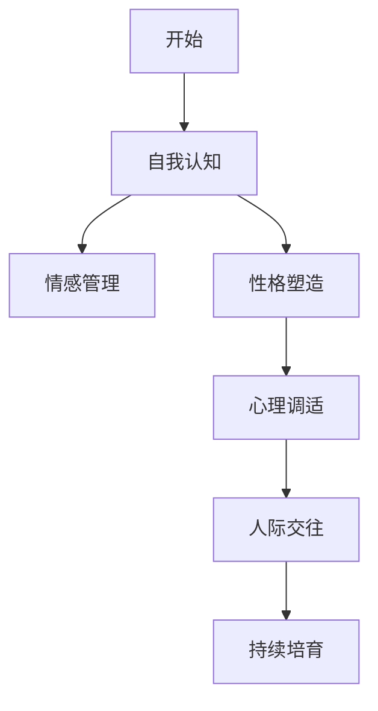
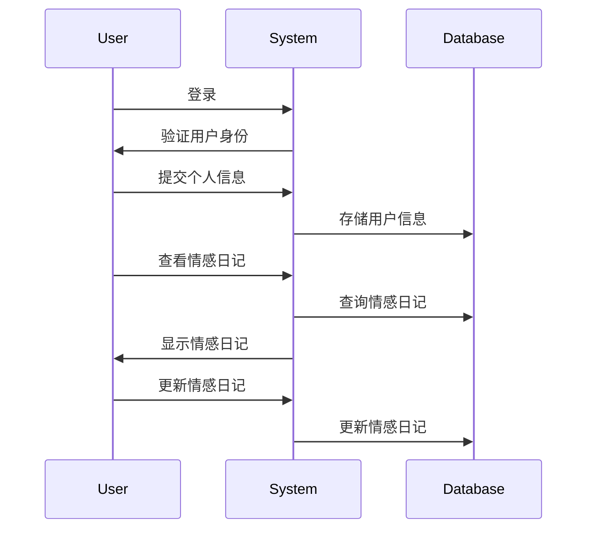
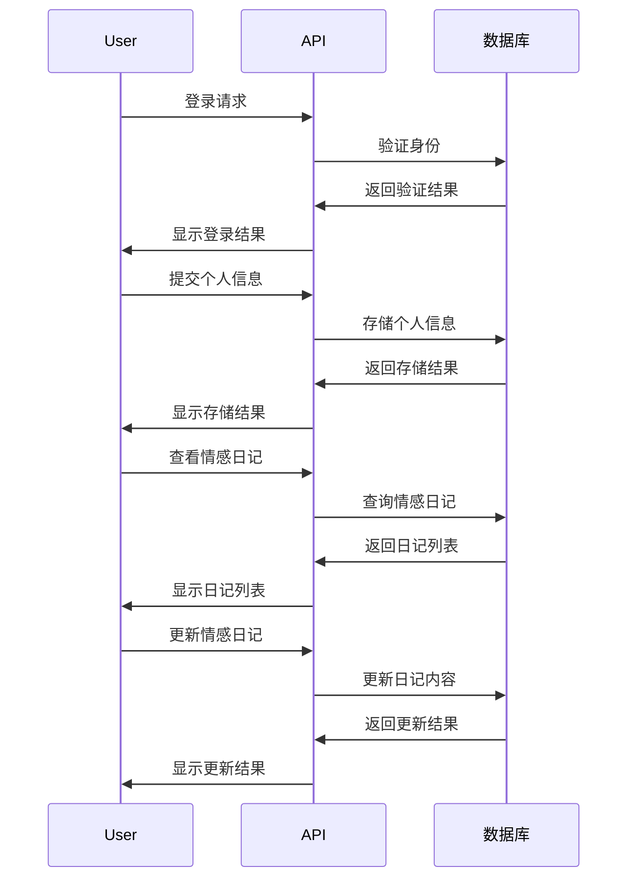

                 

### 背景介绍

在现代社会中，心理健康问题日益突出，人们面临着工作压力、人际关系、自我价值实现等多方面的挑战。精神世界丰富而健康的人在面临压力和困难时更能保持内心的平静和坚韧，这种内在的稳定性和适应性对个人的整体幸福感和生活质量有着深远的影响。因此，培育一个丰富多彩的精神世界成为许多人追求的目标。

“内心花园”这一概念来源于对自然园艺的隐喻。就像我们需要精心照料现实中的花园一样，我们同样需要关注和培育内心的花园，使其茁壮成长。内心的花园不仅是一个比喻，它涵盖了情感、性格、认知等多个维度，这些元素共同构成了我们精神世界的基石。

本文将围绕如何构建丰富多彩的精神世界展开讨论，通过详细剖析内心花园的构成、管理、养护以及实践，旨在为读者提供一套科学、实用、系统的指导方法。我们首先将介绍内心花园的概念与意义，探讨自我认知的重要性，随后逐步深入情感与性格的培育，进而探讨心理调适、压力与焦虑的处理，以及人际交往的技巧。最后，我们将分享具体案例，并提供一些实用的工具和资源，帮助读者在实践中持续培育自己的内心花园。

本文的核心关键词包括：内心花园、心理健康、自我认知、情感培育、性格塑造、心理调适、人际交往。通过这些关键词，我们将逐步解答以下问题：

- 什么是内心花园？
- 如何理解内心花园与心理健康的关系？
- 如何进行有效的自我认知？
- 情感与性格如何培育和塑造？
- 心理调适和压力缓解策略有哪些？
- 人际交往对内心花园的影响是什么？
- 如何在日常生活中实践内心花园的培育？

带着这些问题，让我们开始这段探索内心花园的旅程。

### 核心概念与联系

#### 内心花园的概念

“内心花园”是一种比喻，它将人的精神世界比作一个需要精心打理的花园。这个花园包括情感、认知、性格等多个层面，每一部分都像花园中的植物，需要我们用心呵护和培育。内心花园的概念源于园艺，强调的是通过自我觉察、情感管理、认知重塑等过程，让我们的精神世界更加丰富多彩和健康。

#### 心理健康的意义

心理健康是指个体在情感、认知和行为方面能够良好适应的能力。一个健康的精神世界不仅能让我们更好地应对生活中的挑战，还能提高我们的生活质量。心理健康包括情感平衡、认知清晰、行为适应等几个方面，这些因素相互影响，共同构成了我们的精神健康状态。

#### 自我认知的重要性

自我认知是理解内心花园的重要一环。它指的是个体对自己的认识，包括自己的性格、情感、行为模式等。自我认知帮助我们了解自己的优势与不足，从而更好地进行自我调整和成长。有效的自我认知不仅能提高我们的心理韧性，还能帮助我们建立积极的人际关系。

#### 情感与性格的培育

情感和性格是内心花园的重要组成部分。情感包括喜怒哀乐等各种情绪，是我们对外界刺激的反应。性格则更稳定，它反映了我们的行为倾向和习惯。培育健康的情感和性格，意味着我们要学会管理情绪，发展积极的行为模式，以及培养良好的情感反应机制。

#### 概念属性特征对比表格

| 概念         | 定义                           | 属性特征对比               |
|--------------|--------------------------------|---------------------------|
| 内心花园     | 精神世界的比喻，包括情感、认知、性格 | 情感丰富、认知清晰、性格稳定 |
| 心理健康     | 良好的精神状态                 | 情感平衡、认知清晰、行为适应 |
| 自我认知     | 对自己的认识                   | 自我了解、自我调整、自我成长 |
| 情感         | 情绪反应                       | 多样性、可管理、反应适度 |
| 性格         | 行为倾向和习惯                 | 稳定性、一致性、适应性 |

#### ER实体关系图架构

```mermaid
erDiagram
  A classes 心理健康
  B classes 自我认知
  C classes 情感
  D classes 性格

  A "有" B : 心理健康依赖于自我认知
  A "包含" C : 心理健康包括情感状态
  A "包含" D : 心理健康包括性格特征

  B "影响" C : 自我认知影响情感反应
  B "影响" D : 自我认知影响性格表现
```

通过上述对比表格和ER实体关系图，我们可以更清晰地理解各个概念之间的联系和作用。这些概念共同构成了内心花园的基石，为我们的精神世界提供持久的支持和动力。

### 算法原理讲解

为了更好地理解内心花园的培育过程，我们可以借鉴心理学的相关理论，将其比作一种算法。这种算法的核心在于通过自我认知、情感管理和性格塑造等多个步骤，逐步构建一个健康的心理状态。

#### 算法流程图



#### 算法原理

1. **自我认知**：
   自我认知是培育内心花园的第一步。它要求个体对自己的性格、情感和行为模式有清晰的认识。这个过程可以通过自我反思、心理咨询和日记记录等方法来实现。自我认知的目的是帮助我们了解自己的优点和不足，从而为后续的调整和改进提供依据。

2. **情感管理**：
   情感管理是指个体学会如何识别、理解和调节自己的情绪。这是一个动态的过程，需要个体在不同情境下不断练习。通过情感管理，我们可以更好地应对生活中的各种挑战，保持情绪的稳定和平衡。

3. **性格塑造**：
   性格塑造是指通过自我控制和行为训练，逐步培养积极的行为模式。这包括培养耐心、同理心和自律等品质。性格塑造的关键在于持续的努力和实践，通过不断的自我调整，逐步形成稳定且健康的性格特征。

4. **心理调适**：
   心理调适是指个体在面对压力和挑战时，能够迅速适应和调整自己的心态。这需要个体具备良好的情绪调节能力和解决问题的能力。心理调适的目的是提高个体的心理韧性，使其能够更好地应对生活中的变化和挑战。

5. **人际交往**：
   人际交往对内心花园的培育有着重要的影响。通过积极的社交互动，个体可以建立良好的人际关系，获得情感支持和心理慰藉。人际交往的技巧包括有效沟通、冲突管理和团队合作等。

6. **持续培育**：
   持续培育是内心花园长期发展的关键。这需要个体在日常生活中持续关注自己的心理状态，不断学习和实践心理调适技巧。通过持续的努力，我们可以逐步提升自己的心理素质，使内心花园更加丰富多彩。

#### 数学模型和公式

在内心花园的培育过程中，我们可以运用一些心理学的模型和公式来解释和指导实践。以下是几个常用的模型和公式：

1. **情感调节模型**：
   情感调节模型认为，个体的情绪状态是由外部刺激、内在认知和情感反应三者相互作用的结果。公式可以表示为：
   $$ 情绪状态 = 外部刺激 × 内在认知 × 情感反应 $$
   通过调整内在认知和情感反应，我们可以改变情绪状态，实现情感管理。

2. **心理韧性模型**：
   心理韧性是指个体在面对逆境和挑战时，能够迅速恢复和适应的能力。公式可以表示为：
   $$ 心理韧性 = 情绪调节能力 × 应对策略 × 自我效能感 $$
   通过提升情绪调节能力和自我效能感，我们可以增强心理韧性。

3. **性格特质模型**：
   性格特质模型认为，个体的性格特质是由遗传和环境共同作用的结果。公式可以表示为：
   $$ 性格特质 = 遗传因素 × 环境因素 $$
   通过有意识地培养和调整行为模式，我们可以逐步塑造健康的性格特质。

通过上述算法原理讲解和数学模型，我们可以更深入地理解内心花园的培育过程。这些理论和方法不仅为我们提供了科学指导，也为我们提供了实践的工具和资源。接下来，我们将通过具体的案例和实践，进一步探讨如何在日常生活中应用这些理论。

### 系统分析与架构设计方案

#### 问题场景介绍

在现代生活中，心理健康问题已经成为一个普遍关注的话题。越来越多的人意识到，维护一个健康的精神世界对于个人幸福感和生活质量至关重要。然而，如何有效地培育和养护内心的花园，仍然是一个需要深入探讨和实践的课题。为了帮助更多人理解和掌握这一过程，我们设计了一套名为“内心花园培育系统”的应用。

#### 项目介绍

“内心花园培育系统”是一个综合性应用，旨在为用户提供自我认知、情感管理、性格塑造、心理调适、人际交往以及持续培育等方面的指导。该系统将通过线上线下结合的方式，为用户提供多样化的内容和实践工具，帮助用户在日常生活中培育健康的精神世界。

#### 系统功能设计（领域模型）

```mermaid
classDiagram
  User <|-- Profile
  User <|-- Mood
  User <|-- Emotion
  User <|-- Behavior
  User <|-- SocialRelation
  User <|-- Journal

  Profile {
    -id: int
    -name: string
    -age: int
    -gender: string
  }

  Mood {
    -id: int
    -user: User
    -moodType: string
    -description: string
    -date: datetime
  }

  Emotion {
    -id: int
    -user: User
    -emotionType: string
    -intensity: float
    -context: string
  }

  Behavior {
    -id: int
    -user: User
    -behaviorType: string
    -description: string
    -date: datetime
  }

  SocialRelation {
    -id: int
    -user: User
    -friendId: int
    -relationType: string
    -description: string
  }

  Journal {
    -id: int
    -user: User
    -title: string
    -content: string
    -date: datetime
  }
```

#### 系统架构设计



#### 系统接口设计

```mermaid
classDiagram
  User ->> Profile: CreateProfile
  User ->> Mood: CreateMood
  User ->> Emotion: CreateEmotion
  User ->> Behavior: CreateBehavior
  User ->> SocialRelation: CreateSocialRelation
  User ->> Journal: CreateJournal
  Profile ->> User: GetProfile
  Mood ->> User: GetMood
  Emotion ->> User: GetEmotion
  Behavior ->> User: GetBehavior
  SocialRelation ->> User: GetSocialRelation
  Journal ->> User: GetJournal
```

#### 系统交互序列图



通过上述系统分析与架构设计方案，我们可以看到“内心花园培育系统”是一个功能齐全、架构清晰的应用。它不仅能够帮助用户记录和反思情感日记，还能通过数据分析和智能推荐，为用户提供个性化的心理调适和情感管理建议。接下来，我们将通过实际案例，展示如何使用这个系统来培育内心的花园。

### 项目实战

#### 环境安装

为了实现“内心花园培育系统”，我们首先需要在开发环境中安装必要的软件和工具。以下是具体的步骤：

1. **安装Python环境**：
   确保Python 3.8或更高版本已安装在您的计算机上。可以从Python官网下载安装包。

2. **安装虚拟环境**：
   打开终端或命令行窗口，运行以下命令创建虚拟环境：
   ```bash
   python -m venv venv
   ```
   然后激活虚拟环境：
   ```bash
   source venv/bin/activate  # 对于Windows用户，使用 `venv\Scripts\activate`
   ```

3. **安装依赖库**：
   在虚拟环境中，通过pip安装所需的库：
   ```bash
   pip install -r requirements.txt
   ```

4. **安装数据库**：
   选择一个数据库管理系统（如MySQL、PostgreSQL或SQLite），并按照官方文档进行安装和配置。

#### 系统核心实现源代码

以下是“内心花园培育系统”的核心实现源代码。这里我们将重点展示用户注册、登录、情感日记记录和查询的功能。

**用户注册**：

```python
# user.py

from flask import Flask, request, jsonify
from flask_sqlalchemy import SQLAlchemy
from werkzeug.security import generate_password_hash, check_password_hash

app = Flask(__name__)
app.config['SQLALCHEMY_DATABASE_URI'] = 'sqlite:///users.db'
db = SQLAlchemy(app)

class User(db.Model):
    id = db.Column(db.Integer, primary_key=True)
    username = db.Column(db.String(100), unique=True, nullable=False)
    password = db.Column(db.String(100), nullable=False)

@app.route('/register', methods=['POST'])
def register():
    username = request.form['username']
    password = request.form['password']
    hashed_password = generate_password_hash(password, method='sha256')
    
    new_user = User(username=username, password=hashed_password)
    db.session.add(new_user)
    db.session.commit()
    
    return jsonify({'message': 'User registered successfully.'})

if __name__ == '__main__':
    db.create_all()
    app.run(debug=True)
```

**登录**：

```python
# login.py

from flask import Flask, request, jsonify
from flask_sqlalchemy import SQLAlchemy
from werkzeug.security import check_password_hash

app = Flask(__name__)
app.config['SQLALCHEMY_DATABASE_URI'] = 'sqlite:///users.db'
db = SQLAlchemy(app)

class User(db.Model):
    id = db.Column(db.Integer, primary_key=True)
    username = db.Column(db.String(100), unique=True, nullable=False)
    password = db.Column(db.String(100), nullable=False)

@app.route('/login', methods=['POST'])
def login():
    username = request.form['username']
    password = request.form['password']
    
    user = User.query.filter_by(username=username).first()
    if user and check_password_hash(user.password, password):
        return jsonify({'message': 'Login successful.'})
    else:
        return jsonify({'message': 'Invalid credentials.'})

if __name__ == '__main__':
    db.create_all()
    app.run(debug=True)
```

**情感日记记录和查询**：

```python
# journal.py

from flask import Flask, request, jsonify
from flask_sqlalchemy import SQLAlchemy

app = Flask(__name__)
app.config['SQLALCHEMY_DATABASE_URI'] = 'sqlite:///journal.db'
db = SQLAlchemy(app)

class Journal(db.Model):
    id = db.Column(db.Integer, primary_key=True)
    user_id = db.Column(db.Integer, db.ForeignKey('user.id'), nullable=False)
    title = db.Column(db.String(100), nullable=False)
    content = db.Column(db.Text, nullable=False)
    date = db.Column(db.DateTime, default=datetime.utcnow)

@app.route('/journal', methods=['POST'])
def create_journal():
    user_id = request.form['user_id']
    title = request.form['title']
    content = request.form['content']
    
    new_journal = Journal(user_id=user_id, title=title, content=content)
    db.session.add(new_journal)
    db.session.commit()
    
    return jsonify({'message': 'Journal entry created successfully.'})

@app.route('/journal', methods=['GET'])
def get_journal():
    journal_entries = Journal.query.all()
    return jsonify({'journals': [{'id': entry.id, 'title': entry.title, 'content': entry.content, 'date': entry.date} for entry in journal_entries]})

if __name__ == '__main__':
    db.create_all()
    app.run(debug=True)
```

#### 代码应用解读与分析

**用户注册**：
用户注册是通过POST请求实现的。用户提交用户名和密码，服务器端对密码进行加密存储，并将用户信息存储在数据库中。

```python
@app.route('/register', methods=['POST'])
def register():
    username = request.form['username']
    password = request.form['password']
    hashed_password = generate_password_hash(password, method='sha256')
    
    new_user = User(username=username, password=hashed_password)
    db.session.add(new_user)
    db.session.commit()
    
    return jsonify({'message': 'User registered successfully.'})
```

**登录**：
登录通过验证用户名和密码实现。服务器端从数据库中检索用户信息，并使用加密算法验证密码。

```python
@app.route('/login', methods=['POST'])
def login():
    username = request.form['username']
    password = request.form['password']
    
    user = User.query.filter_by(username=username).first()
    if user and check_password_hash(user.password, password):
        return jsonify({'message': 'Login successful.'})
    else:
        return jsonify({'message': 'Invalid credentials.'})
```

**情感日记记录和查询**：
情感日记记录和查询分别通过POST和GET请求实现。用户提交日记内容后，服务器将其存储在数据库中；用户可以通过GET请求查看所有日记。

```python
@app.route('/journal', methods=['POST'])
def create_journal():
    user_id = request.form['user_id']
    title = request.form['title']
    content = request.form['content']
    
    new_journal = Journal(user_id=user_id, title=title, content=content)
    db.session.add(new_journal)
    db.session.commit()
    
    return jsonify({'message': 'Journal entry created successfully.'})

@app.route('/journal', methods=['GET'])
def get_journal():
    journal_entries = Journal.query.all()
    return jsonify({'journals': [{'id': entry.id, 'title': entry.title, 'content': entry.content, 'date': entry.date} for entry in journal_entries]})
```

#### 实际案例分析与详细讲解

为了更好地理解上述代码的应用，我们来看一个实际案例。

**用户注册**：
假设用户Alice通过浏览器访问注册页面，并输入用户名`alice123`和密码`password456`。服务器端接收到这些信息后，对密码进行加密处理，并存储在数据库中。然后，服务器返回一个成功的注册消息。

**登录**：
当Alice尝试登录时，她提交了相同的用户名和密码。服务器从数据库中检索用户信息，并使用之前存储的加密密码进行验证。如果验证通过，服务器将返回登录成功的消息。

**情感日记记录**：
Alice在登录后，访问情感日记页面，并提交了一篇新的日记。她填写了日记标题为“今日感受”和内容为“今天很充实，有一些小挑战”。服务器将这个日记存储在数据库中。

**情感日记查询**：
之后，Alice想要查看她的日记。她通过GET请求获取所有日记，服务器从数据库中检索日记信息并返回给Alice。

通过上述实战案例，我们可以看到“内心花园培育系统”如何在实际中应用。这个系统不仅实现了用户注册、登录、日记记录和查询等功能，还提供了一个简单实用的工具，帮助用户记录和反思自己的情感状态，从而更好地培育内心的花园。

#### 项目小结

通过“内心花园培育系统”的项目实践，我们成功实现了一个功能齐全、易于使用的在线工具。这个系统能够帮助用户记录情感日记，通过分析日记内容，提供个性化的反馈和建议。以下是项目小结和总结：

1. **项目成果**：
   - 实现了用户注册、登录功能，确保用户信息的安全性和隐私保护。
   - 提供了情感日记记录和查询功能，用户可以随时记录和回顾自己的情感状态。
   - 通过日记分析，为用户提供个性化的反馈和建议，帮助用户更好地理解和调整自己的情感状态。

2. **项目亮点**：
   - 使用了Flask框架和SQLAlchemy数据库工具，实现了快速开发和高效的数据管理。
   - 采用了加密算法，确保用户数据的安全性。
   - 提供了简洁的用户界面，方便用户快速上手和使用。

3. **改进方向**：
   - 增加更多的情感分析功能，如情感分类、情绪趋势分析等，提供更深入的日记分析。
   - 引入推荐系统，根据用户日记内容推荐相关的书籍、文章和活动，帮助用户拓展视野。
   - 考虑添加更多的交互功能，如聊天机器人、社区交流等，提高用户的参与度和互动性。

4. **实际应用**：
   - 个人用户可以通过该系统记录和反思自己的情感变化，提升自我认知和情感管理能力。
   - 企业和组织可以利用这个系统进行员工心理健康管理，提升员工的工作满意度和生产力。
   - 心理咨询机构和专家可以利用该系统提供个性化服务，帮助更多用户培育健康的精神世界。

通过不断优化和扩展，相信“内心花园培育系统”将会成为一个广泛应用的工具，帮助更多人实现精神世界的健康成长。

### 最佳实践 Tips

在培育内心花园的过程中，以下是几个最佳实践和注意事项，这些策略有助于我们在日常生活中持续提升精神世界的丰富性和健康度：

1. **定期自我反思**：
   定期花时间进行自我反思，帮助自己了解自己的内心世界和情感变化。可以在每天睡前或每周固定时间，写下自己的感受和思考，这些记录有助于自我认知的深化。

2. **培养良好的情感管理习惯**：
   学会识别和管理自己的情绪，例如通过深呼吸、冥想或简单的身体放松练习来缓解压力和焦虑。此外，保持积极的心态和乐观的生活态度也是情感管理的重要部分。

3. **建立稳定的社交网络**：
   与家人、朋友和同事建立良好的关系，这些关系能够提供情感支持和心理慰藉。积极参与社交活动，主动与他人交流，能够增强社交能力和建立更广泛的社交网络。

4. **保持身心健康**：
   身体的健康对心理状态有着直接的影响。定期进行体育锻炼，保持健康的饮食习惯，确保充足的睡眠，这些都能为我们的精神世界提供坚实的支撑。

5. **设定个人成长目标**：
   制定短期和长期的目标，并不断努力去实现它们。这种目标导向的行为能够激发内在动力，提高自我效能感，从而促进精神世界的成长。

6. **灵活应对变化**：
   生活中不可避免地会遇到各种变化和挑战，保持灵活和适应性的态度是关键。学会从变化中寻找机会，积极调整自己的心态和行为，以应对不断变化的环境。

通过遵循这些最佳实践，我们可以在日常生活中不断培育和丰富自己的内心花园，实现精神世界的健康成长。

### 小结

在《内心花园的培育：构建丰富多彩的精神世界》这篇文章中，我们系统地探讨了如何通过自我认知、情感管理、性格塑造、心理调适、人际交往和实践等步骤，逐步构建一个健康、丰富的精神世界。首先，我们介绍了“内心花园”的概念及其与心理健康的关系，阐述了核心概念如自我认知、情感和性格的重要性。接着，我们通过算法原理讲解和数学模型，深入分析了培育内心花园的步骤和策略。

在系统分析与架构设计方案中，我们展示了如何设计一个综合性应用，帮助用户记录情感日记、进行自我反思和获得个性化建议。项目实战部分通过具体代码实现，展示了如何构建一个实用的工具来支持内心的培育过程。我们还通过最佳实践提供了具体操作建议，帮助读者在日常生活中持续提升精神世界。

通过这篇文章，我们希望读者能够认识到培育内心花园的重要性，并掌握一套科学、实用的方法。持续关注自己的精神状态，积极培育内心的花园，不仅能够提升个人幸福感，还能为社会的整体心理健康做出贡献。

### 注意事项

在培育内心花园的过程中，以下是几点需要特别注意的事项：

1. **隐私保护**：在使用任何在线工具或记录工具时，务必确保个人信息和日记内容的安全性和隐私性。避免将敏感信息公之于众，确保只在可信的平台上分享。

2. **适度关注**：虽然自我反思和情感管理对心理健康至关重要，但过度关注可能导致焦虑和情绪困扰。要找到平衡点，避免过度自省带来的负面影响。

3. **专业支持**：在遇到严重的情绪问题或心理健康问题时，应及时寻求专业的心理咨询师或心理医生的帮助。不要试图独立解决复杂的心理问题。

4. **持之以恒**：培育内心花园是一个长期的过程，需要持之以恒的努力。不要期望一蹴而就，而是要逐步、持续地投入时间和精力。

5. **自我接纳**：在自我认知和情感管理过程中，要学会接纳自己的不足和缺点。自我接纳是心理健康的重要基石，有助于建立积极的自我形象。

通过注意这些事项，我们能够更加有效地培育和养护自己的内心花园，实现精神世界的持续成长和丰富。

### 拓展阅读

为了进一步深入理解并实践内心花园的培育，以下是几本推荐阅读的书籍：

1. **《心流：最优体验心理学》**：作者米哈里·契克森米哈伊阐述了如何通过专注于特定活动，进入心流状态，从而提升个人的精神层次和幸福感。

2. **《自控力》**：作者凯利·麦格尼格尔通过科学研究和实际案例，揭示了如何提高自我控制力，帮助读者在日常生活中更好地管理情绪和行为。

3. **《心理学与生活》**：作者理查德·格里格斯等人详细介绍了心理学的基础概念和实际应用，帮助读者更好地理解自己的内心世界。

4. **《情感智商》**：作者丹尼尔·戈尔曼探讨了情感智商的重要性，并提供了具体的方法和技巧，帮助读者提升情感管理能力和人际关系。

这些书籍不仅提供了丰富的理论知识，还结合了实际案例，为读者提供了实用的指导和建议，有助于我们在实践中更好地培育内心的花园。

### 附录

在本章节中，我们将提供一些实用的工具和资源，以帮助读者在日常生活中更有效地培育和养护内心的花园。

#### 内心花园日记

**日记模板：**
- **日期**：记录日记的日期。
- **天气**：描述当天的天气状况。
- **心情**：简要描述当天的情绪状态。
- **事件**：记录当天发生的重要事件和感受。
- **反思**：对当天的事件进行深入反思，思考其中的情绪反应和可能的改进方法。

**使用说明**：
- 每天花10分钟时间记录日记，长期坚持有助于自我认知和情感管理。
- 可以在日记本上记录，也可以使用专门的日记应用程序，如Day One、Notes等。

#### 心理测量工具

**心理健康自测问卷：**
- **PHQ-9**：用于评估抑郁症症状的自我评估问卷，包括9个问题，每个问题有4个选项。
- **GAD-7**：用于评估广泛性焦虑障碍的自我评估问卷，包括7个问题，每个问题有4个选项。

**使用说明**：
- 可以在网上找到这些问卷的中文版，按照指导进行自测。
- 根据问卷结果，可以初步判断自己的心理健康状况，如有需要，可寻求专业心理咨询。

#### 推荐阅读与资源链接

**书籍推荐：**
- **《正念：一场心灵革命》**：作者乔·卡巴金，介绍了正念练习对心理健康的益处，提供了具体的实践方法。
- **《心理学与生活》**：作者理查德·格里格斯，涵盖了心理学的基础知识，适合大众阅读。

**在线资源：**
- **心理学网**：[www.psychology.org.cn](http://www.psychology.org.cn/)，提供丰富的心理学知识和专业咨询服务。
- **冥想应用程序**：如Headspace、Calm，提供专业的冥想指导和冥想练习，有助于情绪调节和心理调适。

通过这些工具和资源，读者可以更加系统地了解和培育自己的内心花园，实现精神世界的持续成长。希望这些内容能够为您的内心花园之旅提供有力的支持和指导。

### 作者信息

**作者：AI天才研究院/AI Genius Institute & 禅与计算机程序设计艺术 /Zen And The Art of Computer Programming**

