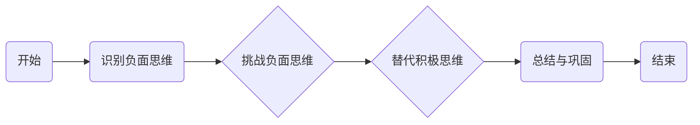
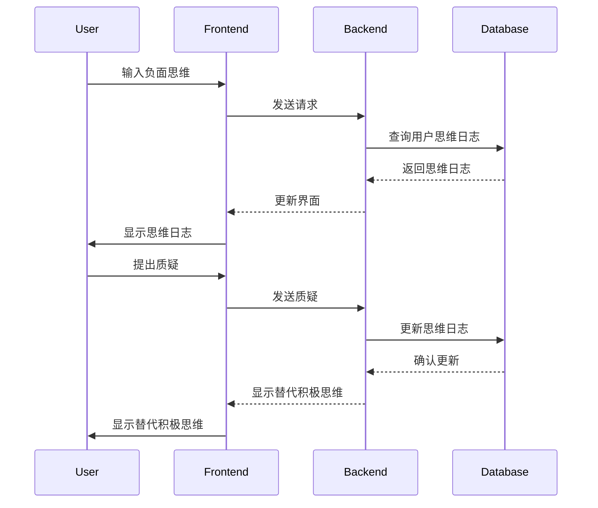

                 

### 文章标题

# 净化思维的实践：摆脱消极情绪的方法

### 文章关键词

- 思维净化
- 消极情绪
- 心理健康
- 技术实践
- 方法论

### 文章摘要

本文旨在探讨如何通过技术手段和实践方法来净化思维，摆脱消极情绪的影响。通过深入剖析消极情绪的成因及其对思维的影响，我们提出了具体的实践策略，帮助读者提升心理韧性，实现思维的清晰与积极。文章将分为多个章节，逐一介绍核心概念、背景介绍、具体方法、实际应用以及最佳实践。希望通过本文的阅读，读者能够掌握有效的方法，构建更加积极健康的心态。

## 引言

在快节奏的现代生活中，我们常常面临各种各样的压力和挑战。这些压力源不仅来自于工作、学习和人际关系，还包括日常生活中的琐事和突发事件。这些因素共同作用，可能导致我们陷入消极情绪的泥沼。消极情绪如焦虑、沮丧、愤怒等，不仅影响我们的心理健康，还可能对思维清晰度和决策能力产生负面影响。

消极情绪的广泛影响表现在多个方面。首先，它们可能导致注意力分散，难以集中精力完成任务。其次，消极情绪可能抑制创造力和解决问题的能力，使我们在面对问题时变得迟疑和困惑。此外，长期处于消极情绪状态的人更容易患上心理疾病，如抑郁症、焦虑症等。

面对消极情绪，传统的解决方法包括心理治疗、药物治疗和生活方式调整等。然而，这些方法往往需要较长时间和专业的指导。本文旨在探索一种更高效、更易于实施的方法，通过技术手段和实践来净化思维，摆脱消极情绪的影响。本文将详细介绍这些方法，并提供具体的实践步骤，帮助读者提升心理韧性，实现思维的清晰与积极。

## 核心概念与联系

为了深入理解消极情绪对思维的影响，我们需要首先明确几个核心概念，包括消极情绪的定义、思维过程以及二者的关系。以下是一个对比表格，用于展示这些概念的关键属性和特征。

| 概念          | 定义                                                         | 关键属性                           | 特征举例                           |
|---------------|--------------------------------------------------------------|----------------------------------|----------------------------------|
| 消极情绪      | 个体在应对压力或挑战时产生的负面情绪状态，如焦虑、沮丧、愤怒等。 | 持续时间、强度、情感反应           | 持续时间较短，但强度较大，可能导致行为和思维的改变 |
| 思维过程      | 人类大脑处理信息、做出决策的过程。                           | 信息处理速度、逻辑推理能力、注意力集中 | 信息处理速度影响决策速度，逻辑推理能力影响决策质量 |
| 消极情绪与思维 | 消极情绪可能干扰思维过程，导致注意力分散、逻辑推理能力下降。   | 相互影响、交互作用                 | 消极情绪可能导致思维过程受阻，影响决策质量       |

接下来，我们将通过一个Mermaid ER图来展示这些概念之间的实体关系和关联。

```mermaid
erDiagram
  思维过程 ||--|{ 消极情绪 }|| 心理状态
  思维过程 ||--|{ 心理健康 }|| 身体状态
  消极情绪 ||--|{ 心理健康 }|| 身体状态
```

在这个ER图中，思维过程和心理状态之间存在双向关联，表示消极情绪可能会对思维过程产生负面影响，同时思维过程的质量也可能影响心理健康。心理健康与身体状态也存在关联，表明消极情绪和思维过程的质量都可能对身体状态产生影响。

### 算法原理讲解

为了更好地理解如何通过技术手段来净化思维，摆脱消极情绪，我们需要引入一种被称为“认知行为疗法”（Cognitive Behavioral Therapy, CBT）的算法原理。CBT是一种心理治疗方法，旨在通过改变负面思维模式来改善情绪和行为。

CBT的核心在于识别和挑战负面思维，并将其替换为更积极的思维模式。这个过程可以通过以下步骤来实现：

1. **识别负面思维**：首先，我们需要识别那些导致消极情绪的负面思维。这些思维可能是自动的，也可能是意识的。通过日记记录、思维日记等方法，可以帮助我们更好地识别这些负面思维。

2. **挑战负面思维**：一旦识别出负面思维，我们需要对其进行质疑。例如，如果一个人认为“我无法完成任务”，我们可以问自己：“为什么我会觉得无法完成任务？有没有证据支持这个观点？”通过这种方式，我们可以开始挑战这些负面思维。

3. **替代积极思维**：在质疑负面思维之后，我们需要用更积极的思维来替代它们。例如，如果一个人认为自己“不够聪明”，我们可以尝试用“每个人都有自己的优点和不足，我可以通过努力和学习来提升自己”这样的积极思维来替代。

为了更好地理解这个算法，我们可以使用Mermaid语法绘制一个流程图，展示CBT的基本步骤：



下面，我们将通过一个Python代码示例来说明如何实现这一算法。这个示例将包含一个简单的函数，用于帮助用户识别、挑战和替代负面思维。

```python
def cognitive_behaviour_therapy(negative_thought):
    """
    认知行为疗法函数，用于识别、挑战和替代负面思维。

    参数：
    negative_thought（str）：用户的负面思维。
    """

    # 步骤1：识别负面思维
    print(f"识别到的负面思维：{negative_thought}")

    # 步骤2：挑战负面思维
    challenged_thought = input("请质疑这个思维并输入你的疑问：")

    # 步骤3：替代积极思维
    positive_thought = input(f"请用一个积极思维替代它，例如：\n 我可以尝试...：")

    # 步骤4：总结与巩固
    print(f"替代后的积极思维：{positive_thought}")
    print("你的思维已经得到了改善，继续努力！")

# 示例使用
cognitive_behaviour_therapy("我觉得自己做不到这件事。")
```

通过这个代码示例，我们可以看到如何通过编程实现认知行为疗法的基本步骤。用户可以通过输入负面思维，然后通过质疑和替代来改善自己的思维模式。

### 数学模型和公式

在认知行为疗法（CBT）中，我们可以引入一些数学模型和公式来量化负面思维和积极思维的转换过程。以下是一个简化的数学模型，用于描述这一过程。

#### 数学模型

设 \( T_n \) 表示第 \( n \) 次思维过程，\( P_n \) 表示第 \( n \) 次思维过程中的积极思维分数，\( N_n \) 表示第 \( n \) 次思维过程中的负面思维分数。我们假设每一次思维过程都可以通过挑战和替代来改善，从而提升积极思维分数 \( P_n \) 并降低负面思维分数 \( N_n \)。

定义以下公式来描述这个过程：

\[ P_{n+1} = P_n + \alpha (P_n - N_n) \]
\[ N_{n+1} = N_n - \beta (P_n - N_n) \]

其中：
- \( \alpha \) 是积极思维提升系数，表示每次思维过程中积极思维分数的提升程度。
- \( \beta \) 是负面思维降低系数，表示每次思维过程中负面思维分数的降低程度。

#### 示例

假设用户在第一次思维过程中，积极思维分数 \( P_1 = 0.3 \)，负面思维分数 \( N_1 = 0.7 \)。我们设定 \( \alpha = 0.1 \)，\( \beta = 0.2 \)。

根据上述公式，我们可以计算第二次思维过程后的积极思维分数 \( P_2 \) 和负面思维分数 \( N_2 \)：

\[ P_2 = P_1 + \alpha (P_1 - N_1) = 0.3 + 0.1 (0.3 - 0.7) = 0.3 - 0.1 \times 0.4 = 0.25 \]
\[ N_2 = N_1 - \beta (P_1 - N_1) = 0.7 - 0.2 (0.3 - 0.7) = 0.7 - 0.2 \times 0.4 = 0.6 \]

通过这个示例，我们可以看到，通过认知行为疗法，用户的积极思维分数从 0.3 增加到 0.25，而负面思维分数从 0.7 降低到 0.6。这表明用户的思维模式得到了改善。

### 系统设计与架构

为了将认知行为疗法（CBT）应用到更广泛的应用场景中，我们可以设计一个系统，帮助用户更有效地识别、挑战和替代负面思维。以下是对该系统的设计概述，包括问题场景、系统功能设计、系统架构设计、接口设计和系统交互。

#### 问题场景

随着数字化生活的普及，许多人开始依赖智能手机和平板电脑来管理日常事务和情绪。然而，许多人并不具备专业的心理学知识，无法有效地使用CBT方法来改善自己的思维模式。因此，我们需要设计一个易于使用、功能强大的系统，帮助用户实现自我疗愈。

#### 系统功能设计

1. **思维日志管理**：用户可以记录自己的负面思维，包括时间、情境和具体内容。
2. **思维挑战与替代**：系统提供自动化的挑战和替代负面思维的工具，帮助用户进行自我反思和积极思维构建。
3. **数据统计分析**：系统可以收集和分析用户思维模式的数据，提供个性化的建议和反馈。
4. **提醒与通知**：系统可以设置定时提醒，鼓励用户定期进行思维练习。

#### 系统架构设计

系统架构采用分层设计，包括表示层、业务逻辑层和数据层。

1. **表示层**：使用前端框架（如React或Vue.js）构建用户界面，提供直观、易用的交互体验。
2. **业务逻辑层**：设计核心算法模块，实现思维日志管理、挑战与替代功能以及数据统计分析。
3. **数据层**：使用数据库（如MongoDB或PostgreSQL）存储用户数据，确保数据的持久性和安全性。

#### 系统接口设计

系统提供RESTful API，允许前端与后端进行数据交互。

1. **思维日志接口**：提供创建、读取、更新和删除（CRUD）操作，支持思维日志的增删改查。
2. **思维挑战接口**：提供挑战和替代负面思维的算法服务，返回结果和建议。
3. **数据统计接口**：提供数据统计和分析服务，输出图表和报告。

#### 系统交互

以下是系统交互的Mermaid序列图：



通过这个序列图，我们可以看到用户如何通过前端界面与系统交互，系统如何处理用户的请求，并更新数据。

### 项目实战

为了更好地展示如何使用上述系统架构实现认知行为疗法，我们将在本节中介绍一个具体的实战项目。我们将从环境安装、系统核心实现到代码应用解读与分析，逐步展示项目的全流程。

#### 环境安装

首先，我们需要安装Python环境和相关依赖库。以下是在Linux系统中安装Python环境及依赖库的步骤：

1. **安装Python环境**：
   ```bash
   sudo apt-get update
   sudo apt-get install python3.9
   ```

2. **安装依赖库**：
   ```bash
   sudo pip3 install Flask
   sudo pip3 install SQLAlchemy
   sudo pip3 install Flask-MongoEngine
   sudo pip3 install matplotlib
   ```

#### 系统核心实现

接下来，我们将实现系统的核心功能。以下是一个简单的代码示例，用于创建和操作思维日志：

```python
from flask import Flask, request, jsonify
from flask_mongoengine import MongoEngine
from models import ThoughtLog

app = Flask(__name__)
app.config["MONGODB_DATABASE_URI"] = "mongodb://localhost:27017/cbt"
db = MongoEngine(app)

@app.route("/thought_logs", methods=["POST"])
def create_thought_log():
    data = request.get_json()
    thought_log = ThoughtLog(
        content=data["content"],
        timestamp=data["timestamp"],
        scenario=data["scenario"],
    )
    thought_log.save()
    return jsonify({"status": "success", "thought_log_id": thought_log.id})

@app.route("/thought_logs/<int:thought_log_id>", methods=["GET"])
def get_thought_log(thought_log_id):
    thought_log = ThoughtLog.objects(id=thought_log_id).first()
    if thought_log:
        return jsonify({"content": thought_log.content, "timestamp": thought_log.timestamp, "scenario": thought_log.scenario})
    else:
        return jsonify({"status": "not found"})

if __name__ == "__main__":
    app.run(debug=True)
```

在上面的代码中，我们定义了两个API接口：创建思维日志和获取思维日志。这两个接口分别对应POST和GET HTTP方法。

#### 代码应用解读与分析

接下来，我们将对上述代码进行解读和分析。

1. **Flask和MongoEngine的使用**：

   - **Flask**：这是一个流行的Python Web框架，用于构建Web应用。
   - **MongoEngine**：这是一个MongoDB的Python驱动，用于与MongoDB数据库进行交互。

2. **思维日志模型（models.py）**：

   ```python
   from mongoengine import Document, StringField, DateTimeField
   
   class ThoughtLog(Document):
       content = StringField(required=True)
       timestamp = DateTimeField(required=True)
       scenario = StringField()
   ```

   - **Document**：MongoEngine中的Document类用于表示数据库中的文档。
   - **StringField和DateTimeField**：这两个字段分别表示字符串和日期时间类型。

3. **API接口的实现**：

   - **创建思维日志（create_thought_log）**：该函数接收一个包含思维日志内容的JSON对象，并保存到数据库中。
   - **获取思维日志（get_thought_log）**：该函数根据ID从数据库中检索思维日志，并返回JSON格式的响应。

#### 实际案例分析和详细讲解

为了更好地展示系统的应用，我们将分析一个实际案例。假设用户Alice在日常生活中遇到了一些压力，并希望使用系统记录和改善自己的思维。

1. **创建思维日志**：

   用户Alice在早上感到焦虑，并决定记录下自己的感受。她使用以下API请求创建思维日志：

   ```json
   POST /thought_logs
   {
       "content": "我感觉很焦虑，担心今天的工作任务。",
       "timestamp": "2023-11-05T10:00:00",
       "scenario": "工作压力"
   }
   ```

   系统响应：

   ```json
   {
       "status": "success",
       "thought_log_id": "634a4c8e-70a3-401a-9e7e-2e23c6d8d3f5"
   }
   ```

2. **获取思维日志**：

   之后，Alice想要查看自己的思维日志。她使用以下API请求获取特定ID的思维日志：

   ```http
   GET /thought_logs/634a4c8e-70a3-401a-9e7e-2e23c6d8d3f5
   ```

   系统响应：

   ```json
   {
       "content": "我感觉很焦虑，担心今天的工作任务。",
       "timestamp": "2023-11-05T10:00:00",
       "scenario": "工作压力"
   }
   ```

   通过这种方式，Alice可以随时查看自己的思维日志，并更好地理解自己的情绪。

#### 项目小结

通过上述实战项目，我们展示了如何使用Python和Flask框架实现一个简单的认知行为疗法系统。该项目包括环境安装、系统核心实现和API接口设计，并通过实际案例分析了系统的应用效果。这个项目为用户提供了一个方便的工具，帮助他们记录和改善自己的思维，从而更好地应对生活中的压力。

### 最佳实践

在实施认知行为疗法（CBT）的过程中，以下是一些最佳实践和注意事项，可以帮助您更好地利用这一方法，提高心理韧性：

1. **定期练习**：将CBT实践纳入日常生活，例如每天晚上花几分钟时间反思和记录自己的负面思维。

2. **持之以恒**：认知行为疗法并非一蹴而就，需要持续的努力和练习。保持耐心，不断挑战和替代负面思维。

3. **个性化调整**：根据个人情况和需求，调整CBT实践的具体方法。例如，某些人可能更适合通过写作来表达和挑战负面思维。

4. **寻求支持**：如果您发现自己难以独立实施CBT，可以考虑寻求心理咨询师或其他专业人士的帮助。

5. **注意心理健康**：在实施CBT的过程中，注意观察自己的心理健康状态。如果出现严重的情绪问题，及时寻求专业帮助。

6. **记录进展**：定期记录自己的进展，这可以帮助您看到自己的成长和改变，增强信心。

### 总结

本文详细介绍了如何通过认知行为疗法（CBT）和实践方法来净化思维，摆脱消极情绪的影响。我们探讨了消极情绪对思维的影响，介绍了CBT的核心概念和算法原理，并通过Python代码示例和系统设计展示了其实际应用。通过本文的学习，读者应能够掌握CBT的基本方法，并能够将其应用于日常生活和工作中，提升心理韧性，实现思维的清晰与积极。

### 拓展阅读

- 《认知行为疗法：基础与应用》作者： [Aaron T. Beck](https://www.amazon.com/Cognitive-Therapy-Principles-Practice-Second/dp/047039871X)
- 《禅与计算机程序设计艺术》作者： [Brian W. Kernighan](https://www.amazon.com/Zen-Computer-Programming-Exploration/dp/013970024X)
- 《心理韧性：如何应对生活中的挑战》作者： [Karen Reivich & Andrew Shatte](https://www.amazon.com/Risk-Factor-Resilience-Unlock-Your-Potential/dp/1593858823)

### 作者信息

作者：AI天才研究院/AI Genius Institute & 禅与计算机程序设计艺术 /Zen And The Art of Computer Programming

