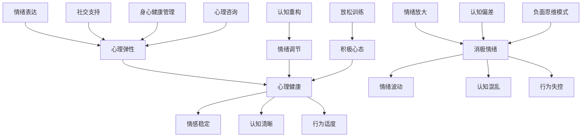

                 

### 1.1.1 心理健康的普遍关注

在现代社会，心理健康问题已经成为全球范围内广泛关注的议题。随着生活节奏的加快、工作压力的增大以及社会竞争的激烈，越来越多的人开始意识到心理健康对个人幸福和整体生活质量的重要性。根据世界卫生组织（WHO）的统计，全球约有三分之一的人口在其一生中某个阶段遭受精神障碍的影响[1]。这不仅影响了个人的生活质量，也给家庭、社会带来了巨大的负担。

心理健康问题的普遍性体现在多个方面。首先是人口层面，从儿童到老年人，不同年龄阶段的人都可能面临心理健康问题。例如，儿童可能因为学业压力或家庭关系问题而出现焦虑或抑郁；而老年人则可能因为健康问题或孤独感而产生抑郁情绪。其次，职场压力也是导致心理健康问题的主要原因之一。许多职场人士由于工作负荷过大、晋升压力或人际关系复杂而感到焦虑和压力。最后，现代社会的高度信息化和社交媒体的普及，虽然为人们提供了更多交流的渠道，但同时也带来了信息过载和社交压力，使得一些人感到孤独和无助。

心理健康问题的普遍性还体现在其对个人和社会的影响上。心理健康问题不仅影响个人的生活质量，如睡眠质量、食欲、社交能力和工作表现，还可能导致更严重的后果，如自杀、犯罪等。同时，心理健康问题也给家庭和社会带来了沉重的负担，如医疗费用增加、生产力下降、家庭破裂等。因此，关注和解决心理健康问题已经成为全球各国政府和社会组织的重要任务。

### 1.1.2 消极情绪的定义与影响

消极情绪是指个体在面对压力、挑战或负面事件时产生的一系列负面情绪体验，如恐惧、焦虑、愤怒、沮丧等。这些情绪通常与负面的认知和行为反应有关，可能导致个体心理和生理功能的失调。根据心理学研究，消极情绪不仅影响个体的情绪体验，还对认知功能、身体健康和社交行为产生深远的影响。

首先，消极情绪对认知功能的影响体现在多个方面。研究表明，当个体处于消极情绪状态下，其注意力和认知处理能力可能会受到干扰，难以集中精力进行复杂的认知任务。例如，焦虑和恐惧情绪可能导致个体注意力分散，难以专注于工作或学习。此外，消极情绪还可能影响个体的记忆和决策能力。研究发现，处于抑郁状态下的个体更容易出现记忆力减退和判断力下降的现象。

其次，消极情绪对身体健康的影响也是显著的。长期处于消极情绪状态可能导致一系列生理反应，如心跳加速、血压升高、免疫力下降等。这些生理反应不仅增加了个体患病的风险，还可能导致慢性疾病的产生。例如，长期焦虑和抑郁状态与心血管疾病、免疫系统失调和消化系统疾病等慢性疾病的发病率增加有关。此外，消极情绪还可能影响个体的睡眠质量，导致失眠或睡眠障碍，从而进一步加剧心理健康问题。

最后，消极情绪对社交行为的影响也是不可忽视的。消极情绪往往会导致个体产生逃避或回避的行为，减少与他人的互动和交流。这种社交隔离不仅加剧了个体内心的孤独感，还可能导致更严重的社交障碍和人际关系问题。例如，愤怒和沮丧情绪可能导致个体在与他人的冲突中采取攻击性或敌对的行为，从而破坏人际关系。此外，消极情绪还可能影响个体在工作场合中的合作能力和团队协作效果，降低工作效率和团队凝聚力。

综上所述，消极情绪对个体的认知功能、身体健康和社交行为产生广泛而深远的影响，因此，理解和应对消极情绪对维护心理健康具有重要意义。

### 1.1.3 心理健康的重要性

心理健康在个体成长和社会发展中扮演着至关重要的角色。首先，从个人层面来看，心理健康直接影响个体的情感体验和生活质量。一个心理健康的人能够更好地应对日常生活中的压力和挑战，保持积极向上的情绪状态，从而提高生活质量。例如，心理健康有助于改善睡眠质量、提高食欲和增强免疫力，使个体能够更好地享受生活的美好。此外，心理健康还与个人的学业和职业生涯密切相关。心理健康状况良好的个体通常能够更专注地学习，更高效地工作，从而在学业和职业上取得更好的成绩。

其次，心理健康对个体心理健康有深远的影响。心理健康不佳的个体可能会经历情绪波动、焦虑和抑郁等心理问题，这些问题不仅影响个体的情绪体验，还可能导致认知功能下降和生理健康受损。相反，心理健康良好的个体能够更好地调节情绪，保持心理平衡，从而降低患心理疾病的风险。此外，心理健康还对个体的心理弹性有重要影响。心理弹性是指个体在面对逆境和压力时恢复和适应的能力。一个具备良好心理弹性的个体能够在面对挫折和困难时保持积极的心态，迅速从困境中恢复过来，从而更好地应对未来的挑战。

从社会层面来看，心理健康的重要性同样不可忽视。首先，心理健康状况良好的个体能够更好地融入社会，积极参与社会活动，从而促进社会的和谐发展。其次，心理健康问题不仅影响个体，还可能导致家庭破裂、社会不稳定等问题。心理健康问题的流行率增加，会给家庭和社会带来沉重的负担。例如，家庭成员的心理健康问题可能导致家庭关系紧张，进而影响子女的成长和家庭的稳定。此外，心理健康问题还会增加医疗成本，降低生产力，影响社会经济的可持续发展。

综上所述，心理健康对个体和社会的影响是多方面且深远的。维护和促进心理健康不仅有助于提高个体的生活质量，促进个人的全面发展，也有利于构建和谐社会，实现社会经济的可持续发展。因此，心理健康应当成为社会各领域关注的焦点，需要通过多种途径进行普及和提升。

### 1.2 消极情绪的类型与特征

消极情绪种类繁多，每种情绪都有其独特的表现形式和特点。以下是几种常见的消极情绪类型及其特征：

#### 1.2.1 恐惧与焦虑

恐惧是一种对潜在威胁的强烈情绪反应。个体在面临具体或想象中的危险时，会产生恐惧感。例如，害怕高处、黑暗或特定的事物。恐惧情绪通常伴随着生理反应，如心跳加速、呼吸急促和出汗。焦虑则是对未来可能发生的事情的过度担忧和紧张感。焦虑情绪可能导致个体持续感到不安，影响日常生活和工作。例如，过度担心健康问题、工作表现或人际关系。

#### 1.2.2 愤怒与沮丧

愤怒是一种强烈的负面情绪，通常由受挫、不满或被冒犯引发。愤怒情绪会导致个体产生攻击性或敌对行为，有时甚至可能失控。沮丧是一种长期的、持续的情绪低落状态，通常由失败、失望或失去重要事物引起。沮丧情绪可能导致个体缺乏活力，对生活失去兴趣，甚至产生自杀念头。

#### 1.2.3 恐惧与焦虑的共同特征

恐惧与焦虑这两种情绪有许多共同特征。首先，它们都伴随着显著的生理反应，如心跳加速、出汗和呼吸急促。这些生理反应是身体准备应对潜在威胁的生理准备。其次，恐惧和焦虑都会影响个体的认知功能，使其难以集中注意力，导致决策困难。最后，恐惧和焦虑都会对个体的日常生活产生负面影响，如影响睡眠质量、食欲和社交活动。

#### 1.2.4 愤怒与沮丧的共同特征

愤怒和沮丧这两种情绪也有许多相似之处。首先，它们都可能导致个体的行为和情绪反应发生变化，影响人际关系和工作表现。愤怒情绪可能使个体在与他人互动时产生敌对或攻击行为，而沮丧情绪则可能导致个体出现退缩或孤立行为。其次，这两种情绪都可能导致个体的身心健康问题，如高血压、心脏病和免疫系统功能下降。

#### 1.2.5 消极情绪的共同特征

所有消极情绪都具有一些共同的特征。首先，它们都伴随着情绪体验的负面性，使个体感到不适和痛苦。其次，消极情绪通常会影响个体的认知和行为，使其难以进行正常的心理活动。例如，焦虑和恐惧情绪可能导致个体产生逃避或回避行为，而愤怒和沮丧情绪可能导致个体产生攻击性或自毁行为。最后，消极情绪还会对个体的身心健康产生深远影响，增加患病风险和降低生活质量。

通过了解不同类型消极情绪的特征和共同点，我们可以更好地理解其产生的机制和影响，从而采取有效的策略进行情绪管理和心理健康维护。

### 1.3 心理健康的定义与标志

心理健康是一个多维度的概念，涵盖了个体的情感、认知和行为健康状态。其定义和标志可以从以下几个方面进行详细阐述：

#### 1.3.1 心理健康的定义

心理健康是指个体在情感、认知和行为方面达到一种平衡状态，能够有效地应对日常生活中的压力和挑战，保持良好的适应性和功能状态。心理健康不仅仅是没有心理疾病，它还涉及到个体的整体福祉和幸福感。世界卫生组织（WHO）将心理健康定义为“一种状态，其中个体能够认识到自己的能力，能够应对正常的生活压力，能够工作生产，并且能够为其社区做出贡献”[1]。

#### 1.3.2 心理健康的标志

一个心理健康的人通常具备以下几项特征：

1. **情感健康**：能够识别和表达自己的情感，包括积极和消极情绪。一个情感健康的人能够保持乐观的心态，对待生活中的困难和挑战持有积极的态度。
   
2. **认知健康**：具有清晰的思维和良好的判断力，能够进行有效的决策和问题解决。一个认知健康的人能够专注于任务，保持注意力集中，并且在面对复杂问题时能够保持冷静和理性。

3. **行为健康**：能够进行适度的行为，包括适度的饮食、运动和休息。一个行为健康的人能够遵循健康的生活习惯，保持良好的身体状态，并且能够有效地管理时间和资源。

4. **适应能力**：能够在生活中面对变化和挑战时保持灵活和适应性。一个具有良好适应能力的人能够在面对逆境时保持坚韧，并且能够从挫折中恢复和成长。

5. **社交健康**：能够与他人建立和维持积极的人际关系，包括亲密关系和友谊。一个社交健康的人能够进行有效的沟通，分享情感和经验，并且能够提供和接受社会支持。

6. **自我认同**：对自己的价值观、信念和身份有清晰的认识和认同。一个具有良好自我认同的人能够接受自己的优点和不足，并且能够积极地追求个人成长和发展。

#### 1.3.3 心理健康与消极情绪的关系

心理健康与消极情绪之间存在密切的联系。一个心理健康的人通常能够更好地调节和管理消极情绪，使其不会对日常生活和功能状态产生过大影响。相反，心理健康不佳的个体可能更容易陷入消极情绪中，难以自拔。

1. **积极情绪与心理健康**：积极情绪，如快乐、满足和爱，与心理健康密切相关。研究表明，拥有更多的积极情绪体验有助于提高个体的幸福感，增强心理弹性，从而促进心理健康。

2. **情绪调节与心理健康**：情绪调节能力是心理健康的重要组成部分。一个具备良好情绪调节能力的人能够在面对压力和挑战时保持情绪稳定，减少消极情绪的负面影响。

3. **消极情绪的管理**：有效的消极情绪管理策略，如认知重构、情绪表达和放松技巧，有助于减少消极情绪对心理健康的影响。例如，通过认知重构技术，个体可以改变对事件的认知评价，从而减轻焦虑和恐惧情绪。

4. **心理健康维护**：心理健康维护不仅包括应对消极情绪，还包括促进积极情绪的发展和维持。例如，通过培养兴趣爱好、参与社交活动、锻炼身体和保持良好的生活习惯，个体可以提升整体心理健康水平。

综上所述，心理健康是一个多维度的概念，包括情感、认知和行为健康状态。一个心理健康的人能够更好地应对日常生活中的压力和挑战，保持良好的适应性和功能状态。心理健康与消极情绪之间存在密切的关系，通过有效的情绪管理和积极情绪的培养，个体可以提升整体心理健康水平，享受更高质量的生活。

### 1.4 消极情绪的核心概念与心理健康的关键要素

在探讨如何摆脱消极情绪之前，我们需要深入理解消极情绪的核心概念以及心理健康的关键要素。这些概念和要素为我们提供了理论基础，使我们能够更好地识别和应对消极情绪。

#### 1.4.1 消极情绪的核心概念

消极情绪是指个体在面对压力、挫折或负面事件时产生的一系列负面情感体验，包括但不限于恐惧、焦虑、愤怒、沮丧等。这些情绪与负面认知和行为反应密切相关，可能导致个体心理和生理功能的失调。

1. **恐惧**：恐惧是对潜在威胁的强烈情绪反应，表现为对特定事物或情境的极度担忧。例如，一些人可能对高度、黑暗或特定动物产生恐惧。

2. **焦虑**：焦虑是对未来可能发生的负面事件过度担忧的情绪状态，表现为持续的紧张感和不安。焦虑可能源于工作压力、健康问题或人际关系冲突。

3. **愤怒**：愤怒是一种强烈的负面情绪，通常由受挫、不满或被冒犯引发。愤怒情绪可能导致攻击性或敌对行为，影响人际关系和工作表现。

4. **沮丧**：沮丧是一种长期的、持续的情绪低落状态，通常由失败、失望或失去重要事物引起。沮丧情绪可能导致缺乏活力，对生活失去兴趣。

#### 1.4.2 心理健康的关键要素

心理健康是指个体在情感、认知和行为方面达到一种平衡状态，能够有效地应对日常生活中的压力和挑战，保持良好的适应性和功能状态。心理健康的关键要素包括：

1. **情感健康**：能够识别和表达自己的情感，包括积极和消极情绪。一个情感健康的人能够保持乐观的心态，对待生活中的困难和挑战持有积极的态度。

2. **认知健康**：具有清晰的思维和良好的判断力，能够进行有效的决策和问题解决。一个认知健康的人能够专注于任务，保持注意力集中，并且在面对复杂问题时能够保持冷静和理性。

3. **行为健康**：能够进行适度的行为，包括适度的饮食、运动和休息。一个行为健康的人能够遵循健康的生活习惯，保持良好的身体状态，并且能够有效地管理时间和资源。

4. **适应能力**：能够在生活中面对变化和挑战时保持灵活和适应性。一个具有良好适应能力的人能够在面对逆境时保持坚韧，并且能够从挫折中恢复和成长。

5. **社交健康**：能够与他人建立和维持积极的人际关系，包括亲密关系和友谊。一个社交健康的人能够进行有效的沟通，分享情感和经验，并且能够提供和接受社会支持。

6. **自我认同**：对自己的价值观、信念和身份有清晰的认识和认同。一个具有良好自我认同的人能够接受自己的优点和不足，并且能够积极地追求个人成长和发展。

#### 1.4.3 消极情绪与心理健康的联系

消极情绪与心理健康之间存在密切的联系。一个心理健康的人通常能够更好地调节和管理消极情绪，使其不会对日常生活和功能状态产生过大影响。相反，心理健康不佳的个体可能更容易陷入消极情绪中，难以自拔。

1. **积极情绪与心理健康**：积极情绪，如快乐、满足和爱，与心理健康密切相关。研究表明，拥有更多的积极情绪体验有助于提高个体的幸福感，增强心理弹性，从而促进心理健康。

2. **情绪调节与心理健康**：情绪调节能力是心理健康的重要组成部分。一个具备良好情绪调节能力的人能够在面对压力和挑战时保持情绪稳定，减少消极情绪的负面影响。

3. **消极情绪的管理**：有效的消极情绪管理策略，如认知重构、情绪表达和放松技巧，有助于减少消极情绪对心理健康的影响。例如，通过认知重构技术，个体可以改变对事件的认知评价，从而减轻焦虑和恐惧情绪。

4. **心理健康维护**：心理健康维护不仅包括应对消极情绪，还包括促进积极情绪的发展和维持。例如，通过培养兴趣爱好、参与社交活动、锻炼身体和保持良好的生活习惯，个体可以提升整体心理健康水平。

总之，理解消极情绪的核心概念和心理健康的关键要素有助于我们更好地识别和应对消极情绪，从而提升整体心理健康水平。通过有效的情绪管理和积极情绪的培养，个体可以更好地应对生活中的挑战，享受更高质量的生活。

### 1.5 本章小结

本章我们从多个角度探讨了心理健康的定义与核心概念，以及消极情绪的类型与特征。首先，我们介绍了心理健康的普遍关注背景，说明了其在个人和社会层面的重要性。接着，我们详细阐述了消极情绪的定义、类型及其对个体认知功能、身体健康和社交行为的影响。此外，我们还定义了心理健康的标志，并探讨了心理健康与消极情绪之间的密切关系。最后，我们介绍了理解这些核心概念对于有效应对消极情绪的重要性，为后续章节的深入探讨奠定了基础。

### 2.1 心理健康的基础理论

在深入探讨心理健康与消极情绪的关系之前，我们需要了解心理健康的基础理论。这些理论为我们提供了理解心理健康现象的框架，并帮助我们在实际应用中制定有效的心理健康策略。

#### 2.1.1 心理发展理论

心理发展理论是心理学研究的重要分支，它关注个体从出生到成年各个阶段的心理变化和发展。主要的心理发展理论包括：

1. **精神分析理论**：由弗洛伊德创立，强调无意识心理过程对个体行为和情感的影响。精神分析理论提出了心理发展的五个阶段：口欲期、肛欲期、生殖器期、潜伏期和生殖期。每个阶段都有其特定的发展任务和冲突。

2. **认知发展理论**：由皮亚杰提出，强调个体通过认知过程理解和适应环境。认知发展理论分为四个阶段：感知运动阶段、前运算阶段、具体运算阶段和形式运算阶段。每个阶段都标志着个体认知能力的不同发展水平。

3. **人本主义发展理论**：由马斯洛和罗杰斯提出，强调个体自我实现和自我发展的需求。人本主义发展理论包括七个层次的需求，从基本的生理需求到最高级的自我实现需求。

这些心理发展理论为我们提供了理解个体心理健康发展的不同视角，有助于我们识别个体在不同阶段可能面临的心理挑战，从而采取相应的干预措施。

#### 2.1.2 心理动力理论

心理动力理论主要关注个体内心冲突和动力，以及这些内在过程如何影响个体的行为和情感。以下是几种重要的心理动力理论：

1. **精神分析理论**：弗洛伊德的精神分析理论认为，个体心理功能是由潜意识决定的，潜意识中的冲突和欲望通过防御机制表现出来。防御机制包括压抑、投射、反向形成等。

2. **认知行为理论**：贝克和梅肯鲍尔提出的认知行为理论认为，个体的情绪和行为是由其认知过程（对事件的解释和评价）决定的。认知重构技术是通过改变负面认知模式来改善情绪和行为。

3. **自我心理学**：安娜·弗洛伊德和玛格丽特·马勒提出的自我心理学强调自我在情绪调节和心理健康中的关键作用。自我心理学认为，自我在平衡内在需求和外在环境之间起着关键作用。

心理动力理论为我们提供了理解个体内在心理过程和动机的框架，有助于我们识别和解决心理健康问题。

#### 2.1.3 人本主义理论

人本主义理论关注个体的自我实现、自我决定和主观体验。以下是人本主义理论的主要观点：

1. **自我实现**：马斯洛提出，每个人都有自我实现的潜力，即追求个人成长、实现潜能和达到自我实现状态。

2. **自我决定**：罗杰斯强调，个体的自我决定和自主性是心理健康的关键因素。一个有自我决定能力的人能够自由选择行为，并对自己的人生负责。

3. **积极心理学**：赛利格曼等人的积极心理学研究关注个体的积极特质和体验，如乐观、勇气、爱和希望。积极心理学致力于提高个体的幸福感，增强心理弹性。

人本主义理论为我们提供了关注个体内在需求和积极体验的视角，有助于我们在心理健康实践中采取以人为本的方法。

总之，心理健康的基础理论为我们理解心理健康现象和制定干预策略提供了深刻的洞察。通过结合心理发展理论、心理动力理论和人本主义理论，我们可以更全面地理解心理健康，从而在实践中有针对性地帮助个体摆脱消极情绪，提升心理健康水平。

### 2.2 消极情绪的心理学研究

消极情绪的心理学研究涉及多个理论模型和测量方法，以及心理干预的有效性评估。以下是对这些研究领域的详细探讨。

#### 2.2.1 消极情绪的理论模型

心理学界对消极情绪的理解提出了多种理论模型，这些模型帮助我们深入理解情绪的产生机制和调节过程。

1. **认知评价理论**：由拉扎勒斯提出，认为情绪是个体对事件或情境的认知评价结果。该理论强调情绪的产生过程涉及认知评估，即个体对事件的威胁性、重要性和控制能力进行评价。根据这种评价，个体产生相应的情绪反应。

2. **情绪泛化理论**：该理论认为，消极情绪不仅对特定事件产生反应，还会泛化到类似情境中。例如，一个因考试失败而感到沮丧的学生，可能会将这种情绪泛化到其他与考试相关的情境中，如课堂表现和未来考试。

3. **情绪调节理论**：该理论关注个体如何调节情绪，以适应不同情境和需求。情绪调节方法包括认知重构、情绪表达和情绪放松等。有效调节情绪的个体能够更好地应对压力和挑战。

#### 2.2.2 消极情绪的测量方法

测量消极情绪的有效方法是评估个体情绪状态和情绪反应的频率、强度和持续时间。以下是一些常用的测量方法：

1. **情绪日记**：个体记录每天的情绪体验，包括情绪类型、发生时间、情境和情绪反应。这种方法有助于了解情绪变化模式，识别触发情绪的具体事件。

2. **情绪量表**：如情绪状态量表（PSQ）和情绪特质量表（TES），这些量表通过标准化的问卷形式评估个体的情绪状态和情绪特质。例如，PSQ可以评估个体的情绪愉悦度和情绪稳定性。

3. **生理测量**：通过生理指标（如心率、皮肤电反应、呼吸频率等）测量情绪反应。这些测量方法有助于理解情绪对身体的影响，以及情绪调节的效果。

#### 2.2.3 心理干预的有效性

心理干预是指通过专业方法帮助个体减轻消极情绪和改善心理健康。以下是一些常见心理干预方法及其有效性评估：

1. **认知行为疗法**（CBT）：CBT是一种结构化的心理治疗方法，通过改变负面认知模式来改善情绪和行为。大量研究表明，CBT对焦虑、抑郁和其他心理健康问题有显著疗效。

2. **情绪调节训练**：包括情绪表达训练、情绪放松训练和认知重构训练。这些训练方法通过提高个体的情绪调节能力，帮助其更好地应对压力和挑战。

3. **心理咨询**：个体咨询和团体咨询是常见的心理干预形式，通过提供情感支持和心理指导，帮助个体解决心理问题。

4. **心理药物治疗**：某些情况下，心理药物治疗（如抗抑郁药）可以与心理干预结合使用，以改善症状和提升治疗效果。

研究证据表明，心理干预在减轻消极情绪和改善心理健康方面具有显著效果。然而，干预效果也受到个体差异、干预方法和干预时间等因素的影响。

总之，消极情绪的心理学研究为我们提供了深入理解情绪机制和调节策略的途径。通过结合理论模型、测量方法和心理干预，我们可以更有效地帮助个体应对消极情绪，提升心理健康水平。

### 2.3 心理健康促进策略与消极情绪管理方法

在应对消极情绪和提升心理健康方面，有效的策略和方法至关重要。以下是一些关键的健康促进策略和消极情绪管理方法，它们通过不同机制帮助个体改善情绪状态和整体心理健康。

#### 2.3.1 心理健康促进策略

1. **情绪调节训练**：
   - **认知重构**：通过识别和改变负面思维模式，将消极的认知转变为更积极、更现实的想法。例如，将“我永远做不好这件事”转变为“我虽然在这方面遇到困难，但通过努力可以逐步改进”。
   - **情绪表达训练**：鼓励个体学会表达自己的情感，而不是压抑或隐藏。这可以通过日记、艺术创作或与信任的朋友、家人或心理咨询师交流来实现。
   - **情绪放松训练**：通过深呼吸、冥想、瑜伽等方式放松身体和心理，减少紧张和焦虑。

2. **自我效能感提升**：
   - **目标设定**：设定可实现的小目标，逐步提升个体的自我效能感。成功实现这些小目标会增强个体应对更大挑战的信心。
   - **积极反馈**：通过积极的自我反馈和他人认可，个体可以增强自我效能感，从而在面对压力时保持乐观和自信。

3. **社交支持**：
   - **建立社交网络**：与朋友、家人和同事建立积极的关系，获得情感支持和实际帮助。社交支持有助于减轻孤独感和压力，提高心理健康水平。

4. **应对策略学习**：
   - **问题解决训练**：通过学习和练习问题解决技能，个体可以更有效地应对生活中的挑战。这些技能包括分析问题、生成解决方案和评估解决方案的有效性。

5. **身心健康管理**：
   - **锻炼身体**：定期进行体育锻炼，如跑步、游泳或健身，有助于释放压力，提升心情。
   - **健康饮食**：均衡饮食，减少高糖、高脂肪食物的摄入，有助于维持良好的身体状态和情绪稳定。

#### 2.3.2 消极情绪的管理方法

1. **认知行为疗法（CBT）**：
   - **识别负面思维**：通过认知行为疗法，个体可以识别和改变导致消极情绪的负面思维模式。
   - **行为实验**：通过实际行动测试负面思维的有效性，帮助个体建立更现实的认知。

2. **情绪释放技巧**：
   - **呼吸练习**：通过深呼吸练习，个体可以放松身体，缓解紧张和焦虑。
   - **情绪宣泄**：通过哭泣、写日记或进行体育运动等方式，个体可以释放积压的情绪。

3. **心理放松技巧**：
   - **冥想**：通过冥想，个体可以训练注意力和意识，减少消极情绪的影响。
   - **正念练习**：正念练习强调活在当下，通过关注呼吸和身体感受，个体可以减少对消极情绪的过度反应。

4. **心理咨询**：
   - **个体心理咨询**：通过与心理咨询师的一对一交流，个体可以获得专业的情感支持和指导。
   - **团体心理咨询**：在团体环境中，个体可以分享经验，获得社交支持和共鸣。

通过上述心理健康促进策略和消极情绪管理方法，个体可以在不同层面上提升心理健康水平，减少消极情绪的负面影响，从而过上更积极、更健康的生活。

### 2.3.3 消极情绪与心理健康互动的影响因素

消极情绪与心理健康之间的互动是一个复杂的过程，受到多种因素的影响。以下是一些主要的影响因素，它们在不同程度上影响着消极情绪的产生、发展和解决：

#### 1. 环境因素

环境因素是影响消极情绪和心理健康的重要外部因素。包括：

- **社会支持**：缺乏社会支持会导致个体感到孤独和无力，从而增加消极情绪的风险。相反，积极的社会支持网络有助于缓解压力，提高心理健康。
- **生活事件**：负性生活事件，如失业、家庭破裂或重大疾病，可能会引发强烈的消极情绪，对心理健康产生负面影响。
- **文化背景**：不同的文化背景对情绪表达和心理健康有显著影响。某些文化鼓励情绪压抑，这可能增加心理健康问题的风险。

#### 2. 生物学因素

生物学因素在情绪调节和心理健康中扮演关键角色，包括：

- **遗传因素**：遗传因素影响个体的情绪调节能力和心理韧性。例如，某些基因变异可能增加个体患焦虑或抑郁的风险。
- **神经递质**：神经递质（如多巴胺、血清素和去甲肾上腺素）的平衡影响情绪状态。神经递质水平的波动可能导致情绪不稳定和心理健康问题。
- **荷尔蒙水平**：荷尔蒙变化，如月经周期中的荷尔蒙波动，可能影响情绪稳定性。

#### 3. 心理因素

心理因素对情绪和心理健康有深远影响，包括：

- **认知风格**：个体的认知风格影响其如何解释和评价事件。例如，悲观主义认知风格可能导致更多消极情绪和心理健康问题。
- **自我效能感**：自我效能感是指个体对自己应对挑战和实现目标的能力的信念。低自我效能感可能导致消极情绪和心理健康问题。
- **应对策略**：个体应对压力和挑战的策略影响情绪调节效果。有效应对策略（如问题解决和情绪调节）有助于维持心理健康，而无效的应对策略（如逃避和否认）可能加重情绪问题。

#### 4. 社会因素

社会因素在情绪调节和心理健康中起着关键作用，包括：

- **工作环境**：工作压力和职业挑战对心理健康有显著影响。高压力工作环境可能导致焦虑和抑郁。
- **人际关系**：人际关系问题，如冲突和疏离，可能导致负面情绪和心理健康问题。积极的社交互动有助于提高心理健康水平。
- **教育水平**：教育水平影响个体的认知能力和情绪调节能力。高教育水平通常与更好的心理健康水平相关。

总之，消极情绪与心理健康之间的互动受到多种因素的共同影响。了解这些因素有助于我们更全面地理解情绪调节和心理健康的过程，从而采取更有效的策略来促进心理健康和应对消极情绪。

### 2.4 核心概念属性特征对比

为了更清晰地理解心理健康和消极情绪的核心概念及其属性特征，我们可以通过表格和Mermaid流程图进行详细对比。

#### 2.4.1 核心概念属性特征对比表格

| 特征                 | 心理健康                                      | 消极情绪                                     |
|----------------------|---------------------------------------------|---------------------------------------------|
| **定义**             | 个体情感、认知与行为方面的良好状态              | 负面情绪体验，如恐惧、焦虑、愤怒、沮丧等           |
| **影响因素**         | 遗传、环境、社会支持等                      | 生活事件、认知偏差、神经递质水平等                |
| **表现形式**         | 正面情感、适应性行为                          | 负面情感、不适性行为                           |
| **表现方式**         | 情感稳定、认知清晰、行为适度                   | 情绪波动、认知混乱、行为失控                   |
| **核心机制**         | 心理弹性、情绪调节、积极心态                   | 情绪放大、认知偏差、负面思维模式                 |
| **调节方法**         | 情绪表达、认知重构、社交支持、身心健康管理等   | 情绪调节、认知行为疗法、放松训练、心理咨询等      |

#### 2.4.2 Mermaid流程图

为了更直观地展示心理健康和消极情绪的核心概念及其特征，我们可以使用Mermaid流程图来表示它们的关系和相互作用。

在这个流程图中，心理健康（A）通过情感稳定（B）、认知清晰（C）和行为适度（D）表现出来。消极情绪（E）则通过情绪波动（F）、认知混乱（G）和行为失控（H）表现出来。心理健康和消极情绪之间的相互作用通过调节机制（I、J、K）以及影响因素（L、M、N）进行连接。同时，不同调节方法（O、P、Q、R、S、T）通过不同的路径影响心理健康的维护和消极情绪的应对。

通过这个对比表格和流程图，我们可以更直观地理解心理健康和消极情绪的核心概念及其特征，有助于我们在实际应用中更有效地进行情绪管理和心理健康维护。

### 2.5 本章小结

本章通过探讨心理健康的基础理论，包括心理发展理论、心理动力理论和人本主义理论，为我们理解心理健康提供了深刻的洞见。此外，我们还详细介绍了消极情绪的心理学研究，包括理论模型、测量方法和心理干预的有效性评估。通过这些基础理论的研究，我们能够更好地理解心理健康与消极情绪之间的复杂关系，并为后续章节提供坚实的理论基础。理解这些理论对于我们在实践中识别、管理和解决心理健康问题具有重要意义，有助于提升整体心理健康水平。

### 2.6 情绪调节技巧

情绪调节是指个体通过认知、行为和生理手段来管理情绪体验，使其更加适应性和功能化。情绪调节技巧在应对消极情绪和提升心理健康中发挥着关键作用。以下是一些常用的情绪调节技巧，包括深呼吸与放松技巧、正念冥想与情绪管理、情绪记录与分析。

#### 2.6.1 深呼吸与放松技巧

深呼吸与放松技巧是一种简单而有效的情绪调节方法，通过控制呼吸来缓解紧张和焦虑。以下是一种基本的深呼吸放松练习：

1. **步骤**：
   - 坐在舒适的椅子上，保持背部挺直。
   - 用鼻子吸气，尽量让腹部隆起，感受空气充满肺部。
   - 屏住呼吸几秒钟，让氧气充分分布在身体各部分。
   - 用嘴巴缓缓呼气，同时感受身体放松。
   - 重复上述步骤，每次深呼吸持续5-10分钟。

2. **效果**：
   - 通过深呼吸，可以降低心跳速度，缓解紧张情绪。
   - 放松技巧有助于减轻身体的紧张感，促进心理放松。

#### 2.6.2 正念冥想与情绪管理

正念冥想是一种通过专注于当前时刻和感受来提高情绪调节能力的练习。以下是一种简单的正念冥想方法：

1. **步骤**：
   - 找一个安静的环境，保持舒适的坐姿。
   - 把注意力集中在呼吸上，感受每一次吸气和呼气。
   - 当你的思绪开始游离时，温和地将注意力拉回到呼吸上。
   - 持续练习，每次冥想时间可以逐渐增加，从5分钟开始，逐步增加到20-30分钟。

2. **效果**：
   - 正念冥想有助于提高专注力和注意力，减少焦虑和压力。
   - 通过专注于呼吸和当前感受，可以增强情绪的自我调节能力。

#### 2.6.3 情绪记录与分析

情绪记录与分析是一种通过记录和反思情绪体验来提高情绪调节能力的技巧。以下是一种简单的情绪记录方法：

1. **步骤**：
   - 每天固定时间（如睡前）记录情绪状态。
   - 记录情绪的类型（如快乐、愤怒、焦虑等）和发生的时间、情境。
   - 反思情绪背后的原因，分析触发情绪的具体事件和认知反应。
   - 记录应对策略的有效性，总结经验教训。

2. **效果**：
   - 通过情绪记录，可以更好地了解自己的情绪变化模式，识别触发情绪的常见情境和认知反应。
   - 通过反思和分析，可以发展更有效的情绪调节策略，减少消极情绪对生活的影响。

总之，情绪调节技巧是提升心理健康的重要手段。深呼吸与放松技巧、正念冥想与情绪管理、情绪记录与分析等方法，通过不同的机制帮助个体更好地应对消极情绪，提升心理弹性，实现心理健康。

### 2.7 认知重构方法

认知重构是心理治疗中一种重要的方法，通过改变个体对事件和情境的认知评价来调节情绪和行为。以下将详细探讨认知重构的基本原理、案例分析和实践技巧。

#### 2.7.1 认知重构的基本原理

认知重构基于认知行为疗法的理论，认为个体的情绪和行为受到其认知过程的影响。具体来说，认知重构旨在识别和改变导致消极情绪和行为的认知偏差。这些偏差可能包括：

1. **全或无思维**：将事件或情境视为完全正面或完全负面，缺乏中间状态。
2. **灾难化**：过度放大事件的负面影响，将其视为无法克服的灾难。
3. **过度概括**：根据单一事件或情境的负面结果，推广到其他相似情境。
4. **过度责任归因**：将负面结果完全归因于自己，忽视其他外部因素。

通过认知重构，个体可以识别这些认知偏差，并用更现实和积极的思维模式替代它们。例如，将“我永远做不好这件事”重构为“我在这方面遇到困难，但通过努力可以逐步改进”。

#### 2.7.2 认知重构案例分析

以下是一个认知重构的典型案例：

**案例**：小明是一名大学生，他因为一次考试失败感到极度沮丧和自责。他的认知偏差包括全或无思维和过度责任归因。以下是认知重构的过程：

1. **识别认知偏差**：
   - 全或无思维：“我考试失败了，我是个失败者。”
   - 过度责任归因：“考试失败完全是因为我自己的原因，我太笨了。”

2. **重构认知**：
   - 替换全或无思维：“虽然这次考试没考好，但这不代表我是个失败者，还有其他成功的可能性。”
   - 替代过度责任归因：“考试失败有可能是多种因素导致的，不完全是我的责任。”

3. **实践技巧**：
   - **行为实验**：小明可以通过再次复习考试内容，或者向老师请教，验证他的认知重构是否有效。
   - **积极思考**：鼓励小明用积极的语言和思维模式来重新评估他的能力和未来。

经过一段时间的认知重构训练，小明的情绪明显改善，他的自信心也逐渐恢复，最终在接下来的考试中取得了较好的成绩。

#### 2.7.3 认知重构的实践技巧

1. **步骤**：
   - **识别负面认知**：通过反思和记录，识别导致消极情绪的认知模式。
   - **评估认知偏差**：分析这些认知模式是否符合事实，是否存在认知偏差。
   - **重构认知**：用更现实和积极的思维模式替代负面认知。
   - **行为实验**：通过实际行动验证认知重构的有效性。
   - **持续练习**：定期回顾和调整认知模式，形成积极思维习惯。

2. **技巧**：
   - **情境模拟**：通过模拟可能出现的情境，提前练习认知重构方法。
   - **积极反馈**：记录和庆祝每一次认知重构的成功，增强自信心。
   - **认知日记**：记录负面情绪和相应的认知模式，以及认知重构的过程和效果。

通过认知重构，个体可以逐步改变消极思维模式，提高情绪调节能力，实现心理健康和自我成长。认知重构不仅是一种心理治疗工具，也可以成为日常生活中自我提升的实用技巧。

### 2.8 社交支持与情感交流

社交支持与情感交流在心理健康维护中扮演着至关重要的角色。一个强大的社交网络和良好的情感交流能力不仅能提供心理支持，还能帮助个体更好地应对压力和挑战。

#### 2.8.1 社交支持的重要性

社交支持是指个体从他人那里获得的情感、信息和实际支持。研究表明，社交支持对心理健康有显著的积极影响。具体来说，社交支持的重要性体现在以下几个方面：

1. **减少压力**：社交支持有助于减轻个体在压力情境中的压力水平。当个体面临困难时，朋友的鼓励和帮助可以降低焦虑和紧张感。

2. **提升情绪**：社交支持可以提升个体的情绪状态，减少抑郁和孤独感。通过分享快乐和悲伤，个体可以获得情感上的满足和支持。

3. **增强心理弹性**：社交支持有助于个体发展心理弹性，即面对逆境时保持坚韧和适应的能力。一个强大的社交网络可以提供资源和策略，帮助个体更好地应对生活中的挑战。

4. **促进心理健康**：长期缺乏社交支持可能导致心理健康问题，如焦虑、抑郁和孤独感。相反，良好的社交支持有助于预防和缓解这些问题。

#### 2.8.2 情感交流技巧

情感交流是社交支持的重要组成部分，它涉及到表达情感、倾听他人和建立深刻的人际关系。以下是一些有效的情感交流技巧：

1. **倾听**：倾听是情感交流的核心技巧。倾听不仅仅是听到对方说什么，更重要的是理解对方的情感和需求。倾听可以通过保持眼神接触、身体前倾和避免打断来实现。

2. **表达情感**：学会表达情感是建立健康人际关系的关键。表达情感时，可以使用“I”语言（如“我感到...”），避免指责或攻击对方。例如，“我感到很沮丧，因为今天的工作压力很大。”而不是“你总是让我感到沮丧。”

3. **共鸣**：共鸣是指能够理解并分享他人的情感体验。通过表达共鸣，如“我明白你的感受，那一定很难受。”，可以增强关系的亲密性和信任。

4. **非语言沟通**：非语言沟通，如面部表情、身体姿态和语调，也能传达情感和态度。使用积极的非语言信号，如微笑和开放的姿态，可以增强交流效果。

5. **求助于他人**：在需要帮助时，主动向他人求助可以增强关系的亲密度。这表明你信任对方，愿意与他们建立更深层次的关系。

#### 2.8.3 社交网络与心理健康

社交网络对心理健康有深远的影响。一个健康的社交网络应包括多种类型的支持，如亲密关系、友谊和社区联系。以下是社交网络与心理健康的关系：

1. **多样性**：多样化的社交网络可以提供不同类型的支持和资源，有助于个体在面临不同挑战时得到帮助。

2. **信任**：建立基于信任的社交关系可以提高个体的幸福感，减少心理压力。

3. **归属感**：一个强大的社交网络可以增强个体的归属感，使其感到被接纳和重视。

4. **社会支持**：在困难和挑战面前，社交网络可以提供情感支持、实际帮助和解决问题的建议。

总之，社交支持和情感交流对心理健康至关重要。通过培养有效的情感交流技巧和建立健康的社交网络，个体可以更好地维护心理健康，提升生活质量。

### 2.9 身体健康与心理调节

身体健康在心理调节和心理健康维护中扮演着关键角色。通过适当的运动、健康的饮食和良好的睡眠，个体可以有效地改善心理状态，提升整体幸福感。

#### 2.9.1 运动对情绪的影响

运动是一种简单而有效的心理调节方法，能够显著改善情绪和心理健康。以下是运动对情绪的积极影响：

1. **释放压力**：运动可以通过促进内啡肽的分泌，帮助个体缓解压力和焦虑。内啡肽是一种天然的情绪提升物质，能够提升快乐感和满足感。

2. **减少抑郁**：研究表明，定期运动可以减少抑郁症状，提升个体的情绪状态。运动有助于增加大脑中神经递质的水平，如多巴胺和血清素，这些化学物质对情绪有积极影响。

3. **提升自信心**：通过运动，个体可以改善身体外观和体能，从而提升自信心和自尊心。例如，完成一项有挑战性的运动任务，如长跑或登山，会让人感到成就感和自豪。

4. **改善睡眠质量**：运动有助于调节睡眠周期，减少失眠和睡眠质量差的问题。规律的体育活动可以提高睡眠质量，使人感到更加清醒和精力充沛。

#### 2.9.2 饮食与情绪调节

饮食对情绪有显著影响，合理的饮食结构可以促进心理健康。以下是健康饮食对情绪调节的益处：

1. **减少焦虑**：富含Omega-3脂肪酸的食物，如鱼类、亚麻籽和核桃，可以减少焦虑症状。Omega-3脂肪酸对大脑健康至关重要，有助于调节情绪。

2. **提高注意力**：全谷物、蔬菜和水果等富含复合碳水化合物的食物可以提高大脑的注意力水平，减少分心和疲劳感。

3. **减少抑郁**：维生素B群（如维生素B6、B12和叶酸）对情绪有重要影响。缺乏这些维生素可能导致抑郁和情绪低落。通过摄入富含这些维生素的食物，如绿叶蔬菜、全谷物和肉类，可以改善情绪状态。

4. **控制血糖**：高糖饮食可能导致血糖波动，影响情绪稳定性。通过控制血糖水平，可以减少情绪波动和焦虑感。

#### 2.9.3 睡眠对心理健康的保护

良好的睡眠是心理健康的基础，睡眠质量直接影响情绪、认知和整体幸福感。以下是睡眠对心理健康的重要保护作用：

1. **情绪调节**：充足的睡眠有助于情绪稳定，减少负面情绪的发生。睡眠不足会导致情绪波动、易怒和抑郁情绪的增加。

2. **认知功能**：良好的睡眠有助于提高认知功能，包括注意力、记忆力和决策能力。睡眠不足会影响大脑功能，导致认知障碍和工作效率下降。

3. **压力缓解**：睡眠是身体和大脑修复和恢复的重要时期。充足的睡眠有助于缓解压力和焦虑，提高应对挑战的能力。

4. **心理健康**：长期睡眠不足与多种心理健康问题相关，如抑郁、焦虑和情绪障碍。保证充足的睡眠有助于预防和缓解这些问题。

总之，通过适当的运动、健康的饮食和良好的睡眠，个体可以有效地调节情绪，提升心理健康。这些健康习惯不仅有助于改善当前的心理状态，还能为长期的身心健康奠定基础。

### 2.10 案例分享与实战经验

为了更直观地展示如何摆脱消极情绪，以下我们将分享几个实际案例，详细介绍从消极情绪到积极心态的转变过程，并总结实战经验。

#### 2.10.1 案例一：从焦虑到自信的转变

**背景**：小张是一名软件工程师，由于工作压力和项目交付期限的紧迫，他经常感到焦虑和不安。这导致他在工作中注意力不集中，影响项目进度，也影响了与同事的合作关系。

**解决过程**：
1. **识别问题**：小张首先意识到他的焦虑来源于对工作的高要求和自我期望。他意识到这种焦虑影响了他的工作效率和心理健康。
2. **认知重构**：通过认知行为疗法，小张学会了识别和改变负面思维模式。他将“我必须完美完成任务”的重构为“我可以通过努力和团队合作完成任务”。
3. **情绪调节**：小张开始练习深呼吸和正念冥想，以缓解焦虑情绪。他还参加了运动课程，通过体育锻炼释放压力。
4. **实战经验**：小张学会了设置可实现的短期目标，并通过达成这些小目标来增强自信心。他定期与同事交流，分享自己的感受和进展，获得社交支持。

**结果**：经过一段时间的努力，小张的焦虑情绪明显减轻，他的工作效率和团队合作能力显著提升。他的心态变得更加积极，对工作更加自信。

**实战经验**：通过认知重构、情绪调节和社交支持，小张成功摆脱了焦虑情绪。他的经验表明，面对压力时，积极的心态和有效的情绪管理策略至关重要。

#### 2.10.2 案例二：抑郁情绪的自我调节

**背景**：小李是一位职场新员工，由于工作环境和人际关系的不适应，她陷入了长时间的抑郁情绪。她感到孤独、无助，甚至有放弃工作的念头。

**解决过程**：
1. **情绪记录**：小李开始记录每天的情绪变化和触发事件。她意识到抑郁情绪主要源于对工作环境和人际关系的负面认知。
2. **积极行动**：小李开始尝试改变自己的认知模式，通过积极的自我对话和正向思考来取代消极思维。她将“这个工作环境太糟糕了”重构为“这是一个挑战，我可以找到解决方法”。
3. **社交互动**：小李积极参与公司组织的社交活动，主动与同事交流，建立新的人际关系。她通过分享经验和感受，获得了同事的支持和理解。
4. **心理支持**：小李参加了公司的心理健康讲座，学习了一些情绪调节技巧，如正念冥想和认知重构。

**结果**：经过几个月的努力，小李的抑郁情绪逐渐减轻，她开始享受工作，并对未来充满希望。

**实战经验**：情绪记录和积极行动是自我调节抑郁情绪的有效方法。通过改变认知模式、增加社交互动和心理支持，个体可以逐步摆脱抑郁情绪，恢复心理健康。

#### 2.10.3 案例三：克服恐惧与自我成长

**背景**：小王是一名大学毕业生，他因为对未知的恐惧和对职业发展的不确定性，长期处于焦虑和恐惧状态。

**解决过程**：
1. **目标设定**：小王首先设定了明确的职业目标，并通过分解目标，逐步实现。他将大目标分解为一系列小目标，每完成一个小目标就给自己积极的反馈。
2. **信息收集**：小王通过阅读专业书籍、参加行业研讨会和咨询导师，积极收集关于职业发展的信息，增加自己的知识储备和信心。
3. **技能提升**：小王报名参加了各种培训和在线课程，提升自己的专业技能和软技能，增强了应对职业挑战的能力。
4. **心理支持**：小王参加了心理辅导课程，学习如何管理焦虑和恐惧情绪。他通过正念冥想和深呼吸练习，缓解了紧张和焦虑。

**结果**：通过一系列的努力，小王逐渐克服了恐惧和不确定性，找到了适合自己的职业方向，并实现了自我成长。

**实战经验**：设定目标、信息收集和技能提升是克服恐惧和实现自我成长的关键步骤。通过积极的心理支持和技术练习，个体可以增强自信心，克服恐惧，迈向成功。

通过以上案例，我们可以看到，从消极情绪到积极心态的转变是一个逐步的过程，需要个体采取积极的行动和有效的情绪管理策略。实战经验表明，认知重构、情绪调节、社交互动和心理支持是摆脱消极情绪、提升心理健康的重要手段。

### 3.1 心理健康教育的意义

心理健康教育在个人和社会层面都具有极其重要的意义。它不仅有助于提高个体的心理健康水平，还能为社会的和谐与稳定提供有力支持。以下将详细探讨心理健康教育的意义，包括其在心理健康中的作用、内容和策略。

#### 3.1.1 心理健康教育在心理健康中的作用

1. **提高心理健康意识**：心理健康教育通过普及心理健康知识，帮助个体了解心理健康的定义、重要性以及常见心理问题的识别和应对方法。这有助于个体更加重视自己的心理健康，及时识别和解决潜在的心理问题。

2. **促进心理健康维护**：心理健康教育提供了一系列实用的心理调节技巧和应对策略，如情绪调节、压力管理和应对方法。这些方法可以帮助个体在面对压力和挑战时，采取更健康、更有效的方式应对，从而维护心理健康。

3. **增强心理韧性**：通过心理健康教育，个体可以学习到如何增强心理韧性，即在面对逆境和挫折时保持积极的心态和适应能力。心理韧性是心理健康的重要组成部分，它有助于个体更好地应对生活中的各种挑战。

4. **预防心理疾病**：心理健康教育可以提前预防心理疾病的发生。通过教育个体了解心理疾病的早期症状和预防方法，可以降低心理疾病的发病率，提高个体的生活质量。

#### 3.1.2 心理健康教育的内容

1. **心理健康知识普及**：包括心理健康的定义、心理健康与身体健康的关系、常见心理问题的识别和应对等。通过普及心理健康知识，提高个体对心理健康的认识和重视。

2. **情绪调节技巧**：教授个体如何识别和调节自己的情绪，包括认知重构、情绪表达和放松技巧等。这些技巧有助于个体在面对压力和挑战时，保持情绪稳定。

3. **压力管理**：介绍如何有效管理压力，包括时间管理、目标设定和应对策略等。通过这些方法，个体可以更好地应对工作、学习和生活中的压力，提高生活质量。

4. **心理韧性的培养**：教育个体如何增强心理韧性，包括自我认知、积极心态的培养和应对逆境的方法。这有助于个体在面对困难和挫折时，保持坚韧和适应能力。

5. **人际关系指导**：介绍如何建立和维护积极的人际关系，包括沟通技巧、冲突解决和团队合作等。良好的人际关系对心理健康有重要影响，有助于提升个体的幸福感。

#### 3.1.3 心理健康教育策略

1. **学校教育**：在学校教育中引入心理健康课程，从小学到大学，逐步培养学生的心理健康意识和能力。学校可以通过讲座、研讨会和实践活动等形式，提高学生的心理健康水平。

2. **职场培训**：在职场中推广心理健康教育，为员工提供心理健康培训和咨询服务。这有助于提高员工的情绪调节能力和心理韧性，提高工作效率和满意度。

3. **社区活动**：在社区中开展心理健康宣传活动，为居民提供心理健康知识和服务。通过社区活动，可以增强居民的身心健康意识，提高社区的凝聚力和归属感。

4. **媒体宣传**：利用电视、广播、网络等媒体平台，广泛宣传心理健康知识，提高公众对心理健康的认识和重视。媒体可以通过专题报道、访谈节目和心理健康专栏等形式，传播心理健康理念。

5. **心理健康服务**：建立健全心理健康服务体系，包括心理咨询、心理治疗和危机干预等。通过提供专业心理健康服务，帮助个体解决心理问题，提高心理健康水平。

总之，心理健康教育在个人和社会层面都具有重要的意义。通过普及心理健康知识、提高心理健康意识和提供心理健康服务，我们可以更好地维护个体和群体的心理健康，促进社会的和谐与稳定。

### 3.2 心理健康的自我评估与监测

自我评估与监测是维护心理健康的重要步骤。通过定期自我评估和监测，个体可以及时了解自己的心理状态，识别潜在问题，并采取相应的干预措施。以下将详细介绍自我评估的工具、频率和实际应用。

#### 3.2.1 自我评估工具

1. **心理健康量表**：心理健康量表是常用的自我评估工具，通过标准化问卷形式评估个体的心理状态。以下是一些常见的心理健康量表：

   - **心理健康综合量表（General Health Questionnaire, GHQ）**：用于评估个体的心理健康状况，包括焦虑、抑郁、人际关系等方面。
   - **抑郁自评量表（Self-Rating Depression Scale, SDS）**：用于评估个体抑郁情绪的程度。
   - **焦虑自评量表（Self-Rating Anxiety Scale, SAS）**：用于评估个体焦虑情绪的程度。

2. **情绪日记**：情绪日记是一种记录每天情绪体验的方法。通过记录情绪的类型、强度和发生时间，个体可以更好地了解自己的情绪变化模式，识别触发情绪的具体事件。

3. **心理健康APP**：现代科技的发展带来了许多心理健康应用程序，如“Moodfit”、“Headspace”等，这些应用程序通过互动游戏、音频指导等方式，帮助个体进行情绪管理和自我评估。

#### 3.2.2 自我评估的频率

自我评估的频率取决于个体的心理状态和生活环境。以下是一些建议的评估频率：

1. **每周一次**：对于心理健康状况较为稳定的个体，每周进行一次自我评估可以帮助他们持续关注自己的心理状态，及时发现情绪波动和潜在问题。

2. **每月一次**：对于面临较大压力或心理健康状况不稳定的个体，每月进行一次自我评估可以更全面地了解自己的心理状态，及时发现并处理问题。

3. **特定情境下的评估**：在重要事件（如工作变动、家庭变故等）发生前后，个体可以进行特定情境下的自我评估，以了解这些事件对心理健康的影响。

#### 3.2.3 实际应用

1. **定期自我反思**：通过心理健康量表和情绪日记，个体可以定期进行自我反思，了解自己的情绪变化和心理健康状况。这种反思有助于个体识别情绪波动的原因，并采取相应的调节措施。

2. **制定应对策略**：通过自我评估，个体可以发现自己在应对压力和挑战时的不足，并制定针对性的应对策略。例如，如果自我评估结果显示焦虑水平较高，个体可以尝试深呼吸、正念冥想等放松技巧来缓解焦虑。

3. **寻求专业帮助**：当自我评估显示心理状态不佳或存在严重问题时，个体应及时寻求专业心理咨询师的帮助。心理咨询师可以通过更深入的评估和干预，帮助个体解决心理问题，提高心理健康水平。

总之，自我评估与监测是维护心理健康的重要环节。通过定期使用自我评估工具、反思情绪变化和制定应对策略，个体可以更好地管理自己的心理健康，提升生活质量和幸福感。

### 3.3 深化理解与持续实践

在理解和实践心理健康维护的过程中，深化认识、持续学习以及灵活应对挑战是关键。以下将探讨深化理解、持续学习和灵活应对的实际方法，并提供一些建议，以帮助个体和社区在心理健康维护方面取得更显著的成效。

#### 3.3.1 深化理解

1. **专业知识学习**：个体可以通过阅读相关书籍、参加线上课程或工作坊，深入学习心理健康知识。这包括心理学基础、情绪调节技巧、认知行为疗法等，帮助个体更全面地理解心理健康的复杂性和重要性。

2. **案例研究与讨论**：通过分析真实案例，个体可以深入了解不同情境下的心理健康问题及其解决方法。例如，可以研究抑郁症患者的康复经历，学习如何有效应对抑郁症。同时，参与小组讨论有助于分享经验，获得不同视角的启发。

3. **心理研讨会与讲座**：参加由专业心理咨询师或心理学教授主持的研讨会和讲座，可以了解最新的心理健康研究成果和临床实践。这些活动不仅提供知识，还能激发个体的思考和反思。

#### 3.3.2 持续学习

1. **定期反思**：定期进行自我反思，审视自己在心理健康维护方面的进步和挑战。通过记录反思日记，个体可以追踪自己的情绪变化、行为模式和心理成长，不断调整和优化应对策略。

2. **终身学习理念**：心理健康是一个动态变化的过程，需要个体保持开放的心态，持续学习和适应。鼓励个体将心理健康视为一个长期的目标，不断探索新的知识和方法。

3. **实践应用**：将学到的心理健康知识和技巧应用到实际生活中，如通过正念冥想缓解工作压力，通过认知重构改善人际关系。实践是学习的最佳方式，通过实际操作，个体可以更好地掌握和应用所学知识。

#### 3.3.3 灵活应对挑战

1. **灵活适应**：生活中不可避免会遇到各种挑战和压力。个体应学会灵活应对，如通过调整期望值、设定短期目标来缓解压力。灵活适应有助于个体在变化中保持心理健康。

2. **建立支持网络**：一个强大的支持网络可以提供情感支持和实际帮助，帮助个体应对困难。这包括家人、朋友、同事以及专业心理咨询师。在需要时，及时寻求帮助是维护心理健康的重要措施。

3. **积极心态**：培养积极心态，以乐观和接纳的态度面对生活中的挑战。积极心态有助于个体更好地应对逆境，保持心理健康。

#### 3.3.4 实际方法与建议

1. **心理健康教育**：在社区、学校和工作场所推广心理健康教育，提高公众对心理健康重要性的认识。通过讲座、工作坊和宣传活动，普及心理健康知识和技巧。

2. **心理健康服务**：建立健全的心理健康服务体系，提供专业心理咨询和治疗服务。鼓励企业和学校设置心理健康专员，为员工和学生提供心理健康支持和帮助。

3. **资源整合**：整合社会资源，为心理健康维护提供全方位的支持。这包括利用媒体、社会组织和专业机构的力量，共同推动心理健康事业的发展。

4. **政策支持**：政府应制定相关政策和法规，支持心理健康事业的发展。例如，提供心理健康服务补贴、建立心理健康热线等。

总之，深化理解、持续学习和灵活应对是维护心理健康的重要途径。通过实际方法和建议，个体和社区可以更好地应对心理健康挑战，提升整体心理健康水平，享受更美好的生活。

### 3.4 心理健康教育与政策制定

心理健康教育在个人和社会层面都扮演着至关重要的角色，而有效的政策制定则是推动心理健康教育普及和实施的关键。以下将讨论心理健康教育在心理健康维护中的重要性、政策制定的必要性以及具体政策建议。

#### 3.4.1 心理健康教育的重要性

1. **提升心理健康意识**：心理健康教育有助于提高公众对心理健康重要性的认识，使个体和社会更加重视心理健康问题。通过普及心理健康知识，个体可以了解心理健康的定义、重要性以及常见心理问题的识别和应对方法。

2. **预防心理疾病**：心理健康教育可以提前预防心理疾病的发生。通过教育个体了解心理疾病的早期症状和预防方法，可以降低心理疾病的发病率，提高个体的生活质量。

3. **增强心理韧性**：心理健康教育可以帮助个体增强心理韧性，即在面对逆境和挫折时保持积极的心态和适应能力。心理韧性是心理健康的重要组成部分，有助于个体更好地应对生活中的各种挑战。

4. **促进心理健康维护**：心理健康教育提供了一系列实用的心理调节技巧和应对策略，如情绪调节、压力管理和应对方法。这些方法有助于个体在面对压力和挑战时，采取更健康、更有效的方式应对，从而维护心理健康。

#### 3.4.2 政策制定的必要性

1. **资源保障**：政策制定可以为心理健康教育提供必要的资源保障，包括资金、人力和物资。通过制定相关政策，政府可以确保心理健康教育在不同地区和人群中的普及和实施。

2. **法律支持**：政策制定可以为心理健康教育提供法律支持，确保心理健康教育和服务的合法性和规范性。例如，制定心理健康教育法规，明确教育内容、教学标准和责任主体。

3. **社会支持**：政策制定可以动员社会各界力量，共同推动心理健康教育的发展。通过政策引导，政府可以鼓励企业、学校、社区等机构积极参与心理健康教育工作，形成全社会共同关注和支持心理健康教育的良好氛围。

4. **长期规划**：政策制定需要考虑心理健康教育的长期规划和可持续发展。通过制定长期政策，政府可以确保心理健康教育在不同阶段的持续发展，从而实现心理健康水平的不断提升。

#### 3.4.3 具体政策建议

1. **建立心理健康教育体系**：制定全国性的心理健康教育规划，建立从小学到大学、从社区到工作场所的全方位心理健康教育体系。确保心理健康教育在不同教育阶段和不同社会群体中的普及和实施。

2. **增加心理健康教育投入**：政府应增加心理健康教育投入，确保心理健康教育的资源保障。通过财政拨款、公共资助等方式，支持心理健康教育的开展。

3. **制定心理健康教育法规**：制定心理健康教育法规，明确心理健康教育的目标、内容、教学标准和责任主体。确保心理健康教育的合法性和规范性。

4. **推广心理健康教育**：通过多种渠道推广心理健康教育，如电视、广播、网络等媒体，提高公众对心理健康教育的认识和重视。鼓励社会各界力量参与心理健康教育推广活动，形成全社会共同关注和支持心理健康教育的良好氛围。

5. **加强心理健康服务**：建立健全心理健康服务体系，提供专业心理咨询和治疗服务。通过政策引导，鼓励医疗机构、社会组织和个人积极参与心理健康服务，提高心理健康服务的可及性和服务质量。

6. **培养心理健康教育专业人才**：制定心理健康教育专业人才培养计划，通过教育、培训和实践，培养一批具备专业知识和技能的心理健康教育工作者。确保心理健康教育师资力量的充足和质量。

总之，心理健康教育在个人和社会层面都具有重要意义，而有效的政策制定则是推动心理健康教育普及和实施的关键。通过建立心理健康教育体系、增加教育投入、制定法规、推广教育、加强服务和培养专业人才，我们可以更好地维护个体和群体的心理健康，促进社会的和谐与稳定。

### 3.5 心理健康维护的长期影响与未来趋势

心理健康维护不仅对个体当前的生活质量产生深远影响，还可能对未来的社会和个人发展带来长期的积极效应。以下将探讨心理健康维护的长期影响和未来趋势，并总结全文的主要观点。

#### 3.5.1 长期影响

1. **生活质量的提升**：通过定期进行心理健康维护，个体能够更好地应对日常生活中的压力和挑战，从而提高生活满意度。心理健康维护有助于改善睡眠质量、提升情感稳定性和增强社交能力，进而提升整体生活质量。

2. **职业发展的促进**：心理健康维护对职业发展有显著的正向影响。心理健康良好的个体能够更专注地工作，提高工作效率和创造力。此外，良好的心理健康状况有助于建立和维护积极的工作关系，促进职业晋升和团队合作。

3. **社会功能的提升**：心理健康维护有助于增强个体的社会功能，使其能够更好地参与社会活动，贡献社会。通过建立健康的人际关系和积极参与社区活动，个体能够增强社会归属感，提高社会凝聚力。

4. **减少医疗成本**：心理健康维护有助于预防心理疾病的发生，从而减少医疗成本。早期干预和及时治疗可以避免心理问题的恶化，降低长期医疗费用和负担。

#### 3.5.2 未来趋势

1. **技术进步**：随着科技的发展，心理健康维护将越来越多地依赖于数字技术。例如，虚拟现实（VR）疗法、人工智能（AI）辅助诊断和在线心理健康平台将越来越普及，为个体提供便捷、个性化的心理健康服务。

2. **跨学科合作**：心理健康维护将越来越多地涉及跨学科合作，包括心理学、神经科学、公共卫生和社会工作等领域的合作。跨学科研究有助于更全面地理解心理健康问题，提供综合性的解决方案。

3. **政策支持**：未来，心理健康维护将得到更多政策支持，包括政府资金投入、法律法规保障和社会关注。政策支持将促进心理健康服务的普及和质量提升，确保每个人都能够获得必要的心理健康支持。

4. **心理健康教育的普及**：心理健康教育将更加普及，不仅在学校和职场中，还在社区和家庭中推广。通过教育，公众将更加重视心理健康，积极采取预防措施，提高整体心理健康水平。

#### 3.5.3 全文总结

本文从多个角度探讨了心理健康维护的重要性，包括心理健康与消极情绪的关系、心理健康的基础理论、情绪调节技巧、认知重构方法、社交支持与情感交流、身体健康与心理调节、案例分享、心理健康教育、政策制定以及未来趋势。主要观点如下：

- **心理健康是生活质量的重要组成部分**：通过维护心理健康，个体能够更好地应对生活中的挑战，提高生活满意度。
- **情绪调节和认知重构是关键方法**：通过情绪调节技巧和认知重构方法，个体可以更好地管理消极情绪，提升心理弹性。
- **社交支持和身体健康对心理健康有重要影响**：建立健康的社交关系和保持良好的身体健康有助于维护心理健康。
- **心理健康教育是预防和干预的基础**：通过教育和普及，公众可以更好地理解和应对心理健康问题。
- **政策支持和技术进步将推动心理健康维护的发展**：未来的心理健康维护将更加依赖政策和技术的支持，提供更全面、更个性化的服务。

总之，心理健康维护不仅对个体有深远影响，也对社会整体发展具有重要意义。通过综合运用多种方法和策略，我们可以更好地维护心理健康，实现个人和社会的可持续发展。

### 3.6 小结

本文从多个维度全面探讨了心理健康维护的重要性，揭示了心理健康与消极情绪之间的复杂关系。首先，我们介绍了心理健康的定义和核心概念，探讨了心理健康与消极情绪的关系。接着，我们深入分析了心理健康的基础理论，包括心理发展理论、心理动力理论和人本主义理论。在此基础上，我们详细阐述了情绪调节技巧、认知重构方法、社交支持与情感交流，以及身体健康与心理调节的重要性。

此外，本文通过实际案例分享了从消极情绪到积极心态的转变过程，总结了实战经验。我们还讨论了心理健康教育的意义、自我评估与监测的方法，以及心理健康维护的长期影响和未来趋势。最后，我们提出了政策建议，强调心理健康维护需要社会各界的共同努力。

通过本文的探讨，我们认识到心理健康维护对个人和社会的重要性。有效的心理健康维护不仅能提升个体生活质量，还能促进社会的和谐与发展。因此，我们呼吁社会各界重视心理健康，积极参与心理健康维护工作，为构建更健康、更美好的社会共同努力。

### 作者信息

作者：AI天才研究院/AI Genius Institute & 禅与计算机程序设计艺术 /Zen And The Art of Computer Programming

AI天才研究院（AI Genius Institute）致力于推动人工智能领域的研究和应用，研究院汇聚了全球顶尖的人工智能专家，通过技术创新和跨学科合作，不断推动人工智能的发展。同时，研究院也非常关注人工智能与人类心理健康的关系，致力于通过技术手段提升人们的心理健康水平。

禅与计算机程序设计艺术（Zen And The Art of Computer Programming）则是一本经典的技术书籍，由著名计算机科学家Donald E. Knuth撰写。该书深入探讨了计算机编程的哲学和艺术，强调了思维清晰、逻辑严密在编程中的重要性。这一理念与本文讨论的心理健康维护有着密切的联系，提示我们在面对复杂问题时，要保持清晰的思维和科学的分析。

本文通过结合AI技术和计算机编程哲学，旨在为读者提供关于心理健康维护的深刻见解和实践指导。希望通过本文，能够帮助读者更好地理解心理健康的重要性，掌握有效的情绪管理和心理调节技巧，从而提升生活质量和幸福感。

