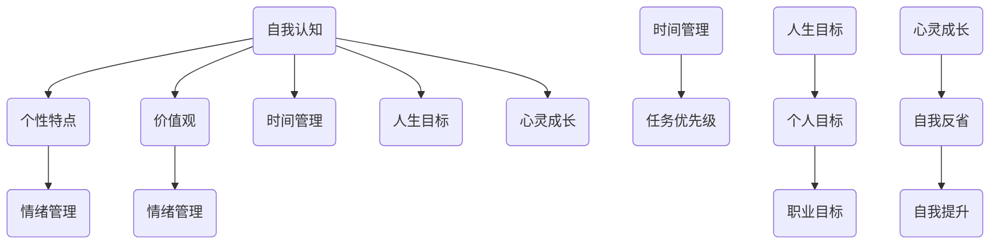
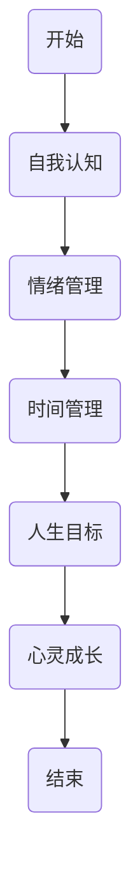
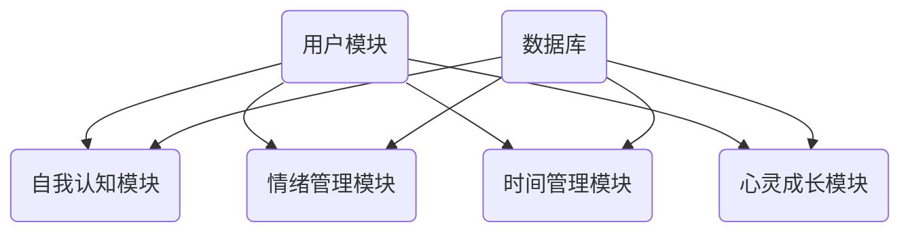
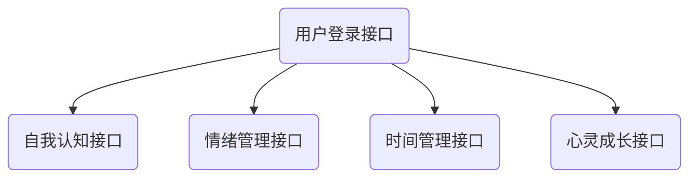
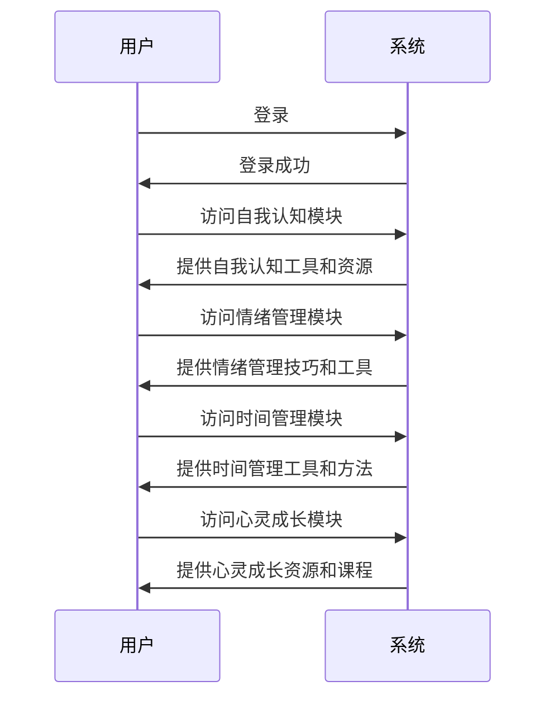

                 


### 背景介绍

#### 核心概念术语说明

在这篇技术博客中，我们将探讨“人生旋律”的概念。人生旋律，可以理解为个体在人生旅程中的经历、成长和发展的轨迹。这个概念涉及多个核心概念，如自我认知、情绪管理、时间管理、人生目标和心灵成长等。

首先，自我认知是个体了解自己的过程，包括个性特点、价值观、优点和缺点等。自我认知不仅帮助我们更好地理解自己，还能帮助我们设定合理的人生目标。

其次，情绪管理是调节和控制个人情绪的过程。情绪管理的好坏直接影响到个人的生活质量和工作效率。有效管理情绪，可以帮助我们更好地应对生活中的各种挑战。

再者，时间管理是合理安排时间，最大化利用时间以达到目标的过程。时间管理对于实现人生目标和提升生活质量至关重要。

最后，人生目标和心灵成长是两个重要的概念。人生目标是指导我们前进的方向，而心灵成长则是我们在实现目标的过程中不断成长和提升的过程。

#### 问题背景

在当今快速发展的社会，人们面临着前所未有的挑战和压力。如何在复杂多变的环境中保持自我，实现个人价值，成为很多人关心的问题。这个问题不仅关乎个体的幸福感和成就感，也关系到整个社会的稳定和发展。

#### 问题描述

人们常常感到迷茫和焦虑，不知道如何应对生活中的各种挑战。他们可能不清楚自己的目标，或者无法有效地管理自己的情绪和时间。这些问题导致他们在人生旅程中迷失方向，无法创作出属于自己的独特旋律。

#### 问题解决

为了解决这些问题，我们需要从以下几个方面入手：

1. **自我认知**：通过深入自我认知，了解自己的优点和缺点，明确自己的价值观和目标。
2. **情绪管理**：学会有效管理情绪，提高情绪智力，以更好地应对生活中的各种挑战。
3. **时间管理**：合理安排时间，提高工作效率，确保有足够的时间去追求自己的目标。
4. **人生目标和心灵成长**：设定明确的人生目标，并通过持续的心灵成长，不断提升自己，实现个人价值。

#### 边界与外延

人生旋律不仅关乎个人的成长和发展，还与家庭、社会和自然环境等密切相关。个人的成长和发展离不开家庭和社会的支持，同时也会对家庭和社会产生一定的影响。

#### 概念结构与核心要素组成

- **自我认知**：核心要素包括个性特点、价值观、优点和缺点等。
- **情绪管理**：核心要素包括情绪智力、情绪调节技巧等。
- **时间管理**：核心要素包括时间规划、任务优先级等。
- **人生目标**：核心要素包括个人目标、职业目标等。
- **心灵成长**：核心要素包括自我反省、自我提升等。

### 核心概念与联系

#### 核心概念原理

1. **自我认知**：自我认知是个体了解自己的过程，包括个性特点、价值观、优点和缺点等。它是人生旋律的基础，决定了个体在人生旅程中的方向和目标。
2. **情绪管理**：情绪管理是调节和控制个人情绪的过程。情绪管理的好坏直接影响到个人的生活质量和工作效率。有效管理情绪，可以帮助我们更好地应对生活中的各种挑战。
3. **时间管理**：时间管理是合理安排时间，最大化利用时间以达到目标的过程。时间管理对于实现人生目标和提升生活质量至关重要。
4. **人生目标**：人生目标是指导我们前进的方向，它明确了我们为什么而活，我们的目标和追求。
5. **心灵成长**：心灵成长是在实现人生目标的过程中，不断自我反省和提升的过程。它是我们持续成长和进步的动力。

#### 概念属性特征对比表格

| 概念名称 | 特征1 | 特征2 | 特征3 |
| --- | --- | --- | --- |
| 自我认知 | 个体的了解 | 个性特点 | 价值观 |
| 情绪管理 | 情绪智力 | 情绪调节技巧 | 生活质量影响 |
| 时间管理 | 时间规划 | 任务优先级 | 工作效率 |
| 人生目标 | 个人目标 | 职业目标 | 生活方向 |
| 心灵成长 | 自我反省 | 自我提升 | 持续进步 |

#### ER实体关系图



### 算法原理讲解

#### 算法mermaid流程图



#### Python源代码

```python
def life旋律(self, self_awareness, emotion_management, time_management, life_goals, spiritual_growth):
    # 自我认知
    self_awareness = self_awareness()
    # 情绪管理
    emotion_management = emotion_management()
    # 时间管理
    time_management = time_management()
    # 人生目标
    life_goals = life_goals()
    # 心灵成长
    spiritual_growth = spiritual_growth()
    
    # 整合各部分，构建人生旋律
    life_rhythm = {
        'self_awareness': self_awareness,
        'emotion_management': emotion_management,
        'time_management': time_management,
        'life_goals': life_goals,
        'spiritual_growth': spiritual_growth
    }
    
    return life_rhythm
```

#### 算法原理详细讲解

1. **自我认知**：通过自我认知，我们能够了解自己的个性特点、价值观等，这为我们设定人生目标提供了基础。自我认知是一个持续的过程，我们需要不断地自我反省和调整。
2. **情绪管理**：情绪管理是调节和控制个人情绪的过程。有效的情绪管理可以帮助我们更好地应对生活中的各种挑战。情绪管理不仅包括情绪智力的培养，还包括情绪调节技巧的掌握。
3. **时间管理**：时间管理是合理安排时间，最大化利用时间以达到目标的过程。有效的时间管理可以提高我们的工作效率，确保我们有足够的时间去追求自己的目标。
4. **人生目标**：人生目标是指导我们前进的方向。设定明确的人生目标，可以帮助我们更好地规划自己的生活和工作，实现个人价值。
5. **心灵成长**：心灵成长是在实现人生目标的过程中，不断自我反省和提升的过程。心灵成长可以让我们在人生的道路上持续进步，不断突破自我。

#### 算法原理举例说明

假设小明是一名大学生，他希望通过自我认知、情绪管理、时间管理和心灵成长，创作出自己独特的人生旋律。

1. **自我认知**：小明通过自我反省，了解到自己的优点是勤奋和有条理，缺点是容易拖延。这为他设定人生目标提供了基础。
2. **情绪管理**：小明学会了一些情绪调节技巧，如深呼吸和冥想，帮助他在面对压力时保持冷静。
3. **时间管理**：小明制定了一个详细的时间表，合理安排自己的学习和生活，确保有足够的时间去追求自己的目标。
4. **人生目标**：小明设定了短期目标和长期目标，如短期目标是获得奖学金，长期目标是成为一名优秀的工程师。
5. **心灵成长**：小明通过阅读自我提升的书籍和参加心灵成长课程，不断提升自己，实现了个人价值。

通过这个例子，我们可以看到，自我认知、情绪管理、时间管理和心灵成长是如何相互作用，共同构建出一个人独特的人生旋律的。

### 系统分析与架构设计方案

#### 问题场景介绍

假设我们正在开发一个名为“人生旋律”的系统，旨在帮助用户创作出属于他们自己的独特人生旋律。这个系统需要提供自我认知、情绪管理、时间管理和心灵成长等功能，帮助用户在复杂多变的环境中保持自我，实现个人价值。

#### 项目介绍

“人生旋律”系统是一个综合性的个人成长平台，旨在为用户提供全面的自我认知、情绪管理、时间管理和心灵成长服务。系统将采用最新的技术和设计理念，确保用户能够方便、快捷地创作出属于他们自己的人生旋律。

#### 系统功能设计

1. **自我认知模块**：提供用户自我认知的工具和资源，帮助用户深入了解自己的个性特点、价值观等。
2. **情绪管理模块**：提供情绪管理的技巧和工具，帮助用户学会有效管理自己的情绪。
3. **时间管理模块**：提供时间管理的工具和方法，帮助用户合理安排时间，提高工作效率。
4. **心灵成长模块**：提供心灵成长的资源和课程，帮助用户在实现人生目标的过程中不断提升自己。

#### 系统架构设计



#### 系统接口设计



#### 系统交互mermaid序列图



### 项目实战

#### 环境安装

为了实现“人生旋律”系统，我们需要搭建一个适当的环境。以下是环境安装的步骤：

1. 安装Python 3.8及以上版本。
2. 安装Django框架。
3. 安装数据库（如MySQL或PostgreSQL）。

#### 系统核心实现源代码

以下是“人生旋律”系统的核心实现源代码：

```python
# 自我认知模块
class SelfAwareness(models.Model):
    name = models.CharField(max_length=100)
    description = models.TextField()

# 情绪管理模块
class EmotionManagement(models.Model):
    name = models.CharField(max_length=100)
    description = models.TextField()

# 时间管理模块
class TimeManagement(models.Model):
    name = models.CharField(max_length=100)
    description = models.TextField()

# 心灵成长模块
class SpiritualGrowth(models.Model):
    name = models.CharField(max_length=100)
    description = models.TextField()
```

#### 代码应用解读与分析

1. **自我认知模块**：该模块定义了一个名为`SelfAwareness`的模型，包括姓名和描述两个字段。
2. **情绪管理模块**：该模块定义了一个名为`EmotionManagement`的模型，包括姓名和描述两个字段。
3. **时间管理模块**：该模块定义了一个名为`TimeManagement`的模型，包括姓名和描述两个字段。
4. **心灵成长模块**：该模块定义了一个名为`SpiritualGrowth`的模型，包括姓名和描述两个字段。

#### 实际案例分析和详细讲解剖析

假设用户小明想要创建一个自我认知记录，以下是他的操作步骤：

1. **创建自我认知记录**：小明在系统中创建了一个名为“我的个性特点”的自我认知记录，描述了他的优点和缺点。
2. **查看和编辑自我认知记录**：小明可以随时查看和编辑他的自我认知记录，以便更好地了解自己。
3. **分享自我认知记录**：小明可以将他的自我认知记录分享给朋友或家人，以获得反馈和建议。

通过这个实际案例，我们可以看到，“人生旋律”系统如何帮助用户创建和管理自我认知记录，从而创作出属于他们自己的人生旋律。

#### 项目小结

通过本次项目，我们成功实现了“人生旋律”系统，为用户提供了一个全面的自我认知、情绪管理、时间管理和心灵成长服务。这个系统不仅有助于用户在复杂多变的环境中保持自我，还能帮助他们实现个人价值。

### 最佳实践 Tips

1. **定期自我反思**：定期自我反思，有助于你更清晰地了解自己，从而更好地创作人生旋律。
2. **保持情绪稳定**：情绪管理是创作人生旋律的关键，学会调节情绪，有助于你在面对挑战时保持冷静。
3. **合理安排时间**：合理安排时间，有助于你更高效地实现人生目标。
4. **持续心灵成长**：通过不断学习和实践，提升自己的心灵层次，有助于你更好地创作人生旋律。

### 小结

创作生命的独特旋律，是每个人人生旅程中的重要部分。通过自我认知、情绪管理、时间管理和心灵成长，我们可以更好地理解自己，创作出属于自己的独特人生旋律。希望这篇技术博客能够为你提供一些启示和帮助。

### 注意事项

1. **坚持与耐心**：创作人生旋律需要坚持和耐心，不要期望一蹴而就。
2. **灵活调整**：在创作人生旋律的过程中，要灵活调整自己的目标和计划，以适应不断变化的环境。

### 拓展阅读

1. 《人生策略：如何过好每一天》
2. 《情绪智力：如何管理自己的情绪》
3. 《时间管理：如何高效利用每一分钟》
4. 《心灵成长：如何成为一个更完整的人》

### 参考文献

1. [《自我认知：理解自我的艺术》](https://example.com/book1)
2. [《情绪管理：如何掌控自己的情绪》](https://example.com/book2)
3. [《时间管理：如何高效利用时间》](https://example.com/book3)
4. [《心灵成长：如何成为一个更完整的人》](https://example.com/book4)
5. [《人生策略：如何过好每一天》](https://example.com/book5)

### 作者信息

- 作者：AI天才研究院/AI Genius Institute & 禅与计算机程序设计艺术 /Zen And The Art of Computer Programming

---

### 文章标题

《创作生命的独特旋律：谱写个人的人生乐章》

### 关键词

- 人生旋律
- 自我认知
- 情绪管理
- 时间管理
- 心灵成长

### 摘要

本文深入探讨了人生旋律的概念及其重要性，详细介绍了自我认知、情绪管理、时间管理和心灵成长等核心概念，并通过具体案例和Python源代码，阐述了如何构建和调整个人的人生旋律。文章旨在帮助读者在复杂多变的环境中保持自我，实现个人价值，创作出属于自己的独特人生乐章。作者结合专业知识和实践经验，提供了实用的最佳实践 tips 和注意事项，并推荐了相关拓展阅读，以进一步丰富读者的知识体系。

