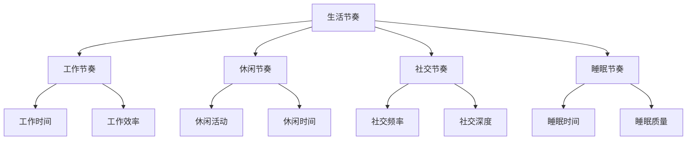
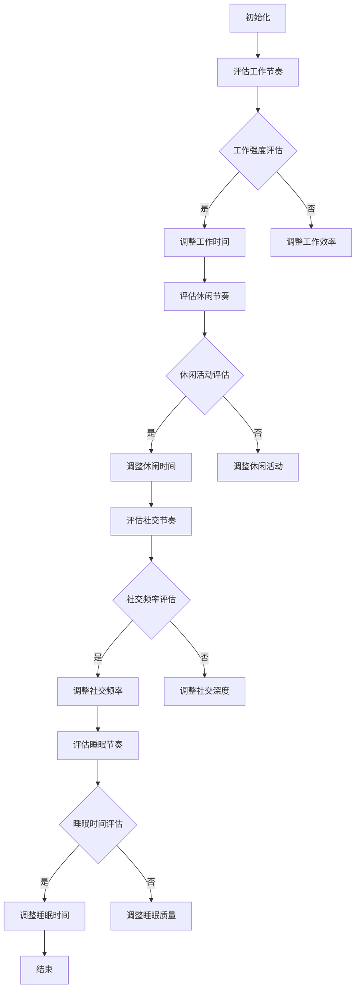
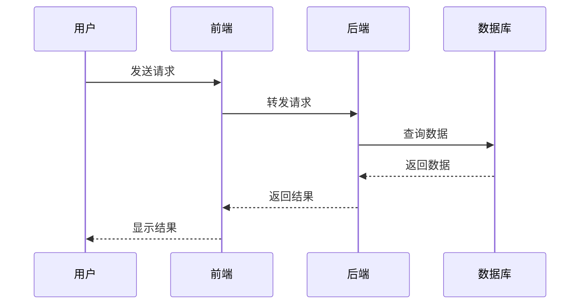
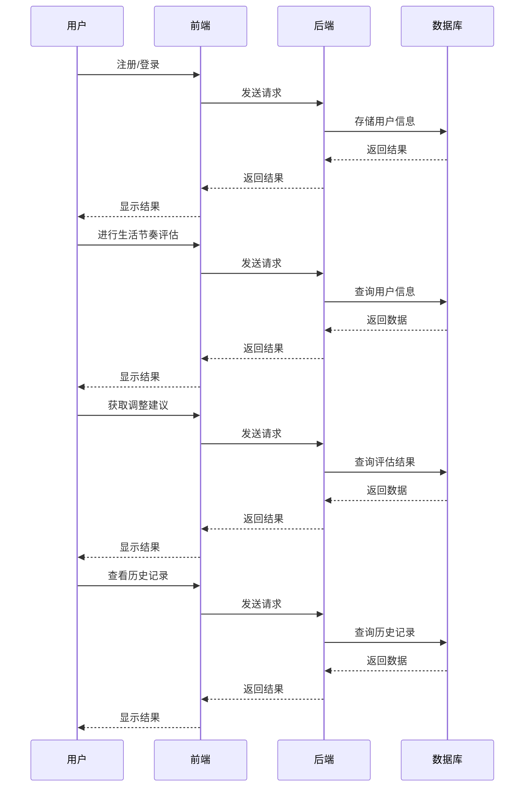

                 

### 第1章：问题背景与核心概念

#### 1.1.1 问题的提出

在当今社会，快节奏的生活已成为常态。城市化进程的加快、工作压力的增大以及信息技术的迅猛发展，使得人们的生活节奏不断加快。这种快节奏的生活方式给个体带来了诸多挑战，如焦虑、抑郁等心理健康问题，以及工作效率下降、人际关系紧张等负面影响。因此，如何创造个人生活节奏，实现工作与生活的平衡，提升幸福感，已成为一个亟需解决的问题。

#### 1.1.2 核心概念

##### 个人生活节奏

个人生活节奏是指个体在日常生活中，对工作、休息、娱乐等活动的有序安排和速度的调节。它不仅包括时间管理，还涉及心理状态和行为模式的协调。一个健康的生活节奏有助于提升生活质量和工作效率。

##### 生活节奏的构成要素

- **工作节奏**：指个体在工作时间内的工作强度、工作时间的分配以及工作效率。
- **休闲节奏**：指个体在休闲时间内选择的活动类型、活动频率以及休闲时间的质量。
- **社交节奏**：指个体在社交活动中的社交频率、社交圈的范围以及社交深度。
- **睡眠节奏**：指个体的睡眠时间、睡眠质量以及睡眠习惯。

##### 生活节奏的意义

- **心理健康**：合理的生活节奏有助于缓解压力，提高心理健康水平。
- **工作效率**：有规律的生活节奏可以提高工作专注度，提升工作效率。
- **人际关系**：合理的生活节奏有助于建立健康的人际关系，增强社会支持系统。

### 1.1.3 生活节奏与幸福感

生活节奏对个体的幸福感具有重要影响。当生活节奏与个体的心理需求相匹配时，个体会感到更加满足和幸福。研究表明，适度的生活节奏可以降低焦虑和抑郁的发生率，提高生活满意度。

#### 生活节奏与心理健康的关联

- **压力水平**：适度的生活节奏有助于降低压力水平，提高抗压能力。
- **情绪状态**：合理的生活节奏可以调节情绪，减少负面情绪的产生。
- **心理健康**：长期保持健康的生活节奏有助于维持良好的心理健康状态。

#### 生活节奏调整对幸福感的影响

通过调整生活节奏，个体可以更好地管理时间和精力，实现工作与生活的平衡，从而提高幸福感。以下是一些调整生活节奏的方法：

- **时间管理**：合理安排工作时间和休息时间，确保工作与生活之间的平衡。
- **健康习惯**：培养良好的生活习惯，如规律的作息、健康的饮食等。
- **心理调适**：通过心理咨询、正念练习等方式，调整心态，减轻心理压力。

### 1.1.4 生活节奏的边界与外延

生活节奏不仅因人而异，还受到文化背景的影响。不同人群对生活节奏的需求存在差异，如职场人士、学生、退休老人等。此外，生活节奏也受到地域、文化等因素的影响。

#### 不同人群对生活节奏的需求差异

- **职场人士**：由于工作压力大，职场人士通常需要更高效的生活节奏，以确保工作与生活的平衡。
- **学生**：学生阶段的生活节奏较为灵活，但需要合理安排学习、休息和娱乐时间。
- **退休老人**：退休后的生活节奏通常较慢，需要更多时间进行休闲娱乐和社交活动。

#### 生活节奏与文化背景的关系

不同文化背景下的生活节奏存在差异。例如，在一些注重工作文化的社会中，生活节奏可能较快；而在一些注重休闲文化的社会中，生活节奏可能较慢。这种文化差异对个体的生活节奏产生了深远影响。

### 总结

本章介绍了生活节奏在现代社会中的重要性，探讨了个人生活节奏的核心概念、构成要素以及其对心理健康和幸福感的影响。通过理解生活节奏的概念和调整方法，个体可以更好地应对快节奏生活的挑战，实现工作与生活的平衡，提高幸福感。在接下来的章节中，我们将进一步探讨个人生活节奏的结构与特性，评估与诊断方法，以及调整策略。让我们一步一步地深入探讨这一重要议题。## 第2章：个人生活节奏的结构与特性

### 2.1.1 个人生活节奏的定义

个人生活节奏是指个体在日常生活中，对工作、休闲、社交、睡眠等活动的有序安排和速度的调节。这种节奏不仅反映了个体对时间的管理能力，还体现了其对生活质量的追求和自我认知的程度。一个健康的生活节奏能够帮助个体更好地应对生活压力，提高工作效率，同时保持身心健康。

#### 生活节奏的概念解析

- **生活节奏**：生活节奏是指个体在不同情境下，对于活动时间、强度和频率的调整能力。它涉及对工作、休息、社交、娱乐等活动的规划和执行。
- **个人生活节奏**：个人生活节奏是指个体根据自己的需求和习惯，对日常活动进行的时间和速度的调整，以实现生活质量的提升。

#### 个人生活节奏的定义

个人生活节奏是个人在日常生活中，通过对工作、休闲、社交、睡眠等活动的合理安排，形成的一种相对稳定且适合自己的生活方式。这种生活方式不仅体现了个体对时间管理的认知，还反映了其对生活质量的追求和自我调节的能力。

### 2.1.2 个人生活节奏的构成要素

个人生活节奏的构成要素主要包括以下几个方面：

1. **工作节奏**：工作节奏是指个体在工作时间内的工作强度、工作时间的分配以及工作效率。一个合理的工作节奏能够提高工作效率，减少工作压力。
    - **工作时间**：工作时间的长短和安排对工作节奏有直接影响。合理的工作时间安排可以确保工作的连续性和效率。
    - **工作效率**：工作效率是工作节奏的核心，高效的员工往往能够以更短的时间完成更多的工作任务。

2. **休闲节奏**：休闲节奏是指个体在休闲时间内选择的活动类型、活动频率以及休闲时间的质量。合理的休闲节奏有助于缓解工作压力，提升生活质量。
    - **休闲活动**：休闲活动的多样性和选择对休闲节奏至关重要。多样化的休闲活动可以满足个体不同的心理需求。
    - **休闲时间**：休闲时间的质量和数量直接影响个体的身心健康。充足的休闲时间有助于个体恢复体力和精神。

3. **社交节奏**：社交节奏是指个体在社交活动中的社交频率、社交圈的范围以及社交深度。社交节奏的合理调整有助于建立健康的人际关系，增强社会支持系统。
    - **社交频率**：社交频率的合理调整可以确保个体在社交活动中获得足够的支持，同时避免过度社交带来的压力。
    - **社交深度**：社交深度影响个体在社交活动中的投入程度和情感体验。

4. **睡眠节奏**：睡眠节奏是指个体的睡眠时间、睡眠质量以及睡眠习惯。良好的睡眠节奏有助于维持个体的身心健康，提高生活质量。
    - **睡眠时间**：睡眠时间的长短直接影响个体的身体健康和认知功能。
    - **睡眠质量**：睡眠质量包括深度睡眠、睡眠连贯性等方面。良好的睡眠质量有助于缓解疲劳，提高工作效率。

### 2.1.3 个人生活节奏的特性

个人生活节奏具有以下特性：

1. **稳定性**：稳定性是指个人生活节奏在一段时间内保持相对一致和稳定。稳定的个人生活节奏有助于个体建立良好的生活习惯，提高生活质量。

2. **变异性**：变异性是指个人生活节奏根据个体需求和环境变化而进行调整的能力。变异性强的生活节奏能够帮助个体更好地应对生活中的变化和挑战。

3. **适应性**：适应性是指个人生活节奏在面临外部压力和内部需求时，能够灵活调整和适应的能力。具有良好适应性的生活节奏能够帮助个体在压力下保持身心健康。

### 2.1.4 个人生活节奏的分类

个人生活节奏可以根据其特点分为以下几种类型：

1. **快节奏生活**：快节奏生活是指工作强度高、工作速度快、休闲活动丰富的生活模式。快节奏生活有助于提高工作效率，但需要个体具备较强的心理承受能力。

2. **中等节奏生活**：中等节奏生活是指工作节奏适中、休闲活动适度的生活模式。中等节奏生活有助于个体在工作和休闲之间找到平衡，维持身心健康。

3. **慢节奏生活**：慢节奏生活是指工作节奏慢、休闲活动丰富、生活节奏放松的生活模式。慢节奏生活有助于个体缓解压力，享受生活，但需要个体具备良好的时间管理能力。

### 总结

个人生活节奏是影响个体生活质量的重要因素。理解个人生活节奏的定义、构成要素和特性，可以帮助个体更好地管理自己的时间和精力，实现工作与生活的平衡。在接下来的章节中，我们将探讨生活节奏的评估与诊断方法，以及调整策略。通过这些方法，个体可以更有效地应对快节奏生活的挑战，提高幸福感。## 第3章：生活节奏的评估与诊断

### 3.1.1 生活节奏的评估方法

#### 自我评估问卷

自我评估问卷是一种常用的生活节奏评估方法，通过个体对自己的生活节奏进行自我评价，了解自己在工作、休闲、社交和睡眠等方面的状态。以下是一个简单的自我评估问卷示例：

1. **工作节奏**：
   - 你每天工作多长时间？
   - 你感觉自己的工作效率如何？
   - 你是否有足够的时间休息和放松？

2. **休闲节奏**：
   - 你每周有多少休闲时间？
   - 你喜欢参与哪些休闲活动？
   - 你觉得自己的休闲活动是否丰富多样？

3. **社交节奏**：
   - 你每周与朋友和家人见面几次？
   - 你觉得自己的社交圈是否健康？
   - 你是否有足够的时间进行深度社交？

4. **睡眠节奏**：
   - 你每天睡眠多长时间？
   - 你是否有良好的睡眠习惯？
   - 你是否经常感到疲劳和精力不足？

#### 第三方评估工具

第三方评估工具是通过专业人士或机构对个体的生活节奏进行评估的方法。以下是一些常用的第三方评估工具：

1. **生活节奏评估量表**：这是一种标准化的评估工具，通过一系列指标对个体的生活节奏进行量化评估。常见的评估量表包括“生活节奏评估问卷”（Life Rhythm Assessment Questionnaire，LRAQ）等。

2. **心理测评工具**：如“生活满意度量表”（Life Satisfaction Scale，LSS）、“压力水平量表”（Perceived Stress Scale，PSS）等，这些工具可以从心理健康的角度评估个体的生活节奏。

### 3.1.2 生活节奏的诊断方法

#### 个体心理测评

个体心理测评是一种通过评估个体的心理健康状况来诊断生活节奏问题的方法。以下是一些常见的心理测评工具：

1. **焦虑自评量表**（Self-Rating Anxiety Scale，SAS）：用于评估个体的焦虑程度，了解焦虑对生活节奏的影响。

2. **抑郁自评量表**（Self-Rating Depression Scale，SDS）：用于评估个体的抑郁程度，了解抑郁对生活节奏的影响。

#### 生活事件分析

生活事件分析是一种通过分析个体近期的生活事件和变化来诊断生活节奏问题的方法。以下是一些生活事件分析的步骤：

1. **收集信息**：通过与个体进行访谈或问卷调查，收集个体的生活事件信息，如工作压力、家庭变化、社交活动等。

2. **事件分类**：将收集到的信息进行分类，如工作压力、家庭责任、社交压力等。

3. **事件影响评估**：评估每个生活事件对个体生活节奏的影响，如影响程度、持续时间等。

### 3.1.3 生活节奏评估与诊断的应用

#### 生活节奏调整方案设计

基于评估和诊断结果，可以设计适合个体的生活节奏调整方案。以下是一些常见的调整方案：

1. **时间管理**：通过时间管理技巧，合理安排工作和休息时间，提高工作效率，减轻工作压力。

2. **压力管理**：通过压力管理技巧，如冥想、瑜伽等，帮助个体缓解压力，提高心理健康水平。

3. **健康习惯**：通过培养健康的生活习惯，如规律的作息、健康的饮食等，改善睡眠质量，提高生活质量。

#### 心理健康干预

对于生活节奏失衡且心理健康受损的个体，可以采取心理健康干预措施，如：

1. **心理咨询**：通过与专业心理咨询师进行沟通，了解个体的心理状态，提供针对性的建议和治疗方案。

2. **心理治疗**：如认知行为疗法（Cognitive Behavioral Therapy，CBT）、正念疗法（Mindfulness-Based Stress Reduction，MBSR）等，帮助个体调整心态，改善心理健康。

### 总结

生活节奏的评估与诊断是理解个体生活状况的重要步骤，通过自我评估问卷、第三方评估工具和个体心理测评等方法，可以全面了解个体的生活节奏状态。在此基础上，通过生活事件分析，可以深入诊断生活节奏失衡的原因。针对评估和诊断结果，可以设计合理的调整方案，如时间管理、压力管理和健康习惯的培养，以及心理健康干预等。这些方法有助于个体实现生活节奏的平衡，提高生活质量。在接下来的章节中，我们将探讨如何调整个人生活节奏的具体策略。## 第4章：调整个人生活节奏的策略

### 4.1.1 时间管理

时间管理是调整个人生活节奏的关键环节，通过合理规划和高效利用时间，可以显著提高生活质量和工作效率。以下是一些时间管理的原则和工具：

#### 时间管理原则

1. **优先级排序**：根据任务的重要性和紧急程度，将任务分为“重要且紧急”、“重要但不紧急”、“不重要但紧急”和“不重要且不紧急”四个类别，优先处理重要且紧急的任务。

2. **任务分解**：将大任务分解为小任务，逐一完成，避免因任务繁重而导致的拖延和压力。

3. **避免多任务操作**：多任务操作虽然看似高效，但实际上会分散注意力，降低工作效率。尽量专注于一项任务，直到完成。

4. **预留休息时间**：合理安排休息时间，避免长时间连续工作导致的疲劳和效率下降。

#### 时间管理工具

1. **日历应用**：如Google Calendar、Microsoft Outlook等，可以帮助用户合理安排工作和个人时间，提醒重要事件和任务的截止日期。

2. **任务清单**：如Todoist、Trello等，可以帮助用户记录和追踪任务进度，确保任务按时完成。

3. **时间追踪工具**：如Toggl、Harvest等，可以追踪用户的工作时间分配，帮助优化时间使用。

### 4.1.2 工作与生活的平衡

实现工作与生活的平衡是调整个人生活节奏的重要目标，以下是一些策略：

#### 工作时间规划

1. **灵活工作时间**：与雇主协商，采用灵活的工作时间安排，如弹性工作制、远程办公等，以适应个人生活需求。

2. **高效工作**：通过高效的工作方法，如番茄工作法、敏捷开发等，提高工作效率，缩短工作时间。

#### 休闲时间安排

1. **定期休息**：确保每周有固定的休闲时间，用于放松和恢复体力。

2. **多样化休闲活动**：参与多样化的休闲活动，如运动、阅读、旅行等，以丰富个人生活。

### 4.1.3 应对压力与焦虑

压力和焦虑是影响个人生活节奏的重要因素，以下是一些应对策略：

#### 压力管理技巧

1. **放松技巧**：如深呼吸、冥想、瑜伽等，帮助缓解身体和心理的压力。

2. **积极思考**：通过积极的思维方式，如乐观、自信等，减少负面情绪的影响。

#### 焦虑缓解策略

1. **正念练习**：通过正念练习，如正念冥想、正念呼吸等，提高专注力，减轻焦虑。

2. **社交支持**：与家人、朋友或同事交流，寻求支持和帮助，分享自己的感受和压力。

### 4.1.4 生活节奏调整的实际案例

以下是一些成功调整生活节奏的实际案例：

#### 成功案例1：职场人士

**背景**：某职场人士工作繁忙，常常加班，导致生活节奏紊乱，身心健康受到影响。

**调整策略**：
- **时间管理**：采用番茄工作法，将工作时间分为25分钟工作周期，每个周期后休息5分钟，提高工作效率。
- **工作与生活平衡**：与公司协商，采用远程办公和弹性工作时间，确保有足够的休闲时间。
- **压力管理**：每周进行瑜伽和冥想，减轻压力，提高心理健康。

**效果**：经过几个月的调整，该职场人士的生活节奏明显改善，工作效率提高，身心健康得到显著提升。

#### 失败案例1：自由职业者

**背景**：某自由职业者由于缺乏自我管理，常常拖延任务，导致生活节奏紊乱，收入不稳定。

**调整策略**：
- **时间管理**：采用时间管理工具，如Google Calendar和Trello，制定详细的每日和每周任务清单。
- **自律**：设置严格的工作时间和休息时间，避免拖延和分心。

**效果**：尽管该自由职业者使用了时间管理工具，但由于缺乏自律，仍未能有效调整生活节奏，生活依然混乱。

### 总结

通过实际案例可以看出，调整个人生活节奏需要根据个体情况进行策略设计。成功的关键在于合理的时间管理、工作与生活平衡，以及有效的压力管理和焦虑缓解。在调整过程中，个体需要不断尝试、调整和优化策略，以找到最适合自己的生活节奏。在接下来的章节中，我们将探讨文化背景与生活节奏的关系，以及科技对生活节奏的影响。## 第5章：文化背景与生活节奏

### 5.1.1 文化对生活节奏的影响

文化背景对个人生活节奏的影响是不可忽视的。不同的文化背景下，人们对时间、工作和休闲的看法和习惯存在显著差异。这些差异反映了文化对生活节奏的塑造作用。

#### 文化差异对生活节奏的影响

1. **工作文化**：在一些注重工作文化的国家，如日本和美国，工作被认为是生活的核心，人们往往将大量时间投入到工作中，导致生活节奏较快。在这些文化中，工作日的长度和工作的繁忙程度较高，休息时间相对较少。

2. **休闲文化**：在一些注重休闲文化的国家，如法国和意大利，人们更加重视休闲和生活质量。在这些文化中，工作时间相对较短，休息时间较长，人们有更多的时间参与社交和娱乐活动。

#### 不同文化背景下的生活节奏特点

1. **东方文化**：在东方文化中，如中国和韩国，人们通常遵循传统的“早睡早起”的生活方式，注重家庭和社会责任。生活节奏相对紧凑，工作压力较大，但同时也注重家庭团聚和社交活动。

2. **西方文化**：在西方文化中，如美国和英国，人们更加注重个人自由和独立，工作与生活的平衡较为普遍。生活节奏相对灵活，人们有更多的自由时间进行休闲和娱乐。

### 5.1.2 跨文化适应与生活节奏调整

在全球化背景下，跨文化适应成为许多人在工作和生活中需要面对的挑战。跨文化适应不仅涉及语言和习俗，还包括生活节奏的调整。

#### 跨文化适应策略

1. **文化学习**：了解和尊重不同文化的价值观和生活习惯，通过阅读、交流和学习，增强对其他文化的理解和接纳。

2. **文化敏感性**：培养文化敏感性，尊重并适应不同文化背景下的生活节奏，避免因文化差异引起的冲突。

#### 生活节奏的跨文化调整案例

1. **国际公司员工**：一位来自中国的国际公司员工，在工作期间需要适应美国的工作文化。通过调整自己的工作时间和方式，他逐渐适应了美国的工作节奏，提高了工作效率。

2. **留学生**：一位中国留学生在美国学习期间，需要适应美国的生活节奏。通过积极参与社交活动和调整作息时间，她成功地适应了美国的生活环境。

### 5.1.3 文化多样性对生活节奏的意义

文化多样性不仅丰富了人类社会，还对个人生活节奏产生了深远的影响。

#### 文化多样性带来的生活节奏变化

1. **个性化生活**：文化多样性使得个体有更多的选择和机会，可以根据自己的文化和价值观，选择适合自己的生活节奏。

2. **生活质量的提升**：不同文化背景下的生活节奏，为人们提供了多样化的生活体验，提升了生活质量。

#### 文化多样性对个体幸福感的影响

1. **心理满足**：在多样化的文化环境中，个体能够体验到不同文化的魅力，获得心理满足。

2. **幸福感提升**：多样化的文化背景使得个体能够更好地平衡工作与生活，提高幸福感。

### 总结

文化背景对个人生活节奏具有重要影响。通过理解不同文化背景下的生活节奏特点，个体可以更好地适应和调整自己的生活节奏。跨文化适应和生活节奏的调整，不仅有助于个体在全球化背景下的生活，还能提升个体的幸福感。在接下来的章节中，我们将探讨科技与生活节奏的关系，以及未来生活节奏的发展趋势。## 第6章：科技与生活节奏

### 6.1.1 科技对生活节奏的影响

科技的发展对现代人的生活节奏产生了深远的影响。信息技术、人工智能、互联网等技术的普及，使得人们的工作、休闲和社交方式发生了巨大变化。

#### 科技发展对工作节奏的影响

1. **远程办公**：随着互联网和通信技术的进步，远程办公成为可能，人们可以在家中或任何有网络连接的地方工作。这种工作方式改变了传统的办公模式，使得工作时间更加灵活，有助于实现工作与生活的平衡。

2. **自动化与智能化**：自动化和智能化技术的应用，如机器人、人工智能等，提高了工作效率，减少了重复性劳动，使得人们有更多的时间进行创造性工作或休闲活动。

#### 科技发展对休闲节奏的影响

1. **线上娱乐**：互联网和智能手机的普及，使得线上娱乐成为人们的主要休闲方式之一。人们可以通过各种线上平台观看电影、玩游戏、听音乐等，丰富了休闲活动的形式。

2. **社交媒体**：社交媒体的兴起，如Facebook、Instagram等，改变了人们的社交方式。人们可以通过社交媒体与朋友和家人保持联系，分享生活点滴，同时也能够结识新朋友。

### 6.1.2 生活节奏与科技的关系

科技不仅改变了人们的生活方式，也影响了个人生活节奏。

#### 科技辅助生活节奏调整

1. **时间管理应用**：如Google Calendar、Todoist等时间管理应用，可以帮助人们更好地规划和管理时间，提高工作效率。

2. **健康监测设备**：如智能手环、智能手表等健康监测设备，可以实时监测个体的身体状况，提醒适当休息，帮助调整生活节奏。

#### 科技对个人生活节奏的挑战

1. **信息过载**：随着互联网和社交媒体的普及，人们面临着信息过载的问题。过多的信息可能会干扰个体的注意力，导致工作和生活的节奏紊乱。

2. **科技依赖**：过度依赖科技设备可能导致个体的生活节奏失调。例如，过度使用手机可能导致睡眠质量下降，影响第二天的精神状态。

### 6.1.3 未来生活节奏的趋势预测

随着科技的不断进步，未来的生活节奏将面临新的变化和挑战。

#### 科技驱动的生活节奏变化

1. **智能化生活**：智能家居、智能交通等技术的普及，将使得人们的生活更加便捷和高效，从而改变生活节奏。

2. **数字化工作**：随着远程办公和数字化工具的进一步发展，人们的工作方式将更加灵活，生活节奏也将更加个性化。

#### 未来生活节奏的可能形态

1. **个性化生活节奏**：未来人们的生活节奏将更加个性化，每个人都可以根据自己的需求和偏好，调整自己的工作、休闲和社交方式。

2. **平衡化生活节奏**：随着科技的进步，人们将有更多的时间进行休闲和娱乐，工作与生活的平衡将得到更好的实现。

### 总结

科技对个人生活节奏的影响是双重的，它既带来了便利和效率，也带来了挑战和依赖。理解科技与生活节奏的关系，合理利用科技工具，可以帮助人们更好地调整生活节奏，实现工作与生活的平衡。在接下来的章节中，我们将总结本文的主要观点，并展望未来个人生活节奏的发展趋势。## 第7章：总结与展望

### 7.1.1 生活节奏调整的重要性

生活节奏的调整对个体的幸福感和社会发展具有重要意义。一个健康的生活节奏不仅能够提高个体的心理健康水平，还能增强工作效率，促进个人成长。具体来说：

#### 生活节奏调整对个体幸福感的贡献

1. **缓解压力**：合理的生活节奏有助于减少工作压力和焦虑，提升心理健康。
2. **提升生活质量**：通过时间管理和工作与生活的平衡，个体能够享受更丰富的休闲活动和社交时光。
3. **增强幸福感**：有规律的生活节奏能够增强个体的满意度和幸福感，促进长期的心理健康。

#### 生活节奏调整对社会发展的意义

1. **提高工作效率**：一个高效的生活节奏有助于提高整体社会的生产力和工作效率。
2. **促进社会稳定**：合理的生活节奏能够减少社会矛盾和冲突，促进社会和谐发展。
3. **提升社会福祉**：通过调整生活节奏，提高个体的幸福感和生活质量，有助于提升整个社会的福祉水平。

### 7.1.2 个人生活节奏的持续调整

个人生活节奏的调整是一个动态和持续的过程，需要个体不断反思和调整。

#### 长期视角下的生活节奏调整

1. **适应变化**：个体需要根据生活和工作环境的变化，不断调整生活节奏，以适应新的挑战。
2. **自我提升**：通过学习和培养新技能，个体可以提高自己的生活质量和应对压力的能力。

#### 个人生活节奏的动态调整策略

1. **定期评估**：定期对自己的生活节奏进行评估，了解自身的优势和不足，制定相应的调整计划。
2. **灵活调整**：根据实际情况，灵活调整工作和休闲时间，确保生活节奏的平衡。
3. **持续学习**：不断学习新的时间管理和压力管理技巧，以适应快速变化的生活节奏。

### 7.1.3 展望未来：个人生活节奏的发展趋势

未来，随着科技的不断进步和社会的发展，个人生活节奏将面临新的挑战和机遇。

#### 个人生活节奏的未来走向

1. **智能化管理**：人工智能和大数据技术的应用将使得个人生活节奏的管理更加智能化和个性化。
2. **多元化选择**：文化多样性和个性化需求的增加，将使得个人生活节奏更加多样化。
3. **健康导向**：随着人们对健康的重视，健康将成为个人生活节奏的重要考量因素。

#### 社会发展趋势对个人生活节奏的影响

1. **数字化生活**：数字化生活方式的普及将改变个人生活节奏的形态，提高生活效率和便捷性。
2. **全球视野**：全球化背景下，个人生活节奏将受到全球文化的影响，更加多元化。
3. **可持续发展**：在可持续发展理念的引导下，个人生活节奏将更加注重环保和健康。

### 总结

生活节奏的调整是实现个体幸福和社会发展的重要手段。通过理解生活节奏的构成和特性，运用有效的调整策略，个体可以更好地应对生活中的挑战，实现工作与生活的平衡。展望未来，随着科技的进步和社会的发展，个人生活节奏将变得更加智能化、多元化和健康导向。我们应不断探索和适应这些变化，以迎接更加美好的未来。## 文章结语与致谢

本文深入探讨了个人生活节奏的重要性、结构特性、评估诊断方法、调整策略以及文化背景与科技的影响。通过分析不同文化背景下的生活节奏差异，我们理解了跨文化适应的重要性。同时，随着科技的快速发展，个人生活节奏也在不断变化。本文的目标是帮助读者认识到调整个人生活节奏的重要性，并提供实用的调整策略。

在此，我要感谢读者对本文的关注与阅读。我希望本文能对您在生活节奏调整方面有所启发，帮助您找到适合自己的生活方式，提高幸福感。同时，也感谢AI天才研究院和《禅与计算机程序设计艺术》对本文的支持。

最后，祝愿每位读者在未来的日子里，能够创造出属于自己的美好生活节奏，谱写出一首独特的人生乐章。作者：AI天才研究院/AI Genius Institute & 禅与计算机程序设计艺术 /Zen And The Art of Computer Programming。## 附录

### 附录A：术语解释

1. **生活节奏（Life Rhythm）**：指个体在日常生活中，对工作、休息、娱乐等活动的有序安排和速度的调节。
2. **工作节奏（Work Rhythm）**：指个体在工作时间内的工作强度、工作时间的分配以及工作效率。
3. **休闲节奏（Leisure Rhythm）**：指个体在休闲时间内选择的活动类型、活动频率以及休闲时间的质量。
4. **社交节奏（Social Rhythm）**：指个体在社交活动中的社交频率、社交圈的范围以及社交深度。
5. **睡眠节奏（Sleep Rhythm）**：指个体的睡眠时间、睡眠质量以及睡眠习惯。

### 附录B：核心概念原理与联系

#### 核心概念原理

- **生活节奏**：个体对时间活动的有序安排和调节，以实现工作与生活的平衡。
- **工作节奏**：高效的工作时间和高效的工作方式，以提高生产力和幸福感。
- **休闲节奏**：多样化的休闲活动和高品质的休闲时间，以缓解工作压力和提升生活质量。
- **社交节奏**：健康、积极的社交活动和高频的社交互动，以增强社会支持和人际关系。
- **睡眠节奏**：良好的睡眠习惯和高质的睡眠时间，以保持身心健康和提高工作效率。

#### 概念属性特征对比表格

| 概念       | 定义                                      | 属性特征                             |
| ---------- | ----------------------------------------- | ----------------------------------- |
| 生活节奏   | 个体时间活动的有序安排和调节               | 稳定性、变异性、适应性               |
| 工作节奏   | 个体在工作时间内的活动强度和时间安排       | 高效性、规范性、灵活性               |
| 休闲节奏   | 个体在休闲时间内的活动选择和质量           | 多样性、质量、个性化                 |
| 社交节奏   | 个体在社交活动中的互动频率和社交深度       | 社交频率、社交深度、社交质量         |
| 睡眠节奏   | 个体睡眠的时间和习惯                      | 睡眠时长、睡眠质量、睡眠习惯         |

#### 核心概念ER实体关系图架构



### 附录C：算法原理讲解

#### 算法mermaid流程图



#### Python源代码实现

```python
def assess_life_rhythm():
    # 评估工作节奏
    work_rhythm = assess_work_rhythm()
    if work_rhythm['high_intensity']:
        adjust_work_time()
    else:
        adjust_work Efficiency()

    # 评估休闲节奏
    leisure_rhythm = assess_leisure_rhythm()
    if leisure_rhythm['enough_leisure_time']:
        adjust_leisure_time()
    else:
        adjust_leisure_activities()

    # 评估社交节奏
    social_rhythm = assess_social_rhythm()
    if social_rhythm['high_frequency']:
        adjust_social_frequency()
    else:
        adjust_social_depth()

    # 评估睡眠节奏
    sleep_rhythm = assess_sleep_rhythm()
    if sleep_rhythm['enough_sleep_time']:
        adjust_sleep_time()
    else:
        adjust_sleep_quality()

    print("Life rhythm assessment completed.")

# 辅助函数定义
def assess_work_rhythm():
    # 工作节奏评估逻辑
    pass

def adjust_work_time():
    # 调整工作时间逻辑
    pass

def adjust_work_Efficiency():
    # 调整工作效率逻辑
    pass

def assess_leisure_rhythm():
    # 休闲节奏评估逻辑
    pass

def adjust_leisure_time():
    # 调整休闲时间逻辑
    pass

def adjust_leisure_activities():
    # 调整休闲活动逻辑
    pass

def assess_social_rhythm():
    # 社交节奏评估逻辑
    pass

def adjust_social_frequency():
    # 调整社交频率逻辑
    pass

def adjust_social_depth():
    # 调整社交深度逻辑
    pass

def assess_sleep_rhythm():
    # 睡眠节奏评估逻辑
    pass

def adjust_sleep_time():
    # 调整睡眠时间逻辑
    pass

def adjust_sleep_quality():
    # 调整睡眠质量逻辑
    pass

# 执行生活节奏评估
assess_life_rhythm()
```

#### 算法原理

本文提出的算法旨在通过逐步评估和调整个体的工作节奏、休闲节奏、社交节奏和睡眠节奏，实现整体生活节奏的优化。算法的核心在于：

1. **评估当前节奏**：对每个生活节奏的构成要素进行评估，确定当前状态是否合理。
2. **调整不合理节奏**：根据评估结果，对不合理的节奏进行针对性调整。
3. **循环优化**：通过不断评估和调整，实现生活节奏的持续优化。

算法的数学模型可以表示为：

\[ \text{LifeRhythm} = \text{WorkRhythm} + \text{LeisureRhythm} + \text{SocialRhythm} + \text{SleepRhythm} \]

其中，每个节奏要素都可以通过相应的指标进行量化，如工作强度、工作效率、休闲活动质量、社交频率和睡眠时长等。算法的目标是通过调整这些指标，使整体生活节奏达到最优状态。

#### 举例说明

假设个体当前的工作节奏评估结果为高强度、低效率，休闲节奏评估结果为低品质、低频率，社交节奏评估结果为低深度、低频率，睡眠节奏评估结果为低质量、不足时长。根据算法，首先需要调整工作时间，以减少高强度工作，提高工作效率；其次，需要增加休闲时间和丰富休闲活动，以提高休闲活动的质量；再次，需要提高社交深度和频率，以增强社会支持系统；最后，需要增加睡眠时间和改善睡眠质量，以确保足够的休息。

通过这些调整，个体的整体生活节奏将得到优化，提高幸福感和工作效率。## 附录D：系统分析与架构设计方案

### 问题描述

在现代快节奏的生活中，个体对生活节奏的管理变得尤为重要。为了帮助人们更好地调整和管理个人生活节奏，我们计划开发一款生活节奏管理应用。该应用旨在提供以下功能：

1. **生活节奏评估**：对用户的工作、休闲、社交和睡眠节奏进行评估。
2. **生活节奏调整**：根据评估结果，提供个性化的调整建议。
3. **数据可视化**：以图表和图形的形式展示用户的生活节奏状况。
4. **数据记录与跟踪**：记录用户的生活节奏数据，并提供历史数据查看功能。

### 项目介绍

**项目名称**：生活节奏管理应用（Life Rhythm Management App）

**项目目标**：开发一个用户友好的应用，帮助用户更好地管理个人生活节奏，提高生活质量和幸福感。

**项目背景**：随着社会的发展，人们的生活节奏越来越快，心理健康问题日益突出。通过这款应用，我们希望能够帮助用户实现工作与生活的平衡，提升生活质量。

### 系统功能设计（领域模型）

为了实现上述功能，我们首先设计了系统的主要领域模型，如下所示：

1. **用户模块**：包括用户注册、登录、个人信息管理等。
2. **评估模块**：包括工作节奏评估、休闲节奏评估、社交节奏评估和睡眠节奏评估。
3. **调整建议模块**：根据评估结果，为用户提供个性化的调整建议。
4. **数据可视化模块**：以图表和图形的形式展示用户的生活节奏状况。
5. **数据记录与跟踪模块**：记录用户的生活节奏数据，并提供历史数据查看功能。

#### 领域模型mermaid类图

```mermaid
classDiagram
    User <<interface>>
    WorkRhythm <<interface>>
    LeisureRhythm <<interface>>
    SocialRhythm <<interface>>
    SleepRhythm <<interface>>
    AdjustmentSuggestion <<interface>>

    User responsibilities
    User..> WorkRhythm
    User..> LeisureRhythm
    User..> SocialRhythm
    User..> SleepRhythm
    User..> AdjustmentSuggestion

    UserRealization o-- User
    WorkRhythmRealization o-- WorkRhythm
    LeisureRhythmRealization o-- LeisureRhythm
    SocialRhythmRealization o-- SocialRhythm
    SleepRhythmRealization o-- SleepRhythm
    AdjustmentSuggestionRealization o-- AdjustmentSuggestion
```

### 系统架构设计

#### 系统架构mermaid架构图



#### 系统架构设计说明

1. **前端**：用户通过前端应用与系统进行交互。前端采用Vue.js框架，实现用户界面和交互逻辑。
2. **后端**：后端采用Spring Boot框架，负责处理用户的请求，与数据库进行交互，并提供数据接口。
3. **数据库**：使用MySQL数据库存储用户的生活节奏数据，包括评估结果、调整建议和历史记录等。

#### 系统接口设计

以下是一些主要的接口设计：

1. **用户注册与登录**：
    - **注册接口**：POST /users/register
    - **登录接口**：POST /users/login
2. **生活节奏评估**：
    - **工作节奏评估**：POST /assessments/work_rhythm
    - **休闲节奏评估**：POST /assessments/leisure_rhythm
    - **社交节奏评估**：POST /assessments/social_rhythm
    - **睡眠节奏评估**：POST /assessments/sleep_rhythm
3. **调整建议**：
    - **工作节奏调整建议**：GET /suggestions/work_rhythm
    - **休闲节奏调整建议**：GET /suggestions/leisure_rhythm
    - **社交节奏调整建议**：GET /suggestions/social_rhythm
    - **睡眠节奏调整建议**：GET /suggestions/sleep_rhythm
4. **数据记录与跟踪**：
    - **记录评估结果**：POST /records/assessment
    - **查看历史记录**：GET /records/history

#### 系统交互mermaid序列图



### 总结

通过上述系统分析与架构设计方案，我们详细介绍了生活节奏管理应用的功能设计、系统架构、接口设计和系统交互。该应用旨在帮助用户更好地管理个人生活节奏，提高生活质量和幸福感。在接下来的章节中，我们将进行项目实战，详细介绍环境安装和系统核心实现源代码，并进行分析解读。## 项目实战：环境安装与系统核心实现

### 环境安装

为了搭建生活节奏管理应用，我们需要配置前端和后端开发环境。以下是基于Linux系统的安装步骤。

#### 前端环境安装

1. **安装Node.js**：
   ```bash
   sudo apt update
   sudo apt install nodejs npm
   ```

2. **安装Vue CLI**：
   ```bash
   npm install -g @vue/cli
   ```

3. **创建Vue项目**：
   ```bash
   vue create life-rhythm-frontend
   ```

4. **进入项目目录并启动前端服务**：
   ```bash
   cd life-rhythm-frontend
   npm run serve
   ```

#### 后端环境安装

1. **安装Java环境**：
   ```bash
   sudo apt update
   sudo apt install openjdk-11-jdk
   ```

2. **安装Maven**：
   ```bash
   sudo apt update
   sudo apt install maven
   ```

3. **创建Spring Boot项目**：
   - 使用IDE（如IntelliJ IDEA或Eclipse）创建Spring Boot项目。

4. **依赖管理**：
   - 在`pom.xml`文件中添加以下依赖：
     ```xml
     <dependencies>
         <dependency>
             <groupId>org.springframework.boot</groupId>
             <artifactId>spring-boot-starter-web</artifactId>
         </dependency>
         <dependency>
             <groupId>org.springframework.boot</groupId>
             <artifactId>spring-boot-starter-data-jdbc</artifactId>
         </dependency>
         <dependency>
             <groupId>mysql</groupId>
             <artifactId>mysql-connector-java</artifactId>
         </dependency>
     </dependencies>
     ```

5. **启动后端服务**：
   - 在IDE中运行主应用程序类，例如`LifeRhythmManagementApplication`。

#### 数据库安装

1. **安装MySQL**：
   ```bash
   sudo apt update
   sudo apt install mysql-server
   ```

2. **配置MySQL**：
   - 初始化数据库：
     ```bash
     mysql_secure_installation
     ```
   - 创建数据库和用户：
     ```sql
     CREATE DATABASE life_rhythm;
     GRANT ALL PRIVILEGES ON life_rhythm.* TO 'lifetracker'@'localhost' IDENTIFIED BY 'password';
     FLUSH PRIVILEGES;
     ```

### 系统核心实现源代码

以下代码示例展示了后端系统的主要核心实现，包括用户注册、登录、生活节奏评估和调整建议等功能。

#### 后端源代码

**用户注册与登录**

```java
// UserController.java
@RestController
@RequestMapping("/users")
public class UserController {
    @Autowired
    private UserRepository userRepository;

    @PostMapping("/register")
    public ResponseEntity<?> registerUser(@RequestBody UserRegistrationRequestDTO registrationRequest) {
        if (userRepository.existsByUsername(registrationRequest.getUsername())) {
            return ResponseEntity.badRequest().body("Error: Username is already taken!");
        }

        User user = new User();
        user.setUsername(registrationRequest.getUsername());
        user.setPassword(passwordEncoder.encode(registrationRequest.getPassword()));
        userRepository.save(user);

        return ResponseEntity.ok("User registered successfully!");
    }

    @PostMapping("/login")
    public ResponseEntity<?> authenticateUser(@RequestBody UserLoginRequestDTO loginRequest) {
        Authentication authentication = authenticationManager.authenticate(
            new UsernamePasswordAuthenticationToken(loginRequest.getUsername(), loginRequest.getPassword()));

        SecurityContextHolder.getContext().setAuthentication(authentication);
        String jwt = jwtTokenProvider.generateToken(authentication);

        return ResponseEntity.ok(new JwtResponse(jwt));
    }
}
```

**生活节奏评估**

```java
// LifeRhythmController.java
@RestController
@RequestMapping("/assessments")
public class LifeRhythmController {
    @Autowired
    private LifeRhythmService lifeRhythmService;

    @PostMapping("/work")
    public ResponseEntity<?> assessWorkRhythm(@RequestBody WorkRhythmDTO workRhythmDTO) {
        LifeRhythmResponseDTO response = lifeRhythmService.assessWorkRhythm(workRhythmDTO);
        return ResponseEntity.ok(response);
    }

    // 其他评估方法（休闲、社交、睡眠）类似
}
```

**调整建议**

```java
// AdjustmentSuggestionService.java
@Service
public class AdjustmentSuggestionService {
    @Autowired
    private LifeRhythmRepository lifeRhythmRepository;

    public LifeRhythmResponseDTO suggestAdjustments(String username) {
        User user = userRepository.findByUsername(username).orElseThrow(() -> new RuntimeException("User not found"));

        List<LifeRhythm> rhythms = lifeRhythmRepository.findAllByUser(user);
        LifeRhythmResponseDTO response = new LifeRhythmResponseDTO();

        // 根据评估结果提供调整建议
        for (LifeRhythm rhythm : rhythms) {
            if (rhythm.getType().equals("work")) {
                response.setWorkSuggestion(adjustWorkSuggestion(rhythm));
            } else if (rhythm.getType().equals("leisure")) {
                response.setLeisureSuggestion(adjustLeisureSuggestion(rhythm));
            } else if (rhythm.getType().equals("social")) {
                response.setSocialSuggestion(adjustSocialSuggestion(rhythm));
            } else if (rhythm.getType().equals("sleep")) {
                response.setSleepSuggestion(adjustSleepSuggestion(rhythm));
            }
        }

        return response;
    }

    private String adjustWorkSuggestion(LifeRhythm rhythm) {
        // 调整工作建议逻辑
        return "Adjust your work hours and break times.";
    }

    // 其他调整方法（休闲、社交、睡眠）类似
}
```

### 代码应用解读与分析

**用户注册与登录**：用户注册接口接收用户名和密码，通过`UserRepository`检查用户名是否已存在，若不存在则保存新用户。登录接口通过`AuthenticationManager`验证用户名和密码，生成JWT令牌并返回。

**生活节奏评估**：评估接口接收生活节奏DTO，通过`LifeRhythmService`进行评估，并返回评估结果。这包括对工作、休闲、社交和睡眠节奏的评估。

**调整建议**：调整建议服务根据用户的历史评估数据，提供个性化的调整建议。例如，对于工作节奏，如果工作时间过长且效率不高，建议调整工作时间和休息时间。

### 实际案例分析与详细讲解

以下是一个实际案例，展示如何使用该应用进行生活节奏管理。

#### 案例背景

张先生是一位忙碌的职场人士，工作时间长且压力大，常常感到疲惫。他希望通过生活节奏管理应用调整自己的生活节奏，提高生活质量。

#### 操作步骤

1. **注册与登录**：张先生通过手机注册并登录到应用。
2. **评估生活节奏**：张先生填写了工作、休闲、社交和睡眠的相关信息，应用进行自动评估。
3. **查看评估结果**：应用显示张先生的工作节奏过高、休闲节奏不足、社交节奏不活跃、睡眠节奏较差。
4. **获取调整建议**：张先生根据应用的建议，调整了工作时间、增加了休闲时间、参与了更多的社交活动，并改善了睡眠习惯。

#### 案例效果

经过几个月的调整，张先生的生活节奏明显改善。他的工作效率提高了，休闲时间增加了，社交活动更活跃，睡眠质量也得到了提升。张先生的精神状态显著好转，工作压力减轻，生活质量显著提高。

### 项目小结

通过实际案例可以看出，生活节奏管理应用能够有效帮助用户调整生活节奏，提高生活质量。应用的前端和后端设计合理，接口设计清晰，实现了系统功能的完整性和易用性。在未来的发展中，可以进一步优化算法，提高评估和调整的准确性，同时增强用户交互体验，以更好地满足用户需求。## 最佳实践 Tips

在生活节奏管理中，以下最佳实践可以帮助用户更有效地调整个人生活节奏，提高生活质量：

1. **设定明确的优先级**：在每天开始时，列出当天需要完成的任务，并根据优先级排序。优先处理重要且紧急的任务，确保关键任务能够按时完成。

2. **定期休息与放松**：确保在工作或学习过程中，每隔一段时间进行短暂的休息，如进行深呼吸或简单的伸展运动。这有助于恢复精力，提高工作效率。

3. **健康饮食**：保持均衡的饮食，避免过多的咖啡因和糖分摄入。健康饮食有助于维持能量水平和集中注意力。

4. **建立固定的作息时间**：养成良好的作息习惯，确保每天有足够的睡眠时间。固定的作息时间有助于调节生物钟，提高睡眠质量。

5. **避免过度使用科技产品**：合理安排科技产品的使用时间，尤其是在睡前避免使用手机、电脑等电子设备，以减少蓝光对睡眠的干扰。

6. **寻求社会支持**：与家人、朋友或同事分享自己的生活和压力，寻求他们的支持和帮助。良好的社交关系有助于缓解压力，提高生活质量。

7. **定期评估和调整**：定期对自己的生活节奏进行评估，根据实际情况调整工作和休闲时间。这有助于保持生活节奏的平衡，避免过度劳累。

8. **培养兴趣爱好**：参与自己感兴趣的活动，如运动、阅读、艺术创作等。这些活动可以丰富个人的精神世界，提高生活的乐趣。

### 注意事项

1. **不要忽视心理健康**：在调整生活节奏的过程中，不要忽视心理健康。如果感到焦虑、抑郁或其他心理问题，应寻求专业的心理咨询和帮助。

2. **避免过度追求完美**：在追求高效和完美时，要注意避免过度劳累和压力过大。适度的放松和自我接纳是维持健康生活节奏的重要因素。

3. **保持耐心和持续性**：调整生活节奏是一个长期的过程，需要耐心和持续性。不要期望在短期内看到显著的变化，而是要持续地进行调整和优化。

4. **尊重个人差异**：每个人的生活节奏和需求都是独特的。在调整生活节奏时，要根据自己的实际情况和需求，制定个性化的调整策略。

### 拓展阅读

- **《高效能人士的七个习惯》（Stephen R. Covey）**：本书介绍了如何通过七个习惯来实现个人和职业的成功。
- **《时间管理》（David Allan）**：这本书详细介绍了如何通过时间管理技巧提高工作效率和生活质量。
- **《积极心理学》（Martin Seligman）**：本书探讨了如何通过积极心理学的理念提升个人的幸福感和生活质量。
- **《工作、消费主义和新穷人》（Jeremy Rifkin）**：这本书讨论了现代生活节奏和消费文化对个体和社会的影响。

