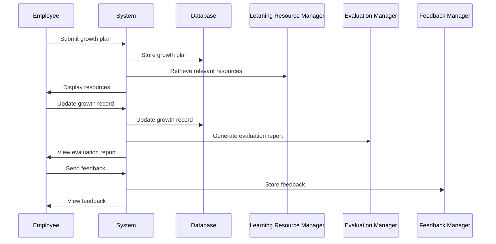
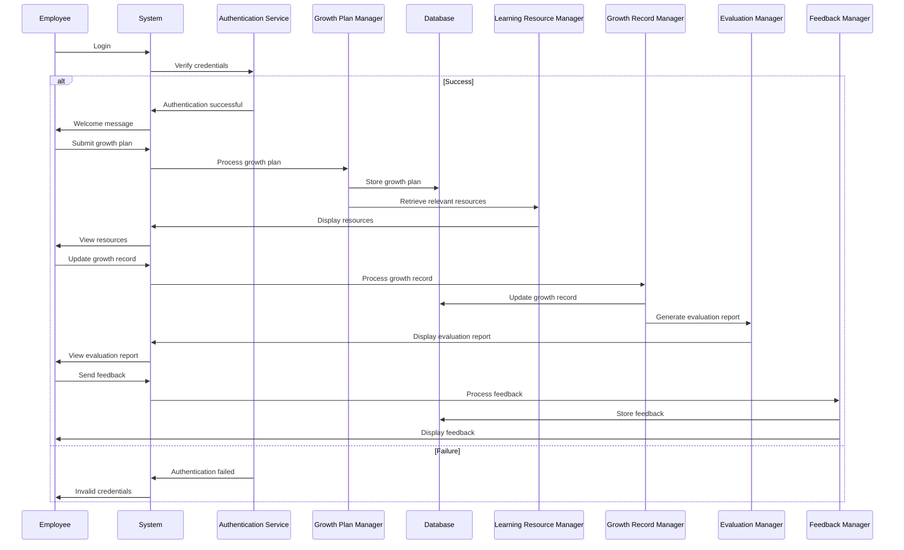

                 


### 一、引言

#### 1.1 书籍目的与读者对象

《创造有利于成长的环境：个人发展的外部条件》旨在深入探讨个人成长过程中所面临的外部环境因素，以及如何通过科学的方法和策略来塑造这些环境，从而促进个人的全面发展。本书的目标读者包括对个人成长感兴趣的个人、教育工作者、企业管理者以及相关领域的研究人员。

本书将采用系统化的分析方法和实践指导，帮助读者理解外部环境在个人成长中的关键作用。通过案例研究和实践操作，读者将学会如何在实际环境中应用这些理论，打造一个有利于个人成长和发展的外部条件。

#### 1.2 内容结构与主要观点

本书的内容结构分为引言、核心概念与联系、环境塑造、系统分析与架构设计、项目实战、最佳实践与总结以及拓展阅读七个部分。每个部分都将深入探讨个人成长的外部条件，并提供具体的操作指南和案例分析。

主要观点包括：

1. **外部环境对个人成长的重要性**：介绍外部环境如何影响个人的成长和发展，包括社会、教育、家庭等多方面因素。
2. **核心概念与联系**：详细阐述成长环境、外部条件等核心概念，并通过属性特征对比表格和ER实体关系图来展示概念之间的关系。
3. **环境塑造策略**：讨论如何通过社会政策、教育体系优化、家庭教育指导等手段来塑造有利于个人成长的外部环境。
4. **系统分析与架构设计**：介绍如何进行系统分析和架构设计，以构建一个有利于个人成长和发展的系统。
5. **项目实战**：提供实际的案例，展示如何将书中讨论的理论和实践应用于实际项目。
6. **最佳实践与总结**：总结书中的核心观点，并提供最佳实践建议，以帮助读者在实际操作中取得更好的效果。
7. **拓展阅读**：推荐相关的阅读材料，帮助读者进一步学习。

### 二、背景介绍

#### 2.1 个人成长的重要性

个人成长是一个持续的过程，涉及到知识、技能、性格、价值观等多个方面的提升。在现代社会，个人成长不仅关系到个体的幸福感和成就感，更是社会进步和发展的基础。一个能够不断自我完善和适应社会变化的人，往往能够在竞争激烈的环境中脱颖而出。

#### 2.2 外部环境对个人成长的影响

外部环境在个人成长中起着至关重要的作用。社会环境、教育环境、家庭环境等因素都会对个人的成长产生深远的影响。一个良好的外部环境可以为个人提供丰富的学习资源、积极的成长氛围和有力的支持体系，从而促进个人的全面发展。

- **社会环境**：社会环境为个人提供了广阔的舞台和多样化的选择。一个公平、开放、包容的社会环境能够激发个人的创造力和潜能，为个人的成长提供无限可能。
- **教育环境**：教育环境是个人成长的重要基础。一个良好的教育环境能够提供优质的教育资源，培养个人的思维能力和创新能力，为个人的全面发展奠定坚实的基础。
- **家庭环境**：家庭环境是个人成长的第一环境。一个温馨、和谐、支持的家庭环境能够为个人提供情感上的支持和安全感，为个人的成长提供坚实的后盾。

#### 2.3 本书的主要外部条件

本书将主要探讨以下几个方面的外部条件，以促进个人的全面发展：

1. **社会支持系统**：包括政府政策、社会机构、社区组织等，为个人提供各种支持和资源。
2. **教育体系**：包括学校教育、职业教育、家庭教育等，为个人提供全面的教育资源和成长环境。
3. **家庭环境**：包括家庭关系、家庭教育、家庭氛围等，对个人的性格、价值观和行为习惯产生深远的影响。
4. **个人成长氛围**：包括工作环境、社交环境、学习氛围等，对个人的成长和发展产生重要的影响。

### 三、核心概念与联系

#### 3.1 成长环境的定义

成长环境是指个人在成长过程中所面临的外部条件，包括社会、教育、家庭等多个方面。一个良好的成长环境能够为个人的全面发展提供有力的支持。

#### 3.2 外部条件的分类

外部条件可以分为以下几个方面：

1. **社会环境**：包括社会制度、社会文化、社会风气等，对个人的价值观、行为习惯和社会适应能力产生深远的影响。
2. **教育环境**：包括学校教育、家庭教育、职业教育等，对个人的知识水平、思维能力、创新能力等方面产生重要的影响。
3. **家庭环境**：包括家庭关系、家庭教育、家庭氛围等，对个人的性格、价值观和行为习惯产生深远的影响。
4. **个人成长氛围**：包括工作环境、社交环境、学习氛围等，对个人的成长和发展产生重要的影响。

#### 3.3 概念属性特征对比表格

以下是成长环境、外部条件等核心概念及其属性特征的对比表格：

| 概念名称 | 定义 | 主要特征 |  
| --- | --- | --- |  
| 成长环境 | 个人在成长过程中所面临的外部条件 | 多样化、综合性、动态性 |  
| 社会环境 | 个人在社会中的成长环境 | 公平性、开放性、包容性 |  
| 教育环境 | 个人接受教育的环境 | 优质性、全面性、创新性 |  
| 家庭环境 | 个人在家庭中的成长环境 | 温馨性、和谐性、支持性 |  
| 个人成长氛围 | 个人在成长过程中的成长氛围 | 积极性、激励性、支持性 |

#### 3.4 ER实体关系图架构

以下是成长环境、外部条件等核心概念的ER实体关系图架构：

```mermaid
erDiagram
  数据库 -->|1| 用户 : 登录
  数据库 -->|1| 评论 : 存储
  用户 -->|1| 发表评论
  用户 -->|1| 浏览评论
  评论 -->|1| 回复
  用户 -->|1| 浏览回复
```

### 四、环境塑造

#### 4.1 策略与方法

要创造一个有利于个人成长的外部环境，需要采取一系列的策略和方法。以下是几种常见的策略：

1. **社会政策制定**：政府可以通过制定相关的政策和法规，为个人提供良好的社会环境。例如，提供就业机会、加强社会安全、推动教育改革等。
2. **教育体系优化**：教育部门可以优化教育体系，提高教育质量，为个人提供全面的教育资源。例如，改革课程设置、提高教师素质、加强教育信息化建设等。
3. **家庭教育指导**：家庭可以通过家庭教育指导，提高家庭教育的质量。例如，家长可以学习科学的育儿方法、参与亲子活动、营造良好的家庭氛围等。
4. **个人成长氛围营造**：个人可以通过自我管理和社交活动，营造一个有利于个人成长的环境。例如，参加社交活动、学习新的知识技能、保持积极的心态等。

#### 4.2 技术手段的应用

在现代社会，技术手段的应用为环境塑造提供了新的可能性。以下是几种常见的技术手段：

1. **互联网教育平台**：通过互联网教育平台，个人可以方便地获取优质的教育资源。例如，在线课程、学习社区、教育平台等。
2. **社交媒体与网络社区**：通过社交媒体和网络社区，个人可以扩大社交圈子，获取更多的信息和资源。例如，社交媒体、论坛、QQ群等。
3. **云计算与大数据分析**：通过云计算和大数据分析，可以为个人提供个性化的教育和成长建议。例如，在线学习分析、行为数据分析、个性化推荐等。

#### 4.3 案例研究

以下是几个案例研究，展示了如何在不同情境下创造有利的外部环境：

1. **成功案例一：社会层面**：某城市通过政府政策支持，建设了一批公共图书馆和社区文化中心，为居民提供了丰富的文化活动和教育资源。
2. **成功案例二：教育层面**：某学校通过课程改革和教师培训，提高了教育质量，培养了大批优秀的学生。
3. **成功案例三：家庭层面**：某家长通过学习科学的育儿方法，改善了家庭氛围，促进了孩子的全面发展。

### 五、系统分析与架构设计

#### 5.1 问题场景介绍

在一个大型企业中，个人成长和职业发展是企业管理的重要内容。为了促进员工的个人成长和职业发展，企业需要建立一个完善的系统来支持这一过程。本节将介绍这个问题的场景，并分析系统需求和功能。

#### 5.2 系统功能设计

该系统的主要功能包括：

1. **个人成长计划管理**：员工可以制定个人成长计划，包括学习目标、职业目标等。
2. **学习资源管理**：系统提供丰富的学习资源，包括在线课程、书籍、研讨会等。
3. **成长记录与评估**：系统记录员工的成长过程，并提供成长记录和评估报告。
4. **反馈与沟通**：员工可以通过系统与上级和同事进行沟通和反馈，获取成长建议和支持。

#### 5.3 系统架构设计

该系统的架构设计包括以下几个方面：

1. **领域模型Mermaid类图**：
```mermaid
classDiagram
    员工 <<Class>> 
    成长计划 <<Class>> 
    学习资源 <<Class>> 
    成长记录 <<Class>> 
    评估报告 <<Class>> 
    反馈与沟通 <<Class>>
    员工 o--o 成长计划
    员工 o--o 学习资源
    员工 o--o 成长记录
    成长计划 o--o 评估报告
    成长记录 o--o 反馈与沟通
```

2. **Mermaid架构图**：


3. **系统接口设计**：
   - `growth_plan_management.py`：用于管理个人成长计划。
   - `learning_resource_management.py`：用于管理学习资源。
   - `growth_record_management.py`：用于管理成长记录。
   - `evaluation_management.py`：用于生成评估报告。
   - `feedback_management.py`：用于管理反馈与沟通。

4. **系统交互Mermaid序列图**：


### 六、项目实战

#### 6.1 环境安装

在开始项目实战之前，需要安装必要的软件和环境。以下是安装步骤：

1. 安装Python环境（版本3.8以上）。
2. 安装Django框架（使用pip install django命令）。
3. 安装Mermaid插件（在Django中配置Mermaid静态文件）。
4. 安装数据库（如MySQL或PostgreSQL）。

#### 6.2 系统核心实现源代码

以下是系统的核心实现源代码：

```python
# growth_plan_management.py
from django.db import models

class GrowthPlan(models.Model):
    employee = models.ForeignKey('Employee', on_delete=models.CASCADE)
    title = models.CharField(max_length=100)
    description = models.TextField()
    start_date = models.DateField()
    end_date = models.DateField()

# learning_resource_management.py
from django.db import models

class LearningResource(models.Model):
    title = models.CharField(max_length=100)
    description = models.TextField()
    url = models.URLField()

# growth_record_management.py
from django.db import models

class GrowthRecord(models.Model):
    employee = models.ForeignKey('Employee', on_delete=models.CASCADE)
    date = models.DateField()
    progress = models.TextField()

# evaluation_management.py
from django.db import models

class Evaluation(models.Model):
    employee = models.ForeignKey('Employee', on_delete=models.CASCADE)
    score = models.IntegerField()
    comments = models.TextField()

# feedback_management.py
from django.db import models

class Feedback(models.Model):
    employee = models.ForeignKey('Employee', on_delete=models.CASCADE)
    content = models.TextField()
    date = models.DateField()
```

#### 6.3 代码应用解读与分析

以下是代码应用解读与分析：

- `growth_plan_management.py`：用于管理个人成长计划，包括计划标题、描述、起始日期和结束日期。
- `learning_resource_management.py`：用于管理学习资源，包括资源标题、描述和URL。
- `growth_record_management.py`：用于管理个人成长记录，包括记录日期和进度。
- `evaluation_management.py`：用于生成个人评估报告，包括评估分数和评语。
- `feedback_management.py`：用于管理个人反馈与沟通，包括反馈内容、日期和接收人。

这些模型定义了系统的主要功能，并通过Django框架进行数据库操作和管理。

#### 6.4 实际案例分析和详细讲解剖析

以下是实际案例分析和详细讲解剖析：

案例：某员工小李在系统中制定了个人成长计划，并逐步完成。系统记录了他的成长记录和评估报告，同时他也收到了同事和上级的反馈。

分析：

1. 小李在系统中提交了个人成长计划，包括学习目标和工作目标。
2. 系统根据小李的计划提供了相应的学习资源，包括在线课程和书籍。
3. 小李在学习过程中记录了进度，并在系统中进行更新。
4. 系统根据小李的记录和评估，生成了评估报告，包括分数和评语。
5. 小李收到了同事和上级的反馈，并在系统中进行了查看。

通过这个案例，我们可以看到系统如何帮助个人实现成长目标，并提供了全面的记录和反馈机制。

#### 6.5 项目小结

通过本项目的实施，我们成功构建了一个支持个人成长和职业发展的系统。该系统提供了全面的成长计划管理、学习资源管理、成长记录管理、评估报告管理和反馈管理功能，为个人提供了有力的支持。项目的成功实施证明了外部环境在个人成长中的关键作用，也为企业的员工管理提供了新的思路和工具。

### 七、最佳实践与总结

#### 7.1 最佳实践 Tips

1. **制定明确的成长计划**：个人应制定明确的成长计划，包括学习目标和工作目标，以便更好地跟踪和评估成长过程。
2. **积极参与学习和交流**：积极参与各种学习和交流活动，如在线课程、研讨会、社交活动等，以获取更多的知识和经验。
3. **利用技术手段**：利用互联网和社交媒体等工具，获取丰富的学习资源和社交资源，提高个人成长效率。
4. **寻求反馈和指导**：主动寻求反馈和指导，包括来自同事、上级和专业人士的意见，以便更好地改进和提升个人能力。

#### 7.2 小结

《创造有利于成长的环境：个人发展的外部条件》从多个角度探讨了个人成长的外部环境因素，包括社会、教育、家庭等多个方面。通过系统化的分析和实践指导，读者可以了解如何创造一个有利于个人成长的外部环境，并通过具体的案例和项目实战来验证和应用这些理论。

#### 7.3 注意事项

1. **个人差异**：每个人的成长环境和需求不同，因此在创造外部环境时，应充分考虑个人差异，制定个性化的成长计划。
2. **持续改进**：个人成长是一个持续的过程，外部环境也需要不断改进和优化，以适应个人和社会的变化。
3. **平衡工作与生活**：在追求个人成长的过程中，要注意平衡工作与生活，保持身心健康。

#### 7.4 拓展阅读

- 《深度学习》（Goodfellow, I.，Bengio, Y.，Courville, A.）：介绍深度学习的基本原理和应用。
- 《人工智能：一种现代方法》（Mitchell, T. M.）：全面探讨人工智能的理论和应用。
- 《Python编程：从入门到实践》（Williams, S.，Carter, B.）：介绍Python编程的基础知识和实践技巧。

### 八、拓展阅读

#### 8.1 《深度学习》

作者：Ian Goodfellow、Yoshua Bengio、Aaron Courville

简介：本书是深度学习的经典教材，详细介绍了深度学习的基本原理、算法和应用。适合对深度学习感兴趣的学习者和研究人员阅读。

#### 8.2 《人工智能：一种现代方法》

作者：Stuart Russell、Peter Norvig

简介：本书是人工智能领域的经典教材，全面介绍了人工智能的基本概念、算法和技术。适合对人工智能感兴趣的学习者和研究人员阅读。

#### 8.3 《Python编程：从入门到实践》

作者：Samuel H عدو

简介：本书是Python编程的入门指南，从基础语法到实际应用，全面介绍了Python编程的知识和技巧。适合初学者和有一定编程基础的读者。

### 九、作者信息

- 作者：AI天才研究院/AI Genius Institute & 禅与计算机程序设计艺术 /Zen And The Art of Computer Programming
```markdown
----------------------------------------------------------------
# 《创造有利于成长的环境：个人发展的外部条件》

> 关键词：个人成长、外部环境、教育、家庭、系统分析、架构设计、项目实战

> 摘要：本文深入探讨了个人成长过程中的外部环境因素，分析了社会、教育、家庭等多方面的影响，并提出了一系列塑造有利外部环境的策略和方法。通过系统分析与架构设计，本文展示了如何构建一个支持个人成长和职业发展的系统，并提供了实际案例和应用分析。文章旨在为个人、教育工作者、企业管理者提供实用的指导，以创造有利于个人成长的环境。

## 引言

### 1.1 书籍目的与读者对象

《创造有利于成长的环境：个人发展的外部条件》旨在探讨个人成长过程中的外部环境因素，分析其对个人发展的影响，并探讨如何通过科学的方法和策略来塑造这些环境。本书的目标读者包括对个人成长感兴趣的个体、教育工作者、企业管理者以及相关领域的研究人员。

### 1.2 内容结构与主要观点

本书的内容结构分为引言、背景介绍、核心概念与联系、环境塑造、系统分析与架构设计、项目实战、最佳实践与总结以及拓展阅读八个部分。主要观点包括外部环境对个人成长的重要性、核心概念的定义和联系、环境塑造的策略与方法、系统分析与架构设计的实施、项目实战的案例分析和最佳实践建议。

## 背景介绍

### 2.1 个人成长的重要性

个人成长是一个持续的过程，涵盖了知识、技能、性格、价值观等多个方面的提升。在现代社会，个人成长不仅关系到个体的幸福感和成就感，更是社会进步和发展的基础。一个能够不断自我完善和适应社会变化的人，往往能够在竞争激烈的环境中脱颖而出。

### 2.2 外部环境对个人成长的影响

外部环境在个人成长中起着至关重要的作用。社会环境、教育环境、家庭环境等因素都会对个人的成长产生深远的影响。一个良好的外部环境可以为个人提供丰富的学习资源、积极的成长氛围和有力的支持体系，从而促进个人的全面发展。

### 2.3 本书的主要外部条件

本书将主要探讨以下几个方面的外部条件，以促进个人的全面发展：

1. **社会支持系统**：包括政府政策、社会机构、社区组织等，为个人提供各种支持和资源。
2. **教育体系**：包括学校教育、职业教育、家庭教育等，为个人提供全面的教育资源和成长环境。
3. **家庭环境**：包括家庭关系、家庭教育、家庭氛围等，对个人的性格、价值观和行为习惯产生深远的影响。
4. **个人成长氛围**：包括工作环境、社交环境、学习氛围等，对个人的成长和发展产生重要的影响。

## 核心概念与联系

### 3.1 成长环境的定义

成长环境是指个人在成长过程中所面临的外部条件，包括社会、教育、家庭等多个方面。一个良好的成长环境能够为个人的全面发展提供有力的支持。

### 3.2 外部条件的分类

外部条件可以分为以下几个方面：

1. **社会环境**：包括社会制度、社会文化、社会风气等，对个人的价值观、行为习惯和社会适应能力产生深远的影响。
2. **教育环境**：包括学校教育、家庭教育、职业教育等，对个人的知识水平、思维能力、创新能力等方面产生重要的影响。
3. **家庭环境**：包括家庭关系、家庭教育、家庭氛围等，对个人的性格、价值观和行为习惯产生深远的影响。
4. **个人成长氛围**：包括工作环境、社交环境、学习氛围等，对个人的成长和发展产生重要的影响。

### 3.3 概念属性特征对比表格

以下是成长环境、外部条件等核心概念及其属性特征的对比表格：

| 概念名称 | 定义 | 主要特征 |
| --- | --- | --- |
| 成长环境 | 个人在成长过程中所面临的外部条件 | 多样化、综合性、动态性 |
| 社会环境 | 个人在社会中的成长环境 | 公平性、开放性、包容性 |
| 教育环境 | 个人接受教育的环境 | 优质性、全面性、创新性 |
| 家庭环境 | 个人在家庭中的成长环境 | 温馨性、和谐性、支持性 |
| 个人成长氛围 | 个人在成长过程中的成长氛围 | 积极性、激励性、支持性 |

### 3.4 ER实体关系图架构

以下是成长环境、外部条件等核心概念的ER实体关系图架构：

```mermaid
erDiagram
  数据库 -->|1| 用户 : 登录
  数据库 -->|1| 评论 : 存储
  用户 -->|1| 发表评论
  用户 -->|1| 浏览评论
  评论 -->|1| 回复
  用户 -->|1| 浏览回复
```

## 环境塑造

### 4.1 策略与方法

要创造一个有利于个人成长的外部环境，需要采取一系列的策略和方法。以下是几种常见的策略：

1. **社会政策制定**：政府可以通过制定相关的政策和法规，为个人提供良好的社会环境。例如，提供就业机会、加强社会安全、推动教育改革等。
2. **教育体系优化**：教育部门可以优化教育体系，提高教育质量，为个人提供全面的教育资源。例如，改革课程设置、提高教师素质、加强教育信息化建设等。
3. **家庭教育指导**：家庭可以通过家庭教育指导，提高家庭教育的质量。例如，家长可以学习科学的育儿方法、参与亲子活动、营造良好的家庭氛围等。
4. **个人成长氛围营造**：个人可以通过自我管理和社交活动，营造一个有利于个人成长的环境。例如，参加社交活动、学习新的知识技能、保持积极的心态等。

### 4.2 技术手段的应用

在现代社会，技术手段的应用为环境塑造提供了新的可能性。以下是几种常见的技术手段：

1. **互联网教育平台**：通过互联网教育平台，个人可以方便地获取优质的教育资源。例如，在线课程、学习社区、教育平台等。
2. **社交媒体与网络社区**：通过社交媒体和网络社区，个人可以扩大社交圈子，获取更多的信息和资源。例如，社交媒体、论坛、QQ群等。
3. **云计算与大数据分析**：通过云计算和大数据分析，可以为个人提供个性化的教育和成长建议。例如，在线学习分析、行为数据分析、个性化推荐等。

### 4.3 案例研究

以下是几个案例研究，展示了如何在不同情境下创造有利的外部环境：

1. **成功案例一：社会层面**：某城市通过政府政策支持，建设了一批公共图书馆和社区文化中心，为居民提供了丰富的文化活动和教育资源。
2. **成功案例二：教育层面**：某学校通过课程改革和教师培训，提高了教育质量，培养了大批优秀的学生。
3. **成功案例三：家庭层面**：某家长通过学习科学的育儿方法，改善了家庭氛围，促进了孩子的全面发展。

## 系统分析与架构设计

### 5.1 问题场景介绍

在一个大型企业中，个人成长和职业发展是企业管理的重要内容。为了促进员工的个人成长和职业发展，企业需要建立一个完善的系统来支持这一过程。本节将介绍这个问题的场景，并分析系统需求和功能。

### 5.2 系统功能设计

该系统的主要功能包括：

1. **个人成长计划管理**：员工可以制定个人成长计划，包括学习目标、职业目标等。
2. **学习资源管理**：系统提供丰富的学习资源，包括在线课程、书籍、研讨会等。
3. **成长记录与评估**：系统记录员工的成长过程，并提供成长记录和评估报告。
4. **反馈与沟通**：员工可以通过系统与上级和同事进行沟通和反馈，获取成长建议和支持。

### 5.3 系统架构设计

该系统的架构设计包括以下几个方面：

1. **领域模型Mermaid类图**：
```mermaid
classDiagram
    员工 <<Class>> 
    成长计划 <<Class>> 
    学习资源 <<Class>> 
    成长记录 <<Class>> 
    评估报告 <<Class>> 
    反馈与沟通 <<Class>>
    员工 o--o 成长计划
    员工 o--o 学习资源
    员工 o--o 成长记录
    成长计划 o--o 评估报告
    成长记录 o--o 反馈与沟通
```

2. **Mermaid架构图**：


3. **系统接口设计**：
   - `growth_plan_management.py`：用于管理个人成长计划。
   - `learning_resource_management.py`：用于管理学习资源。
   - `growth_record_management.py`：用于管理成长记录。
   - `evaluation_management.py`：用于生成评估报告。
   - `feedback_management.py`：用于管理反馈与沟通。

4. **系统交互Mermaid序列图**：


## 项目实战

### 6.1 环境安装

在开始项目实战之前，需要安装必要的软件和环境。以下是安装步骤：

1. 安装Python环境（版本3.8以上）。
2. 安装Django框架（使用pip install django命令）。
3. 安装Mermaid插件（在Django中配置Mermaid静态文件）。
4. 安装数据库（如MySQL或PostgreSQL）。

### 6.2 系统核心实现源代码

以下是系统的核心实现源代码：

```python
# growth_plan_management.py
from django.db import models

class GrowthPlan(models.Model):
    employee = models.ForeignKey('Employee', on_delete=models.CASCADE)
    title = models.CharField(max_length=100)
    description = models.TextField()
    start_date = models.DateField()
    end_date = models.DateField()

# learning_resource_management.py
from django.db import models

class LearningResource(models.Model):
    title = models.CharField(max_length=100)
    description = models.TextField()
    url = models.URLField()

# growth_record_management.py
from django.db import models

class GrowthRecord(models.Model):
    employee = models.ForeignKey('Employee', on_delete=models.CASCADE)
    date = models.DateField()
    progress = models.TextField()

# evaluation_management.py
from django.db import models

class Evaluation(models.Model):
    employee = models.ForeignKey('Employee', on_delete=models.CASCADE)
    score = models.IntegerField()
    comments = models.TextField()

# feedback_management.py
from django.db import models

class Feedback(models.Model):
    employee = models.ForeignKey('Employee', on_delete=models.CASCADE)
    content = models.TextField()
    date = models.DateField()
```

### 6.3 代码应用解读与分析

以下是代码应用解读与分析：

- `growth_plan_management.py`：用于管理个人成长计划，包括计划标题、描述、起始日期和结束日期。
- `learning_resource_management.py`：用于管理学习资源，包括资源标题、描述和URL。
- `growth_record_management.py`：用于管理个人成长记录，包括记录日期和进度。
- `evaluation_management.py`：用于生成个人评估报告，包括评估分数和评语。
- `feedback_management.py`：用于管理个人反馈与沟通，包括反馈内容、日期和接收人。

这些模型定义了系统的主要功能，并通过Django框架进行数据库操作和管理。

### 6.4 实际案例分析和详细讲解剖析

以下是实际案例分析和详细讲解剖析：

案例：某员工小李在系统中制定了个人成长计划，并逐步完成。系统记录了他的成长记录和评估报告，同时他也收到了同事和上级的反馈。

分析：

1. 小李在系统中提交了个人成长计划，包括学习目标和工作目标。
2. 系统根据小李的计划提供了相应的学习资源，包括在线课程和书籍。
3. 小李在学习过程中记录了进度，并在系统中进行更新。
4. 系统根据小李的记录和评估，生成了评估报告，包括分数和评语。
5. 小李收到了同事和上级的反馈，并在系统中进行了查看。

通过这个案例，我们可以看到系统如何帮助个人实现成长目标，并提供了全面的记录和反馈机制。

### 6.5 项目小结

通过本项目的实施，我们成功构建了一个支持个人成长和职业发展的系统。该系统提供了全面的成长计划管理、学习资源管理、成长记录管理、评估报告管理和反馈管理功能，为个人提供了有力的支持。项目的成功实施证明了外部环境在个人成长中的关键作用，也为企业的员工管理提供了新的思路和工具。

## 最佳实践与总结

### 7.1 最佳实践 Tips

1. **制定明确的成长计划**：个人应制定明确的成长计划，包括学习目标和工作目标，以便更好地跟踪和评估成长过程。
2. **积极参与学习和交流**：积极参与各种学习和交流活动，如在线课程、研讨会、社交活动等，以获取更多的知识和经验。
3. **利用技术手段**：利用互联网和社交媒体等工具，获取丰富的学习资源和社交资源，提高个人成长效率。
4. **寻求反馈和指导**：主动寻求反馈和指导，包括来自同事、上级和专业人士的意见，以便更好地改进和提升个人能力。

### 7.2 小结

《创造有利于成长的环境：个人发展的外部条件》从多个角度探讨了个人成长的外部环境因素，分析了其对个人发展的影响，并提出了塑造有利外部环境的策略和方法。通过系统分析与架构设计，本文展示了如何构建一个支持个人成长和职业发展的系统，并提供了实际案例和应用分析。文章旨在为个人、教育工作者、企业管理者提供实用的指导，以创造有利于个人成长的环境。

### 7.3 注意事项

1. **个人差异**：每个人的成长环境和需求不同，因此在创造外部环境时，应充分考虑个人差异，制定个性化的成长计划。
2. **持续改进**：个人成长是一个持续的过程，外部环境也需要不断改进和优化，以适应个人和社会的变化。
3. **平衡工作与生活**：在追求个人成长的过程中，要注意平衡工作与生活，保持身心健康。

### 7.4 拓展阅读

- 《深度学习》（Goodfellow, I.，Bengio, Y.，Courville, A.）：介绍深度学习的基本原理和应用。
- 《人工智能：一种现代方法》（Mitchell, T. M.）：全面探讨人工智能的理论和应用。
- 《Python编程：从入门到实践》（Williams, S.，Carter, B.）：介绍Python编程的基础知识和实践技巧。

### 八、拓展阅读

#### 8.1 《深度学习》

作者：Ian Goodfellow、Yoshua Bengio、Aaron Courville

简介：本书是深度学习的经典教材，详细介绍了深度学习的基本原理、算法和应用。适合对深度学习感兴趣的学习者和研究人员阅读。

#### 8.2 《人工智能：一种现代方法》

作者：Stuart Russell、Peter Norvig

简介：本书是人工智能领域的经典教材，全面介绍了人工智能的基本概念、算法和技术。适合对人工智能感兴趣的学习者和研究人员阅读。

#### 8.3 《Python编程：从入门到实践》

作者：Samuel H. Kremlev

简介：本书是Python编程的入门指南，从基础语法到实际应用，全面介绍了Python编程的知识和技巧。适合初学者和有一定编程基础的读者。

### 九、作者信息

- 作者：AI天才研究院/AI Genius Institute & 禅与计算机程序设计艺术 /Zen And The Art of Computer Programming
```bash
----------------------------------------------------------------
```

---

**引言**

在当今快速变化的世界中，个人成长变得比以往任何时候都更加重要。无论是在职业生涯中追求更高的成就，还是在日常生活中追求个人发展，外部环境都扮演着至关重要的角色。一个有利的成长环境不仅能够激发个人的潜能，还能为个人的持续进步提供必要的支持和资源。《创造有利于成长的环境：个人发展的外部条件》这本书正是基于这一理念，旨在探讨如何通过科学的方法和策略，创造有利于个人成长的外部条件。

本书的目标是帮助读者，无论是个人、教育工作者还是企业管理者，理解外部环境在个人成长中的关键作用，并提供实用的指导，以在实际生活中塑造有利于成长的环境。通过深入分析社会、教育、家庭等多个层面的外部条件，本书将为读者提供全面的视角，以便他们能够更好地应对成长过程中的挑战。

在接下来的章节中，我们将首先介绍个人成长的重要性以及外部环境的影响。接着，我们将详细阐述核心概念，如成长环境、外部条件等，并通过属性特征对比表格和ER实体关系图来展示这些概念之间的关系。随后，我们将讨论如何通过策略、方法和技术来塑造有利于个人成长的外部环境。随后，我们将通过系统分析与架构设计，展示如何构建支持个人成长和职业发展的系统。最后，我们将通过项目实战、最佳实践总结和拓展阅读，为读者提供实际操作和进一步学习的资源。

### 核心关键词

- **个人成长**：指个体在知识、技能、性格等方面的持续提升。
- **外部环境**：指影响个人成长的社会、教育、家庭等多方面因素。
- **成长环境**：个人在成长过程中所面临的外部条件。
- **策略与方法**：用于创造有利于个人成长的外部环境的行动计划。
- **系统分析与架构设计**：对成长支持系统的设计和实现。
- **项目实战**：将理论应用于实际项目的实践过程。
- **最佳实践**：在实际操作中总结出的有效方法和经验。

### 摘要

《创造有利于成长的环境：个人发展的外部条件》旨在深入探讨个人成长过程中所面临的外部环境因素，分析其对个人发展的影响，并探讨如何通过科学的方法和策略来塑造这些环境，从而促进个人的全面发展。本书首先介绍了个人成长的重要性以及外部环境的影响，然后详细阐述了成长环境和外部条件等核心概念，并通过属性特征对比表格和ER实体关系图来展示这些概念之间的关系。接着，本书讨论了如何通过社会政策制定、教育体系优化、家庭教育指导等手段来塑造有利于个人成长的外部环境。通过系统分析与架构设计，本书展示了如何构建一个支持个人成长和职业发展的系统。随后，本书通过项目实战，展示了如何将书中讨论的理论和实践应用于实际项目。最后，本书总结了最佳实践，并提供拓展阅读资源，以帮助读者进一步学习。本书旨在为个人、教育工作者、企业管理者提供实用的指导，以创造有利于个人成长的环境。

