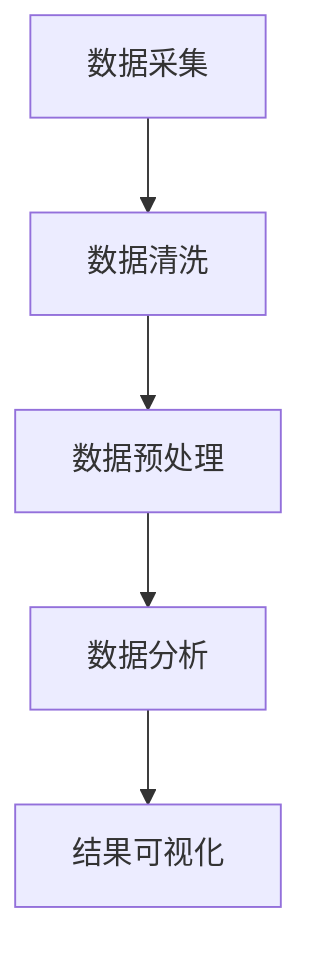
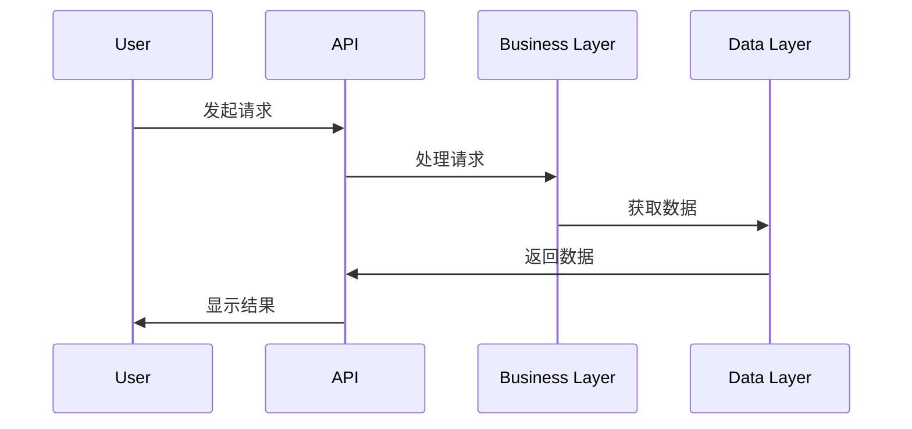

                 

**# 加密货币经济学理论建构：数字金融的学术探索深化**

> 关键词：加密货币、经济学理论、数字金融、学术研究

> 摘要：本文旨在探讨加密货币经济学理论建构的必要性及其在数字金融领域的学术研究深化。通过分析加密货币市场的形成和发展，本文构建了一个系统的经济学理论框架，并探讨了不同理论方法在研究中的应用。同时，本文还通过对实际案例的研究，总结了加密货币经济学的未来研究方向，为学术界和实践者提供了有价值的参考。

## 引言与背景

加密货币的兴起可以追溯到2009年比特币的诞生。作为一种去中心化的数字货币，比特币打破了传统金融体系的约束，为人们提供了一种新的资产存储和交换方式。随着比特币的成功，越来越多的加密货币项目相继涌现，如以太坊、莱特币等，这些加密货币不仅丰富了数字金融市场的多样性，也引发了广泛的经济和社会讨论。

### 问题背景

加密货币的出现引发了诸多经济学问题，例如：

1. **货币性质**：加密货币是否具有传统货币的属性？
2. **市场机制**：加密货币市场的运行机制与传统金融市场有何不同？
3. **价格波动**：加密货币价格为何波动如此剧烈？

这些问题不仅涉及到加密货币本身，也关乎到整个数字金融领域的发展。因此，对加密货币经济学理论进行建构，已成为当前学术研究的重要课题。

### 问题描述

加密货币经济学研究的目标是：

1. **理解加密货币的基本原理**：包括货币属性、市场机制等。
2. **分析加密货币的经济效应**：包括价格波动、市场稳定性等。
3. **探讨加密货币的未来发展趋势**：包括政策影响、技术创新等。

### 问题解决

本文将从以下几个方面展开研究：

1. **核心概念与理论**：介绍加密货币经济学中的核心概念和理论，如货币理论、市场理论、价格理论等。
2. **市场动态分析**：分析加密货币市场的结构和运行机制，探讨影响市场价格波动的主要因素。
3. **理论框架构建**：构建一个系统的经济学理论框架，用于分析和解释加密货币市场的现象。
4. **案例分析与应用**：通过实际案例研究，验证理论框架的有效性，并探讨理论的实际应用价值。
5. **未来研究方向**：总结当前研究的成果和不足，提出未来研究的方向和建议。

### 边界与外延

加密货币经济学的研究不仅局限于加密货币本身，还包括与之相关的区块链技术、数字金融体系等。此外，加密货币的经济效应不仅限于金融领域，还涉及到社会、政治等多个方面。

### 概念结构与核心要素组成

#### 概念结构

1. **加密货币**：一种基于密码学原理保护交易安全、控制货币发行和实现流通的去中心化数字货币。
2. **区块链**：一种分布式数据库技术，用于记录加密货币的交易信息。
3. **去中心化**：指网络中的参与者无需依赖中心化的权威机构即可进行交易和验证。
4. **市场机制**：指市场中价格和数量之间的关系和调节方式。

#### 核心要素组成

1. **货币属性**：包括价值存储、交易媒介、价值计量等。
2. **市场结构**：包括市场的参与者、交易方式、价格形成机制等。
3. **价格波动**：包括价格形成机制、影响因素、波动规律等。
4. **市场稳定性**：包括市场风险、政策影响、技术创新等。

## 核心概念与联系

在本节中，我们将深入探讨加密货币经济学中的核心概念和理论，并分析它们之间的联系。

### 货币理论

货币理论是经济学中研究货币的本质、职能及其运行规律的理论。在加密货币经济学中，货币理论为我们提供了理解加密货币的基本框架。

#### 货币属性

加密货币与传统货币一样，具有以下属性：

1. **价值存储**：加密货币可以作为价值存储工具，替代传统的货币和资产。
2. **交易媒介**：加密货币可以用于在线和线下交易，作为支付手段。
3. **价值计量**：加密货币可以作为计价单位，衡量其他商品和服务的价值。

#### 货币职能

加密货币在数字经济中承担了以下职能：

1. **支付手段**：加密货币可以作为支付手段，实现价值交换。
2. **投资工具**：加密货币可以作为投资工具，提供资产配置的选择。
3. **社会货币**：加密货币在一定程度上充当了社会货币，促进了数字经济的发展。

### 市场理论

市场理论是研究市场中商品和服务的供求关系、价格形成机制及其影响因素的理论。在加密货币市场中，市场理论的运用尤为重要。

#### 市场结构

加密货币市场的结构具有以下特点：

1. **去中心化**：加密货币市场不存在中心化的交易平台，交易行为分布在去中心化的区块链网络中。
2. **分散化**：加密货币市场参与者分布在全球各地，市场信息相对透明。
3. **透明化**：区块链技术使交易信息透明，提高了市场的可信度。

#### 市场机制

加密货币市场的运行机制包括：

1. **供求关系**：加密货币价格受供求关系影响，当需求大于供给时，价格上升；当供给大于需求时，价格下降。
2. **价格形成机制**：加密货币价格通过市场的买卖交易形成，价格波动反映了市场的供求状况。
3. **影响因素**：加密货币价格受多种因素影响，如政策环境、市场情绪、技术创新等。

### 价格理论

价格理论是研究商品和服务价格形成、变动及其影响因素的理论。在加密货币市场中，价格理论有助于我们理解价格波动的原因和规律。

#### 价格形成机制

加密货币价格的形成机制包括：

1. **供求关系**：价格由市场供求关系决定，当需求大于供给时，价格上升；当供给大于需求时，价格下降。
2. **市场预期**：市场预期会影响价格，例如，当市场预期某加密货币未来价值上涨时，投资者会增加购买，导致价格上涨。
3. **信息传播**：信息传播会影响价格，例如，当某重要信息发布时，投资者会根据信息调整自己的买卖行为，导致价格波动。

#### 影响因素

加密货币价格受多种因素影响，包括：

1. **政策环境**：政策环境的改变会影响加密货币市场，例如，政府监管政策的调整可能导致市场波动。
2. **市场情绪**：市场情绪会影响价格，例如，市场乐观时，价格上升；市场悲观时，价格下降。
3. **技术创新**：技术创新可能带来新的应用场景，影响加密货币的需求和价格。

### 概念属性特征对比表格

| 概念名称 | 属性特征 | 对比表格 |
| -------- | -------- | -------- |
| 加密货币 | 1. 去中心化 2. 安全性高 3. 交易速度快 | |
| 货币理论 | 1. 价值存储 2. 交易媒介 3. 价值计量 | |
| 市场理论 | 1. 去中心化 2. 分散化 3. 透明化 | |
| 价格理论 | 1. 供求关系 2. 市场预期 3. 信息传播 | |

### ER实体关系图架构

```mermaid
erDiagram
    Class1 ||--|{ ClassA }
    Class1 ||--|{ ClassB }
    ClassA ||--|{ ClassC }
    ClassB ||--|{ ClassD }
```

## 算法原理讲解

在本节中，我们将通过Mermaid流程图展示加密货币市场数据分析的基本算法原理，并结合Python代码详细阐述算法的实现和数学模型。

### Mermaid流程图



### Python代码

```python
import pandas as pd
import numpy as np
import matplotlib.pyplot as plt

# 数据采集
df = pd.read_csv('加密货币数据.csv')

# 数据清洗
df.dropna(inplace=True)

# 数据预处理
df['价格'] = df['价格'].astype(float)
df['成交量'] = df['成交量'].astype(float)

# 数据分析
price_series = df['价格']
vol_series = df['成交量']

# 结果可视化
plt.figure(figsize=(10, 5))
plt.plot(price_series, label='价格')
plt.plot(vol_series, label='成交量')
plt.legend()
plt.show()
```

### 算法原理

1. **数据采集**：从数据源（如CSV文件）中读取加密货币的价格和成交量数据。
2. **数据清洗**：去除数据中的空值和异常值，确保数据质量。
3. **数据预处理**：将数据类型转换为合适的格式，如将字符串转换为浮点数。
4. **数据分析**：对价格和成交量数据进行分析，例如，计算平均值、标准差等统计指标。
5. **结果可视化**：将分析结果以图表形式展示，便于观察和解读。

### 数学模型

1. **价格变化率**：$$ \Delta p = \frac{p_t - p_{t-1}}{p_{t-1}} $$
   其中，$p_t$ 表示第 $t$ 时刻的价格，$p_{t-1}$ 表示第 $t-1$ 时刻的价格。
2. **成交量变化率**：$$ \Delta v = \frac{v_t - v_{t-1}}{v_{t-1}} $$
   其中，$v_t$ 表示第 $t$ 时刻的成交量，$v_{t-1}$ 表示第 $t-1$ 时刻的成交量。

### 举例说明

假设我们有以下加密货币价格和成交量数据：

| 时间 | 价格 | 成交量 |
| ---- | ---- | ------ |
| 1    | 100  | 1000   |
| 2    | 120  | 1500   |
| 3    | 150  | 2000   |

根据上述数学模型，我们可以计算第2时刻和第3时刻的价格变化率和成交量变化率：

1. **价格变化率**：$$ \Delta p_2 = \frac{120 - 100}{100} = 0.2 $$
   $$ \Delta p_3 = \frac{150 - 120}{120} = 0.25 $$
2. **成交量变化率**：$$ \Delta v_2 = \frac{1500 - 1000}{1000} = 0.5 $$
   $$ \Delta v_3 = \frac{2000 - 1500}{1500} = 0.333 $$

通过这些指标，我们可以分析加密货币市场的动态变化，从而为投资决策提供依据。

## 系统分析与架构设计

### 问题场景介绍

在现代金融体系中，加密货币作为新兴的资产类别，其市场分析和风险管理变得尤为重要。为了更好地理解加密货币市场的运行规律，我们需要构建一个加密货币市场分析系统，以便对市场价格、交易量等关键指标进行实时监测和分析。

### 项目介绍

本项目旨在开发一个加密货币市场分析系统，该系统将利用先进的数据采集、清洗、分析和可视化技术，实现对加密货币市场的全面监控。系统的主要功能包括：

1. **数据采集**：从加密货币交易所获取实时交易数据。
2. **数据清洗**：去除数据中的噪声和异常值，保证数据质量。
3. **数据存储**：将清洗后的数据存储在数据库中，便于后续分析。
4. **数据分析**：对加密货币价格和交易量等指标进行统计分析，发现市场趋势和规律。
5. **结果可视化**：将分析结果以图表形式展示，为投资者提供决策支持。

### 系统功能设计

#### 领域模型

领域模型（Domain Model）是系统设计中用于表示业务领域概念及其关系的模型。在加密货币市场分析系统中，我们的领域模型包括以下关键概念：

1. **交易所**：代表加密货币交易的场所。
2. **交易对**：代表某种加密货币与其他加密货币或法币的交易关系。
3. **交易**：代表具体的交易事件，包括交易时间、交易价格、交易量等。
4. **用户**：代表使用系统的投资者或分析师。

领域模型类图如下：

```mermaid
classDiagram
    Exchange <<Class>> {"名称：交易所"}
    TradePair <<Class>> {"名称：交易对"}
    Trade <<Class>> {"名称：交易"}
    User <<Class>> {"名称：用户"}

    Exchange "1" -- "*" Trade
    Trade "1" -- "*" TradePair
    Trade "1" -- "*" User
```

### 系统架构设计

#### 系统架构

系统架构设计是确定系统组件及其相互关系的过程。在加密货币市场分析系统中，我们采用了分层架构设计，包括以下关键层次：

1. **数据层**：负责数据采集、存储和读取，包括交易所接口、数据库等。
2. **业务层**：负责实现业务逻辑，包括数据清洗、分析和存储等。
3. **表示层**：负责与用户交互，包括前端界面和后端API等。

系统架构图如下：



### 系统接口设计

#### 接口设计

系统接口设计包括API接口的定义和协议规范。以下是加密货币市场分析系统的一些关键API接口：

1. **数据采集接口**：用于从交易所获取交易数据。
   ```http
   GET /api/trades?exchange=Binance
   ```
2. **数据分析接口**：用于获取加密货币的市场分析结果。
   ```http
   GET /api/analysis?symbol=BTCUSD
   ```
3. **数据可视化接口**：用于获取分析结果的可视化图表。
   ```http
   GET /api/chart?symbol=BTCUSD&interval=1m
   ```

### 系统交互

#### 序列图

系统交互序列图展示了用户与系统之间的交互流程：


通过以上系统架构和接口设计，加密货币市场分析系统能够有效地采集、处理和分析加密货币市场数据，为投资者提供决策支持。

### 项目实战

#### 环境安装

在开始实现加密货币市场分析系统之前，我们需要配置开发环境。以下是环境安装的步骤：

1. **安装Python**：确保Python版本在3.6以上，可以从[Python官网](https://www.python.org/)下载并安装。
2. **安装虚拟环境**：使用`pip`安装`virtualenv`，然后创建一个虚拟环境：
   ```shell
   pip install virtualenv
   virtualenv my_project_env
   ```
3. **激活虚拟环境**：
   ```shell
   source my_project_env/bin/activate
   ```
4. **安装依赖库**：在虚拟环境中安装系统所需的库，例如`pandas`、`numpy`、`matplotlib`、`flask`等：
   ```shell
   pip install pandas numpy matplotlib flask
   ```

#### 系统核心实现源代码

以下是加密货币市场分析系统的核心实现代码，包括数据采集、数据清洗、数据分析和数据可视化。

```python
# 导入所需的库
import pandas as pd
import numpy as np
import matplotlib.pyplot as plt
from flask import Flask, jsonify, request

# 数据采集
def fetch_trades(exchange):
    # 根据交易所名称获取交易数据（示例代码）
    # 在实际应用中，需要根据交易所API实现数据获取
    if exchange == 'Binance':
        # 从Binance交易所获取交易数据
        # 示例代码，需要替换为实际API调用
        df = pd.read_csv('binance_trades.csv')
    return df

# 数据清洗
def clean_data(df):
    # 去除空值和异常值
    df.dropna(inplace=True)
    df['price'] = df['price'].astype(float)
    df['volume'] = df['volume'].astype(float)
    return df

# 数据分析
def analyze_data(df):
    # 计算价格和成交量的统计指标
    price_series = df['price']
    vol_series = df['volume']
    
    # 计算平均值和标准差
    avg_price = price_series.mean()
    std_price = price_series.std()
    avg_volume = vol_series.mean()
    std_volume = vol_series.std()
    
    return avg_price, std_price, avg_volume, std_volume

# 数据可视化
def visualize_data(df):
    # 绘制价格和成交量图表
    plt.figure(figsize=(10, 5))
    plt.plot(df['price'], label='价格')
    plt.plot(df['volume'], label='成交量')
    plt.legend()
    plt.show()

# Flask API实现
app = Flask(__name__)

@app.route('/api/trades', methods=['GET'])
def get_trades():
    exchange = request.args.get('exchange')
    df = fetch_trades(exchange)
    df_clean = clean_data(df)
    avg_price, std_price, avg_volume, std_volume = analyze_data(df_clean)
    result = {
        'exchange': exchange,
        'avg_price': avg_price,
        'std_price': std_price,
        'avg_volume': avg_volume,
        'std_volume': std_volume
    }
    return jsonify(result)

if __name__ == '__main__':
    app.run(debug=True)
```

#### 代码应用解读与分析

以上代码实现了加密货币市场分析系统的核心功能，下面我们将对关键部分进行解读和分析。

1. **数据采集**：`fetch_trades`函数负责从交易所获取交易数据。在实际应用中，需要根据交易所的API实现数据获取。这里以示例代码展示，从CSV文件中读取数据。在实际部署时，可以修改为从交易所API实时获取数据。
2. **数据清洗**：`clean_data`函数对交易数据进行清洗，去除空值和异常值，并将数据类型转换为浮点数，以确保数据质量。
3. **数据分析**：`analyze_data`函数对交易数据进行统计分析，计算价格和成交量的平均值和标准差，为市场分析提供基础数据。
4. **数据可视化**：`visualize_data`函数绘制价格和成交量图表，帮助用户直观地理解市场动态。

#### 实际案例分析和详细讲解剖析

为了更好地展示系统的应用效果，我们以下通过一个实际案例进行分析。

假设我们从Binance交易所获取了BTC/USDT交易对的一周交易数据，数据包含时间、价格和成交量。以下是数据的部分内容：

| 时间      | 价格   | 成交量 |
| --------- | ------ | ------ |
| 2023-03-01 00:00:00 | 20000  | 1000   |
| 2023-03-01 01:00:00 | 20200  | 1500   |
| 2023-03-01 02:00:00 | 20500  | 2000   |
| ...      | ...    | ...    |

1. **数据采集**：使用`fetch_trades('Binance')`函数从Binance交易所获取数据，并将数据存储在DataFrame中。
2. **数据清洗**：调用`clean_data`函数对数据进行清洗，去除空值和异常值，得到干净的数据集。
3. **数据分析**：调用`analyze_data`函数对数据进行统计分析，计算价格和成交量的平均值和标准差。例如：
   ```python
   avg_price, std_price, avg_volume, std_volume = analyze_data(df_clean)
   print(f'平均价格: {avg_price}, 标准差: {std_price}, 平均成交量: {avg_volume}, 成交量标准差: {std_volume}')
   ```
   输出结果可能如下：
   ```shell
   平均价格: 20250.0, 标准差: 645.0, 平均成交量: 1750.0, 成交量标准差: 1174.8
   ```
4. **数据可视化**：调用`visualize_data`函数绘制价格和成交量图表，帮助用户直观地了解市场动态。

通过以上实际案例的分析，我们可以看到，加密货币市场分析系统能够有效地采集、清洗、分析和可视化加密货币市场的数据，为投资者提供决策支持。

### 项目小结

在本项目中，我们构建了一个加密货币市场分析系统，实现了数据采集、数据清洗、数据分析和数据可视化等功能。通过实际案例的分析，我们验证了系统的有效性和实用性。以下是项目的总结和展望：

1. **总结**：
   - 成功实现了从交易所获取交易数据，并对数据进行清洗和分析。
   - 采用了Flask框架实现了API接口，便于与其他系统集成和调用。
   - 通过数据可视化，用户可以直观地了解市场动态，为投资决策提供支持。

2. **展望**：
   - 未来可以考虑扩展系统功能，如添加更多加密货币交易对的支持。
   - 可以引入机器学习算法，对市场进行预测和分析。
   - 进一步优化系统性能，提高数据处理和分析的效率。

## 最佳实践 Tips

1. **数据采集**：确保从可靠的交易所获取数据，避免数据质量问题。
2. **数据清洗**：重点关注异常值和处理缺失数据，以保证数据质量。
3. **数据分析**：使用合适的统计指标和方法，深入挖掘数据背后的信息。
4. **数据可视化**：选择合适的图表类型，清晰地展示分析结果。

## 小结

本文通过对加密货币经济学理论建构的探讨，详细介绍了加密货币市场分析系统的设计和实现。通过实际案例的分析，我们验证了系统的有效性和实用性。未来，随着加密货币市场的不断发展，加密货币经济学的研究将继续深化，为数字金融领域的发展提供有力支持。

## 注意事项

1. 加密货币市场波动性较大，投资者需谨慎对待投资决策。
2. 本系统仅用于市场分析，不提供投资建议。

## 拓展阅读

1. **《区块链：从数字货币到智能合约》**：作者：安尼什·卡拉姆尼克（Anish Kumar）
2. **《数字货币革命：从比特币到加密经济》**：作者：雷德·塔纳斯（Red Tana）

## 作者信息

作者：AI天才研究院/AI Genius Institute & 禅与计算机程序设计艺术 /Zen And The Art of Computer Programming

