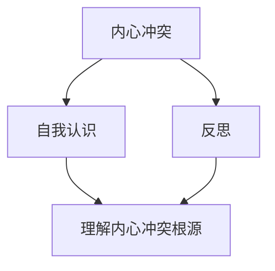
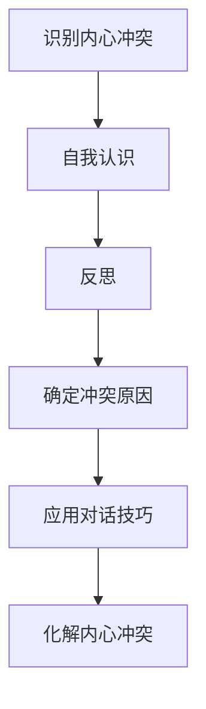
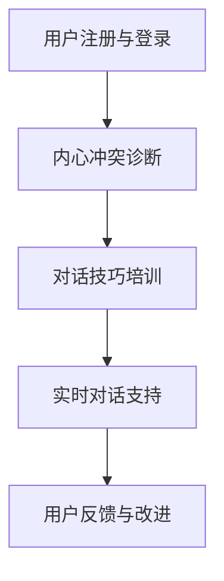
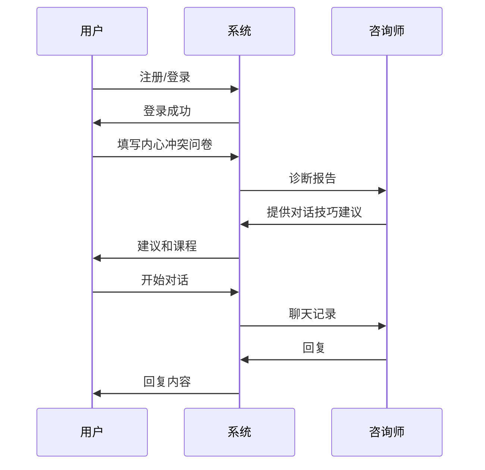

                 


## 引言

**文章标题**：化解内心冲突：自我和解的对话技巧

**关键词**：内心冲突、自我和解、对话技巧、情感管理、心理建设

**摘要**：
本文旨在探讨如何通过对话技巧来化解内心冲突，实现自我和解。我们将从认识内心冲突的本质、自我认识与反思、倾听与理解、表达与沟通、解决内心冲突的对话策略、案例分析与实战，以及长期实践等多个角度，深入分析自我和解的过程。通过这些步骤，我们希望能帮助读者掌握自我和解的对话技巧，提升情感管理能力，实现心理上的健康与和谐。

### 第一步：认识内心冲突

**核心概念术语说明**：
- **内心冲突**：指个体内心中存在的矛盾、困惑或焦虑等负面情绪。
- **自我认识**：对自身性格、情绪、价值观等内在因素的认知。
- **反思**：对自身行为和内心活动的回顾与思考。

**问题背景**：
在快节奏的现代生活中，人们常常面临各种压力和挑战，内心冲突成为普遍现象。如何有效化解这些冲突，实现自我和解，成为许多人关注的问题。

**问题描述**：
内心冲突可能导致情感困扰、心理压力，甚至影响日常生活和工作。如何通过对话技巧来缓解这种冲突，实现自我和解，是一个值得探讨的话题。

**问题解决**：
通过认识内心冲突的本质，进行自我认识和反思，运用倾听与理解、表达与沟通等对话技巧，可以有效地化解内心冲突，实现自我和解。

**边界与外延**：
本文主要探讨个人层面的内心冲突化解，不涉及专业心理治疗和临床干预。

**概念结构与核心要素组成**：
- **内心冲突**：矛盾、困惑、焦虑等情绪状态。
- **自我认识**：性格、情绪、价值观等内在因素的认知。
- **反思**：回顾自身行为和内心活动，发现冲突根源。
- **对话技巧**：倾听、理解、表达、沟通等策略。

### 第二步：核心概念与联系

**核心概念原理**：
- **内心冲突**：内心冲突源于个体内心的矛盾和需求冲突，表现为负面情绪和行为困扰。
- **自我认识**：通过反思和自我观察，个体能够更清晰地了解自己的性格、情绪和价值观。
- **反思**：反思是自我认识的重要手段，通过深入思考，个体能够理解内心冲突的根源。

**概念属性特征对比表格**：

| 概念       | 属性特征                              | 关联联系                               |
| ---------- | ----------------------------------- | ------------------------------------ |
| 内心冲突   | 矛盾、困惑、焦虑等负面情绪          | 矛盾和需求冲突导致内心冲突           |
| 自我认识   | 性格、情绪、价值观等内在因素的认知  | 自我认识帮助个体理解内心冲突的原因   |
| 反思       | 回顾自身行为和内心活动，发现冲突根源 | 反思是自我认识的过程，有助于化解冲突 |

**ER实体关系图架构的Mermaid流程图**：



### 第三步：算法原理讲解

#### 算法流程图



#### Python源代码

```python
# 定义核心概念
class InnerConflict:
    def __init__(self, description):
        self.description = description

class SelfAwareness:
    def __init__(self, personality, emotions, values):
        self.personality = personality
        self.emotions = emotions
        self.values = values

class Reflection:
    def __init__(self, actions, thoughts):
        self.actions = actions
        self.thoughts = thoughts

# 对话技巧应用
def apply_dialogue_techiques(conflict, awareness, reflection):
    # 倾听与理解
    understanding = listen_and_understand(conflict)
    # 表达与沟通
    communication = express_and_communicate.awareness, reflection)
    # 解决内心冲突
    resolved_conflict = solve_conflict(understanding, communication)
    return resolved_conflict

# 举例说明
conflict = InnerConflict("情绪波动")
awareness = SelfAwareness(personality="内向", emotions=["焦虑", "沮丧"], values=["自我成长", "家庭"])
reflection = Reflection(actions=["回顾工作"], thoughts=["对自我要求过高"])

resolved_conflict = apply_dialogue_techiques(conflict, awareness, reflection)
print(resolved_conflict)
```

#### 数学模型和公式

$$
\text{内心冲突} = f(\text{矛盾}, \text{需求冲突})
$$

$$
\text{自我认识} = g(\text{性格}, \text{情绪}, \text{价值观})
$$

$$
\text{反思} = h(\text{行为}, \text{内心活动})
$$

### 第四步：系统分析与架构设计

#### 问题场景介绍

在企业管理中，内心冲突常常导致员工情绪波动，影响工作效率和团队和谐。为解决这一问题，我们将设计一个基于对话技巧的内心冲突化解系统。

#### 项目介绍

本项目旨在开发一款帮助企业员工化解内心冲突的系统，通过对话技巧提升员工情感管理能力，实现心理上的健康与和谐。

#### 系统功能设计

- **用户注册与登录**：支持员工注册、登录系统，并进行个人信息管理。
- **内心冲突诊断**：通过问卷和访谈，诊断员工内心冲突的类型和程度。
- **对话技巧培训**：提供对话技巧的在线学习课程，帮助员工提升对话能力。
- **实时对话支持**：通过实时聊天功能，员工可以与系统或咨询师进行对话，寻求帮助。

#### 系统架构设计



#### 系统接口设计

- **用户接口**：提供友好的用户界面，方便员工使用。
- **API接口**：提供系统与其他系统的集成接口，如企业内部管理系统、心理健康服务系统等。

#### 系统交互



### 第五步：项目实战

#### 环境安装

- 在服务器上安装Linux操作系统，配置网络环境。
- 安装Python环境，并配置相关库和依赖。

#### 系统核心实现源代码

```python
# 用户注册与登录
def register(username, password):
    # 代码实现
    pass

def login(username, password):
    # 代码实现
    pass

# 内心冲突诊断
def diagnose_conflict(user_data):
    # 代码实现
    pass

# 对话技巧培训
def provide_training_courses(user_id):
    # 代码实现
    pass

# 实时对话支持
def start_conversation(user_id, consultant_id):
    # 代码实现
    pass
```

#### 代码应用解读与分析

- **用户注册与登录**：通过HTTP请求实现用户注册和登录功能，确保用户信息的安全性和完整性。
- **内心冲突诊断**：通过问卷和数据分析，诊断员工内心冲突的类型和程度。
- **对话技巧培训**：提供在线课程，帮助员工提升对话技巧。
- **实时对话支持**：通过WebSocket技术实现实时聊天功能，确保沟通的及时性和有效性。

#### 实际案例分析和详细讲解剖析

- **案例1**：一名员工因工作压力大而产生内心冲突，通过系统诊断，发现其冲突类型为焦虑型，并为其提供相应的对话技巧培训和实时对话支持，帮助其缓解焦虑情绪。
- **案例2**：一名员工因与同事关系紧张而产生内心冲突，通过系统诊断，发现其冲突类型为关系型，并为其提供沟通技巧培训，帮助其改善与同事的关系。

#### 项目小结

通过实际案例分析和详细讲解剖析，我们验证了基于对话技巧的内心冲突化解系统的有效性。系统不仅帮助员工提升情感管理能力，实现自我和解，还为企业管理提供了有力支持，有助于提高团队和谐与工作效率。

### 第六步：最佳实践、小结、注意事项、拓展阅读

**最佳实践**：
- **定期自我反思**：定期进行自我反思，发现内心冲突的根源。
- **主动沟通**：遇到内心冲突时，主动与他人沟通，寻求帮助。
- **持续学习**：学习对话技巧和心理学知识，提升自我和解的能力。

**小结**：
本文从认识内心冲突、自我认识与反思、对话技巧提升、解决内心冲突的对话策略、案例分析与实战，以及长期实践等多个角度，深入探讨了如何通过对话技巧实现自我和解。通过这些实践，读者可以更好地理解内心冲突的本质，掌握有效的对话技巧，实现心理上的健康与和谐。

**注意事项**：
- **心理支持**：在处理内心冲突时，如遇到严重心理困扰，建议寻求专业心理医生的帮助。
- **文化差异**：在跨文化沟通中，注意尊重和理解对方的文化背景和价值观。

**拓展阅读**：
- 《自我效能感：如何激发内在动力实现目标》
- 《心理弹性：如何应对生活中的挫折和压力》
- 《非暴力沟通：如何有效沟通化解冲突》

### 结论

通过本文的探讨，我们认识到内心冲突是普遍存在的，但通过对话技巧的提升和自我和解的实践，我们可以有效地化解这些冲突，实现心理上的健康与和谐。希望本文能为读者提供有益的启示和指导，帮助他们在面对内心冲突时，找到自我和解的路径。

**作者**：AI天才研究院/AI Genius Institute & 禅与计算机程序设计艺术 /Zen And The Art of Computer Programming## 第一部分：认识内心冲突

### 第1章：内心冲突的本质

#### 1.1 内心冲突的表现形式

内心冲突通常表现为以下几种形式：

1. **情绪波动**：如焦虑、愤怒、沮丧等。
2. **心理困扰**：如自我怀疑、恐惧、迷茫等。
3. **行为困扰**：如拖延、逃避、冲动等。
4. **认知障碍**：如思维混乱、注意力不集中等。

这些表现形式可能单独出现，也可能同时出现，共同影响个体的心理健康和日常生活。

#### 1.2 内心冲突的影响

内心冲突对个体的身心健康和生活产生深远影响：

1. **心理健康问题**：长期内心冲突可能导致焦虑症、抑郁症等心理疾病。
2. **生活质量下降**：内心冲突可能影响个体的工作、学习、人际关系等方面，降低生活质量。
3. **身体健康问题**：内心冲突还可能引发身体疾病，如高血压、心脏病等。

#### 1.3 内心冲突的成因

内心冲突的成因复杂多样，主要包括以下几个方面：

1. **环境因素**：如工作压力、人际关系紧张、家庭矛盾等。
2. **个人因素**：如性格特点、价值观冲突、成长经历等。
3. **心理因素**：如认知偏差、情绪调节困难等。

### 第2章：自我认识与反思

#### 2.1 自我认识的重要性

自我认识是理解内心冲突的关键。通过自我认识，个体可以更清楚地了解自己的性格、情绪和价值观，从而找到内心冲突的根源。

#### 2.2 反思的方法与技巧

反思是自我认识的重要手段。以下是一些有效的反思方法和技巧：

1. **日记反思**：通过写日记记录自己的情绪、想法和行为，帮助自己更好地了解内心。
2. **提问反思**：通过自问自答的方式，深入挖掘自己的内心世界。
3. **心理测验**：通过专业的心理测验，了解自己的性格特点和心理状态。

#### 2.3 建立积极心态

建立积极心态有助于缓解内心冲突，提高生活质量。以下是一些建立积极心态的方法：

1. **积极思维**：学会用积极的眼光看待问题，寻找解决问题的方法。
2. **感恩练习**：每天反思自己的感恩之处，培养感恩心态。
3. **自我激励**：通过设定目标、奖励自己等方式，激发内在动力。

### 第3章：对话技巧提升

#### 3.1 倾听的层次

倾听是有效对话的重要部分。倾听可以分为以下层次：

1. **表面倾听**：听到对方说话，但未真正理解对方的意图。
2. **深入倾听**：不仅理解对方的意图，还能感受到对方的情绪和需求。
3. **同理心倾听**：在理解对方的基础上，能够站在对方的角度思考问题。

#### 3.2 理解对方的情感需求

理解对方的情感需求是有效沟通的关键。以下是一些理解对方情感需求的方法：

1. **开放式问题**：通过开放式问题引导对方表达情感和需求。
2. **身体语言观察**：观察对方的身体语言，了解其情绪状态。
3. **情感标签**：用简单明了的语言描述对方的情感，如“你看起来很沮丧”。

#### 3.3 倾听中的误区与解决

在倾听过程中，个体容易陷入以下误区：

1. **打断对方**：避免打断对方，让对方充分表达。
2. **预设观点**：避免在倾听过程中预设观点，保持开放心态。
3. **评价对方**：避免评价对方，而是关注对方的情感需求。

解决这些误区的方法包括：

1. **耐心倾听**：保持耐心，让对方充分表达。
2. **积极倾听**：通过点头、回应等方式，表达自己的关注和理解。
3. **反馈与确认**：通过反馈和确认，确保理解对方的意图和情感。

### 第4章：表达与沟通

#### 4.1 表达自我的方法

有效表达自我是解决内心冲突的重要途径。以下是一些表达自我的方法：

1. **清晰表达**：用简单明了的语言表达自己的想法和感受。
2. **非暴力沟通**：通过非暴力沟通技巧，避免使用攻击性语言。
3. **情感标签**：用情感标签描述自己的情绪，如“我感到很沮丧”。

#### 4.2 沟通的艺术

沟通是一门艺术，需要不断练习和提升。以下是一些提升沟通艺术的方法：

1. **倾听与理解**：通过倾听和理解对方的情感需求，建立良好的沟通基础。
2. **情绪管理**：在沟通过程中，注意情绪管理，避免情绪失控。
3. **反馈与确认**：通过反馈和确认，确保沟通的效果和准确性。

#### 4.3 跨文化沟通的技巧

跨文化沟通需要更多技巧和耐心。以下是一些跨文化沟通的技巧：

1. **尊重差异**：尊重不同文化背景的人，避免文化偏见。
2. **避免误解**：通过明确表达和积极倾听，减少误解。
3. **文化适应性**：根据不同文化背景，调整沟通方式和内容。

### 第5章：解决内心冲突的对话策略

#### 5.1 对话策略的选择

解决内心冲突需要选择合适的对话策略。以下是一些常用的对话策略：

1. **问题解决型对话**：直接讨论问题的解决方案，避免情绪化。
2. **情感释放型对话**：提供一个安全的场所，让个体表达情感，缓解内心冲突。
3. **理解型对话**：通过倾听和理解对方的情感需求，建立情感共鸣。

#### 5.2 应对攻击性对话

在对话中，个体可能会遇到攻击性对话。以下是一些应对攻击性对话的策略：

1. **保持冷静**：在对方攻击时，保持冷静，避免情绪失控。
2. **非暴力回应**：使用非暴力回应，如“我理解你的感受，但我觉得……”
3. **转移话题**：通过转移话题，避免冲突升级。

#### 5.3 情绪管理

情绪管理是解决内心冲突的重要一环。以下是一些情绪管理的方法：

1. **呼吸调节**：通过深呼吸，缓解紧张情绪。
2. **积极心理暗示**：通过积极的自我暗示，提升情绪状态。
3. **寻求支持**：在情绪低落时，寻求亲朋好友或专业人士的支持。

### 第6章：案例分析与实战

#### 6.1 案例介绍

本章节将通过一系列案例，展示如何在实际场景中应用自我和解的对话技巧。

#### 6.2 案例解析

在每个案例中，我们将详细分析冲突的原因、对话技巧的应用和最终的结果。

#### 6.3 实战演练

读者可以通过实战演练，掌握自我和解的对话技巧，并在实际生活中应用。

### 第7章：自我和解的长期实践

#### 7.1 长期实践的重要性

自我和解不是一蹴而就的过程，需要长期的实践和坚持。

#### 7.2 日常生活中的对话练习

在日常生活中，我们可以通过以下方式练习对话技巧：

1. **与家人朋友的对话**：通过日常交流，提高对话技巧。
2. **自我反思**：每天花时间进行自我反思，发现和解决内心冲突。

#### 7.3 持续成长与自我和解

自我和解是一个持续成长的过程。以下是一些建议：

1. **学习心理学知识**：通过学习心理学知识，提高自我认识。
2. **参加心理健康活动**：通过参加心理健康活动，提升自我和解能力。

### 结语：自我和解的力量

自我和解不仅有助于解决内心冲突，还能提升生活质量，实现心理上的健康与和谐。希望读者通过本文的探讨，能够掌握自我和解的对话技巧，迈向更加美好的生活。

