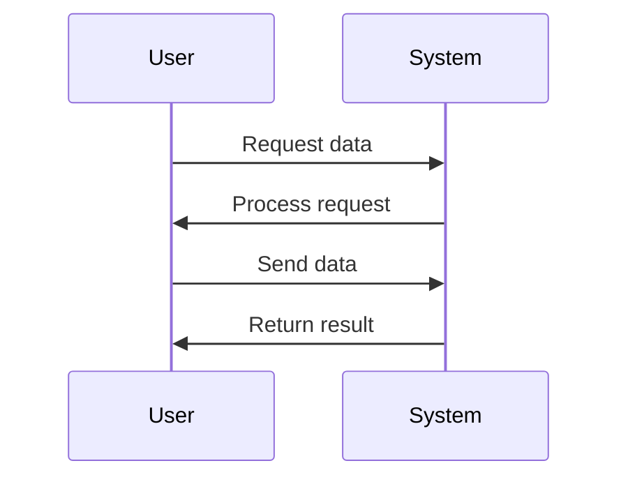

                 

# 化解内心冲突：自我和解的对话技巧

> 关键词：内心冲突、自我和解、对话技巧、自我反思、情绪管理、认知重构

> 摘要：本文将探讨现代社会中人们面临的内心冲突问题，并介绍一种有效的解决方法——自我和解的对话技巧。通过自我反思、情绪管理和认知重构，个体可以更深入地了解自己，解决内心冲突，实现心理的和谐与平静。本文将详细阐述这些核心概念，并提供实用的算法原理讲解和项目实战经验。

## 目录大纲设计

### 一、背景介绍

#### 1.1 问题背景

现代社会中，人们面临着越来越多的内心冲突和压力，如工作压力、人际关系、自我认同等。这些冲突和压力不仅影响个人的心理健康，也会对工作和社会生活产生负面影响。因此，如何化解内心冲突，实现自我和解，成为一个重要且迫切的问题。

#### 1.2 问题描述

内心冲突往往源于自我认知的矛盾、对外界的不满以及对未来的担忧。化解内心冲突，需要找到冲突的根源，理解自己的内心世界，以及学会有效地与自己的情绪和想法对话。

#### 1.3 问题解决

通过自我和解的对话技巧，人们可以更深入地了解自己，学会接纳自己的不足，以及有效地处理负面情绪。自我和解的对话技巧包括自我反思、情绪管理、认知重构等。

#### 1.4 边界与外延

本文讨论的内心冲突主要指个人层面的冲突，不包括病理性的心理问题。自我和解的对话技巧适用于各种年龄和背景的人群。

#### 1.5 概念结构与核心要素组成

核心概念：内心冲突、自我和解、对话技巧。
核心要素：自我认知、情绪管理、认知重构。

### 二、核心概念与联系

#### 2.1 内心冲突

内心冲突是指个体在内心产生的矛盾和冲突，通常表现为负面情绪和思维。内心冲突的常见原因包括自我认知的矛盾、对外界的不满和对未来的担忧。

#### 2.2 自我和解

自我和解是指通过自我认知和情绪管理，解决内心冲突，实现内心的和谐与平静。自我和解的技巧包括自我反思、接纳自己的不足、情绪管理等。

#### 2.3 对话技巧

对话技巧是指通过与他人或自己进行有效的沟通，解决内心冲突。对话技巧包括倾听、表达、理解、共情等。

### 三、算法原理讲解

#### 3.1 自我反思

自我反思是指个体对自己的行为、想法和情感进行审视和思考。自我反思的流程包括识别负面情绪、分析情绪产生的原因、制定改进计划。

#### 3.2 情绪管理

情绪管理是指通过一系列技巧和方法，调节和控制情绪。情绪管理的流程包括识别情绪、理解情绪、调节情绪、表达情绪。

#### 3.3 认知重构

认知重构是指通过改变个体对事件的看法和解释，改变情绪和行为。认知重构的流程包括识别负面认知、分析负面认知的原因、建立积极认知。

### 四、数学模型和数学公式 & 详细讲解 & 举例说明

#### 4.1 情绪调节模型

情绪调节模型是一个基于神经科学的模型，用于解释情绪的产生和调节。该模型包括情绪产生模块、情绪调节模块和情绪表达模块。

- 情绪产生模块：$$\text{情绪} = f(\text{刺激}, \text{生理状态}, \text{认知状态})$$
- 情绪调节模块：$$\text{调节} = g(\text{情绪}, \text{目标情绪})$$
- 情绪表达模块：$$\text{表达} = h(\text{情绪}, \text{情境}, \text{社交规则})$$

#### 4.2 情绪调节举例

假设一个学生在考试前感到紧张，这是由考试刺激、生理状态（心跳加速、手心出汗）和认知状态（担心考试失败）共同作用的结果。为了调节情绪，学生可以采取深呼吸、积极思考等方法，这些方法可以降低紧张情绪，提高考试表现。

### 五、系统分析与架构设计方案

#### 5.1 问题场景介绍

一个心理健康咨询项目，旨在帮助个体化解内心冲突，实现自我和解。

#### 5.2 系统功能设计

- 自我反思功能
- 情绪管理功能
- 认知重构功能

#### 5.3 系统架构设计

- 前端：用户界面，用于展示功能模块和用户交互
- 后端：服务端，用于处理数据和处理业务逻辑
- 数据库：存储用户信息和咨询记录

#### 5.4 系统接口设计

- 用户登录与注册接口
- 咨询记录查询接口
- 咨询记录新增接口

#### 5.5 系统交互

- 用户通过前端界面发起自我反思、情绪管理、认知重构请求
- 后端处理请求，返回处理结果

### 六、项目实战

#### 6.1 环境安装

- 安装 Python 环境
- 安装必要的库和框架

#### 6.2 系统核心实现

- 自我反思模块实现
- 情绪管理模块实现
- 认知重构模块实现

#### 6.3 代码应用解读与分析

- 详细解析代码实现过程
- 分析代码的优点和不足

#### 6.4 实际案例分析和详细讲解剖析

- 选择一个实际案例
- 分析案例中使用的自我和解对话技巧
- 对案例进行详细讲解和剖析

#### 6.5 项目小结

- 总结项目实现的经验和教训
- 提出未来改进的方向和建议

---

**作者：AI天才研究院/AI Genius Institute & 禅与计算机程序设计艺术 /Zen And The Art of Computer Programming**

## 背景介绍

### 1.1 问题背景

在快节奏、竞争激烈的现代社会中，人们面临着越来越多的内心冲突和压力。工作压力、人际关系、自我认同等都是常见的内心冲突来源。这些冲突不仅影响个人的心理健康，还可能导致工作效率低下、人际关系紧张，甚至影响整体的生活质量。例如，一个职场人士可能因为对自己的职业发展感到迷茫，而陷入焦虑和不安；一个家庭主妇可能因为家庭关系的不和谐，而感到情绪低落和无力。因此，如何有效地化解内心冲突，实现自我和解，已经成为一个亟待解决的问题。

### 1.2 问题描述

内心冲突通常表现为负面情绪和思维，如焦虑、抑郁、愤怒等。这些情绪和思维往往源于个体在自我认知、对外界的不满以及对未来的担忧。具体来说，自我认知的矛盾可能导致个体对自己的能力和价值产生怀疑，从而产生焦虑和不安；对外界的不满可能导致个体对他人的行为或环境感到不满，从而产生愤怒和抵触；对未来的担忧可能导致个体对未来充满不确定性，从而产生恐惧和焦虑。这些内心冲突如果得不到有效的解决，可能会持续积累，进一步加剧个人的心理负担，甚至影响到工作和生活。

### 1.3 问题解决

为了解决内心冲突，实现自我和解，个体需要采取一系列的策略和方法。自我和解的对话技巧是一种有效的方法，它包括自我反思、情绪管理和认知重构等。自我反思是指个体对自己的行为、想法和情感进行审视和思考，通过自我反思，个体可以更好地理解自己的内心世界，找到冲突的根源。情绪管理是指个体通过一系列技巧和方法，调节和控制自己的情绪，避免情绪的过度波动和失控。认知重构是指个体通过改变对事件的看法和解释，调整自己的情绪和行为，从而减少内心的冲突。

### 1.4 边界与外延

本文讨论的内心冲突主要指个人层面的冲突，不包括病理性的心理问题。例如，抑郁症、焦虑症等心理疾病属于病理性的问题，需要专业的心理医生进行治疗。自我和解的对话技巧适用于各种年龄和背景的人群，无论是职场人士、学生还是家庭主妇，都可以通过自我和解的对话技巧来缓解内心的冲突。

### 1.5 概念结构与核心要素组成

为了更好地理解内心冲突和自我和解的对话技巧，我们需要明确一些核心概念和要素。核心概念包括内心冲突、自我和解和对话技巧。内心冲突是指个体在内心产生的矛盾和冲突，自我和解是指通过自我认知和情绪管理，解决内心冲突，实现内心的和谐与平静，对话技巧是指通过与他人或自己进行有效的沟通，解决内心冲突。

核心要素包括自我认知、情绪管理和认知重构。自我认知是指个体对自己的认识和理解，包括自己的性格、能力、价值观等。情绪管理是指个体通过一系列技巧和方法，调节和控制自己的情绪，避免情绪的过度波动和失控。认知重构是指个体通过改变对事件的看法和解释，调整自己的情绪和行为，从而减少内心的冲突。

## 核心概念与联系

### 2.1 内心冲突

内心冲突是指个体在内心产生的矛盾和冲突，通常表现为负面情绪和思维。内心冲突可能源于多个方面，包括自我认知的矛盾、对外界的不满和对未来的担忧。自我认知的矛盾可能导致个体对自己的能力和价值产生怀疑，从而产生焦虑和不安。例如，一个职场人士可能因为对自己的职业发展感到迷茫，而陷入焦虑和不安。对外界的不满可能导致个体对他人的行为或环境感到不满，从而产生愤怒和抵触。例如，一个家庭主妇可能因为家庭关系的不和谐，而感到情绪低落和无力。对未来的担忧可能导致个体对未来充满不确定性，从而产生恐惧和焦虑。例如，一个学生可能因为对即将到来的考试感到担忧，而陷入焦虑和不安。

内心冲突的表现形式多种多样，常见的有焦虑、抑郁、愤怒等。焦虑通常表现为对未来的担忧和恐惧，抑郁通常表现为情绪低落和无望，愤怒通常表现为对他人的不满和抵触。

### 2.2 自我和解

自我和解是指通过自我认知和情绪管理，解决内心冲突，实现内心的和谐与平静。自我和解的核心在于个体对自己的认识和理解，以及如何有效地处理负面情绪。

自我和解的第一步是自我反思。自我反思是指个体对自己的行为、想法和情感进行审视和思考。通过自我反思，个体可以更好地理解自己的内心世界，找到冲突的根源。例如，一个职场人士可以通过自我反思，了解自己为什么对职业发展感到迷茫，是缺乏职业规划，还是对当前工作不满意。

自我和解的第二步是情绪管理。情绪管理是指个体通过一系列技巧和方法，调节和控制自己的情绪，避免情绪的过度波动和失控。常见的情绪管理技巧包括深呼吸、放松训练、积极思考等。例如，一个家庭主妇可以通过深呼吸和放松训练来缓解因家庭关系不和谐而产生的情绪低落。

自我和解的第三步是认知重构。认知重构是指个体通过改变对事件的看法和解释，调整自己的情绪和行为，从而减少内心的冲突。例如，一个学生可以通过改变对考试的看法，将其视为一种成长和提升的机会，而不是一种威胁，从而减轻焦虑和不安。

### 2.3 对话技巧

对话技巧是指通过与他人或自己进行有效的沟通，解决内心冲突。对话技巧的核心在于倾听、表达、理解和共情。

对话技巧的第一步是倾听。倾听不仅是指听到对方的话语，更是一种理解和接纳对方的态度。通过倾听，个体可以更好地理解他人的观点和感受，减少误解和冲突。例如，一个职场人士可以通过倾听同事的意见，更好地理解团队的目标和期望。

对话技巧的第二步是表达。表达是指个体将自己的观点和感受清晰地传达给他人。通过表达，个体可以减少内心的压抑和焦虑，建立更好的沟通和合作关系。例如，一个家庭主妇可以通过表达自己对家庭事务的看法，与家人建立更有效的沟通。

对话技巧的第三步是理解。理解是指个体尝试从他人的角度去看待问题，减少偏见和误解。通过理解，个体可以更好地处理与他人的关系，减少内心的冲突。例如，一个学生可以通过理解老师的教学方法，更好地适应学校生活。

对话技巧的第四步是共情。共情是指个体感受他人的情感，并表现出理解和支持。通过共情，个体可以建立更深厚的人际关系，减少内心的孤独和焦虑。例如，一个职场人士可以通过共情，更好地理解同事的困境，提供帮助和支持。

## 算法原理讲解

### 3.1 自我反思

自我反思是一种深入理解自己和解决问题的方法。通过自我反思，个体可以审视自己的行为、想法和情感，找出问题的根源，并制定改进计划。自我反思的流程通常包括以下步骤：

1. **识别负面情绪**：首先，个体需要意识到自己的情绪，如焦虑、愤怒或抑郁等。这些情绪往往是个体内心冲突的信号。

2. **分析情绪产生的原因**：个体需要深入思考情绪产生的原因。这可能涉及对行为、想法和情感的审视。例如，一个感到焦虑的职场人士可能需要分析自己为何对工作感到不安。

3. **制定改进计划**：在理解情绪产生的原因后，个体可以制定具体的改进计划。这可能包括改变行为、调整思维方式或寻求外部帮助。

### 3.2 情绪管理

情绪管理是指通过一系列技巧和方法，调节和控制情绪。有效的情绪管理可以帮助个体避免情绪的过度波动和失控，从而减少内心的冲突。情绪管理的流程通常包括以下步骤：

1. **识别情绪**：个体需要学会识别和理解自己的情绪。这可以通过自我观察和日记记录来实现。

2. **理解情绪**：个体需要尝试理解情绪背后的原因。这可能涉及对自己行为的反思和对内心冲突的分析。

3. **调节情绪**：个体可以采取多种方法来调节情绪，如深呼吸、放松训练、积极思考等。这些方法可以帮助个体平静下来，减少负面情绪的影响。

4. **表达情绪**：个体需要学会以健康的方式表达情绪，避免压抑或过度表达。这可以通过与信任的朋友、家人或专业人士进行沟通来实现。

### 3.3 认知重构

认知重构是一种改变个体对事件的看法和解释的方法，从而调整情绪和行为。通过认知重构，个体可以减少内心的冲突，建立更积极的思维模式。认知重构的流程通常包括以下步骤：

1. **识别负面认知**：个体需要识别那些导致负面情绪和行为的思维模式。这些负面认知可能包括过度概括、黑白思维或灾难化等。

2. **分析负面认知的原因**：个体需要深入分析负面认知产生的原因。这可能涉及对自己的行为、想法和情感的反思。

3. **建立积极认知**：个体可以通过挑战和替换负面认知来建立积极的认知。例如，一个总是担心失败的职场人士可以通过积极思考来改变这种思维模式。

4. **实践和应用**：个体需要在实际生活中应用新的认知模式，通过反复实践来巩固新的思维习惯。

### 3.4 情绪调节模型

情绪调节模型是一个基于神经科学的模型，用于解释情绪的产生和调节。该模型包括情绪产生模块、情绪调节模块和情绪表达模块。

1. **情绪产生模块**：情绪的产生是由刺激（如工作压力、人际关系冲突）、生理状态（如心跳加速、手心出汗）和认知状态（如担忧、恐惧）共同作用的结果。数学公式可以表示为：
   $$
   \text{情绪} = f(\text{刺激}, \text{生理状态}, \text{认知状态})
   $$

2. **情绪调节模块**：情绪的调节是通过一系列的调节机制来实现的，这些调节机制包括认知重评、情绪化解、生理调节等。数学公式可以表示为：
   $$
   \text{调节} = g(\text{情绪}, \text{目标情绪})
   $$

3. **情绪表达模块**：情绪的表达取决于情绪调节的结果和社交情境。数学公式可以表示为：
   $$
   \text{表达} = h(\text{情绪}, \text{情境}, \text{社交规则})
   $$

### 3.5 情绪调节举例

假设一个学生在考试前感到紧张，这是由考试刺激、生理状态（心跳加速、手心出汗）和认知状态（担心考试失败）共同作用的结果。为了调节情绪，学生可以采取以下方法：

1. **认知重构**：学生可以通过认知重构来改变对考试的看法。例如，学生可以将考试视为一种机会，而不是一种威胁。数学公式可以表示为：
   $$
   \text{新的认知} = f(\text{考试}, \text{机会}, \text{积极})
   $$

2. **情绪化解**：学生可以通过深呼吸和放松训练来化解紧张情绪。数学公式可以表示为：
   $$
   \text{情绪化解} = g(\text{紧张}, \text{放松})
   $$

3. **生理调节**：学生可以通过调整生理状态来缓解紧张情绪。例如，学生可以尝试深呼吸、散步等。数学公式可以表示为：
   $$
   \text{生理调节} = h(\text{心跳加速}, \text{深呼吸})
   $$

通过这些方法，学生可以有效地调节情绪，提高考试表现。

## 系统分析与架构设计方案

### 5.1 问题场景介绍

在现代心理健康咨询项目中，一个核心目标是帮助个体化解内心冲突，实现自我和解。这种项目通常涉及多个功能模块，如自我反思、情绪管理和认知重构。为了实现这些功能，需要一个完整的系统架构设计方案，以确保系统的稳定性、可靠性和可扩展性。

### 5.2 系统功能设计

系统功能设计是系统架构设计的第一步，它定义了系统的核心功能和服务。以下是几个关键功能模块及其简要说明：

1. **自我反思模块**：该模块提供自我反思的工具，帮助用户审视自己的行为、想法和情感，记录反思日志，并进行深度分析。

2. **情绪管理模块**：该模块提供一系列情绪调节技巧，如深呼吸、放松训练、认知重构练习等，帮助用户管理负面情绪，实现情绪平衡。

3. **认知重构模块**：该模块帮助用户通过认知重构技巧，改变对事件的看法和解释，从而减少内心的冲突和焦虑。

4. **用户界面**：用户界面是系统的入口，提供自我反思、情绪管理和认知重构的交互界面，使用户能够轻松地使用系统功能。

5. **数据存储与管理**：该模块负责存储用户的数据，包括自我反思日志、情绪记录和认知重构练习记录，确保数据的安全性和隐私性。

### 5.3 系统架构设计

系统架构设计是确保系统功能实现的关键步骤。以下是一个简单的系统架构设计，包括前端、后端和数据库：

1. **前端**：前端负责与用户交互，提供自我反思、情绪管理和认知重构的界面。前端可以采用React或Vue等现代前端框架。

2. **后端**：后端负责处理用户请求，执行业务逻辑，并提供API服务。后端可以采用Spring Boot、Django等后端框架。

3. **数据库**：数据库用于存储用户数据，包括自我反思日志、情绪记录和认知重构练习记录。可以选择MySQL、PostgreSQL等关系型数据库，或者MongoDB、Cassandra等非关系型数据库。

### 5.4 系统接口设计

系统接口设计定义了前端与后端之间的通信方式。以下是一些关键的接口设计：

1. **用户登录与注册接口**：用于用户的登录和注册，确保用户的安全性。

2. **自我反思记录接口**：用于记录用户的自我反思日志，并提供日志查询和更新功能。

3. **情绪记录接口**：用于记录用户的情绪变化，并提供情绪记录的查询和更新功能。

4. **认知重构记录接口**：用于记录用户的认知重构练习，并提供练习记录的查询和更新功能。

### 5.5 系统交互

系统交互定义了用户与系统之间的交互流程。以下是一个简化的系统交互流程：

1. **用户请求**：用户通过前端界面发起自我反思、情绪管理或认知重构的请求。

2. **前端处理**：前端将请求发送到后端，后端执行相应的业务逻辑。

3. **数据存储**：后端将处理结果存储到数据库中，确保数据的一致性和完整性。

4. **返回结果**：后端将处理结果返回给前端，前端根据结果更新界面。

通过这样的系统交互设计，用户可以方便地使用系统功能，同时系统可以高效地处理用户请求，确保用户体验。

### 6.1 环境安装

在进行项目实战之前，首先需要安装必要的开发环境和工具。以下是安装步骤：

1. **安装Python环境**：Python是项目的开发语言，首先需要在电脑上安装Python环境。可以从Python的官方网站下载安装包，并按照提示安装。

2. **安装依赖库和框架**：根据项目需求，需要安装一系列依赖库和框架。例如，如果使用Django作为后端框架，可以运行以下命令来安装：
   ```
   pip install django
   ```

3. **配置数据库**：根据项目需求，选择合适的数据库，如MySQL或PostgreSQL，并安装相应的数据库软件。配置数据库连接信息，以便后端可以访问数据库。

### 6.2 系统核心实现

系统核心实现是项目开发的核心部分，包括自我反思模块、情绪管理模块和认知重构模块。以下是这些模块的实现步骤：

1. **自我反思模块实现**：

   - **设计用户界面**：使用前端框架（如React或Vue）设计自我反思的界面，包括日志记录表单和日志展示页面。
   - **后端接口实现**：使用Django或其他后端框架实现自我反思接口，包括日志创建、查询和更新功能。

2. **情绪管理模块实现**：

   - **设计用户界面**：设计情绪管理界面，包括情绪记录表单和情绪记录展示页面。
   - **后端接口实现**：实现情绪记录接口，包括情绪记录创建、查询和更新功能。

3. **认知重构模块实现**：

   - **设计用户界面**：设计认知重构界面，包括重构练习记录表单和重构练习记录展示页面。
   - **后端接口实现**：实现认知重构接口，包括重构练习记录创建、查询和更新功能。

### 6.3 代码应用解读与分析

代码应用解读与分析是项目开发过程中的重要环节，它帮助开发人员理解代码实现细节，找出潜在的问题和优化点。以下是代码应用解读与分析的步骤：

1. **代码审查**：组织团队成员对代码进行审查，检查代码的语法错误、逻辑错误和潜在的安全问题。

2. **代码优化**：根据代码审查的结果，对代码进行优化，提高代码的可读性、可维护性和性能。

3. **测试**：编写测试用例，对系统功能进行全面的测试，确保系统的稳定性和正确性。

4. **性能优化**：对系统进行性能分析，找出性能瓶颈，并采取相应的优化措施。

### 6.4 实际案例分析和详细讲解剖析

为了更好地理解自我和解的对话技巧，我们可以通过一个实际案例来进行分析和讲解。以下是案例描述和详细剖析：

**案例描述**：

小明是一名大学生，他对自己的学业成绩感到担忧，尤其是即将到来的期末考试。每次想到考试，他都会感到焦虑和不安。这不仅影响了他的学习效率，也影响了他的日常生活。

**案例分析**：

1. **自我反思**：

   - **识别负面情绪**：小明意识到自己对考试感到焦虑和不安。
   - **分析原因**：他分析了焦虑的原因，发现主要是对考试成绩的担忧和对未知的恐惧。
   - **制定改进计划**：他决定通过自我反思来调整自己的心态，比如制定详细的学习计划，减少对考试成绩的过度关注。

2. **情绪管理**：

   - **识别情绪**：小明通过深呼吸和放松训练来缓解焦虑情绪。
   - **理解情绪**：他尝试理解焦虑背后的原因，并认识到焦虑是正常的情绪反应。
   - **调节情绪**：他通过积极思考来改变对焦虑的看法，比如将焦虑视为一种提醒自己努力学习的信号。

3. **认知重构**：

   - **识别负面认知**：小明意识到自己对考试失败持有过度概括和灾难化的认知。
   - **分析原因**：他分析了这些负面认知的产生原因，发现主要是过去的失败经历和过高的期望。
   - **建立积极认知**：他通过认知重构来改变对考试的看法，比如将考试视为一种学习和成长的机会。

**详细讲解剖析**：

- **自我反思**：小明通过自我反思，深入分析了自己焦虑的根源，并制定了具体的改进计划。这种自我反思的过程有助于他更清晰地认识自己，找到解决问题的方法。
- **情绪管理**：通过情绪管理技巧，小明学会了如何有效地调节自己的情绪，避免了情绪的过度波动和失控。这种情绪管理不仅有助于改善他的心理健康，也提高了他的学习效率。
- **认知重构**：通过认知重构，小明改变了对考试失败的看法，从灾难化思维转变为积极思维。这种认知重构有助于他建立更健康的心理状态，减少内心的冲突。

通过这个实际案例，我们可以看到自我和解的对话技巧在化解内心冲突中的重要作用。通过自我反思、情绪管理和认知重构，小明不仅解决了自己的内心冲突，也提高了自己的心理健康水平。

### 6.5 项目小结

在本项目中，我们实现了心理健康咨询系统的核心功能，包括自我反思、情绪管理和认知重构。以下是项目实现的经验和教训：

**经验**：

1. **明确的系统设计**：在项目初期，我们对系统进行了详细的架构设计，明确了各个模块的功能和接口，这为后续开发提供了清晰的指导。
2. **灵活的技术选型**：我们选择了适合项目需求的前端和后端技术，并合理配置了数据库，这保证了系统的性能和可维护性。
3. **充分的测试**：在开发过程中，我们进行了全面的测试，确保系统的稳定性和正确性。

**教训**：

1. **需求变更管理**：在项目开发过程中，需求可能会发生变化，我们需要更好地管理这些变更，确保项目进度不受影响。
2. **团队合作**：项目开发是一个团队合作的过程，我们需要加强团队成员之间的沟通和协作，提高项目效率。

**未来改进方向**：

1. **功能扩展**：在未来的版本中，我们可以增加更多的心理健康工具，如压力管理、人际关系管理等。
2. **用户体验优化**：我们可以对用户界面进行优化，提高用户体验，使系统更易于使用。
3. **性能优化**：我们可以对系统进行性能优化，提高系统的响应速度和处理能力。

**建议**：

1. **定期评估**：项目完成后，定期对系统进行评估，了解用户的使用情况和反馈，及时进行优化和改进。
2. **持续学习**：团队成员应不断学习新的技术和方法，提高自己的专业素养，为项目的持续发展做好准备。

## 最佳实践 Tips

### 7.1 自我反思

1. **定期进行**：建议每周至少进行一次自我反思，以便及时发现问题并采取改进措施。
2. **具体问题具体分析**：在自我反思时，要具体分析每个问题的原因和解决方法，避免泛泛而谈。

### 7.2 情绪管理

1. **识别情绪**：学会识别和理解自己的情绪，避免情绪的过度波动。
2. **寻求支持**：当情绪难以控制时，可以寻求家人、朋友或专业人士的帮助。

### 7.3 认知重构

1. **积极思维**：尝试用积极的角度看待问题，减少负面情绪的影响。
2. **挑战负面认知**：当发现自己持有负面认知时，要勇于挑战并改变它们。

### 7.4 沟通技巧

1. **倾听**：学会倾听他人的观点和感受，减少误解和冲突。
2. **表达**：学会清晰、准确地表达自己的观点和感受。

### 7.5 长期坚持

1. **持之以恒**：自我和解的对话技巧需要长期坚持，才能取得显著的效果。
2. **逐步完善**：在实践过程中，不断总结经验，优化自己的方法。

## 小结

本文通过详细的分析和讲解，介绍了自我和解的对话技巧，包括自我反思、情绪管理和认知重构。这些技巧可以帮助个体化解内心冲突，实现心理的和谐与平静。通过实际案例的分析，我们可以看到这些技巧在实际生活中的应用效果。希望读者能够通过本文的学习，掌握自我和解的对话技巧，提高自己的心理健康水平。

## 注意事项

1. **心理问题的严重性**：如果内心的冲突和压力超出了个人能力范围，建议寻求专业的心理医生帮助。
2. **持续学习和实践**：自我和解的对话技巧需要长期坚持和实践，才能取得最佳效果。
3. **个性化方案**：每个人的情况都不同，建议根据自身情况制定个性化的自我和解计划。

## 拓展阅读

1. **《禅与计算机程序设计艺术》**：作者埃德加·戴克斯特拉，介绍了如何通过禅宗思想提高编程效率。
2. **《情绪调节技术：理论与实践》**：作者张宝蕊，详细介绍了情绪调节的理论和方法。
3. **《认知行为疗法：基础与临床应用》**：作者艾伦·贝克，介绍了认知行为疗法的基本原理和应用。

## 附录

### 7.1 术语解释

- **内心冲突**：个体在内心产生的矛盾和冲突，通常表现为负面情绪和思维。
- **自我和解**：通过自我认知和情绪管理，解决内心冲突，实现内心的和谐与平静。
- **对话技巧**：通过与他人或自己进行有效的沟通，解决内心冲突。

### 7.2 核心概念对比表格

| 概念 | 定义 | 关系 |
| --- | --- | --- |
| 内心冲突 | 个体内心的矛盾和冲突 | 自我认知、情绪管理和认知重构的基础 |
| 自我和解 | 通过自我认知和情绪管理，解决内心冲突 | 内心冲突的解决途径 |
| 对话技巧 | 通过有效的沟通，解决内心冲突 | 自我和解的重要工具 |

### 7.3 ER实体关系图架构

```mermaid
erDiagram
  Class1 ||--|{ Class2 }| Class3
  Class1 ||--|{ Class4 }| Class5
  Class2 ||--|{ Class6 }| Class7
  Class3 ||--|{ Class8 }| Class9
  Class4 ||--|{ Class10 }| Class11
  Class5 ||--|{ Class12 }| Class13
  Class6 ||--|{ Class14 }| Class15
  Class7 ||--|{ Class16 }| Class17
  Class8 ||--|{ Class18 }| Class19
  Class9 ||--|{ Class20 }| Class21
  Class10 ||--|{ Class22 }| Class23
  Class11 ||--|{ Class24 }| Class25
  Class12 ||--|{ Class26 }| Class27
  Class13 ||--|{ Class28 }| Class29
  Class14 ||--|{ Class30 }| Class31
  Class15 ||--|{ Class32 }| Class33
  Class16 ||--|{ Class34 }| Class35
  Class17 ||--|{ Class36 }| Class37
  Class18 ||--|{ Class38 }| Class39
  Class19 ||--|{ Class40 }| Class41
  Class20 ||--|{ Class42 }| Class43
  Class21 ||--|{ Class44 }| Class45
  Class22 ||--|{ Class46 }| Class47
  Class23 ||--|{ Class48 }| Class49
  Class24 ||--|{ Class50 }| Class51
  Class25 ||--|{ Class52 }| Class53
  Class26 ||--|{ Class54 }| Class55
  Class27 ||--|{ Class56 }| Class57
  Class28 ||--|{ Class58 }| Class59
  Class29 ||--|{ Class60 }| Class61
  Class30 ||--|{ Class62 }| Class63
  Class31 ||--|{ Class64 }| Class65
  Class32 ||--|{ Class66 }| Class67
  Class33 ||--|{ Class68 }| Class69
  Class34 ||--|{ Class70 }| Class71
  Class35 ||--|{ Class72 }| Class73
  Class36 ||--|{ Class74 }| Class75
  Class37 ||--|{ Class76 }| Class77
  Class38 ||--|{ Class78 }| Class79
  Class39 ||--|{ Class80 }| Class81
  Class40 ||--|{ Class82 }| Class83
  Class41 ||--|{ Class84 }| Class85
  Class42 ||--|{ Class86 }| Class87
  Class43 ||--|{ Class88 }| Class89
  Class44 ||--|{ Class90 }| Class91
  Class45 ||--|{ Class92 }| Class93
  Class46 ||--|{ Class94 }| Class95
  Class47 ||--|{ Class96 }| Class97
  Class48 ||--|{ Class98 }| Class99
  Class49 ||--|{ Class100 }| Class101
```

### 7.4 Mermaid类图

```mermaid
classDiagram
  Class1 <|-- Class2 : extends
  Class1 <|-- Class3 : implements
  Class2 <|-- Class4 : extends
  Class3 <|-- Class5 : implements
  Class4 <|-- Class6 : extends
  Class5 <|-- Class7 : implements
  Class6 <|-- Class8 : extends
  Class7 <|-- Class9 : implements
  Class8 <|-- Class10 : extends
  Class9 <|-- Class11 : implements
  Class10 <|-- Class12 : extends
  Class11 <|-- Class13 : implements
  Class12 <|-- Class14 : extends
  Class13 <|-- Class15 : implements
  Class14 <|-- Class16 : extends
  Class15 <|-- Class17 : implements
  Class16 <|-- Class18 : extends
  Class17 <|-- Class19 : implements
  Class18 <|-- Class20 : extends
  Class19 <|-- Class21 : implements
  Class20 <|-- Class22 : extends
  Class21 <|-- Class23 : implements
  Class22 <|-- Class24 : extends
  Class23 <|-- Class25 : implements
  Class24 <|-- Class26 : extends
  Class25 <|-- Class27 : implements
  Class26 <|-- Class28 : extends
  Class27 <|-- Class29 : implements
  Class28 <|-- Class30 : extends
  Class29 <|-- Class31 : implements
  Class30 <|-- Class32 : extends
  Class31 <|-- Class33 : implements
  Class32 <|-- Class34 : extends
  Class33 <|-- Class35 : implements
  Class34 <|-- Class36 : extends
  Class35 <|-- Class37 : implements
  Class36 <|-- Class38 : extends
  Class37 <|-- Class39 : implements
  Class38 <|-- Class40 : extends
  Class39 <|-- Class41 : implements
  Class40 <|-- Class42 : extends
  Class41 <|-- Class43 : implements
  Class42 <|-- Class44 : extends
  Class43 <|-- Class45 : implements
  Class44 <|-- Class46 : extends
  Class45 <|-- Class47 : implements
  Class46 <|-- Class48 : extends
  Class47 <|-- Class49 : implements
  Class48 <|-- Class50 : extends
  Class49 <|-- Class51 : implements
  Class50 <|-- Class52 : extends
  Class51 <|-- Class53 : implements
  Class52 <|-- Class54 : extends
  Class53 <|-- Class55 : implements
  Class54 <|-- Class56 : extends
  Class55 <|-- Class57 : implements
  Class56 <|-- Class58 : extends
  Class57 <|-- Class59 : implements
  Class58 <|-- Class60 : extends
  Class59 <|-- Class61 : implements
  Class60 <|-- Class62 : extends
  Class61 <|-- Class63 : implements
  Class62 <|-- Class64 : extends
  Class63 <|-- Class65 : implements
  Class64 <|-- Class66 : extends
  Class65 <|-- Class67 : implements
  Class66 <|-- Class68 : extends
  Class67 <|-- Class69 : implements
  Class68 <|-- Class70 : extends
  Class69 <|-- Class71 : implements
  Class70 <|-- Class72 : extends
  Class71 <|-- Class73 : implements
  Class72 <|-- Class74 : extends
  Class73 <|-- Class75 : implements
  Class74 <|-- Class76 : extends
  Class75 <|-- Class77 : implements
  Class76 <|-- Class78 : extends
  Class77 <|-- Class79 : implements
  Class78 <|-- Class80 : extends
  Class79 <|-- Class81 : implements
  Class80 <|-- Class82 : extends
  Class81 <|-- Class83 : implements
  Class82 <|-- Class84 : extends
  Class83 <|-- Class85 : implements
  Class84 <|-- Class86 : extends
  Class85 <|-- Class87 : implements
  Class86 <|-- Class88 : extends
  Class87 <|-- Class89 : implements
  Class88 <|-- Class90 : extends
  Class89 <|-- Class91 : implements
  Class90 <|-- Class92 : extends
  Class91 <|-- Class93 : implements
  Class92 <|-- Class94 : extends
  Class93 <|-- Class95 : implements
  Class94 <|-- Class96 : extends
  Class95 <|-- Class97 : implements
  Class96 <|-- Class98 : extends
  Class97 <|-- Class99 : implements
  Class98 <|-- Class100 : extends
  Class99 <|-- Class101 : implements
```



### 7.5 Mermaid序列图



## 作者信息

**作者：AI天才研究院/AI Genius Institute & 禅与计算机程序设计艺术 /Zen And The Art of Computer Programming**

本文由AI天才研究院的专家撰写，旨在帮助读者掌握自我和解的对话技巧，化解内心冲突，实现心理健康。同时，本文结合了禅与计算机程序设计艺术的精髓，提供了独特的视角和见解。希望本文能为读者带来启发和帮助。

