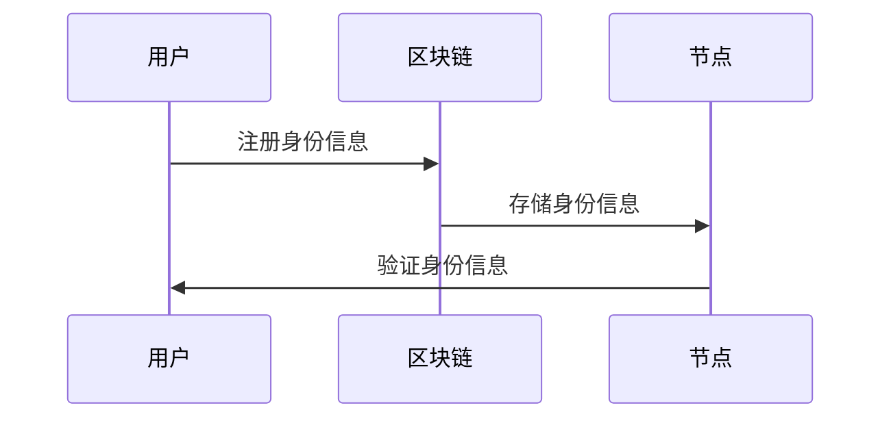
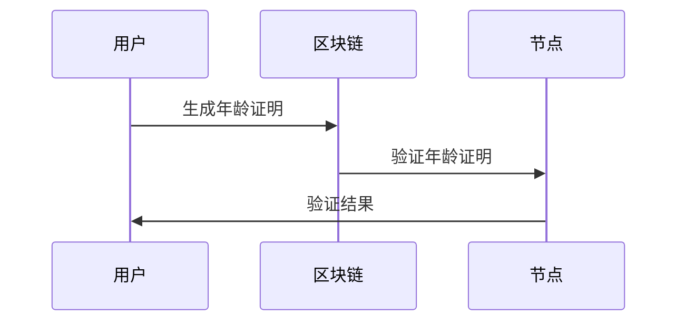
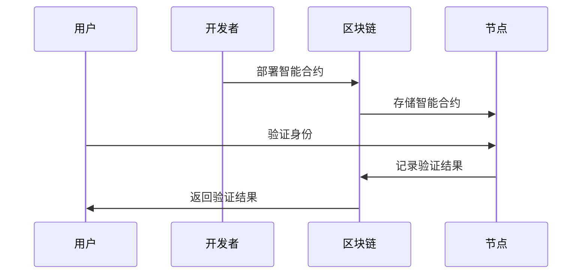
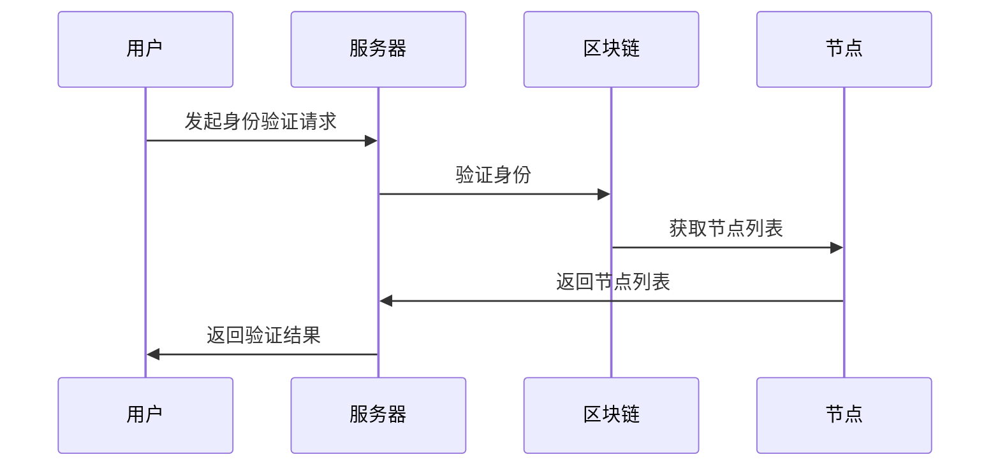
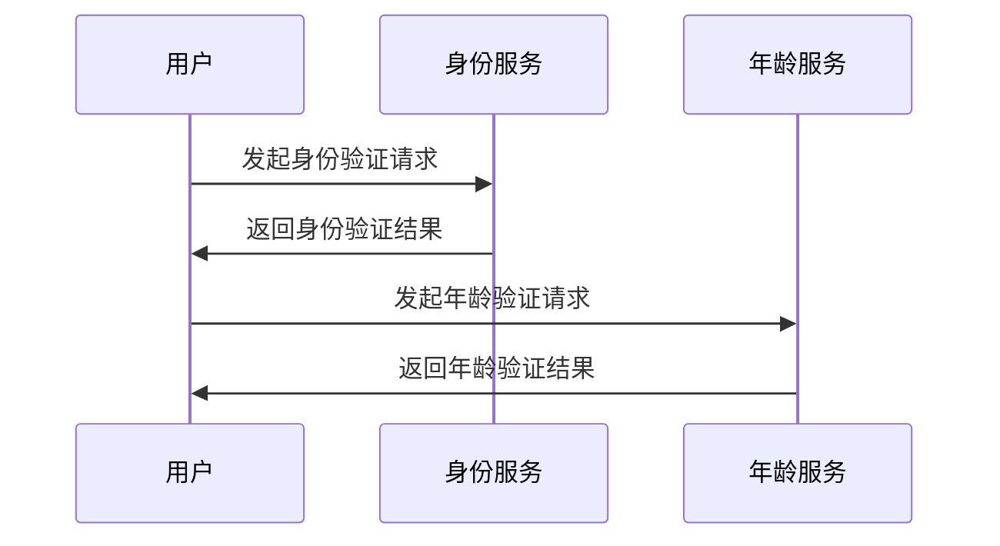
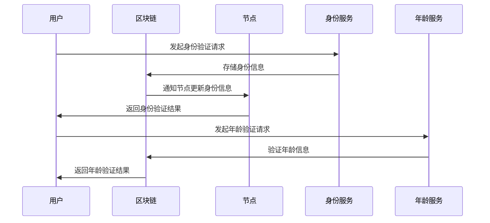

                 

# 区块链在数字身份年龄验证中的隐私保护

> 关键词：区块链、数字身份验证、年龄验证、隐私保护、智能合约

> 摘要：本文将探讨区块链技术在数字身份验证和年龄验证中的应用，特别是如何保护用户的隐私。通过分析区块链的基本概念、数字身份验证和年龄验证的关键要素，以及零知识证明和智能合约的工作原理，本文将逐步解释如何利用区块链技术实现隐私保护的数字身份和年龄验证。

## 第一部分：背景介绍

### 1.1 问题背景

在当今数字化时代，个人隐私保护问题日益突出。尤其在涉及数字身份验证和年龄验证等敏感操作时，如何确保用户的隐私不受侵犯成为了一个重要的研究课题。传统的中心化身份验证系统往往存在数据泄露和滥用风险，无法提供充分的隐私保护。

### 1.2 问题描述

区块链技术的出现，为解决这一问题提供了新的可能性。区块链的去中心化特性、数据不可篡改性和智能合约功能，使其在隐私保护领域具有独特的优势。通过区块链技术，可以实现对用户身份信息的加密存储和授权访问，从而保护用户的隐私。

#### 1.2.1 隐私保护需求

1. **确保身份信息的保密性**：用户在注册和使用数字服务时，往往需要提供一系列个人信息，如姓名、身份证号、手机号码等。这些信息如果被未经授权的第三方获取，可能会导致隐私泄露和个人财产损失。
2. **防止身份信息的篡改**：在传统的中心化系统中，数据容易被篡改，用户无法确保其信息的真实性。区块链的数据不可篡改性可以解决这个问题。

#### 1.2.2 验证过程需求

1. **高效性**：在数字身份验证过程中，需要快速、准确地验证用户的身份，以保证服务的流畅性。
2. **自动化**：智能合约可以实现验证过程的自动化，减少人工干预，提高效率。

### 1.3 问题解决

区块链技术在数字身份验证和年龄验证中的隐私保护问题，可以通过以下方法解决：

1. **加密存储**：将用户的身份信息和年龄信息加密存储在区块链上，确保数据的安全性。
2. **零知识证明**：利用零知识证明技术，允许用户在不透露实际信息的情况下，证明自己的身份和年龄。
3. **智能合约**：通过智能合约实现身份验证和年龄验证过程，确保过程透明、可信。

#### 1.4 边界与外延

- **边界**：本文主要关注区块链在数字身份验证和年龄验证中的隐私保护应用，不涉及其他领域的区块链应用。
- **外延**：虽然本文主要关注区块链的应用，但也可以借鉴其他隐私保护技术，如同态加密、差分隐私等，来提高隐私保护效果。

#### 1.5 概念结构与核心要素组成

- **区块链**：分布式账本技术，记录交易数据，实现去中心化存储。
- **数字身份验证**：确认用户身份的真实性和有效性。
- **年龄验证**：验证用户的年龄信息，确保合法合规。
- **加密存储**：将数据加密存储，保护数据安全性。
- **零知识证明**：一种证明机制，允许用户在不透露实际信息的情况下，证明某些信息的真实性。
- **智能合约**：自动执行合同的计算机程序，实现自动化验证过程。

## 第二部分：核心概念与联系

### 2.1 区块链的基本概念与特点

#### 2.1.1 区块链的定义

区块链是一种分布式数据库系统，它通过加密算法和共识机制，确保数据的不可篡改性和安全性。区块链上的数据被分成多个区块，这些区块按时间顺序连接成一个链。

#### 2.1.2 区块链的特点

1. **去中心化**：区块链没有中央控制节点，数据由全网共同维护，减少了单点故障的风险。
2. **数据不可篡改**：一旦数据上链，就很难被篡改，保证了数据的可信度。
3. **安全性高**：区块链利用密码学技术保护数据安全，包括哈希函数、数字签名等。
4. **透明度高**：所有交易数据都可被全网查看，增加了透明度。

### 2.2 数字身份验证

#### 2.2.1 数字身份验证的定义

数字身份验证是指通过技术手段，验证用户在数字世界的身份，确保其真实性和合法性。数字身份验证通常包括用户名、密码、生物识别等多种认证方式。

#### 2.2.2 数字身份验证的关键要素

1. **身份信息**：如用户名、密码、身份证号等。
2. **认证方式**：如密码认证、生物识别等。
3. **安全认证**：确保身份信息的真实性和隐私性。

### 2.3 年龄验证

#### 2.3.1 年龄验证的定义

年龄验证是指确认用户是否达到了法定年龄，确保其行为合法合规。年龄验证通常需要用户提供身份证、护照等证件上的出生日期信息。

#### 2.3.2 年龄验证的关键要素

1. **身份信息**：如身份证号、出生日期等。
2. **验证方式**：如人脸识别、证件识别等。
3. **合规性**：确保验证结果符合相关法律法规。

### 2.4 零知识证明

#### 2.4.1 零知识证明的定义

零知识证明是一种密码学技术，允许一方（证明者）向另一方（验证者）证明某个陈述是正确的，而无需透露任何具体信息。零知识证明的核心思想是“零知识”，即证明者不泄露任何关于证明信息的内容。

#### 2.4.2 零知识证明的特点

1. **隐私性**：证明者无需透露具体信息。
2. **可靠性**：验证者可以确信证明者是真实的。

### 2.5 智能合约

#### 2.5.1 智能合约的定义

智能合约是一种自动执行的合同，通过区块链网络验证和执行。智能合约的执行基于预先定义的规则和条件，一旦满足条件，合约会自动执行。

#### 2.5.2 智能合约的特点

1. **自动执行**：无需人工干预，提高效率。
2. **透明性**：合同条款公开透明，可被全网查看。
3. **安全性**：利用区块链技术保障合同执行的安全。

## 第三部分：算法原理讲解

### 3.1 区块链在数字身份验证中的应用

#### 3.1.1 基本原理

区块链技术通过分布式账本和加密算法，确保数字身份信息的安全性和不可篡改性。数字身份验证的过程可以概括为以下步骤：

1. **注册**：用户在区块链网络中注册身份信息，这些信息会被加密存储在区块链上。
2. **身份验证**：当用户需要验证身份时，区块链网络中的节点会验证其身份信息。
3. **加密传输**：为了确保隐私，身份信息在传输过程中会被加密。

#### 3.1.2 Mermaid 流程图



### 3.2 零知识证明在年龄验证中的应用

#### 3.2.1 基本原理

零知识证明技术允许用户在不透露实际信息的情况下，证明自己的身份和年龄。年龄验证的过程可以概括为以下步骤：

1. **用户证明**：用户使用零知识证明技术，生成一个证明，证明自己达到了法定年龄。
2. **验证**：区块链网络中的节点验证用户的证明，确认其年龄。

#### 3.2.2 Mermaid 流程图



### 3.3 智能合约在身份验证中的应用

#### 3.3.1 基本原理

智能合约是一种自动执行的合同，它可以确保身份验证过程的透明性和可信性。身份验证的过程可以概括为以下步骤：

1. **合同编写**：开发人员编写智能合约，定义身份验证的规则和条件。
2. **部署**：将智能合约部署到区块链网络中。
3. **验证**：用户通过智能合约进行身份验证，验证结果自动记录在区块链上。

#### 3.3.2 Mermaid 流程图



## 第四部分：系统分析与架构设计方案

### 4.1 问题场景介绍

在数字世界，许多服务都需要进行身份验证和年龄验证，如在线购物、金融交易、娱乐平台等。然而，传统的身份验证和年龄验证系统往往存在隐私泄露和效率低下的问题。

### 4.2 项目介绍

为了解决上述问题，我们设计了一个基于区块链的数字身份验证和年龄验证系统，旨在提供高效、安全的身份验证服务。

### 4.3 系统功能设计

#### 4.3.1 领域模型

```mermaid
classDiagram
    User <<类>> {
        姓名 : String
        身份证号 : String
        年龄 : Integer
    }
    Identity <<类>> {
        身份认证信息 : String
    }
    Age <<类>> {
        出生日期 : Date
    }
    Blockchain <<类>> {
        区块 : List<Block>
    }
    Node <<类>> {
        地址 : String
        节点列表 : List<Node>
    }
    User <.. Identity
    User <.. Age
    Blockchain .. Node
    Node .. Node
```

#### 4.3.2 类图

```mermaid
classDiagram
    User <<类>> {
        +姓名 : String
        +身份证号 : String
        +年龄 : Integer
    }
    Identity <<类>> {
        +身份认证信息 : String
    }
    Age <<类>> {
        +出生日期 : Date
    }
    Blockchain <<类>> {
        +区块 : List<Block>
    }
    Node <<类>> {
        +地址 : String
        +节点列表 : List<Node>
    }
    User <.. Identity
    User <.. Age
    Blockchain .. Node
    Node .. Node
```

### 4.4 系统架构设计



### 4.5 系统接口设计



### 4.6 系统交互



## 第五部分：项目实战

### 5.1 环境安装

为了实现本文中描述的区块链数字身份和年龄验证系统，我们需要安装以下环境：

1. **Node.js**：用于构建和运行区块链节点。
2. **Ganache**：用于创建本地以太坊节点，方便开发和测试。
3. **Truffle**：用于管理和部署智能合约。

### 5.2 系统核心实现源代码

```javascript
// Identity.sol
pragma solidity ^0.8.0;

contract Identity {
    mapping(address => string) public identities;

    function register(string memory id) public {
        identities[msg.sender] = id;
    }

    function verify(address user) public view returns (string memory) {
        return identities[user];
    }
}

// AgeProof.sol
pragma solidity ^0.8.0;

import "https://github.com/OpenZeppelin/openzeppelin-solidity/contracts/math/SafeMath.sol";

contract AgeProof {
    using SafeMath for uint256;

    mapping(address => uint256) public ages;

    function setAge(address user, uint256 age) public {
        ages[user] = age;
    }

    function proveAge(address user, uint256 age) public view returns (bool) {
        return ages[user] == age;
    }
}
```

### 5.3 代码应用解读与分析

#### 5.3.1 Identity 合约解析

1. **register 函数**：用户可以通过调用 `register` 函数注册身份信息，这些信息将存储在区块链上，并可以被验证。
2. **verify 函数**：外部调用者可以通过调用 `verify` 函数来验证用户的身份信息。

#### 5.3.2 AgeProof 合约解析

1. **setAge 函数**：用户可以通过调用 `setAge` 函数设置自己的年龄信息，这些信息也将存储在区块链上。
2. **proveAge 函数**：外部调用者可以通过调用 `proveAge` 函数来验证用户的年龄信息。

### 5.4 实际案例分析和详细讲解剖析

假设有一个用户小明，他在区块链系统中注册了身份信息和年龄信息。当他想要购买一瓶酒时，商家会调用区块链验证小明的身份和年龄信息。

1. **身份验证**：商家调用 `verify` 函数，验证小明的身份信息。如果验证成功，商家将允许小明购买酒。
2. **年龄验证**：商家调用 `proveAge` 函数，验证小明的年龄信息。如果小明未满法定饮酒年龄，商家将拒绝销售酒给小明。

### 5.5 项目小结

通过本文的介绍，我们可以看到区块链技术在数字身份验证和年龄验证中的应用具有巨大的潜力。区块链的加密存储和去中心化特性，为用户提供了高效的隐私保护手段。智能合约的引入，使得身份验证和年龄验证过程更加自动化和可信。

## 第六部分：最佳实践 Tips、小结、注意事项、拓展阅读

### 6.1 最佳实践 Tips

1. **身份信息加密**：在存储用户身份信息时，应采用高级加密算法，如 AES-256，确保数据的安全性。
2. **零知识证明的应用**：在需要验证用户隐私信息时，应优先考虑使用零知识证明技术，以保护用户的隐私。
3. **智能合约的安全性**：在编写智能合约时，应进行严格的测试和审查，确保合约的可靠性和安全性。

### 6.2 小结

本文详细介绍了区块链在数字身份验证和年龄验证中的应用，探讨了如何利用区块链的加密存储、零知识证明和智能合约功能，实现隐私保护的数字身份和年龄验证。

### 6.3 注意事项

1. **隐私保护**：在设计和实施区块链身份验证系统时，应高度重视用户隐私保护，确保数据的安全性和完整性。
2. **法律法规遵循**：在实施区块链身份验证和年龄验证系统时，应确保符合相关法律法规，确保系统的合规性。

### 6.4 拓展阅读

1. **区块链技术原理**：深入了解区块链的基本原理和技术细节，有助于更好地理解和应用区块链技术。
2. **智能合约开发**：学习智能合约的开发和部署，掌握如何利用智能合约实现自动化和可信的验证过程。
3. **零知识证明**：深入研究零知识证明技术，了解其原理和应用场景，以更好地保护用户隐私。

## 第七部分：作者信息

作者：AI天才研究院/AI Genius Institute & 禅与计算机程序设计艺术 /Zen And The Art of Computer Programming

