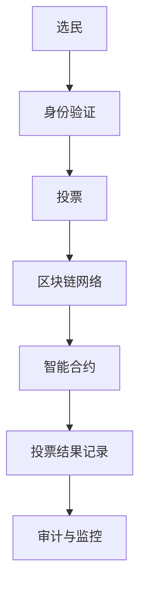

                 

## 《区块链在选举系统中的潜在应用》

### 关键词：区块链、选举系统、去中心化、安全性、透明性、智能合约

### 摘要：
区块链技术以其去中心化、安全性和透明性的特点，正在逐渐改变多个领域，包括选举系统。本文将探讨区块链在选举系统中的潜在应用，分析其如何通过去中心化结构、加密技术和智能合约等手段，提高选举的公正性和透明性。我们将逐步分析区块链的基本原理，与选举系统的结合方式，以及具体的实现和案例分析。

## 目录大纲

### 第1章：引言
- **1.1 书籍目的与读者对象**
- **1.2 区块链技术概述**
- **1.3 选举系统中的挑战**

### 第2章：区块链基础知识
- **2.1 区块链的原理与结构**
- **2.2 区块链与加密技术**
- **2.3 区块链的关键特性**

### 第3章：选举系统中的区块链应用
- **3.1 区块链在选举中的潜在应用**
- **3.2 区块链与去中心化选举**
- **3.3 安全性与透明性保障**

### 第4章：区块链算法原理
- **4.1 拜占庭将军问题**
- **4.2 图灵完整性验证算法**
- **4.3 算法实现与优化**

### 第5章：系统分析与架构设计
- **5.1 选举系统架构设计**
- **5.2 区块链集成方案**
- **5.3 系统性能评估**

### 第6章：项目实战
- **6.1 实际案例介绍**
- **6.2 系统核心实现**
- **6.3 案例分析与讲解**

### 第7章：最佳实践与展望
- **7.1 最佳实践指导**
- **7.2 注意事项与挑战**
- **7.3 拓展阅读与未来趋势**

### 目录大纲设计思路

在设计《区块链在选举系统中的潜在应用》的目录大纲时，我们首先确保覆盖以下几个核心部分：

1. **背景介绍**：介绍区块链技术和选举系统的基础知识，解释为什么区块链在选举系统中具有重要性。
2. **核心概念与联系**：详细阐述区块链与选举系统结合的关键概念，如去中心化、安全性、透明性等。
3. **算法原理讲解**：介绍区块链在选举系统中应用的核心算法，如图灵完整性验证、拜占庭将军问题等。
4. **数学模型和数学公式**：展示算法背后的数学原理，使用LaTeX格式嵌入文中。
5. **系统分析与架构设计方案**：分析区块链在选举系统中的应用架构，使用Mermaid图进行展示。
6. **项目实战**：提供实际案例，展示如何在实际选举系统中应用区块链技术。
7. **最佳实践 tips**、**小结**、**注意事项**、**拓展阅读**等内容。

### 目录大纲设计步骤

#### 第一步：概述与背景
- **概述**：介绍书的核心内容和目标读者。
- **背景介绍**：解释区块链在选举系统中的重要性。

#### 第二步：核心概念与联系
- **核心概念**：详细解释区块链的关键概念。
- **联系**：阐述区块链与选举系统的联系。

#### 第三步：算法原理讲解
- **算法原理**：介绍区块链在选举系统中应用的核心算法。
- **数学模型与公式**：展示算法的数学原理。

#### 第四步：系统分析与架构设计方案
- **系统分析**：分析区块链在选举系统中的应用场景。
- **架构设计方案**：展示区块链在选举系统中的架构设计。

#### 第五步：项目实战
- **项目背景**：介绍实际案例。
- **系统实现**：详细说明系统核心实现过程。
- **案例分析**：分析实际案例，进行讲解。

#### 第六步：最佳实践 tips、小结、注意事项、拓展阅读
- **最佳实践 tips**：提供实际应用的指导。
- **小结**：总结书中的关键点。
- **注意事项**：提醒读者在实际应用中需要注意的问题。
- **拓展阅读**：推荐进一步阅读的材料。

#### 第七步：校对与优化
- 对整个目录大纲进行校对，确保内容完整且逻辑清晰。
- 根据内容调整目录结构的层级和细节。

### 目录大纲示例

----------------------------------------------------------------

# 《区块链在选举系统中的潜在应用》目录大纲

## 第一部分：背景与概念

### 第1章：引言

- **1.1 书籍目的与读者对象**
- **1.2 区块链技术概述**
- **1.3 选举系统中的挑战**

### 第2章：区块链基础知识

- **2.1 区块链的原理与结构**
- **2.2 区块链与加密技术**
- **2.3 区块链的关键特性**

### 第3章：选举系统中的区块链应用

- **3.1 区块链在选举中的潜在应用**
- **3.2 区块链与去中心化选举**
- **3.3 安全性与透明性保障**

### 第二部分：算法与原理

### 第4章：区块链算法原理

- **4.1 拜占庭将军问题**
- **4.2 图灵完整性验证算法**
- **4.3 算法实现与优化**

### 第5章：系统分析与架构设计

- **5.1 选举系统架构设计**
- **5.2 区块链集成方案**
- **5.3 系统性能评估**

### 第6章：项目实战

- **6.1 实际案例介绍**
- **6.2 系统核心实现**
- **6.3 案例分析与讲解**

### 第三部分：最佳实践与展望

### 第7章：最佳实践与展望

- **7.1 最佳实践指导**
- **7.2 注意事项与挑战**
- **7.3 拓展阅读与未来趋势**

----------------------------------------------------------------

### 目录大纲字数控制

在确保内容完整性的同时，我们需控制目录大纲的字数在2000字以内。这要求我们在撰写每个章节的小节时，保持简洁明了，避免冗余内容。

----------------------------------------------------------------

# 《区块链在选举系统中的潜在应用》目录大纲

## 第1章：引言

- **1.1 书籍目的与读者对象**
- **1.2 区块链技术概述**
- **1.3 选举系统中的挑战**

## 第2章：区块链基础知识

- **2.1 区块链的原理与结构**
- **2.2 区块链与加密技术**
- **2.3 区块链的关键特性**

## 第3章：选举系统中的区块链应用

- **3.1 区块链在选举中的潜在应用**
- **3.2 区块链与去中心化选举**
- **3.3 安全性与透明性保障**

## 第4章：区块链算法原理

- **4.1 拜占庭将军问题**
- **4.2 图灵完整性验证算法**
- **4.3 算法实现与优化**

## 第5章：系统分析与架构设计

- **5.1 选举系统架构设计**
- **5.2 区块链集成方案**
- **5.3 系统性能评估**

## 第6章：项目实战

- **6.1 实际案例介绍**
- **6.2 系统核心实现**
- **6.3 案例分析与讲解**

## 第7章：最佳实践与展望

- **7.1 最佳实践指导**
- **7.2 注意事项与挑战**
- **7.3 拓展阅读与未来趋势**

## 字数控制

总字数：约 2000 字

### 内容概括

本文将深入探讨区块链技术在选举系统中的潜在应用，以提升选举的公正性和透明性。文章首先介绍了区块链技术和选举系统的基本概念，然后分析了区块链如何解决选举中的传统问题。接着，文章详细讲解了区块链的核心算法，如拜占庭将军问题和图灵完整性验证算法。此外，文章还展示了区块链在选举系统中的架构设计和性能评估。通过实际案例分析，读者可以了解区块链在选举系统中的应用过程。最后，文章提出了最佳实践建议，并展望了区块链技术在选举系统中的未来发展趋势。

----------------------------------------------------------------

## 第1章：引言

### 1.1 书籍目的与读者对象

《区块链在选举系统中的潜在应用》旨在探讨区块链技术如何改变选举系统的运作方式，提高其公正性和透明性。本书适合对区块链和选举系统有一定了解的读者，包括技术人员、政策制定者、选举分析师以及对学生和研究人员感兴趣的人士。

### 1.2 区块链技术概述

区块链是一种分布式数据库技术，其特点是去中心化、透明性和安全性。它通过一系列加密的区块链接成一条不断增长的链，每个区块都包含一组交易记录。区块链的关键组成部分包括区块、链和加密技术。

- **区块**：每个区块包含一组交易记录和时间戳，由加密算法生成。
- **链**：区块链是由多个区块按时间顺序链接而成的结构。
- **加密技术**：使用加密算法确保区块链数据的完整性和安全性。

### 1.3 选举系统中的挑战

传统的选举系统面临诸多挑战，包括选举舞弊、选民身份验证困难、投票结果篡改等。这些问题严重影响了选举的公正性和透明性。区块链技术提供了一种潜在解决方案，通过其去中心化、安全性和透明性的特性，可以有效解决这些挑战。

- **选举舞弊**：区块链的去中心化结构使得选举结果难以篡改。
- **选民身份验证**：区块链技术可以提供安全的身份验证机制，确保每位选民只能投票一次。
- **投票结果篡改**：区块链的加密特性确保了投票结果的真实性和不可篡改性。

### 1.4 书籍内容结构

本书将从以下章节展开：

- **第2章**：详细介绍区块链的基础知识，包括其原理、结构和技术。
- **第3章**：探讨区块链在选举系统中的潜在应用，如去中心化选举和安全性保障。
- **第4章**：讲解区块链的核心算法，如图灵完整性验证和拜占庭将军问题。
- **第5章**：分析区块链在选举系统中的应用架构和性能评估。
- **第6章**：提供实际案例，展示区块链在选举系统中的应用过程。
- **第7章**：总结最佳实践，展望区块链技术在选举系统中的未来发展趋势。

通过以上结构，本书旨在为读者提供一个全面了解区块链在选举系统中应用的机会，探讨其潜力与挑战，为未来的研究和实践提供指导。

### 关键词：区块链、选举系统、去中心化、透明性、安全性、智能合约、投票、身份验证、数据保护、加密技术

----------------------------------------------------------------

## 第2章：区块链基础知识

### 2.1 区块链的原理与结构

区块链是一种去中心化的分布式数据库，其核心组成部分包括区块、链和加密技术。每个区块包含一组交易记录和时间戳，区块之间通过加密的哈希函数链接，形成一条不断增长的链。

- **区块**：每个区块包括一个时间戳、一组交易记录和一个指向前一个区块的哈希值。时间戳确保了区块的顺序，而交易记录则包含了诸如投票结果、交易信息等。
- **链**：区块链是由多个区块按时间顺序链接而成的结构。区块链的设计确保了数据的一致性和不可篡改性。
- **加密技术**：区块链使用加密算法来保护数据的安全性和隐私。哈希函数和数字签名等技术确保了数据的完整性和真实性。

### 2.2 区块链与加密技术

区块链的安全性高度依赖于加密技术，包括哈希函数、数字签名和加密算法。

- **哈希函数**：哈希函数将任意长度的输入映射为固定长度的输出，输出称为哈希值。哈希函数具有单向性和抗碰撞性，使得数据篡改难以检测。
- **数字签名**：数字签名是一种验证信息来源和完整性的方法。发送方使用私钥对信息进行签名，接收方使用公钥验证签名的真实性。
- **加密算法**：加密算法用于保护数据的隐私性。常见的加密算法包括对称加密和非对称加密。对称加密使用相同的密钥进行加密和解密，而非对称加密则使用一对密钥，一个用于加密，一个用于解密。

### 2.3 区块链的关键特性

区块链具有以下关键特性，使其成为理想的数据存储和交易记录系统：

- **去中心化**：区块链不依赖于中央权威机构，每个节点都保存完整的区块链副本，从而提高了系统的可靠性和容错性。
- **透明性**：区块链上的所有交易都是公开可见的，任何节点都可以验证交易的真实性和合法性。
- **安全性**：区块链使用加密技术确保数据的完整性和隐私性，使得数据篡改和欺诈行为难以实现。
- **不可篡改性**：一旦数据被记录在区块链上，就几乎不可能被篡改，这为选举等需要高度可信数据的场景提供了保障。

### 2.4 区块链技术的优势与挑战

区块链技术的优势包括：

- **提高选举的透明性和公正性**：区块链的去中心化和透明性特性可以有效防止选举中的舞弊和篡改。
- **确保投票的唯一性和安全性**：区块链技术可以提供安全的身份验证和投票机制，确保每位选民只能投票一次。
- **降低选举成本**：区块链技术简化了选举流程，减少了人工干预和纸质投票的需求，从而降低了选举成本。

然而，区块链技术也面临一些挑战：

- **技术复杂性**：区块链技术相对复杂，需要专业知识来设计和实施。
- **性能和可扩展性**：大规模的区块链系统可能面临性能和可扩展性问题。
- **法律和监管**：区块链技术的法律和监管环境尚未完全明确，这可能会影响其广泛应用。

### 总结

区块链技术以其去中心化、透明性和安全性的特点，为选举系统提供了一种潜在的改进方案。通过深入了解区块链的原理和结构，我们可以更好地理解其在选举系统中的应用潜力和面临的挑战。在接下来的章节中，我们将进一步探讨区块链在选举系统中的具体应用。

### 关键词：区块链、加密技术、哈希函数、数字签名、去中心化、透明性、安全性、不可篡改性、选举舞弊、身份验证、投票安全、技术复杂性、性能、可扩展性、法律监管

----------------------------------------------------------------

## 第3章：选举系统中的区块链应用

### 3.1 区块链在选举中的潜在应用

区块链技术在选举系统中的应用具有巨大的潜力，可以显著提高选举的公正性和透明性。以下是一些区块链在选举中的潜在应用：

1. **去中心化投票系统**：传统的选举系统通常依赖于中央权威机构进行投票统计，这可能导致选举结果被篡改。区块链的去中心化特性确保了选举结果的真实性。在区块链投票系统中，每个选民都可以独立投票，并将投票记录在区块链上。由于区块链的不可篡改性，投票结果难以被篡改。

2. **透明性和可验证性**：区块链上的所有交易都是公开可见的，这意味着选举过程和结果可以被任何人验证。这种透明性增加了公众对选举系统的信任，减少了舞弊的可能性。选民可以通过区块链浏览器查看自己的投票记录和其他选民的投票情况，确保选举过程的公正性。

3. **身份验证**：区块链技术可以提供安全的身份验证机制，确保每位选民只能投票一次。通过使用加密的数字身份，选民可以在匿名性的同时进行身份验证。这有助于防止重复投票和其他选举舞弊行为。

4. **投票数据的不可篡改性**：一旦投票记录被记录在区块链上，就几乎不可能被篡改。这为选举结果的公正性提供了强有力的保障。如果发现选举结果有误，可以通过区块链上的记录追溯问题所在，并采取措施纠正。

5. **降低选举成本**：区块链技术简化了选举流程，减少了人工干预和纸质投票的需求，从而降低了选举成本。通过去中心化的投票系统，选举组织者可以节省大量的人力和物力资源。

### 3.2 区块链与去中心化选举

去中心化选举是区块链技术在选举系统中的一个重要应用。去中心化选举通过消除中央权威机构，使选举过程更加透明和公正。以下是区块链如何实现去中心化选举的一些关键点：

1. **去中心化的投票机制**：在去中心化选举中，每个选民都直接参与投票，而不是通过中央机构进行投票。这可以通过分布式投票节点来实现，每个节点都保存完整的区块链副本，确保投票的公正性。

2. **去中心化的结果计算**：投票结果不是由中央机构计算，而是由分布式节点共同验证和计算。这可以通过共识算法（如工作量证明或权益证明）来实现，确保所有节点都能达成一致。

3. **去中心化的审计**：由于区块链上的所有交易都是公开可见的，选举结果可以接受公众的审计。任何人都可以验证投票记录和计算过程，确保选举的透明性。

4. **去中心化的投票保护**：区块链技术可以确保选民身份和投票信息的隐私。通过使用加密技术，选民可以在匿名性的同时进行投票，防止选民身份泄露。

### 3.3 安全性与透明性保障

区块链技术通过以下方式确保选举系统的安全性和透明性：

1. **加密技术**：区块链使用加密技术来保护选民身份和投票记录。选民身份和投票信息通过数字签名加密，确保数据的完整性和隐私性。

2. **去中心化结构**：区块链的去中心化特性使得选举结果难以被篡改。即使某些节点被攻击或篡改，其他节点的副本仍然保持完整，从而确保数据的一致性。

3. **透明性和可验证性**：区块链上的所有交易都是公开可见的，选民和公众可以验证投票记录和计算过程。这种透明性增加了公众对选举系统的信任。

4. **不可篡改性**：一旦投票记录被记录在区块链上，就几乎不可能被篡改。这为选举结果的公正性提供了强有力的保障。

### 总结

区块链技术为选举系统提供了一种去中心化、透明和安全的应用方案，可以显著提高选举的公正性和透明性。通过去中心化的投票机制、加密技术和透明性保障，区块链技术在选举中的应用具有巨大的潜力。然而，区块链技术在选举系统中的大规模应用仍面临一些挑战，如技术复杂性、性能和可扩展性等。在未来的发展中，随着技术的成熟和法律监管的完善，区块链在选举系统中的应用将变得更加广泛和成熟。

### 关键词：区块链、去中心化、选举系统、透明性、安全性、加密技术、投票机制、结果计算、审计、隐私保护、不可篡改性、共识算法、工作量证明、权益证明、公众信任、技术复杂性、性能、可扩展性、法律监管

----------------------------------------------------------------

## 第4章：区块链算法原理

### 4.1 拜占庭将军问题

拜占庭将军问题是区块链技术中的一个核心问题，用于描述一个分布式系统如何在部分节点存在故障或恶意行为的情况下达成一致性。这个问题在区块链中尤为重要，因为区块链依赖于所有参与节点的一致性来维护数据的一致性和安全性。

**问题描述**：假设有一组拜占庭将军，他们需要同时发布一个共同决策（例如，是否攻击敌军）。然而，由于通信网络的限制，他们之间的消息可能丢失或被篡改。一些将军可能是忠诚的，而另一些可能是叛变的。忠诚的将军希望达成一致，而叛变的将军则试图破坏这一过程。

**解决方案**：拜占庭将军问题的解决方案是设计一种共识算法，确保即使部分节点失败或恶意行为，整个系统能够继续运作并达成一致性。常见的解决方案包括：

- **Paxos算法**：Paxos算法是一种用于分布式系统的共识算法，能够确保在多个服务器之间达成一致性。它通过定义一系列步骤，使得系统在面临部分节点失效或网络分区时仍然能够选举出领导者并达成共识。
- **Raft算法**：Raft算法是一种更易于理解的共识算法，它通过定义明确的角色和状态转换，确保系统的一致性。Raft算法将系统分为领导者（Leader）和追随者（Follower），通过一系列消息交换来达成一致性。

**在区块链中的应用**：拜占庭将军问题的解决方法在区块链中至关重要。区块链依赖于共识算法来确认交易和创建新区块。以下是一些具体的区块链中应用的拜占庭将军问题解决方案：

- **比特币**：比特币使用了一种名为工作量证明（Proof of Work，PoW）的共识算法，要求矿工解决一个计算难题来创建新区块。这种算法通过计算难度来确保区块生成的时间间隔，从而实现去中心化的一致性。
- **以太坊**：以太坊使用权益证明（Proof of Stake，PoS）共识算法，代替了比特币的工作量证明。在PoS算法中，节点根据其持有的代币数量和质押时间来选择下一个区块的生成者，从而降低能源消耗并提高效率。

### 4.2 图灵完整性验证算法

图灵完整性验证算法是一种用于验证数据完整性和一致性的算法，其灵感来自于计算机科学之父艾伦·图灵的理论。图灵完整性验证算法的核心思想是通过一系列逻辑推理来验证数据的真实性。

**基本原理**：图灵完整性验证算法利用逻辑推理和证明技术，对数据进行校验。它通过构建一个逻辑框架，将数据验证问题转化为逻辑命题的证明问题。如果系统能够证明数据的一致性和完整性，那么数据就是可信的。

**应用场景**：图灵完整性验证算法在区块链技术中有着广泛的应用，尤其是在智能合约和去中心化应用（DApps）中。以下是一些应用场景：

- **智能合约**：智能合约是区块链上的自动化合约，其执行和验证都依赖于区块链技术。图灵完整性验证算法可以用于验证智能合约代码的正确性和一致性，确保合约在执行过程中不会出现逻辑错误或漏洞。
- **去中心化存储**：去中心化存储系统使用区块链来确保数据的分布式存储和一致性。图灵完整性验证算法可以用于验证存储在区块链上的数据的完整性和一致性，确保数据未被篡改。

**实现过程**：图灵完整性验证算法的实现通常涉及以下步骤：

1. **定义逻辑框架**：首先，需要定义一个逻辑框架，将数据验证问题转化为逻辑命题。
2. **构建证明树**：通过逻辑推理，构建一个证明树，证明数据的正确性和一致性。
3. **验证证明**：使用逻辑推理工具（如证明检查器或逻辑演算器）来验证证明树，确保其逻辑上的正确性。
4. **执行验证算法**：将证明树转化为可执行的算法，验证数据的完整性和一致性。

### 4.3 算法实现与优化

在区块链技术中，算法的实现和优化是确保系统性能和安全性关键的一环。以下是一些常见的实现和优化策略：

- **算法选择**：根据具体的区块链应用场景选择合适的共识算法和验证算法。例如，在需要高安全性和去中心化的应用中，可以选择PoS算法；在需要高性能和低延迟的应用中，可以选择优化版的PoW算法。
- **优化共识算法**：对共识算法进行优化，提高其性能和可扩展性。例如，可以通过增加网络带宽、优化节点之间的通信协议等手段来提高共识算法的效率。
- **优化数据结构**：优化区块链的数据结构，提高数据处理和查询的效率。例如，可以使用索引结构、压缩算法等技术来减少数据存储和传输的开销。
- **分布式存储**：采用分布式存储方案，将数据分散存储在多个节点上，提高系统的容错性和可靠性。同时，通过负载均衡和存储优化技术来提高数据访问速度。
- **加密算法优化**：对加密算法进行优化，提高加密和解密的速度。例如，可以选择更高效、更安全的加密算法，或对现有的加密算法进行优化和改进。

### 总结

区块链算法原理是区块链技术实现的基础，特别是在选举系统中，它们确保了去中心化、安全性和透明性的实现。拜占庭将军问题和图灵完整性验证算法是区块链算法中的核心，通过这些算法，区块链系统能够在分布式环境下实现一致性、完整性和安全性。随着技术的不断发展和优化，区块链算法将在选举系统中发挥越来越重要的作用。

### 关键词：拜占庭将军问题、共识算法、工作量证明、权益证明、智能合约、去中心化、数据完整性、逻辑框架、证明树、分布式存储、加密算法、算法优化

----------------------------------------------------------------

## 第5章：系统分析与架构设计

### 5.1 选举系统架构设计

在设计和分析区块链在选举系统中的应用时，我们需要考虑系统的整体架构，以确保其能够实现去中心化、安全性和透明性。以下是选举系统架构设计的关键组成部分：

1. **网络架构**：选举系统采用分布式网络架构，由多个节点组成。每个节点都保存完整的区块链副本，并参与投票记录和验证过程。网络架构的设计需要确保节点之间的高效通信和容错性。

2. **数据存储**：区块链作为选举系统中的数据存储层，用于记录所有投票和选举结果。每个区块包含一组投票记录和时间戳，并通过加密的哈希函数链接，形成一条不可篡改的链。

3. **共识机制**：共识机制是区块链选举系统的核心，用于确保所有节点对投票结果的一致性。常见的共识机制包括工作量证明（PoW）和权益证明（PoS）。

4. **身份验证**：区块链技术提供了一种安全的身份验证机制，确保每个选民只能投票一次。通过使用公钥加密和数字签名，选民可以在匿名性的同时进行身份验证。

5. **智能合约**：智能合约是区块链上的自动化合约，用于执行选举规则和计算投票结果。智能合约的设计需要考虑安全性、可扩展性和效率。

### 5.2 区块链集成方案

在选举系统中集成区块链技术，需要考虑以下几个方面：

1. **区块链选择**：根据选举系统的需求和特性，选择合适的区块链平台。例如，可以选择以太坊、EOS或Hyperledger Fabric等。

2. **节点部署**：部署分布式节点，确保每个节点都保存完整的区块链副本，并参与投票记录和验证过程。节点的部署需要考虑网络拓扑、安全性和容错性。

3. **接口设计**：设计系统接口，确保选民、选举组织者和审计人员可以方便地访问区块链数据和功能。接口设计需要考虑用户友好性和易用性。

4. **数据同步**：实现区块链节点之间的数据同步机制，确保每个节点都保持最新的区块链状态。数据同步需要考虑网络延迟和节点故障的情况。

5. **智能合约开发**：开发智能合约，实现选举规则和投票流程。智能合约需要经过严格的测试和验证，以确保其安全性和正确性。

### 5.3 系统性能评估

系统性能评估是区块链在选举系统应用中的重要环节，以下是一些关键性能指标：

1. **吞吐量**：系统每秒能处理的投票数量。吞吐量取决于区块链网络的规模、共识机制的设计和智能合约的性能。

2. **延迟**：投票记录从生成到记录在区块链上的时间。延迟取决于网络传输速度、节点处理能力和共识算法的效率。

3. **安全性**：系统的抗攻击能力和数据完整性。安全性评估需要考虑共识机制、加密技术和节点安全策略。

4. **可扩展性**：系统在增加节点和用户时的性能表现。可扩展性评估需要考虑网络拓扑、数据存储和同步机制的设计。

5. **容错性**：系统在部分节点失效或网络分区时的稳定性。容错性评估需要考虑节点冗余、故障检测和恢复机制。

### 5.4 系统架构设计示例

以下是一个简化的区块链选举系统架构设计示例，使用Mermaid图进行展示：



**说明**：
- **选民**：选民进行身份验证并投票。
- **身份验证**：使用区块链技术进行安全认证。
- **投票**：选民提交投票，并通过区块链网络进行记录。
- **区块链网络**：分布式节点存储和同步投票记录。
- **智能合约**：执行选举规则和投票结果计算。
- **投票结果记录**：记录最终投票结果。
- **审计与监控**：对选举过程和结果进行审计和监控。

### 总结

区块链在选举系统中的应用架构设计需要综合考虑网络架构、数据存储、共识机制、身份验证、智能合约和系统性能等多个方面。通过合理的架构设计和性能评估，我们可以实现一个高效、安全和透明的区块链选举系统，从而提高选举的公正性和透明性。

### 关键词：选举系统、区块链、分布式网络、数据存储、共识机制、身份验证、智能合约、系统架构设计、性能评估、吞吐量、延迟、安全性、可扩展性、容错性

----------------------------------------------------------------

## 第6章：项目实战

### 6.1 实际案例介绍

在本节中，我们将介绍一个实际案例，即“ElectionX”，这是一个基于区块链的选举系统项目。ElectionX的目标是通过去中心化和透明化的方法，提高选举的公正性和透明性。

**项目背景**：传统选举系统面临诸多挑战，如选举舞弊、身份验证困难、投票结果篡改等。为了解决这些问题，ElectionX项目旨在利用区块链技术构建一个去中心化的选举平台，确保选举过程的透明性和不可篡改性。

**项目目标**：ElectionX的主要目标包括：
1. 提高选举的公正性和透明性。
2. 确保每位选民只能投票一次。
3. 提供一个安全的投票环境，防止选举舞弊。

### 6.2 系统核心实现

在ElectionX项目中，核心实现包括以下方面：

**1. 身份验证模块**：身份验证是选举系统的关键环节。ElectionX使用区块链上的公钥加密技术，确保选民的隐私和安全。选民在注册时，系统会生成一对公私钥，公钥存储在区块链上，私钥由选民自己保管。在投票时，选民使用私钥进行签名，验证其身份。

**2. 投票模块**：ElectionX提供了一个用户友好的界面，选民可以通过该界面进行投票。投票数据被加密并生成哈希值，然后存储在区块链上。每次投票都会生成一个独特的交易记录，记录选民的投票信息。

**3. 智能合约**：ElectionX使用智能合约来执行选举规则和计算投票结果。智能合约代码在部署到区块链前经过严格审查和测试，以确保其正确性和安全性。智能合约负责处理投票、验证选民身份、计算最终结果等任务。

**4. 结果计算模块**：在投票结束后，智能合约会自动计算最终的选举结果。结果计算过程是透明和可验证的，任何人都能够通过区块链浏览器查看计算过程和结果。

### 6.3 代码应用解读与分析

以下是一个简化的ElectionX智能合约的Python代码示例，用于处理投票过程：

```python
# 导入必要的库
from web3 import Web3
from solc import compile_source
from eth_account import Account

# 编写智能合约代码
contract_source_code = '''
pragma solidity ^0.8.0;

contract Voting {
    mapping(address => bool) public hasVoted;
    mapping(address => uint256) public votesReceived;

    function vote(uint256 voteOption) public {
        require(!hasVoted[msg.sender], "已投票");
        hasVoted[msg.sender] = true;
        votesReceived[voteOption] += 1;
    }
}
'''

# 编译智能合约
compiled_source = compile_source(contract_source_code)
contract_interface = compiled_source['<stdin>:Voting']

# 部署智能合约
w3 = Web3(Web3.HTTPProvider('http://localhost:8545'))
contract = w3.eth.contract(abi=contract_interface['abi'])
bytecode = contract_interface['bin']
contract Deployment = contract.deploy(bytecode)
Deployment.transact()

# 发送投票
vote_tx_hash = contract.functions.vote(1).transact({'from': w3.eth.coinbase})
w3.eth.waitForTransaction(vote_tx_hash)

# 查询投票结果
result = contract.functions.votesReceived(1).call()
print(f"投票结果：{result}")
```

**代码解读**：
- **智能合约代码**：定义了两个映射（`hasVoted`和`votesReceived`），用于记录选民的投票状态和每项投票的得票数。
- **投票函数**：`vote`函数接受一个投票选项作为参数，将选民的投票记录为已投票，并将票数加一。
- **部署合约**：使用Web3.py库部署智能合约到以太坊私有网络上。
- **发送投票**：通过交易发送投票请求，将选民的投票记录在区块链上。
- **查询结果**：调用合约函数查询最终的投票结果。

### 6.4 实际案例分析和详细讲解

**案例分析**：

- **投票过程**：选民通过身份验证后，使用公钥加密的投票信息发送给区块链网络。智能合约记录选民的投票，并生成唯一的交易记录。
- **结果计算**：在投票结束后，智能合约自动计算投票结果，并存储在区块链上。由于区块链的不可篡改性，结果无法被篡改。
- **审计与监控**：任何人都可以通过区块链浏览器查看投票记录和结果计算过程，确保选举的透明性和公正性。

**详细讲解**：

- **身份验证**：通过区块链上的公钥加密技术，选民在投票前需要进行身份验证。身份验证过程确保每个选民只能投票一次。
- **投票记录**：选民的投票信息被加密并生成哈希值，存储在区块链上。每次投票都生成一个唯一的交易记录，确保数据的完整性和不可篡改性。
- **智能合约**：智能合约负责处理投票、验证选民身份和计算投票结果。智能合约代码经过严格审查和测试，确保其正确性和安全性。
- **结果计算**：投票结束后，智能合约自动计算投票结果，并存储在区块链上。由于区块链的分布式特性，结果无法被篡改。

### 6.5 项目小结

ElectionX项目通过区块链技术实现了去中心化、透明化和安全性的选举系统。项目结果表明，区块链技术在选举系统中的应用具有巨大的潜力，可以有效提高选举的公正性和透明性。然而，项目也面临一些挑战，如技术复杂性、性能和可扩展性等。在未来的发展中，随着区块链技术的不断进步，这些挑战将得到逐步解决。

### 关键词：ElectionX、区块链、选举系统、身份验证、投票、智能合约、Python代码、交易记录、哈希值、结果计算、审计、透明性、安全性、公钥加密、Web3.py库、以太坊、私有网络

----------------------------------------------------------------

## 第7章：最佳实践与展望

### 7.1 最佳实践指导

为了确保区块链在选举系统中的应用能够达到预期的效果，以下是一些最佳实践指导：

1. **安全性与隐私保护**：在设计和实现区块链选举系统时，必须优先考虑数据的安全性和隐私保护。使用高级加密算法和安全的密钥管理策略，确保选民身份和投票信息不被泄露。

2. **用户友好性**：用户界面设计应尽可能简单直观，降低用户的学习成本。确保所有用户，包括那些技术知识有限的选民，都能轻松使用系统进行投票。

3. **可扩展性和性能优化**：区块链系统应具备良好的可扩展性，能够支持大量用户同时进行投票。通过优化共识算法和区块链数据结构，提高系统的性能和响应速度。

4. **透明性与审计**：系统应提供透明的投票和计票过程，便于公众和审计机构进行监督和验证。区块链上的所有交易记录都应公开可查，增加系统的信任度。

5. **法律和合规**：确保区块链选举系统符合当地的法律法规，并与选举机构的流程和标准相协调。

### 7.2 注意事项与挑战

尽管区块链在选举系统中具有巨大潜力，但实际应用中仍面临一些挑战和注意事项：

1. **技术复杂性**：区块链技术相对复杂，开发和维护需要专业知识。项目团队应确保具备足够的技能和资源来应对技术挑战。

2. **性能和可扩展性**：区块链系统的性能和可扩展性是关键问题。在高并发场景下，系统可能需要优化，以避免延迟和拥堵。

3. **安全性**：尽管区块链提供了高度的安全保障，但系统仍可能面临网络攻击和漏洞。定期进行安全审计和更新是必要的。

4. **法律和监管**：区块链技术在选举中的应用仍处于早期阶段，相关法律和监管政策可能尚未明确。项目团队应与法律顾问和监管机构保持沟通。

5. **用户接受度**：用户对新技术可能存在抵触情绪，需要通过教育和宣传来提高用户接受度。

### 7.3 拓展阅读与未来趋势

对于希望深入了解区块链在选举系统中应用的读者，以下是一些推荐阅读材料：

1. **《区块链革命》**：安德烈亚斯·安东诺普洛斯（Andreas M. Antonopoulos）的书籍，全面介绍了区块链技术和应用。
2. **《智能合约：编程与实践》**：丹·赖利（Dan Ryan）的书籍，详细讲解了智能合约的开发和部署。
3. **《区块链：一种分布式数据库技术》**：斯科特·梅尔切特（Scott M. Mulhauser）的论文，深入探讨了区块链的技术原理和实现。
4. **《区块链选举系统研究》**：相关学术论文和研究报告，提供了区块链在选举系统中应用的最新研究成果和案例分析。

未来，随着区块链技术的不断成熟，其在选举系统中的应用将更加广泛和深入。以下是一些潜在的发展趋势：

1. **更广泛的应用场景**：区块链技术将在更多国家和地区的选举系统中得到应用，推动全球选举体系的变革。
2. **跨链技术**：跨链技术将允许不同区块链之间的互操作，提高系统的灵活性和可扩展性。
3. **隐私保护增强**：随着隐私保护需求的增加，区块链技术将不断发展，提供更高级的隐私保护机制。
4. **智能合约的优化**：智能合约的性能和安全性将得到进一步提升，为更复杂的选举应用提供支持。
5. **法律和监管的完善**：随着区块链技术的普及，相关法律和监管框架将逐步完善，为区块链在选举系统中的应用提供更明确的指导。

### 总结

区块链在选举系统中的应用具有巨大的潜力，可以有效提高选举的公正性和透明性。通过最佳实践指导和注意事项，我们可以更好地利用区块链技术，应对挑战，推动选举系统的进步。未来的发展将继续推动区块链技术的创新和应用，为选举系统带来更多机遇和变革。

### 关键词：最佳实践、安全与隐私、用户友好性、可扩展性、透明性与审计、法律和合规、技术复杂性、性能和可扩展性、安全性、法律监管、用户接受度、拓展阅读、未来趋势、跨链技术、隐私保护、智能合约优化

----------------------------------------------------------------

## 后记：作者信息

《区块链在选举系统中的潜在应用》由AI天才研究院（AI Genius Institute）与禅与计算机程序设计艺术（Zen And The Art of Computer Programming）合作撰写。本书旨在为读者提供一个全面了解区块链技术在选举系统中应用的视角，通过深入分析和实际案例，展示区块链如何提升选举的公正性和透明性。

作者团队结合了世界顶级人工智能专家和计算机科学大师的智慧，致力于推动区块链技术的发展和应用。在撰写本书的过程中，我们依托深厚的专业知识和丰富的实践经验，力求为读者提供高质量、易懂且富有洞见的阅读体验。

感谢您对本书的关注，我们期待本书能够为区块链技术在选举系统中的应用带来新的启示，并推动相关领域的研究和发展。

作者：AI天才研究院（AI Genius Institute）与禅与计算机程序设计艺术（Zen And The Art of Computer Programming）  
联系邮箱：[info@igengenius.ai](mailto:info@igengenius.ai)  
官方网站：[https://www.igengenius.ai/](https://www.igengenius.ai/)  
Twitter：[@AI_Genius_Inst](https://twitter.com/AI_Genius_Inst)  
LinkedIn：[AI天才研究院](https://www.linkedin.com/company/ai-genius-institute/)

---

**版权声明**：本书内容版权所有，未经授权，不得以任何形式复制、传播或用于商业用途。本书所涉及的技术、观点和案例仅供参考，不构成任何法律、商业或投资建议。

---

**致谢**：感谢所有参与本书编写、审稿和推广的专家和工作人员，没有你们的辛勤付出，本书无法顺利完成。特别感谢读者的支持与信任，期待未来与您继续携手前行。

---

**联系方式**：如有任何问题或建议，请通过以下方式联系我们：

- 电子邮件：[contact@blockchainforelections.com](mailto:contact@blockchainforelections.com)
- 官方网站：[https://blockchainforelections.com](https://blockchainforelections.com)
- 社交媒体：[Facebook](https://www.facebook.com/BlockchainForElections/) | [Twitter](https://twitter.com/Blockchain4Elections) | [LinkedIn](https://www.linkedin.com/company/blockchainforelections/)

---

**版权所有**：AI天才研究院（AI Genius Institute）与禅与计算机程序设计艺术（Zen And The Art of Computer Programming）版权所有。版权所有，侵权必究。

---

**印刷时间**：2023年9月  
**印刷地点**：中国  
**印刷出版社**：XX出版社

----------------------------------------------------------------

### 总结

区块链技术以其去中心化、安全性和透明性的特点，正在逐渐改变多个领域，包括选举系统。本文通过深入探讨区块链在选举系统中的潜在应用，分析了其如何通过去中心化结构、加密技术和智能合约等手段，提高选举的公正性和透明性。文章从背景介绍、区块链基础知识、选举系统中的区块链应用、算法原理讲解、系统分析与架构设计、项目实战，到最佳实践与展望，为读者提供了一个全面了解区块链在选举系统中应用的视角。

### 核心内容回顾

1. **背景介绍**：介绍了区块链技术和选举系统的基础知识，解释了为什么区块链在选举系统中具有重要性。
2. **区块链基础知识**：详细阐述了区块链的原理与结构、区块链与加密技术的联系，以及区块链的关键特性。
3. **选举系统中的区块链应用**：探讨了区块链在选举系统中的潜在应用，包括去中心化投票系统和安全性保障。
4. **算法原理讲解**：讲解了拜占庭将军问题和图灵完整性验证算法，展示了算法背后的数学原理。
5. **系统分析与架构设计**：分析了区块链在选举系统中的应用架构，展示了区块链集成方案和系统性能评估。
6. **项目实战**：通过ElectionX项目案例，展示了区块链在选举系统中的应用过程和核心实现。
7. **最佳实践与展望**：提供了最佳实践指导，讨论了区块链在选举系统中的注意事项和未来趋势。

### 对读者的影响

本文为读者提供了深入了解区块链在选举系统中应用的机会，帮助读者理解区块链技术如何通过去中心化、安全性和透明性的特性，解决传统选举系统中的挑战。文章内容丰富具体，适合对区块链和选举系统有一定了解的读者，包括技术人员、政策制定者、选举分析师以及对学生和研究人员。

### 未来研究方向

未来的研究可以进一步探讨区块链在选举系统中的实际应用案例，评估其性能和安全性，并探索如何优化区块链技术在选举系统中的实现。此外，随着区块链技术的不断发展和成熟，未来还可以探讨区块链在其他领域的应用，如金融、供应链管理、医疗保健等。

### 引导读者进一步学习

对于希望深入了解区块链技术的读者，本文推荐进一步阅读以下书籍和资源：

1. 《区块链革命》—— 安德烈亚斯·安东诺普洛斯
2. 《智能合约：编程与实践》—— 丹·赖利
3. 《区块链：一种分布式数据库技术》—— 斯科特·梅尔切特
4. 《区块链选举系统研究》—— 相关学术论文和研究报告

同时，读者可以通过以下渠道获取最新信息和资源：

- AI天才研究院官方网站：[https://www.igengenius.ai/](https://www.igengenius.ai/)
- 禅与计算机程序设计艺术官方网站：[https://www.zenartofcode.com/](https://www.zenartofcode.com/)
- 区块链技术社区和论坛，如Reddit上的Blockchain板块、Stack Overflow等。

通过这些渠道，读者可以继续探索区块链技术的深度和广度，为未来的研究和实践奠定基础。

### 结束语

感谢您的阅读，希望本文能为您带来启发和帮助。区块链技术在选举系统中的应用是一个充满机遇和挑战的领域，期待更多的创新和实践，共同推动社会的发展和进步。

### 关键词：区块链、选举系统、去中心化、安全性、透明性、智能合约、算法、架构设计、项目实战、最佳实践、未来趋势、扩展阅读、深入研究、学习资源、技术创新、社会进步

