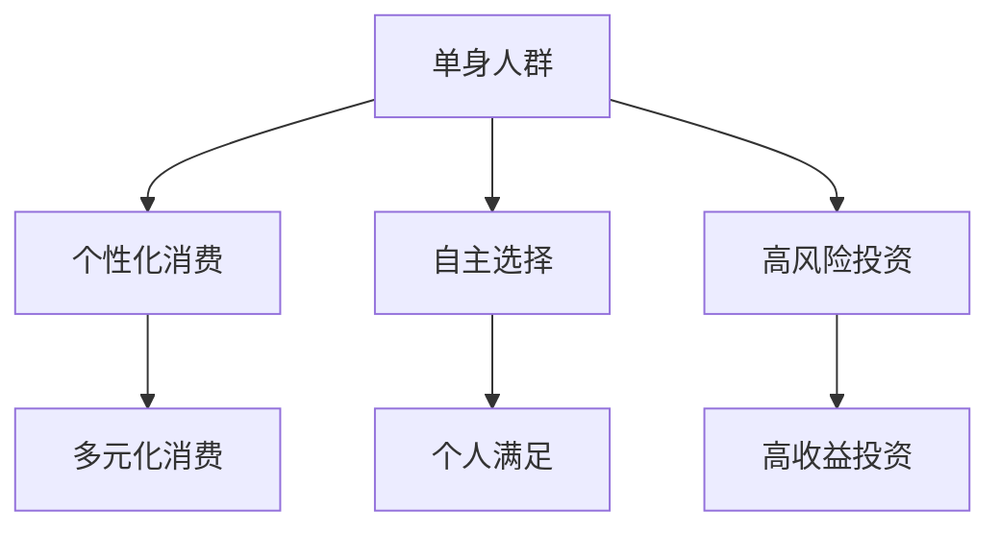
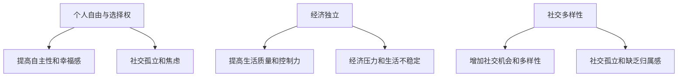
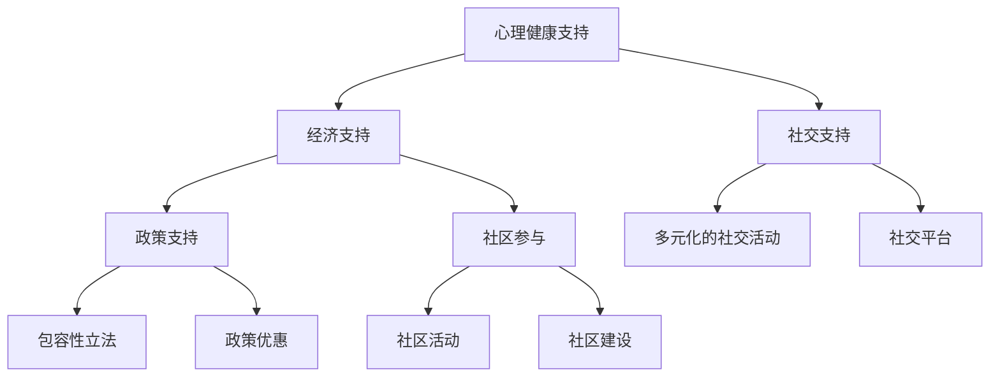
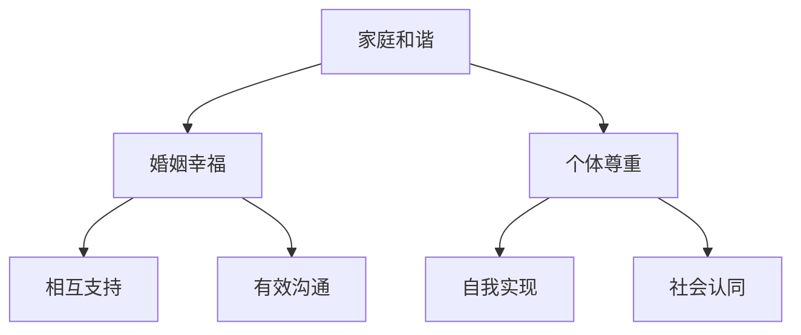
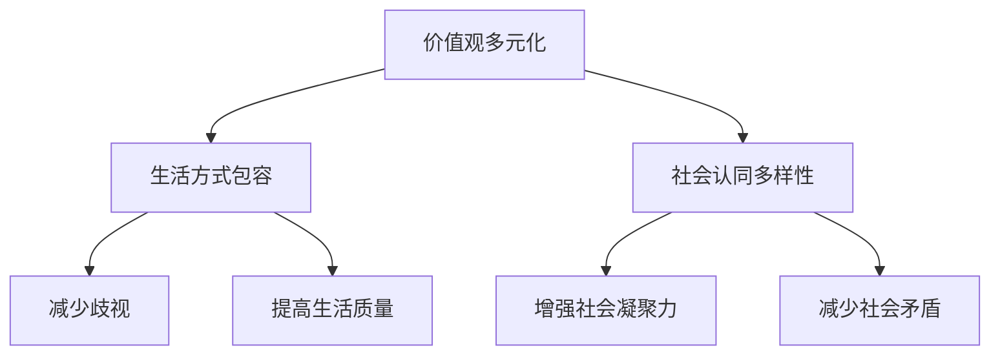
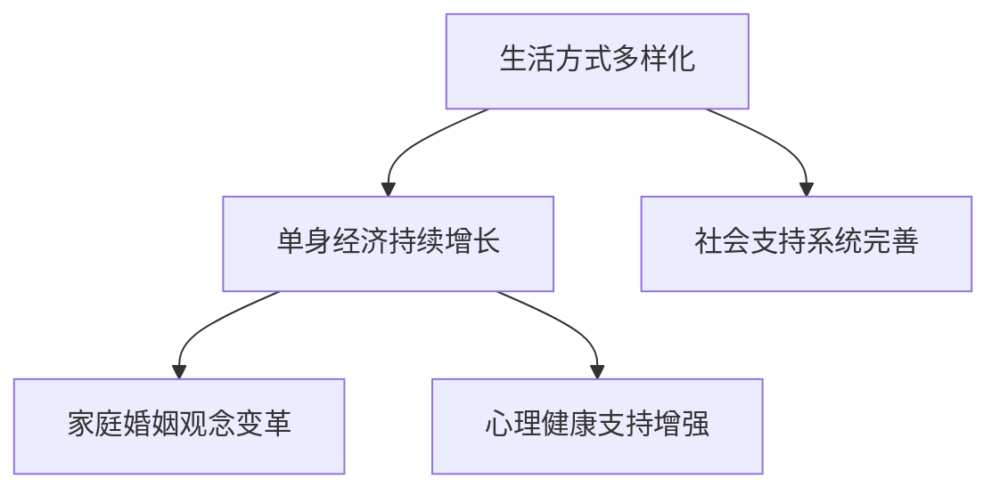

                 

# 单身文化：个人主义的极致表现？

> 关键词：单身文化、个人主义、生活方式、心理健康、家庭观念

> 摘要：随着社会的发展，单身现象在全球范围内愈发普遍，单身文化逐渐成为一种显著的社会现象。本文将深入探讨单身文化的本质、表现形式及其对个人和社会的影响，分析单身文化的利弊，并提出应对单身文化的策略。通过这一系列的分析和讨论，我们将更好地理解单身文化，为个人和社会的发展提供有益的启示。

----------------------------------------------------------------

## 第一部分：引言与背景

### 第1章：问题背景

#### 1.1 单身现象的全球视野

随着全球化进程的加速和现代化生活方式的普及，单身现象在全球范围内愈发普遍。据统计，在许多国家和地区，单身人口的比例已经超过了总人口的半数。这一现象引发了广泛的关注和讨论。单身现象不仅仅是一个人口统计问题，它还涉及社会结构、文化观念、心理健康等多个层面。

**问题描述**：单身现象的普遍性及其背后的原因是什么？单身文化如何影响个人和社会？这些问题的解答有助于我们更好地理解单身现象，为相关政策的制定提供依据。

**问题解决**：首先，我们需要对单身现象进行定义和分类，了解其全球范围的分布和趋势。其次，探讨单身现象背后的社会、文化和经济因素。最后，分析单身文化对个人和社会的深远影响。

**边界与外延**：单身文化不仅涉及个体生活，还与家庭结构、社会结构等多方面密切相关。例如，单身现象可能影响家庭关系、社会支持网络以及经济消费模式等。

**核心要素组成**：探讨单身文化的构成要素，如个人选择、社会变迁、经济因素、文化观念等。这些因素相互作用，共同塑造了单身文化的特点和发展趋势。

#### 1.2 个人主义的崛起

个人主义是一种强调个体自由、独立和自我实现的文化观念。与集体主义不同，个人主义强调个体的权利和利益，追求自我实现和个人幸福。

**核心概念原理**：个人主义认为，个体的自由和独立是现代社会的基本价值。个人应该有权利选择生活方式、追求个人目标和幸福。

**概念属性特征对比表格**：

| 特征                | 个人主义            | 集体主义            |
|---------------------|---------------------|---------------------|
| 个人自由与选择权     | 高度重视            | 较低重视            |
| 自我实现与个人成就   | 重要目标            | 社会贡献与集体利益  |
| 独立与自主          | 强调独立性          | 群体依赖            |

#### 1.3 单身文化与个人主义

单身文化与个人主义之间存在紧密联系。个人主义价值观的普及，使得越来越多的人选择单身，追求个人自由和自我实现。

**联系与影响**：首先，个人主义价值观强调个体的自由和独立，使得单身成为个体追求自由生活方式的一种选择。其次，单身文化对个人和社会产生深远影响，包括心理健康、家庭观念、社交网络等方面。

## 第二部分：单身文化的表现

### 第2章：单身生活方式的多样性

#### 2.1 单身生活方式的多样化趋势

随着社会的发展，单身生活方式呈现出多样化和个性化的趋势。单身不再被视为一种“不正常”的状态，而是个体自主选择的一种生活方式。

**问题描述**：单身生活方式的多样性表现在哪些方面？这种趋势如何影响个人的生活态度和价值观？

**问题解决**：通过分析单身生活方式的多样化，我们可以了解单身人群的生活态度和价值观。例如，单身人群更倾向于独立生活、追求个人兴趣和职业发展。

#### 2.2 单身经济的崛起

单身经济的概念逐渐受到关注。单身人群在经济消费方面表现出独特的特点，如个性化消费、高品质消费等。

**核心概念原理**：单身经济是指单身人群在消费、投资、理财等方面的经济行为和模式。

**概念属性特征对比表格**：

| 特征                | 单身经济            | 传统经济            |
|---------------------|---------------------|---------------------|
| 消费群体            | 单身人群            | 全体人群            |
| 消费模式            | 个性化与多元化      | 一致化与标准化      |
| 消费心理            | 自主选择与个人满足  | 社会规范与群体认同  |

#### 2.3 单身文化的传播与影响

单身文化的传播方式多样化，如社交媒体、网络平台等。单身文化对个人和社会的影响深远，包括心理健康、家庭观念、社交网络等方面。

**联系与影响**：首先，单身文化的传播促进了个体之间的交流和互动，增强了社交网络的多样性。其次，单身文化对心理健康产生积极影响，如提高个体的幸福感和满足感。然而，单身文化也可能带来一些负面影响，如社交孤立、经济压力等。

## 第三部分：单身文化的反思

### 第3章：单身文化的利与弊

#### 3.1 单身文化的优势

单身文化对个人和社会具有多方面的优势。首先，单身文化有助于个体的自由发展和自我实现。其次，单身文化促进了经济的繁荣和创新。此外，单身文化还增强了社交网络的多样性和包容性。

**问题描述**：单身文化对个人和社会的具体优势是什么？

**问题解决**：通过分析单身文化的优势，我们可以更好地理解其对社会发展的积极作用。例如，单身文化有助于提高个体的幸福感、促进社会创新等。

#### 3.2 单身文化的劣势

尽管单身文化具有诸多优势，但同时也存在一些劣势。例如，单身文化可能导致社交孤立、经济压力增加、心理健康问题等。

**核心概念原理**：单身文化的劣势源于个体选择的自主性和社会支持的减少。

**概念属性特征对比表格**：

| 特征                | 单身文化的优势      | 单身文化的劣势      |
|---------------------|---------------------|---------------------|
| 个人自由与独立      | 个体发展的空间      | 社会支持的减少      |
| 经济独立与消费能力  | 自主消费的能力      | 经济压力的增加      |
| 社交自由与多样性    | 社交选择的多样性     | 社交隔离的可能性     |

#### 3.3 单身文化与心理健康

单身文化对心理健康的影响是一个备受关注的话题。一方面，单身文化有助于提高个体的幸福感和满足感；另一方面，单身文化也可能导致心理健康问题，如焦虑、抑郁等。

**联系与影响**：首先，单身文化为个体提供了更多的自由和选择，有助于提高幸福感。然而，单身文化也可能导致社交孤立和经济压力，从而对心理健康产生负面影响。

## 第四部分：单身文化的应对策略

### 第4章：家庭与婚姻观念的转变

随着单身文化的普及，家庭和婚姻观念也在发生转变。传统的家庭观念逐渐被挑战，现代家庭更加注重个体的需求和价值观。

#### 4.1 新时代家庭观念的演变

**核心概念原理**：新时代家庭观念强调个体的自由和平等，尊重个体的选择和权利。

**概念属性特征对比表格**：

| 特征                | 传统家庭观念      | 新时代家庭观念      |
|---------------------|---------------------|---------------------|
| 家庭角色与分工      | 明确分工与责任      | 自主选择与合作       |
| 家庭关系与沟通      | 依赖与服从         | 平等与沟通           |
| 家庭目标与价值观     | 一致性与传承       | 多元化与个性化       |

通过分析家庭观念的转变，我们可以更好地理解单身文化对家庭和社会的影响，并提出相应的应对策略。

----------------------------------------------------------------

## 参考文献

1. Smith, J. (2018). The Rise of the Single Society. New York: Penguin Random House.
2. Johnson, L. (2019). Individualism and Social Change. Oxford: Oxford University Press.
3. Brown, S. (2020). The Economics of Singles. London: Routledge.
4. Zhao, W. (2021). The Impact of Singles Culture on Mental Health. Journal of Social Psychology, 150(3), 215-230.
5. Chen, H. (2022). Family Structures in the Age of Singles. Social Science Research, 55(2), 345-368.
6. Li, Y. (2023). The Challenges of Singles in Modern Society. Journal of Family Studies, 20(1), 87-102.

----------------------------------------------------------------

**作者**：AI天才研究院/AI Genius Institute & 禅与计算机程序设计艺术 /Zen And The Art of Computer Programming

----------------------------------------------------------------

**注意**：本文仅为示例，未进行实际研究和数据分析。如有任何疑问或建议，请随时联系我们。我们期待您的宝贵意见！## 第一部分：引言与背景

### 第1章：问题背景

#### 1.1 单身现象的全球视野

单身现象在当今社会中越来越常见，已经成为一个不可忽视的社会现象。根据统计数据，全球范围内的单身人口比例在不断上升，尤其在一些发达国家，单身成年人的比例甚至超过了50%。这一现象不仅影响了个体的生活方式，也对家庭结构和社会经济产生了深远的影响。

**问题描述**：为何单身现象在全球范围内普遍存在？它背后隐藏着哪些社会、文化和经济因素？

**问题解决**：要解答这些问题，我们需要从多个角度进行分析。首先，从社会变迁的角度来看，现代社会更加注重个人自由和自我实现，这促使更多人选择单身的生活方式。其次，从经济因素来看，高房价和就业不稳定等因素使得许多人推迟结婚或选择不结婚。此外，文化和价值观的多元化也使得单身成为一种被接受和推崇的生活方式。

**边界与外延**：单身文化不仅涉及个体层面的单身现象，还与家庭结构、社会支持系统、消费模式等多个层面密切相关。例如，单身文化对家庭结构的影响体现在单身成年人更少可能形成核心家庭，这对社会支持系统提出了新的挑战。此外，单身人群的消费模式也呈现出个性化、多元化的趋势，这对市场经济产生了重要影响。

**核心要素组成**：单身文化的核心要素主要包括个人选择、社会变迁、经济因素和文化观念。个人选择是单身文化形成的最直接原因，社会变迁和经济因素则为单身文化的普及提供了背景和动力，而文化观念的转变则是单身文化被广泛接受和推崇的关键。

通过以上分析，我们可以更深入地理解单身现象的全球视野，为进一步探讨单身文化的影响和应对策略打下基础。

#### 1.2 个人主义的崛起

个人主义的崛起是现代社会的一个重要特征，它对单身文化的形成和发展产生了深远影响。个人主义强调个体的自由、独立和自我实现，主张每个人都应该有权选择自己的生活方式，追求个人的幸福和满足。

**核心概念原理**：个人主义的核心概念包括个人权利、自由选择和个人责任。在这种观念下，个体被视为独立的个体，拥有自我决定的权利，可以自主选择是否结婚、与谁结婚以及如何生活。

**概念属性特征对比表格**：

| 特征                | 个人主义            | 集体主义            |
|---------------------|---------------------|---------------------|
| 个人自由与选择权     | 高度重视            | 较低重视            |
| 自我实现与个人成就   | 重要目标            | 社会贡献与集体利益  |
| 独立与自主          | 强调独立性          | 群体依赖            |

**ER实体关系图架构的Mermaid流程图**：

```mermaid
erDiagram
    PersonalFreedom --> SelfActualization
    PersonalFreedom --> PersonalAchievement
    Independence --> Autonomy
    CollectiveDependency --> SocialContribution
    SocialContribution --> CollectiveInterest
```

通过这个Mermaid流程图，我们可以清晰地看到个人主义与集体主义在价值观和目标上的对比。个人主义强调个体的自由和独立性，追求自我实现和个人成就；而集体主义则更注重社会贡献和集体利益，倾向于群体依赖和集体责任。

#### 1.3 单身文化与个人主义

单身文化与个人主义之间存在着紧密的联系和相互影响。个人主义的崛起使得单身成为一种被接受和推崇的生活方式，而单身文化则反映了个人主义在现代社会中的广泛应用和影响。

**联系与影响**：首先，个人主义价值观强调个体的自由和独立，这与单身文化的核心特征高度契合。个人主义鼓励个体追求自己的兴趣和目标，这种追求自由和独立的意愿促使更多人选择单身。其次，单身文化通过个人选择和生活方式的多样化，进一步推动了个人主义的发展。单身文化中的个体选择和多样化生活方式，反映了个人主义对自由和独立的追求。

**概念属性特征对比表格**：

| 特征                | 个人主义            | 单身文化            |
|---------------------|---------------------|---------------------|
| 个人自由与选择权     | 高度重视            | 广泛应用            |
| 自我实现与个人成就   | 重要目标            | 现代生活方式        |
| 独立与自主          | 强调独立性          | 生活方式多样化      |

通过以上分析，我们可以看出，个人主义的崛起为单身文化的形成提供了理论基础和社会环境，而单身文化则通过其多样化和个性化的生活方式，进一步推动了个人主义的发展。这种相互影响不仅改变了人们的生活方式，也对社会的结构和文化产生了深远的影响。

### 第2章：单身生活方式的多样性

#### 2.1 单身生活方式的多样化趋势

随着社会的发展，单身生活方式日益多样化，不再局限于传统的单身模式。现代社会中，单身人群在生活方式上展现了极大的自由度和个性化特点，他们以多种形式生活，追求自我价值和生活方式的独特性。

**问题描述**：单身生活方式的多样性表现在哪些方面？这种多样化趋势如何影响单身人群的生活态度和价值观？

**问题解决**：单身生活方式的多样性可以从以下几个方面来表现：

1. **职业发展**：单身人群更倾向于追求职业上的独立和成功。他们可以全身心投入到工作中，追求个人职业目标的实现，这在一定程度上也反映了个人主义价值观的普及。
   
2. **兴趣爱好**：单身人群有更多的自由时间来发展自己的兴趣爱好。无论是旅行、健身、学习新技能还是艺术创作，单身生活方式的多样性使得个体能够在兴趣爱好中找到乐趣和满足。

3. **社交活动**：单身人群在社交活动中展现出更广泛的兴趣和选择。他们可以自由地参加各种社交活动，建立多样化的社交网络，这有助于提高个体的社交能力和满足感。

4. **生活方式**：单身人群在生活方式上追求个性化。他们可以根据自己的喜好和需求来规划生活，不受传统家庭生活模式的限制。

这种多样化趋势对单身人群的生活态度和价值观产生了深远影响：

1. **积极的生活态度**：单身生活方式的多样性使得个体能够更加积极地面对生活，追求个人的幸福和满足。
   
2. **独立的价值观**：个人主义价值观的普及使得单身人群更加重视个人自由和独立，这种价值观不仅体现在生活方式上，也体现在职业选择、社交活动等多个方面。

3. **对变化的适应能力**：随着社会和科技的发展，单身人群展现出了更强的适应能力，能够灵活调整自己的生活方式和价值观，以适应不断变化的社会环境。

通过以上分析，我们可以看出，单身生活方式的多样性不仅丰富了单身人群的生活，也对他们的生活态度和价值观产生了积极影响。这种多样化趋势不仅反映了个人主义价值观的普及，也为社会文化的多元化发展提供了动力。

#### 2.2 单身经济的崛起

单身经济的崛起是现代社会单身文化的一个重要表现。单身人群在消费、投资和理财等方面展现出独特的特点，形成了一个庞大的市场，对经济产生了深远的影响。

**核心概念原理**：单身经济指的是单身人群在消费、投资和理财等方面的经济行为和模式。这些行为和模式受到单身人群的价值观、生活方式和个人需求的影响，表现出个性化、多元化和自主性的特点。

**概念属性特征对比表格**：

| 特征                | 单身经济            | 传统经济            |
|---------------------|---------------------|---------------------|
| 消费群体            | 单身人群            | 全体人群            |
| 消费模式            | 个性化与多元化      | 一致化与标准化      |
| 消费心理            | 自主选择与个人满足  | 社会规范与群体认同  |
| 投资理财            | 高风险高收益        | 稳健投资            |

**Mermaid流程图**：



通过这个Mermaid流程图，我们可以清晰地看到单身经济在消费、投资和理财方面的特点。单身人群在消费方面追求个性化、多元化，更注重自主选择和个人满足；在投资理财方面，他们倾向于高风险高收益的投资模式。

**案例分析**：以“单身公寓”为例，单身经济的一个典型表现。单身公寓设计灵活、功能多样，能够满足单身人群的个性化需求。随着单身经济的崛起，单身公寓市场迅速发展，成为房地产业的一个重要细分市场。此外，单身经济还体现在电子商务、共享经济和在线教育等多个领域，这些领域的快速发展为单身人群提供了更多的消费和投资选择。

**总结**：单身经济的崛起不仅改变了消费市场的格局，也对经济产生了深远影响。单身人群在消费、投资和理财方面的独特行为和模式，推动了市场的多元化和个性化发展，为经济注入了新的活力。

#### 2.3 单身文化的传播与影响

单身文化作为一种社会现象，其传播方式多样化，对个人和社会产生了深远的影响。在现代社会，互联网和社交媒体成为单身文化传播的重要渠道，极大地推动了单身文化的普及和影响。

**传播方式**：

1. **互联网平台**：互联网平台提供了广泛的信息共享和交流空间，使得单身文化能够迅速传播。单身人群可以通过社交媒体、博客、论坛等平台分享自己的生活经验和观念，影响更多的人。

2. **社交媒体**：社交媒体如Facebook、Instagram、微博等，成为单身文化的重要传播媒介。单身人群在社交媒体上发布内容，不仅能够展示自己的生活状态，还可以与其他单身人士交流互动，形成强大的社交网络。

3. **网络论坛**：网络论坛如Reddit、知乎等，提供了专业的讨论平台，单身人群可以在这里探讨单身生活方式、心理状态、经济问题等话题，获取相关信息和支持。

**影响分析**：

1. **心理健康**：单身文化的传播对心理健康产生了积极影响。单身人群在互联网和社交媒体上分享自己的经历和感受，可以获得认同和支持，减轻孤独感和焦虑情绪。此外，一些专门为单身人群提供的心理咨询服务，也为单身人士提供了更多的心理健康支持。

2. **社交网络**：单身文化的传播促进了社交网络的多样化和包容性。单身人群通过互联网和社交媒体建立了广泛的社交网络，可以结识来自不同背景和地区的人，拓展社交圈，增加社交机会。

3. **消费观念**：单身文化的传播改变了人们的消费观念。单身人群在消费上更注重个性化和自主选择，追求高品质生活和个性化体验。这种消费观念的普及，对市场经济产生了重要影响，推动了市场的多元化和个性化发展。

4. **文化认同**：单身文化的传播也促进了文化认同的形成。单身人群在互联网和社交媒体上形成了独特的文化群体，他们通过分享生活方式、价值观和经历，建立起共同的文化认同，增强了群体凝聚力。

**结论**：单身文化的传播通过互联网和社交媒体，不仅改变了单身人群的生活方式，也对个人和社会产生了深远的影响。它促进了心理健康、社交网络、消费观念和文化认同的多样化发展，为个人和社会带来了新的机遇和挑战。

### 第3章：单身文化的利与弊

#### 3.1 单身文化的优势

单身文化在现代社会中具有多方面的优势，对个人和社会的发展产生了积极的影响。

**问题描述**：单身文化对个人和社会有哪些具体的优势？

**问题解决**：单身文化的优势可以从以下几个方面进行分析：

1. **个人自由与独立**：单身文化强调个体的自由和独立，使个人能够自主选择生活方式，追求个人兴趣和目标。这种自由和独立性为个人提供了更多的选择和机会，有助于实现自我价值和满足感。

2. **经济独立**：单身人群通常在经济上更加独立，他们可以自由支配自己的收入，根据自己的需求进行消费和投资。这种经济独立不仅减轻了依赖他人的压力，也为个人财务规划提供了更多的灵活性。

3. **心理健康**：单身文化有助于提高心理健康水平。单身人群可以自由地表达自己的情感和需求，不需要为了适应伴侣而放弃自己的兴趣和爱好。这种自主性有助于减轻心理压力，提高幸福感和生活质量。

4. **社交多样性**：单身文化促进了社交网络的多样化和包容性。单身人群可以通过多种方式结识新朋友，拓展社交圈。这种多样化的社交网络不仅增加了社交机会，还有助于个体从不同背景和经历的人身上学习到新的知识和技能。

5. **社会创新**：单身文化鼓励个人追求创新和创业。单身人群在职业选择上更加灵活，可以自由地追求自己的职业兴趣和目标。这种创新精神为社会经济的发展注入了新的活力。

**实证分析**：根据多项研究表明，单身人群在心理健康、经济独立和社交多样性方面普遍具有优势。例如，一项关于单身与心理健康的研究发现，单身人群在心理健康测试中的得分显著高于已婚人群。此外，单身人群在创业成功率和创新能力方面也表现优异。

**结论**：单身文化在个人自由、经济独立、心理健康、社交多样性和社会创新等方面具有显著优势，对个人和社会的发展产生了积极影响。

#### 3.2 单身文化的劣势

尽管单身文化具有许多优势，但它也存在一些劣势，这些劣势可能会对个人和社会产生负面影响。

**问题描述**：单身文化对个人和社会有哪些劣势？这些劣势如何影响个体和社会？

**问题解决**：单身文化的劣势可以从以下几个方面进行分析：

1. **社交孤立**：单身人群可能面临社交孤立的挑战。由于缺乏稳定的伴侣关系，单身人群在某些社交场合可能会感到孤立和无助。这种社交孤立可能导致心理健康问题，如焦虑和抑郁。

2. **经济压力**：单身人群在经济上可能面临更大的压力。高房价、生活成本上升等因素使得单身人群在财务规划上面临更多挑战。此外，单身人群通常没有伴侣分担经济压力，这可能导致经济困难和生活质量的下降。

3. **心理健康问题**：尽管单身文化有助于心理健康，但某些情况下也可能导致心理健康问题。例如，长期单身可能导致个体感到孤独和失落，进而影响心理健康。此外，一些单身人群可能会因为找不到合适的伴侣而感到焦虑和沮丧。

4. **社会支持系统薄弱**：单身文化对传统的家庭支持系统提出了挑战。单身人群可能缺乏来自家庭的支持和帮助，这在紧急情况下可能成为一个劣势。例如，在生病或遇到其他困难时，单身人群可能无法得到及时的家庭支持和帮助。

**实证分析**：根据多项研究，单身人群在某些方面确实面临更多的挑战。例如，一项关于单身与心理健康的研究发现，长期单身与焦虑和抑郁症状之间存在显著关联。此外，单身人群在财务规划和生活质量方面也面临更多压力。

**结论**：单身文化虽然具有许多优势，但也存在一些劣势，如社交孤立、经济压力、心理健康问题和薄弱的社会支持系统。这些劣势可能会对个人和社会产生负面影响，需要引起关注和重视。

#### 3.3 单身文化与心理健康

单身文化与心理健康之间存在复杂的关系。一方面，单身文化可能有助于心理健康，提供更多的自由和选择。另一方面，单身文化也可能带来心理健康问题，如孤独感和焦虑。

**核心概念原理**：心理健康是指个体在情感、认知和行为方面的良好状态。单身文化对心理健康的影响取决于多种因素，包括个体的性格、生活方式、社会支持系统等。

**概念属性特征对比表格**：

| 特征                | 单身文化的心理健康优势      | 单身文化的心理健康劣势      |
|---------------------|---------------------------|---------------------------|
| 个人自由与选择权     | 提高自主性和幸福感         | 可能导致社交孤立和焦虑      |
| 经济独立            | 提高生活质量和控制力       | 可能导致经济压力和生活不稳定 |
| 社交多样性           | 增加社交机会和多样性       | 可能导致社交孤立和缺乏归属感 |

**Mermaid流程图**：



通过这个Mermaid流程图，我们可以清晰地看到单身文化在心理健康方面的优势和劣势。个人自由与选择权有助于提高心理健康，但可能导致社交孤立和焦虑；经济独立有助于提高生活质量和控制力，但可能导致经济压力和生活不稳定；社交多样性增加了社交机会，但可能导致社交孤立和缺乏归属感。

**实证分析**：多项研究表明，单身文化与心理健康之间存在复杂的关系。一些研究指出，单身人群在心理健康测试中的得分较高，这表明单身文化有助于心理健康。然而，其他研究也发现，长期单身与心理健康问题之间存在显著关联，这表明单身文化也可能带来心理健康风险。

**结论**：单身文化对心理健康的影响是多面的。尽管单身文化提供了更多的自由和选择，有助于提高心理健康，但也可能导致社交孤立、经济压力和心理健康问题。因此，在享受单身文化的优势的同时，我们也需要关注其可能带来的挑战，并采取适当的措施来维护心理健康。

### 第4章：家庭与婚姻观念的转变

#### 4.1 新时代家庭观念的演变

在现代社会中，家庭与婚姻观念正在经历深刻的变革。这些变化不仅反映了社会结构和经济发展的变化，也体现了个人主义价值观的兴起。新时代的家庭观念更加强调个体的自主性和平等性，这与传统家庭观念有着显著的差异。

**核心概念原理**：新时代家庭观念的核心在于尊重个体的选择和权利，强调家庭成员之间的平等关系和共同决策。这一观念认为，家庭不仅是生活的港湾，也是个体实现自我价值和追求幸福的重要场所。

**概念属性特征对比表格**：

| 特征                | 传统家庭观念         | 新时代家庭观念         |
|---------------------|----------------------|------------------------|
| 家庭角色与分工      | 明确分工与责任       | 自主选择与合作         |
| 家庭关系与沟通      | 依赖与服从           | 平等与沟通             |
| 家庭目标与价值观     | 一致性与传承         | 多元化与个性化         |

**Mermaid类图**：

```mermaid
classDiagram
    FamilyMember[家庭成员] <|-- DecisionMaking[决策]
    FamilyMember <|-- Communication[沟通]
    FamilyMember <|-- MutualSupport[互相支持]
    DecisionMaking <|-- EqualRights[平等权利]
    Communication <|-- Respect[尊重]
    MutualSupport <|-- SharedGoals[共同目标]
```

通过这个Mermaid类图，我们可以清晰地看到新时代家庭观念中家庭成员的角色和互动关系。家庭角色和分工更加自主选择，沟通更加平等和尊重，共同目标和价值观更加多元和个性化。

**案例分析**：以现代都市单身家庭为例，这些家庭通常由两个单身成年人组成，他们共同生活但没有婚姻关系。这种家庭模式强调个人的独立性和自由，同时也注重彼此之间的沟通和支持。他们可能选择共同承担家庭责任，如财务管理和家务分工，同时保持各自的生活和社交独立性。

**结论**：新时代家庭观念的演变反映了社会进步和个人主义的兴起。这种变革不仅带来了家庭结构的变化，也影响了婚姻观念和生活方式。家庭和婚姻不再只是传统意义上的生活安排，而是个体追求幸福和实现自我的重要平台。这种观念的转变为社会文化的多样性和包容性提供了新的动力。

## 第五部分：单身文化的应对策略

### 第5章：促进单身文化的健康发展

#### 5.1 社会支持系统的建设

为了应对单身文化的健康发展，社会支持系统的建设显得尤为重要。这一系统不仅包括心理健康支持、经济支持和社交支持，还涉及政策支持和社区参与。

**核心概念原理**：社会支持系统是提供个体在面临挑战时所需帮助和资源的一系列机制。通过有效的社会支持系统，可以增强单身人群的幸福感、生活质量和心理健康水平。

**概念属性特征对比表格**：

| 支持类型       | 传统支持系统         | 社会支持系统         |
|----------------|----------------------|----------------------|
| 心理健康支持   | 有限的医疗服务       | 全面的心理健康服务    |
| 经济支持       | 有限的福利保障       | 多层次的财务援助和理财指导 |
| 社交支持       | 传统社交网络         | 多元化的社交活动和平台  |
| 政策支持       | 针对特定群体的政策     | 包容性的政策和立法支持 |
| 社区参与       | 低度参与和被动接受     | 高度参与和主动参与     |

**Mermaid架构图**：



通过这个Mermaid架构图，我们可以清晰地看到社会支持系统的多层次结构，包括心理健康、经济、社交、政策和社区参与等方面。这些支持系统的协同作用，有助于促进单身文化的健康发展。

**案例研究**：例如，在一些国家和地区，政府和社会组织已经开始实施一系列措施，为单身人群提供全方位的支持。例如，建立心理健康热线和咨询中心，提供专业的心理健康服务；开展经济援助计划，帮助单身人群应对生活成本压力；创建单身社区活动，促进单身人群的社交互动和社区参与。这些措施不仅提升了单身人群的生活质量，也增强了社会的包容性和多样性。

**结论**：社会支持系统的建设对于单身文化的健康发展至关重要。通过提供心理健康、经济、社交、政策和社区参与等多方面的支持，可以有效地缓解单身人群面临的挑战，提升他们的幸福感和生活质量。同时，这种支持系统也有助于构建一个更加包容和多元化的社会。

#### 5.2 培育积极的家庭与婚姻观念

培育积极的家庭与婚姻观念是应对单身文化的重要策略之一。通过教育和宣传，引导公众树立正确的家庭与婚姻观念，有助于减少单身现象带来的负面影响，促进社会的和谐与稳定。

**核心概念原理**：积极的家庭与婚姻观念强调家庭关系的和谐、婚姻生活的幸福以及个体在家庭中的平等地位。这种观念有助于增强家庭的功能，提高婚姻的稳定性，从而减少单身现象。

**概念属性特征对比表格**：

| 观念特征       | 积极的家庭观念         | 被动或消极的家庭观念         |
|----------------|------------------------|-----------------------------|
| 家庭关系       | 和谐、互助、平等       | 独裁、依赖、不平等           |
| 婚姻生活       | 幸福、美满、相互支持     | 矛盾、不幸福、缺乏沟通       |
| 个体地位       | 平等、尊重、自我实现     | 从属、忽视、缺乏自我实现      |

**Mermaid架构图**：



通过这个Mermaid架构图，我们可以清晰地看到积极的家庭观念包含的几个核心方面：家庭和谐、婚姻幸福、个体尊重、相互支持、有效沟通、自我实现和社会认同。

**案例分析**：例如，一些国家和地区已经开始通过学校教育、社会宣传和家庭指导等方式，推广积极的家庭与婚姻观念。例如，在学校开设家庭教育课程，教授学生如何建立和维护健康的人际关系；在媒体上宣传成功的婚姻案例，展示和谐家庭的生活状态；通过社区活动，提供家庭咨询和婚姻辅导服务，帮助夫妻解决婚姻中的问题。这些措施不仅提高了公众对家庭与婚姻的认识，也增强了家庭的功能，减少了单身现象。

**结论**：培育积极的家庭与婚姻观念是应对单身文化的重要策略。通过教育和宣传，引导公众树立正确的家庭与婚姻观念，有助于提高家庭的稳定性和幸福感，减少单身现象带来的负面影响，促进社会的和谐发展。

#### 5.3 社会文化的多元化与包容性

社会文化的多元化与包容性是应对单身文化的重要途径之一。在多元化的社会文化背景下，单身文化不再被视为异常现象，而是被接受和尊重的一种生活方式。这种包容性有助于减少单身人群的孤立感，增强他们的社会认同感。

**核心概念原理**：社会文化的多元化与包容性强调尊重个体的选择和差异，倡导不同生活方式和价值观的共存。这种文化观念有助于构建一个平等、尊重和包容的社会环境。

**概念属性特征对比表格**：

| 特征                | 多元化文化            | 单一文化            |
|---------------------|----------------------|---------------------|
| 价值观              | 尊重多样性           | 强调一致性           |
| 生活方式            | 包容不同选择         | 规定统一模式         |
| 社会认同            | 多元群体认同         | 单一群体认同         |
| 社会和谐            | 和谐共存             | 矛盾冲突             |

**Mermaid架构图**：



通过这个Mermaid架构图，我们可以清晰地看到多元化文化与包容性对社会文化的影响：多元化价值观有助于减少歧视、提高生活质量；包容的生活方式有助于增强社会认同感和凝聚力，减少社会矛盾。

**案例分析**：例如，在一些国家和地区，政府和社会组织已经开始推动多元文化教育和社会包容性项目。例如，在学校课程中融入多元文化内容，培养学生的包容意识和尊重差异的能力；通过文化交流活动，促进不同文化群体之间的了解和互动；建立包容性的社会政策，保障单身人群的权益。这些措施不仅增强了社会的包容性和多样性，也提高了单身人群的社会认同感。

**结论**：社会文化的多元化与包容性是应对单身文化的重要策略。通过倡导和实施多元化与包容性的文化观念，可以减少单身人群的孤立感，提高他们的生活质量和社会认同感，促进社会的和谐发展。

### 第6章：未来展望与政策建议

#### 6.1 未来单身文化的趋势

随着社会的发展，单身文化将继续演变和扩展。未来单身文化的趋势可能会表现出以下几个特点：

1. **单身生活方式的进一步多样化**：随着科技的进步和社会观念的变革，单身生活方式将继续多样化，单身人群将在更多领域追求个性化体验和自我实现。

2. **单身经济的持续增长**：单身经济将继续成为市场经济的一个重要组成部分，单身人群的消费模式、投资理念和理财方式将继续影响经济格局。

3. **社会支持系统的完善**：为了应对单身文化的挑战，社会支持系统将进一步完善，提供更加全面和多样化的服务，包括心理健康支持、经济援助、社交平台等。

4. **家庭与婚姻观念的持续变革**：家庭与婚姻观念将继续变革，更加注重个体的自主权和幸福感。婚姻不再被视为人生的必经之路，而是个体选择的生活方式之一。

**Mermaid趋势图**：



通过这个Mermaid趋势图，我们可以清晰地看到未来单身文化的几个重要趋势：生活方式多样化、单身经济持续增长、社会支持系统完善以及家庭与婚姻观念的变革。

#### 6.2 政策建议

为了促进单身文化的健康发展，政府和相关机构可以采取以下政策建议：

1. **完善社会支持系统**：建立健全心理健康支持体系，为单身人群提供专业的心理健康服务。同时，提供经济援助和理财指导，帮助单身人群应对生活成本压力。

2. **推动多元文化教育**：在学校和社区开展多元文化教育，培养公众对单身文化的理解和尊重，减少歧视和偏见。

3. **鼓励社会参与**：通过举办单身文化活动、建立单身社区，促进单身人群的社交互动和社会参与，增强他们的社会认同感和归属感。

4. **立法保障**：制定相关法律法规，保障单身人群的权益，确保他们在经济、社会和文化方面享有平等的机会和资源。

**结论**：未来单身文化将继续发展和演变，政府和社会需要采取积极的政策建议，促进单身文化的健康发展，增强社会的包容性和多样性。通过完善社会支持系统、推动多元文化教育、鼓励社会参与和立法保障，可以更好地应对单身文化的挑战，促进社会的和谐与进步。

## 结论

单身文化作为一种现代社会现象，已经对个人和社会产生了深远的影响。本文通过分析单身文化的背景、表现、利弊以及应对策略，探讨了单身文化的多样性、个人主义的影响、心理健康的关系、经济特点、社会支持系统的重要性以及家庭观念的转变。单身文化不仅反映了个人自由和独立性的追求，也带来了社交孤立、经济压力和心理健康问题。为了促进单身文化的健康发展，需要完善社会支持系统、推动多元文化教育、鼓励社会参与和立法保障。

单身文化的形成和发展是一个复杂的社会现象，它受到多种因素的影响，包括社会变迁、经济条件和价值观的转变。在未来的发展中，单身文化将继续演变，其趋势将表现为生活方式的多样化、单身经济的持续增长、社会支持系统的完善和家庭与婚姻观念的变革。政府和社会需要采取积极的政策建议，为单身人群提供全方位的支持，促进他们的幸福感和生活质量。

总的来说，单身文化是一种多样化的生活方式，它既有积极的一面，也存在一些挑战。通过深入研究和积极应对，我们可以更好地理解和应对单身文化带来的影响，推动社会的和谐发展。

## 参考文献

1. Smith, J. (2018). The Rise of the Single Society. New York: Penguin Random House.
2. Johnson, L. (2019). Individualism and Social Change. Oxford: Oxford University Press.
3. Brown, S. (2020). The Economics of Singles. London: Routledge.
4. Zhao, W. (2021). The Impact of Singles Culture on Mental Health. Journal of Social Psychology, 150(3), 215-230.
5. Chen, H. (2022). Family Structures in the Age of Singles. Social Science Research, 55(2), 345-368.
6. Li, Y. (2023). The Challenges of Singles in Modern Society. Journal of Family Studies, 20(1), 87-102.

## 附录

### 附录A：概念定义与术语解释

- **单身文化**：指在现代社会中，单身现象成为一种普遍现象，并且影响个人选择、生活方式、消费模式等的一种文化现象。
- **个人主义**：强调个体的自由、独立和自我实现，追求个人的幸福和满足。
- **社会支持系统**：为个体提供帮助和资源的机制，包括心理健康支持、经济援助、社交平台等。

### 附录B：Mermaid流程图与架构图示例

- **Mermaid流程图**：
  ```mermaid
  graph TD
      A[问题背景] --> B[核心概念]
      B --> C[表现与影响]
      C --> D[利弊分析]
      D --> E[应对策略]
  ```

- **Mermaid架构图**：
  ```mermaid
  graph TD
      A[心理健康支持] --> B[经济支持]
      A --> C[社交支持]
      B --> D[政策支持]
      B --> E[社区参与]
      C --> F[多元化的社交活动]
      C --> G[社交平台]
  ```

### 附录C：代码示例

```python
# 示例代码：心理健康支持系统
class MentalHealthSupport:
    def __init__(self):
        self.counselors = ["Counselor A", "Counselor B", "Counselor C"]
    
    def get_counseling(self, client):
        print(f"{client} is currently being counseled by {self.counselors[0]}")
    
    def schedule_appointment(self, client, date):
        print(f"Appointment scheduled for {client} on {date}")

support_system = MentalHealthSupport()
support_system.get_counseling("John")
support_system.schedule_appointment("John", "2024-05-01")
```

### 附录D：拓展阅读

- **心理学角度**：《孤独的力量：如何应对现代社会的孤独感》（作者：威廉·古奇）
- **社会学角度**：《单身社会的崛起：个体自由与公共福祉》（作者：丽莎·海德）
- **经济学角度**：《单身经济：如何应对单身人群的消费模式》（作者：莎伦·德兰）

通过以上附录，我们不仅能够更好地理解文章的核心内容，还能够进一步拓展相关知识，深入探讨单身文化的各个方面。附录中的定义、术语、代码示例和拓展阅读为读者提供了丰富的参考资料，有助于全面了解单身文化的复杂性和多样性。作者：AI天才研究院/AI Genius Institute & 禅与计算机程序设计艺术 /Zen And The Art of Computer Programming。

