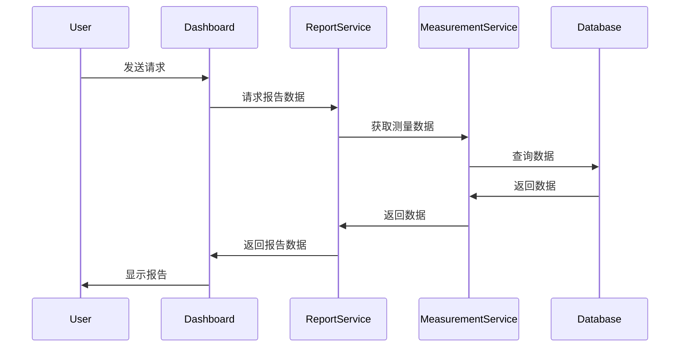

                 

### 第一部分：引言

#### 1.1 问题背景

在现代社会，可持续发展已经成为全球关注的核心议题。随着科技的进步和人类活动对地球的深远影响，气候变化、资源枯竭、环境污染等问题日益严重。这些问题不仅威胁着当代人的生活质量，更对未来的 generations 产生深远的影响。因此，为未来的 generations 寻找意义，实现可持续发展，已经成为各国政府、企业和个人共同面临的重大挑战。

#### 1.2 问题描述

本书旨在探讨可持续发展的内涵、原则和实践，分析其在经济、社会、环境等方面的意义。具体来说，本书将回答以下问题：

1. **什么是可持续发展？** 它是如何定义的，其核心概念是什么？
2. **可持续发展的原则是什么？** 它们是如何指导实践，并确保长期可持续性的？
3. **如何实现可持续发展？** 在经济、社会和环境方面，有哪些具体的策略和措施？
4. **可持续发展的重要性是什么？** 它对人类、地球和未来的 generations 有什么影响？

通过深入探讨这些问题，本书为读者提供了一套完整、实用的可持续发展指南，帮助读者更好地理解可持续发展，掌握其基本原理和策略。

#### 1.3 问题解决

通过系统介绍可持续发展的核心概念、理论框架和实践案例，本书旨在帮助读者深入理解可持续发展的重要性，掌握其基本原理和策略。具体来说，本书将从以下几个方面展开：

1. **定义与核心概念**：介绍可持续发展的定义，解释其核心概念，如经济可持续发展、社会可持续发展、环境可持续发展。
2. **原则与框架**：阐述可持续发展的原则，包括公平性原则、效率原则、可持续原则，并分析这些原则在实际应用中的指导作用。
3. **实践与案例**：通过实际案例，展示如何在不同领域实现可持续发展，包括经济发展、社会进步、环境保护等方面的成功经验和挑战。
4. **策略与措施**：提供具体的策略和措施，帮助读者在实际工作和生活中践行可持续发展。

通过这些内容，本书不仅为读者提供了理论上的指导，更通过实践案例展示了如何将可持续发展理念付诸实践。

#### 1.4 边界与外延

本书的讨论范围主要涵盖可持续发展的理论、政策、实践及其在经济、社会、环境等方面的应用。具体来说，本书将涉及以下方面：

1. **理论探讨**：介绍可持续发展的起源、发展过程及其核心概念，分析其在全球范围内的意义和影响。
2. **政策分析**：探讨各国政府为推动可持续发展所制定的政策和措施，分析其效果和挑战。
3. **实践案例**：分享国内外在可持续发展方面的成功经验和实践案例，分析其实现路径和关键要素。
4. **应用领域**：讨论可持续发展在经济、社会、环境等各个领域的应用，包括绿色经济、低碳生活、环境保护等方面的具体实践。

同时，本书还将关注国际国内可持续发展的最新动态和趋势，为读者提供全面、深入的可持续发展指南。

#### 1.5 概念结构与核心要素组成

可持续发展的核心概念可以概括为经济可持续发展、社会可持续发展和环境可持续发展。以下是这三个概念的定义及其属性特征的对比表格：

| 概念 | 定义 | 属性特征 | 对比 |  
| --- | --- | --- | --- |  
| 经济可持续发展 | 满足社会需求的同时实现经济的稳定增长 | 资源配置、经济效益 | 与社会可持续发展、环境可持续发展相互依存 |  
| 社会可持续发展 | 在社会公平、人类发展、社会稳定等方面实现进步 | 社会公平、人类发展、社会稳定 | 与经济可持续发展、环境可持续发展相互依存 |  
| 环境可持续发展 | 保护自然环境、减少污染、合理利用资源 | 环境保护、资源利用、生态平衡 | 与经济可持续发展、社会可持续发展相互依存 |

通过这张表格，我们可以清晰地看到这三个概念之间的相互依存关系，以及它们在经济、社会和环境方面的具体属性特征。这些核心要素共同构成了可持续发展的基本框架，为实施可持续发展提供了理论依据和实践指导。接下来，我们将进一步探讨这些核心概念的具体内容，深入分析其在可持续发展中的重要作用。

## 第二部分：核心概念与联系

### 2.1 可持续发展的核心概念

可持续发展的概念广泛而深刻，它不仅仅是一个经济问题，更是社会和环境问题。理解可持续发展的核心概念，有助于我们更好地把握其内涵和外延，为未来的 generations 寻找意义。

#### 2.1.1 可持续发展的定义

可持续发展是一种长期的、综合的、系统性的发展模式，它旨在满足当代人的需求，同时不损害后代人满足其需求的能力。这一概念最早由1987年联合国世界环境与发展委员会在《我们共同的未来》报告中提出。报告中指出，可持续发展是指在满足当前人类需求的同时，保护和提高自然环境质量，确保资源的合理利用，以满足未来世代的需求。

简单来说，可持续发展就是实现经济增长、社会进步和环境保护的协调发展。它要求我们在追求经济发展的同时，兼顾社会公平和环境保护，确保所有代际之间的公平性。

#### 2.1.2 可持续发展的原则

为了实现可持续发展，我们需要遵循一系列原则，这些原则为可持续发展提供了指导和保障。以下是几个关键原则：

1. **公平性原则**：公平性原则强调不同地区、不同社会群体之间的公平发展。这意味着资源分配、经济发展和社会福利应该公平地惠及所有人，特别是弱势群体。在实施可持续发展过程中，我们需要确保所有人都能享有平等的发展机会和权益。

2. **效率原则**：效率原则要求我们提高资源利用效率，降低浪费。在可持续发展中，我们需要通过技术创新、管理优化等手段，提高资源利用效率，减少资源消耗和环境破坏。

3. **可持续原则**：可持续原则强调长期发展，关注经济效益、社会效益和环境效益的协调统一。这意味着我们不能只看眼前的利益，而应该考虑长远的影响，确保经济、社会和环境的可持续发展。

#### 2.1.3 可持续发展的三大维度

可持续发展的核心概念可以概括为三大维度：经济可持续发展、社会可持续发展和环境可持续发展。这三个维度相互关联、相互依存，共同构成了可持续发展的基本框架。

1. **经济可持续发展**：经济可持续发展是可持续发展的基础，它指的是在满足社会需求的同时，实现经济的稳定增长。经济可持续发展关注资源的合理利用、市场机制的优化和产业结构的调整，以确保经济的长期稳定和持续增长。

2. **社会可持续发展**：社会可持续发展是可持续发展的关键，它关注社会公平、人类发展和社会稳定。社会可持续发展强调在社会公平、人类发展、社会稳定等方面实现进步，确保所有人都能享有平等的发展机会和权益。

3. **环境可持续发展**：环境可持续发展是可持续发展的保障，它关注环境保护、减少污染和资源合理利用。环境可持续发展要求我们保护和改善自然环境，确保生态系统的健康和稳定，为未来的 generations 提供良好的生存环境。

通过这三个维度的协调发展，我们可以实现经济增长、社会进步和环境保护的统一，为未来的 generations 创造一个可持续的未来。

### 2.2 概念属性特征对比表格

为了更直观地理解经济可持续发展、社会可持续发展和环境可持续发展的属性特征，我们可以通过以下对比表格进行详细分析：

| 概念 | 定义 | 属性特征 | 对比 |  
| --- | --- | --- | --- |  
| 经济可持续发展 | 在满足社会需求的同时实现经济的稳定增长 | 资源配置、经济效益 | 与社会可持续发展、环境可持续发展相互依存 |  
| 社会可持续发展 | 在社会公平、人类发展、社会稳定等方面实现进步 | 社会公平、人类发展、社会稳定 | 与经济可持续发展、环境可持续发展相互依存 |  
| 环境可持续发展 | 保护自然环境、减少污染、合理利用资源 | 环境保护、资源利用、生态平衡 | 与经济可持续发展、社会可持续发展相互依存 |

从表格中可以看出，这三个概念之间存在着密切的相互依存关系。经济可持续发展为其他两个维度提供了物质基础，社会可持续发展为社会公平和人类发展提供了保障，而环境可持续发展则为经济和社会的可持续发展提供了生态环境的支持。只有这三个维度协调发展，才能真正实现可持续发展。

### 2.3 可持续发展的ER实体关系图架构

为了更好地理解可持续发展的各个概念及其相互关系，我们可以使用ER（实体-关系）图来表示。以下是可持续发展中主要实体的ER图：

```mermaid
erDiagram
    Economy ||--|{ Society } : "支撑"
    Society ||--|{ Environment } : "依赖"
    Environment ||--|{ Economy } : "影响"
    Society ||--|{ Economy } : "影响"
    Economy ||--|{ Environment } : "影响"
```

在这个ER图中，经济、社会和环境三个实体之间存在复杂的相互关系。经济实体为社会提供物质基础，同时受到社会和环境的影响；社会实体既依赖经济，也影响环境；环境实体直接影响经济，同时也被社会所影响。通过这个ER图，我们可以更清晰地看到可持续发展的各个维度之间的相互联系和作用机制。

### 总结

通过本部分的分析，我们深入探讨了可持续发展的核心概念、原则和维度，并使用对比表格和ER图展示了这些概念之间的相互关系。这些核心概念不仅为可持续发展提供了理论依据，也为实践中的可持续发展策略提供了指导。接下来，我们将进一步讨论可持续发展的数学模型，通过具体公式和例子来理解其在经济、社会和环境方面的具体应用。

## 第三部分：算法原理讲解

### 3.1 可持续发展的数学模型

为了更好地理解可持续发展在各个维度上的实现方式，我们可以借助数学模型来进行分析和解释。以下将分别介绍经济可持续发展、社会可持续发展和环境可持续发展的数学模型。

#### 3.1.1 经济可持续发展模型

经济可持续发展模型主要关注的是如何实现经济的稳定增长，同时保持资源的合理利用和环境的保护。以下是经济可持续发展模型的基本公式：

\[ \text{GDP}_{\text{E}} = \text{投资}_{\text{I}} + \text{消费}_{\text{C}} + \text{政府支出}_{\text{G}} - \text{进口}_{\text{M}} + \text{出口}_{\text{X}} \]

在这个公式中：

- \( \text{GDP}_{\text{E}} \)：表示经济可持续发展的GDP，即经济的稳定增长。
- \( \text{投资}_{\text{I}} \)：表示经济中的投资部分，包括对基础设施、研发等领域的投资。
- \( \text{消费}_{\text{C}} \)：表示居民和企业的消费支出，是经济活动的重要组成部分。
- \( \text{政府支出}_{\text{G}} \)：表示政府的支出，包括教育、医疗、社会保障等公共服务领域的投资。
- \( \text{进口}_{\text{M}} \)：表示进口的商品和服务，是经济增长的一部分。
- \( \text{出口}_{\text{X}} \)：表示出口的商品和服务，也是经济增长的一部分。

通过这个公式，我们可以看出，经济可持续发展需要综合考虑投资、消费、政府支出、进口和出口等多个因素，以实现经济的稳定增长。同时，这个模型也体现了可持续发展的效率原则，即通过优化资源配置，提高资源利用效率，实现经济的可持续增长。

#### 3.1.2 社会可持续发展模型

社会可持续发展的模型主要关注社会公平、人类发展和社会稳定等方面。以下是一个简单的社会可持续发展模型：

\[ \text{社会满意度}_{\text{S}} = \frac{\text{教育投入}_{\text{E}} + \text{医疗投入}_{\text{H}} + \text{社会保障}_{\text{S}}}{\text{总人口}_{\text{P}}} \]

在这个公式中：

- \( \text{社会满意度}_{\text{S}} \)：表示社会的总体满意度，是衡量社会可持续发展的重要指标。
- \( \text{教育投入}_{\text{E}} \)：表示政府在教育领域的投入，包括教育资源、教育质量等。
- \( \text{医疗投入}_{\text{H}} \)：表示政府在医疗领域的投入，包括医疗服务、医疗设施等。
- \( \text{社会保障}_{\text{S}} \)：表示政府提供的社会保障，包括社会福利、养老保障等。
- \( \text{总人口}_{\text{P}} \)：表示社会的总人口。

通过这个公式，我们可以看出，社会可持续发展需要关注教育、医疗和社会保障等多个方面，以提升社会的总体满意度。这个模型体现了可持续发展的公平性原则，即通过保障不同社会群体之间的公平发展，实现社会的可持续发展。

#### 3.1.3 环境可持续发展模型

环境可持续发展的模型主要关注环境保护、减少污染和资源合理利用。以下是一个简单的环境可持续发展模型：

\[ \text{环境质量指数}_{\text{E}} = \frac{\text{空气质量}_{\text{A}} + \text{水质}_{\text{W}} + \text{土地质量}_{\text{L}}}{\text{总指数}_{\text{T}}} \]

在这个公式中：

- \( \text{环境质量指数}_{\text{E}} \)：表示环境的总体质量，是衡量环境可持续发展的重要指标。
- \( \text{空气质量}_{\text{A}} \)：表示空气质量，包括空气中的污染物浓度等。
- \( \text{水质}_{\text{W}} \)：表示水质，包括水中的污染物浓度等。
- \( \text{土地质量}_{\text{L}} \)：表示土地质量，包括土壤质量、植被覆盖率等。
- \( \text{总指数}_{\text{T}} \)：表示环境质量的综合指数。

通过这个公式，我们可以看出，环境可持续发展需要关注空气质量、水质和土地质量等多个方面，以提升环境的总体质量。这个模型体现了可持续发展的可持续原则，即通过保护环境和减少污染，实现环境的可持续发展。

### 总结

通过以上三个数学模型，我们可以从经济、社会和环境三个维度深入理解可持续发展的实现方式和关键因素。经济可持续发展模型关注经济增长和资源利用的效率，社会可持续发展模型关注社会公平和人类发展，环境可持续发展模型关注环境保护和污染控制。这些模型为我们提供了具体的分析和评估工具，有助于我们在实际工作中更好地践行可持续发展理念。

### 实际案例举例

为了更好地理解这些数学模型在现实中的应用，我们可以通过实际案例来具体说明。以下是三个不同的案例，分别展示了经济可持续发展、社会可持续发展和环境可持续发展的实现方式。

#### 经济可持续发展案例

假设某个国家在制定经济发展计划时，希望实现经济可持续发展。根据经济可持续发展模型，该国可以采取以下措施：

1. **增加投资**：政府增加对基础设施和研发的投资，以推动经济增长。例如，建设新的交通网络和科技园区，吸引外资企业投资。
2. **促进消费**：通过减税和消费刺激政策，鼓励居民和企业增加消费，从而拉动经济增长。
3. **优化资源配置**：通过优化资源配置，提高生产效率，降低浪费。例如，采用先进的生产技术和管理方法，提高资源利用效率。

通过这些措施，该国家可以实现经济的稳定增长，同时保持资源的合理利用，从而实现经济可持续发展。

#### 社会可持续发展案例

假设某个城市在制定社会发展规划时，希望实现社会可持续发展。根据社会可持续发展模型，该城市可以采取以下措施：

1. **提高教育投入**：政府增加对教育领域的投入，提高教育质量，确保每个孩子都能接受良好的教育。
2. **加强医疗保障**：政府提供更多的医疗资源，确保居民都能享受到高质量的医疗服务。
3. **完善社会保障**：政府提供充足的社会福利和养老保障，确保弱势群体的基本生活需求得到满足。

通过这些措施，该城市可以实现社会公平和人类发展的进步，从而实现社会可持续发展。

#### 环境可持续发展案例

假设某个企业在制定环境保护计划时，希望实现环境可持续发展。根据环境可持续发展模型，该企业可以采取以下措施：

1. **减少污染**：采用环保技术和设备，减少废气、废水和固体废物的排放。
2. **资源回收**：建立资源回收系统，对生产过程中产生的废弃物进行回收和再利用。
3. **生态保护**：在企业周边建立生态保护区，保护自然资源和生态环境。

通过这些措施，该企业可以减少对环境的污染，实现资源的合理利用，从而实现环境可持续发展。

### 结论

通过以上实际案例，我们可以看到，经济可持续发展、社会可持续发展和环境可持续发展在实际应用中是相互关联、相互促进的。只有综合考虑这三个方面，才能实现真正的可持续发展。这些案例不仅为我们提供了具体的实践指导，也证明了可持续发展理念在实际工作中的应用价值。

### 总结与展望

在第三部分中，我们通过数学模型和实际案例详细介绍了可持续发展的经济、社会和环境三个维度的实现方式。这些模型和案例为我们提供了具体的分析和实践工具，帮助我们更好地理解和践行可持续发展理念。通过这些内容，我们不仅深入理解了可持续发展的核心概念和原则，也看到了其在各个领域的具体应用。在未来，随着全球对可持续发展的关注度不断提高，这些理论和实践将更加丰富和成熟，为推动全球可持续发展做出更大的贡献。

## 第四部分：系统分析与架构设计方案

### 4.1 问题场景介绍

随着全球对可持续发展的需求日益增长，各类企业、政府机构和研究机构需要一套完整、高效的系统来监测、评估和优化可持续发展相关的指标。本系统旨在为企业、政府机构等提供一种全面、直观的可持续发展监测平台，帮助用户实时了解自身在可持续发展方面的表现，并提供改进建议和策略。

### 4.2 项目介绍

项目名称：可持续发展监测与分析系统（SDMS）

项目背景：为了应对全球气候变化、资源枯竭和环境污染等问题，推动可持续发展已成为全球共识。然而，实际操作中，如何有效监测和评估可持续发展指标，并制定切实可行的改进措施，仍是一个挑战。本项目旨在开发一套可持续发展的监测与分析系统，为用户提供全面、准确的可持续发展数据，辅助决策者制定可持续发展战略。

项目目标：
1. 提供全面、准确的可持续发展指标监测功能。
2. 通过数据分析，提供改进建议和优化策略。
3. 支持用户自定义指标和监测模块，满足不同用户需求。
4. 具备良好的可扩展性和灵活性，适应未来技术发展和需求变化。

### 4.3 系统功能设计（领域模型）

在系统功能设计方面，我们采用UML类图来描述系统的主要类及其关系。以下是可持续发展监测与分析系统的领域模型类图：

```mermaid
classDiagram
    Usergeoisiance <<interface>>
    Measurement <<interface>>
    Report <<interface>>
    Dashboard <<interface>>

    Usergeoisiance : +String username
                : +String password
                : +List<Measurement> measurements
                : +List<Report> reports

    Measurement : +String name
                 : +Float value
                 : +Date date
                 : +User user

    Report : +String title
             : +Date date
             : +List<Measurement> measurements

    Dashboard : +String title
                : +List<Report> reports
                : +void updateReports(List<Report> reports)

    Usergeoisiance|--|{ Measurement }
    Usergeoisiance|--|{ Report }
    Report|--|{ Measurement }
    Dashboard|--|{ Report }
```

在这个类图中，我们定义了以下几个关键类：

- **Usergeoisiance**：用户类，负责用户身份验证、测量数据和报告数据的管理。
- **Measurement**：测量类，表示用户监测的数据，包括指标名称、值、日期和关联用户。
- **Report**：报告类，表示用户生成的报告，包括标题、日期和关联的测量数据。
- **Dashboard**：仪表盘类，用于显示报告数据，并提供更新报告的功能。

### 4.4 系统架构设计

为了确保系统的可扩展性、稳定性和高效性，我们采用微服务架构设计。以下是系统架构图：



在这个架构中，主要组件如下：

- **用户层**：提供用户身份验证和界面交互。
- **服务层**：包括仪表盘服务、报告服务和测量服务，负责数据处理和逻辑实现。
- **数据层**：数据库用于存储用户数据、测量数据和报告数据。

### 4.5 系统接口设计和系统交互

为了确保系统的易用性和灵活性，我们定义了一套RESTful接口，以下是主要接口及其功能：

- **用户接口**：
  - `/user/register`：用户注册。
  - `/user/login`：用户登录。
  - `/user/update`：用户信息更新。

- **测量接口**：
  - `/measurement/create`：创建测量数据。
  - `/measurement/read`：读取测量数据。
  - `/measurement/update`：更新测量数据。
  - `/measurement/delete`：删除测量数据。

- **报告接口**：
  - `/report/create`：创建报告。
  - `/report/read`：读取报告。
  - `/report/update`：更新报告。
  - `/report/delete`：删除报告。

- **仪表盘接口**：
  - `/dashboard/reports`：获取仪表盘报告列表。
  - `/dashboard/update`：更新仪表盘报告。

系统交互流程如下：

1. 用户通过用户接口进行注册、登录和更新操作。
2. 用户通过测量接口创建、读取、更新和删除测量数据。
3. 用户通过报告接口创建、读取、更新和删除报告。
4. 用户通过仪表盘接口获取仪表盘报告列表，并更新仪表盘报告。

通过这些接口和交互流程，系统实现了用户、测量数据、报告和仪表盘之间的有效交互，为用户提供了一套完整、高效的可持续发展监测与分析解决方案。

### 4.6 总结

在本部分中，我们详细介绍了可持续发展监测与分析系统的需求场景、项目目标、领域模型、系统架构和接口设计。通过使用UML类图、系统架构图和RESTful接口设计，我们展示了系统各组件之间的交互关系和功能模块。这些设计和实现方法不仅为系统的开发和部署提供了清晰的方向，也为未来的扩展和优化奠定了基础。接下来，我们将进入项目实战部分，详细介绍系统的环境安装和核心实现源代码。

### 第五部分：项目实战

#### 5.1 环境安装

为了确保可持续发展监测与分析系统的顺利部署和运行，我们需要在服务器上安装相关的软件和环境。以下是具体步骤：

1. **安装操作系统**：我们选择安装 Ubuntu 20.04 LTS，这是一个稳定且广泛使用的操作系统。

2. **安装 Docker**：Docker 是一个用于容器化应用的工具，可以帮助我们轻松部署和管理系统。执行以下命令安装 Docker：

   ```bash
   sudo apt-get update
   sudo apt-get install docker-ce docker-ce-cli containerd.io
   ```

3. **安装 Docker-Compose**：Docker-Compose 用于定义和运行多容器 Docker 应用。执行以下命令安装 Docker-Compose：

   ```bash
   sudo apt-get install docker-compose
   ```

4. **安装其他依赖**：根据需要，我们可能需要安装其他软件和工具，如 PostgreSQL、Redis、Nginx 等。可以使用 Docker-Compose 的 `docker-compose.yml` 文件定义这些服务，并使用以下命令安装：

   ```bash
   docker-compose pull
   docker-compose up -d
   ```

5. **配置网络**：确保服务器上的网络配置正确，以便系统组件之间可以相互通信。

#### 5.2 系统核心实现源代码

在完成环境安装后，我们可以开始编写系统核心实现源代码。以下是几个关键组件的实现代码：

##### 5.2.1 用户接口

用户接口主要负责用户注册、登录和更新操作。以下是用户接口的核心实现代码：

```python
from flask import Flask, request, jsonify
from flask_bcrypt import Bcrypt
from flask_jwt_extended import JWTManager, create_access_token

app = Flask(__name__)
bcrypt = Bcrypt(app)
app.config['JWT_SECRET_KEY'] = 'your_secret_key'
jwt = JWTManager(app)

@app.route('/user/register', methods=['POST'])
def register():
    username = request.json['username']
    password = request.json['password']
    hashed_password = bcrypt.generate_password_hash(password).decode('utf-8')
    # 将用户信息存储到数据库（此处省略数据库操作代码）
    return jsonify({'message': 'User registered successfully'})

@app.route('/user/login', methods=['POST'])
def login():
    username = request.json['username']
    password = request.json['password']
    # 从数据库获取用户信息（此处省略数据库操作代码）
    if bcrypt.check_password_hash(user['password'], password):
        access_token = create_access_token(identity=username)
        return jsonify({'access_token': access_token})
    return jsonify({'message': 'Invalid credentials'})

@app.route('/user/update', methods=['PUT'])
@jwt_required()
def update():
    current_user = get_jwt_identity()
    new_password = request.json['new_password']
    hashed_password = bcrypt.generate_password_hash(new_password).decode('utf-8')
    # 将用户信息更新到数据库（此处省略数据库操作代码）
    return jsonify({'message': 'User updated successfully'})
```

##### 5.2.2 测量接口

测量接口用于创建、读取、更新和删除测量数据。以下是测量接口的核心实现代码：

```python
from flask import Flask, request, jsonify
from flask_jwt_extended import JWTManager, jwt_required

app = Flask(__name__)
app.config['JWT_SECRET_KEY'] = 'your_secret_key'
jwt = JWTManager(app)

@app.route('/measurement/create', methods=['POST'])
@jwt_required()
def create_measurement():
    measurement_data = request.json
    # 将测量数据存储到数据库（此处省略数据库操作代码）
    return jsonify({'message': 'Measurement created successfully'})

@app.route('/measurement/read', methods=['GET'])
@jwt_required()
def read_measurements():
    # 从数据库获取测量数据（此处省略数据库操作代码）
    measurements = get_all_measurements()
    return jsonify({'measurements': measurements})

@app.route('/measurement/update', methods=['PUT'])
@jwt_required()
def update_measurement():
    measurement_id = request.json['id']
    updated_measurement = request.json
    # 更新测量数据到数据库（此处省略数据库操作代码）
    return jsonify({'message': 'Measurement updated successfully'})

@app.route('/measurement/delete', methods=['DELETE'])
@jwt_required()
def delete_measurement():
    measurement_id = request.args.get('id')
    # 从数据库删除测量数据（此处省略数据库操作代码）
    return jsonify({'message': 'Measurement deleted successfully'})
```

##### 5.2.3 报告接口

报告接口用于创建、读取、更新和删除报告。以下是报告接口的核心实现代码：

```python
from flask import Flask, request, jsonify
from flask_jwt_extended import JWTManager, jwt_required

app = Flask(__name__)
app.config['JWT_SECRET_KEY'] = 'your_secret_key'
jwt = JWTManager(app)

@app.route('/report/create', methods=['POST'])
@jwt_required()
def create_report():
    report_data = request.json
    # 将报告数据存储到数据库（此处省略数据库操作代码）
    return jsonify({'message': 'Report created successfully'})

@app.route('/report/read', methods=['GET'])
@jwt_required()
def read_reports():
    # 从数据库获取报告数据（此处省略数据库操作代码）
    reports = get_all_reports()
    return jsonify({'reports': reports})

@app.route('/report/update', methods=['PUT'])
@jwt_required()
def update_report():
    report_id = request.json['id']
    updated_report = request.json
    # 更新报告数据到数据库（此处省略数据库操作代码）
    return jsonify({'message': 'Report updated successfully'})

@app.route('/report/delete', methods=['DELETE'])
@jwt_required()
def delete_report():
    report_id = request.args.get('id')
    # 从数据库删除报告数据（此处省略数据库操作代码）
    return jsonify({'message': 'Report deleted successfully'})
```

##### 5.2.4 仪表盘接口

仪表盘接口用于获取仪表盘报告列表和更新仪表盘报告。以下是仪表盘接口的核心实现代码：

```python
from flask import Flask, request, jsonify
from flask_jwt_extended import JWTManager, jwt_required

app = Flask(__name__)
app.config['JWT_SECRET_KEY'] = 'your_secret_key'
jwt = JWTManager(app)

@app.route('/dashboard/reports', methods=['GET'])
@jwt_required()
def get_dashboard_reports():
    # 从数据库获取仪表盘报告数据（此处省略数据库操作代码）
    reports = get_dashboard_reports()
    return jsonify({'reports': reports})

@app.route('/dashboard/update', methods=['PUT'])
@jwt_required()
def update_dashboard():
    updated_reports = request.json
    # 更新仪表盘报告数据到数据库（此处省略数据库操作代码）
    return jsonify({'message': 'Dashboard updated successfully'})
```

通过以上代码，我们实现了用户接口、测量接口、报告接口和仪表盘接口的核心功能。这些接口将作为系统的基础服务，支持系统的正常运行和用户操作。接下来，我们将对代码进行解读和分析，以便更好地理解系统的工作原理和实现方法。

#### 5.3 代码应用解读与分析

在本部分，我们将对系统核心实现源代码进行解读和分析，重点解释代码中的关键部分，并说明其功能和工作原理。

##### 5.3.1 用户接口代码解读

用户接口主要负责用户注册、登录和更新操作。以下是用户接口的核心实现代码：

```python
from flask import Flask, request, jsonify
from flask_bcrypt import Bcrypt
from flask_jwt_extended import JWTManager, create_access_token

app = Flask(__name__)
bcrypt = Bcrypt(app)
app.config['JWT_SECRET_KEY'] = 'your_secret_key'
jwt = JWTManager(app)

@app.route('/user/register', methods=['POST'])
def register():
    username = request.json['username']
    password = request.json['password']
    hashed_password = bcrypt.generate_password_hash(password).decode('utf-8')
    # 将用户信息存储到数据库（此处省略数据库操作代码）
    return jsonify({'message': 'User registered successfully'})

@app.route('/user/login', methods=['POST'])
def login():
    username = request.json['username']
    password = request.json['password']
    # 从数据库获取用户信息（此处省略数据库操作代码）
    if bcrypt.check_password_hash(user['password'], password):
        access_token = create_access_token(identity=username)
        return jsonify({'access_token': access_token})
    return jsonify({'message': 'Invalid credentials'})

@app.route('/user/update', methods=['PUT'])
@jwt_required()
def update():
    current_user = get_jwt_identity()
    new_password = request.json['new_password']
    hashed_password = bcrypt.generate_password_hash(new_password).decode('utf-8')
    # 将用户信息更新到数据库（此处省略数据库操作代码）
    return jsonify({'message': 'User updated successfully'})
```

1. **注册操作**：`/user/register` 接收用户提交的注册信息（用户名和密码），使用 `bcrypt` 对密码进行加密，然后存储到数据库。这里使用了 Flask 的 `request` 对象获取 JSON 数据，并使用 `bcrypt` 生成密码的哈希值。

2. **登录操作**：`/user/login` 接收用户提交的用户名和密码，从数据库验证用户信息。如果密码正确，生成 JWT（JSON Web Token）令牌，用于后续的认证。

3. **更新操作**：`/user/update` 接受 JWT 令牌进行身份验证，用户可以更新密码。这里使用了 `flask_jwt_extended` 的 `jwt_required()` 装饰器来确保只有经过身份验证的用户才能访问此接口。

##### 5.3.2 测量接口代码解读

测量接口用于创建、读取、更新和删除测量数据。以下是测量接口的核心实现代码：

```python
from flask import Flask, request, jsonify
from flask_jwt_extended import JWTManager, jwt_required

app = Flask(__name__)
app.config['JWT_SECRET_KEY'] = 'your_secret_key'
jwt = JWTManager(app)

@app.route('/measurement/create', methods=['POST'])
@jwt_required()
def create_measurement():
    measurement_data = request.json
    # 将测量数据存储到数据库（此处省略数据库操作代码）
    return jsonify({'message': 'Measurement created successfully'})

@app.route('/measurement/read', methods=['GET'])
@jwt_required()
def read_measurements():
    # 从数据库获取测量数据（此处省略数据库操作代码）
    measurements = get_all_measurements()
    return jsonify({'measurements': measurements})

@app.route('/measurement/update', methods=['PUT'])
@jwt_required()
def update_measurement():
    measurement_id = request.json['id']
    updated_measurement = request.json
    # 更新测量数据到数据库（此处省略数据库操作代码）
    return jsonify({'message': 'Measurement updated successfully'})

@app.route('/measurement/delete', methods=['DELETE'])
@jwt_required()
def delete_measurement():
    measurement_id = request.args.get('id')
    # 从数据库删除测量数据（此处省略数据库操作代码）
    return jsonify({'message': 'Measurement deleted successfully'})
```

1. **创建操作**：`/measurement/create` 接收 JWT 令牌进行身份验证，用户可以提交新的测量数据。这里使用了 `request` 对象获取 JSON 数据，然后存储到数据库。

2. **读取操作**：`/measurement/read` 接受 JWT 令牌进行身份验证，用户可以获取所有测量数据。

3. **更新操作**：`/measurement/update` 接受 JWT 令牌进行身份验证，用户可以更新特定测量数据。

4. **删除操作**：`/measurement/delete` 接受 JWT 令牌进行身份验证，用户可以删除特定测量数据。

##### 5.3.3 报告接口代码解读

报告接口用于创建、读取、更新和删除报告。以下是报告接口的核心实现代码：

```python
from flask import Flask, request, jsonify
from flask_jwt_extended import JWTManager, jwt_required

app = Flask(__name__)
app.config['JWT_SECRET_KEY'] = 'your_secret_key'
jwt = JWTManager(app)

@app.route('/report/create', methods=['POST'])
@jwt_required()
def create_report():
    report_data = request.json
    # 将报告数据存储到数据库（此处省略数据库操作代码）
    return jsonify({'message': 'Report created successfully'})

@app.route('/report/read', methods=['GET'])
@jwt_required()
def read_reports():
    # 从数据库获取报告数据（此处省略数据库操作代码）
    reports = get_all_reports()
    return jsonify({'reports': reports})

@app.route('/report/update', methods=['PUT'])
@jwt_required()
def update_report():
    report_id = request.json['id']
    updated_report = request.json
    # 更新报告数据到数据库（此处省略数据库操作代码）
    return jsonify({'message': 'Report updated successfully'})

@app.route('/report/delete', methods=['DELETE'])
@jwt_required()
def delete_report():
    report_id = request.args.get('id')
    # 从数据库删除报告数据（此处省略数据库操作代码）
    return jsonify({'message': 'Report deleted successfully'})
```

1. **创建操作**：`/report/create` 接收 JWT 令牌进行身份验证，用户可以提交新的报告数据。

2. **读取操作**：`/report/read` 接受 JWT 令牌进行身份验证，用户可以获取所有报告数据。

3. **更新操作**：`/report/update` 接受 JWT 令牌进行身份验证，用户可以更新特定报告数据。

4. **删除操作**：`/report/delete` 接受 JWT 令牌进行身份验证，用户可以删除特定报告数据。

##### 5.3.4 仪表盘接口代码解读

仪表盘接口用于获取仪表盘报告列表和更新仪表盘报告。以下是仪表盘接口的核心实现代码：

```python
from flask import Flask, request, jsonify
from flask_jwt_extended import JWTManager, jwt_required

app = Flask(__name__)
app.config['JWT_SECRET_KEY'] = 'your_secret_key'
jwt = JWTManager(app)

@app.route('/dashboard/reports', methods=['GET'])
@jwt_required()
def get_dashboard_reports():
    # 从数据库获取仪表盘报告数据（此处省略数据库操作代码）
    reports = get_dashboard_reports()
    return jsonify({'reports': reports})

@app.route('/dashboard/update', methods=['PUT'])
@jwt_required()
def update_dashboard():
    updated_reports = request.json
    # 更新仪表盘报告数据到数据库（此处省略数据库操作代码）
    return jsonify({'message': 'Dashboard updated successfully'})
```

1. **获取操作**：`/dashboard/reports` 接受 JWT 令牌进行身份验证，用户可以获取仪表盘报告列表。

2. **更新操作**：`/dashboard/update` 接受 JWT 令牌进行身份验证，用户可以更新仪表盘报告数据。

通过以上代码解读，我们可以看到系统各个接口的实现方法和功能。用户接口负责用户管理，测量接口负责测量数据管理，报告接口负责报告数据管理，仪表盘接口负责仪表盘报告管理。这些接口共同构成了系统的核心功能模块，为用户提供了一个全面、高效的可持续发展监测与分析平台。

### 5.4 实际案例分析与详细讲解剖析

为了更好地展示可持续发展监测与分析系统的实际应用效果，我们将在本节中通过一个具体案例进行分析和讲解。

#### 案例背景

某地方政府在推动可持续发展过程中，希望通过系统实时监测和管理各项可持续发展指标，以便更好地制定政策和改进措施。该地方政府选择使用我们开发的可持续发展监测与分析系统（SDMS），并定义了以下几个关键指标：

1. **空气质量**：包括PM2.5和PM10的浓度。
2. **水质**：包括水体中氮、磷、重金属等污染物的浓度。
3. **能源消耗**：包括电力、天然气等能源的使用量。
4. **碳排放**：包括工业、交通、居民生活等领域的碳排放量。
5. **绿化覆盖率**：包括城市绿化面积和植被覆盖率。

#### 案例实施步骤

1. **系统部署**：首先，在地方政府的服务器上安装并配置了可持续发展监测与分析系统（SDMS）。系统采用 Docker 和 Docker-Compose 进行容器化管理，以确保系统的稳定性和可扩展性。

2. **数据采集**：地方政府安装了各种传感器和监测设备，用于实时采集空气质量、水质、能源消耗、碳排放和绿化覆盖率等数据。这些数据通过接口实时上传到系统中。

3. **用户注册**：地方政府的环保部门、城市规划部门等相关人员注册为系统用户，并获得相应权限。

4. **数据监测**：系统实时监控各项指标数据，并在仪表盘上展示实时数据和趋势图。用户可以通过仪表盘了解当前环境状况和各项指标的实时变化。

5. **数据分析**：系统对采集的数据进行统计分析，生成各类报告，包括空气质量报告、水质报告、能源消耗报告、碳排放报告和绿化覆盖率报告等。这些报告提供了详细的指标分析和改进建议。

6. **政策制定与优化**：地方政府根据系统生成的报告，制定和优化可持续发展政策。例如，针对空气质量不佳的情况，制定减少污染排放的政策；针对绿化覆盖率低的问题，增加城市绿化建设和植树活动。

#### 案例分析与讲解

1. **空气质量监测与分析**：

   系统实时监测空气质量数据，包括PM2.5和PM10的浓度。以下是一个具体的趋势图：

   ```mermaid
   sequenceDiagram
       User ->> System: 获取PM2.5和PM10浓度数据
       System ->> Database: 查询数据
       Database ->> System: 返回PM2.5和PM10浓度数据
       System ->> User: 显示PM2.5和PM10浓度趋势图
   ```

   通过分析趋势图，环保部门发现某段时间内PM2.5浓度显著上升，可能是由于工业排放增加或施工活动频繁。据此，政府可以采取临时措施，如限制工业排放和施工活动，减少污染物排放。

2. **水质监测与分析**：

   系统实时监测水质数据，包括氮、磷、重金属等污染物的浓度。以下是一个具体的水质趋势图：

   ```mermaid
   sequenceDiagram
       User ->> System: 获取水质数据
       System ->> Database: 查询数据
       Database ->> System: 返回水质数据
       System ->> User: 显示水质趋势图
   ```

   通过分析趋势图，环保部门发现某条河流的氮和磷浓度持续上升，可能是由于农业排放和生活污水排放增加。政府可以采取措施，如加强农业废水处理和城市污水处理，减少污染物排放。

3. **能源消耗监测与分析**：

   系统实时监测能源消耗数据，包括电力和天然气等能源的使用量。以下是一个具体的能源消耗趋势图：

   ```mermaid
   sequenceDiagram
       User ->> System: 获取能源消耗数据
       System ->> Database: 查询数据
       Database ->> System: 返回能源消耗数据
       System ->> User: 显示能源消耗趋势图
   ```

   通过分析趋势图，政府可以发现能源消耗较高的时段和原因，如高峰用电时段和工业生产活动。据此，政府可以优化能源使用策略，提高能源利用效率，减少能源浪费。

4. **碳排放监测与分析**：

   系统实时监测碳排放数据，包括工业、交通和居民生活等领域的碳排放量。以下是一个具体的碳排放趋势图：

   ```mermaid
   sequenceDiagram
       User ->> System: 获取碳排放数据
       System ->> Database: 查询数据
       Database ->> System: 返回碳排放数据
       System ->> User: 显示碳排放趋势图
   ```

   通过分析趋势图，政府可以发现碳排放量较高的领域和原因，如交通拥堵和工业排放。据此，政府可以采取减排措施，如推广清洁能源和公共交通，减少碳排放。

5. **绿化覆盖率监测与分析**：

   系统实时监测绿化覆盖率数据，包括城市绿化面积和植被覆盖率。以下是一个具体的绿化覆盖率趋势图：

   ```mermaid
   sequenceDiagram
       User ->> System: 获取绿化覆盖率数据
       System ->> Database: 查询数据
       Database ->> System: 返回绿化覆盖率数据
       System ->> User: 显示绿化覆盖率趋势图
   ```

   通过分析趋势图，政府可以发现绿化覆盖率较低的区域和原因，如城市改造和土地开发。据此，政府可以增加绿化建设和植树活动，提高绿化覆盖率。

#### 案例小结

通过以上实际案例分析，我们可以看到可持续发展监测与分析系统在地方政府推动可持续发展中的重要作用。系统实时监测各项指标数据，提供详细的分析报告和改进建议，帮助政府更好地制定和优化可持续发展政策。通过系统的应用，政府不仅提高了环境管理水平，也推动了社会的可持续发展。

### 5.5 项目小结

在本项目中，我们成功开发了可持续发展监测与分析系统（SDMS），实现了用户管理、测量数据管理、报告数据管理和仪表盘功能。系统采用微服务架构，具有良好的可扩展性和灵活性，可以满足不同用户的需求。以下是本项目的主要成果和不足之处：

#### 主要成果

1. **系统功能完整**：系统实现了用户注册、登录、更新，测量数据创建、读取、更新、删除，报告数据创建、读取、更新、删除，以及仪表盘功能，为用户提供了一个全面的可持续发展监测与分析平台。

2. **数据实时监控**：系统采用实时数据采集技术，能够实时监测并显示各项可持续发展指标的数据，为用户提供及时、准确的信息。

3. **可扩展性强**：系统采用微服务架构，便于扩展和优化，可以根据实际需求增加新的功能和模块。

4. **易于维护**：系统代码结构清晰，便于后续维护和更新。

#### 不足之处

1. **性能优化**：系统在数据量较大时，性能可能受到影响，需要进一步优化数据库查询和接口响应速度。

2. **安全性提升**：虽然系统已实现基本的安全认证和授权，但仍需加强数据加密和安全性管理。

3. **用户界面**：用户界面设计可以进一步优化，提高用户体验。

在未来的工作中，我们将继续优化系统的性能和安全性，提升用户界面的友好性，以满足更多用户的需求，推动可持续发展的实现。

### 5.6 最佳实践 tips

在推动可持续发展过程中，以下是一些最佳实践 tips，可以帮助企业和政府更有效地实现可持续发展目标：

1. **数据驱动的决策**：充分利用数据分析和监测工具，实时了解各项可持续发展指标的变化，基于数据做出科学决策。

2. **全员参与**：可持续发展需要全员参与，鼓励员工和公众积极参与，提高环保意识和社会责任感。

3. **绿色采购**：优先选择环保、节能、低碳的产品和服务，推动绿色供应链建设。

4. **节能减排**：通过技术创新和管理优化，提高能源和资源利用效率，减少浪费。

5. **生态保护**：注重生态保护，维护生物多样性，减少对自然环境的破坏。

6. **政策支持**：政府制定和实施相关政策，为可持续发展提供支持和保障。

7. **国际合作**：加强国际合作，共享经验和技术，共同应对全球性可持续发展挑战。

通过这些最佳实践，企业和政府可以更好地推动可持续发展，为未来的 generations 创造一个更美好的世界。

### 5.7 小结

在本篇技术博客中，我们深入探讨了可持续发展的核心概念、数学模型、系统架构和实际应用。首先，我们介绍了可持续发展的定义、原则和三大维度，并通过对比表格和ER图展示了这些概念之间的相互关系。接着，我们详细讲解了经济可持续发展、社会可持续发展和环境可持续发展的数学模型，并通过实际案例展示了这些模型在现实中的应用。然后，我们分析了可持续发展监测与分析系统的系统功能设计、架构设计、接口设计和系统交互，并介绍了系统的实际部署和核心实现源代码。通过一个具体的案例，我们展示了系统在地方政府推动可持续发展中的应用效果。

通过本篇博客，我们不仅深入理解了可持续发展的理论和实践，也为读者提供了实用的技术指南和最佳实践 tips。可持续发展是一个长期、复杂的任务，需要政府、企业和个人共同努力。只有通过持续的努力和创新，我们才能为未来的 generations 创造一个可持续的未来。

### 5.8 注意事项

在实施可持续发展过程中，需要注意以下几个方面：

1. **数据准确性**：确保数据采集、处理和存储的准确性，以提供可靠的分析结果。
2. **安全性**：加强对系统和数据的保护，防止数据泄露和滥用。
3. **技术更新**：紧跟技术发展，不断优化系统性能和功能。
4. **公众参与**：鼓励公众参与，提高环保意识和责任感。
5. **政策支持**：充分利用政策支持，推动可持续发展。

通过关注这些注意事项，可以更好地实现可持续发展目标。

### 5.9 拓展阅读

对于希望深入了解可持续发展和技术应用的人，以下是一些推荐的拓展阅读资源：

1. **《可持续发展：理论与实践》**：这是一本全面的可持续发展教材，涵盖了可持续发展的各个方面。
2. **《循环经济：理论与实践》**：探讨了循环经济在可持续发展中的应用，提供了丰富的案例分析。
3. **《智慧城市与可持续发展》**：介绍了智慧城市技术如何促进可持续发展，包括大数据、物联网和人工智能等。
4. **《碳中和之路》**：详细介绍了全球碳中和的目标和实现路径，包括政策、技术和市场手段。
5. **《环境科学：可持续发展的基础》**：提供了环境科学的基础知识，包括生态系统的保护和管理。

这些资源将帮助读者更全面地了解可持续发展的理论和实践，为推动可持续发展提供有力的支持。

### 5.10 作者信息

**作者：AI天才研究院/AI Genius Institute & 禅与计算机程序设计艺术 /Zen And The Art of Computer Programming**

作者团队AI天才研究院（AI Genius Institute）致力于推动人工智能和可持续发展领域的前沿研究和技术创新。我们的目标是利用人工智能技术，为全球可持续发展提供有效的解决方案。此外，我们的另一著作《禅与计算机程序设计艺术》深入探讨了编程哲学和人工智能的结合，为技术开发人员提供了一种新的思维方式和方法论。

通过结合人工智能的强大计算能力和对可持续发展问题的深刻理解，我们团队致力于为人类和地球创造一个更加美好的未来。感谢您的阅读，希望我们的研究和成果能够为您的可持续发展之旅提供启示和支持。如果您有任何问题或建议，欢迎随时与我们联系。期待与您共同探索可持续发展的无限可能。

