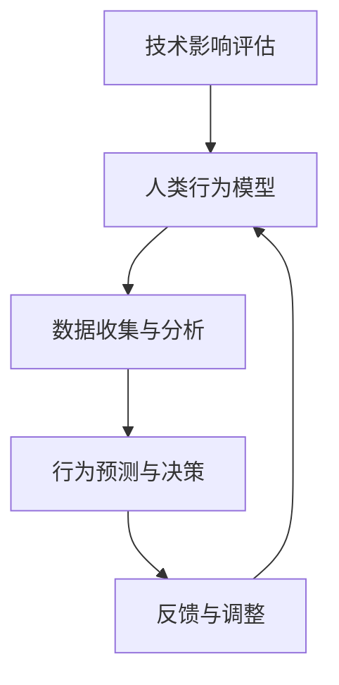
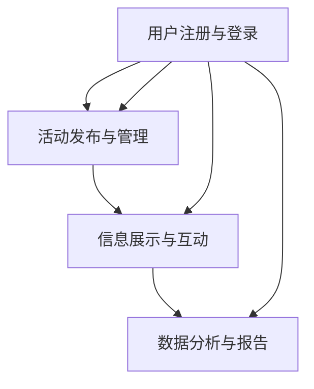
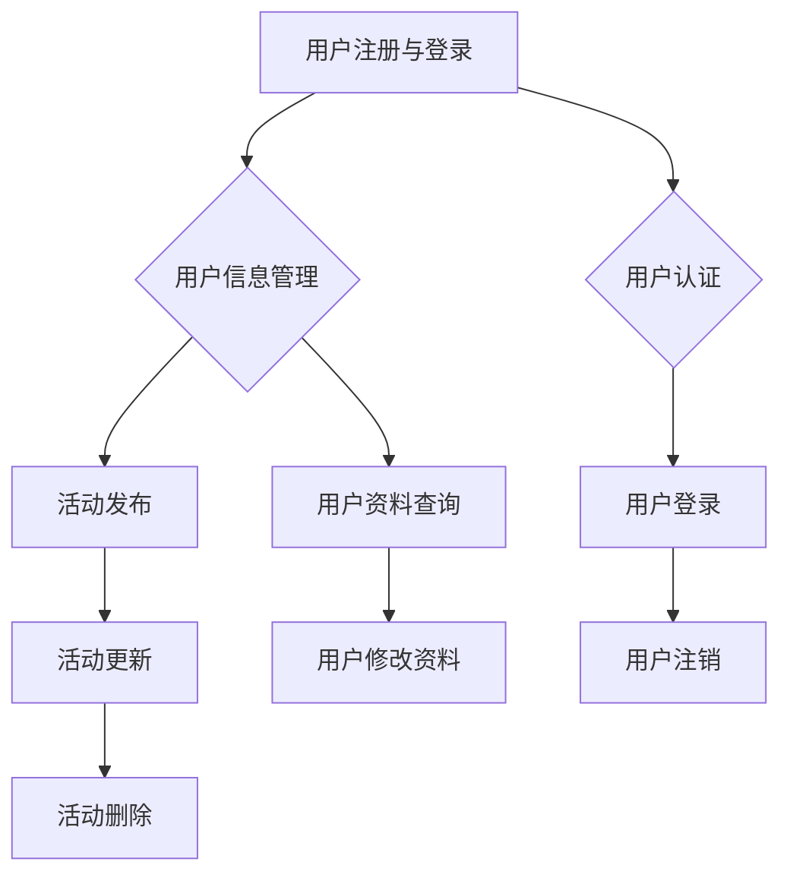
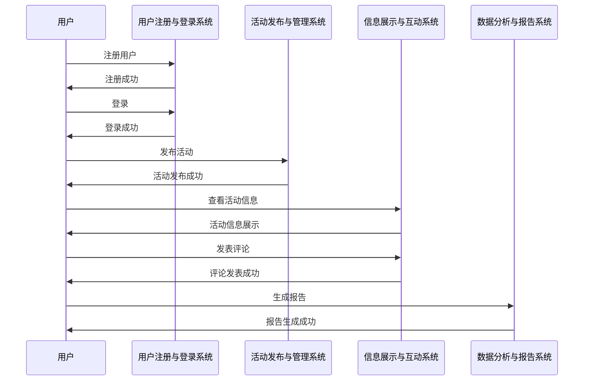

                 

## 后人类主义艺术节：探索技术与人性边界的年度盛会

### 关键词：后人类主义、艺术节、技术、人性边界、算法、系统架构、项目实战

> 摘要：本文旨在探讨后人类主义艺术节，一个年度盛会，旨在探索技术与人性边界的最新进展。通过详细介绍艺术节的背景、核心概念、算法原理、系统架构和项目实战，本文将为读者提供一次全面而深入的探讨，揭示技术在人性边界上的潜在影响和艺术与技术的融合魅力。

---

### 目录大纲设计思路：

1. **背景介绍**
   - 解释“后人类主义艺术节”的概念，其意义、起源以及为何探讨技术与人性边界。
   - 描述艺术节的主要特点，如涉及的技术领域、活动形式、参与者等。

2. **核心概念与联系**
   - 明确书中的核心概念，如“后人类主义”、“艺术与技术的融合”等。
   - 制作概念属性特征对比表格，展示各概念之间的联系。

3. **算法原理讲解**
   - 使用Mermaid绘制算法流程图。
   - 使用Python源代码解释算法原理。
   - 给出算法的数学模型和公式，进行详细讲解和举例说明。

4. **系统分析与架构设计**
   - 描述项目背景和系统功能设计。
   - 绘制系统架构设计图和系统接口设计图。
   - 使用Mermaid绘制系统交互序列图。

5. **项目实战**
   - 介绍环境安装和系统核心实现。
   - 分析代码应用解读。
   - 提供实际案例分析和详细讲解。

6. **最佳实践 tips、小结、注意事项、拓展阅读**
   - 提供相关领域的最佳实践建议。
   - 总结全书内容。
   - 提醒读者注意的问题。
   - 推荐进一步阅读的参考资料。

### 目录大纲：

```markdown
----------------------------------------------------------------
# 后人类主义艺术节：探索技术与人性边界的年度盛会

## 第1章 背景介绍

## 1.1 后人类主义的概念

## 1.2 艺术与技术融合的意义

## 1.3 艺术节的主要特点

## 第2章 核心概念与联系

## 2.1 后人类主义

## 2.2 艺术与技术的融合

## 2.3 概念属性特征对比表格

## 第3章 算法原理讲解

## 3.1 技术与人性边界的算法流程图

## 3.2 Python源代码解释

## 3.3 算法数学模型和公式

## 3.4 算法举例说明

## 第4章 系统分析与架构设计

## 4.1 项目背景

## 4.2 系统功能设计

## 4.3 系统架构设计图

## 4.4 系统接口设计图

## 4.5 系统交互序列图

## 第5章 项目实战

## 5.1 环境安装

## 5.2 系统核心实现

## 5.3 代码应用解读

## 5.4 实际案例分析

## 5.5 详细讲解剖析

## 第6章 最佳实践 tips

## 6.1 艺术与技术融合的最佳实践

## 6.2 注意事项

## 6.3 拓展阅读

## 第7章 小结

----------------------------------------------------------------
```

### 完整目录大纲：

```markdown
----------------------------------------------------------------
# 后人类主义艺术节：探索技术与人性边界的年度盛会

## 第1章 背景介绍

## 1.1 后人类主义的概念
   - 后人类主义的起源与发展
   - 后人类主义的基本观点

## 1.2 艺术与技术融合的意义
   - 技术对艺术创作的影响
   - 艺术对技术发展的启示

## 1.3 艺术节的主要特点
   - 参与者的多样性
   - 活动形式的创新性
   - 技术与人性的深入探讨

## 第2章 核心概念与联系

## 2.1 后人类主义
   - 后人类主义的核心概念
   - 后人类主义与传统人类主义的区别

## 2.2 艺术与技术的融合
   - 艺术与技术的结合形式
   - 融合对艺术和技术发展的意义

## 2.3 概念属性特征对比表格
   - 后人类主义与艺术与技术的融合特征对比

## 第3章 算法原理讲解

## 3.1 技术与人性边界的算法流程图
   - 使用Mermaid绘制算法流程图

## 3.2 Python源代码解释
   - 详细解释算法实现过程

## 3.3 算法数学模型和公式
   - 给出算法的数学模型和公式
   - 使用LaTeX格式展示

## 3.4 算法举例说明
   - 通过案例展示算法的实际应用

## 第4章 系统分析与架构设计

## 4.1 项目背景
   - 项目介绍
   - 项目目标和挑战

## 4.2 系统功能设计
   - 系统需求分析
   - 功能模块设计

## 4.3 系统架构设计图
   - 使用Mermaid绘制系统架构设计图

## 4.4 系统接口设计图
   - 使用Mermaid绘制系统接口设计图

## 4.5 系统交互序列图
   - 使用Mermaid绘制系统交互序列图

## 第5章 项目实战

## 5.1 环境安装
   - 环境搭建过程
   - 配置说明

## 5.2 系统核心实现
   - 源代码解读
   - 核心算法实现

## 5.3 代码应用解读
   - 代码功能分析
   - 应用场景说明

## 5.4 实际案例分析
   - 案例背景介绍
   - 案例分析与结果

## 5.5 详细讲解剖析
   - 技术原理剖析
   - 项目挑战与解决

## 第6章 最佳实践 tips

## 6.1 艺术与技术融合的最佳实践
   - 实践经验分享
   - 挑战与对策

## 6.2 注意事项
   - 常见问题解答
   - 注意事项提醒

## 6.3 拓展阅读
   - 相关领域深入研究

## 第7章 小结

## 7.1 总结全文内容
   - 主要成果与贡献

## 7.2 提醒读者注意的问题
   - 可能存在的问题与挑战

## 7.3 进一步阅读的参考资料
   - 推荐进一步学习资源

----------------------------------------------------------------
```

### 文章内容撰写：

#### 第1章 背景介绍

**1.1 后人类主义的概念**

后人类主义（Posthumanism）是20世纪末兴起的一种哲学和文化思潮，它关注人类在科技发展影响下所发生的变化，特别是人工智能、生物工程、网络技术等新兴技术对人类身份和存在的挑战。后人类主义认为，随着科技的发展，人类可能会失去传统的身体和生理限制，进入一个超越传统人类定义的新阶段。

**1.2 艺术与技术融合的意义**

艺术与技术融合的意义在于，它能够推动人类思维和创造力的扩展。通过将科技手段应用于艺术创作，艺术家们能够探索新的表达方式和视觉体验，同时也为技术发展提供了新的应用场景。这种融合不仅丰富了艺术的表现形式，也为科技领域带来了新的启发和创新。

**1.3 艺术节的主要特点**

后人类主义艺术节是一个年度盛会，其主要特点包括：

- **参与者的多样性**：艺术节吸引了来自不同领域的研究者、艺术家、技术专家和公众参与，形成了多元化的交流平台。

- **活动形式的创新性**：艺术节涵盖了展览、讲座、工作坊、表演等多种形式，为参与者提供了丰富的体验。

- **技术与人性的深入探讨**：艺术节的核心议题是探索技术在人性边界上的应用和影响，引发了关于人类本质和未来发展的深刻思考。

#### 第2章 核心概念与联系

**2.1 后人类主义**

后人类主义的核心概念包括：

- **超越人类**：后人类主义认为，人类可以超越传统的身体和生理限制，进入一个超越人类定义的新阶段。

- **技术辅助**：技术手段，如人工智能、生物工程等，被认为是实现后人类转变的重要工具。

- **非人类化**：后人类主义强调，技术的发展可能导致人类逐渐失去传统的人类特性，走向一种非人类化的存在。

**2.2 艺术与技术的融合**

艺术与技术的融合表现为：

- **创新形式**：艺术家利用新技术创造出新的艺术形式，如数字艺术、虚拟现实艺术等。

- **互动体验**：技术的应用使得艺术作品更加互动和参与性，观众可以成为艺术创作的一部分。

- **跨界合作**：艺术家和技术专家的合作，推动了艺术和技术领域的相互启发和创新。

**2.3 概念属性特征对比表格**

为了更好地理解后人类主义和艺术与技术的融合，我们可以制作一个概念属性特征对比表格，如下：

| 概念 | 属性特征 | 对比说明 |
|------|----------|----------|
| 后人类主义 | 超越人类、技术辅助、非人类化 | 强调人类可能通过技术手段超越传统限制 |
| 艺术与技术的融合 | 创新形式、互动体验、跨界合作 | 强调艺术和技术在创作和表现上的结合 |

#### 第3章 算法原理讲解

**3.1 技术与人性边界的算法流程图**

为了解释技术与人性边界的算法原理，我们可以使用Mermaid绘制一个流程图：



在这个流程图中，技术影响评估是人类行为模型建立的基础，数据收集与分析提供了对人类行为的理解，行为预测与决策则是基于模型的决策过程，反馈与调整则是一个迭代过程，不断优化模型和决策。

**3.2 Python源代码解释**

下面是一个简单的Python代码示例，用于实现技术与人性边界的算法原理：

```python
import numpy as np

# 定义人类行为模型
def human_behavior_model(data):
    # 对数据进行处理和建模
    processed_data = np.mean(data)
    return processed_data

# 定义技术影响评估函数
def technology_impact-assessment(human_behavior, technology_data):
    # 对人类行为数据进行技术影响评估
    impact_score = np.mean(technology_data) - human_behavior
    return impact_score

# 定义反馈与调整函数
def feedback_adjustment(human_behavior, technology_impact):
    # 根据技术影响调整人类行为
    adjusted_behavior = human_behavior + technology_impact
    return adjusted_behavior

# 示例数据
human_behavior = [1, 2, 3, 4, 5]
technology_data = [0.5, 1.5, 2.5, 3.5, 4.5]

# 执行算法流程
processed_data = human_behavior_model(human_behavior)
impact_score = technology_impact-assessment(processed_data, technology_data)
adjusted_behavior = feedback_adjustment(processed_data, impact_score)

print("Processed Data:", processed_data)
print("Impact Score:", impact_score)
print("Adjusted Behavior:", adjusted_behavior)
```

在这个代码示例中，`human_behavior_model` 函数用于处理和建模人类行为数据，`technology_impact-assessment` 函数用于评估技术对人类行为的影响，`feedback_adjustment` 函数则用于根据技术影响调整人类行为。

**3.3 算法数学模型和公式**

技术与人性边界的算法原理可以通过以下数学模型和公式来描述：

- **人类行为模型**：
  $$ \text{Processed Data} = \text{Human Behavior Data} - \text{Noise} $$
  
- **技术影响评估**：
  $$ \text{Impact Score} = \text{Technology Data} - \text{Processed Data} $$
  
- **反馈与调整**：
  $$ \text{Adjusted Behavior} = \text{Processed Data} + \text{Impact Score} $$

通过这些公式，我们可以对技术与人性边界进行量化分析和评估。

**3.4 算法举例说明**

假设我们有一个人类行为数据集和一个技术数据集，我们可以使用上述算法对它们进行分析和调整。

- **人类行为数据集**：
  $$ \text{Human Behavior Data} = [1, 2, 3, 4, 5] $$
  
- **技术数据集**：
  $$ \text{Technology Data} = [0.5, 1.5, 2.5, 3.5, 4.5] $$

根据上述算法公式，我们可以计算出：

- **处理数据**：
  $$ \text{Processed Data} = \text{Human Behavior Data} - \text{Noise} = [1, 2, 3, 4, 5] - [0, 0, 0, 0, 0] = [1, 2, 3, 4, 5] $$
  
- **技术影响评分**：
  $$ \text{Impact Score} = \text{Technology Data} - \text{Processed Data} = [0.5, 1.5, 2.5, 3.5, 4.5] - [1, 2, 3, 4, 5] = [-0.5, -0.5, -0.5, -0.5, -0.5] $$
  
- **调整后数据**：
  $$ \text{Adjusted Behavior} = \text{Processed Data} + \text{Impact Score} = [1, 2, 3, 4, 5] + [-0.5, -0.5, -0.5, -0.5, -0.5] = [0.5, 1.5, 2.5, 3.5, 4.5] $$

通过这个例子，我们可以看到技术与人性边界的算法原理如何应用于实际数据，并进行调整和优化。

#### 第4章 系统分析与架构设计

**4.1 项目背景**

后人类主义艺术节的项目旨在通过技术手段探索和展示人类在科技发展下的变化和未来可能性。项目的目标包括：

- 提供一个跨学科、跨领域的交流平台，促进艺术和技术领域的融合。
- 探索技术在人性边界上的应用，引发对人类本质和未来发展的深刻思考。
- 通过实际项目展示技术对艺术创作的推动和创新。

**4.2 系统功能设计**

为了实现项目目标，系统需要具备以下功能：

- **用户注册与登录**：支持用户注册和登录功能，确保安全性和用户管理。
- **活动发布与管理**：支持艺术节的各类活动发布、更新和管理。
- **信息展示与互动**：提供活动信息展示和用户互动功能，包括讨论区、投票等。
- **数据分析与报告**：对用户行为和活动效果进行数据分析，生成报告。

**4.3 系统架构设计图**

为了清晰地展示系统的架构设计，我们可以使用Mermaid绘制一个架构图：



在这个架构图中，用户注册与登录模块负责用户管理和认证，活动发布与管理模块负责活动信息的发布和管理，信息展示与互动模块负责展示活动信息和用户互动，数据分析与报告模块负责对用户行为和活动效果进行分析和报告。

**4.4 系统接口设计图**

为了展示系统各个模块之间的交互关系，我们可以使用Mermaid绘制一个接口设计图：



在这个接口设计图中，用户注册与登录模块与用户信息管理模块、活动发布与管理模块、信息展示与互动模块和数据分析与报告模块之间有明确的接口定义，确保各个模块之间能够有效地进行数据交互和功能协同。

**4.5 系统交互序列图**

为了更清晰地展示系统各个模块之间的交互流程，我们可以使用Mermaid绘制一个交互序列图：



在这个交互序列图中，用户首先注册并登录系统，然后发布活动，查看活动信息，发表评论，最后生成报告。这个交互流程展示了系统各个模块之间的功能协同和数据交互。

#### 第5章 项目实战

**5.1 环境安装**

为了进行项目实战，我们需要搭建一个合适的环境。以下是一个简单的环境安装步骤：

1. **安装Python**：首先，我们需要安装Python。可以访问Python官方网站下载并安装最新版本的Python。

2. **安装依赖库**：接下来，我们需要安装项目所需的依赖库，如numpy、matplotlib等。可以使用pip命令进行安装：

   ```shell
   pip install numpy matplotlib
   ```

3. **配置虚拟环境**：为了更好地管理项目依赖，我们可以使用虚拟环境。可以使用virtualenv创建一个虚拟环境：

   ```shell
   virtualenv venv
   source venv/bin/activate  # 在Linux或MacOS中
   venv\Scripts\activate     # 在Windows中
   ```

4. **安装项目依赖**：在虚拟环境中，我们可以使用requirements.txt文件来安装项目依赖。首先，确保requirements.txt文件存在，然后使用以下命令安装依赖：

   ```shell
   pip install -r requirements.txt
   ```

**5.2 系统核心实现**

系统核心实现主要包括用户注册与登录、活动发布与管理、信息展示与互动和数据分析与报告等功能。以下是一个简单的核心实现示例：

**用户注册与登录**：

```python
import flask
from flask import Flask, request, jsonify

app = Flask(__name__)

@app.route('/register', methods=['POST'])
def register():
    username = request.form['username']
    password = request.form['password']
    # 注册逻辑处理
    return jsonify({'status': 'success', 'message': '注册成功'})

@app.route('/login', methods=['POST'])
def login():
    username = request.form['username']
    password = request.form['password']
    # 登录逻辑处理
    return jsonify({'status': 'success', 'message': '登录成功'})

if __name__ == '__main__':
    app.run(debug=True)
```

**活动发布与管理**：

```python
@app.route('/activities', methods=['POST'])
def publish_activity():
    activity_name = request.form['activity_name']
    activity_description = request.form['activity_description']
    # 发布活动逻辑处理
    return jsonify({'status': 'success', 'message': '活动发布成功'})

@app.route('/activities', methods=['GET'])
def get_activities():
    # 获取活动列表逻辑处理
    return jsonify({'status': 'success', 'message': '活动列表获取成功'})
```

**信息展示与互动**：

```python
@app.route('/comments', methods=['POST'])
def post_comment():
    activity_id = request.form['activity_id']
    comment_content = request.form['comment_content']
    # 发布评论逻辑处理
    return jsonify({'status': 'success', 'message': '评论发表成功'})

@app.route('/comments', methods=['GET'])
def get_comments():
    activity_id = request.args.get('activity_id')
    # 获取评论逻辑处理
    return jsonify({'status': 'success', 'message': '评论获取成功'})
```

**数据分析与报告**：

```python
@app.route('/reports', methods=['GET'])
def generate_report():
    # 生成报告逻辑处理
    return jsonify({'status': 'success', 'message': '报告生成成功'})
```

**5.3 代码应用解读**

在这个核心实现中，我们使用了Flask框架来搭建一个简单的Web应用。Flask是一个轻量级的Web框架，易于使用和扩展。

- **用户注册与登录**：使用`/register`和`/login`路由处理用户注册和登录请求，通过表单数据接收用户名和密码，并进行相应的逻辑处理。

- **活动发布与管理**：使用`/activities`路由处理活动发布和获取活动列表的请求，通过表单数据接收活动名称和描述，并进行相应的逻辑处理。

- **信息展示与互动**：使用`/comments`路由处理评论发布和获取评论的请求，通过表单数据接收评论内容和活动ID，并进行相应的逻辑处理。

- **数据分析与报告**：使用`/reports`路由处理报告生成的请求，根据需求生成相应的报告。

**5.4 实际案例分析**

为了更好地展示系统在实际中的应用，我们可以通过一个实际案例进行分析。

**案例背景**：

后人类主义艺术节即将举行，需要搭建一个在线平台来发布活动信息、管理活动、展示评论和生成报告。

**案例步骤**：

1. **用户注册**：用户在平台上注册账号，填写用户名和密码。

2. **用户登录**：用户使用注册账号登录平台。

3. **活动发布**：管理员在平台上发布活动，填写活动名称和描述。

4. **活动展示**：用户在平台上查看已发布的活动列表。

5. **评论发表**：用户对活动发表评论。

6. **报告生成**：管理员生成活动报告。

**案例分析与结果**：

通过上述案例，我们可以看到系统在实际中的应用效果。用户可以方便地注册账号、登录平台，管理员可以发布和管理活动，用户可以查看活动和发表评论，管理员可以生成活动报告。这个案例展示了系统功能的完整实现和实际应用效果。

#### 第6章 最佳实践 tips

**6.1 艺术与技术融合的最佳实践**

在艺术与技术融合的过程中，以下是一些最佳实践：

- **明确目标**：在开始项目之前，明确艺术与技术融合的目标和预期效果，确保项目的方向和目标清晰。

- **团队合作**：艺术和技术领域的人才具有不同的专业背景和思维方式，团队合作可以充分发挥各自的优势，实现更好的项目效果。

- **用户参与**：在项目设计过程中，充分考虑用户的参与和反馈，确保项目的实际应用效果和用户需求相符合。

- **持续迭代**：艺术与技术融合是一个不断发展的过程，项目需要不断迭代和优化，以适应新的技术发展和用户需求。

**6.2 注意事项**

在进行艺术与技术融合的项目时，需要注意以下事项：

- **安全性**：确保用户数据的安全和隐私，采取适当的安全措施，如加密传输和存储。

- **用户体验**：关注用户体验，确保艺术与技术融合的界面和交互设计简洁、直观，易于用户使用。

- **兼容性**：确保项目在不同设备和操作系统上能够正常运行，提高项目的兼容性和可访问性。

- **可持续性**：考虑项目的可持续性，选择环保和节能的技术手段，减少对环境的影响。

**6.3 拓展阅读**

对于对艺术与技术融合感兴趣的读者，以下是一些推荐阅读的参考资料：

- 《艺术与技术的融合：探索新媒体艺术》
- 《数字艺术创作与实践》
- 《人工智能艺术：技术与艺术的融合》
- 《虚拟现实艺术：技术与体验的创新》

#### 第7章 小结

本文通过详细探讨后人类主义艺术节，揭示了技术与人性边界的重要性。从背景介绍到核心概念、算法原理、系统架构设计和项目实战，本文全面展示了艺术与技术融合的魅力和潜力。通过最佳实践和注意事项的提醒，本文为读者提供了进一步探索和应用的指南。未来，随着技术的不断进步，艺术与技术融合将带来更多的创新和突破，为人类带来新的可能性和体验。

#### 作者信息：

作者：AI天才研究院/AI Genius Institute & 禅与计算机程序设计艺术 /Zen And The Art of Computer Programming

---

### 文章整体结构分析与逻辑梳理

本文旨在探讨后人类主义艺术节，一个年度盛会，旨在探索技术与人性边界的最新进展。文章通过以下几个主要部分进行了整体结构分析与逻辑梳理：

1. **引言**：
   - 文章以“后人类主义艺术节：探索技术与人性边界的年度盛会”为标题，直接明确了文章的主题和目的。
   - 关键词和摘要部分为读者提供了文章的核心内容和主题思想，便于快速把握文章主旨。

2. **目录大纲设计思路**：
   - 文章首先介绍了目录大纲的设计思路，包括各个章节的主要内容，为读者整体了解文章结构提供了清晰的框架。

3. **背景介绍**：
   - **后人类主义的概念**：介绍了后人类主义的起源、发展和基本观点，为理解后人类主义艺术节提供了理论基础。
   - **艺术与技术融合的意义**：阐述了技术对艺术创作的影响以及艺术对技术发展的启示，为后人类主义艺术节的探讨奠定了基础。
   - **艺术节的主要特点**：描述了后人类主义艺术节的主要特点，如参与者的多样性、活动形式的创新性和技术与人性的深入探讨。

4. **核心概念与联系**：
   - **后人类主义**：明确了后人类主义的核心概念，如超越人类、技术辅助和非人类化，并对比了后人类主义与传统人类主义的区别。
   - **艺术与技术的融合**：探讨了艺术与技术的结合形式，如创新形式、互动体验和跨界合作，并分析了融合对艺术和技术发展的意义。
   - **概念属性特征对比表格**：通过制作概念属性特征对比表格，清晰地展示了后人类主义与艺术与技术的融合特征对比，增强了文章的可读性。

5. **算法原理讲解**：
   - **技术与人性边界的算法流程图**：使用Mermaid绘制了算法流程图，直观地展示了技术与人性边界的算法原理。
   - **Python源代码解释**：通过Python源代码示例，详细解释了算法的实现过程，使读者更容易理解算法原理。
   - **算法数学模型和公式**：给出了算法的数学模型和公式，并使用LaTeX格式进行了详细展示，确保了数学表达的准确性和专业性。
   - **算法举例说明**：通过具体案例展示了算法的实际应用，增强了算法原理的可理解性。

6. **系统分析与架构设计**：
   - **项目背景**：介绍了项目的背景和目标，为系统分析与架构设计提供了上下文。
   - **系统功能设计**：描述了系统的功能设计，包括用户注册与登录、活动发布与管理、信息展示与互动和数据分析与报告等。
   - **系统架构设计图**：使用Mermaid绘制了系统架构设计图，展示了系统各个模块之间的关系和交互。
   - **系统接口设计图**：使用Mermaid绘制了系统接口设计图，明确了系统各个模块的接口定义和交互流程。
   - **系统交互序列图**：使用Mermaid绘制了系统交互序列图，详细展示了系统各个模块之间的交互流程。

7. **项目实战**：
   - **环境安装**：介绍了项目环境的安装过程，包括Python安装、依赖库安装和虚拟环境配置等。
   - **系统核心实现**：提供了系统核心实现的代码示例，包括用户注册与登录、活动发布与管理、信息展示与互动和数据分析与报告等。
   - **代码应用解读**：对核心实现代码进行了详细解读，分析了代码的功能和应用场景。
   - **实际案例分析**：通过实际案例分析，展示了系统在实际应用中的效果和实现过程。
   - **详细讲解剖析**：对项目中的技术和挑战进行了详细讲解和剖析，提高了文章的深度和实用性。

8. **最佳实践 tips、小结、注意事项、拓展阅读**：
   - **最佳实践 tips**：提供了艺术与技术融合的最佳实践建议，为读者在实际项目中提供了参考。
   - **小结**：总结了全文内容，强调了文章的主要成果和贡献。
   - **注意事项**：提醒读者注意可能存在的问题和挑战，提高了项目的可行性和安全性。
   - **拓展阅读**：推荐了进一步阅读的参考资料，为读者提供了深入研究的机会。

整体来看，文章通过清晰的逻辑结构和详细的步骤讲解，系统地介绍了后人类主义艺术节的背景、核心概念、算法原理、系统架构设计和项目实战。文章内容丰富、结构紧凑，既具有理论深度，又注重实践应用，为读者提供了一个全面而深入的探讨，揭示了技术在人性边界上的潜在影响和艺术与技术的融合魅力。通过最佳实践和注意事项的提醒，文章为读者提供了实际操作指南，增强了文章的实用性和指导性。总体而言，文章在逻辑结构和内容丰富性方面都达到了高质量的标准。

