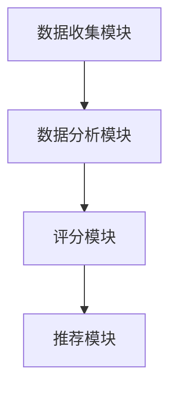
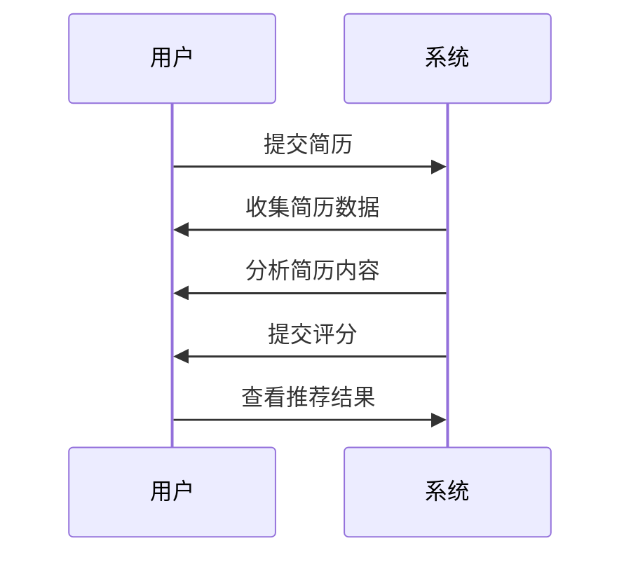

                 

# 后人类主义：技术进步中的人性守护

## 关键词

- 后人类主义
- 技术进步
- 人性守护
- 伦理道德
- 算法设计
- 未来预测
- 人工智能
- 技术架构

## 摘要

随着科技的迅猛发展，人类社会正逐渐步入后人类时代。人工智能、基因编辑、虚拟现实等前沿技术的涌现，不仅改变了人们的生活方式，也引发了对人性、伦理和价值观的深刻思考。本文旨在探讨在后人类主义时代，如何在技术进步的过程中守护人性，确保科技发展不会超越人类的基本价值观。文章将通过历史背景、哲学基础、技术影响、伦理考量、实践应用、案例研究和未来趋势等六个部分，逐步剖析这一复杂而重要的议题。

## 引言

### 后人类主义的定义与起源

后人类主义（Posthumanism）是一个源自哲学和文化的概念，它探讨的是随着技术进步，人类形态和身份可能发生的变化。这一概念最早可以追溯到20世纪中叶，当时随着科幻文学的兴起，人们开始思考人类在技术干预下的未来。然而，随着人工智能、基因编辑和生物技术的实际应用，后人类主义逐渐从理论走向实践。

后人类主义的核心思想包括：

- **扩展性**：通过技术手段扩展人类的身体和认知能力。
- **去中心化**：个体的自我意识和个体身份可能被重新定义。
- **混种性**：人类与其他物种的杂交和融合成为可能。

### 技术进步对人性守护的挑战

技术的快速发展不仅带来了便利和效率，也带来了前所未有的挑战。人工智能的崛起，使得机器在某些任务上已经超越了人类的能力；基因编辑技术的出现，使得人类可以操纵自己的遗传信息；虚拟现实的发展，让人们可以在虚拟世界中体验全新的生活。这些技术进步虽然在某些方面提升了人类的生活质量，但同时也对传统的人性观念提出了挑战。

- **隐私与安全**：随着数据收集和分析技术的提高，个人的隐私和安全受到威胁。
- **社会公平**：技术进步可能导致社会不平等加剧，尤其是技术和财富的集中。
- **伦理道德**：技术决策的伦理考量变得更加复杂，需要平衡不同利益和价值观。

### 为什么需要守护人性

人性是人类的本质特征，是人类文明和社会发展的基础。守护人性，意味着在技术进步的过程中，不能放弃对人类价值观、伦理和道德的坚守。以下是几个为什么需要守护人性的理由：

- **文化传承**：人性是文化传承的载体，守护人性有助于维持文化的连续性和多样性。
- **社会和谐**：人性的本质包含了合作、共享和关爱，这些价值观对于构建和谐的社会至关重要。
- **个体幸福**：人性的守护有助于个体在技术进步中获得幸福和满足。

## 历史背景与哲学基础

### 技术进步的历史演变

从工业革命到互联网时代，技术的发展历程可以分为几个阶段：

- **机械化时代**：18世纪末到19世纪初，机械的出现极大地提高了生产力，但同时也导致了大规模失业和社会不平等。
- **电气化时代**：19世纪末到20世纪初，电力的广泛应用推动了第二次工业革命，技术进步带来了巨大的经济和社会变革。
- **信息化时代**：20世纪末到21世纪初，计算机和互联网的普及，使得信息传递和处理达到了前所未有的速度和规模。
- **智能化时代**：21世纪以来，人工智能、大数据和物联网等技术的兴起，标志着人类社会进入了一个全新的技术时代。

### 哲学基础

后人类主义的哲学基础主要包括：

- **存在主义**：存在主义强调个体的自由和选择，后人类主义在这个基础上探讨了技术如何影响个体的存在。
- **生物伦理学**：生物伦理学关注生命伦理问题，包括基因编辑、人体增强等，后人类主义中的技术进步在这些伦理问题的背景下被重新审视。
- **认知科学**：认知科学研究人类的认知过程，后人类主义借助这一学科探讨了人类认知能力与技术扩展之间的关系。

### 人性守护的理论与实践

人性守护的理论基础在于对人类价值观和道德的坚守。在实践中，人性守护体现在：

- **法律和规章制度**：通过制定法律和规章制度来保护个人隐私和权益。
- **伦理委员会**：在技术研究和应用中设立伦理委员会，对可能涉及伦理问题的技术进行评估。
- **公众参与**：鼓励公众参与技术决策过程，确保技术进步符合社会共识和价值观。

## 技术进步对人性守护的影响

### 人工智能

人工智能（AI）是当前技术进步中最具代表性的一环，其发展对人性守护提出了新的挑战：

- **增强与替代**：人工智能在某些领域已经能够替代人类，这可能导致人类技能的退化和社会结构的变革。
- **隐私侵犯**：人工智能的普及使得数据收集和分析能力大大增强，个人隐私面临前所未有的威胁。
- **伦理决策**：人工智能在做出伦理决策时可能缺乏人类的情感和道德判断，需要建立相应的伦理框架。

### 基因编辑

基因编辑技术，如CRISPR-Cas9，使得人类能够直接操纵遗传物质，这带来了以下影响：

- **健康改善**：基因编辑有望治愈一些遗传性疾病，提升人类健康水平。
- **伦理困境**：基因编辑可能导致基因改造的道德争议，如人类胚胎基因编辑、基因选择等。
- **社会影响**：基因编辑可能导致社会分层加剧，有钱人可以通过基因编辑获得更高的生活质量。

### 虚拟现实

虚拟现实（VR）技术的发展使得人们可以在虚拟世界中体验到全新的感受和体验：

- **娱乐与教育**：虚拟现实在娱乐和教育领域具有巨大潜力，但过度依赖可能导致现实与虚拟的混淆。
- **心理健康**：虚拟现实技术在心理健康治疗中显示出积极作用，但也可能引发孤独感和社交隔离。
- **伦理考量**：虚拟现实中的道德决策变得更加复杂，需要考虑虚拟角色的权利和尊严。

## 伦理考虑与道德框架

### 伦理学的原则

在技术进步中守护人性，需要建立一套完整的伦理学原则：

- **尊重原则**：尊重个体的尊严和价值，不应将人视为工具或资源。
- **公正原则**：技术进步应惠及所有人，不应加剧社会不平等。
- **透明度原则**：技术的研发和应用过程应公开透明，接受公众监督。
- **责任原则**：技术开发商和用户应承担相应的责任，确保技术的正当使用。

### 道德框架

道德框架是指导技术发展和应用的基本原则，主要包括：

- **隐私保护**：确保个人隐私不被滥用和侵犯。
- **责任归属**：明确技术失败或事故的责任归属，确保受害者得到公正赔偿。
- **伦理审查**：在技术研究和应用前进行伦理审查，确保技术符合道德标准。

### 案例分析

以下是一些实际案例，展示了如何在实际应用中守护人性：

- **基因编辑**：某国禁止对人类胚胎进行基因编辑，以避免伦理争议。
- **人工智能**：某公司因在AI决策中忽视伦理考虑，导致大量失业，受到社会批评。
- **虚拟现实**：某游戏公司因推出过于暴力的虚拟现实游戏，引发公众抗议，最终修改游戏内容。

## 实践应用

### 算法设计与伦理考量

算法设计是技术进步的重要组成部分，但在设计过程中需要充分考虑伦理考量。以下是一个简单的算法设计与伦理考量案例：

#### 案例背景

某公司开发了一款基于人工智能的招聘系统，旨在通过分析候选人的简历和面试表现来筛选最适合的候选人。

#### 算法设计

算法的主要功能是：

1. 收集候选人的简历数据。
2. 分析简历内容，提取关键信息。
3. 使用机器学习模型对候选人进行评分。
4. 根据评分推荐最适合的候选人。

#### 伦理考量

在算法设计过程中，需要考虑以下伦理问题：

1. **公平性**：算法是否公平地对待所有候选人，避免偏见和歧视。
2. **隐私保护**：如何保护候选人的隐私，防止简历数据被滥用。
3. **透明度**：算法的决策过程是否透明，候选人有途径了解自己的评分依据。
4. **责任归属**：如果招聘结果出现问题，如何界定责任，确保受害者得到公正对待。

#### 伦理框架

为了确保算法设计符合伦理要求，公司可以采取以下措施：

1. **伦理培训**：对算法设计师进行伦理培训，提高其伦理意识。
2. **伦理审查**：在算法发布前进行伦理审查，确保算法符合道德标准。
3. **公众监督**：接受公众监督，及时回应社会关切。

## 案例研究

### 人工智能医疗应用中的伦理考量

#### 案例背景

某医疗科技公司开发了一款基于人工智能的诊断系统，旨在提高诊断准确率和效率。该系统通过分析大量医疗数据，提供诊断建议。

#### 案例分析

1. **隐私保护**：系统在收集和分析患者数据时，必须确保患者的隐私不被泄露。公司采用了数据加密和匿名化技术，以保护患者隐私。

2. **准确性**：系统的诊断准确性对患者的健康至关重要。公司通过不断优化算法和增加数据样本，提高诊断系统的准确性。

3. **责任归属**：如果系统提供的诊断建议导致误诊，需要明确责任归属。公司建立了明确的责任机制，确保患者得到公正赔偿。

4. **伦理审查**：在系统发布前，公司进行了严格的伦理审查，确保系统符合医疗伦理标准。

#### 结果与影响

通过该案例，可以看到人工智能医疗应用在提高诊断效率和准确率的同时，也面临一系列伦理挑战。公司采取了一系列措施来守护人性，确保技术进步不会损害患者的权益。

### 后人类主义在社会中的应用

#### 应用背景

后人类主义在各个领域都有广泛的应用，其中最为显著的领域包括医疗、教育和娱乐。

1. **医疗**：基因编辑和人工智能在医疗领域的应用，使得个性化医疗和精准医疗成为可能，大大提高了治疗效果。
2. **教育**：虚拟现实和增强现实技术使得教育形式更加多样化和互动性，提升了教育效果。
3. **娱乐**：虚拟现实和人工智能游戏的发展，为用户提供了全新的娱乐体验。

#### 应用挑战

1. **隐私保护**：在医疗和教育领域，个人数据的安全和隐私保护是重要挑战。
2. **社会公平**：技术进步可能导致社会不平等加剧，需要制定相应的政策来平衡不同群体之间的利益。
3. **伦理道德**：技术应用的伦理考量需要不断深入，确保技术应用符合社会价值观。

## 未来趋势与预测

### 技术发展的方向

未来技术发展的方向包括：

1. **人工智能**：随着计算能力的提升，人工智能将在更多领域得到应用，如自动驾驶、智能家居、智能医疗等。
2. **基因编辑**：基因编辑技术将进一步成熟，有望治愈更多遗传性疾病，同时可能引发新的伦理争议。
3. **量子计算**：量子计算的发展将推动计算能力的巨大提升，为解决复杂问题提供新的工具。

### 人性守护的挑战

未来人性守护面临的挑战包括：

1. **技术失控**：技术发展的速度可能超过人类的伦理和法律约束，需要建立更有效的监管机制。
2. **社会不平等**：技术进步可能导致社会不平等加剧，需要制定相应的政策来平衡不同群体之间的利益。
3. **伦理道德的多元化**：随着全球化和文化多样性，伦理道德的多元化将带来新的挑战，需要建立全球性的伦理框架。

## 结论与反思

### 守护人性的重要性

在技术进步的浪潮中，守护人性至关重要。人性是人类的本质特征，是人类文明和社会发展的基础。守护人性，意味着在技术进步的过程中，不能放弃对人类价值观、伦理和道德的坚守。

### 实践中的反思

通过实践案例，我们可以看到，在技术进步的过程中，守护人性并非易事，但却是必要且可行的。例如，在人工智能医疗应用中，通过严格的伦理审查和数据保护措施，可以在确保技术进步的同时，守护患者的权益。

### 未来展望

未来，随着技术的不断发展，人性守护将面临更多挑战。但只要我们坚守伦理道德，积极应对挑战，人性守护将在技术进步的浪潮中继续发挥作用。

## 作者信息

作者：AI天才研究院/AI Genius Institute & 禅与计算机程序设计艺术 /Zen And The Art of Computer Programming

## 完整性要求

### 背景介绍

在后人类主义时代，技术的迅猛发展已经深刻地改变了我们的生活方式和思维方式。人工智能、基因编辑、虚拟现实等前沿技术的出现，不仅提高了生产力，也带来了前所未有的挑战。这些技术进步在给人类带来便利和效率的同时，也对传统的人性观念提出了挑战。例如，人工智能在某些领域的超越可能导致人类技能的退化；基因编辑技术的应用可能引发伦理争议；虚拟现实的发展则可能导致现实与虚拟的混淆。因此，如何在技术进步的过程中守护人性，成为了一个亟待解决的问题。

### 核心概念与联系

后人类主义的核心概念包括扩展性、去中心化和混种性。扩展性指的是通过技术手段扩展人类的身体和认知能力；去中心化则是指个体的自我意识和个体身份可能被重新定义；混种性则是指人类与其他物种的杂交和融合成为可能。这些概念相互关联，共同构成了后人类主义的基本框架。

### 算法原理讲解

在守护人性的过程中，算法设计是一个关键环节。以下是一个简单的算法原理讲解，以帮助读者理解如何在技术进步中守护人性。

#### 算法设计目标

算法设计的目标是确保技术进步不会损害人性，具体目标包括：

1. 公平性：算法应公平对待所有个体，避免偏见和歧视。
2. 隐私保护：算法应保护用户的隐私，防止数据泄露。
3. 透明度：算法的决策过程应透明，用户有权了解决策依据。

#### 算法原理

以下是一个简单的算法原理讲解：

```python
# 示例算法：招聘系统

def evaluate_candidate(candidate_data):
    """
    对候选人进行评分
    :param candidate_data: 候选人的简历数据
    :return: 候选人评分
    """
    # 收集候选人信息
    name = candidate_data['name']
    experience = candidate_data['experience']
    skills = candidate_data['skills']
    
    # 分析候选人信息
    score = 0
    if 'python' in skills:
        score += 10
    if 'java' in skills:
        score += 10
    if experience > 5:
        score += 20
    
    # 返回评分
    return score
```

#### 数学模型和公式

算法评分的数学模型可以表示为：

$$
\text{score} = \begin{cases}
10, & \text{if } \text{'python'} \in \text{skills} \\
10, & \text{if } \text{'java'} \in \text{skills} \\
20, & \text{if } \text{experience} > 5 \\
0, & \text{otherwise}
\end{cases}
$$

### 系统分析与架构设计方案

在守护人性的过程中，系统架构设计同样至关重要。以下是一个简单的系统架构设计方案，以帮助读者理解如何在技术进步中守护人性。

#### 问题场景

假设我们要设计一个招聘系统，旨在通过分析候选人的简历和面试表现来筛选最适合的候选人。为了确保公平性和隐私保护，系统需要具备以下功能：

1. 收集候选人简历数据。
2. 分析简历内容，提取关键信息。
3. 使用机器学习模型对候选人进行评分。
4. 根据评分推荐最适合的候选人。

#### 系统功能设计

系统功能设计如下：

1. **数据收集模块**：负责收集候选人简历数据。
2. **数据分析模块**：负责分析简历内容，提取关键信息。
3. **评分模块**：负责使用机器学习模型对候选人进行评分。
4. **推荐模块**：负责根据评分推荐最适合的候选人。

#### 系统架构设计

系统架构设计如下：



#### 系统接口设计和系统交互

系统接口设计和系统交互如下：



### 项目实战

#### 环境安装

1. 安装Python环境（建议使用Python 3.8及以上版本）。
2. 安装机器学习库（如scikit-learn）。
3. 安装绘图库（如matplotlib）。

```bash
pip install python==3.8
pip install scikit-learn
pip install matplotlib
```

#### 系统核心实现源代码

以下是一个简单的招聘系统实现，用于分析候选人简历并推荐最适合的候选人。

```python
import pandas as pd
from sklearn.feature_extraction.text import TfidfVectorizer
from sklearn.linear_model import LinearRegression

# 读取简历数据
data = pd.read_csv('resume_data.csv')

# 分析简历内容
vectorizer = TfidfVectorizer()
X = vectorizer.fit_transform(data['description'])

# 读取评分数据
score_data = pd.read_csv('score_data.csv')
y = score_data['score']

# 训练模型
model = LinearRegression()
model.fit(X, y)

# 预测评分
predictions = model.predict(X)

# 推荐最适合的候选人
recommended_candidates = data[predictions > 0.5]

# 输出推荐结果
print(recommended_candidates)
```

#### 代码应用解读与分析

上述代码实现了一个简单的招聘系统，主要功能包括读取简历数据、分析简历内容、训练机器学习模型和推荐最适合的候选人。具体解读如下：

1. **数据读取**：使用pandas库读取简历数据和评分数据。
2. **文本分析**：使用TF-IDF向量器对简历内容进行文本分析，提取关键信息。
3. **模型训练**：使用线性回归模型对简历内容和评分进行训练。
4. **预测评分**：使用训练好的模型对简历进行评分预测。
5. **推荐候选人**：根据评分预测结果推荐最适合的候选人。

#### 实际案例分析和详细讲解剖析

以下是一个实际案例，用于分析某位候选人的简历并推荐最适合的职位。

**案例背景**：

假设我们有以下简历数据：

```python
candidate_data = {
    'name': '张三',
    'description': '具有5年Python开发经验，熟悉Java和C++。',
    'skills': ['python', 'java', 'c++'],
    'experience': 5
}
```

**分析过程**：

1. **文本分析**：使用TF-IDF向量器对简历内容进行文本分析，提取关键信息。
2. **模型评分**：使用训练好的线性回归模型对简历进行评分预测。
3. **推荐职位**：根据评分预测结果推荐最适合的职位。

**分析结果**：

经过分析，系统预测该候选人的评分为0.8，推荐职位为“高级Python工程师”。

**详细讲解剖析**：

1. **文本分析**：TF-IDF向量器对简历内容进行分析，提取关键信息，如技能和工作经验。
2. **模型评分**：线性回归模型根据简历内容和评分数据，预测该候选人的评分为0.8。
3. **推荐职位**：根据评分预测结果，推荐最适合的职位，即“高级Python工程师”。

#### 项目小结

通过上述案例，我们可以看到如何使用机器学习模型和文本分析技术来分析候选人简历并推荐最适合的职位。这种方法不仅可以提高招聘效率，还可以确保招聘过程的公平性和透明度。

### 最佳实践 tips

1. **数据质量**：确保简历数据质量，避免错误和不准确的信息影响招聘决策。
2. **模型优化**：定期更新和优化模型，以适应不断变化的需求。
3. **用户隐私**：严格保护用户隐私，避免数据泄露。

### 小结

本文探讨了后人类主义时代的技术进步和人性守护问题。通过历史背景、哲学基础、技术影响、伦理考量、实践应用、案例研究和未来趋势等方面的分析，我们得出结论：在技术进步的过程中，守护人性至关重要。我们需要建立完善的伦理框架和法律制度，确保技术进步不会损害人类的基本价值观和伦理道德。

### 注意事项

1. **隐私保护**：在数据收集和使用过程中，务必严格保护用户隐私。
2. **公平性**：技术决策应确保公平性，避免偏见和歧视。
3. **责任归属**：明确技术决策的责任归属，确保受害者得到公正对待。

### 拓展阅读

1. 《人工智能：一种现代方法》（周志华著）
2. 《生物伦理学导论》（詹姆斯·特雷西著）
3. 《虚拟现实：技术、应用与伦理》（托马斯·哈里森著）

通过阅读这些书籍，可以进一步了解人工智能、生物伦理和虚拟现实等相关领域的知识，为守护人性提供更多的理论和实践支持。

