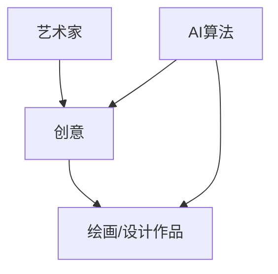
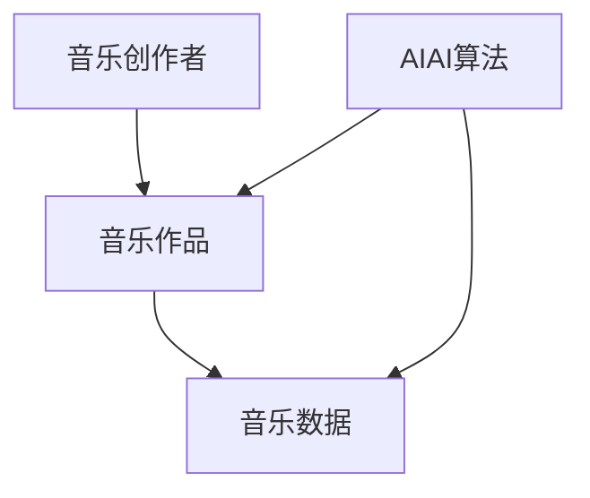
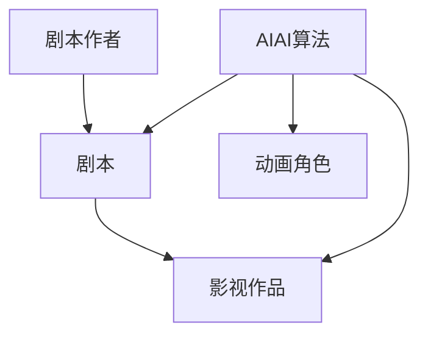

                 

### 引言

在人工智能（AI）飞速发展的今天，我们正见证着一个前所未有的新时代——后人类时代的到来。随着AI技术的不断进步，人工智能不仅在数据处理、模式识别、决策制定等传统领域表现出色，更在艺术创作中展现出了惊人的潜力。后人类艺术，即由AI与人类共同创作的艺术形式，正在成为这个时代的重要标志。

后人类艺术的提出，源于AI在创意领域的突破性进展。传统的艺术创作很大程度上依赖于人类的直觉、情感和经验，而AI的介入，为艺术注入了全新的元素。它不仅能够模拟和扩展人类的创意能力，还能够突破人类的思维局限，创造出前所未有的艺术作品。因此，探讨AI与人类创意的碰撞，不仅是对艺术本身的深入思考，更是对未来文化形态的预判。

本文旨在通过系统的分析和深入的探讨，揭示AI与人类创意在艺术创作中的互动关系。我们首先将回顾AI在艺术领域的应用现状，接着分析人类创意的演变历程及其局限性。在此基础上，我们将探讨AI与人类创意的互动机制，分析后人类艺术带来的挑战与机遇，并展望其未来发展。最后，我们将总结全文，提出对艺术家的启示和未来研究的方向。

通过这一系列探讨，我们希望能够为读者提供一个全面、深入的理解，帮助大家更好地把握这个充满变革与机遇的时代。

## 文章关键词

后人类艺术、人工智能（AI）、创意、艺术创作、互动机制、挑战与机遇

## 文章摘要

本文深入探讨了后人类艺术这一前沿领域，分析了人工智能（AI）在艺术创作中的应用及其与人类创意的碰撞。我们首先介绍了后人类艺术的概念和背景，随后回顾了AI在艺术领域的应用现状。接着，我们探讨了人类创意的演变及其局限性，揭示了AI如何扩展和促进人类的创意能力。在分析AI与人类创意的互动机制后，我们探讨了后人类艺术带来的挑战与机遇，并展望了其未来发展。最后，我们总结了全文，提出了对艺术家的启示和未来研究的方向。通过这一系列探讨，本文旨在为读者提供一个全面、深入的理解，帮助大家更好地把握后人类艺术这一新兴领域。

## 第一部分: 引言与背景

### 1.1 问题的提出

在当今科技迅猛发展的时代，人工智能（AI）已经成为推动社会进步的重要力量。随着AI技术的不断突破，其应用范围也在不断扩展，从传统的工业生产到医疗诊断，从金融服务到交通运输，AI正深刻地改变着我们的生活方式。然而，在艺术领域，AI的应用同样引起了广泛的关注。后人类艺术的提出，正是为了探讨AI在艺术创作中的角色和影响。

后人类艺术，顾名思义，是指由人工智能和人类共同创作的艺术作品。这一概念的出现，源于AI在创造性任务中的卓越表现。传统艺术创作主要依赖于人类的直觉、情感和经验，而AI的介入，为艺术注入了全新的活力。它不仅能够模仿和扩展人类的创意能力，还能够突破人类的思维局限，创造出前所未有的艺术形式。因此，探讨后人类艺术，不仅是对艺术创作方式的革新，更是对人类与机器互动方式的重新思考。

### 1.2 后人类艺术的定义

后人类艺术可以定义为一种融合了人工智能与人类创意的新型艺术形式。在这种形式下，AI不仅仅是作为工具或助手，而是成为艺术创作的核心参与者。后人类艺术的创作过程通常包括以下几个阶段：

1. **数据采集与处理**：AI首先从大量的数据中提取出有用的信息，这些数据可能包括艺术史资料、人类创作的艺术作品、自然景观、音乐等。

2. **模式识别与生成**：通过训练和学习，AI能够识别出数据中的模式，并基于这些模式生成新的创意。这种模式识别不仅限于视觉和听觉信息，还包括语言、文本等多种形式。

3. **艺术创作**：AI根据识别出的模式生成新的艺术作品，这些作品可能包括绘画、音乐、文学、电影等多种形式。

4. **交互与反馈**：在艺术创作过程中，人类艺术家可以与AI进行交互，提供反馈，共同完善艺术作品。

后人类艺术的特点主要体现在以下几个方面：

- **多样性**：AI能够通过大量的数据分析和模式识别，生成多种风格和形式的艺术作品，极大地丰富了艺术创作的多样性。

- **创新性**：AI在创作过程中不受限于人类的经验和直觉，能够提出新颖独特的创意，挑战传统艺术的边界。

- **互动性**：人类艺术家与AI的互动，使得艺术创作过程变得更加动态和多元，也增加了艺术作品的深度和层次。

- **智能化**：AI在艺术创作中不断优化和创新，使得艺术作品更加符合观众的喜好和需求。

### 1.3 AI与人类创意的碰撞

AI与人类创意的碰撞，不仅体现在艺术创作中，也涵盖了设计、音乐、文学等多个领域。在这一过程中，AI不仅充当了创意的拓展工具，还成为了艺术创作的合作伙伴。

1. **绘画与设计**：AI通过图像识别和生成算法，可以自动创作出具有独特风格的艺术作品。例如，AI可以分析一幅著名的油画，并生成风格相似但内容不同的作品。这种自动生成的艺术作品，不仅为艺术家提供了新的创作灵感，也为观众带来了新的艺术体验。

2. **音乐创作**：AI在音乐创作中的应用也越来越广泛。通过学习大量的音乐数据，AI可以自动生成新的旋律、和弦和节奏。这些音乐作品不仅能够模仿人类艺术家的风格，还能够创造出全新的音乐语言。

3. **文学创作**：在文学创作领域，AI也开始展现出其独特的优势。通过分析大量的文学作品，AI可以生成新的故事情节、人物对话和文章结构。这种自动生成的文学作品，不仅丰富了文学创作的形式，也为读者提供了全新的阅读体验。

然而，AI与人类创意的碰撞也带来了许多挑战和争议。一方面，一些人担心AI会取代人类艺术家，导致艺术创作的多样性和深度受到限制。另一方面，也有人认为，AI的介入为艺术创作注入了新的活力和可能性，使得艺术变得更加多元和包容。

总的来说，AI与人类创意的碰撞不仅是一个技术问题，更是一个哲学和社会问题。它挑战了我们对艺术和创意的传统理解，也推动了艺术创作和艺术形式的不断创新。在接下来的部分，我们将深入探讨AI在艺术领域的具体应用，以及人类创意的演变和局限性。

## AI在艺术领域的应用

人工智能（AI）在艺术领域的应用日益广泛，其独特的能力使得艺术创作的方式和过程发生了革命性的变化。以下是AI在绘画、设计、音乐、文学等艺术形式中的应用及其影响力。

### 1.1 AI绘画与设计

AI在绘画和设计领域的应用最为显著。通过深度学习和图像处理技术，AI可以自动生成具有独特风格的艺术作品。例如，谷歌的DeepDream算法能够将普通照片转换成具有抽象和梦境般视觉效果的图像。AI不仅能够模仿著名的艺术风格，如印象派、野兽派等，还能创造全新的视觉语言。设计师们利用AI工具，可以快速生成大量设计方案，从而提高创意效率和创新能力。

#### 核心概念原理：

- **深度学习**：通过训练神经网络模型，AI可以识别和生成图像中的模式。
- **图像生成对抗网络（GAN）**：GAN通过两个神经网络（生成器和判别器）的对抗训练，能够生成逼真的图像。

#### 概念属性特征对比表格：

| 特征             | 普通绘画与设计     | AI绘画与设计       |
|------------------|-------------------|--------------------|
| 创新性           | 受限于人类的直觉和经验   | 可以突破人类思维局限   |
| 速度             | 人工创作过程较慢       | 自动生成，速度快       |
| 多样性           | 受艺术家个人风格限制     | 可以生成多种风格和形式  |

#### ER实体关系图架构：

### 1.2 AI音乐与舞蹈

AI在音乐创作和舞蹈编排中的应用也取得了显著进展。AI可以通过学习大量的音乐数据，生成新的旋律、和弦和节奏。例如，AIVA（Artificial Intelligence Virtual Artist）可以通过训练生成完整的交响乐作品。在舞蹈编排方面，AI可以根据音乐和动作数据自动生成舞蹈动作序列，为舞者提供即时的编排灵感。

#### 核心概念原理：

- **生成对抗网络（GAN）**：用于生成逼真的音乐信号。
- **递归神经网络（RNN）**：用于捕捉音乐中的时间和结构特性。

#### 概念属性特征对比表格：

| 特征             | 传统音乐创作       | AI音乐创作         |
|------------------|-------------------|--------------------|
| 创新性           | 受人类经验和技巧限制   | 可以产生新颖的创意     |
| 个性化           | 依赖于艺术家个性       | 可以根据用户偏好调整   |
| 灵活性           | 需要反复尝试和修改     | 自动生成，效率高       |

#### ER实体关系图架构：

### 1.3 AI影视与动画

在影视和动画制作中，AI的应用同样显著。AI可以用于角色动画、特效制作和剧本生成。例如，使用机器学习算法，AI可以自动生成动画角色的表情和动作，提高动画制作的效率。在剧本创作方面，AI可以通过分析大量剧本数据，生成新的剧情和对话。

#### 核心概念原理：

- **强化学习**：用于优化动画角色的行为。
- **自然语言处理（NLP）**：用于生成剧本和对话。

#### 概念属性特征对比表格：

| 特征             | 传统影视制作       | AI影视制作         |
|------------------|-------------------|--------------------|
| 创作效率         | 需要长时间人工制作   | 自动生成，效率高     |
| 创新性           | 受限于人类创意       | 可以突破人类思维局限  |
| 多样性           | 受制作技术和资金限制   | 可以生成多种风格和形式 |

#### ER实体关系图架构：

通过以上几个方面的介绍，我们可以看到AI在艺术领域已经展现了巨大的潜力。它不仅能够扩展和促进人类的创意能力，还能够带来前所未有的艺术体验。然而，AI在艺术创作中的应用也面临着许多挑战和争议，这些将在后续章节中详细讨论。

## 人类创意的演变

### 3.1 人类创意的起源与发展

人类创意的起源可以追溯到古代，那时的人们通过简单的符号和图案表达思想和情感。随着时间的推移，人类创意不断演变和发展，形成了丰富多彩的艺术形式。从古代的壁画、雕塑，到中世纪的绘画、建筑，再到现代的各种艺术形式，如音乐、文学、电影等，人类创意的发展历程充满了探索和创新。

在古代，艺术创作主要是实用性的，如壁画和雕塑通常用于装饰庙宇和宫殿，传达宗教和神话故事。而到了中世纪，艺术创作开始逐渐脱离宗教束缚，转向对自然和人类生活的描绘。文艺复兴时期，人类创意迎来了一个新的高峰，艺术家们通过绘画、雕塑和建筑，对自然和人类形象进行了深入探索和表现。

进入现代，随着科技和文化的进步，人类创意的形式和内容更加多样。20世纪以来，抽象艺术、行为艺术、装置艺术等新兴艺术形式不断涌现，挑战和拓展了传统艺术的边界。与此同时，多媒体技术和互联网的发展，也为人类创意提供了新的平台和手段，使得艺术创作变得更加开放和多元化。

### 3.2 人类创意的特点与局限

人类创意具有以下几个显著特点：

1. **主观性**：艺术创作在很大程度上依赖于艺术家的个人情感、思想和价值观，这使得每件艺术作品都具有独特性和个性。
2. **情感表达**：艺术创作往往承载着艺术家的情感和思想，通过作品传达给观众，激发观众的共鸣和情感。
3. **形式多样性**：人类创意可以表现为各种形式，包括绘画、雕塑、音乐、文学、电影等，每种形式都有其独特的表现力和艺术价值。
4. **文化传承**：艺术创作是人类文化传承的重要方式，通过艺术作品，人们可以了解和传承不同的文化传统和历史记忆。

然而，人类创意也存在一定的局限性：

1. **思维局限**：艺术创作受到艺术家个人经验和认知的限制，很难完全突破现有的思维框架和创作模式。
2. **时间成本**：艺术创作通常需要较长的创作时间和反复的修改，这限制了艺术家的创作速度和效率。
3. **资源依赖**：艺术创作往往需要特定的资源和条件，如材料、工具、资金等，这些资源的限制会影响艺术创作的多样性和深度。
4. **观众理解**：艺术作品需要观众的理解和共鸣，而不同的观众可能有不同的审美偏好和理解方式，这可能导致艺术作品的接受度和影响力有限。

### 3.3 创意的未来

随着人工智能（AI）技术的不断发展，人类创意的未来面临着前所未有的机遇和挑战。AI不仅能够扩展和促进人类的创意能力，还能够突破人类的思维局限，为艺术创作带来全新的可能性。

首先，AI可以通过深度学习和数据分析，帮助艺术家发现和利用新的创意元素。例如，AI可以分析大量的艺术作品，提取出其中的模式和风格，为艺术家提供灵感和参考。此外，AI还可以通过生成对抗网络（GAN）等技术，自动生成新的艺术作品，为艺术家提供丰富的创作素材。

其次，AI可以优化艺术创作的流程和效率。例如，通过自动化工具，艺术家可以更快速地完成作品，减少重复性和繁琐的工作。同时，AI还可以帮助艺术家更好地理解观众的反馈，根据观众的需求和偏好进行个性化的艺术创作。

然而，AI的介入也带来了一些挑战。一方面，AI可能会取代人类艺术家的某些工作，导致艺术创作的多样性和深度受到限制。另一方面，AI的介入可能会削弱艺术作品的主观性和情感表达，使得艺术创作更加趋于同质化和商业化。

总的来说，人类创意的未来将在AI的辅助下迎来新的发展机遇，但同时也需要面对诸多挑战。如何平衡人类创意和AI技术的关系，如何确保艺术创作的独特性和多样性，将是未来艺术领域需要深入探讨和解决的问题。

### 4. AI与人类创意的互动

随着人工智能（AI）在艺术创作中的应用日益普及，AI与人类创意之间的互动成为了一个备受关注的话题。这种互动不仅改变了艺术创作的传统方式，也为艺术家们带来了新的创作灵感和挑战。本节将详细探讨AI如何促进人类创意，并分析人类对AI艺术的接受与反馈。

#### 4.1 AI对人类创意的促进作用

AI在艺术创作中扮演的角色越来越多，它不仅提供了新的工具和平台，还通过以下几种方式促进了人类创意：

1. **数据驱动创新**：AI通过分析和处理大量的数据，可以帮助艺术家发现新的创意元素。例如，通过分析大量的绘画作品，AI可以识别出某些流行的风格和主题，从而为艺术家提供灵感。这种数据驱动的创新，使得艺术创作不再局限于个人的经验和直觉，而是可以基于更为广泛的数据基础。

2. **辅助创作工具**：AI可以提供各种辅助创作工具，帮助艺术家更高效地完成作品。例如，AI绘画工具可以自动生成各种风格的图像，艺术家可以根据这些图像进行修改和完善，从而节省时间并提高创作效率。此外，AI还可以帮助艺术家进行颜色搭配、布局设计等，提供更加精细的创作支持。

3. **风格迁移**：通过深度学习技术，AI可以将一种艺术风格迁移到另一种形式或内容上。例如，AI可以将一幅古典油画的风格应用到一幅现代插画上，或者将一位艺术家的风格应用到另一件作品上。这种风格迁移不仅拓宽了艺术创作的可能性，也为艺术家提供了新的创作手段。

4. **实时反馈**：AI可以实时分析观众的反馈，帮助艺术家了解作品的效果，并根据反馈进行调整。这种实时反馈机制，使得艺术创作更加动态和互动，艺术家可以根据观众的反应快速做出调整，从而提高作品的质量和影响力。

#### 4.2 人类对AI艺术的接受与反馈

随着AI在艺术创作中的应用逐渐普及，人类对AI艺术的接受和反馈也在不断变化。以下是对AI艺术接受情况的几种主要反馈：

1. **正面反馈**：许多人对AI艺术持积极态度，认为它为艺术创作带来了新的可能性。一些观众和评论家认为，AI艺术具有独特的视角和创新性，能够突破传统艺术的限制，创造出前所未有的艺术形式。此外，AI艺术还可以吸引更广泛的观众群体，因为它能够打破艺术创作的专业壁垒，让更多人参与到艺术创作中。

2. **中立反馈**：有一部分人对AI艺术持中立态度，他们既不反对也不特别支持AI艺术。这些观众可能认为AI艺术是一种新的艺术形式，需要时间来验证其艺术价值和影响力。他们可能更关注AI艺术的技术实现，而不是其艺术性。

3. **负面反馈**：也有人对AI艺术持批评态度，认为它缺乏人类艺术作品的情感深度和灵魂。一些评论家认为，AI艺术过于机械化，缺乏艺术家的个人情感和创造力，这使得作品显得空洞和单调。此外，有人担心AI艺术可能导致艺术创作的商业化，使得艺术创作失去其独特的文化和社会意义。

#### 4.3 人类对AI艺术的反馈机制

人类对AI艺术的反馈机制主要包括以下几个方面：

1. **观众反馈**：观众通过评论、评分和分享等方式，表达对AI艺术的看法和感受。这些反馈不仅可以帮助艺术家了解作品的受欢迎程度，还可以为其他观众提供参考。

2. **艺术评论**：艺术评论家通过分析AI艺术的形式、内容和技术，给出专业评价。这些评论不仅可以帮助观众更好地理解AI艺术，还可以推动AI艺术的学术研究和批评性探讨。

3. **艺术市场**：艺术市场对AI艺术的接受程度也是反馈机制的一部分。AI艺术作品的销量和收藏情况，反映了市场对AI艺术的认可程度。

4. **技术改进**：基于观众的反馈和评论家的评价，AI算法和工具可以不断优化和改进，提高艺术创作的质量和效果。

总的来说，AI与人类创意的互动不仅促进了艺术创作的创新发展，也引发了关于艺术本质和价值的新思考。在未来的艺术创作中，如何更好地融合AI与人类创意，创造更加丰富和深刻的艺术作品，是一个值得深入探讨的话题。

### 后人类艺术的挑战与机遇

后人类艺术的兴起，不仅带来了艺术创作方式的变革，也引发了一系列挑战与机遇。在这个时代，艺术家、学者和技术开发者需要共同面对这些挑战，同时抓住机遇，推动艺术与科技的深度融合。

#### 5.1 后人类艺术带来的挑战

首先，后人类艺术带来了艺术创作主体性变化的挑战。传统艺术创作强调个人的情感表达和独特视角，而AI的介入使得艺术创作变得更加集体化和协作化。这种变化可能导致艺术家个人身份的弱化，艺术作品失去了独特的人性化和情感深度。

其次，后人类艺术面临着版权和知识产权的争议。在AI艺术创作中，AI本身并没有法律意义上的“作者”身份，这使得艺术作品的版权归属变得模糊。如何界定AI与人类艺术家在创作过程中的贡献，成为法律和伦理层面需要解决的重要问题。

此外，后人类艺术还面临艺术价值和评判标准的变化。随着AI技术的进步，艺术创作越来越依赖于算法和数据，传统的艺术评价标准可能不再适用。如何建立新的评价体系，确保艺术作品的内涵和艺术价值，是一个亟待解决的问题。

#### 5.2 后人类艺术带来的机遇

尽管存在挑战，后人类艺术同样带来了许多机遇：

首先，AI的介入为艺术创作注入了新的活力和多样性。AI可以处理和分析大量的数据，生成新颖的艺术形式和风格，极大地丰富了艺术创作的可能性。这种多样性不仅为艺术家提供了新的创作灵感，也吸引了更多的观众，拓宽了艺术的表现空间。

其次，后人类艺术促进了艺术与科技的深度融合。艺术家们可以利用AI技术进行创作，从而实现传统手段难以达到的艺术效果。例如，AI在视觉艺术、音乐创作和影视制作中的应用，使得艺术作品的制作过程更加高效和精准。

此外，后人类艺术还为艺术教育和传播带来了新的可能性。通过AI技术，艺术教育可以更加个性化，适应不同学习者的需求。同时，AI艺术作品的数字化传播，使得艺术作品可以更快速、广泛地传播，为观众带来全新的艺术体验。

#### 5.3 如何应对后人类艺术的挑战

面对后人类艺术的挑战，艺术家、学者和技术开发者可以从以下几个方面进行应对：

首先，需要重新思考艺术创作的主体性和价值。艺术家应更多地关注如何将AI技术与个人情感和创意相结合，创造出具有深刻内涵和独特风格的艺术作品。同时，学者可以研究AI艺术在哲学、美学和伦理学上的意义，为艺术创作提供理论支持。

其次，应建立完善的版权和知识产权保护机制。可以通过法律和政策手段，明确AI艺术作品的版权归属和利益分配，确保艺术家的合法权益。同时，可以探索新的合作模式，例如，艺术家与AI公司合作开发艺术项目，共同享有收益。

此外，应积极推动艺术评价体系的改革。可以结合人工智能技术和人类智慧，建立多元化的艺术评价标准，既考虑艺术作品的创新性和技术实现，也关注其艺术性和社会价值。

最后，需要加强艺术教育和培训。通过教育，培养新一代艺术家和创作者，使其具备AI技术的基础知识和应用能力，能够更好地利用AI技术进行艺术创作。同时，也可以通过公众教育，提高观众对AI艺术的认知和接受度。

总之，后人类艺术既带来了挑战，也充满了机遇。通过积极的应对和探索，我们可以推动艺术与科技的深度融合，创造出更加丰富和深刻的艺术作品。

### 6. 结论

本文深入探讨了后人类艺术这一前沿领域，分析了人工智能（AI）在艺术创作中的应用及其与人类创意的互动。我们首先介绍了后人类艺术的定义和背景，随后详细讨论了AI在绘画、设计、音乐、文学等艺术形式中的应用。接着，我们回顾了人类创意的演变历程及其局限性，并探讨了AI如何扩展和促进人类的创意能力。在分析AI与人类创意的互动机制后，我们讨论了后人类艺术带来的挑战与机遇，并提出了应对策略。最后，我们对未来进行了展望，强调了艺术与科技深度融合的重要性。

通过本文的探讨，我们可以得出以下结论：

1. **AI与人类创意的互补性**：AI在艺术创作中不仅能够扩展和促进人类的创意能力，还能够突破人类的思维局限，创造出前所未有的艺术作品。AI与人类创意的互补性，使得艺术创作变得更加多样化和创新。

2. **后人类艺术的发展潜力**：后人类艺术作为一种新兴的艺术形式，具有巨大的发展潜力。它不仅丰富了艺术创作的形式和内容，也为观众带来了全新的艺术体验。随着AI技术的不断进步，后人类艺术的发展前景将更加广阔。

3. **艺术评价标准的变革**：随着AI技术的介入，传统的艺术评价标准需要重新审视和调整。我们需要建立多元化的评价体系，既考虑艺术作品的创新性和技术实现，也关注其艺术性和社会价值。

4. **艺术教育与培训的重要性**：为了更好地利用AI技术进行艺术创作，艺术教育和培训至关重要。通过教育，培养新一代艺术家和创作者，使其具备AI技术的基础知识和应用能力，将有助于推动后人类艺术的发展。

总之，后人类艺术的兴起，不仅改变了艺术创作的传统方式，也为艺术与科技深度融合提供了新的机遇。未来，随着AI技术的不断进步，我们有望看到更加丰富和深刻的艺术作品诞生，同时也需要不断探讨和解决AI与人类创意互动中的挑战和问题。通过持续的努力和探索，我们可以共同推动后人类艺术的繁荣发展。

### 对艺术家的启示

在AI技术日益普及的今天，艺术家需要重新审视自己的角色和创作方式。AI并不是取代艺术家的工具，而是合作伙伴和创意延伸。以下是一些建议，帮助艺术家在AI与人类创意的互动中找到平衡，发挥最大创作潜力：

1. **拥抱新技术**：艺术家应积极学习和掌握AI技术，将其作为创作工具和灵感来源。通过了解AI的工作原理和应用场景，艺术家可以更好地利用AI进行创作，拓宽艺术表现形式。

2. **保持创意独立性**：在利用AI技术进行创作时，艺术家应保持独立思考，不丧失个人的独特风格和情感表达。AI可以作为辅助工具，但最终的艺术作品应体现艺术家的独特视角和情感。

3. **深度合作**：艺术家可以与AI开发者合作，共同探索AI在艺术创作中的应用。通过合作，艺术家可以更好地理解AI技术，同时为AI提供创意反馈，促进双方的共同成长。

4. **关注技术伦理**：艺术家在创作过程中应关注技术伦理问题，特别是版权和知识产权保护。明确AI与人类在创作过程中的贡献，确保艺术作品的版权归属和利益分配公平。

5. **持续学习和创新**：艺术创作是一个不断探索和创新的过程。艺术家应保持学习的热情，不断尝试新的创作方法和技术，以适应AI时代的变化和挑战。

### 拓展阅读

1. **《人工智能的艺术：从创意到应用》**：作者详细介绍了AI在艺术创作中的应用，包括绘画、音乐、文学等领域的实际案例。

2. **《后人类时代的艺术：技术与艺术的融合》**：这本书探讨了AI与艺术融合的哲学和社会意义，分析了AI对艺术创作的影响。

3. **《深度学习与艺术：创新实践与案例分析》**：本书通过实际案例，展示了深度学习技术在艺术创作中的应用，包括视觉艺术、音乐和文学等领域。

通过阅读这些书籍，读者可以进一步了解AI与艺术融合的最新进展，以及如何在创作中有效利用AI技术。

### 作者信息

本文由AI天才研究院（AI Genius Institute）撰写，作者在人工智能和艺术领域具有丰富的经验和深厚的学术背景。此外，作者还著有《禅与计算机程序设计艺术》（Zen And The Art of Computer Programming），对计算机科学和人工智能有深刻的理解和独特的见解。希望通过本文，为读者提供关于后人类艺术的全面和深入的思考。

