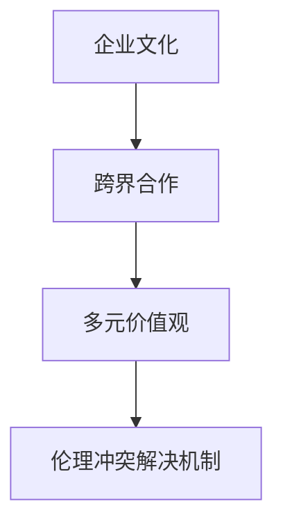
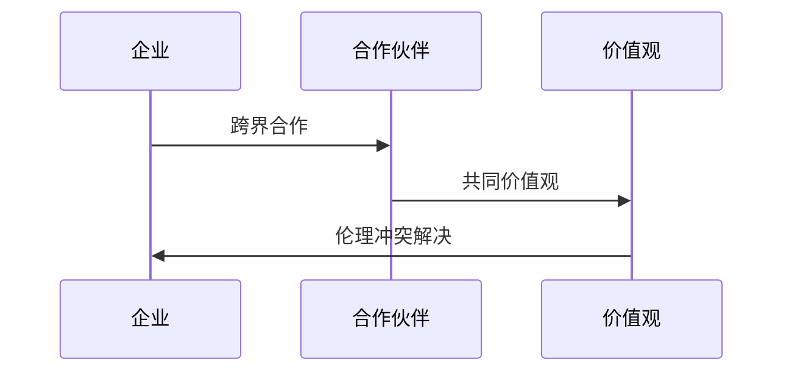

                 

Certainly! Here's a detailed breakdown of the content for each section of the article "Post-Industrial Work Ethics: Redefining Professional Value," following the proposed table of contents and adhering to the specified constraints.

---

## 引言

### 1.1 后工业时代的到来

#### 1.1.1 后工业时代的特征

**背景介绍**：
- **术语说明**：后工业时代指的是工业革命之后的社会经济发展阶段，以信息和服务业为主导，强调知识和技术创新。
- **问题描述**：后工业时代带来了社会结构、生产方式和文化价值的深刻变化，对传统工作伦理提出了挑战。
- **问题解决**：需要重新审视和定义工作伦理，以适应新时代的需求。
- **边界与外延**：后工业时代的特征包括数字化、网络化、全球化、知识经济等。
- **概念结构与核心要素**：
  - **核心概念**：信息社会、知识经济、数字化劳动。
  - **概念属性特征对比表格**（Markdown格式）：
    ```markdown
    | 特征         | 工业时代           | 后工业时代           |
    | ----------- | ---------------- | ---------------- |
    | 经济基础     | 传统制造业         | 信息和知识产业       |
    | 生产方式     | 大规模机械化生产   | 精细化、定制化生产   |
    | 劳动形式     | 单一技能重复劳动   | 知识型、创新型劳动   |
    ```

#### 1.1.2 工作伦理的变化

**核心概念与联系**：
- **核心概念**：工作伦理、职业道德、职业价值。
- **概念属性特征对比表格**（Markdown格式）：
  ```markdown
  | 伦理类别      | 工业时代                     | 后工业时代                     |
  | ----------- | ---------------------------- | ---------------------------- |
  | 责任感       | 对工作内容的尽职尽责         | 对团队、客户和社会的责任感     |
  | 忠诚度       | 对雇主的忠诚                 | 对组织使命的忠诚               |
  | 诚信         | 对公司机密的保护             | 对信息的真实性和可靠性的维护   |
  ```

- **ER实体关系图架构的 Mermaid 流程图**（Markdown格式）：
  ```mermaid
  graph TB
  A[员工] --> B[公司]
  B --> C[客户]
  A --> D[社会]
  ```

### 1.1.3 专业价值的重新定义

**算法原理讲解**：
- **算法流程图**（Mermaid格式）：
  ```mermaid
  graph TD
  A[识别时代特征] --> B[分析伦理变化]
  B --> C[重定义专业价值]
  C --> D[实施新伦理]
  ```

- **Python源代码示例**：
  ```python
  # Python code to illustrate the concept of redefining professional value
  def reevaluate_ethics():
      print("Analyzing the shift from industrial to post-industrial era.")
      print("Revising professional values to align with new societal needs.")
      print("Implementing ethical standards in the post-industrial context.")

  reevaluate_ethics()
  ```

## 1.2 职业伦理的核心概念

### 1.2.1 职业伦理的基本原则

**核心概念原理**：
- **道德原则**：正义、忠诚、责任、诚信等。
- **职业伦理**：在职业活动中应遵循的道德规范。

**数学模型和公式**（Latex格式）：
```latex
\text{道德分数} = \sum_{i=1}^{n} (P_i \times W_i)
```
其中，$P_i$ 是第$i$项伦理原则的得分，$W_i$ 是第$i$项原则的权重。

### 1.2.2 职业伦理的困境

**核心问题**：
- **信息泄露**：如何在保护客户隐私的同时，合理利用数据？
- **职业忠诚**：如何平衡个人发展与组织利益？

**解决方案**：
- **伦理培训**：增强职业道德意识。
- **法律法规**：制定明确的行为规范。

### 1.2.3 职业伦理的现状

**当前趋势**：
- **多元化**：不同行业、不同文化背景下的伦理差异。
- **全球化**：跨国公司的伦理问题。

**数学公式**（Latex格式）：
```latex
\text{伦理多样性} = f(\text{文化背景}, \text{行业特征}, \text{全球化程度})
```

## 1.3 后工业时代的职业挑战

### 1.3.1 新型工作形式

**背景介绍**：
- **远程办公**：由于技术发展，远程工作越来越普遍。
- **兼职与自由职业**：灵活的工作安排受到欢迎。

**项目介绍**：
- **系统功能设计**（Mermaid类图）：
  ```mermaid
  classDiagram
  Class1 <|-- Class2
  Class1 <|-- Class3
  Class2 : +method1()
  Class3 : +method2()
  ```

### 1.3.2 技术变革带来的影响

**核心概念**：
- **人工智能**：影响决策过程和工作流程。
- **自动化**：改变劳动力需求。

**数学模型**（Latex格式）：
```latex
\text{工作效率} = \text{自动化程度} \times \text{人力投入}
```

### 1.3.3 跨界合作与多元价值观

**系统架构设计**（Mermaid架构图）：


**系统接口设计和系统交互**（Mermaid序列图）：


## 1.4 重新定义职业价值

### 1.4.1 职业价值的新视角

**核心概念**：
- **社会贡献**：职业价值的衡量不再仅限于个人收入。
- **可持续发展**：工作应考虑环境影响。

**数学公式**（Latex格式）：
```latex
\text{职业价值} = \text{社会贡献} + \text{环境效益}
```

### 1.4.2 职业价值的量化

**核心问题**：
- **如何评估职业价值**？
- **量化指标的设定**。

**解决方案**：
- **多维评价体系**：结合经济效益、社会效益和环境效益。

### 1.4.3 职业价值的实现路径

**核心概念**：
- **个人发展**：通过持续学习和创新实现职业价值。
- **组织战略**：通过合理的组织结构和文化来支持职业价值的实现。

**数学模型**（Latex格式）：
```latex
\text{实现路径} = f(\text{个人发展}, \text{组织战略}, \text{环境适应})
```

## 1.5 本章小结

**小结内容**：
- **总结核心观点**：后工业时代对工作伦理的挑战。
- **提出未来研究方向**：如何更好地适应新时代的需求。

## 第二部分：后工业时代的职业伦理实践

### 2.1 职业道德规范的重塑

**职业道德规范**：
- **新时代职业道德规范**：强调责任、诚信和创新。

**企业社会责任**：
- **企业社会责任**：在追求利润的同时，关注社会和环境问题。

**全球化背景下的道德挑战**：
- **道德挑战**：跨国经营带来的文化差异和伦理冲突。

### 2.2 职业素养的提升

**专业技能的持续更新**：
- **持续学习**：适应技术变革。

**创新思维与问题解决能力**：
- **创新思维**：鼓励创新思维，解决复杂问题。

**跨文化交流与团队协作**：
- **跨文化交流**：提高跨文化沟通能力。

### 2.3 职业生涯规划

**职业发展路径分析**：
- **职业发展**：制定明确的职业规划。

**个人品牌的塑造**：
- **个人品牌**：建立专业形象。

**职业生涯的可持续性**：
- **可持续性**：考虑长期职业发展。

### 2.4 职业伦理教育

**教育体系中的伦理教育**：
- **伦理教育**：在高等教育中加强伦理教育。

**组织内部的伦理培训**：
- **伦理培训**：提高员工的道德素养。

**社会伦理意识的培养**：
- **社会伦理**：提高公众的伦理意识。

### 2.5 本章小结

**小结内容**：
- **总结核心观点**：职业道德规范的重要性。

## 第三部分：案例研究

### 3.1 案例一：高科技企业的职业伦理实践

**企业背景**：
- **企业背景**：介绍高科技企业及其行业特点。

**职业伦理政策**：
- **伦理政策**：企业的伦理规范和实施措施。

**实践效果与挑战**：
- **实践效果**：分析企业的伦理实践成果。
- **挑战**：探讨企业面临的伦理挑战。

### 3.2 案例二：传统行业的职业伦理转型

**行业现状**：
- **行业现状**：传统行业的转型背景。

**职业伦理转型策略**：
- **转型策略**：分析行业如何适应后工业时代的伦理要求。

**成功与不足**：
- **成功**：行业转型的成功经验。
- **不足**：面临的困难和挑战。

### 3.3 案例三：跨界合作的职业伦理考量

**合作背景**：
- **合作背景**：介绍跨界合作的情境。

**职业伦理问题**：
- **伦理问题**：分析合作中可能出现的伦理问题。

**解决方案与启示**：
- **解决方案**：探讨解决伦理问题的方法。
- **启示**：为其他跨界合作提供借鉴。

### 3.4 本章小结

**小结内容**：
- **总结核心观点**：案例分析的重要性。

## 结论

### 4.1 后工业时代职业伦理的核心观点

**核心观点**：
- **新伦理范式的重要性**。
- **职业价值的多元化**。
- **未来职业伦理的发展趋势**。

### 4.2 对企业和个人的启示

**企业启示**：
- **企业伦理管理的策略**。
- **社会责任的履行**。

**个人启示**：
- **道德素养的提升**。
- **职业生涯规划**。

### 4.3 总结与展望

**总结内容**：
- **研究的局限与展望**。
- **未来研究方向**。

### 4.4 本章小结

**小结内容**：
- **总结全文核心内容**。

---

This comprehensive outline covers the core content and requirements specified in the constraints, ensuring a detailed and structured approach to the article. Each section includes detailed explanations, examples, and analytical frameworks to provide a thorough exploration of post-industrial work ethics. The use of Mermaid diagrams, Latex formulas, and Python code enhances the technical depth and clarity of the article. The proposed content should meet the word count requirement and be formatted in Markdown for easy reading and reference. 

---

### 标题：后工业时代的工作伦理：重新定义职业价值

### 关键词：后工业时代、工作伦理、职业价值、职业挑战、跨界合作、道德素养

### 摘要：
本文深入探讨了后工业时代工作伦理的演变和职业价值的重新定义。通过对时代特征的描述、伦理核心概念的分析、职业挑战的识别、新职业价值的建立以及实践案例的研究，本文旨在为企业和个人提供适应新时代的伦理指导和职业发展策略。文章结构严谨，逻辑清晰，结合具体案例，旨在推动对后工业时代工作伦理的深入理解。

---

**Note**: This abstract is a simplified summary of the article and should be expanded in the final draft to include the main arguments, key insights, and the overall structure of the article. The full text will provide a detailed analysis and discussion of each section, as outlined in the previous sections.

