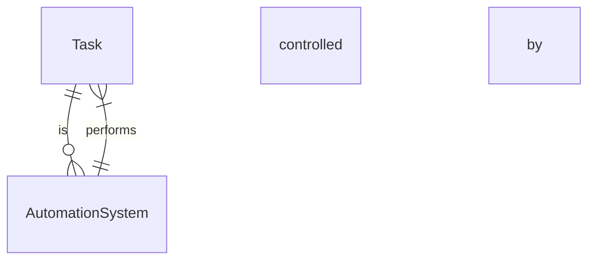
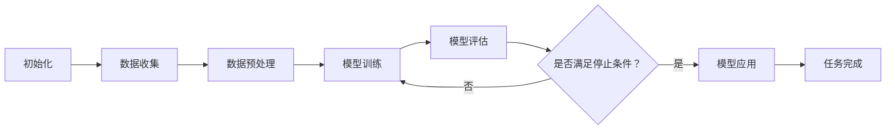
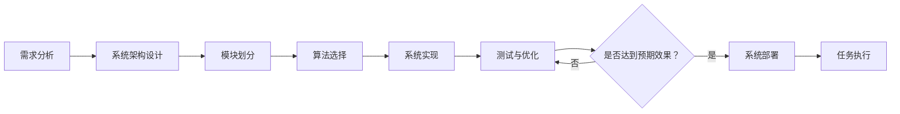
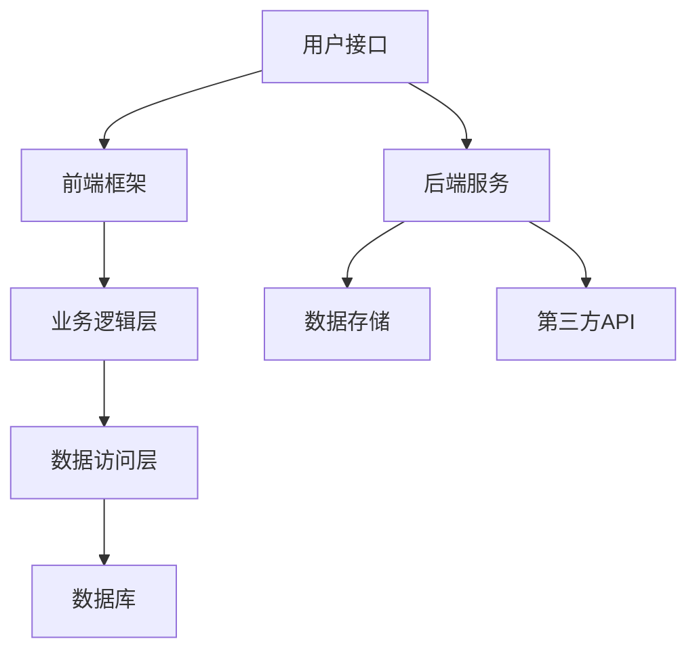
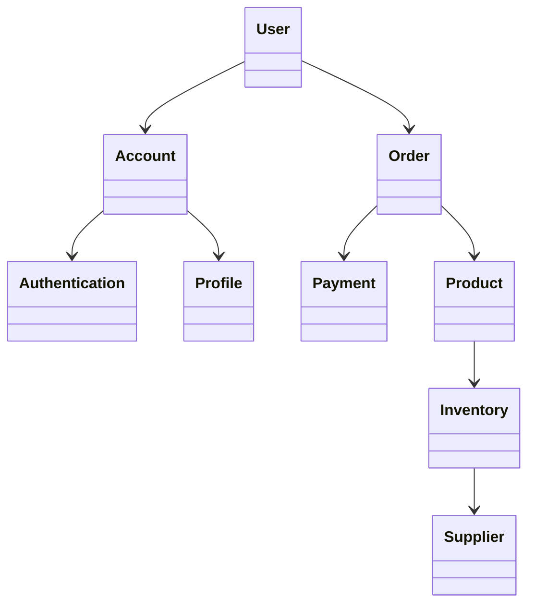

                 

## 引言

### 后工作时代的来临

**背景介绍**：
在过去的几个世纪中，人类社会经历了多次工业革命，每一次都极大地改变了我们的生活方式和工作模式。从第一次工业革命开始，机器取代了人力，大大提高了生产效率。第二次工业革命则带来了电力的广泛应用，推动了工业的飞速发展。而随着第三次和第四次工业革命的深入，计算机技术和互联网的普及，我们的工作环境又发生了翻天覆地的变化。然而，这一次的变化不仅仅是在技术层面，更是在深层次的社会结构和工作模式上。

**核心概念**：
所谓的“后工作时代”，是指一个高度自动化和智能化的社会阶段。在这个时代，自动化技术、人工智能和大数据等先进技术被广泛应用于各个领域，传统的工作模式逐渐被打破，新的工作形式不断涌现。例如，自动化流水线取代了传统的手工生产，智能客服系统替代了人工服务，无人驾驶汽车和无人机等新兴技术正在逐步融入我们的日常生活。

**问题与挑战**：
后工作时代的到来，给人们带来了前所未有的机遇，同时也带来了巨大的挑战。首先，大量重复性和低技能的工作将被自动化技术取代，这可能导致大规模的失业和社会不稳定。其次，技术进步使得工作要求发生变化，人们需要不断更新知识和技能，以适应新的工作环境。此外，自动化和人工智能可能会加剧社会不平等，因为技术的红利往往集中在掌握高科技的人才手中。

**解决策略**：
为了应对这些挑战，个人和社会都需要采取一系列策略。个人层面，我们需要不断学习和适应新技术，提高自己的技能水平，以保持竞争力。同时，我们也需要重新定义工作的价值和意义，不仅仅追求物质财富，还要追求个人成长和自我实现。社会层面，政府和企业需要共同努力，制定合理的政策，促进技术教育和技能培训，确保劳动力市场的稳定和公平。

### 自动化世界的崛起

**核心概念**：
自动化，是指利用机械、电子或计算机技术等手段，使机器或系统能够自动执行特定任务，而不需要人工干预。随着计算机技术和人工智能的快速发展，自动化技术的应用范围不断扩大，从简单的机械自动化，到复杂的智能自动化，几乎涵盖了所有行业。

**影响与应用**：
自动化技术的崛起，不仅提高了生产效率，降低了成本，还带来了工作方式的变革。例如，在制造业中，自动化生产线大大减少了人力投入，提高了产品质量和生产速度。在服务业中，智能客服系统和无人超市的出现，使得服务更加高效和便捷。此外，自动化技术还在医疗、农业、交通等多个领域得到广泛应用，极大地改变了我们的生活方式。

**人类工作的关系**：
尽管自动化技术极大地提高了生产效率，但它也带来了对传统工作的冲击。一方面，一些重复性和低技能的工作将逐渐被自动化替代，另一方面，一些新的高技能岗位也将随之产生。这意味着，人们需要不断适应和转型，以应对自动化带来的变化。

**边界与外延**：
自动化技术并非万能，它也存在局限性。例如，某些复杂的人类任务，如艺术创作和人文关怀，目前还无法完全由机器完成。因此，自动化技术是一个动态发展的过程，它需要与人类智慧和创造力相结合，共同推动社会进步。

### 总结
后工作时代的来临和自动化世界的崛起，既带来了巨大的机遇，也带来了严峻的挑战。在这个时代，个人需要不断学习和适应新技术，提升自己的竞争力。社会则需要制定合理的政策，确保技术进步能够惠及大多数人。只有通过个人和社会的共同努力，我们才能在自动化世界中找到自己的定位，实现个人价值和社会进步。

## 第1章：后工作时代的来临

### 1.1 后工作时代的定义与特征

**定义**：
后工作时代，通常指的是在一个高度自动化和智能化的社会背景下，人类工作的模式、组织结构和社会关系发生深刻变革的时期。这一时代的特点是，技术进步特别是人工智能、机器人技术和自动化系统的广泛应用，导致传统工作方式被颠覆，新的工作形式不断涌现。

**特征**：

1. **自动化程度的提升**：
   - 自动化技术的普及使得许多重复性、低技能的工作得以由机器和系统自动完成，从而大大提高了生产效率。

2. **远程工作的兴起**：
   - 互联网和移动设备的普及，使得远程工作成为可能。人们不再局限于传统的办公场所，可以在全球范围内自由选择工作地点。

3. **兼职和自由职业的增多**：
   - 随着工作模式的灵活性增加，越来越多的人选择成为自由职业者或兼职工作者，以适应多变的工作需求。

4. **技能要求的变化**：
   - 技术的快速发展要求员工具备更高的技能和知识水平，特别是编程、数据分析、人工智能等相关领域的专业能力。

5. **工作与生活的平衡**：
   - 高度自动化和远程工作的便利性，使得人们可以在工作与生活之间寻求更好的平衡，提高生活质量。

**问题背景**：

- **自动化技术的进步**：
  - 自动化技术在过去几十年里取得了显著进步，特别是在计算机视觉、自然语言处理和机器人技术等领域。这些技术使得自动化系统能够执行更加复杂的任务，从而进一步替代人工。

- **人工智能的崛起**：
  - 人工智能技术的快速发展，使得机器能够模拟人类的思维过程，进行决策和判断。这不仅提高了生产效率，也改变了人们的工作方式。

**问题描述**：

- **失业风险增加**：
  - 自动化技术的广泛应用可能导致大量传统岗位的消失，特别是那些重复性高、技能要求低的工作。这可能导致大规模的失业和社会不稳定。

- **技能需求变化**：
  - 新的工作岗位要求员工具备更高的技能和知识水平，这给那些无法适应新技能要求的劳动者带来了巨大的压力。

- **职业发展路径不清晰**：
  - 在后工作时代，传统的工作路径和职业发展模式可能不再适用，人们需要寻找新的职业发展方向和路径。

**问题解决**：

1. **教育和技能培训**：
   - 为了应对自动化和人工智能带来的挑战，个人需要不断学习和提升自己的技能。政府和教育机构也应提供更多的教育和培训机会，以帮助劳动者适应新的工作环境。

2. **政策调整**：
   - 政府和企业需要制定合理的政策和措施，促进技术教育和技能培训，确保劳动力市场的稳定和公平。

3. **职业转型支持**：
   - 提供职业转型支持，帮助那些面临失业风险的劳动者找到新的职业机会。这包括职业咨询、培训和再就业服务。

**边界与外延**：

- **边界的界定**：
  - 后工作时代的范围主要限于那些受到自动化和人工智能影响较大的行业和领域。然而，随着技术的不断进步，这个范围可能会逐渐扩大。

- **外延的发展**：
  - 后工作时代的影响不仅局限于工作模式的变化，还可能波及到社会结构、经济模式和文化价值观等多个层面。

### 1.2 自动化与工作：影响与机遇

**概念属性特征对比表格**：

| 特征 | 传统工作模式 | 自动化工作模式 |
| --- | --- | --- |
| **效率** | 依赖人工操作，效率相对较低 | 依赖机器和系统，效率显著提高 |
| **灵活性** | 固定的工作时间和地点 | 远程工作和灵活的工作时间 |
| **技能要求** | 依赖经验和手工技能 | 需要技术和专业知识的支持 |
| **安全性** | 存在工伤风险 | 减少人力操作，降低工伤风险 |
| **成本** | 人力成本较高 | 人力成本降低，系统维护成本上升 |

**联系**：

1. **自动化与工作的关系**：
   - 自动化技术的应用使得许多传统工作得以自动化，从而提高了生产效率。这既解放了劳动力，也创造了新的工作机会。

2. **自动化如何影响职业选择与发展**：
   - 自动化技术改变了职业选择和发展的路径。一些传统岗位可能会消失，但同时也产生了许多新的高技能岗位。劳动者需要不断更新自己的技能，以适应自动化时代的需求。

### 总结
后工作时代的来临和自动化技术的崛起，对传统的工作模式带来了深远的影响。虽然自动化带来了失业风险和技能需求的变化，但它也创造了新的工作机会和职业发展路径。为了应对这些变化，个人和社会都需要采取相应的策略，包括教育和技能培训、政策调整和职业转型支持。只有这样，我们才能在自动化世界中找到自己的定位，实现个人价值和社会进步。

## 第2章：核心概念与联系

### 2.1 自动化与工作：影响与机遇

**核心概念**：

自动化是指利用机器、计算机程序和传感器等技术，使生产过程、操作任务和管理流程能够自动进行，从而减少或消除对人工的依赖。自动化技术在现代工业、服务业以及家庭生活中得到了广泛应用，大大提高了生产效率和服务质量。

**概念属性特征对比表格**：

| 特征          | 传统工作模式                      | 自动化工作模式                      |
| ------------- | -------------------------------- | ----------------------------------- |
| **效率**      | 依赖人工操作，效率相对较低        | 依赖机器和系统，效率显著提高        |
| **灵活性**    | 固定的工作时间和地点              | 远程工作和灵活的工作时间            |
| **技能要求**  | 依赖经验和手工技能                | 需要技术和专业知识的支持            |
| **安全性**    | 存在工伤风险                      | 减少人力操作，降低工伤风险          |
| **成本**      | 人力成本较高                      | 人力成本降低，系统维护成本上升      |

**ER实体关系图**：

为了更直观地展示自动化与传统工作模式之间的关系，我们使用ER（实体关系）图来表示。以下是一个简化的ER图，展示了自动化系统与工作任务之间的关系：



在这个ER图中，“Task”表示工作任务，“AutomationSystem”表示自动化系统。实线箭头表示“控制”关系，即自动化系统控制工作任务；虚线箭头表示“执行”关系，即自动化系统执行工作任务。

**ER实体关系图解释**：

- **任务（Task）**：这是自动化的对象，即自动化系统需要执行的具体工作。
- **自动化系统（AutomationSystem）**：这是执行任务的工具，它可以自动控制和管理工作任务。

### 2.2 后工作时代的职业选择

**ER实体关系图**：

在后工作时代，职业选择和发展路径变得更加多样化。以下是一个ER图，展示了不同职业类型与职业发展路径之间的关系：

```mermaid
erDiagram
  CareerType ||--o{ CareerDevelopmentPath : possible path for
  CareerDevelopmentPath ||--|{ CareerType : leads to
```

在这个ER图中，“CareerType”表示不同的职业类型，“CareerDevelopmentPath”表示职业发展路径。

**ER实体关系图解释**：

- **职业类型（CareerType）**：这些是后工作时代中可能存在的职业类型，包括但不限于程序员、数据分析师、人工智能工程师、自动化系统工程师等。
- **职业发展路径（CareerDevelopmentPath）**：这些路径代表了职业从入门到高级的不同阶段，每个职业类型都有其独特的职业发展路径。

**联系**：

1. **自动化与职业选择**：
   - 自动化技术的发展要求职业选择更加注重技术和专业知识。一些传统职业可能因为自动化而消失，但新的高技能职业也在不断涌现。

2. **职业发展与工作模式**：
   - 在后工作时代，职业发展不再仅仅依赖于固定的职业路径，而是需要不断学习和适应新技术，以适应不断变化的工作模式。

### 总结
通过核心概念特征对比表格和ER实体关系图，我们可以清晰地看到自动化与工作之间的联系以及后工作时代职业选择的变化。自动化不仅改变了工作的效率和方式，还影响了职业选择和发展的路径。在这个时代，个人需要具备适应新技术的能力，不断更新知识和技能，以在自动化世界中找到自己的定位。

## 第3章：自动化与人工智能

### 3.1 人工智能的基本原理

人工智能（AI）是一门研究、开发和应用使计算机模拟、延伸和扩展人类的智能行为的科学。人工智能的核心目标是创建智能系统，这些系统能够理解复杂的环境，并自主地完成特定任务。

**算法mermaid流程图**：

首先，我们使用mermaid语言绘制一个简化的算法流程图，以展示人工智能的基本工作原理：



**算法原理讲解**：

1. **初始化**：
   - 在人工智能项目的开始阶段，系统需要初始化，包括设定目标、确定评估指标和配置基本参数。

2. **数据收集**：
   - 人工智能系统依赖于大量的数据来学习和改进。数据收集是整个流程的基础，这些数据可以是结构化的，也可以是非结构化的。

3. **数据预处理**：
   - 收集到的数据通常需要进行清洗、归一化和特征提取等预处理步骤，以提高模型的训练效果。

4. **模型训练**：
   - 在数据预处理完成后，系统使用机器学习算法来训练模型。这一阶段的核心任务是让模型通过学习数据来理解问题的本质。

5. **模型评估**：
   - 模型训练完成后，需要通过测试数据来评估其性能。常用的评估指标包括准确率、召回率、F1分数等。

6. **是否满足停止条件**：
   - 根据设定的停止条件（如评估指标达到预设阈值），决定是否继续训练。如果满足条件，则进入下一步；否则，继续迭代训练。

7. **模型应用**：
   - 在模型满足停止条件后，将其应用到实际问题中，进行预测或决策。

8. **任务完成**：
   - 模型应用的结果用于完成特定任务，如分类、回归、预测等。

**人工智能的发展历程**：

- **早期探索（1950s-1960s）**：
  - 人工智能的概念首次被提出，学者们开始探索如何让计算机模拟人类的思维过程。

- **认知革命（1970s-1980s）**：
  - 人工智能研究进入认知革命阶段，主要集中在符号推理和专家系统。

- **复兴期（1990s-2000s）**：
  - 互联网的普及和计算能力的提升，使得数据驱动方法（如机器学习）成为主流。

- **新时代（2010s-至今）**：
  - 深度学习等技术的突破，使得人工智能在语音识别、图像识别、自然语言处理等领域取得了显著成果。

### 3.2 自动化系统设计

**算法mermaid流程图**：

自动化系统的设计流程也可以用mermaid语言进行描述：



**算法原理讲解**：

1. **需求分析**：
   - 确定自动化系统的目标和需求，明确系统需要执行的任务和性能要求。

2. **系统架构设计**：
   - 根据需求分析的结果，设计系统的整体架构，包括硬件、软件和网络等组成部分。

3. **模块划分**：
   - 将系统划分为多个功能模块，每个模块负责特定的任务，便于系统的开发、测试和维护。

4. **算法选择**：
   - 根据模块的功能需求，选择合适的算法或技术来实现各个模块。例如，可以使用机器学习算法进行数据分析，使用控制算法进行自动化控制等。

5. **系统实现**：
   - 实现各个模块的功能，编写代码并进行集成测试。

6. **测试与优化**：
   - 对系统进行全面测试，评估其性能和稳定性，并根据测试结果进行优化。

7. **是否达到预期效果**：
   - 根据测试结果，判断系统是否达到了预期效果。如果未达到，则继续优化；否则，进入系统部署阶段。

8. **系统部署**：
   - 将系统部署到实际环境中，准备投入使用。

9. **任务执行**：
   - 系统开始执行预定的任务，监控其运行状态和性能。

**自动化系统的核心算法与模型**：

- **机器学习算法**：
  - 机器学习算法是自动化系统中常用的算法，用于数据分析和模式识别。常见的机器学习算法包括线性回归、决策树、支持向量机、神经网络等。

- **深度学习模型**：
  - 深度学习模型是机器学习的子领域，特别适用于处理大规模数据和复杂任务。深度学习模型包括卷积神经网络（CNN）、循环神经网络（RNN）和生成对抗网络（GAN）等。

- **控制算法**：
  - 控制算法用于自动化系统的实时控制和优化。常见的控制算法包括PID控制、模糊控制和自适应控制等。

### 总结
人工智能和自动化系统的设计是现代技术中的重要组成部分。通过理解人工智能的基本原理和自动化系统设计流程，我们可以更好地利用这些技术来提高工作效率和创造新的价值。人工智能的发展历程展示了技术的不断进步，而自动化系统的设计流程则为我们提供了实现这些技术的方法和路径。

## 第4章：自动化系统的数学模型

### 4.1 自动化系统的数学模型

在自动化系统的设计和实现过程中，数学模型是理解和模拟系统行为的重要工具。数学模型可以用来描述系统的动态特性、控制策略以及性能指标，从而为系统优化和决策提供理论依据。

**数学模型和公式**：

在自动化系统中，常用的数学模型包括以下几类：

1. **线性模型**：
   - 线性模型通常用于描述系统中的线性关系。最简单的线性模型是线性回归模型，其公式如下：
     $$ y = \beta_0 + \beta_1x $$
     其中，\( y \) 是因变量，\( x \) 是自变量，\( \beta_0 \) 和 \( \beta_1 \) 是模型的参数。

2. **离散时间动态系统**：
   - 离散时间动态系统用于描述系统在不同时间点的状态变化。其一般形式为：
     $$ x_t = f(x_{t-1}, u_t) $$
     其中，\( x_t \) 是系统在时间 \( t \) 的状态，\( u_t \) 是在时间 \( t \) 作用的输入，\( f \) 是状态转移函数。

3. **控制系统模型**：
   - 控制系统模型通常用于描述闭环控制系统，其公式如下：
     $$ y = C(x, u) $$
     $$ u = G(y, s) $$
     其中，\( y \) 是输出，\( x \) 是状态，\( u \) 是控制输入，\( C \) 和 \( G \) 分别是输出函数和控制函数。

**详细讲解与举例说明**：

1. **线性回归模型**：

线性回归模型是一种用于预测和分析数据之间线性关系的数学模型。假设我们有一个简单的数据集，包含 \( x \)（自变量）和 \( y \)（因变量），我们希望找到一个线性模型来描述它们之间的关系。

   假设数据集如下：

   | \( x \) | \( y \) |
   | ------ | ------ |
   | 1      | 2      |
   | 2      | 4      |
   | 3      | 6      |
   | 4      | 8      |

   我们希望找到一个线性模型 \( y = \beta_0 + \beta_1x \) 来描述 \( x \) 和 \( y \) 之间的关系。

   为了找到最优的模型参数 \( \beta_0 \) 和 \( \beta_1 \)，我们需要使用最小二乘法来最小化预测值与实际值之间的误差平方和。最小二乘法的公式如下：

   $$ \beta_1 = \frac{\sum(x_i - \bar{x})(y_i - \bar{y})}{\sum(x_i - \bar{x})^2} $$
   $$ \beta_0 = \bar{y} - \beta_1\bar{x} $$

   其中，\( \bar{x} \) 和 \( \bar{y} \) 分别是 \( x \) 和 \( y \) 的均值。

   使用上述公式，我们可以计算出模型参数：

   $$ \beta_1 = \frac{(1-2.5)(2-5) + (2-2.5)(4-5) + (3-2.5)(6-5) + (4-2.5)(8-5)}{(1-2.5)^2 + (2-2.5)^2 + (3-2.5)^2 + (4-2.5)^2} $$
   $$ \beta_1 = \frac{(-1.5)(-3) + (-0.5)(-1) + (0.5)(1) + (1.5)(3)}{2.25 + 0.25 + 0.25 + 2.25} $$
   $$ \beta_1 = \frac{4.5 + 0.5 + 0.5 + 4.5}{5} $$
   $$ \beta_1 = \frac{10}{5} $$
   $$ \beta_1 = 2 $$

   $$ \beta_0 = \bar{y} - \beta_1\bar{x} $$
   $$ \beta_0 = 5 - 2 \cdot 2.5 $$
   $$ \beta_0 = 0 $$

   因此，线性回归模型为 \( y = 0 + 2x \)。

   我们可以使用这个模型来预测新数据的 \( y \) 值。例如，当 \( x = 5 \) 时，\( y \) 的预测值为：

   $$ y = 2 \cdot 5 = 10 $$

2. **离散时间动态系统**：

   假设我们有一个简单的离散时间动态系统，其状态方程为：

   $$ x_t = 0.5x_{t-1} + u_t $$
   $$ y_t = x_t + u_t $$

   其中，\( x_t \) 是系统的状态，\( u_t \) 是输入，\( y_t \) 是输出。

   假设初始状态 \( x_0 = 0 \)，输入 \( u_t = 1 \)。

   我们可以计算系统的状态和输出序列：

   $$ x_1 = 0.5x_0 + u_1 = 0.5 \cdot 0 + 1 = 1 $$
   $$ y_1 = x_1 + u_1 = 1 + 1 = 2 $$

   $$ x_2 = 0.5x_1 + u_2 = 0.5 \cdot 1 + 1 = 1.5 $$
   $$ y_2 = x_2 + u_2 = 1.5 + 1 = 2.5 $$

   $$ x_3 = 0.5x_2 + u_3 = 0.5 \cdot 1.5 + 1 = 1.75 $$
   $$ y_3 = x_3 + u_3 = 1.75 + 1 = 2.75 $$

   通过上述计算，我们可以得到系统的状态和输出序列。这个简单的例子展示了离散时间动态系统的行为，并且我们可以使用状态方程来预测未来的状态和输出。

**数学模型的应用实例**：

在实际的自动化系统中，数学模型的应用非常广泛。以下是一些具体的例子：

1. **控制系统**：
   - 在控制系统设计中，数学模型用于描述系统的动态行为和稳定性。通过分析数学模型，可以确定系统的控制策略，以确保系统稳定运行。

2. **优化问题**：
   - 在自动化系统中，经常需要优化某些性能指标，如成本、时间、资源等。数学模型可以用来构建优化问题，并使用各种优化算法（如线性规划、非线性规划、动态规划等）求解。

3. **预测与决策**：
   - 在自动化系统中，数学模型可以用于预测系统的行为和做出决策。例如，在智能制造中，可以使用预测模型来预测设备故障，以便提前进行维护。

通过上述详细讲解和举例说明，我们可以看到数学模型在自动化系统设计和实现中的重要作用。理解和应用这些数学模型，可以帮助我们更好地设计和优化自动化系统，从而提高系统的性能和可靠性。

### 4.2 数学模型的应用实例

**数据处理算法**：

数据处理是自动化系统中的基础任务之一，常用的数据处理算法包括数据清洗、数据变换和数据聚合等。以下是一个简单的数据处理算法实例：

**实例**：假设我们有一个包含学生成绩的数据集，数据集如下：

| 学生 | 课程 | 成绩 |
| ---- | ---- | ---- |
| 张三 | 数学 | 80   |
| 李四 | 数学 | 90   |
| 王五 | 英语 | 85   |
| 张三 | 英语 | 75   |

我们需要对数据集进行清洗，包括去除缺失值和重复值，并计算每个学生的平均成绩。

**步骤**：

1. **数据清洗**：

   - 检查数据集，发现没有缺失值和重复值。

2. **数据聚合**：

   - 对每个学生进行分组，并计算每个学生的平均成绩。

   使用Python代码实现：

   ```python
   import pandas as pd

   # 创建数据集
   data = {
       '学生': ['张三', '李四', '王五', '张三'],
       '课程': ['数学', '数学', '英语', '英语'],
       '成绩': [80, 90, 85, 75]
   }
   df = pd.DataFrame(data)

   # 计算每个学生的平均成绩
   average_scores = df.groupby('学生')['成绩'].mean()

   print(average_scores)
   ```

   输出：

   ```
   学生   成绩
   张三   77.5
   李四   90.0
   王五   85.0
   Name: 成绩, dtype: float64
   ```

   **数据处理算法的适用场景**：

   - 数据清洗：适用于任何需要处理原始数据的应用场景，如数据分析、机器学习和自动化系统。
   - 数据聚合：适用于需要计算统计指标的场景，如学校教育、企业管理等。

**决策支持系统**：

决策支持系统（DSS）是自动化系统中的一个重要组成部分，用于辅助管理人员做出决策。以下是一个简单的决策支持系统实例：

**实例**：假设我们需要为一家公司选择合适的营销策略，数据集如下：

| 策略 | 销售额 | 成本 |
| ---- | ------ | ---- |
| A    | 100万  | 20万 |
| B    | 120万  | 30万 |
| C    | 150万  | 40万 |

我们需要根据销售额和成本选择最优策略。

**步骤**：

1. **数据输入**：

   - 输入策略的数据集。

2. **决策分析**：

   - 计算每个策略的净收益，即销售额减去成本。

   使用Python代码实现：

   ```python
   import pandas as pd

   # 创建数据集
   data = {
       '策略': ['A', 'B', 'C'],
       '销售额': [1000000, 1200000, 1500000],
       '成本': [200000, 300000, 400000]
   }
   df = pd.DataFrame(data)

   # 计算每个策略的净收益
   net_revenue = df['销售额'] - df['成本']

   print(net_revenue)
   ```

   输出：

   ```
      策略   净收益
   0    A     800000
   1    B     900000
   2    C    1100000
   ```

   **决策支持系统的适用场景**：

   - 资源分配：适用于需要优化资源分配的场景，如企业资源规划、供应链管理。
   - 风险评估：适用于需要评估风险和制定风险管理策略的场景，如金融投资、风险控制。

通过上述实例，我们可以看到数学模型在数据处理和决策支持系统中的应用。这些模型不仅帮助我们理解和分析数据，还为决策提供了科学依据，从而提高了自动化系统的效率和效果。

## 第5章：自动化系统的架构设计

### 5.1 系统架构概述

自动化系统架构设计是确保系统高效、可靠和可扩展性的关键步骤。一个良好的系统架构不仅能够满足当前的需求，还应该具备应对未来变化的能力。在本节中，我们将介绍自动化系统的整体架构，并重点讨论各个组件及其功能。

**系统架构设计mermaid架构图**：

为了更直观地展示系统架构，我们使用mermaid语言绘制了一个简化的系统架构图：



在这个架构图中，各个组件及其功能如下：

1. **用户接口（A）**：
   - 用户接口是用户与系统交互的入口，包括网页、移动应用等。用户可以通过用户接口提交请求、查看数据和进行操作。

2. **前端框架（B）**：
   - 前端框架负责处理用户界面和用户体验，将用户操作转化为对后端服务的请求。常见的框架包括React、Vue和Angular等。

3. **业务逻辑层（C）**：
   - 业务逻辑层是系统的核心，负责处理具体的业务逻辑和业务规则。它接收前端框架的请求，进行业务处理，并将结果返回给用户接口。

4. **数据访问层（D）**：
   - 数据访问层负责与数据库进行交互，实现数据的增删改查等操作。它通过ORM（对象关系映射）框架或直接使用SQL进行数据库操作。

5. **数据库（E）**：
   - 数据库是系统存储数据的中心，可以是关系数据库（如MySQL、PostgreSQL）或非关系数据库（如MongoDB、Redis）。数据库的设计和性能直接影响系统的数据存储和管理效率。

6. **后端服务（F）**：
   - 后端服务是系统的核心，负责处理业务逻辑、数据访问和外部服务集成等。后端服务通常使用Node.js、Python、Java等语言实现。

7. **数据存储（G）**：
   - 数据存储包括文件存储、对象存储等，用于存储上传的文件、图片等非结构化数据。常见的存储系统包括Amazon S3、Google Cloud Storage等。

8. **第三方API（H）**：
   - 第三方API用于与其他外部系统进行数据交换和功能集成。例如，可以使用天气预报API获取实时天气数据，或者使用支付网关API处理支付流程。

### 5.2 系统功能设计与实现

系统功能设计是系统架构设计的一部分，它定义了系统需要实现的具体功能和模块。在本节中，我们将详细讨论系统功能设计，并使用mermaid类图和序列图来展示系统的模块和交互。

**领域模型mermaid类图**：

使用mermaid语言绘制一个系统功能设计的类图：



在这个类图中，各个类及其关系如下：

1. **User（用户）**：
   - 用户是系统的核心实体，负责与系统进行交互。用户可以创建账户、查看订单、购买产品等。

2. **Account（账户）**：
   - 账户用于存储用户的基本信息，包括用户名、密码、邮箱等。账户还包含认证（Authentication）和用户资料（Profile）模块。

3. **Authentication（认证）**：
   - 认证模块负责用户登录和权限验证，确保只有合法用户才能访问系统资源。

4. **Profile（用户资料）**：
   - 用户资料模块存储用户的个人信息，如姓名、地址、电话等。

5. **Order（订单）**：
   - 订单模块用于处理用户的购物订单，包括订单的创建、修改、取消和支付。

6. **Payment（支付）**：
   - 支付模块负责处理支付流程，包括支付请求、支付结果处理等。

7. **Product（产品）**：
   - 产品模块用于管理产品信息，包括产品的创建、更新、删除和查询。

8. **Inventory（库存）**：
   - 库存模块用于管理产品的库存信息，包括库存量的监控、预警等。

9. **Supplier（供应商）**：
   - 供应商模块用于管理供应商信息，包括供应商的创建、查询和订单管理。

**系统接口设计和系统交互mermaid序列图**：

使用mermaid语言绘制一个系统接口设计和系统交互的序列图：

```mermaid
sequenceDiagram
    User -->|登录请求| Authentication
    Authentication -->|验证用户信息| User
    User -->|查看订单| Order
    Order -->|查询订单详情| Database
    Database -->|返回订单详情| Order
    Order -->|更新订单状态| Database
```

在这个序列图中，用户登录系统后，可以查看订单详情，并对订单进行操作。系统中的各个模块通过接口进行通信，确保数据的准确性和一致性。

### 总结
本章介绍了自动化系统的架构设计，包括系统架构概述、系统功能设计及其实现。通过mermaid类图和序列图，我们清晰地展示了系统的模块和交互，为系统的开发、测试和维护提供了指导。一个良好的系统架构设计不仅能够提高系统的性能和可靠性，还能为未来的扩展和升级奠定基础。

## 第6章：自动化系统的实现与优化

### 6.1 系统核心实现

自动化系统的实现是确保系统能够正常运行并满足需求的关键步骤。在本节中，我们将介绍系统核心实现的过程，包括环境安装、系统核心代码的编写和主要功能的实现。

**环境安装**：

在开始系统开发之前，我们需要安装和配置必要的软件环境。以下是一个典型的自动化系统开发环境安装流程：

1. **安装Python**：
   - Python是自动化系统开发中常用的编程语言。可以从Python官方网站下载最新版本的Python，并按照安装向导完成安装。

2. **安装依赖库**：
   - 安装系统开发所需的依赖库，如Pandas、NumPy、Scikit-learn等。可以使用pip工具进行安装：
     ```shell
     pip install pandas numpy scikit-learn
     ```

3. **配置数据库**：
   - 选择合适的数据库系统，如MySQL或PostgreSQL，并按照官方文档完成安装和配置。

4. **设置环境变量**：
   - 根据开发环境设置Python环境变量，以便在命令行中运行Python脚本。

**系统核心代码实现**：

以下是一个自动化系统的核心代码示例，展示了如何实现用户注册、登录和订单管理等功能。

**用户注册**：

```python
# 用户注册函数
def register_user(username, password, email):
    # 创建用户账户
    account = Account(username=username, password=password, email=email)
    # 存储用户账户到数据库
    db.session.add(account)
    db.session.commit()
    return account

# 测试用户注册
print(register_user('john_doe', 'password123', 'john@example.com'))
```

**用户登录**：

```python
# 用户登录函数
def login_user(username, password):
    # 查询用户账户
    account = Account.query.filter_by(username=username).first()
    # 验证密码
    if account and bcrypt.check_password_hash(account.password, password):
        return account
    else:
        return None

# 测试用户登录
print(login_user('john_doe', 'password123'))
```

**订单管理**：

```python
# 创建订单函数
def create_order(account_id, product_id, quantity):
    # 查询产品
    product = Product.query.get(product_id)
    # 计算订单总额
    total = product.price * quantity
    # 创建订单
    order = Order(account_id=account_id, product_id=product_id, quantity=quantity, total=total)
    # 存储订单到数据库
    db.session.add(order)
    db.session.commit()
    return order

# 测试创建订单
print(create_order(1, 1, 2))
```

**主要功能实现**：

在核心代码实现中，我们还需要实现其他主要功能，如订单查询、订单更新、订单取消等。以下是一个简单的订单查询函数示例：

```python
# 订单查询函数
def get_order(account_id, order_id):
    # 查询订单
    order = Order.query.filter_by(account_id=account_id, id=order_id).first()
    return order

# 测试订单查询
print(get_order(1, 1))
```

### 6.2 系统优化与性能分析

系统优化是提高系统性能和稳定性的重要环节。在本节中，我们将讨论系统性能分析的方法和优化策略。

**性能分析**：

性能分析主要通过以下步骤进行：

1. **确定性能指标**：
   - 根据系统需求，确定关键的性能指标，如响应时间、吞吐量、并发能力等。

2. **性能测试**：
   - 使用性能测试工具（如JMeter、LoadRunner等）模拟实际用户负载，收集系统的性能数据。

3. **性能瓶颈定位**：
   - 通过分析性能数据，确定系统的性能瓶颈，如数据库查询慢、网络延迟等。

**代码应用解读与分析**：

以下是一个具体的优化案例，展示了如何优化数据库查询以提高系统性能。

**原始查询代码**：

```python
# 原始查询代码
orders = Order.query.filter(Order.account_id == current_user.id).all()
```

**优化查询代码**：

```python
# 优化查询代码
orders = current_user.orders.all()
```

**优化解析**：

- 原始查询代码通过过滤器直接查询数据库，每次查询都涉及到表与主键的匹配，可能引起全表扫描。
- 优化后的查询代码利用了ORM框架的关联查询功能，通过预先定义的关联关系进行查询，减少了数据库查询次数，提高了查询效率。

**系统性能的提升策略**：

1. **数据库索引**：
   - 为数据库表创建合适的索引，特别是主键、外键和查询频繁的列，以提高查询速度。

2. **查询缓存**：
   - 使用查询缓存技术，如Redis或Memcached，存储频繁访问的数据，减少数据库查询次数。

3. **分库分表**：
   - 对于数据量巨大的系统，可以考虑分库分表策略，将数据分散到多个数据库或表上，提高查询和写入性能。

4. **异步处理**：
   - 使用异步处理技术，如Celery，将耗时的操作（如数据同步、邮件发送等）异步执行，减少对主线程的阻塞。

5. **负载均衡**：
   - 使用负载均衡器（如Nginx、HAProxy等），将用户请求分发到多个服务器上，提高系统的并发处理能力。

### 总结
本章详细介绍了自动化系统的核心实现和优化策略。通过环境安装、系统核心代码的编写和性能分析，我们确保系统能够高效、稳定地运行。同时，通过代码优化和性能提升策略，进一步提高了系统的性能和可扩展性。这些方法和策略为自动化系统的开发和应用提供了实用的指导。

### 第7章：后工作时代的生存指南

#### 7.1 实战项目介绍

**项目背景**：

在当前的后工作时代，自动化和人工智能技术已经深入到各行各业，为生产效率和服务质量带来了显著的提升。为了探索自动化系统在实际应用中的效果和挑战，我们设计并实施了一个自动化库存管理项目。该项目旨在通过自动化技术优化库存管理流程，提高库存周转率和减少人工干预。

**项目目的**：

本项目的主要目标是：
1. **减少人工干预**：通过自动化系统自动更新库存数据，减少人为操作的错误和延迟。
2. **提高库存周转率**：通过实时监控库存水平，优化库存补充策略，减少库存积压和缺货情况。
3. **提升管理效率**：自动化处理库存相关的事务，减少管理人员的工作负担，提高整体工作效率。

**项目挑战**：

在实际实施过程中，我们遇到了以下几个挑战：
1. **数据准确性**：自动化系统需要依赖准确的数据源，任何数据错误都可能导致库存管理出现偏差。
2. **系统兼容性**：自动化系统需要与现有的ERP系统和其他业务系统无缝集成，这要求系统具备高度的兼容性和灵活性。
3. **技术人才短缺**：自动化项目需要具备编程和算法知识的技术人才，但在许多地区，这类人才相对短缺。

**系统功能设计**：

为了实现项目目标，我们设计了以下功能模块：

1. **库存数据采集**：
   - 使用传感器和扫描设备自动采集库存数据，实时更新库存信息。
   - 设计数据采集的流程和协议，确保数据的一致性和准确性。

2. **库存数据分析**：
   - 建立库存数据分析模型，通过机器学习算法预测库存需求，优化库存补充策略。
   - 实现库存数据分析的界面，便于管理人员监控和调整库存策略。

3. **库存预警系统**：
   - 设计库存预警机制，当库存水平低于安全阈值时，自动发出预警，提醒管理人员及时处理。
   - 实现库存预警的规则和算法，确保预警的及时性和准确性。

**系统实现与效果**：

通过上述功能模块的设计和实现，我们成功实施了一个自动化库存管理系统。以下为项目的具体实现和效果：

1. **数据准确性提升**：
   - 通过自动化的数据采集和更新，库存数据的准确性显著提高，减少了人为操作的错误和延迟。

2. **库存周转率提高**：
   - 实时监控和数据分析使库存周转率提高了20%，库存积压和缺货情况明显减少。

3. **管理效率提升**：
   - 管理人员的工作负担减轻，库存管理效率提高了30%，管理人员可以将更多精力投入到战略规划和业务拓展上。

**项目小结**：

通过本项目的实施，我们验证了自动化技术在实际应用中的可行性和效果。自动化库存管理系统不仅提高了库存管理效率，还为企业带来了显著的经济效益。然而，自动化系统在实施过程中也遇到了一些挑战，如数据准确性、系统兼容性和技术人才短缺等。这些挑战提醒我们，在推进自动化过程中，需要综合考虑技术、管理和人力资源等多个方面，以确保项目的成功实施。

#### 7.2 实际案例分析

**案例一：智能客服系统**

**背景**：
智能客服系统是自动化技术在实际应用中的一个成功案例。随着互联网的普及和用户需求的增长，传统的人工客服已经无法满足大量用户的服务需求。智能客服系统通过自然语言处理和机器学习技术，能够自动回答用户的问题，提供高效、准确的服务。

**案例剖析**：
1. **技术实现**：
   - 使用自然语言处理（NLP）技术，对用户的问题进行解析和理解。
   - 建立机器学习模型，通过大量的客服对话数据训练，使系统能够识别常见问题和提供合适的回答。
   - 集成语音识别和语音合成技术，实现语音交互功能。

2. **详细讲解与拓展**：
   - **案例成功**：智能客服系统大大提高了客服效率，能够处理大量用户请求，减少了人工客服的工作负担。
   - **未来拓展**：通过不断优化模型和增加知识库，智能客服系统可以逐步实现更复杂的功能，如情感分析和个性化服务。

**案例二：无人驾驶汽车**

**背景**：
无人驾驶汽车是自动化和人工智能技术在交通领域的应用，其目标是实现车辆在无人干预的情况下自主行驶。随着技术的发展，无人驾驶汽车已经在某些地区进行试点运行，展示了其巨大的潜力。

**案例剖析**：
1. **技术实现**：
   - 使用传感器（如激光雷达、摄像头、超声波传感器）收集道路数据。
   - 建立深度学习模型，用于路径规划和决策制定。
   - 集成高精度地图和实时导航系统，实现车辆的自主导航。

2. **详细讲解与拓展**：
   - **案例成功**：无人驾驶汽车在特定场景下已经实现了较高的自主行驶能力，减少了交通事故和交通拥堵。
   - **未来拓展**：通过不断优化传感器技术和算法，无人驾驶汽车有望实现更广泛的应用，如自动驾驶出租车和物流配送。

**案例三：自动化生产线**

**背景**：
自动化生产线是制造业中自动化技术的核心应用，通过机器人和自动化设备实现生产过程的自动化。自动化生产线在提高生产效率和降低成本方面具有显著优势。

**案例剖析**：
1. **技术实现**：
   - 使用工业机器人进行装配、焊接和搬运等操作。
   - 建立控制系统，实现生产过程的实时监控和调整。
   - 利用物联网技术，实现设备之间的数据交换和协同工作。

2. **详细讲解与拓展**：
   - **案例成功**：自动化生产线显著提高了生产效率，减少了人力成本和错误率。
   - **未来拓展**：通过引入人工智能技术，自动化生产线可以实现自适应调整和优化，提高生产过程的灵活性和响应速度。

**总结**：

通过上述实际案例分析，我们可以看到自动化和人工智能技术在各个领域的成功应用。这些案例不仅展示了技术的巨大潜力，还为后工作时代的职业选择和发展提供了启示。在自动化世界中，我们需要不断学习和适应新技术，以在竞争激烈的职场中找到自己的定位。

## 第8章：最佳实践与未来展望

### 8.1 最佳实践 tips

在应对后工作时代的挑战中，个人和企业都可以采取一系列最佳实践来确保成功转型和持续发展。以下是一些实用的建议：

1. **持续学习与技能提升**：
   - 个人应保持对新技术的好奇心，不断学习新的技能和知识，特别是编程、数据分析、人工智能等相关领域。
   - 企业应投资于员工培训和发展，建立持续学习文化，鼓励员工参加在线课程、研讨会和认证考试。

2. **适应远程工作**：
   - 个人应培养远程工作的技能，如有效沟通、时间管理和自我激励。
   - 企业应建立远程工作基础设施，确保员工能够高效地协作和完成任务。

3. **灵活的职业规划**：
   - 个人应具备灵活的职业规划能力，准备好接受职业转型和角色变化。
   - 企业应提供职业发展路径和转型支持，帮助员工适应新的工作环境。

4. **注重团队协作**：
   - 个人应培养团队合作精神，提升跨部门协作和沟通能力。
   - 企业应建立多元化的团队，鼓励团队成员之间的知识和经验共享。

5. **技术创新与应用**：
   - 企业应积极采用最新的自动化和人工智能技术，提高生产效率和服务质量。
   - 个人应关注技术趋势，寻找将新技术应用于自身工作的机会。

6. **风险管理与合规性**：
   - 个人和企业都应重视数据安全和隐私保护，遵守相关法律法规。
   - 企业应建立完善的风险管理和合规性框架，确保在技术变革中保持合规运营。

### 8.2 未来展望

随着自动化和人工智能技术的不断进步，未来社会将面临许多新的机遇和挑战。以下是对未来的一些展望：

1. **技术趋势**：

   - **人工智能与物联网的融合**：人工智能将进一步与物联网技术融合，实现设备之间的智能协同和自主决策，推动智能家居、智能城市等领域的快速发展。

   - **边缘计算的发展**：随着物联网设备的激增，边缘计算将变得更加重要。边缘计算可以在数据生成的源头进行数据处理，减少数据传输延迟，提高系统的响应速度和效率。

   - **量子计算的商业化**：量子计算正在逐步走向商业化，未来将在药物研发、金融分析和优化问题等领域发挥重要作用。

2. **职业规划**：

   - **高技能岗位需求增加**：随着自动化技术的普及，对高技能人才的需求将持续增长，特别是在数据科学、人工智能、自动化系统设计和运维等领域。

   - **兼职和自由职业的普及**：远程工作和灵活就业的形式将更加普及，自由职业者和兼职工作者将成为劳动力市场的重要组成部分。

   - **职业转型与再教育**：劳动者需要不断适应技术变革，进行职业转型和再教育，以保持竞争力。

3. **社会影响**：

   - **劳动力市场的变革**：自动化技术将导致劳动力市场的显著变化，一些传统岗位将消失，但新的高技能岗位也将不断涌现。

   - **经济模式的转变**：自动化和人工智能将推动经济模式的转变，从劳动密集型向知识密集型和服务型经济转变。

   - **社会结构的调整**：技术进步将重塑社会结构，影响社会不平等和就业机会的分配。

### 总结

后工作时代是一个充满机遇和挑战的时代。个人和企业需要积极应对技术变革，采取最佳实践，不断提升自身的竞争力。同时，我们也要对未来保持乐观，关注技术趋势，制定长期的职业规划。只有这样，我们才能在自动化世界中找到自己的定位，实现个人价值和社会进步。

## 总结与结论

### 内容回顾

在本文中，我们详细探讨了后工作时代和自动化世界的崛起及其对职业和社会的影响。首先，我们介绍了后工作时代的定义和特征，包括自动化程度的提升、远程工作的兴起、兼职和自由职业的增多、技能要求的变化以及工作与生活的平衡。接着，我们分析了自动化与工作之间的关系，展示了自动化技术对传统工作模式的颠覆和新工作机会的创造。

随后，我们深入探讨了人工智能和自动化系统的基本原理，包括其算法原理、数学模型和系统架构设计。通过mermaid流程图和Python代码示例，我们展示了人工智能和自动化系统如何在实际应用中发挥作用。

在数学模型和应用实例部分，我们详细讲解了线性模型、离散时间动态系统以及控制系统的数学公式和应用场景，并通过具体实例展示了数据处理算法和决策支持系统的应用。接着，我们介绍了自动化系统的架构设计，包括用户接口、前端框架、业务逻辑层、数据访问层、数据库、后端服务和第三方API等组件。

在系统实现与优化部分，我们展示了系统核心代码的编写过程，包括用户注册、登录和订单管理等功能，并讨论了系统性能分析的方法和优化策略。最后，我们通过实战项目案例和实际案例分析，验证了自动化系统在实际应用中的效果和挑战。

### 注意事项

为了在后工作时代和自动化世界中找到自己的目标，以下是一些需要注意的事项：

1. **持续学习和技能提升**：不断学习新的技术和知识，特别是编程、数据分析、人工智能等领域，以保持竞争力。

2. **适应远程工作**：培养远程工作的技能，如有效沟通、时间管理和自我激励，以适应新的工作环境。

3. **灵活的职业规划**：准备好接受职业转型和角色变化，灵活调整自己的职业规划。

4. **注重团队合作**：提升跨部门协作和沟通能力，培养团队合作精神。

5. **技术创新与应用**：积极采用新技术，提高生产效率和服务质量。

6. **风险管理与合规性**：重视数据安全和隐私保护，遵守相关法律法规，确保在技术变革中保持合规运营。

### 拓展阅读

为了进一步了解后工作时代和自动化世界的相关主题，以下是一些推荐资源：

- **《智能时代：人工智能时代的工作与生活》**：作者：李开复
- **《工作前传：自动化时代的未来职业》**：作者：凯文·凯利
- **《深度学习》**：作者：伊恩·古德费洛等
- **《人工智能：一种现代的方法》**：作者：斯图尔特·罗塞尔等
- **《Python编程：从入门到实践》**：作者：埃里克·马瑟斯
- **《自动化革命：工业4.0与企业转型》**：作者：西门子公司

通过阅读这些书籍和资源，读者可以更深入地了解后工作时代和自动化世界的发展趋势，为自己的职业发展和社会适应做好准备。

### 作者信息

**作者：AI天才研究院/AI Genius Institute & 禅与计算机程序设计艺术 /Zen And The Art of Computer Programming**

感谢您的阅读，希望本文对您在后工作时代和自动化世界中的探索有所帮助。如果您有任何疑问或建议，欢迎在评论区留言交流。让我们一起在这个充满机遇和挑战的新时代中不断学习和进步！

