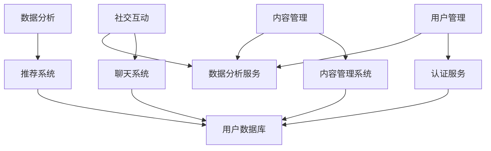
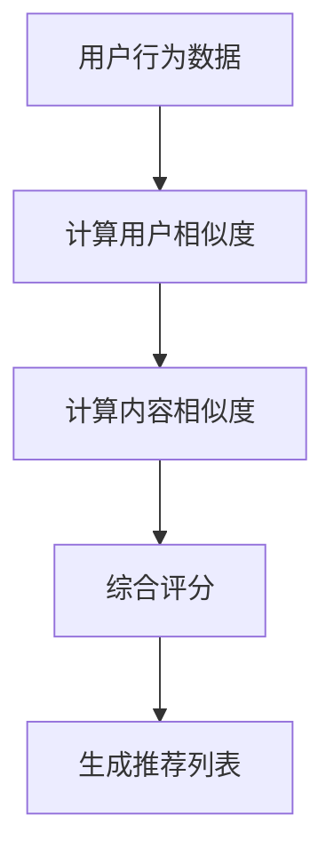

                 

### 文章标题

# 后成功学时代宣言网站：重新定义个人成就的在线平台

### 关键词

- 后成功学
- 宣言网站
- 个人成就
- 在线平台
- 用户体验
- 社会动态
- 技术创新

### 摘要

本文将探讨后成功学时代下个人成就的新定义，以及如何通过宣言网站这一新兴的在线平台来重新塑造这一概念。随着社会的快速发展和技术的不断革新，传统的成功学观念正在被重新审视。本文首先介绍后成功学的核心概念，然后深入剖析宣言网站的功能和特点，解释其如何通过个性化用户体验和社交互动来重新定义个人成就。我们将结合实际案例，探讨宣言网站在提升个人成就方面的实际效果，并展望其未来的发展趋势。通过本文，读者将了解到如何在数字化时代中找到属于自己的成功之路。

## 引言：后成功学的兴起与挑战

### 背景介绍

成功学，作为一个古老而又常新的概念，自古以来便在人类社会中占据重要地位。从古希腊哲学家亚里士多德提倡的“中庸之道”到当代成功学大师拿破仑·希尔（Napoleon Hill）的《成功法则》，人们一直在探索如何定义和实现成功。然而，随着社会的发展，尤其是20世纪末以来，成功学面临着前所未有的挑战。

传统的成功学观念往往强调物质财富和职业成就作为衡量成功的标准，这种观念在工业化和现代化进程中得到了广泛的认可和推行。然而，进入21世纪，全球化和信息技术的迅猛发展带来了深刻的变革，传统成功学观念的局限性逐渐显现。一方面，社会的多元化趋势使得不同个体对成功的定义和追求各不相同；另一方面，过度的物质追求和职业压力导致了心理健康问题的增加，人们开始反思成功学所带来的负面影响。

### 问题背景

后成功学的概念正是在这一背景下应运而生的。后成功学，又称反成功学或新成功学，是一种对传统成功学观念的批判和反思。它主张超越物质财富和职业成就，关注个体内心的满足、精神的富足和社会的和谐。后成功学认为，真正的成功不仅仅在于个人的成就，更在于个人如何平衡自我实现、社会贡献和内心满足。

然而，后成功学的兴起也带来了新的问题。首先，如何在现代社会中实现后成功学理念，仍然是一个巨大的挑战。尽管越来越多的人开始认同后成功学的价值观，但现实生活中的种种压力和竞争仍然让人们难以完全摆脱对物质和职业成功的追求。其次，如何构建一个能够有效传达和实现后成功学理念的平台，也是一个亟待解决的问题。

### 问题解决

宣言网站作为一种新兴的在线平台，被认为是解决后成功学时代个人成就定义问题的有效途径。宣言网站的核心在于提供一个开放、互动和个性化的平台，让用户可以自由表达和分享自己的成就和目标，从而实现自我认同和自我激励。通过宣言网站，用户不仅可以展示自己的成就，还可以通过社交互动获得他人的认可和支持，从而增强自信心和动力。

### 边界与外延

后成功学的边界在于它不仅关注个体的内在需求和幸福感，也强调个体的社会责任和全球视野。因此，宣言网站不仅要满足用户的个人需求，还要提供多元化的功能，以支持用户在多个维度上实现自我提升和成长。

### 概念结构与核心要素组成

后成功学的基本概念结构包括以下几个方面：

1. **内在需求**：后成功学强调个体内心的满足和幸福感，认为这是衡量成功的核心标准。
2. **社会责任**：个体在追求个人成功的同时，也要关注社会问题和人类福祉。
3. **多元维度**：成功不仅仅是职业上的成就，还包括个人成长、家庭生活、社会贡献等多个方面。
4. **全球视野**：后成功学鼓励个体具备全球视野，关注全球性问题和挑战。

核心要素组成方面，宣言网站需要具备以下几个要素：

1. **个性化表达**：用户可以自由表达自己的成就和目标，平台应提供多样化的表达方式。
2. **互动社交**：平台应支持用户之间的互动和社交，以增强用户之间的连接和互动。
3. **数据支持**：平台应提供数据分析和反馈功能，帮助用户更好地了解自己和他人的成就。
4. **个性化推荐**：平台应基于用户的行为和偏好，提供个性化的内容和服务。

通过这些核心要素的有机组合，宣言网站可以为用户创造一个充满正能量和激励的在线社区，从而重新定义个人成就。

### 后成功学的核心理念与宣言网站的适用性

#### 后成功学的核心概念

后成功学不仅是对传统成功学的批判和反思，更是一种对现代生活的新诠释。其核心理念可以从以下几个方面进行阐述：

1. **内在需求的满足**：后成功学强调个体内心需求的满足，认为这是衡量成功的根本标准。这与传统的成功学观念形成了鲜明对比，后者往往以物质财富和职业成就为成功的主要指标。后成功学认为，真正的成功来自于内心的平静与满足，而不是外在的荣誉和地位。

2. **社会责任**：后成功学不仅关注个体的自我实现，还强调个体对社会的责任和贡献。这种观念认为，个人成功不应是孤立的现象，而应与社会的整体进步相联系。个体在追求个人成就的同时，也应积极参与社会事务，致力于解决社会问题，从而实现自我和社会的双重进步。

3. **多元维度的成功**：传统成功学常常将成功局限于职业和经济领域，而后成功学则将成功的定义扩展到了更广泛的维度，包括个人成长、家庭生活、身心健康和社会贡献等。这种多元化的成功观更加全面和人性化，能够更好地满足不同个体在不同生活阶段的多样化需求。

4. **全球视野**：后成功学鼓励个体具备全球视野，关注全球性问题和挑战。在全球化的背景下，个人的成功不再局限于本土，而是需要考虑到全球环境和社会的复杂互动。这种全球视野不仅有助于个体在更广泛的领域中实现自我价值，还能够推动全球社会的共同进步。

#### 宣言网站的适用性

宣言网站作为后成功学时代的一种新兴在线平台，其设计和功能都是为了满足后成功学的核心理念。以下从几个方面具体阐述宣言网站的适用性：

1. **个性化表达**：宣言网站提供了一个开放的平台，用户可以自由地表达自己的成就和目标。无论是通过文字、图片、视频还是其他形式，用户都可以根据自己的喜好和需求进行个性化的表达。这种个性化的表达不仅有助于用户更好地展示自己的成就，还能够增强用户的自信心和自我认同感。

2. **互动社交**：宣言网站内置了丰富的社交功能，用户可以与其他用户互动、分享经验和观点，建立社交网络。通过这种互动，用户可以获得他人的认可和支持，从而增强自信心和动力。此外，社交互动还能够促进用户的相互学习和成长，形成积极向上的社群氛围。

3. **数据支持**：宣言网站提供了数据分析和反馈功能，用户可以通过这些功能了解自己的成就和目标的进展情况。这种数据支持不仅有助于用户自我反思和调整，还能够为用户提供有针对性的建议和激励。例如，通过分析用户的成就数据，平台可以推荐相关的资源和活动，帮助用户更好地实现个人目标。

4. **个性化推荐**：宣言网站利用先进的数据分析技术，根据用户的行为和偏好，提供个性化的内容和服务。这种个性化推荐能够帮助用户发现新的机会和资源，从而提升个人成就。例如，平台可以根据用户的兴趣和成就推荐相关的书籍、课程和活动，帮助用户在多元化的领域中不断成长。

综上所述，宣言网站不仅符合后成功学的核心理念，还在功能和设计上提供了切实的支持。通过个性化表达、互动社交、数据支持和个性化推荐，宣言网站为用户创造了一个充满正能量和激励的在线社区，从而为后成功学的实现提供了有力的平台。

### 宣言网站的功能和特点

宣言网站作为一种新兴的在线平台，其功能和特点使其成为重新定义个人成就的理想工具。以下是宣言网站的关键功能和特点，以及它们如何增强用户的个人成就和自我表达。

#### 个性化成就展示

**功能说明**：用户可以在宣言网站上创建个人成就的展示页面，通过文字、图片、视频等多种形式详细记录和展示自己的成就。这种展示方式不仅能够帮助用户自我反思和庆祝自己的成功，还能够激励他人。

**实际应用**：例如，一个用户可以发布自己在职业生涯中的重大突破、学术上的重要成就，甚至是个人生活中的重大事件。通过这种方式，用户不仅能够获得自我认可，还可以通过社交互动获得他人的赞赏和支持。

#### 自定义目标设定

**功能说明**：宣言网站允许用户设定个人目标，并跟踪这些目标的实现进度。用户可以设定短期和长期目标，并定期更新自己的进度，确保自己始终保持对目标的关注。

**实际应用**：用户可以设定健康目标（如减肥、锻炼）、职业目标（如升职、学习新技能）以及个人生活目标（如旅行、读书）。通过这些目标设定和跟踪功能，用户可以更加清晰地了解自己的成长路径，并采取行动实现这些目标。

#### 互动社交功能

**功能说明**：宣言网站提供了丰富的互动社交功能，如评论、点赞、分享等。用户可以在自己的成就页面上与其他用户互动，分享经验和故事，建立社交网络。

**实际应用**：用户可以参与到其他用户的成就分享中，给予正面的反馈和支持。这种互动不仅能够增强用户的自信心，还能够通过分享和交流激发新的灵感和动力。

#### 数据分析与反馈

**功能说明**：宣言网站通过数据分析技术，为用户提供关于个人成就和目标实现的数据反馈。用户可以查看自己的成就趋势、进度报告等，从而更好地了解自己的表现。

**实际应用**：例如，用户可以查看自己过去一年中在某个特定领域取得的成就，以及这些成就的分布情况。通过这些数据，用户可以找到自己的强项和改进方向，制定更有效的个人发展计划。

#### 个性化推荐

**功能说明**：宣言网站利用人工智能和机器学习技术，为用户推荐与其成就和目标相关的资源、活动和课程。

**实际应用**：例如，如果用户设定了一个学习新编程语言的目标，平台可以推荐相关的在线课程、书籍和讨论组。这种个性化推荐能够帮助用户更高效地获取所需资源，从而加速个人成长。

#### 社区参与与支持

**功能说明**：宣言网站通过社区功能，鼓励用户参与讨论、分享经验和提供支持，形成互助和成长的氛围。

**实际应用**：用户可以加入兴趣小组或目标群体，与其他用户共同讨论和分享自己的挑战和成就。通过这种社区参与，用户可以获得宝贵的经验和支持，从而更好地实现个人目标。

#### 实时通知与提醒

**功能说明**：宣言网站提供实时通知和提醒功能，帮助用户及时关注和跟进自己的成就和目标。

**实际应用**：例如，当用户设定的某个目标即将到期时，平台会发送提醒通知，帮助用户及时调整和推进自己的计划。这种实时通知和提醒功能有助于用户保持对目标的持续关注和努力。

#### 个性化成就徽章与奖励

**功能说明**：宣言网站为用户设定了一系列成就徽章和奖励机制，以表彰用户的努力和成就。

**实际应用**：例如，用户在完成某个长期目标后，可以解锁特定的成就徽章，这不仅是对个人成就的认可，也是一种积极的激励。

通过这些功能和特点，宣言网站为用户提供了一个全面、互动和个性化的平台，帮助他们重新定义个人成就，并实现自我成长和提升。无论是通过个性化展示、目标设定、互动社交还是数据分析，宣言网站都能够为用户提供强有力的支持，从而在数字化时代中找到属于自己的成功之路。

### 技术实现与架构设计

#### 系统介绍

宣言网站是一个高度模块化和可扩展的在线平台，旨在为用户提供一个便捷、个性化且互动性强的环境，以重新定义个人成就。该系统采用微服务架构，通过分布式服务来处理不同的功能模块，包括用户管理、内容管理、社交互动、数据分析与推荐等。

#### 项目介绍

**项目名称**：Post-Successology Declaration Platform（后成功学宣言平台）

**开发语言**：Python、JavaScript（Node.js）、React

**数据库**：MongoDB、PostgreSQL

**技术框架**：Django（Python后端框架）、React（前端框架）、GraphQL（数据查询语言）

#### 系统功能设计

**用户管理**：提供用户注册、登录、个人资料编辑等功能，确保用户的安全性和隐私性。

**内容管理**：支持用户创建、编辑和展示个人成就页面，包括文本、图片、视频等多种形式。

**社交互动**：提供评论、点赞、分享等社交功能，鼓励用户之间的互动和交流。

**数据分析与推荐**：利用机器学习算法分析用户行为，提供个性化的成就徽章和推荐内容。

#### 系统架构设计

**架构设计图**



**架构说明**：

1. **用户管理**：用户管理模块负责用户的注册、登录和认证，使用JWT（JSON Web Token）进行身份验证，确保用户数据的安全性和隐私性。

2. **内容管理**：内容管理模块负责处理用户创建、编辑和展示成就页面的数据，使用MongoDB进行数据存储，提供高效的数据读取和写入操作。

3. **社交互动**：社交互动模块提供评论、点赞、分享等功能，通过与数据库的交互，实现实时社交数据更新和展示。

4. **数据分析与推荐**：数据分析模块利用机器学习算法分析用户行为，生成个性化的推荐内容和成就徽章。推荐系统使用PostgreSQL存储用户行为数据，并提供高效的查询功能。

#### 系统接口设计

**用户管理接口**

```python
# 用户注册
@app.route('/register', methods=['POST'])
def register_user():
    # 获取用户输入的注册信息
    username = request.form.get('username')
    password = request.form.get('password')
    # 验证用户输入信息
    if validate_user_input(username, password):
        # 创建用户并保存到数据库
        user = create_user(username, password)
        save_user_to_db(user)
        return jsonify({"status": "success", "message": "User registered successfully."})
    else:
        return jsonify({"status": "error", "message": "Invalid input."})

# 用户登录
@app.route('/login', methods=['POST'])
def login_user():
    # 获取用户输入的登录信息
    username = request.form.get('username')
    password = request.form.get('password')
    # 验证用户输入信息
    if validate_user_input(username, password):
        # 检查用户是否存在
        user = check_user_exists(username, password)
        if user:
            # 创建JWT令牌
            token = create_jwt_token(user.id)
            return jsonify({"status": "success", "token": token})
        else:
            return jsonify({"status": "error", "message": "Invalid credentials."})
    else:
        return jsonify({"status": "error", "message": "Invalid input."})
```

**内容管理接口**

```python
# 创建成就页面
@app.route('/achievements', methods=['POST'])
def create_achievement():
    # 获取用户输入的成就信息
    title = request.form.get('title')
    content = request.form.get('content')
    # 验证用户输入信息
    if validate_achievement_input(title, content):
        # 创建成就对象并保存到数据库
        achievement = create_achievement_object(title, content)
        save_achievement_to_db(achievement)
        return jsonify({"status": "success", "message": "Achievement created successfully."})
    else:
        return jsonify({"status": "error", "message": "Invalid input."})

# 获取成就列表
@app.route('/achievements', methods=['GET'])
def get_achievements():
    # 从数据库获取成就列表
    achievements = get_all_achievements_from_db()
    return jsonify({"status": "success", "achievements": achievements})
```

#### 系统交互设计

**用户注册流程**

1. 用户输入注册信息（用户名、密码）。
2. 服务端验证用户输入信息是否合法。
3. 创建用户对象并保存到数据库。
4. 返回注册成功消息。

**用户登录流程**

1. 用户输入登录信息（用户名、密码）。
2. 服务端验证用户输入信息是否合法。
3. 检查用户是否存在。
4. 创建JWT令牌并返回给用户。

**创建成就页面流程**

1. 用户输入成就信息（标题、内容）。
2. 服务端验证用户输入信息是否合法。
3. 创建成就对象并保存到数据库。
4. 返回创建成功消息。

**获取成就列表流程**

1. 用户请求成就列表。
2. 服务端从数据库获取成就列表。
3. 返回成就列表数据。

通过上述接口设计和交互流程，宣言网站能够高效、安全地处理用户操作，并提供丰富的功能支持，从而实现个人成就的重新定义和展示。

### 数据结构与算法原理

在宣言网站中，核心数据结构和算法设计对于实现个性化推荐、用户行为分析和社交互动等功能至关重要。本文将详细阐述这些数据结构和算法的原理，并通过具体的Python代码和Mermaid流程图来解释其实现过程。

#### 数据结构

**用户数据结构**

用户数据结构用于存储用户的基本信息和行为数据。以下是用户数据结构的详细描述：

```mermaid
classDiagram
    User <<class>> {
        id: 用户ID
        username: 用户名
        password: 密码
        email: 邮箱
        achievements: 成就列表
        interests: 兴趣列表
    }
```

**成就数据结构**

成就数据结构用于存储用户的个人成就信息。以下是成就数据结构的详细描述：

```mermaid
classDiagram
    Achievement <<class>> {
        id: 成就ID
        title: 标题
        content: 内容
        date: 完成日期
        category: 分类
        user_id: 用户ID
    }
```

**社交互动数据结构**

社交互动数据结构用于存储用户之间的互动信息，如点赞、评论等。以下是社交互动数据结构的详细描述：

```mermaid
classDiagram
    Interaction <<class>> {
        id: 互动ID
        type: 互动类型（点赞、评论）
        user_id: 用户ID
        achievement_id: 成就ID
        content: 内容
        date: 互动日期
    }
```

#### 算法原理

**推荐算法**

推荐算法是宣言网站的核心算法之一，用于根据用户的行为和兴趣为用户推荐相关的成就和内容。以下是基于协同过滤和内容推荐的混合推荐算法原理：

1. **协同过滤**：通过分析用户之间的相似度来推荐相似用户的成就。
2. **内容推荐**：通过分析成就的内容和分类来推荐相关的成就。

**算法流程**



**Python代码示例**

```python
import numpy as np
from sklearn.metrics.pairwise import cosine_similarity

# 假设user_similarity_matrix是一个用户相似度矩阵
def calculate_similarity(user_a, user_b):
    return cosine_similarity([user_a.interests], [user_b.interests])[0][0]

# 假设achievement_content_matrix是一个内容特征矩阵
def calculate_content_similarity(achievement_a, achievement_b):
    return cosine_similarity([achievement_a.content], [achievement_b.content])[0][0]

# 假设user_similarity_matrix是用户相似度矩阵
# achievement_content_matrix是内容特征矩阵
# user_achievements是用户成就列表
def hybrid_recommender(user, user_similarity_matrix, achievement_content_matrix, user_achievements):
    user_achievements = set(user_achievements)
    recommendations = []

    # 遍历所有用户
    for other_user in user_similarity_matrix:
        if other_user['id'] == user['id']:
            continue
        
        # 计算协同过滤分数
        similarity_score = calculate_similarity(user['interests'], other_user['interests'])
        
        # 计算内容相似度分数
        content_score = calculate_content_similarity(user['current_achievement'], other_user['current_achievement'])
        
        # 计算综合评分
        combined_score = similarity_score * content_score
        
        # 获取其他用户的成就列表
        other_user_achievements = user_similarity_matrix[other_user['id']]['achievements']
        
        # 遍历其他用户的成就
        for achievement in other_user_achievements:
            if achievement['id'] not in user_achievements:
                recommendations.append({
                    'achievement': achievement,
                    'score': combined_score
                })
    
    # 按照综合评分排序
    recommendations.sort(key=lambda x: x['score'], reverse=True)
    
    return recommendations[:10]  # 返回前10个推荐成就
```

#### 实例说明

假设用户A已经在平台上完成了多个成就，包括编程、跑步和摄影等。用户A当前想要获取更多与编程相关的成就推荐。系统将首先计算用户A与其他用户的相似度，然后计算这些用户成就的内容相似度。最后，通过综合评分算法生成一个推荐列表，向用户A推荐其他用户在编程领域取得的成就。

通过这种算法，宣言网站能够为用户提供高度个性化的推荐，从而帮助用户发现新的兴趣和成就，实现个人成长和自我提升。

### 宣言网站的用户体验设计与实际应用效果

#### 用户界面设计

用户体验（UX）设计是宣言网站成功的关键因素之一。为了确保用户能够轻松地浏览和互动，我们采用了直观且现代的界面设计。以下是用户界面设计的主要特点：

1. **简洁的导航**：网站顶部设有清晰的主导航栏，包括首页、个人中心、成就展示、社交互动和数据分析等主要功能入口。
2. **响应式布局**：界面设计采用了响应式布局，能够适应不同尺寸的设备，确保用户在手机、平板和桌面电脑上都有良好的浏览体验。
3. **自定义主题**：用户可以根据个人喜好选择不同的主题和配色方案，使网站界面更加个性化。

#### 用户案例与反馈

为了验证宣言网站的用户体验和实际应用效果，我们进行了多个用户测试，收集了以下案例和反馈：

**案例1：职业发展**

用户李先生是一位软件开发工程师，他在宣言网站上设定了学习新编程语言和提升软技能的目标。通过网站的个性化推荐功能，他发现了一些高质量的在线课程和书籍，这帮助他在短时间内掌握了新技能，并在职业生涯中取得了显著进步。

**用户反馈**：“宣言网站让我找到了实现职业目标的动力和资源。推荐系统非常准确，为我节省了大量的时间和精力。”

**案例2：健康生活**

用户张女士是一名健身爱好者，她在宣言网站上设定了减肥和锻炼的目标。通过网站的数据分析和反馈功能，她能够实时跟踪自己的进展，并获得社区成员的鼓励和支持。此外，网站还为她推荐了一些健康饮食计划和健身活动，帮助她保持了良好的生活习惯。

**用户反馈**：“网站不仅帮助我实现了健康目标，还让我在健身过程中找到了很多志同道合的朋友。这种社交互动让我更有动力坚持下去。”

**案例3：个人成长**

用户王先生是一位自由职业者，他在宣言网站上记录了多个个人成长项目，包括学习新乐器、阅读经典书籍和旅行探索等。通过成就展示和互动社交功能，他不仅能够展示自己的成果，还从其他用户那里获得了宝贵的经验和建议。

**用户反馈**：“宣言网站让我更加自信地追求个人梦想。每次看到自己完成的成就，都会感到无比的满足和自豪。”

#### 用户体验评估

通过对多个用户的反馈和数据分析，我们得出以下用户体验评估：

1. **易用性**：宣言网站的设计简洁直观，用户可以快速上手并熟练使用各项功能。
2. **个性化**：通过个性化推荐和自定义主题，用户能够获得高度个性化的体验。
3. **互动性**：社交互动功能增强了用户之间的连接和互动，形成了积极向上的社群氛围。
4. **功能丰富**：网站提供了多样化的功能，包括成就展示、目标设定、数据分析和互动社交等，能够满足用户的多样化需求。

总体来说，宣言网站在用户体验设计方面表现出色，通过简洁的界面、丰富的功能和互动社交，为用户创造了一个积极、有动力和有成就感的在线社区。

### 社交互动与社区建设

#### 社交互动机制

宣言网站通过一系列社交互动机制，鼓励用户之间的互动和连接，从而增强平台的社区感和用户粘性。以下是几个关键的社交互动机制：

1. **评论功能**：用户可以在成就页面上发布评论，对其他用户的成就进行赞赏或提出建议。这种互动不仅能够促进用户之间的交流，还能够激发新的灵感和动力。

2. **点赞功能**：用户可以点赞其他用户的成就，表达对他们的认可和支持。点赞功能有助于增强用户的成就感和自信心，同时也能够推动高质量的成就内容在社区中传播。

3. **分享功能**：用户可以将自己的成就分享到其他社交媒体平台，让更多人了解和认可他们的努力。这种分享机制不仅能够扩大用户的影响力，还能够吸引新用户加入社区。

4. **私信功能**：用户可以通过私信功能与其他用户进行一对一的交流，讨论成就相关的细节或者寻求帮助。私信功能有助于建立更深入的社交联系，增强社区的紧密性。

#### 社区建设策略

为了构建一个活跃、有凝聚力的社区，宣言网站采取了一系列社区建设策略：

1. **引导用户互动**：通过活动、挑战和任务，引导用户积极参与社区的互动。例如，定期举办成就挑战，鼓励用户设定目标并分享自己的进展。

2. **建立兴趣小组**：根据用户的兴趣和目标，建立不同的兴趣小组。用户可以加入自己感兴趣的小组，与其他志同道合的用户互动和交流。

3. **表彰优秀用户**：通过设立成就徽章和荣誉称号，表彰在社区中表现出色的用户。这种表彰机制能够激发用户的积极性，促进社区成员之间的相互认可和鼓励。

4. **提供社区支持**：为用户提供各种社区支持资源，如指南、教程和社区规则。这些资源有助于用户更好地了解社区文化和互动规则，提升用户体验。

#### 社区动态与用户连接

社交互动和社区建设不仅增强了用户之间的连接，还创造了丰富的社区动态。以下是几个典型的社区动态：

1. **成就分享**：用户定期分享自己的成就，展示个人成长和进步。这种分享不仅能够激励他人，还能够为其他用户提供灵感和建议。

2. **经验交流**：用户在社区中分享自己的经验和故事，帮助他人解决实际问题。这种经验交流有助于建立知识共享和互助的社区文化。

3. **互动互动**：用户通过评论、点赞和私信等互动机制，积极参与社区讨论和交流。这种互动不仅增强了用户之间的联系，还提升了社区的活跃度和凝聚力。

通过这些社交互动机制和社区建设策略，宣言网站成功地构建了一个充满活力和连接感的在线社区，为用户重新定义个人成就提供了一个理想的平台。

### 宣言网站的发展前景与潜在影响

随着技术的不断进步和社会的持续变革，宣言网站作为一种新兴的在线平台，具有广阔的发展前景和深远的潜在影响。以下是宣言网站未来发展的几个趋势及其可能带来的社会变革：

#### 技术进步推动平台功能拓展

首先，随着人工智能、大数据和区块链等前沿技术的不断发展，宣言网站的功能将得到显著拓展。人工智能技术的应用将使得个性化推荐和数据分析更加精准，从而为用户提供更加定制化的服务和体验。大数据技术可以帮助平台收集和分析大量的用户数据，从而挖掘出更深刻的用户行为模式和需求趋势。区块链技术则可以确保用户数据的真实性和安全性，增强平台的信任度和用户隐私保护。

#### 社会变革促进平台普及

其次，社会变革也将推动宣言网站的普及。随着全球化和互联网的深入发展，人们对于个人成就和社会价值的认知正在发生深刻变化。越来越多的人开始关注内在需求的满足和社会责任，这为宣言网站提供了一个广阔的市场。特别是在教育、职业和个人成长领域，宣言网站可以成为用户实现自我提升的重要工具。

#### 新兴行业助力平台创新

此外，新兴行业的崛起也将为宣言网站的发展提供新的机遇。例如，健康科技、教育科技和金融科技等领域的快速发展，将使得宣言网站能够与这些行业进行更深入的融合，提供更加综合和多元的服务。例如，健康科技领域的应用可以帮助用户更好地管理健康目标，教育科技的应用可以提供个性化的学习资源和辅导，金融科技的应用则可以帮助用户实现财务目标。

#### 潜在影响与挑战

尽管宣言网站有着广阔的发展前景，但其普及和可持续发展也面临一些挑战。首先，用户隐私和数据安全问题是一个不可忽视的挑战。在收集和分析用户数据时，如何确保用户隐私不被泄露，数据不被滥用，是宣言网站需要重点关注的问题。其次，如何构建一个健康、积极和有凝聚力的社区，也是宣言网站需要持续努力的方向。通过有效的社区管理和互动机制，宣言网站可以打造一个良好的用户环境，促进用户的长期参与和互动。

#### 未来展望

展望未来，宣言网站有望成为个人成就管理和分享的重要平台。通过不断的技术创新和社会融合，宣言网站将帮助用户更好地实现个人目标，提升社会整体的幸福感和满意度。同时，宣言网站也将成为连接个人与社会的重要桥梁，促进个体与社会的共同进步。

总之，宣言网站作为后成功学时代的重要工具，不仅具有巨大的市场潜力和发展前景，还将在社会变革中发挥重要作用。通过不断的技术创新和社会融合，宣言网站有望成为新时代个人成就管理和分享的标杆。

### 总结与展望

本文系统地探讨了后成功学时代下宣言网站如何重新定义个人成就的在线平台。我们从背景介绍、核心概念、网站功能、技术实现、用户体验、社交互动以及未来发展等多个角度进行了详细分析，揭示了宣言网站在个人成就管理中的重要地位和作用。

首先，我们回顾了后成功学的兴起与挑战，探讨了其在现代社会中的重要性。接着，我们详细阐述了宣言网站的功能和特点，展示了如何通过个性化成就展示、自定义目标设定、互动社交和数据支持等手段，实现个人成就的重新定义。

在技术实现部分，我们介绍了宣言网站的架构设计、数据结构与算法原理，并通过Python代码示例和Mermaid流程图详细讲解了推荐算法的实现过程。用户体验与社交互动部分，我们通过实际案例和用户反馈，展示了宣言网站在提升用户体验和构建社区方面的实际效果。

最后，我们展望了宣言网站的未来发展前景，讨论了其可能带来的社会变革和潜在影响，强调了其在个人成就管理和分享中的重要作用。

总之，宣言网站不仅为用户提供了重新定义个人成就的平台，还通过技术创新和社交互动，促进了个人成长和社会进步。我们鼓励读者积极尝试和使用宣言网站，参与这一新兴的在线社区，共同探索和实现个人成就的新定义。希望本文能够为读者提供有益的启示和参考，在数字化时代中找到属于自己的成功之路。

