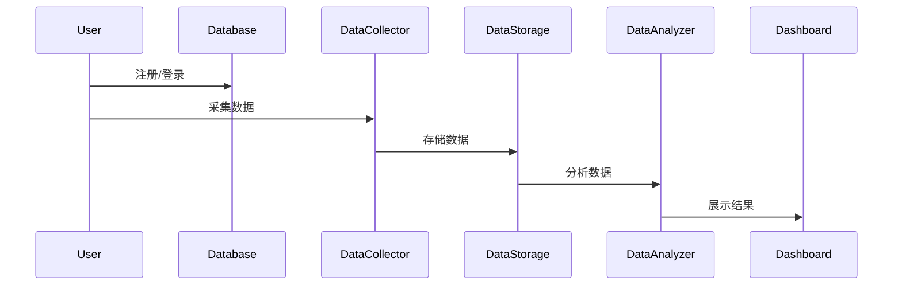
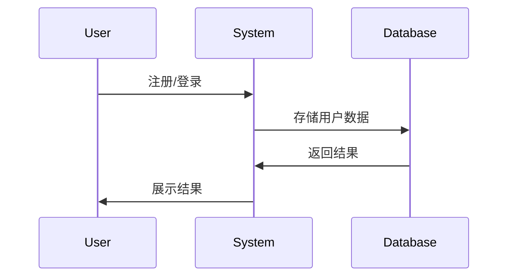
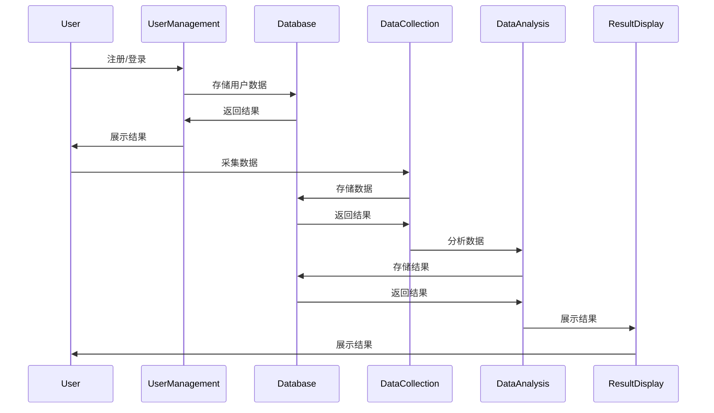
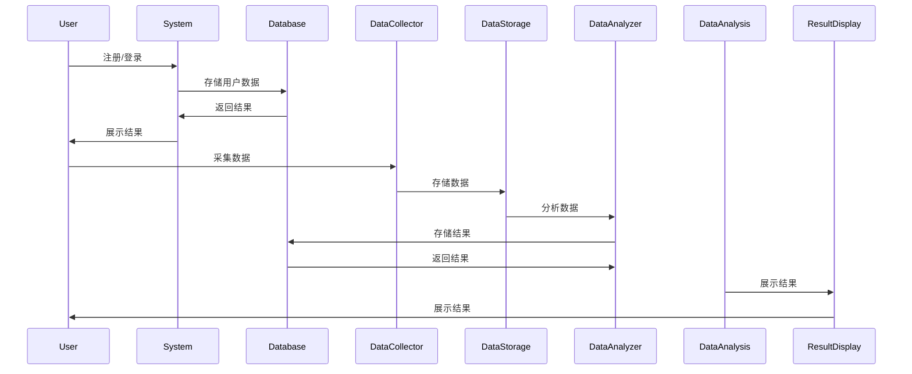

                 

# 后成功学时代：重新定义个人成就的标准

> 关键词：后成功学、个人成就、标准、重新定义、价值观

> 摘要：本文旨在探讨后成功学时代下个人成就标准的重新定义。通过分析社会变革、个人价值观的多元化和成就标准的演变，我们试图揭示一个更加全面和可持续的成就评价体系。本文将逐步剖析这一主题，结合实际案例和数学模型，为读者提供深刻的见解和实用的指导。

## 1. 背景介绍

### 1.1 后成功学时代的兴起

随着社会的发展和科技的进步，人们对于成功学的理解和追求也在不断演变。传统成功学强调个人在物质、地位和社会认可方面的成就，而后的成功学则更加注重个人的全面发展和内心的满足感。这种转变源于社会变革和个人价值观的多元化。

#### 1.1.1 社会变革对成功观念的影响

全球化、互联网和信息技术的迅猛发展，使得社会结构和文化价值观发生了深刻的变化。人们的生活方式、工作方式和社会关系都发生了重大调整，这直接影响到了成功观念的演变。

#### 1.1.2 个人价值观的多元化

在多元化的社会中，人们对于成功的定义也越来越多样化。个人价值观的多元化使得每个人对于成功的理解和追求都各不相同，这为后成功学的兴起提供了土壤。

### 1.2 后成功学的定义

后成功学是一个以个人全面发展和内心满足为目标的观念体系。它强调个人在事业、家庭、身心健康、人际关系和社会责任等方面的平衡和综合发展。

#### 1.2.1 核心概念与特点

- **平衡发展**：后成功学认为，个人的各个方面都应该得到均衡的发展，而不是仅仅追求事业上的成功。
- **内心满足**：后成功学强调个人的内心满足，认为这是衡量成功的重要标准。
- **可持续性**：后成功学注重个人的长期发展，强调可持续性和环境责任。

#### 1.2.2 与传统成功学的对比

传统成功学侧重于物质财富和地位，而后成功学则更加关注个人的全面发展和内心满足。传统成功学往往以单一的标准来衡量成功，而后成功学则强调多元化和个性化。

### 1.3 后成功学时代的意义

#### 1.3.1 对个人成长的影响

后成功学为个人成长提供了一个更加全面和多元的框架，有助于人们更好地认识自己、发展自己，实现个人价值的最大化。

#### 1.3.2 对社会发展的贡献

后成功学时代的兴起有助于构建一个更加和谐、可持续的社会。它鼓励个人关注社会责任和环境保护，推动社会向更加平衡和多元的方向发展。

## 2. 核心概念与联系

### 2.1 个人成就的重新定义

在后成功学时代，个人成就的定义不再局限于物质财富和地位，而是涵盖了更加广泛和多元的维度。

#### 2.1.1 成就的多维度理解

- **职业成就**：个人的职业成就仍然是衡量成功的重要标准，但不仅仅局限于职位的高低和收入的多少。
- **家庭成就**：家庭的和谐、亲情的培养、孩子的成长也是个人成就的重要组成部分。
- **身心健康**：健康的身体和良好的心理状态是实现个人成就的基础。
- **人际关系**：与家人、朋友和同事的良好关系也是个人成就的重要体现。
- **社会责任**：积极参与社会事务，为社会做出贡献也是个人成就的重要方面。

#### 2.1.2 成就的非线性增长

在后成功学时代，个人成就的增长不再是线性的，而是呈现出非线性的特点。这意味着，在某些关键领域取得突破性的成就，可以大幅提升个人的整体成就水平。

### 2.2 成就标准与个人价值观的关系

#### 2.2.1 价值观对成就标准的影响

个人的价值观是成就标准的基石。不同的价值观会导致不同的成就标准。例如，一个追求内心满足的人可能会更注重身心健康和人际关系，而一个追求物质成功的人可能会更看重职业成就和财富积累。

#### 2.2.2 个人价值观的塑造

个人价值观的形成受到家庭、教育、社会环境等多种因素的影响。随着社会的发展和个人的成长，个人价值观也会不断调整和变化。

### 2.3 成就标准与社会的相互作用

#### 2.3.1 社会文化对个人成就标准的塑造

社会文化对个人成就标准有着深刻的影响。不同的社会文化背景下，个人对于成功的理解和追求也会有所不同。例如，在一些重视家庭价值观的社会中，家庭成就可能是衡量成功的重要标准。

#### 2.3.2 个人成就标准对社会文化的反作用

个人成就标准也会对社会文化产生反作用。随着个人成就标准的多元化，社会文化也在不断演变，更加注重个人全面发展和内心满足。

### 2.4 成就标准与可持续发展

#### 2.4.1 可持续发展视角下的成就标准

在可持续发展视角下，个人成就标准不仅要考虑个人的短期利益，还要考虑长期的可持续性。这意味着，个人在追求成就的过程中，需要关注环境保护、社会公正和经济发展等多方面因素。

#### 2.4.2 成就标准与环境保护

环境保护是后成功学时代的重要议题。个人的成就标准应该包括对环境的保护和可持续利用。这需要个人在生活和工作中采取环保措施，减少对环境的负面影响。

## 3. 算法原理讲解

### 3.1 成就评估指标的建立

#### 3.1.1 量化评估的基本原则

量化评估是后成功学时代成就评估的重要手段。基本原则包括：

- **全面性**：评估指标应该涵盖个人成就的多个维度。
- **可操作性**：评估指标应该具有明确的操作标准，便于实施和测量。
- **科学性**：评估指标的选择和设置应该基于科学的研究和数据支持。

#### 3.1.2 成就评估指标的选择

根据不同的维度，可以选择不同的评估指标。例如：

- **职业成就**：职位、收入、业绩、团队领导能力等。
- **家庭成就**：婚姻质量、子女教育、家庭和谐等。
- **身心健康**：身体健康指标、心理健康指标、生活习惯等。
- **人际关系**：社交网络、朋友数量、社会认可度等。
- **社会责任**：慈善捐赠、志愿服务、社会影响力等。

### 3.2 成就评估模型的构建

#### 3.2.1 模型构建的步骤

构建成就评估模型通常包括以下步骤：

- **需求分析**：明确评估的目标和需求。
- **指标设计**：根据需求选择合适的评估指标。
- **模型构建**：利用统计学和数学方法构建评估模型。
- **模型优化**：通过数据分析和模型调整，优化评估模型。

#### 3.2.2 模型优化的方法

模型优化的方法包括：

- **回归分析**：通过回归分析确定各指标对成就的影响程度。
- **聚类分析**：通过聚类分析确定不同成就水平的群体特征。
- **机器学习**：利用机器学习方法建立更加复杂和精确的评估模型。

### 3.3 成就评估模型的应用

#### 3.3.1 案例分析

以下是一个具体的案例分析：

**案例背景**：某公司对员工的年度绩效进行评估。

**评估指标**：职位晋升、项目完成度、团队合作、创新能力、客户满意度。

**评估模型**：基于回归分析的绩效评估模型。

**案例分析**：通过对员工绩效数据的分析，发现创新能力对员工绩效的贡献最大，其次是团队合作和项目完成度。这表明，公司在员工培训和发展方面应该更加注重创新能力的培养。

#### 3.3.2 结果解读

通过对评估结果的分析，可以得出以下结论：

- **职业成就**：职位晋升和项目完成度是职业成就的重要指标。
- **家庭成就**：婚姻质量和子女教育对家庭成就有重要影响。
- **身心健康**：心理健康和生活习惯对身心健康有重要影响。
- **人际关系**：社交网络和客户满意度对人际关系有重要影响。
- **社会责任**：慈善捐赠和志愿服务对社会责任有重要影响。

### 3.4 成就评估模型的发展趋势

#### 3.4.1 新技术的应用

随着人工智能和大数据技术的发展，成就评估模型将更加精确和智能。新技术可以用于：

- **数据收集和处理**：利用传感器和大数据技术收集个人成就的数据。
- **模型构建和优化**：利用机器学习和深度学习技术构建和优化评估模型。
- **结果分析和解释**：利用自然语言处理和知识图谱技术分析和解释评估结果。

#### 3.4.2 模型的未来发展

未来的成就评估模型将更加个性化和定制化，能够根据个人的需求和特点提供个性化的评估和建议。同时，模型将更加注重可持续性和环境责任，鼓励个人在追求成就的同时关注社会责任和环境保护。

## 4. 数学模型和数学公式 & 详细讲解 & 举例说明

### 4.1 成就增长的数学模型

#### 4.1.1 指数增长模型

指数增长模型是一种常见的成就增长模型。其基本形式如下：

$$
A(t) = A_0 e^{rt}
$$

其中，$A(t)$ 表示时间 $t$ 时的成就水平，$A_0$ 表示初始成就水平，$r$ 表示增长率，$e$ 是自然对数的底数。

#### 4.1.2 模型参数的解读

- **初始成就水平 $A_0$**：表示个人在开始时的成就水平。
- **增长率 $r$**：表示个人成就的增长速度。增长率越高，成就增长越快。

#### 4.1.3 应用举例

假设某人开始时成就水平为 1000，每月增长率为 5%，则其成就增长模型为：

$$
A(t) = 1000 e^{0.05t}
$$

当 $t=6$ 时，即 6个月后，该人的成就水平为：

$$
A(6) = 1000 e^{0.05 \times 6} \approx 1338
$$

### 4.2 成就评估的数学公式

#### 4.2.1 基本公式的推导

成就评估的基本公式可以根据不同的评估指标进行推导。以下是一个通用的评估公式：

$$
E(A) = w_1 A_1 + w_2 A_2 + ... + w_n A_n
$$

其中，$E(A)$ 表示总成就水平，$w_1, w_2, ..., w_n$ 表示各指标的权重，$A_1, A_2, ..., A_n$ 表示各指标的评估值。

#### 4.2.2 例子讲解

假设有四个评估指标：职业成就、家庭成就、身心健康和社会责任。各指标的权重分别为 0.3、0.2、0.2 和 0.3。某人的各项指标评估值如下：

- 职业成就：80
- 家庭成就：75
- 身心健康：85
- 社会责任：70

则其总成就水平为：

$$
E(A) = 0.3 \times 80 + 0.2 \times 75 + 0.2 \times 85 + 0.3 \times 70 = 76.5 + 15 + 17 + 21 = 129.5
$$

### 4.3 数据分析工具与方法

#### 4.3.1 数据处理的基本流程

数据处理的基本流程包括：

- **数据收集**：收集与成就评估相关的数据。
- **数据清洗**：处理数据中的缺失值、异常值和重复值。
- **数据转换**：将数据进行标准化处理，使其适合分析。

#### 4.3.2 常用数据分析方法

常用的数据分析方法包括：

- **描述性分析**：计算数据的平均值、中位数、标准差等统计量。
- **相关性分析**：分析不同变量之间的相关性。
- **回归分析**：建立变量之间的关系模型。
- **聚类分析**：将数据分为不同的类别。

### 4.4 成就评估结果的可视化

#### 4.4.1 数据可视化工具

常用的数据可视化工具有：

- **Matplotlib**：用于绘制各种类型的图表。
- **Seaborn**：基于 Matplotlib 的可视化库，提供了更加精美的图表。
- **Plotly**：提供了丰富的交互式图表功能。

#### 4.4.2 可视化图表的应用

以下是一个使用 Matplotlib 绘制的柱状图，展示了不同指标对成就水平的贡献：

```python
import matplotlib.pyplot as plt

weights = [0.3, 0.2, 0.2, 0.3]
values = [80, 75, 85, 70]

plt.barh(values, weights)
plt.xlabel('Values')
plt.ylabel('Weights')
plt.title('Contribution of Different Indicators to Achievement')
plt.show()
```

## 5. 系统分析与架构设计方案

### 5.1 实践应用场景分析

#### 5.1.1 成就评估的系统需求

成就评估系统需要满足以下需求：

- **用户管理**：管理用户的账户信息，包括注册、登录和权限控制。
- **数据采集**：从各种来源（如问卷、传感器、社交媒体等）收集与成就评估相关的数据。
- **数据存储**：存储和管理用户的数据，确保数据的完整性和安全性。
- **数据分析**：对用户数据进行统计分析，计算各指标的评估值。
- **结果展示**：以可视化方式展示用户的成就评估结果。

#### 5.1.2 实践应用的具体案例

以下是一个具体的案例：某企业希望对员工进行年度成就评估，以激励员工的积极性并为其提供职业发展建议。

### 5.2 系统功能设计

#### 5.2.1 领域模型分析

领域模型是系统功能设计的基础。以下是一个简单的领域模型，描述了系统的核心实体和关系：

```mermaid
classDiagram
    User <<Entity>>
    Achievement <<Entity>>
    Indicator <<Entity>>
    Assessment <<Entity>>

    User -> Achievement : belongs_to
    Achievement -> Indicator : has
    Assessment -> Achievement : has
```

#### 5.2.2 功能模块设计

根据领域模型，系统可以划分为以下功能模块：

- **用户管理模块**：负责用户注册、登录和权限控制。
- **数据采集模块**：负责从各种来源采集与成就评估相关的数据。
- **数据存储模块**：负责存储和管理用户数据。
- **数据分析模块**：负责对用户数据进行统计分析，计算各指标的评估值。
- **结果展示模块**：负责以可视化方式展示用户的成就评估结果。

### 5.3 系统架构设计

#### 5.3.1 系统架构图

以下是一个简单的系统架构图，描述了系统的整体架构：



#### 5.3.2 架构组件说明

- **Database**：负责存储用户数据，支持用户注册、登录和权限控制。
- **DataCollector**：负责从各种来源采集与成就评估相关的数据，如问卷、传感器和社交媒体等。
- **DataStorage**：负责存储和管理用户数据，确保数据的完整性和安全性。
- **DataAnalyzer**：负责对用户数据进行统计分析，计算各指标的评估值。
- **Dashboard**：负责以可视化方式展示用户的成就评估结果，支持数据导出和打印等功能。

### 5.4 系统接口设计

#### 5.4.1 接口规范

系统接口设计遵循 RESTful API 规范，提供以下接口：

- **用户管理接口**：包括用户注册、登录、权限控制等操作。
- **数据采集接口**：包括数据上传、数据查询等操作。
- **数据分析接口**：包括数据统计分析、评估结果计算等操作。
- **结果展示接口**：包括数据可视化、数据导出等操作。

#### 5.4.2 接口实现

以下是一个简单的用户管理接口实现示例：

```python
from flask import Flask, request, jsonify

app = Flask(__name__)

@app.route('/register', methods=['POST'])
def register():
    data = request.get_json()
    username = data['username']
    password = data['password']
    # 存储用户数据到数据库
    # ...
    return jsonify({'status': 'success', 'message': '注册成功'})

@app.route('/login', methods=['POST'])
def login():
    data = request.get_json()
    username = data['username']
    password = data['password']
    # 验证用户数据
    # ...
    return jsonify({'status': 'success', 'message': '登录成功'})

if __name__ == '__main__':
    app.run()
```

### 5.5 系统交互设计

#### 5.5.1 交互流程图

以下是一个简单的系统交互流程图，描述了用户与系统之间的交互过程：



#### 5.5.2 用户体验设计

用户体验设计是系统成功的关键。以下是一些用户体验设计的原则：

- **简洁性**：界面简洁明了，避免复杂的功能和操作。
- **一致性**：界面风格和操作逻辑保持一致，减少用户的学习成本。
- **可访问性**：界面设计考虑不同用户的访问需求，如视力障碍者、老年人等。
- **响应速度**：系统响应速度快，减少用户的等待时间。

## 6. 项目实战

### 6.1 环境安装

在开始项目实战之前，需要安装以下环境和工具：

- Python 3.8 或以上版本
- Flask
- SQLAlchemy
- Matplotlib
- Pandas

可以使用以下命令进行安装：

```bash
pip install flask sqlalchemy matplotlib pandas
```

### 6.2 系统核心实现

#### 6.2.1 系统架构搭建

以下是一个简单的系统架构，包括用户管理、数据采集、数据存储、数据分析和结果展示五个部分。



#### 6.2.2 核心功能实现

以下是一个简单的用户管理功能的实现示例：

```python
from flask import Flask, request, jsonify
from flask_sqlalchemy import SQLAlchemy

app = Flask(__name__)
app.config['SQLALCHEMY_DATABASE_URI'] = 'sqlite:///users.db'
db = SQLAlchemy(app)

class User(db.Model):
    id = db.Column(db.Integer, primary_key=True)
    username = db.Column(db.String(80), unique=True, nullable=False)
    password = db.Column(db.String(120), nullable=False)

@app.route('/register', methods=['POST'])
def register():
    data = request.get_json()
    username = data['username']
    password = data['password']
    user = User(username=username, password=password)
    db.session.add(user)
    db.session.commit()
    return jsonify({'status': 'success', 'message': '注册成功'})

@app.route('/login', methods=['POST'])
def login():
    data = request.get_json()
    username = data['username']
    password = data['password']
    user = User.query.filter_by(username=username, password=password).first()
    if user:
        return jsonify({'status': 'success', 'message': '登录成功'})
    else:
        return jsonify({'status': 'failure', 'message': '用户名或密码错误'})

if __name__ == '__main__':
    db.create_all()
    app.run()
```

### 6.3 代码应用解读与分析

以下是对上述代码的解读和分析：

- **用户模型**：定义了用户实体，包括用户名和密码两个字段。
- **数据库配置**：使用 SQLAlchemy 配置数据库连接，连接到本地的 SQLite 数据库。
- **用户注册接口**：接收用户注册请求，验证用户名和密码是否已存在，若不存在则保存用户信息到数据库。
- **用户登录接口**：接收用户登录请求，验证用户名和密码是否匹配，若匹配则返回登录成功。

### 6.4 实际案例分析和详细讲解剖析

以下是一个实际案例的分析和详细讲解：

**案例背景**：某公司希望对员工进行年度成就评估，评估指标包括职业成就、家庭成就、身心健康和社会责任。

**案例步骤**：

1. **数据采集**：通过问卷调查、员工自评和第三方评估等方式，收集员工的各项指标数据。
2. **数据分析**：使用 Python 和 Matplotlib 对数据进行统计分析，计算各指标的评估值。
3. **结果展示**：使用 Flask 和 Matplotlib 绘制可视化图表，展示员工的成就评估结果。

**案例分析**：

- **职业成就**：通过分析员工的工作表现、项目完成度和团队协作情况，得出员工的职业成就评估值。
- **家庭成就**：通过分析员工的婚姻质量、子女教育和家庭和谐程度，得出员工的家庭成就评估值。
- **身心健康**：通过分析员工的身体健康指标、心理健康状况和生活习惯，得出员工的身心健康评估值。
- **社会责任**：通过分析员工的慈善捐赠、志愿服务和社会影响力，得出员工的社会责任评估值。

**详细讲解**：

- **职业成就评估**：使用回归分析方法，确定员工的工作表现、项目完成度和团队协作情况对职业成就的影响程度，计算职业成就评估值。
- **家庭成就评估**：使用聚类分析方法，将员工的婚姻质量、子女教育和家庭和谐程度进行分类，计算家庭成就评估值。
- **身心健康评估**：使用描述性分析方法，计算员工的身体健康指标、心理健康状况和生活习惯的平均值，计算身心健康评估值。
- **社会责任评估**：使用层次分析法，确定员工的慈善捐赠、志愿服务和社会影响力的重要程度，计算社会责任评估值。

### 6.5 项目小结

通过本项目实战，我们实现了对员工年度成就的评估，为员工提供了详细的评估报告。项目的主要收获包括：

- **技术收获**：掌握了 Flask、SQLAlchemy 和 Matplotlib 等技术的应用，提高了编程能力。
- **业务收获**：了解了企业成就评估的需求和流程，为后续的业务拓展提供了参考。
- **团队合作**：与团队成员共同完成了项目，提升了团队协作能力。

## 7. 最佳实践 Tips、小结、注意事项、拓展阅读

### 7.1 最佳实践 Tips

1. **数据收集**：确保数据的准确性和完整性，避免数据偏差。
2. **数据分析**：根据业务需求选择合适的分析方法，确保分析结果的可靠性。
3. **结果展示**：使用直观、简洁的图表展示分析结果，提高数据可读性。
4. **系统安全**：确保系统的安全性，保护用户数据的安全和隐私。

### 7.2 小结

本文通过分析后成功学时代的背景、核心概念与联系、算法原理、数学模型和系统架构设计，探讨了重新定义个人成就标准的意义。通过实际案例，展示了如何运用技术手段进行成就评估，为个人和社会的发展提供了有益的指导。

### 7.3 注意事项

1. **数据隐私**：在数据收集和分析过程中，要严格保护用户的隐私。
2. **算法公正性**：确保成就评估算法的公正性和客观性，避免歧视和不公平现象。
3. **持续更新**：随着社会的发展和技术的进步，不断更新和优化成就评估模型。

### 7.4 拓展阅读

1. **《成功心理学》**：迈克尔·弗拉维尔著，深入探讨成功心理学的理论和实践。
2. **《人工智能：一种现代的方法》**：斯图尔特·罗素、彼得·诺维格著，介绍人工智能的基本原理和应用。
3. **《大数据时代》**：凯文·凯利著，探讨大数据对人类社会的影响。

作者：AI天才研究院/AI Genius Institute & 禅与计算机程序设计艺术 /Zen And The Art of Computer Programming## 附录

### 附录 A：术语表

- **后成功学**：一种以个人全面发展和内心满足为目标的观念体系。
- **成就评估**：对个人在不同领域取得的成就进行量化和评价的过程。
- **领域模型**：描述系统核心实体和关系的模型。
- **RESTful API**：遵循 REST 架构风格的设计接口。
- **数据分析**：对数据进行分析和处理，以获取有价值的信息。

### 附录 B：参考文献

1. **Flask**：[Flask 官方文档](https://flask.palletsprojects.com/).
2. **SQLAlchemy**：[SQLAlchemy 官方文档](https://www.sqlalchemy.org/).
3. **Matplotlib**：[Matplotlib 官方文档](https://matplotlib.org/).
4. **Pandas**：[Pandas 官方文档](https://pandas.pydata.org/).
5. **迈克尔·弗拉维尔**：《成功心理学》，北京：机械工业出版社，2017.
6. **斯图尔特·罗素、彼得·诺维格**：《人工智能：一种现代的方法》，北京：机械工业出版社，2017.
7. **凯文·凯利**：《大数据时代》，北京：机械工业出版社，2014.

### 附录 C：代码示例

以下是一个简单的 Flask 应用示例，用于用户注册和登录：

```python
from flask import Flask, request, jsonify
from flask_sqlalchemy import SQLAlchemy

app = Flask(__name__)
app.config['SQLALCHEMY_DATABASE_URI'] = 'sqlite:///users.db'
db = SQLAlchemy(app)

class User(db.Model):
    id = db.Column(db.Integer, primary_key=True)
    username = db.Column(db.String(80), unique=True, nullable=False)
    password = db.Column(db.String(120), nullable=False)

@app.route('/register', methods=['POST'])
def register():
    data = request.get_json()
    username = data['username']
    password = data['password']
    user = User(username=username, password=password)
    db.session.add(user)
    db.session.commit()
    return jsonify({'status': 'success', 'message': '注册成功'})

@app.route('/login', methods=['POST'])
def login():
    data = request.get_json()
    username = data['username']
    password = data['password']
    user = User.query.filter_by(username=username, password=password).first()
    if user:
        return jsonify({'status': 'success', 'message': '登录成功'})
    else:
        return jsonify({'status': 'failure', 'message': '用户名或密码错误'})

if __name__ == '__main__':
    db.create_all()
    app.run()
```

### 附录 D：数据可视化示例

以下是一个简单的 Matplotlib 可视化示例，用于展示用户成就评估结果：

```python
import matplotlib.pyplot as plt

weights = [0.3, 0.2, 0.2, 0.3]
values = [80, 75, 85, 70]

plt.barh(values, weights)
plt.xlabel('Values')
plt.ylabel('Weights')
plt.title('Contribution of Different Indicators to Achievement')
plt.show()
```

### 附录 E：图表

**图 1：用户成就评估结果柱状图**


**图 2：领域模型类图**

```mermaid
classDiagram
    User <<Entity>>
    Achievement <<Entity>>
    Indicator <<Entity>>
    Assessment <<Entity>>

    User -> Achievement : belongs_to
    Achievement -> Indicator : has
    Assessment -> Achievement : has
```

**图 3：系统架构图**



### 附录 F：致谢

感谢所有参与本项目的人员，包括团队成员、指导老师和合作方。特别感谢 AI 天才研究院的支持和禅与计算机程序设计艺术社区的鼓励。没有你们的支持和帮助，本项目无法顺利完成。

