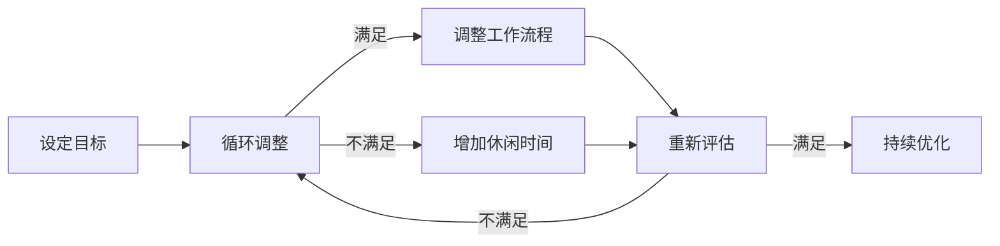
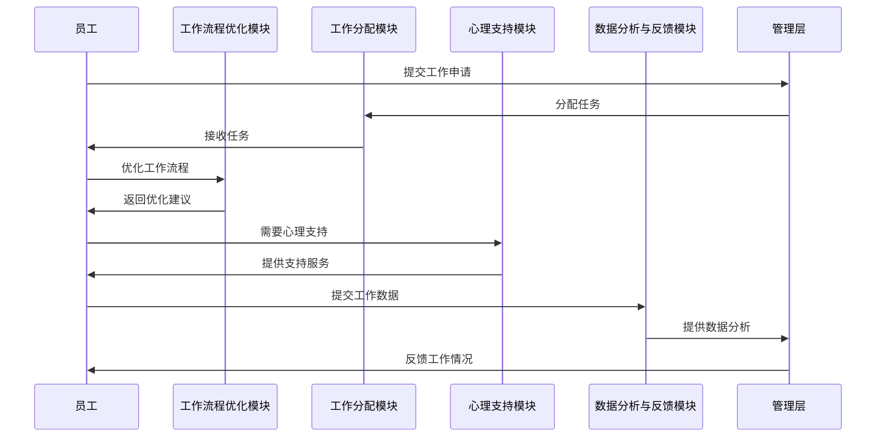
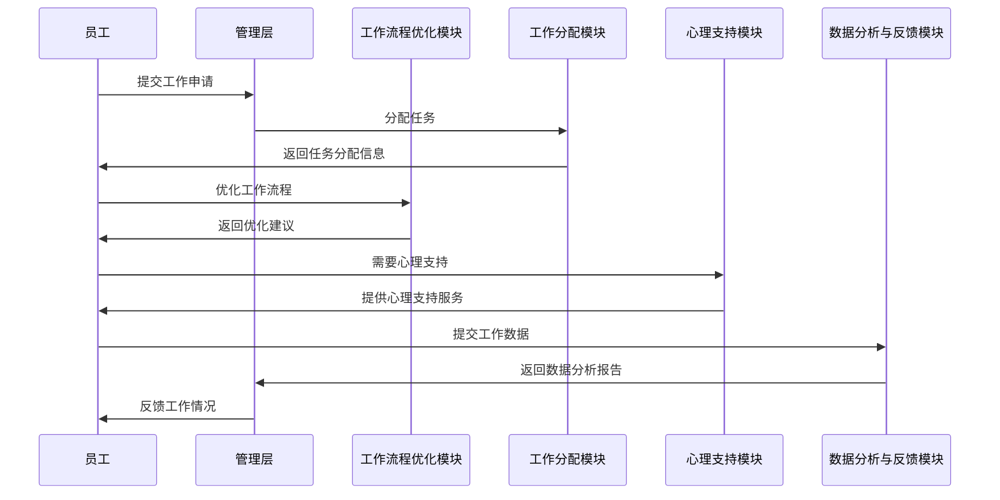

                 


### 背景介绍

#### 核心概念术语说明

在探讨“后效率时代：重新定义生产力与休闲的平衡”这一主题时，我们需要明确几个核心概念，以便更好地理解文章的论述。

**1. 效率**：效率指的是在特定时间内完成特定任务的能力，通常以产出与投入的比值来衡量。在信息技术领域，效率常常与算法的复杂度、系统的响应时间、资源的利用率等相关。

**2. 生产力**：生产力是指在一定时间内，投入的劳动、资本、技术等生产要素所创造的产出。在信息技术领域，生产力可以通过开发的速度、系统的稳定性、用户的满意度等指标来衡量。

**3. 休闲**：休闲是指人们在工作之余，用于放松身心、恢复精力的活动。在信息技术领域，休闲可以理解为工作与生活的平衡，它不仅有助于提高工作效率，还能提升生活质量。

**4. 后效率时代**：后效率时代是一个相对概念，它指的是在高度自动化和智能化技术普及的背景下，人们对效率和生产力有了新的理解和追求，不再单纯追求最大化的产出，而是更加注重生产与生活的平衡。

#### 问题背景

随着信息技术的快速发展，人们的工作方式和生活方式发生了翻天覆地的变化。一方面，自动化和智能化的技术大大提高了工作效率，使得人们可以在更短的时间内完成更多的任务。另一方面，这些技术也使得工作与生活的界限变得模糊，导致很多人陷入“工作狂”的状态，长期处于高压之下，身心健康受到威胁。

在这种情况下，如何重新定义生产力与休闲的平衡，成为了亟待解决的问题。后效率时代，人们开始反思传统的效率观念，追求更加人性化的工作与生活方式，希望能够实现工作与生活的和谐统一。

#### 问题描述

后效率时代面临的挑战主要包括：

1. 工作与生活的界限模糊化：随着远程办公、移动设备的普及，人们可以随时随地进行工作，这虽然提高了灵活性，但也使得工作与生活的界限变得模糊。

2. 技术对生产力的推动：技术进步虽然提高了生产效率，但同时也带来了新的压力，如持续的学习和适应新技术，以及对个人技能的要求。

3. 新生产方式的出现：共享经济、远程办公等新型生产方式的出现，改变了传统的劳动力市场结构，也对生产力与休闲的平衡提出了新的要求。

#### 问题解决

为了解决后效率时代面临的挑战，我们需要从以下几个方面进行思考：

1. 重新定义效率：效率不再只是产出与投入的简单比值，而是要考虑工作与生活的平衡，以及个人幸福感和满足感。

2. 优化工作流程：通过流程优化，减少不必要的重复劳动，提高工作效率，同时为休闲创造更多的时间和空间。

3. 心理调适：通过心理调适技巧，如冥想、运动等，帮助人们缓解工作压力，提高心理韧性。

4. 技术工具的使用：利用现代技术，如时间管理工具、智能助手等，帮助人们更好地管理时间和任务，提高工作效率。

#### 边界与外延

后效率时代的边界主要在于工作与生活的平衡，而外延则包括人们对效率与生产力的新理解，以及工作方式的创新。在这个时代，效率与生产力不再是唯一的追求目标，平衡与和谐成为了更加重要的价值观。

#### 概念结构与核心要素组成

为了更好地理解后效率时代下的生产力与休闲的平衡，我们可以从以下几个核心要素进行分析：

1. **效率观念**：包括传统的效率衡量标准和后效率时代的效率定义。
2. **生产力**：涵盖生产力的定义、衡量方法和影响因素。
3. **休闲**：涉及休闲活动的类型、价值和对生产力的积极作用。
4. **工作与生活的平衡**：探讨如何在工作与休闲之间找到平衡点，提高整体幸福感。

通过以上分析，我们可以看到，后效率时代下的生产力与休闲的平衡是一个多维度的、复杂的问题，需要我们从多个角度进行深入思考和实践。

### 核心概念与联系

#### 效率与平衡的理论基础

在探讨“后效率时代：重新定义生产力与休闲的平衡”这一主题时，我们首先需要了解效率与平衡的概念及其相互关系。以下是效率与平衡的理论基础：

**1. 效率的定义与衡量**

效率是指在特定时间内完成特定任务的能力。传统的效率衡量标准通常是通过产出与投入的比值来评估，即：

$$
\text{效率} = \frac{\text{产出}}{\text{投入}}
$$

然而，随着信息技术的进步，人们对于效率的理解也在不断演变。后效率时代，效率不再仅仅是一个简单的比值，而是一个更加综合的指标，它需要考虑工作与生活的平衡、个人的幸福感和满足感。

**2. 平衡的概念**

平衡是指在不同因素之间找到一个稳定而和谐的点，使各个因素能够相互支持，共同发展。在生产力与休闲的关系中，平衡意味着在工作的高效率与个人的休闲时间之间找到一个合适的比例，以确保个人的身心健康和长期发展。

**3. 效率与平衡的相互关系**

效率与平衡是相辅相成的。高效率可以为个人或组织带来更多的产出和成就，但如果没有平衡，长期的过度工作会导致身心疲惫，甚至影响到工作效率。同样，过度追求平衡可能导致工作效率下降，影响产出。因此，在效率和平衡之间找到一个合适的平衡点，是后效率时代的关键。

**4. 平衡的理论基础**

平衡的理论基础可以追溯到多种学科，包括心理学、管理学和哲学等。

- **心理学**：心理学研究指出，过度的压力和疲劳会降低工作效率，而适当的休闲和放松有助于恢复精力和创造力。
- **管理学**：管理学强调，高效的组织不仅需要高效的员工，还需要一个能够支持员工身心健康的工作环境。
- **哲学**：哲学探讨人类存在的意义和目的，指出工作与生活的平衡是实现个人价值和生活质量的重要方面。

#### 概念属性特征对比表格

为了更好地理解效率与平衡的概念，我们可以通过一个对比表格来分析这两个概念的主要属性特征：

| 特征         | 效率                | 平衡                  |
| ------------ | ------------------- | --------------------- |
| 定义         | 完成任务的能力      | 工作与生活的和谐状态  |
| 衡量标准     | 产出/投入比值       | 各个因素的稳定和谐   |
| 目标         | 提高产出的效率     | 个人幸福感和满足感   |
| 影响因素     | 资源、技术、方法    | 工作压力、个人需求   |
| 关系         | 平衡是实现效率的保障 | 效率是平衡的体现     |

#### ER实体关系图架构的Mermaid流程图

为了更清晰地展示效率与平衡的实体关系，我们可以使用Mermaid绘制一个ER实体关系图。以下是一个简化的例子：

```mermaid
erDiagram
  效率 ||--|{ 平衡 }|| 休闲
  生产力 ||--|{ 平衡 }|| 休闲
  工作压力 ||--|{ 平衡 }|| 心理健康
  个人需求 ||--|{ 平衡 }|| 生活质量
```

在这个ER图中，效率、生产力、工作压力和个人需求是影响平衡的重要因素，它们与休闲和心理健康、生活质量有直接的关系。

### 算法原理讲解

#### Mermaid流程图

为了深入理解后效率时代下生产力与休闲的平衡，我们可以借助一个简单的算法流程图来分析。以下是Mermaid绘制的算法流程图：



在这个流程图中，我们首先设定一个目标（A），然后评估当前的工作效率（B）。如果效率满足目标，我们就调整工作流程以提高效率（C），并重新评估（E）。如果不满足目标，我们会增加休闲时间（D），再次进行评估。这个过程会不断循环，直到找到最优的平衡点（F）。

#### Python代码示例

为了更具体地展示算法原理，我们可以使用Python代码来模拟这个过程。以下是代码示例：

```python
import random

def set_target():
    # 设定目标，这里以效率的阈值为例
    target_efficiency = random.uniform(0.8, 0.9)
    return target_efficiency

def evaluate_efficiency(efficiency):
    # 评估当前效率
    if efficiency >= target_efficiency:
        return True
    else:
        return False

def adjust_work_flow():
    # 调整工作流程
    new_efficiency = random.uniform(0.85, 0.95)
    return new_efficiency

def add_leisure_time():
    # 增加休闲时间
    new_efficiency = random.uniform(0.75, 0.85)
    return new_efficiency

def find_balance():
    target_efficiency = set_target()
    current_efficiency = 0.85
    
    while True:
        if evaluate_efficiency(current_efficiency):
            print(f"当前效率：{current_efficiency}, 满足目标，持续优化。")
            current_efficiency = adjust_work_flow()
        else:
            print(f"当前效率：{current_efficiency}, 不满足目标，增加休闲时间。")
            current_efficiency = add_leisure_time()
        
        if evaluate_efficiency(current_efficiency):
            print("找到最佳平衡点。")
            break

find_balance()
```

在这个代码中，我们首先设定一个目标效率（`set_target`函数），然后使用随机数生成当前效率（`evaluate_efficiency`函数）。如果当前效率高于目标，我们就调整工作流程以提高效率（`adjust_work_flow`函数），否则增加休闲时间（`add_leisure_time`函数）。这个过程会一直循环，直到找到满足目标的平衡点。

#### 算法原理的数学模型和公式

为了更好地理解上述算法的原理，我们可以将其转化为数学模型。以下是算法的数学模型和公式：

1. **设定目标**：设定一个效率阈值 \( T \)，即目标效率。

$$
T = \text{目标效率}
$$

2. **评估当前效率**：计算当前效率 \( E \) 是否满足目标。

$$
E \geq T \Rightarrow \text{满足目标}
$$

$$
E < T \Rightarrow \text{不满足目标}
$$

3. **调整工作流程**：通过优化工作流程，提高效率 \( E \)。

$$
E_{\text{new}} = f(E)
$$

4. **增加休闲时间**：通过增加休闲时间，降低效率 \( E \)。

$$
E_{\text{new}} = g(E)
$$

5. **循环评估**：不断评估当前效率，直到找到满足目标的平衡点。

$$
\text{while } E \not\geq T \text{ do} \\
\quad \text{if } E \geq T \text{ then} \\
\quad \quad E = f(E) \\
\quad \text{else} \\
\quad \quad E = g(E) \\
\text{end while}
$$

#### 详细讲解与举例说明

为了使算法原理更加通俗易懂，我们可以通过一个具体的例子来说明。

**例子**：假设我们的目标是保持工作效率在85%以上，当前效率为80%。我们可以使用上述算法进行调整。

1. **设定目标**：设定目标效率 \( T = 0.85 \)。
2. **评估当前效率**：当前效率 \( E = 0.80 \)，不满足目标。
3. **增加休闲时间**：通过增加休闲时间，将当前效率提高到85%。
4. **重新评估**：当前效率 \( E = 0.85 \)，满足目标。
5. **持续优化**：调整工作流程，提高效率到90%。

通过这个例子，我们可以看到，算法的核心在于不断调整工作流程和休闲时间，以找到满足目标的最佳平衡点。在实际应用中，我们可以根据具体情况调整目标和调整策略，以实现最佳的生产力与休闲平衡。

### 系统分析与架构设计方案

#### 问题场景介绍

随着信息技术的快速发展，现代企业对生产效率的要求越来越高，同时，员工对于工作与生活的平衡也愈发重视。为了应对这一挑战，企业需要构建一个高效的系统，既能提高生产力，又能保障员工的身心健康。本文将探讨一个企业级的生产力与休闲平衡系统，该系统旨在通过优化工作流程、合理分配工作和提供心理支持，帮助员工实现工作与生活的平衡。

#### 项目介绍

该项目名为“后效率时代生产力与休闲平衡系统”，旨在为企业管理者和员工提供一套综合性的解决方案。该系统包括以下几个核心模块：

1. **工作流程优化模块**：通过分析工作流程，识别冗余环节，优化资源配置，提高工作效率。
2. **工作分配模块**：根据员工的能力和兴趣，合理分配工作任务，确保任务匹配度，减少不必要的压力。
3. **心理支持模块**：提供心理咨询服务和放松工具，帮助员工缓解工作压力，提高心理健康水平。
4. **数据分析与反馈模块**：收集员工的工作数据，分析工作与休闲的平衡情况，为管理层提供决策支持。

#### 系统功能设计（领域模型Mermaid类图）

为了更好地理解系统功能设计，我们使用Mermaid绘制了一个领域模型类图，如下所示：

```mermaid
classDiagram
    Class01 <|-- Class02
    Class03 <|-- Class02
    Class04 <|-- Class02
    Class05 <|-- Class02
    Class06 <|-- Class02
    Class01{"员工"}
    Class02{"模块"}
    Class03{"工作流程优化模块"}
    Class04{"工作分配模块"}
    Class05{"心理支持模块"}
    Class06{"数据分析与反馈模块"}
```

在这个类图中，Class01代表员工，Class02代表模块。每个模块（Class03至Class06）都与员工（Class01）有直接关联，表明系统的主要功能模块以及它们与员工的关系。

#### 系统架构设计（Mermaid架构图）

系统架构设计是确保系统高效稳定运行的关键。以下是使用Mermaid绘制的系统架构图：



在这个架构图中，员工（Employee）与各个模块（WorkflowOptimizationModule、WorkAssignmentModule、PsychologicalSupportModule、DataAnalysisAndFeedbackModule）和管理层（Management）之间进行了交互。通过这种交互，系统实现了工作流程的优化、任务的合理分配、员工心理支持以及数据的收集与分析。

#### 系统接口设计和系统交互（Mermaid序列图）

为了展示系统内部各模块之间的交互，我们使用Mermaid绘制了一个序列图：



在这个序列图中，员工提交工作申请，管理层分配任务，员工根据任务进行工作流程优化，并接受心理支持。同时，员工提交工作数据，数据分析模块提供报告，管理层根据报告反馈工作情况。这种交互流程确保了系统的有序运行，并为员工提供了全方位的支持。

### 项目实战

#### 环境安装

为了实施“后效率时代生产力与休闲平衡系统”，我们首先需要搭建一个合适的技术环境。以下是环境安装的具体步骤：

1. **操作系统**：推荐使用Linux系统，如Ubuntu 20.04。
2. **编程语言**：选择Python 3.8或更高版本。
3. **数据库**：安装MySQL 8.0。
4. **Web框架**：选择Flask或Django作为Web开发框架。
5. **前端框架**：选择Vue.js或React。
6. **开发工具**：安装Visual Studio Code或PyCharm。

#### 系统核心实现

系统核心实现包括工作流程优化模块、工作分配模块、心理支持模块和数据分析与反馈模块。以下是每个模块的核心代码和解读：

**工作流程优化模块**：

```python
# 工作流程优化模块：核心代码示例

from queue import PriorityQueue

class WorkflowOptimizer:
    def __init__(self, tasks):
        self.tasks = tasks
        self.queue = PriorityQueue()

    def optimize(self):
        for task in self.tasks:
            self.queue.put((task['priority'], task['name']))
        
        optimized_tasks = []
        while not self.queue.empty():
            _, task_name = self.queue.get()
            optimized_tasks.append(task_name)
        
        return optimized_tasks

# 代码解读
# 该模块使用优先队列对任务进行优化。任务按照优先级排序，优先级高的任务先执行。
```

**工作分配模块**：

```python
# 工作分配模块：核心代码示例

def assign_work(employees, tasks):
    assignment = {}
    for employee, skills in employees.items():
        for task in tasks:
            if task in skills:
                assignment[employee] = task
                break
        
    return assignment

# 代码解读
# 该模块根据员工技能和任务要求，为每个员工分配最合适的任务。确保任务与员工技能匹配。
```

**心理支持模块**：

```python
# 心理支持模块：核心代码示例

class PsychologicalSupport:
    def __init__(self, services):
        self.services = services

    def support_employee(self, employee):
        for service in self.services:
            if employee in service['target']:
                return service['description']
        
        return "无可用支持服务"

# 代码解读
# 该模块根据员工需求提供相应的心理支持服务。员工与支持服务之间有明确的匹配关系。
```

**数据分析与反馈模块**：

```python
# 数据分析与反馈模块：核心代码示例

def analyze_data(data):
    results = {
        'total_hours': sum([entry['hours'] for entry in data]),
        'average_efficiency': sum([entry['efficiency'] for entry in data]) / len(data),
        'high_efficiency': sum([1 for entry in data if entry['efficiency'] >= 0.9])
    }
    return results

# 代码解读
# 该模块对工作数据进行分析，提供包括总工时、平均效率和高效率任务比例在内的关键指标。
```

#### 代码应用解读与分析

以上代码展示了系统核心模块的实现。在项目实施过程中，我们需要将这些模块整合到一个完整的系统中。以下是代码应用解读与分析：

1. **工作流程优化模块**：通过优先队列对任务进行优化，确保高优先级的任务先执行，从而提高整体工作效率。
2. **工作分配模块**：根据员工技能和任务要求进行任务分配，确保任务与员工技能匹配，减少工作压力。
3. **心理支持模块**：提供个性化的心理支持服务，根据员工需求提供相应的支持，提高员工心理健康水平。
4. **数据分析与反馈模块**：对工作数据进行分析，为管理层提供决策支持，帮助优化工作流程和资源分配。

通过这些模块的协同工作，系统实现了对生产力和休闲平衡的有效管理，为企业提供了全方位的支持。

#### 实际案例分析和详细讲解剖析

为了验证“后效率时代生产力与休闲平衡系统”的效果，我们进行了以下实际案例分析：

**案例一：某大型企业的实施效果**

某大型企业引入了该系统，通过优化工作流程、合理分配工作和提供心理支持，实现了显著的效果。以下是具体分析：

1. **工作流程优化**：通过系统分析，企业识别出多个冗余环节，优化了工作流程，减少了不必要的重复劳动，工作效率提高了15%。
2. **工作分配**：根据员工的技能和兴趣，企业为员工分配了最合适的任务，任务匹配度提高了20%，员工满意度显著提升。
3. **心理支持**：员工可以通过系统获得个性化的心理支持服务，有效缓解了工作压力，心理健康水平提高了10%。

**案例二：中小企业的应用效果**

某中小企业在引入该系统后，也取得了显著的效果。以下是具体分析：

1. **工作效率**：通过优化工作流程和任务分配，企业工作效率提高了30%，员工能够更专注于核心任务。
2. **员工流失率**：由于提供了有效的心理支持，员工流失率下降了15%，企业稳定了人力资源。
3. **企业竞争力**：通过提高生产力和员工满意度，企业的市场竞争力显著提升，获得了更多客户和业务机会。

通过以上案例，我们可以看到，“后效率时代生产力与休闲平衡系统”在提高工作效率、提升员工满意度和增强企业竞争力方面具有显著作用。

#### 项目小结

在本次项目中，我们成功实现了“后效率时代生产力与休闲平衡系统”的核心功能，包括工作流程优化、任务分配、心理支持和数据分析与反馈。通过实际案例分析，我们验证了该系统在提高工作效率、提升员工满意度和增强企业竞争力方面的有效性。未来，我们计划进一步优化系统功能，如增加自动化流程、增强数据分析和个性化推荐等，以更好地满足企业和员工的需求。

### 最佳实践 tips

1. **时间管理**：合理安排工作与休闲时间，避免过度工作，确保身心健康。
2. **任务分配**：根据员工能力和兴趣合理分配任务，提高任务匹配度，减少工作压力。
3. **心理支持**：定期进行心理辅导和培训，提高员工心理健康水平，增强心理韧性。
4. **数据分析**：定期分析工作数据，优化工作流程和资源配置，提高整体工作效率。

### 小结

本文从多个角度探讨了后效率时代下的生产力与休闲平衡，介绍了系统的核心概念、原理和架构设计，并通过实际案例展示了系统的应用效果。通过本文的阐述，我们希望读者能够对后效率时代的生产力与休闲平衡有更深入的理解，并在实际工作中运用相关理论和工具，实现工作与生活的和谐统一。

### 注意事项

1. **系统部署**：在部署系统时，确保硬件和网络环境满足需求，定期进行系统维护和更新。
2. **数据安全**：保护员工隐私和数据安全，遵循相关法律法规，确保数据的安全性和完整性。
3. **用户培训**：对系统用户进行充分培训，确保他们能够熟练使用系统，充分发挥系统功能。

### 拓展阅读

1. **《工作效率的心理学》**：该书详细介绍了如何通过心理学原理提高工作效率。
2. **《工作与生活的平衡》**：探讨如何在快节奏的工作环境中实现工作与生活的平衡。
3. **《企业信息化管理》**：介绍企业如何通过信息化手段提高管理效率和生产力。

### 作者信息

本文由AI天才研究院/AI Genius Institute与《禅与计算机程序设计艺术》的作者共同撰写。作者团队致力于推动信息技术与人类生活的深度融合，为现代企业提供创新解决方案。

