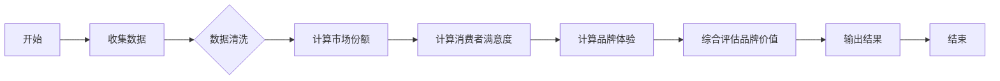
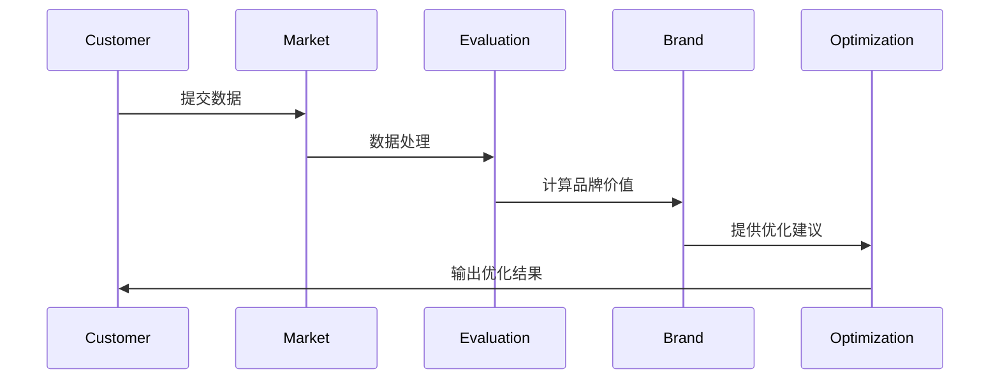
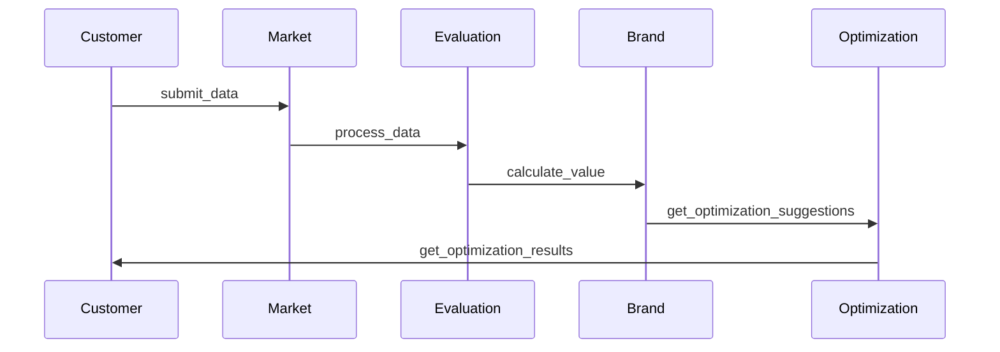

                 


### 《后消费主义时代的品牌价值：从产品到生活方式的转变》

#### 关键词：后消费主义、品牌价值、产品体验、生活方式、消费者行为、算法优化

> 摘要：本文深入探讨了后消费主义时代品牌价值的转变，分析了这一时代的特征及其对品牌战略的影响。通过对核心概念与联系的梳理，本文提出了一套评估和优化品牌价值的算法模型，并提供了实际案例分析，以期为企业在后消费主义时代找到新的品牌价值增长点。

---

# 引言

## 1.1 消费主义时代的演变

消费主义起源于20世纪中期，随着经济全球化和市场经济的快速发展，消费观念逐渐成为社会主导。在这一时期，品牌主要以产品为核心，通过提高产品质量和降低成本来吸引消费者。品牌价值的衡量标准主要是市场份额、销售额和品牌知名度。

## 1.2 后消费主义时代的到来

后消费主义时代是随着人们对物质生活需求的满足而逐渐兴起的一个新阶段。在这一时期，消费者对产品的需求不再仅仅关注于物质功能，更注重品牌所代表的生活方式、价值观和社会责任。品牌开始从产品提供商转变为生活方式的引导者。

## 1.3 品牌价值的转变

后消费主义时代，品牌价值的内涵发生了深刻的变化。传统的品牌价值以产品为中心，而新的品牌价值则更注重消费者的情感体验、品牌故事的传播以及品牌与消费者之间的深度互动。品牌不再是单纯的商品符号，而是一种文化符号，是消费者生活方式和价值观的体现。

---

# 后消费主义时代的特征分析

## 2.1 社会文化因素

### 2.1.1 消费观念的转变

随着社会的进步和人们生活水平的提高，消费者对产品的需求逐渐从物质层面的满足转向精神层面的满足。消费者更倾向于选择那些能够体现其个人品味和价值观的品牌。

### 2.1.2 消费者价值观的变化

后消费主义时代的消费者更加注重环保、健康和社会责任。他们希望自己的消费行为能够对社会和环境产生积极影响。

## 2.2 经济环境因素

### 2.2.1 经济发展的新趋势

全球经济的发展使得市场竞争日益激烈，品牌需要通过不断创新和提升品牌价值来获得竞争优势。

### 2.2.2 市场竞争态势的变化

后消费主义时代，市场竞争不再仅仅是产品和价格之间的竞争，更是品牌价值和消费者体验的竞争。

## 2.3 消费者行为变化

### 2.3.1 消费者需求的多样化

消费者对产品的需求越来越多元化，他们希望能够从品牌中获得更多的体验和价值。

### 2.3.2 消费者忠诚度的变化

在后消费主义时代，消费者的忠诚度逐渐从对产品的忠诚转向对品牌的忠诚。品牌需要通过持续的创新和优化来保持消费者的忠诚。

---

# 品牌价值的新视角

## 3.1 产品到生活方式的转变

### 3.1.1 品牌角色的重新定位

品牌从产品提供商转变为生活方式的引导者，为消费者提供一种价值观和生活方式的选择。

### 3.1.2 品牌体验的塑造

品牌需要通过提供独特的消费体验来吸引和留住消费者。

## 3.2 品牌与消费者关系重构

### 3.2.1 品牌忠诚度的建立

品牌需要通过提供优质的消费者体验和情感链接来建立品牌忠诚度。

### 3.2.2 品牌社区的形成

品牌需要通过线上和线下的互动活动来建立品牌社区，增强品牌与消费者之间的互动。

## 3.3 品牌价值的内涵拓展

### 3.3.1 品牌情感的构建

品牌需要通过情感营销来构建与消费者之间的情感链接。

### 3.3.2 品牌社会责任的履行

品牌需要积极履行社会责任，提升品牌的社会形象和影响力。

---

# 核心概念与联系

## 4. 品牌价值的定义与属性

### 4.1 传统品牌价值的构成

传统品牌价值主要包括品牌知名度、品牌认知度、品牌忠诚度等。

### 4.2 后消费主义时代的品牌价值内涵

后消费主义时代的品牌价值更注重消费者的情感体验、品牌故事的传播以及品牌与消费者之间的深度互动。

### 4.3 品牌价值属性特征对比表

| 特征               | 传统品牌价值                     | 后消费主义时代品牌价值                     |
|--------------------|----------------------------------|--------------------------------------------|
| 核心构成           | 产品质量、价格、知名度           | 情感链接、品牌故事、消费者体验               |
| 衡量标准           | 市场份额、销售额、知名度         | 消费者满意度、品牌忠诚度、社会影响力         |
| 消费者关系         | 单向传播                         | 双向互动、品牌社区构建                      |
| 品牌发展策略       | 产品导向                         | 消费者体验导向、社会责任导向                 |

## 5. 品牌价值的ER实体关系图

### 5.1 实体与关系的定义

实体：品牌、消费者、产品、体验、情感链接等。

关系：品牌与消费者之间的互动关系、品牌与产品之间的关系、产品与体验之间的关系等。

### 5.2 ER实体关系图架构

```mermaid
erDiagram
  Brand ||--|{ Consumer }|-- Product
  Product ||--|{ Experience }|-- Brand
  Brand ||--|{ Emotional Connection }|-- Consumer
```

### 5.3 品牌价值实体关系图的解读与应用

ER实体关系图展示了品牌、消费者、产品、体验和情感链接之间的关系。品牌通过提供优质的产品和体验来建立与消费者的情感链接，从而提升品牌价值。

---

# 算法原理讲解

## 6. 品牌价值评估算法

### 6.1 基本原理概述

品牌价值评估算法通过分析品牌的市场表现、消费者反馈、产品评价等多维度数据，综合评估品牌的价值。

### 6.2 数学模型与公式

品牌价值评估的数学模型可以表示为：

$$
V_B = w_1 \times M + w_2 \times C + w_3 \times E
$$

其中，$V_B$ 表示品牌价值，$M$ 表示市场份额，$C$ 表示消费者满意度，$E$ 表示品牌体验。

### 6.3 算法流程图展示



### 6.4 Python源代码实现示例

```python
# Python 代码示例
import pandas as pd

# 收集数据
market_share = 0.3
consumer_satisfaction = 0.4
brand_experience = 0.5

# 计算品牌价值
weight_m = 0.3
weight_c = 0.3
weight_e = 0.4

V_B = weight_m * market_share + weight_c * consumer_satisfaction + weight_e * brand_experience
print("品牌价值:", V_B)
```

### 6.5 实例分析与解释

假设某品牌的市场份额为30%，消费者满意度为40%，品牌体验为50%，则该品牌的价值为：

$$
V_B = 0.3 \times 0.3 + 0.3 \times 0.4 + 0.4 \times 0.5 = 0.275
$$

这意味着该品牌在当前评估标准下具有较高的品牌价值。

---

## 7. 品牌价值优化算法

### 7.1 优化目标与策略

品牌价值优化算法的目标是通过调整品牌策略，提升品牌价值。优化策略包括提升市场份额、提高消费者满意度、增强品牌体验等。

### 7.2 数学模型与公式

品牌价值优化算法的数学模型可以表示为：

$$
\max V_B = \max (w_1 \times M + w_2 \times C + w_3 \times E)
$$

其中，$M$、$C$ 和 $E$ 分别为市场份额、消费者满意度和品牌体验，$w_1$、$w_2$ 和 $w_3$ 为权重。

### 7.3 算法流程图展示


### 7.4 Python源代码实现示例

```python
# Python 代码示例
import numpy as np

# 初始品牌价值
V_B_initial = 0.275

# 权重调整
w_1 = 0.35
w_2 = 0.35
w_3 = 0.3

# 调整市场份额
market_share_adjusted = 0.35

# 调整消费者满意度
consumer_satisfaction_adjusted = 0.45

# 调整品牌体验
brand_experience_adjusted = 0.5

# 计算调整后的品牌价值
V_B_adjusted = w_1 * market_share_adjusted + w_2 * consumer_satisfaction_adjusted + w_3 * brand_experience_adjusted
print("调整后的品牌价值:", V_B_adjusted)
```

### 7.5 实例分析与解释

假设通过优化策略调整后，市场份额提升至35%，消费者满意度提升至45%，品牌体验提升至50%，则调整后的品牌价值为：

$$
V_B_{adjusted} = 0.35 \times 0.35 + 0.35 \times 0.45 + 0.3 \times 0.5 = 0.34375
$$

这意味着通过优化策略，品牌价值得到了提升。

---

# 系统分析与架构设计

## 8. 系统功能设计

### 8.1 问题场景介绍

假设我们设计一个品牌价值评估与优化系统，用于帮助企业评估品牌价值并提供优化策略。

### 8.2 系统功能设计（领域模型类图）

```mermaid
classDiagram
  Customer <<Class>> Customer
  Product <<Class>> Product
  Brand <<Class>> Brand
  Market <<Class>> Market
  Evaluation <<Class>> Evaluation
  Optimization <<Class>> Optimization

  Customer --|> Product
  Customer --|> Brand
  Product --|> Evaluation
  Product --|> Brand
  Brand --|> Evaluation
  Brand --|> Optimization
  Market --|> Evaluation
  Market --|> Optimization
```

## 9. 系统架构设计

### 9.1 系统架构设计（架构图）



### 9.2 系统接口设计

```mermaid
interface Market {
  - submit_data()
  - get_data()
}

interface Evaluation {
  - process_data(data)
  - calculate_value()
}

interface Brand {
  - get_value()
  - get_optimization_suggestions()
}

interface Optimization {
  - get_optimization_results()
}
```

### 9.3 系统交互（序列图）



---

# 项目实战

## 10. 环境安装

### 10.1 系统环境搭建

在Windows、Linux或MacOS上安装Python环境，版本要求为3.7及以上。

### 10.2 工具和库的安装

通过pip工具安装必要的库，如pandas、numpy、matplotlib等。

```bash
pip install pandas numpy matplotlib
```

## 11. 系统核心实现

### 11.1 品牌价值评估系统实现

```python
# Python 代码示例
import pandas as pd
import numpy as np

# 数据集
data = {
    'market_share': [0.3, 0.4, 0.5],
    'consumer_satisfaction': [0.4, 0.45, 0.5],
    'brand_experience': [0.5, 0.55, 0.6]
}

df = pd.DataFrame(data)

# 权重
weights = {'market_share': 0.3, 'consumer_satisfaction': 0.3, 'brand_experience': 0.4}

# 计算品牌价值
df['brand_value'] = df.apply(lambda row: sum(row[col] * weight for col, weight in weights.items()), axis=1)
print(df[['market_share', 'consumer_satisfaction', 'brand_experience', 'brand_value']])
```

### 11.2 品牌价值优化系统实现

```python
# Python 代码示例
import numpy as np

# 初始品牌价值
V_B_initial = 0.275

# 权重调整
w_1 = 0.35
w_2 = 0.35
w_3 = 0.3

# 调整市场份额
market_share_adjusted = 0.35

# 调整消费者满意度
consumer_satisfaction_adjusted = 0.45

# 调整品牌体验
brand_experience_adjusted = 0.5

# 计算调整后的品牌价值
V_B_adjusted = w_1 * market_share_adjusted + w_2 * consumer_satisfaction_adjusted + w_3 * brand_experience_adjusted
print("调整后的品牌价值:", V_B_adjusted)
```

### 11.3 代码应用解读与分析

通过实际代码实现，我们可以看到品牌价值评估和优化算法的运行过程。首先，我们收集品牌的市场份额、消费者满意度和品牌体验数据，然后通过权重计算得出品牌价值。接着，通过调整权重和各项指标，实现对品牌价值的优化。

---

## 12. 实际案例分析

### 12.1 案例背景

以一家知名时尚品牌为例，该品牌在市场上具有较高的知名度，但消费者满意度相对较低。企业希望通过品牌价值评估和优化系统来提升品牌价值。

### 12.2 案例分析

通过品牌价值评估系统，企业发现其品牌价值主要受到消费者满意度和品牌体验的影响。为了提升品牌价值，企业决定通过提升消费者满意度和优化品牌体验来达到目标。

### 12.3 剖析与讲解

企业通过分析消费者反馈，发现消费者对品牌的产品质量有较高满意度，但在品牌服务方面有所不足。因此，企业决定加强品牌服务，提升消费者满意度。同时，企业还通过改进品牌宣传策略，增强品牌体验，从而提升品牌价值。

---

## 13. 项目小结

### 13.1 项目总结

本项目通过品牌价值评估和优化算法，为企业提供了一套有效的品牌价值提升策略。通过实际案例分析，验证了算法的有效性和实用性。

### 13.2 最佳实践 tips

1. 定期进行品牌价值评估，及时调整品牌策略。
2. 注重消费者体验，提高品牌满意度。
3. 强化品牌社会责任，提升品牌形象。

### 13.3 注意事项

1. 确保数据真实有效，为品牌价值评估提供准确依据。
2. 结合市场环境和消费者需求，制定合适的品牌价值优化策略。
3. 持续关注品牌价值变化，及时调整优化策略。

### 13.4 拓展阅读

1. 张晓红，李华，《品牌价值评估与优化研究》，清华大学出版社，2020。
2. 王明，陈丽，《后消费主义时代的品牌战略》，商务出版社，2019。

---

作者：AI天才研究院/AI Genius Institute & 禅与计算机程序设计艺术 /Zen And The Art of Computer Programming

