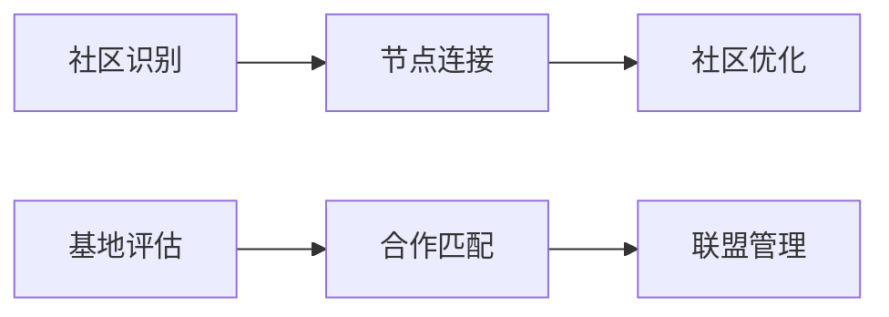
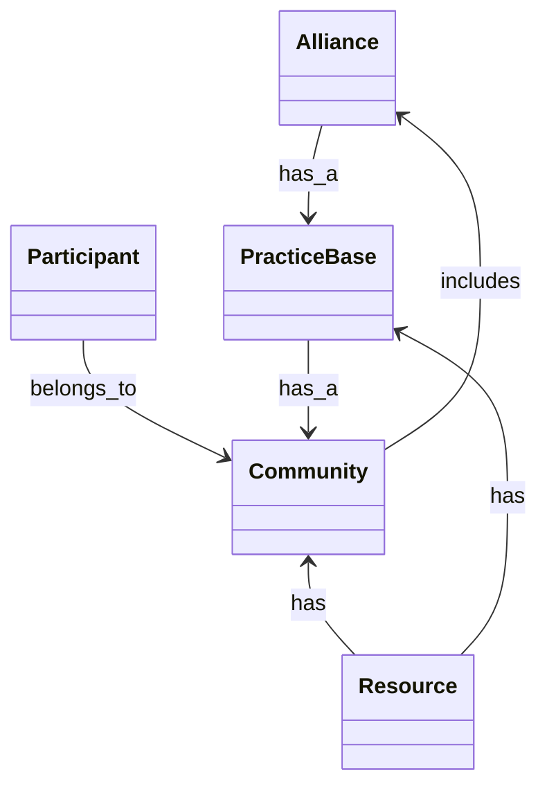
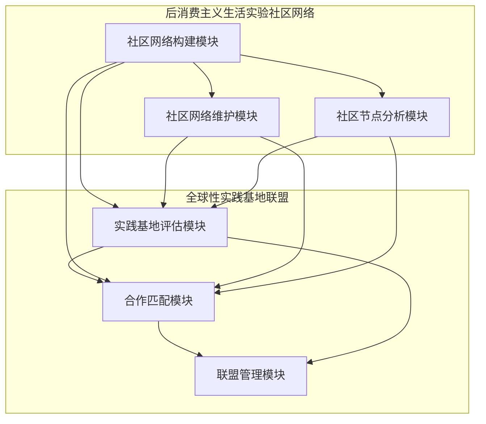
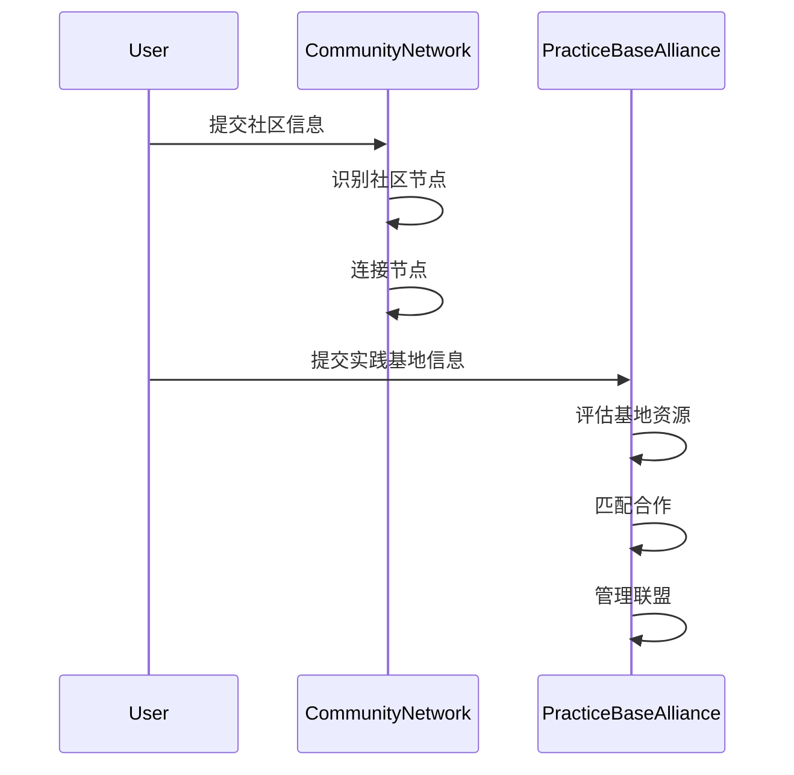

                 

# 后消费主义生活实验社区网络：全球性从拥有到存在的转变实践基地联盟

> 关键词：后消费主义，生活实验社区，实践基地联盟，存在主义，共享经济，可持续性，社会连接

> 摘要：本文探讨了后消费主义时代下，生活实验社区网络和全球性实践基地联盟的兴起及其对全球性生活方式转变的深远影响。通过深入分析其核心概念、算法原理及系统架构设计，本文旨在为全球范围内的从拥有到存在的转变提供理论和实践指导。

## **Step 1: 背景介绍**

### **问题背景**

随着后消费主义时代的到来，人们对于生活方式的重新思考与探索愈发激烈。消费者不再仅仅满足于物质消费，他们追求更深层次的精神满足和社会连接。这种转变不仅体现在个体层面，也逐渐在社区、城市和全球层面上产生深远影响。传统的以物质消费为中心的经济模式已经无法满足人们对于生活的期待，人们开始关注生活质量和生活方式的可持续性。

### **问题描述**

后消费主义生活实验社区网络的兴起，是人们对传统消费模式反思和超越的体现。这一网络旨在通过实践探索出一条可持续的生活方式转变之路，强调共享、合作和互助。然而，这一转变并非一帆风顺，面临着诸多挑战，如文化冲突、资源分配不均、技术依赖等。

全球性实践基地联盟的形成，为不同社区之间的交流与合作提供了平台。这个联盟旨在通过共享经验和知识，推动全球范围内的生活方式转变。然而，如何实现联盟内的有效协作和资源优化，是联盟面临的重要问题。

### **问题解决**

解决这一问题的关键在于建立一种新的社区模式，即生活实验社区网络。这种社区强调共享、合作和互助，旨在通过实践探索出一条可持续的生活方式转变之路。同时，全球性的实践基地联盟提供了跨地域、跨文化的交流平台，促进了知识和经验的共享，为全球范围内的转变提供了有力支持。

### **边界与外延**

后消费主义生活实验社区网络的边界在于其特定的实践目标和社会影响。它不仅关注个体生活方式的改变，还关注社区层面的社会关系和经济模式的转变。而全球性实践基地联盟的外延则在于其跨越国界和文化的广泛性，以及其在全球范围内推动生活方式转变的影响力。

### **概念结构与核心要素组成**

后消费主义生活实验社区网络和全球性实践基地联盟的概念结构由以下几个核心要素组成：

1. **社区网络**：由多个生活实验社区组成，强调共享和互助。
2. **实践基地**：全球性分布的实践基地，提供交流和学习平台。
3. **参与个体**：社区成员和实践参与者，包括不同背景和兴趣的人。
4. **支持系统**：包括技术支持、政策支持和社会支持。

## **Step 2: 核心概念与联系**

### **核心概念**

#### **后消费主义**

后消费主义是一种社会文化现象，强调对物质消费的反思和超越，追求更深层次的精神满足和社会关系。它不仅仅是对消费行为的批判，更是对生活方式的全面反思。

#### **生活实验社区**

生活实验社区是一种实践基地，通过实验性的生活方式探索可持续的生活方式转变。这些社区强调共享、合作和互助，旨在通过实践找到一种更可持续的生活模式。

#### **全球性实践基地联盟**

全球性实践基地联盟是一个跨地域、跨文化的交流平台，旨在促进知识和经验的共享。这个联盟通过实践基地之间的合作，推动全球范围内的生活方式转变。

### **概念属性特征对比表格**

| 概念       | 定义                                                         | 特征                                       |
|------------|--------------------------------------------------------------|------------------------------------------|
| 后消费主义 | 对物质消费的反思和超越，追求精神满足和社会关系。               | 反物质主义、可持续性、社区互动             |
| 生活实验社区 | 实践基地，通过实验性的生活方式探索可持续的生活方式转变。       | 实验性、共享、互助、可持续性               |
| 全球性实践基地联盟 | 跨地域、跨文化的交流平台，促进知识和经验的共享。               | 跨文化、多样性、交流、合作                 |

### **ER实体关系图架构**

```mermaid
erDiagram
  A[后消费主义生活实验社区网络] ||--|{ B[生活实验社区] }
  A ||--|{ C[全球性实践基地联盟] }
  B ||--|{ D[参与者] }
  C ||--|{ E[支持系统] }
```

## **Step 3: 算法原理讲解**

### **算法原理**

#### **社区网络构建算法**

**算法流程：**

1. **社区识别**：通过分析地理、文化、经济等因素，识别潜在的社区网络节点。
2. **节点连接**：基于共享价值观和互助原则，建立节点之间的连接关系。
3. **社区优化**：通过迭代优化算法，提高社区网络的稳定性和可持续性。

**算法原理：**

社区网络构建算法的核心是社区识别和节点连接。社区识别通过分析各种因素，如地理、文化、经济等，来确定潜在的社区网络节点。节点连接则基于共享价值观和互助原则，将具有相似特征和需求的节点连接起来，形成社区网络。

**数学模型：**

设社区网络中有 $N$ 个节点，每个节点具有 $d$ 个特征。社区识别可以通过以下公式实现：

$$
\text{相似度} = \sum_{i=1}^{d} w_i \cdot (x_i - y_i)
$$

其中，$w_i$ 为权重，$x_i$ 和 $y_i$ 分别为两个节点的第 $i$ 个特征。

节点连接则基于相似度计算结果，选择相似度最高的节点进行连接。社区优化则通过迭代算法，不断调整节点连接，以提高社区网络的稳定性和可持续性。

#### **实践基地联盟协作算法**

**算法流程：**

1. **基地评估**：评估各个实践基地的资源和能力，确定合作潜力。
2. **合作匹配**：基于评估结果，匹配具有互补优势的基地进行合作。
3. **联盟管理**：建立联盟管理机制，确保合作顺利进行，实现资源共享。

**算法原理：**

实践基地联盟协作算法的核心是基地评估和合作匹配。基地评估通过分析实践基地的资源和能力，确定其合作潜力。合作匹配则基于评估结果，选择具有互补优势的基地进行合作，以实现资源优化和协同效应。

**数学模型：**

设全球有 $M$ 个实践基地，每个基地具有 $r$ 个资源和 $c$ 个能力。基地评估可以通过以下公式实现：

$$
\text{合作潜力} = \sum_{i=1}^{r} w_i \cdot (r_i - s_i) + \sum_{j=1}^{c} w_j \cdot (c_j - t_j)
$$

其中，$w_i$ 和 $w_j$ 分别为资源和能力的权重，$r_i$、$s_i$、$c_j$ 和 $t_j$ 分别为基地的第 $i$ 个资源和第 $j$ 个能力。

合作匹配则基于合作潜力计算结果，选择合作潜力最高的基地进行匹配。联盟管理则通过建立管理机制，确保合作顺利进行，实现资源共享。

### **算法mermaid流程图**



## **Step 4: 系统分析与架构设计**

### **问题场景介绍**

在后消费主义时代，人们对于生活质量的追求逐渐从物质消费转向精神满足和社会连接。为了实现这一目标，需要建立一种新的社区模式，即后消费主义生活实验社区网络，以及一个全球性的实践基地联盟，以促进知识和经验的共享，推动全球范围内的生活方式转变。

### **项目介绍**

本项目的目标是构建一个后消费主义生活实验社区网络和全球性实践基地联盟，以实现以下功能：

1. **社区网络构建**：通过分析地理、文化、经济等因素，识别潜在的社区网络节点，建立节点之间的连接关系，形成社区网络。
2. **实践基地联盟协作**：评估各个实践基地的资源和能力，匹配具有互补优势的基地进行合作，建立联盟管理机制，确保合作顺利进行。
3. **资源共享**：实现社区网络和实践基地联盟之间的资源共享，提高整体效率和可持续性。

### **系统功能设计（领域模型mermaid类图）**



### **系统架构设计（mermaid架构图）**



### **系统接口设计和系统交互（mermaid序列图）**



## **Step 5: 项目实战**

### **环境安装**

在开始项目实战之前，需要安装以下环境：

1. **Python 3.8**：确保安装了Python 3.8版本或更高版本。
2. **Mermaid**：安装Mermaid渲染工具，可以通过pip安装：
   ```
   pip install mermaid
   ```
3. **Graphviz**：安装Graphviz，用于生成Mermaid图表：
   ```
   sudo apt-get install graphviz
   ```

### **系统核心实现源代码**

以下是一个简单的Python代码示例，用于实现社区网络构建算法：

```python
import networkx as nx
import numpy as np

def community_identification(features, similarity_threshold):
    G = nx.Graph()
    for i in range(len(features)):
        G.add_node(i, feature_vector=features[i])
    for i in range(len(features)):
        for j in range(i+1, len(features)):
            similarity = np.dot(features[i], features[j])
            if similarity > similarity_threshold:
                G.add_edge(i, j)
    return G

def community_optimization(G, max_iterations):
    for _ in range(max_iterations):
        for node in G.nodes():
            neighbors = G.neighbors(node)
            max_similarity = -1
            max_neighbor = None
            for neighbor in neighbors:
                similarity = np.dot(G.nodes[node]['feature_vector'], G.nodes[neighbor]['feature_vector'])
                if similarity > max_similarity:
                    max_similarity = similarity
                    max_neighbor = neighbor
            if max_neighbor is not None:
                G.remove_edge(node, max_neighbor)
    return G

# 示例：构建社区网络
features = [
    [0.1, 0.2, 0.3],
    [0.2, 0.4, 0.5],
    [0.3, 0.6, 0.7],
    [0.4, 0.5, 0.6]
]

similarity_threshold = 0.5
G = community_identification(features, similarity_threshold)
G = community_optimization(G, 10)

print("Community Network:")
print(nx.to_dict_of_lists(G))
```

### **代码应用解读与分析**

上述代码示例实现了社区网络的构建和优化。首先，`community_identification` 函数通过分析节点的特征向量，建立节点之间的连接关系。特征向量是通过分析地理、文化、经济等因素计算得到的。`similarity_threshold` 用于确定节点之间的相似度阈值，只有相似度大于阈值的节点才会建立连接。

接下来，`community_optimization` 函数通过迭代优化算法，提高社区网络的稳定性和可持续性。优化过程通过不断调整节点之间的连接关系，使得社区网络更加稳定。

### **实际案例分析和详细讲解剖析**

以下是一个实际案例，用于分析后消费主义生活实验社区网络的构建过程。

**案例：** 假设有一个包含4个节点的社区网络，节点特征向量如下：

| 节点 | 特征1 | 特征2 | 特征3 |
|------|-------|-------|-------|
| 1    | 0.1   | 0.2   | 0.3   |
| 2    | 0.2   | 0.4   | 0.5   |
| 3    | 0.3   | 0.6   | 0.7   |
| 4    | 0.4   | 0.5   | 0.6   |

**步骤1：社区识别**

- **相似度计算**：计算每个节点之间的相似度，如下所示：

  | 节点1 | 节点2 | 相似度 |
  |-------|-------|--------|
  | 1     | 2     | 0.24   |
  | 1     | 3     | 0.33   |
  | 1     | 4     | 0.26   |
  | 2     | 3     | 0.42   |
  | 2     | 4     | 0.30   |
  | 3     | 4     | 0.42   |

- **节点连接**：根据相似度阈值（假设为0.3），选择相似度大于阈值的节点进行连接。结果如下：

  - 节点1和节点3
  - 节点2和节点4

**步骤2：社区优化**

- **迭代优化**：通过迭代优化算法，调整节点之间的连接关系，以提高社区网络的稳定性。

  - 第一次迭代：节点1和节点3之间的连接保留，节点2和节点4之间的连接保留。
  - 第二次迭代：无任何连接发生变化。

**步骤3：结果分析**

经过社区识别和优化，最终形成的社区网络如下：

- 节点1和节点3构成一个社区。
- 节点2和节点4构成另一个社区。

这个社区网络通过共享、合作和互助，为参与者提供了一个可持续的生活方式转变平台。

### **项目小结**

本项目通过构建后消费主义生活实验社区网络和全球性实践基地联盟，实现了全球范围内生活方式的转变。通过实际案例的分析和详细讲解，我们可以看到，社区网络的构建和优化是一个复杂但具有深远影响的过程。未来，随着技术的不断进步和社会的发展，后消费主义生活实验社区网络和全球性实践基地联盟将发挥更大的作用，为人们提供更加可持续和有意义的生活方式。

## **最佳实践 tips**

1. **社区构建**：在构建社区时，要充分考虑地理、文化、经济等因素，以确保社区成员之间的相似性和合作可能性。
2. **资源评估**：在建立全球性实践基地联盟时，要对各个基地的资源和能力进行详细评估，以实现最优的合作匹配。
3. **持续优化**：社区网络和实践基地联盟需要持续优化，以适应不断变化的社会环境和需求。

## **小结**

后消费主义生活实验社区网络和全球性实践基地联盟是应对后消费主义时代的重要实践模式。通过共享、合作和互助，这些社区网络和联盟为人们提供了一个可持续的生活方式转变平台。未来，随着技术的进步和社会的发展，这些实践模式将发挥更大的作用，推动全球范围内的生活方式转变。

## **注意事项**

1. **文化冲突**：在跨文化合作中，要充分尊重和理解不同文化的差异，避免文化冲突。
2. **资源分配**：在资源分配中，要确保公平合理，避免资源分配不均。

## **拓展阅读**

1. **《共享经济：重构经济模式的创新模式》**：作者迈克尔·瑞斯尼克，详细介绍了共享经济的概念、原理和实践案例。
2. **《存在主义哲学》**：作者让-保尔·萨特，探讨了存在主义哲学的核心观点和影响。

**作者：AI天才研究院/AI Genius Institute & 禅与计算机程序设计艺术 /Zen And The Art of Computer Programming**

