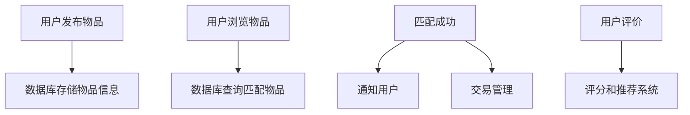
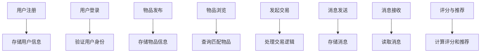
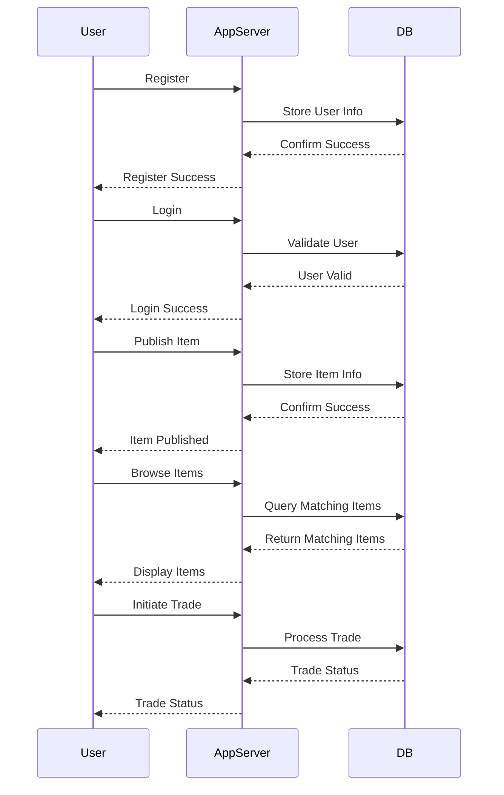

                 

### 引言

#### 后消费主义时代背景

在21世纪的科技浪潮下，全球经济发展模式正经历着深刻的变革。后消费主义作为一种新的经济理念，逐渐崭露头角。与传统消费主义强调消费和物质积累不同，后消费主义强调的是可持续性、共享受和资源的高效利用。这一理念的兴起，不仅是对环境问题的反思，更是对现代生活质量的追求。

#### 以物易物的全球交易市场的兴起

随着互联网技术的飞速发展，以物易物的交易方式正以前所未有的速度在全球范围内扩展。以物易物不仅是一种古老的经济活动，更是一种适应现代社会的创新交易模式。在这个市场中，人们不再依赖货币进行交易，而是通过直接交换所需物品来满足自己的需求。

后消费主义与以物易物的结合，不仅为消费者提供了一种全新的消费方式，也为商家和供应链带来了新的商业机会。在这个全球交易平台上，用户可以轻松地找到交换对象，实现物品的共享与循环利用。这种交易模式不仅降低了交易成本，还促进了社会的可持续发展和环境保护。

在这样的背景下，开发一款后消费主义集市app显得尤为重要。它不仅能够为全球用户提供便捷的以物易物服务，还能推动后消费主义理念的普及和实施。本文将围绕后消费主义集市app的设计与实现，逐步探讨其核心概念、系统架构、算法原理和实战应用，旨在为读者提供一份全面而深入的技术指南。

## 第一部分：后消费主义与以物易物

### 第1章 后消费主义概述

#### 1.1 后消费主义的核心概念

后消费主义，作为一个新兴的经济理论，主张在消费过程中强调资源的可持续利用、产品的长期价值以及消费者与生产者之间的直接互动。与传统的消费主义不同，后消费主义不仅关注消费行为本身，更强调消费行为背后的社会、经济和环境影响。其核心理念包括共享经济、循环经济、生态消费和社会公平。

#### 1.2 后消费主义的起源与发展

后消费主义的理念最早可以追溯到20世纪60年代的美国，当时随着经济发展和物质生活的丰富，人们开始反思过度消费带来的环境问题和资源浪费。然而，真正促使后消费主义成为主流观点的是21世纪初的全球金融危机和环境污染问题。这一时期，可持续发展和生态消费逐渐成为全球关注的焦点，后消费主义也逐渐从理论走向实践。

#### 1.3 后消费主义对社会的影响

后消费主义对社会的影响是多方面的。首先，它改变了人们的消费观念和生活方式，鼓励人们更多地关注产品的使用价值和生命周期，减少不必要的消费。其次，后消费主义推动了共享经济的发展，促进了资源共享和协同消费，从而降低了社会整体的生活成本。此外，后消费主义还强调社会公平，通过直接消费和交换，减少了贫富差距，增强了社会的凝聚力。

### 第2章 以物易物概述

#### 2.1 以物易物的历史与演变

以物易物是人类社会最早的交易方式之一。早在史前时期，人们就已经开始通过交换所需的物品来满足自己的需求。随着时间的推移，随着货币的出现和普及，以物易物逐渐被货币交易所取代。然而，在21世纪的今天，随着互联网技术的进步和可持续发展的需求，以物易物正重新焕发出生机。

#### 2.2 以物易物的优势与挑战

以物易物作为一种交易方式，具有许多独特的优势。首先，它能够减少货币的使用，降低交易成本。其次，以物易物鼓励物品的循环使用，减少资源浪费和环境污染。此外，以物易物还能够促进社区互助和社交互动，增强社会的团结和信任。

然而，以物易物也面临着一些挑战。例如，物品的价值评估难度较大，交换过程中的信用风险较高等。这些问题需要通过有效的制度设计和技术手段来解决，以促进以物易物市场的健康发展。

#### 2.3 以物易物在全球的应用现状

以物易物在全球范围内都有广泛应用，尤其是在发展中国家和社区经济中。例如，非洲的许多乡村地区，人们仍然广泛采用以物易物的方式进行交易。在欧洲和北美，随着共享经济的兴起，以物易物也得到了越来越多的关注和应用。

全球范围内的以物易物平台也在迅速发展。例如，Bartar和Tinkertown等平台，通过互联网技术，为全球用户提供便捷的以物易物服务。这些平台不仅促进了物品的循环利用，也为人们提供了一个新的消费选择。

### 第3章 以物易物的理论基础

#### 3.1 经济学视角下的以物易物

从经济学角度来看，以物易物是一种基于供需平衡的交易方式。在市场经济中，货币作为一般等价物，起到了连接不同商品之间价值交换的作用。而在以物易物中，物品本身直接作为价值交换的媒介，从而避免了货币中介环节，降低了交易成本。

以物易物还可以看作是一种非市场化的资源配置方式。通过直接交换，人们能够更加高效地满足自身的需求，同时也促进了资源的最大化利用。

#### 3.2 社会学视角下的以物易物

社会学视角下的以物易物，强调其作为社会互动和文化交流的一种形式。以物易物不仅是经济行为，更是一种社会行为。通过交换物品，人们不仅满足了物质需求，还促进了社会关系和文化的交流。

例如，在许多传统社区中，以物易物是维系社会关系和促进社区凝聚力的重要方式。通过以物易物，社区成员之间建立了信任和互助关系，增强了社区的稳定性。

#### 3.3 心理学视角下的以物易物

心理学视角下的以物易物，关注个体的心理需求和动机。研究表明，以物易物能够满足个体的多种心理需求，包括归属感、控制感和成就感。

首先，以物易物能够满足个体的归属感需求。通过参与交换活动，个体能够感受到自己是社区或团体的一部分，从而增强归属感。

其次，以物易物能够满足个体的控制感需求。在以物易物中，个体能够自主决定交换的物品和对象，从而获得更多的控制感和自主性。

最后，以物易物能够满足个体的成就感需求。通过成功的交换，个体能够获得成就感和满足感，从而提升自信心和自尊心。

## 第二部分：后消费主义集市app设计

### 第4章 app设计的核心概念

#### 4.1 app设计的用户体验

用户体验（UX）设计是后消费主义集市app设计的核心之一。一个成功的app需要提供简洁、直观且易于使用的界面，使用户能够轻松完成以物易物的所有操作。以下是一些关键的UX设计原则：

1. **简洁性**：界面应简洁明了，避免过度设计，让用户能够快速找到所需功能。
2. **一致性**：整个app的界面风格和交互元素应保持一致性，使用户在使用过程中不会感到困惑。
3. **可访问性**：app应考虑到不同用户的需求，包括视觉障碍者和老年人，提供必要的辅助功能。
4. **响应式设计**：app应适应不同尺寸的屏幕，确保在手机、平板和电脑上都有良好的显示效果。

#### 4.2 app设计的技术挑战

后消费主义集市app的设计面临着一系列技术挑战，包括但不限于以下几点：

1. **数据同步与一致性**：由于用户可能在世界各地进行交换，如何确保数据同步并保持一致性是一个关键问题。
2. **隐私保护**：用户在进行以物易物时，可能会涉及个人隐私，如何保护用户的隐私是一个重要的技术挑战。
3. **安全性**：app需要提供高安全性的解决方案，以防止恶意攻击和数据泄露。
4. **高并发处理**：随着用户数量的增加，app需要能够处理高并发请求，确保用户体验。

#### 4.3 app设计的商业模式

后消费主义集市app的商业模式可以分为以下几个方面：

1. **免费增值**：app本身提供免费服务，但通过提供高级功能或增值服务来吸引用户付费。
2. **广告收入**：app可以通过展示广告来获取收入，尤其是针对特定商品的广告。
3. **佣金收入**：对于一些高端的交换物品，app可以收取一定的佣金。
4. **平台合作伙伴**：与品牌和商家合作，通过推广活动来增加用户参与度和平台收入。

### 第5章 app的系统架构设计

#### 5.1 app的功能需求分析

后消费主义集市app的主要功能包括：

1. **用户注册与登录**：用户可以通过手机号、邮箱或社交媒体账号进行注册和登录。
2. **物品发布与浏览**：用户可以发布自己愿意交换的物品，并浏览其他用户的物品。
3. **消息系统**：用户可以通过消息系统与潜在的交换对象进行沟通。
4. **交易管理**：用户可以查看交易状态，处理交易纠纷等。
5. **个人信息管理**：用户可以管理自己的个人信息，包括头像、联系方式等。

#### 5.2 app的技术架构设计

后消费主义集市app的技术架构可以分为以下几个部分：

1. **前端**：采用React或Vue等现代前端框架，确保用户界面的响应性和交互性。
2. **后端**：使用Node.js或Spring Boot等后端框架，提供API接口，处理业务逻辑和数据存储。
3. **数据库**：使用MongoDB或MySQL等数据库，存储用户数据、物品信息和交易记录。
4. **缓存**：使用Redis等缓存技术，提高系统的响应速度。
5. **消息队列**：使用RabbitMQ或Kafka等消息队列，处理消息通知和异步任务。

#### 5.3 app的数据架构设计

后消费主义集市app的数据架构设计需要考虑以下几个方面：

1. **用户数据**：包括用户的基本信息、头像、联系方式等。
2. **物品数据**：包括物品的名称、描述、图片、标签、当前持有者、可交换对象等。
3. **交易数据**：包括交易双方、物品、交易时间、交易状态等。
4. **消息数据**：包括发送方、接收方、消息内容、发送时间等。

为了确保数据的完整性和一致性，可以使用数据库的事务机制和消息队列的分布式事务解决方案。

### 第6章 app的算法与数据模型

#### 6.1 app的核心算法原理

后消费主义集市app的核心算法主要涉及以下几个方面：

1. **物品匹配算法**：用于匹配用户的交换需求和可交换对象，确保交换的成功率和效率。
2. **评分和推荐算法**：根据用户的交易记录和行为，为用户提供评分和推荐，提高用户满意度。
3. **隐私保护算法**：通过加密和匿名化技术，保护用户的隐私信息。
4. **异常检测算法**：用于检测和预防欺诈行为，确保平台的诚信和安全性。

#### 6.2 app的算法mermaid流程图

以下是物品匹配算法的mermaid流程图：



#### 6.3 app的数学模型与公式

以下是物品匹配算法的数学模型与公式：

1. **物品相似度计算公式**：

$$
similarity(A, B) = \frac{Jaccard相似度}{(1 + |A - B|)}
$$

其中，$Jaccard相似度$用于计算两个集合的相似度，$|A - B|$表示集合$A$和$B$的差异度。

2. **评分计算公式**：

$$
score(u, v) = \frac{5 \times num\_positive \times num\_neutral}{3 \times num\_positive + 2 \times num\_neutral + num\_negative}
$$

其中，$u$和$v$表示用户之间的评分，$num\_positive$、$num\_neutral$和$num\_negative$分别表示正评、中评和负评的数量。

#### 6.4 算法原理讲解

物品匹配算法的核心目标是找到与用户需求最匹配的物品。首先，用户在发布物品时，系统会将物品的信息存储在数据库中。当用户浏览物品时，系统会根据用户的需求和物品的特征，通过计算相似度来匹配合适的物品。匹配成功后，系统会通知用户，并进入交易管理环节。

评分和推荐算法则基于用户的交易记录和行为，为用户提供评分和推荐。通过计算用户的评分和交易记录，系统能够为用户提供一个准确的评分，并基于评分和用户行为推荐相似的物品。

隐私保护算法则通过加密和匿名化技术，确保用户的隐私信息不被泄露。异常检测算法则用于检测和预防欺诈行为，确保平台的诚信和安全性。

### 第7章 全球交易平台的技术实现

#### 7.1 全球交易平台的技术架构

全球交易平台的技术架构设计需要考虑可扩展性、高可用性和安全性。以下是一个简化的全球交易平台技术架构：

1. **前端**：使用React或Vue.js等前端框架，通过Web和移动端应用提供用户界面。
2. **后端**：采用Spring Boot或Django等后端框架，处理业务逻辑，提供RESTful API。
3. **数据库**：使用MongoDB或MySQL等数据库，存储用户数据、物品信息和交易记录。
4. **缓存**：使用Redis等缓存技术，提高数据读取速度。
5. **消息队列**：使用RabbitMQ或Kafka等消息队列，处理异步任务和消息通知。
6. **区块链**：引入区块链技术，确保交易数据的不可篡改性和透明性。
7. **负载均衡**：使用Nginx或HAProxy等负载均衡器，处理高并发请求。

#### 7.2 全球交易平台的接口设计与交互

全球交易平台需要设计一套完善的接口，以支持用户的各种操作。以下是一些关键接口：

1. **用户注册与登录**：用户可以通过手机号、邮箱或社交媒体账号注册和登录。
2. **物品发布与浏览**：用户可以发布和浏览其他用户的物品。
3. **交易管理**：用户可以发起交易、查看交易状态、处理交易纠纷。
4. **消息系统**：用户可以发送和接收消息，与交易对象进行沟通。
5. **评分与推荐**：根据用户的交易记录，系统会自动为用户推荐匹配的物品。
6. **支付系统**：集成第三方支付系统，支持多种支付方式。

以下是一个简化的接口设计示例：



#### 7.3 全球交易平台的序列图设计

以下是全球交易平台的一个简化序列图设计：



通过这个序列图，我们可以看到用户与平台之间的交互流程，包括注册、登录、物品发布、物品浏览和交易管理等关键操作。

## 第三部分：app项目的实战

### 第8章 app项目的实战

#### 8.1 app环境安装与配置

在进行后消费主义集市app的开发之前，我们需要先搭建一个完整的开发环境。以下是安装和配置步骤：

1. **安装Node.js和npm**：Node.js是一个基于Chrome V8引擎的JavaScript运行环境，npm是Node.js的包管理器。可以通过官方网站下载安装包进行安装。

2. **安装React或Vue.js**：选择一个前端框架，通过npm安装相关依赖。

3. **安装Spring Boot或Django**：选择一个后端框架，通过pip或npm安装相关依赖。

4. **安装数据库（如MongoDB或MySQL）**：安装并配置数据库，确保能够正常运行。

5. **安装Redis**：安装并配置Redis，用于缓存和消息队列。

6. **安装负载均衡器（如Nginx或HAProxy）**：安装并配置负载均衡器，用于处理高并发请求。

#### 8.2 app核心功能实现

后消费主义集市app的核心功能包括用户注册与登录、物品发布与浏览、交易管理、消息系统、评分与推荐等。以下是每个功能的实现步骤：

1. **用户注册与登录**：实现用户注册和登录功能，包括前端表单验证、后端身份验证和数据库存储。

2. **物品发布与浏览**：实现用户发布物品和浏览其他用户物品的功能，包括前端展示和后端数据存储。

3. **交易管理**：实现用户发起交易、查看交易状态和处理交易纠纷的功能，包括交易逻辑处理、状态更新和数据存储。

4. **消息系统**：实现用户发送和接收消息的功能，包括前端消息界面和后端消息存储与通知。

5. **评分与推荐**：实现用户评分和推荐功能，包括评分计算、推荐算法实现和数据存储。

以下是每个功能的Python源代码示例：

```python
# 用户注册
@app.route('/register', methods=['POST'])
def register():
    # 获取用户输入的信息
    username = request.form['username']
    password = request.form['password']
    
    # 验证用户信息
    if not validate_username(username) or not validate_password(password):
        return jsonify({'error': 'Invalid input'})
    
    # 存储用户信息到数据库
    db.register_user(username, password)
    
    return jsonify({'message': 'User registered successfully'})

# 物品发布
@app.route('/publish_item', methods=['POST'])
def publish_item():
    # 获取用户输入的信息
    user_id = request.form['user_id']
    item_name = request.form['item_name']
    item_description = request.form['item_description']
    
    # 存储物品信息到数据库
    db.publish_item(user_id, item_name, item_description)
    
    return jsonify({'message': 'Item published successfully'})

# 交易管理
@app.route('/initiate_trade', methods=['POST'])
def initiate_trade():
    # 获取用户输入的信息
    buyer_id = request.form['buyer_id']
    seller_id = request.form['seller_id']
    item_id = request.form['item_id']
    
    # 处理交易逻辑
    trade_id = db.initiate_trade(buyer_id, seller_id, item_id)
    
    return jsonify({'trade_id': trade_id, 'message': 'Trade initiated successfully'})

# 消息系统
@app.route('/send_message', methods=['POST'])
def send_message():
    # 获取用户输入的信息
    sender_id = request.form['sender_id']
    receiver_id = request.form['receiver_id']
    message = request.form['message']
    
    # 存储消息到数据库
    db.send_message(sender_id, receiver_id, message)
    
    return jsonify({'message': 'Message sent successfully'})

# 评分与推荐
@app.route('/rate_user', methods=['POST'])
def rate_user():
    # 获取用户输入的信息
    rater_id = request.form['rater_id']
    rated_id = request.form['rated_id']
    rating = request.form['rating']
    
    # 计算评分
    score = db.rate_user(rater_id, rated_id, rating)
    
    # 更新推荐列表
    db.update_recommendations(rated_id)
    
    return jsonify({'score': score, 'message': 'User rated successfully'})
```

#### 8.3 app代码应用解读与分析

在实现后消费主义集市app的过程中，我们使用了Python作为后端开发语言，结合Flask框架进行开发。以下是每个功能的具体解读：

1. **用户注册与登录**：用户注册时，我们首先验证用户名和密码的合法性。然后，将用户信息存储到数据库中。在登录时，我们验证用户名和密码，返回用户ID。

2. **物品发布与浏览**：用户发布物品时，我们获取物品的名称和描述，并存储到数据库中。在浏览物品时，我们从数据库中查询匹配的物品，并返回给用户。

3. **交易管理**：用户发起交易时，我们获取买家、卖家和物品的ID，处理交易逻辑，并将交易信息存储到数据库中。在交易管理中，用户可以查看交易状态和处理交易纠纷。

4. **消息系统**：用户发送消息时，我们获取发送者、接收者和消息内容，并存储到数据库中。在消息系统中，用户可以发送和接收消息。

5. **评分与推荐**：用户评分时，我们获取评分者和被评分者的ID和评分值，计算评分，并更新推荐列表。

#### 8.4 实际案例分析和详细讲解剖析

以下是一个实际案例分析和详细讲解：

**案例**：用户A想要交换一件旧衣服，用户B有一本有用的技术书籍。他们通过后消费主义集市app进行物品交换。

**分析**：

1. **物品发布**：用户A在app上发布了一件旧衣服，描述了衣服的型号、尺码和状况。用户B发布了一本技术书籍，描述了书籍的名称、作者和版本。

2. **物品浏览**：用户B在app上浏览物品时，发现了用户A发布的旧衣服，觉得可以交换。用户A也在浏览物品时发现了用户B发布的技术书籍，也觉得可以交换。

3. **交易管理**：用户A和用户B通过消息系统沟通，确定了交换的时间和地点。他们通过app发起了交易，系统生成了一个交易ID。

4. **交易执行**：用户A在约定的时间和地点将旧衣服交给用户B，用户B将技术书籍交给用户A。

5. **评分与推荐**：交易完成后，用户A和用户B都可以对对方进行评分。用户A给用户B打了5星好评，用户B也给了用户A5星好评。系统根据评分更新了用户A和用户B的推荐列表。

**讲解**：

在这个案例中，用户A和用户B通过后消费主义集市app实现了物品的交换。首先，他们在app上发布了各自的物品，然后通过浏览和沟通找到了合适的交换对象。在交易管理中，他们通过消息系统确定了交易细节，并通过app发起了交易。交易完成后，他们对对方进行了评分，系统根据评分更新了推荐列表。

通过这个案例，我们可以看到后消费主义集市app如何实现物品交换，提高资源利用效率，促进社区互动和可持续发展。

### 第9章 app开发最佳实践

#### 9.1 app开发中的常见问题与解决方案

在后消费主义集市app的开发过程中，可能会遇到以下一些常见问题：

1. **性能瓶颈**：随着用户数量的增加，系统的性能可能会成为瓶颈。解决方案包括优化数据库查询、使用缓存和消息队列、分布式架构等。

2. **数据同步**：全球范围内的用户交换，需要解决数据同步的一致性问题。解决方案包括分布式数据库、消息队列和分布式事务等。

3. **安全性**：保护用户的隐私和安全是app开发的重要方面。解决方案包括加密传输、用户认证和权限控制、异常检测等。

4. **用户体验**：确保app的界面简洁、易用，提高用户的满意度。解决方案包括用户体验测试、反馈收集和迭代改进等。

#### 9.2 app维护与升级策略

为了确保后消费主义集市app的长期稳定运行，需要制定有效的维护与升级策略：

1. **定期备份**：定期备份数据库，防止数据丢失。

2. **版本控制**：使用版本控制系统（如Git），确保代码的版本控制和协作开发。

3. **自动化测试**：编写自动化测试脚本，确保每次升级都不会引入新的错误。

4. **迭代更新**：根据用户反馈和市场需求，定期发布新功能和修复已知问题。

5. **监控系统**：使用监控工具（如Prometheus、Grafana），实时监控系统性能和健康状况。

#### 9.3 app性能优化技巧

为了提高后消费主义集市app的性能，可以采用以下优化技巧：

1. **数据库优化**：使用索引、分库分表、读写分离等技术，提高数据库查询速度。

2. **缓存策略**：合理使用Redis等缓存技术，减少数据库访问。

3. **静态资源优化**：压缩、合并和缓存静态资源，减少加载时间。

4. **异步处理**：使用消息队列和异步处理，提高系统响应速度。

5. **负载均衡**：使用Nginx或HAProxy等负载均衡器，分散流量，提高系统的可扩展性。

### 第10章 总结与展望

#### 10.1 后消费主义集市app的发展趋势

随着全球可持续发展意识的增强，后消费主义集市app有望在未来得到更广泛的应用和发展。以下是一些可能的发展趋势：

1. **全球化扩展**：通过国际化运营，将后消费主义集市app推广到全球更多国家和地区。

2. **技术创新**：利用人工智能、区块链等新技术，提高app的性能和安全性。

3. **多元化应用**：除了物品交换，后消费主义集市app还可以扩展到二手商品交易、租赁服务等领域。

4. **生态构建**：建立完善的生态体系，包括商家、第三方服务提供商和社区参与者等，促进app的长期健康发展。

#### 10.2 后消费主义集市app的未来展望

后消费主义集市app的未来充满潜力。以下是一些展望：

1. **社会影响力**：通过促进物品的循环利用和资源共享，后消费主义集市app有望成为推动可持续发展和环境保护的重要力量。

2. **商业模式创新**：探索新的商业模式，如基于积分的交换机制、增值服务收费等，提高app的盈利能力。

3. **用户体验优化**：持续优化用户体验，提高用户满意度和参与度，增强app的市场竞争力。

4. **社区互动**：通过社区互动和用户参与，打造一个充满活力和信任的生态系统，为用户创造更多的价值。

#### 10.3 拓展阅读与资源推荐

为了更深入地了解后消费主义集市app的设计与实现，读者可以参考以下拓展阅读和资源：

1. **书籍**：
   - 《后消费主义：可持续发展的消费模式》
   - 《区块链技术指南》
   - 《人工智能：一种现代方法》

2. **在线课程**：
   - Coursera上的《区块链技术与应用》
   - Udemy上的《React.js入门到精通》
   - Pluralsight上的《Django Web开发基础》

3. **技术博客**：
   - Medium上的后消费主义和区块链技术相关文章
   - Stack Overflow上的技术问答
   - GitHub上的后消费主义集市app开源项目

通过这些资源，读者可以进一步深入了解后消费主义集市app的技术原理和实现细节，为开发自己的项目提供灵感和支持。

