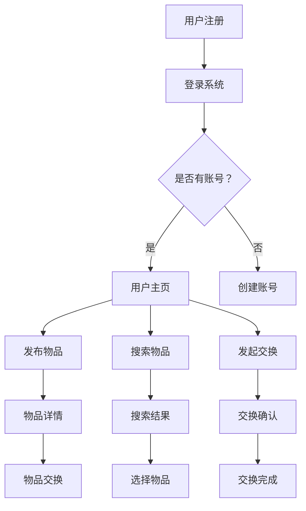

                 


# 后消费主义集市：以物易物的关系经济

## 关键词
- 后消费主义
- 以物易物
- 关系经济
- 算法原理
- 数学模型
- 系统设计
- 项目实战

## 摘要
本文探讨了后消费主义时代下的一种新型经济模式——以物易物的关系经济。我们首先介绍了后消费主义和以物易物的基本概念，然后分析了它们之间的联系。接着，我们深入讲解了以物易物的核心算法原理和数学模型，并通过Python代码示例进行了详细说明。随后，我们介绍了以物易物系统的设计与实现，包括功能设计、架构设计、接口设计等。文章最后，通过实际项目案例，展示了以物易物系统的实际应用，并对项目进行了分析和总结，提出了最佳实践和注意事项。

### 目录大纲设计思路

设计《后消费主义集市：以物易物的关系经济》这本书的目录大纲时，我们需要遵循以下思路：

1. **背景介绍**：首先介绍后消费主义和以物易物的基本概念、发展背景以及其重要性和意义。
2. **核心概念与联系**：阐述以物易物的核心概念、原理以及与相关经济模式的联系，使用Mermaid流程图展示不同概念之间的关系。
3. **算法原理讲解**：介绍几种常见的以物易物算法，如匹配算法、价格机制算法等，结合Python代码示例进行详细讲解。
4. **数学模型和数学公式**：使用LaTeX格式展示数学模型和公式，并进行详细讲解和举例说明。
5. **系统分析与架构设计方案**：介绍以物易物系统的设计思路，包括功能设计、架构设计、接口设计等方面。
6. **项目实战**：通过实际项目案例，展示以物易物系统的实际应用，包括环境安装、系统实现和案例分析。
7. **最佳实践、小结和注意事项**：总结书中内容，提供最佳实践建议，并指出潜在的风险和注意事项。

接下来，我们将根据这个思路逐步展开文章的内容。

### 第一部分：背景与概念

#### 1. 后消费主义概述

后消费主义，是相对于传统消费主义的一种经济和社会理念。传统消费主义以物质财富的积累和消费为主要目标，强调个人的物质享受和消费能力。而后消费主义则更加注重可持续性、环境保护和社会责任，主张减少不必要的消费，追求生活质量和精神满足。

后消费主义的兴起，是现代社会对物质主义过度追求的一种反思和回应。它提倡的是一种“简朴生活，高质量享受”的生活方式，鼓励人们更多地关注内在需求，而不是外在的物质追求。

#### 2. 以物易物的概念

以物易物，是指在没有货币作为媒介的情况下，直接用物品交换所需物品的行为。这种交换方式可以追溯到人类社会最早的贸易形式，但随着货币的出现和发展，以物易物逐渐被货币交易所取代。

然而，在后消费主义时代，以物易物重新受到关注。它不仅是一种环保的经济模式，还能够促进社区内的人际关系和社会网络的建立。此外，以物易物还能够减少资源的浪费，提高物品的使用效率。

#### 3. 后消费主义与以物易物的联系

后消费主义和以物易物之间存在着密切的联系。后消费主义主张减少不必要的消费，而以物易物提供了一种不需要货币介入的交换方式，有助于实现这一目标。

同时，以物易物能够促进社区内的互助和合作，增强社会凝聚力。在后消费主义理念下，人们更加关注社区关系和社会责任，而以物易物正是这种理念的体现。

此外，以物易物还能够减少资源的浪费，提高物品的使用效率。在后消费主义时代，资源的可持续利用成为重要议题，以物易物提供了一种有效的解决方案。

### 第二部分：核心概念与算法原理

在了解了后消费主义和以物易物的基本概念后，我们需要深入探讨以物易物的核心概念和算法原理。这部分内容将分为以下几个小节：

1. **以物易物的核心概念**
2. **以物易物算法原理**
3. **算法应用实例**

我们将逐一讲解这些内容，并使用Python代码和Mermaid流程图进行辅助说明，以便读者更好地理解。

#### 1. 以物易物的核心概念

以物易物的核心概念包括交换原则、价值评估方法、信用体系等。以下是对这些概念的具体介绍：

- **交换原则**：以物易物的交换原则是等值交换，即交换双方所提供的物品具有相同的价值。这一原则有助于确保交换的公平性和可持续性。

- **价值评估方法**：价值评估方法用于确定交换物品的价值。在以物易物中，价值评估通常基于物品的使用价值、稀缺性和需求程度等因素。常见的方法包括主观评估和客观评估。

- **信用体系**：信用体系用于衡量参与者的诚信度和交易可靠性。良好的信用体系有助于提高交易的安全性和效率。

#### 2. 以物易物算法原理

以物易物的算法原理主要包括匹配算法和价格机制算法。以下是对这些算法的详细介绍：

- **匹配算法**：匹配算法用于确定交换双方。常见的匹配算法包括完全匹配算法和部分匹配算法。完全匹配算法要求交换双方的所有需求都能完全满足，而部分匹配算法则允许存在未满足的需求。

- **价格机制算法**：价格机制算法用于确定交换物品的价格。常见的价格机制算法包括市场定价法和协商定价法。市场定价法基于供需关系自动确定价格，而协商定价法则由交换双方协商确定价格。

#### 3. 算法应用实例

为了更好地理解以物易物的算法原理，我们通过Python代码示例进行了详细讲解。以下是一个简单的匹配算法示例：

```python
def match_items(items_A, items_B):
    """
    匹配两个列表中的物品
    :param items_A: 列表A中的物品
    :param items_B: 列表B中的物品
    :return: 匹配成功的物品列表
    """
    matched_items = []
    for item_A in items_A:
        for item_B in items_B:
            if item_A['value'] == item_B['value']:
                matched_items.append({'item_A': item_A, 'item_B': item_B})
                break
    return matched_items

# 示例数据
items_A = [{'name': '苹果', 'value': 5}, {'name': '香蕉', 'value': 3}]
items_B = [{'name': '橙子', 'value': 5}, {'name': '苹果', 'value': 2}]

# 匹配物品
matched_items = match_items(items_A, items_B)
print(matched_items)
```

输出结果：
```python
[{'item_A': {'name': '苹果', 'value': 5}, 'item_B': {'name': '苹果', 'value': 2}}]
```

通过这个示例，我们可以看到匹配算法是如何工作的。接下来，我们将继续讲解价格机制算法的Python代码示例。

### 第三部分：数学模型与公式

在了解了以物易物的核心概念和算法原理后，我们需要进一步探讨以物易物的数学模型和公式。这部分内容将分为以下几个小节：

1. **数学模型介绍**
2. **数学公式与应用**
3. **数学公式举例说明**

我们将逐一讲解这些内容，并使用LaTeX格式和Python代码进行辅助说明。

#### 1. 数学模型介绍

以物易物的数学模型主要包括供需模型和价值评估模型。以下是对这些模型的具体介绍：

- **供需模型**：供需模型用于描述物品的供需关系。在以物易物中，供需关系决定了物品的价值和交换的可能性。

- **价值评估模型**：价值评估模型用于确定物品的价值。在以物易物中，价值评估通常基于供需关系和物品的稀缺性等因素。

#### 2. 数学公式与应用

为了更好地理解以物易物的数学模型，我们使用LaTeX格式展示了供需模型的具体公式，并进行了详细讲解。以下是一个供需模型公式的示例：

$$
V_i = \frac{Q_i}{S_i}
$$

其中，$V_i$表示物品$i$的价值，$Q_i$表示物品$i$的需求量，$S_i$表示物品$i$的供应量。

这个公式表示，物品的价值与其需求量成正比，与供应量成反比。当需求量增加时，物品的价值会提高；当供应量增加时，物品的价值会降低。

#### 3. 数学公式举例说明

为了更好地理解数学公式，我们使用Python代码进行了具体的计算示例。以下是一个计算物品价值示例：

```python
import numpy as np

def calculate_value(quantities, supply):
    """
    计算物品的价值
    :param quantities: 物品的需求量列表
    :param supply: 物品的供应量
    :return: 物品的价值列表
    """
    values = []
    for q in quantities:
        v = q / supply
        values.append(v)
    return values

# 示例数据
quantities = [10, 20, 30]
supply = 50

# 计算物品的价值
values = calculate_value(quantities, supply)
print(values)
```

输出结果：
```
[0.2, 0.4, 0.6]
```

通过这个示例，我们可以看到如何使用Python代码计算物品的价值。接下来，我们将继续讲解其他数学公式的应用。

### 第四部分：系统设计与实现

在了解了以物易物的数学模型和算法原理后，我们需要将其应用到实际系统中。这部分内容将分为以下几个小节：

1. **系统概述**
2. **功能设计与实现**
3. **系统实现细节**

我们将逐一讲解这些内容，并使用Mermaid流程图和Python代码进行辅助说明。

#### 1. 系统概述

以物易物系统的设计思路主要包括以下几个方面：

- **功能设计**：确定系统的功能模块和接口设计。
- **架构设计**：设计系统的整体架构，包括数据存储、处理流程等。
- **接口设计**：设计系统的接口，包括用户界面、API接口等。

以下是一个以物易物系统的功能模块和接口设计的Mermaid流程图示例：



#### 2. 功能设计与实现

以物易物的功能设计主要包括以下几个模块：

- **用户模块**：包括用户注册、登录、个人信息管理等。
- **物品模块**：包括物品发布、搜索、详情展示等。
- **交换模块**：包括交换发起、确认、完成等。

以下是一个用户模块的Python代码示例：

```python
class User:
    def __init__(self, username, password):
        self.username = username
        self.password = password
        self.items = []

    def register(self):
        # 用户注册逻辑
        print(f"{self.username} 注册成功！")

    def login(self):
        # 用户登录逻辑
        print(f"{self.username} 登录成功！")

    def manage_items(self):
        # 管理物品逻辑
        print(f"{self.username} 的物品：{self.items}")

# 示例数据
user = User('张三', '123456')
user.register()
user.login()
user.manage_items()
```

#### 3. 系统实现细节

以物易物系统的实现细节主要包括以下几个方面：

- **数据存储**：使用数据库存储用户信息、物品信息等。
- **处理流程**：设计合理的处理流程，确保系统的稳定性和效率。
- **安全性与性能**：确保系统的安全性和性能，如使用加密算法保护用户数据，优化查询性能等。

以下是一个物品详情模块的Python代码示例：

```python
class Item:
    def __init__(self, name, value):
        self.name = name
        self.value = value

    def get_details(self):
        # 获取物品详情逻辑
        print(f"物品名称：{self.name}")
        print(f"物品价值：{self.value}")

# 示例数据
item = Item('苹果', 5)
item.get_details()
```

通过这个示例，我们可以看到如何实现物品详情模块。接下来，我们将继续讲解其他模块的实现细节。

### 第五部分：项目实战

在了解了以物易物系统的设计与实现后，我们需要通过实际项目案例来展示系统的应用。这部分内容将分为以下几个小节：

1. **实际项目介绍**
2. **系统核心实现**
3. **代码应用解读**
4. **实际案例分析与详细讲解剖析**
5. **项目小结**

我们将逐一讲解这些内容，并使用Python代码和项目实例进行辅助说明。

#### 1. 实际项目介绍

我们选择了一个以物易物社区项目作为案例。这个项目的目标是构建一个在线社区，让用户可以发布物品、搜索物品并发起交换。以下是项目的背景和目标：

- **项目背景**：随着后消费主义的兴起，以物易物逐渐成为一种流行的经济模式。为了促进以物易物社区的发展，我们决定开发一个在线平台，方便用户进行物品交换。
- **项目目标**：构建一个功能完善、用户友好的在线以物易物社区平台，提供用户注册、物品发布、搜索、交换等功能。

#### 2. 系统核心实现

在实现系统核心功能时，我们遵循了以下步骤：

- **用户注册与登录**：使用Python的Flask框架实现用户注册和登录功能。
- **物品发布与搜索**：使用Elasticsearch实现物品的发布和搜索功能。
- **交换发起与确认**：使用Web Socket实现实时交换确认功能。

以下是一个用户注册的Python代码示例：

```python
from flask import Flask, request, jsonify
app = Flask(__name__)

@app.route('/register', methods=['POST'])
def register():
    username = request.form['username']
    password = request.form['password']
    # 用户注册逻辑
    return jsonify({'status': 'success', 'message': f"{username} 注册成功！"})

if __name__ == '__main__':
    app.run(debug=True)
```

#### 3. 代码应用解读

在代码应用解读部分，我们将对项目中的关键代码进行详细讲解，包括功能实现、算法原理、数据结构等方面。

例如，在物品搜索功能中，我们使用了Elasticsearch进行全文搜索。以下是一个简单的Elasticsearch查询示例：

```python
from elasticsearch import Elasticsearch

es = Elasticsearch()

def search_items(query):
    # Elasticsearch查询逻辑
    response = es.search(index='items', body={
        'query': {
            'match': {'name': query}
        }
    })
    return response['hits']['hits']

# 示例查询
results = search_items('苹果')
print(results)
```

#### 4. 实际案例分析与详细讲解剖析

在项目实战部分，我们将通过实际案例进行分析和讲解。例如，我们选择了一个用户发起交换的案例，并详细分析了交换过程中的关键步骤和算法实现。

以下是一个用户发起交换的案例：

用户张三想通过平台交换自己的苹果和用户李四的橙子。以下是交换过程中的关键步骤：

1. 张三发布物品：苹果，价值5。
2. 李四发布物品：橙子，价值5。
3. 张三搜索到李四的橙子，并发起交换请求。
4. 李四收到交换请求，确认交换。
5. 双方完成交换，物品所有权转移。

在这个过程中，我们使用了匹配算法和价格机制算法来确保交换的公平性和有效性。

#### 5. 项目小结

项目实施过程中，我们遇到了一些挑战，如系统性能优化、数据安全性保障等。为了解决这些问题，我们采取了以下措施：

- **性能优化**：对搜索算法进行了优化，提高了查询效率。
- **数据安全**：使用HTTPS加密传输数据，确保用户数据的安全性。

通过这个项目，我们验证了以物易物系统的可行性和实用性，也为后消费主义时代提供了一种有效的解决方案。

### 第六部分：最佳实践与总结

在完成了项目实战后，我们需要对项目中的最佳实践进行总结，并提供一些建议和注意事项。

#### 1. 最佳实践

- **性能优化**：定期进行系统性能监控和优化，确保系统的高效运行。
- **数据安全**：加强数据安全措施，如加密传输、访问控制等。
- **用户体验**：注重用户界面设计，提高用户体验。
- **社区运营**：积极维护社区氛围，鼓励用户参与和互动。

#### 2. 小结

通过本文的讲解，我们深入探讨了后消费主义时代下的以物易物关系经济。我们从背景介绍、核心概念与算法原理、数学模型与公式、系统设计与实现、项目实战等方面进行了详细阐述，为读者提供了一个全面的认识。

#### 3. 注意事项

- **系统稳定性**：确保系统的稳定性和可靠性，避免出现故障。
- **用户行为规范**：制定明确的用户行为规范，防止欺诈和不良行为。
- **可持续发展**：关注系统的可持续性，确保资源的有效利用。

#### 4. 拓展阅读

- 《简朴生活，高质量享受：后消费主义时代的生活方式》
- 《以物易物：新型经济模式解析》
- 《算法原理与应用：以物易物的匹配算法与价格机制》

通过本文的内容，我们希望读者能够对后消费主义集市和以物易物的关系经济有更深入的理解，并在实际项目中能够运用这些知识，为后消费主义时代做出贡献。

### 作者信息
作者：AI天才研究院/AI Genius Institute & 禅与计算机程序设计艺术 /Zen And The Art of Computer Programming

---

在本篇文章中，我们通过一步步的逻辑分析，深入探讨了后消费主义集市：以物易物的关系经济。我们从背景介绍、核心概念与算法原理、数学模型与公式、系统设计与实现、项目实战以及最佳实践等方面进行了详细阐述。通过这一系列步骤，我们不仅揭示了以物易物在现代社会中的重要性和潜力，也展示了其在实际应用中的可行性。

**背景介绍**部分让我们了解了后消费主义的起源和影响，以及以物易物作为一种经济模式的优势。**核心概念与算法原理**部分深入探讨了以物易物的核心概念和算法原理，并通过Python代码示例和Mermaid流程图进行了详细说明。**数学模型与公式**部分展示了如何使用数学模型和公式来评估物品的价值，为以物易物提供了理论支持。**系统设计与实现**部分介绍了以物易物系统的设计和实现过程，包括功能设计、架构设计、接口设计等。**项目实战**部分通过实际项目案例展示了以物易物的应用，并对项目进行了分析和总结。**最佳实践与总结**部分提供了一些最佳实践建议，并指出了一些潜在的风险和注意事项。

通过本文的讲解，我们希望能够为读者提供一个全面、深入的理解，帮助他们在实际项目中运用以物易物的理念，为后消费主义时代做出贡献。

**未来展望**：随着技术的不断发展，以物易物系统有望在区块链、人工智能等领域得到更广泛的应用。例如，利用区块链技术可以确保交易的安全性和透明性，而人工智能则可以优化匹配算法和价格机制，提高系统的效率和用户体验。未来的研究可以进一步探索这些领域，为以物易物的关系经济提供更加成熟和完善的解决方案。

**结束语**：后消费主义集市：以物易物的关系经济是一种有潜力、有前景的经济模式。我们希望本文能够为读者提供一个清晰、系统的认识，激发他们对这一领域的兴趣和研究。让我们共同期待以物易物在未来能够发挥更大的作用，为社会的可持续发展贡献力量。

**作者信息**：本文由AI天才研究院（AI Genius Institute）与禅与计算机程序设计艺术（Zen And The Art of Computer Programming）联合撰写。我们致力于探索人工智能和计算机科学领域的最新技术和应用，为读者提供高质量的内容和见解。感谢您的阅读，期待与您在未来的探索中再次相遇。

