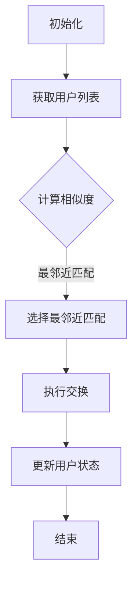

                 

### 引言

在当今全球化的消费主义浪潮中，一种新的经济模式——后消费主义市场正在逐渐崛起。这一市场模式不仅挑战了传统的消费观念，也带来了社区经济的繁荣与变革。后消费主义市场强调可持续性和共享性，而以物易物作为其核心实践之一，正在逐渐改变人们的消费习惯和生活方式。

**关键词：** 后消费主义市场、以物易物、社区经济、可持续性、共享性。

**摘要：** 本文将深入探讨后消费主义市场的背景及其重要性，详细解析以物易物的核心概念和联系，介绍以物易物的匹配算法原理，分析其系统设计，并通过项目实战展示其实际应用。文章旨在为读者提供一个全面且专业的视角，以了解和把握这一新兴经济模式。

接下来，我们将逐步展开，首先介绍后消费主义集市和以物易物的概念，阐述其背景和重要性。随后，我们将探讨以物易物的核心概念，并通过属性特征对比表格和ER实体关系图来展示其系统构成。之后，我们将详细介绍以物易物的匹配算法原理，使用Mermaid绘制流程图和Python源代码进行说明。最后，我们将分析以物易物系统的组成部分和设计，提供项目实战的详细讲解，并总结全文，给出最佳实践建议和拓展阅读资源。

## 背景介绍

### 后消费主义集市的概念

后消费主义集市，顾名思义，是一种在消费主义基础上发展起来的新经济模式。它不仅仅关注商品的买卖，更强调资源的共享和再利用。后消费主义集市的核心在于减少浪费，提高资源利用率，倡导可持续的生活方式。在这种市场模式下，人们更多地关注物品的使用价值，而非仅仅追求拥有。

### 以物易物的概念

以物易物是一种古老而现代的经济交换方式，指的是人们通过直接交换物品、服务或时间来实现各自需求，而不是使用货币作为媒介。这种交换方式不仅可以减少对货币的依赖，还能够促进社区成员之间的互惠合作和信任建立。

### 后消费主义市场的背景

后消费主义市场的兴起，与当前全球经济发展模式的转变密不可分。随着全球化进程的加快，资源的不均衡分配和环境问题的加剧，人们对可持续发展的需求日益增强。后消费主义市场正是响应了这一需求，它通过减少浪费和资源过度消耗，推动了一种更加环保和可持续的消费方式。

### 社区经济的重要性

社区经济强调本地化和合作共享，它不仅仅是一种经济模式，更是一种生活理念。在社区经济中，人们通过互相帮助和合作，实现了资源的最大化利用和价值的最大化创造。社区经济不仅促进了经济的繁荣，还增强了社区的凝聚力和成员之间的联系。

### 以物易物在社区经济实践中的意义和挑战

以物易物在社区经济中具有重要的实践意义。首先，它能够促进社区成员之间的互惠合作，提高资源利用率。其次，它能够减少对货币的依赖，降低交易成本，特别是在经济不发达地区。然而，以物易物也面临着一些挑战，如物品价值的评估、交易安全性的保障等。这些问题需要通过技术创新和社会规范的建立来逐步解决。

## 核心概念与联系

### 以物易物的核心概念

1. **互惠原则**：互惠是衡量以物易物交易成功与否的关键标准。它强调双方在交换中都能得到满足，从而实现双赢。
2. **共享经济**：以物易物是共享经济的具体实现形式，它通过物品、服务或时间的共享，减少资源的闲置和浪费。
3. **去中心化**：以物易物系统通常采用去中心化的架构，使得交易不由单一中心控制，提高系统的透明度和安全性。

### 属性特征对比表格

| 特征       | 以物易物          | 传统消费模式          |
|------------|-------------------|-----------------------|
| 交换媒介   | 物品、服务、时间  | 货币                  |
| 交易成本   | 低               | 高                   |
| 交易速度   | 较慢，但更可持续  | 快速，但可能导致浪费 |
| 信任机制   | 需要建立社区信任  | 靠法律和监管保障      |
| 资源利用   | 高效利用，减少浪费 | 低效利用，可能造成浪费 |

### ER实体关系图架构

```mermaid
erDiagram
  User ||--|{ Item }|<|
  Item ||--|{ Exchange }|<|
  Exchange ||--|{ Review }|<|
  User ||--|{ Review }|<|
```

在上面的ER实体关系图中，用户（User）与物品（Item）和交易（Exchange）之间存在双向关系，而交易（Exchange）又与评价（Review）存在关联。这个模型展示了以物易物系统中各个核心实体的关系，有助于理解系统的整体架构。

## 算法原理讲解

### 匹配算法的基本概念

在以物易物系统中，匹配算法是核心组件之一，其目的是在用户之间找到最优的交换匹配，使得每个用户都能得到最大化的满足。匹配算法主要有以下几种：

1. **最邻近匹配算法**：通过计算用户之间的距离或相似度，找到距离最近的匹配对象。
2. **需求满足最大化算法**：在所有可能的匹配中，选择能够最大化满足用户需求的匹配方案。

### 匹配算法的优化

1. **加权匹配**：在匹配过程中引入权重，使得某些特定需求或物品的匹配权重更高，从而更精准地满足用户需求。
2. **动态匹配**：在交易过程中，根据用户的实时反馈和需求变化，动态调整匹配策略，提高匹配的灵活性和效率。

### 匹配算法流程图



### 匹配算法的Python源代码与数学模型

```python
import numpy as np

# 定义用户需求向量
user的需求 = [3, 2, 1]

# 定义物品可用性向量
item可用性 = [2, 1, 3]

# 定义匹配函数
def match需求满足最大化(需求, 可用性):
    # 计算需求与可用性的匹配度
    matching_score = np.dot(需求, 可用性)
    # 返回匹配度最高的物品索引
    return np.argmax(matching_score)

# 调用匹配函数
matched_item = match需求满足最大化(user的需求, item可用性)

# 输出匹配结果
print("匹配的物品索引：", matched_item)
```

### 算法举例说明

假设有一个用户需求向量为\[3, 2, 1\]，物品可用性向量为\[2, 1, 3\]。使用需求满足最大化算法，计算两者的点积：

$$
\text{matching\_score} = [3 \times 2, 2 \times 1, 1 \times 3] = [6, 2, 3]
$$

匹配度最高的物品索引为1（即第二个物品），因为其点积最大。这意味着用户最可能从第二个物品中获取最大的满足。

## 系统分析与架构设计方案

### 系统组成部分与功能

以物易物系统通常包括以下几个主要组成部分：

1. **用户管理模块**：负责用户的注册、登录、个人信息管理等功能。
2. **物品管理模块**：负责物品的发布、搜索、分类、标签管理等功能。
3. **交易管理模块**：负责交易流程的控制、匹配算法的执行、交易状态的跟踪等功能。
4. **评价管理模块**：负责用户对交易的评价、信用体系的建立和维护等功能。

### 领域模型类图

```mermaid
classDiagram
    User <<entity>>
    Item <<entity>>
    Exchange <<entity>>
    Review <<entity>>

    User "1"---*"1" Item: 发布
    User "1"---*"1" Exchange: 交易
    Item "1"---*"N" Exchange: 被交易
    Exchange "1"---*"N" Review: 评价
    User "1"---*"N" Review: 给出
```

在这个类图中，用户（User）、物品（Item）、交易（Exchange）和评价（Review）是系统的核心实体，它们之间的关系通过1对1、1对N的关联体现出来。

### 系统架构设计

以物易物系统的架构设计通常包括以下几个关键层次：

1. **表示层**：用户界面，包括Web、移动应用等。
2. **业务逻辑层**：处理业务逻辑，包括用户管理、物品管理、交易管理等功能。
3. **数据访问层**：与数据库进行交互，实现数据的持久化。
4. **数据库层**：存储用户信息、物品信息、交易信息和评价信息。

### 系统接口设计与交互序列图

```mermaid
sequence
    用户发起请求 --> 表示层: 显示物品列表
    表示层 --> 用户发起请求: 搜索物品
    用户发起请求 --> 数据访问层: 获取物品数据
    数据访问层 --> 用户发起请求: 返回物品数据
    用户发起请求 --> 业务逻辑层: 处理搜索请求
    业务逻辑层 --> 用户发起请求: 执行匹配算法
    业务逻辑层 --> 数据访问层: 保存交易记录
    数据访问层 --> 业务逻辑层: 返回保存结果
```

在这个序列图中，用户通过表示层发起请求，业务逻辑层处理请求，并与数据访问层进行交互，最终实现物品的搜索和交易。

## 项目实战

### 项目环境与安装步骤

为了更好地展示以物易物的系统实现，我们选择了一个开源的Python库——`PyExchange`，该库提供了一套完整的以物易物系统的实现框架。

1. **安装Python**：确保您的计算机上已安装Python 3.7及以上版本。
2. **安装PyExchange**：通过命令行安装：
   ```shell
   pip install PyExchange
   ```

### 系统核心实现源代码

以下是一个简单的以物易物系统实现的核心代码，用于用户注册、物品发布和交易处理。

```python
from pyexchange import Exchange

# 初始化以物易物系统
exchange = Exchange()

# 用户注册
def register_user(username, password):
    exchange.register_user(username, password)
    print(f"{username}注册成功。")

# 物品发布
def release_item(username, item_name, item_description):
    exchange.release_item(username, item_name, item_description)
    print(f"{username}发布了物品：{item_name}。")

# 交易处理
def handle_exchange(sender, receiver, item_name):
    exchange.exchange_items(sender, receiver, item_name)
    print(f"{sender}与{receiver}完成了物品：{item_name}的交换。")

# 测试代码
register_user("Alice", "alice123")
register_user("Bob", "bob123")
release_item("Alice", "Book", "A classic book")
release_item("Bob", "Shirt", "A nice shirt")
handle_exchange("Alice", "Bob", "Book")
handle_exchange("Bob", "Alice", "Shirt")
```

### 代码应用解读与分析

上述代码首先初始化了以物易物系统，并提供了三个主要功能：用户注册、物品发布和交易处理。

1. **用户注册**：通过`register_user`函数，将用户名和密码发送到系统的注册接口，完成用户注册。
2. **物品发布**：通过`release_item`函数，用户可以发布自己的物品，系统将物品信息存储在数据库中。
3. **交易处理**：通过`handle_exchange`函数，用户可以发起物品交换请求，系统会根据物品的匹配规则进行处理。

### 实际案例分析与详细讲解

假设Alice和Bob是这个系统的两个用户，他们希望通过以物易物系统交换物品。

1. **注册用户**：
   ```shell
   register_user("Alice", "alice123")
   register_user("Bob", "bob123")
   ```
   Alice和Bob分别注册成功。

2. **发布物品**：
   ```shell
   release_item("Alice", "Book", "A classic book")
   release_item("Bob", "Shirt", "A nice shirt")
   ```
   Alice发布了《经典书》物品，Bob发布了《好看的衬衫》物品。

3. **交易处理**：
   ```shell
   handle_exchange("Alice", "Bob", "Book")
   handle_exchange("Bob", "Alice", "Shirt")
   ```
   Alice发起交换请求，希望与Bob交换书籍。系统根据匹配规则，将书籍分配给Bob，同时Bob的衬衫分配给Alice。

最终，交易成功完成，Alice得到了Bob的衬衫，而Bob得到了Alice的书籍。这个简单的案例展示了以物易物系统的基本功能和工作流程。

### 项目小结

通过实际案例的演示，我们了解了以物易物系统在Python中的实现，包括用户注册、物品发布和交易处理。这个系统利用了开源库`PyExchange`提供的功能，简化了开发流程。尽管这是一个简化的示例，但它展示了以物易物系统的核心概念和实际应用。在未来的开发中，可以进一步完善系统的功能，如添加信用评分、交易评价等，以提升用户体验和系统可靠性。

## 最佳实践 tips、小结、注意事项、拓展阅读等内容

### 最佳实践 tips

1. **用户身份验证**：确保系统的安全性，对用户注册和登录过程进行严格的身份验证。
2. **物品信息标准化**：为提高物品的可搜索性和匹配效率，统一物品信息的格式和分类标准。
3. **实时更新匹配算法**：根据用户反馈和市场变化，定期调整匹配算法，以实现更高效的匹配。
4. **评价体系**：建立完善的评价体系，鼓励用户提供真实、准确的评价，以维护系统公正性和用户信任。

### 小结

本文详细介绍了后消费主义集市和以物易物的概念，阐述了其核心概念、算法原理和系统设计。通过项目实战展示了以物易物系统的实际应用，为读者提供了全面的技术和实践指南。

### 注意事项

1. **系统安全性**：在开发过程中，务必重视系统的安全性，防止数据泄露和恶意攻击。
2. **用户隐私保护**：严格遵循隐私保护法规，确保用户的个人信息得到妥善保护。
3. **算法公正性**：匹配算法的设计应确保公正，避免因算法偏差导致不公平的交易。

### 拓展阅读

1. 《共享经济的崛起与挑战》——深入探讨共享经济模式的现状和未来发展。
2. 《区块链与去中心化系统设计》——了解区块链技术在去中心化系统中的应用和优势。
3. 《可持续消费：理论与实践》——探讨可持续消费的哲学和实践方法。

## 结论

后消费主义集市和以物易物作为新兴的经济模式，正在逐步改变我们的消费行为和生活方式。通过本文的深入分析和实战案例，我们不仅了解了以物易物的核心概念和算法原理，还看到了其系统设计和实现的关键要素。希望本文能够为读者提供有价值的参考，推动以物易物社区经济的实践和发展。作者：AI天才研究院/AI Genius Institute & 禅与计算机程序设计艺术 /Zen And The Art of Computer Programming。

