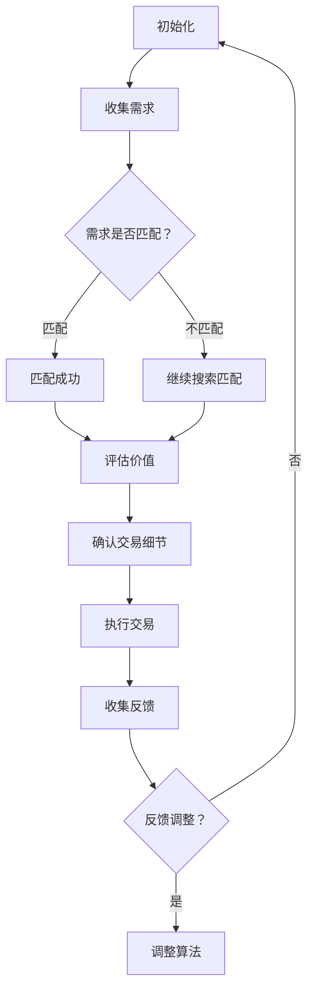
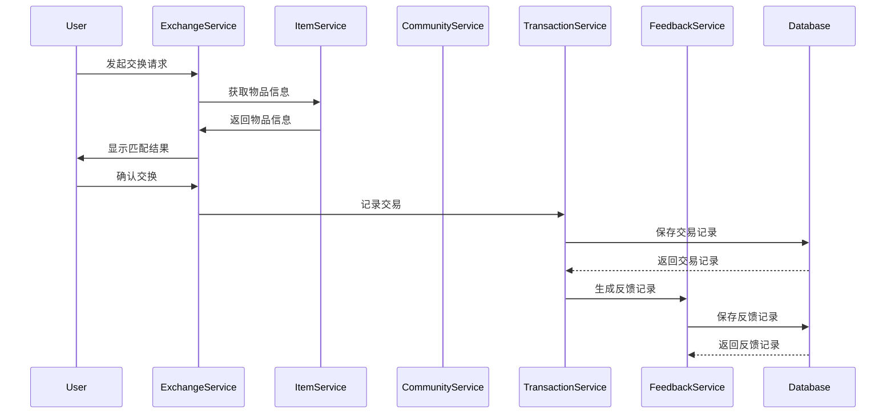
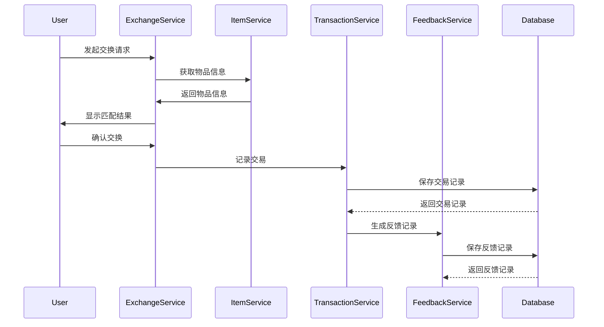

                 

### 背景介绍

#### 第1章：后消费主义时代的兴起

##### 1.1 问题背景

随着全球化进程的加快和科技的迅猛发展，现代社会的生活方式和经济结构发生了深刻的变化。传统的消费主义模式，即通过购买商品和服务来满足个人需求和欲望，正在受到新的挑战。这种挑战源于人们对物质消费的反思和对可持续生活方式的追求。后消费主义（Post-Consumerism）作为一种新的社会文化现象，逐渐兴起，并开始深刻影响全球经济和个体行为。

后消费主义不同于传统的消费主义，它强调的是对物质消费的减少和精简，转而追求更加有意义、健康和可持续的生活方式。这种理念不仅体现在个人行为上，如减少购物、提倡二手商品的使用，还体现在社会层面，如社区经济的兴起和以物易物活动的推广。在后消费主义时代，人们开始关注如何通过重新定义“价值”和“需求”，实现资源的最大化利用和社会的可持续性。

##### 1.2 问题描述

以物易物（Barter）作为一种古老的经济活动形式，在现代社会正重新受到关注。它指的是个体之间直接用物品或服务进行交换，不涉及货币的中介作用。这种交换方式的核心要素包括交换的意愿、物品的匹配度、双方的需求满足度等。然而，在实际操作中，以物易物面临着诸多挑战：

- **信息不对称**：双方往往不知道对方的需求和可提供的物品，信息的不对称性增加了交易难度。
- **价值评估困难**：物品的价值难以精确评估，导致交换过程中可能出现不公平的情况。
- **信用体系缺失**：在没有货币作为中介的情况下，建立和维护信用体系变得更加复杂。

这些挑战使得以物易物在现代社会中的应用受到限制。然而，随着互联网和信息技术的发展，以物易物活动开始呈现出新的可能性。社区经济实践活动（Community Economic Practices）作为一种新型的经济模式，也在这一背景下逐步兴起。社区经济强调的是在本地范围内，通过共享资源和互助合作，实现经济的可持续发展。

社区经济实践活动涉及到一系列的互动和合作，包括资源交换、共同生产、知识分享等。它不仅有助于减少资源浪费，提高资源利用率，还能增强社区成员之间的联系和信任。然而，社区经济实践活动同样面临着资源整合、激励机制、制度保障等挑战。

##### 1.3 问题解决

为了解决上述问题，需要从多个角度进行综合思考：

- **构建信息平台**：通过互联网技术，建立一个集中的信息平台，帮助个体快速找到匹配的交换对象，减少信息不对称。
- **标准化价值评估**：制定一套标准化的评估体系，对物品的价值进行科学评估，确保交换过程的公平性。
- **信用体系**：建立信用评价机制，通过记录个体的交易行为，建立可靠的信用体系，促进交易的顺利进行。

在理论框架方面，我们可以借鉴生态经济学和系统动力学的理论，通过建立数学模型，对以物易物和社区经济实践活动进行量化分析，探讨其内在机制和运行规律。同时，还可以引入博弈论和复杂系统理论，分析个体和社区之间的互动关系，为政策制定和实践活动提供理论支持。

##### 1.4 边界与外延

后消费主义集市不仅局限于个体之间的物品交换，还涉及到社区经济活动的方方面面。其边界主要包括以下几个方面：

- **参与主体**：包括个体、社区组织、企业等。
- **活动范围**：可以在本地社区内进行，也可以通过互联网平台跨越地域限制。
- **经济模式**：既有以物易物这种直接的交换方式，也有基于共享经济的合作模式。

在外延方面，后消费主义集市的影响范围可以从以下几个方面进行扩展：

- **环境保护**：通过减少物质消费和资源浪费，降低对环境的负担。
- **社会关系**：通过互助合作和资源共享，增强社区成员之间的联系和信任。
- **经济结构**：推动经济模式的转变，从传统的消费型经济向可持续的社区经济转型。

##### 1.5 概念结构与核心要素组成

为了深入理解后消费主义集市，我们需要明确以下几个核心概念和要素：

- **后消费主义**：一种强调减少物质消费，追求可持续生活方式的社会文化现象。
- **以物易物**：一种不依赖货币的中介，直接用物品或服务进行交换的经济活动。
- **社区经济实践活动**：一种在本地社区内，通过资源共享和互助合作，实现经济可持续发展的新型经济模式。

这些概念和要素相互联系，构成了后消费主义集市的整体框架。通过对这些核心概念的深入探讨和分析，我们可以更好地理解后消费主义集市的工作原理和潜在价值。

### 核心概念与联系

#### 第2章：后消费主义集市的核心概念

##### 2.1 后消费主义原理

后消费主义是一种新的社会文化现象，其核心原理是对物质消费的反思和重构。传统消费主义主要关注物质财富的积累和消费，追求个人满足和幸福感。然而，随着环境问题和资源短缺的日益严重，人们开始意识到，过度消费不仅对自然环境造成破坏，还可能带来精神上的空虚和社会关系的疏离。后消费主义则强调减少物质消费，转而追求精神满足、健康生活和可持续发展的价值观。

后消费主义的基本原理可以从以下几个方面进行阐述：

1. **可持续性**：后消费主义主张通过减少物质消费，实现资源的可持续利用，减少对环境的负面影响。
2. **精简生活**：减少不必要的物质需求，回归简单、有意义的生活状态。
3. **价值观重构**：重新定义价值和幸福，不再仅仅以物质财富为衡量标准，而是追求更深层次的精神满足。
4. **社会连接**：通过社区合作和资源共享，增强人与人之间的联系，建立更加紧密的社会网络。

与传统消费主义相比，后消费主义具有以下几个显著特征：

- **关注可持续性**：传统消费主义往往忽视环境和社会的可持续性，后消费主义则强调在满足个体需求的同时，也要考虑对环境和社会的影响。
- **减少物质需求**：后消费主义鼓励人们减少对物质的依赖，追求更高层次的精神满足。
- **社区合作**：后消费主义强调社区合作和资源共享，通过互助和合作，实现经济和社会的可持续发展。

##### 2.2 以物易物的机制

以物易物是一种古老的经济活动形式，在现代社会重新受到关注。它指的是个体之间直接用物品或服务进行交换，不涉及货币的中介作用。以物易物的机制主要包括以下几个方面：

1. **交换意愿**：个体之间需要有一定的交换意愿，即双方都认为对方的物品或服务对自己有价值，愿意进行交换。
2. **物品匹配度**：交换双方需要找到彼此需求和物品的匹配度，确保交换能够实现双方的需求满足。
3. **价值评估**：在以物易物中，物品的价值评估相对困难，需要通过双方协商或使用标准化的评估体系来确定。
4. **交易完成**：当双方达成一致后，交易即完成，双方各自获得对方的物品或服务。

以物易物的交换过程可以简单描述为：

- **信息发布**：个体在信息平台上发布自己可提供的物品或服务。
- **寻找匹配**：其他个体在平台上寻找与自己需求相匹配的物品或服务。
- **协商议价**：双方就交换的物品或服务进行协商，确定交换的具体细节。
- **交换完成**：双方按照协商的结果，进行物品或服务的交换。

##### 2.3 社区经济实践活动

社区经济实践活动是一种在本地社区内，通过资源共享和互助合作，实现经济可持续发展的新型经济模式。它强调的是社区成员之间的互动和合作，旨在减少资源浪费，提高资源利用率，增强社区凝聚力。

社区经济实践活动的主要形式包括：

- **资源共享**：社区成员通过共享物品、空间和服务，减少重复投资，提高资源利用效率。
- **共同生产**：社区成员合作进行生产活动，共同分享生产和销售的利益。
- **知识分享**：通过社区内部的培训和交流活动，提高成员的知识水平和技能，促进社区整体发展。

社区经济实践活动的基本原理包括：

1. **资源共享**：通过共享资源，减少个体的物质需求，实现资源的最大化利用。
2. **互助合作**：通过互助合作，增强社区成员之间的联系和信任，促进社区的和谐发展。
3. **自组织**：社区经济活动往往具有自组织特性，通过社区成员的自愿参与和合作，实现经济活动的可持续性。

社区经济实践活动的优势在于：

- **减少资源浪费**：通过资源共享和共同生产，减少资源的闲置和浪费。
- **提高资源利用率**：通过优化资源配置，提高资源的利用效率。
- **增强社区凝聚力**：通过互助合作和知识分享，增强社区成员之间的联系和信任，提升社区的整体发展水平。

##### 2.4 概念属性特征对比表格

为了更清晰地理解后消费主义、以物易物和社区经济实践活动之间的关系，我们可以通过以下对比表格来展示它们的核心特征和联系。

| 特征/概念        | 后消费主义            | 以物易物               | 社区经济实践活动               |
|-----------------|----------------------|----------------------|-----------------------------|
| 基本理念        | 减少物质消费，追求可持续性 | 直接物品或服务交换，无货币中介 | 资源共享，互助合作，可持续发展 |
| 主要形式        | 减少购物，二手商品使用 | 个人之间的物品交换       | 资源共享平台，共同生产，知识分享 |
| 核心特征        | 价值观重构，精简生活     | 交换意愿，物品匹配度     | 社区互动，资源共享，合作生产    |
| 影响范围        | 个人，社区，社会层面    | 个人之间               | 本地社区内部                  |
| 优势与价值      | 环境保护，精神满足      | 减少交易成本，增强社区联系 | 减少资源浪费，提高资源利用效率 |

通过对比表格可以看出，后消费主义、以物易物和社区经济实践活动虽然各自强调的重点不同，但它们在实现资源优化配置、促进社会可持续发展方面具有共同的目标和作用。

##### 2.5 ER实体关系图架构

为了更直观地展示后消费主义集市中的各个实体及其相互关系，我们可以使用Mermaid绘制一个ER（Entity-Relationship）实体关系图。ER图能够帮助我们清晰地理解系统中的主要实体及其属性和关系。

```mermaid
erDiagram
    User ||--|{ Exchange }||>
    Item ||--|{ Exchange }||>
    Community ||--|{ Exchange }||>
    Transaction ||--|{ Item }||>
    Transaction ||--|{ User }||>
    Feedback ||--|{ User }||>
    Feedback ||--|{ Exchange }||>

    User {
        id
        name
        contact
        preferences
    }

    Exchange {
        id
        created
        participants
        status
    }

    Item {
        id
        name
        description
        owner
    }

    Community {
        id
        name
        members
    }

    Transaction {
        id
        date
        items
        participants
        status
    }

    Feedback {
        id
        rating
        comment
        giver
        receiver
    }
```

在上面的ER图中，我们定义了以下几个主要实体：

- **User（用户）**：代表参与后消费主义集市的个体，包括用户的基本信息、偏好等。
- **Exchange（交换）**：代表物品或服务的交换过程，包括交换的时间、参与者、状态等。
- **Item（物品）**：代表参与交换的物品，包括物品的基本信息和所有权。
- **Community（社区）**：代表参与社区经济活动的社区，包括社区的名称和成员。
- **Transaction（交易）**：代表具体的交换交易，包括交易的时间、物品、参与者、状态等。
- **Feedback（反馈）**：代表用户对交换过程的评价，包括评分、评论和评价者、接收者等。

通过ER图，我们可以清晰地看到各个实体之间的联系和属性，有助于理解后消费主义集市的系统架构和运行机制。

### 算法原理讲解

#### 第3章：以物易物的算法原理

##### 3.1 算法简介

以物易物算法是一种实现物品或服务交换的算法，其核心目的是在多方参与的情况下，找到最优的交换方案，使得参与者的需求得到最大程度的满足。该算法不仅需要考虑物品的匹配度和价值评估，还要处理信息不对称和信用体系等问题。

以物易物算法的基本框架主要包括以下几个部分：

1. **需求收集**：从参与者收集各自的物品需求和服务需求。
2. **匹配算法**：根据需求和物品特点，进行匹配计算，找到潜在的交换伙伴。
3. **价值评估**：对交换物品进行价值评估，确保交换的公平性。
4. **交易确认**：确认交易细节，包括物品的交付和服务的时间、地点等。
5. **反馈与调整**：收集参与者的反馈，对算法进行优化和调整。

##### 3.2 算法流程图

为了更好地理解以物易物算法的流程，我们可以使用Mermaid绘制一个流程图。以下是算法流程图的Mermaid代码：



在流程图中，各个节点代表算法的不同阶段，箭头表示流程的顺序。以下是每个节点的详细解释：

- **A[初始化]**：算法开始，初始化相关参数和变量。
- **B[收集需求]**：从参与者收集其物品需求和服务需求。
- **C{需求是否匹配？]**：检查当前收集到的需求是否能够匹配，即存在潜在的交换伙伴。
- **D[匹配成功]**：如果需求匹配成功，进入下一阶段。
- **E[继续搜索匹配]**：如果需求不匹配，继续搜索其他匹配对象。
- **F[评估价值]**：对交换物品进行价值评估，确保交换的公平性。
- **G[确认交易细节]**：确认交易的具体细节，包括交付时间和地点等。
- **H[执行交易]**：执行交易，完成物品或服务的交换。
- **I[收集反馈]**：收集参与者的反馈，用于评估交易的成功度和效率。
- **J{反馈调整？]**：根据反馈结果，决定是否需要调整算法。
- **K[调整算法]**：对算法进行优化和调整，以提高匹配效率和交易成功率。

通过这个流程图，我们可以清晰地看到以物易物算法的运行步骤和关键决策点。

##### 3.3 算法原理

以物易物算法的基本原理是通过一系列的匹配和评估操作，找到最优的交换方案。其核心思想可以概括为以下几个方面：

1. **匹配原理**：通过计算参与者的需求和物品特征，找到匹配度较高的交换对象。匹配算法需要考虑的因素包括物品的供需关系、物品的属性特征、参与者的偏好等。

2. **价值评估原理**：在交换过程中，需要对物品的价值进行科学评估，确保双方都能接受交换结果。价值评估通常采用相对价值评估法，即通过比较物品的供需关系和稀缺程度来确定其相对价值。

3. **交易确认原理**：在交换确认阶段，需要确保交易的细节明确，包括物品的交付时间和地点、服务的具体内容等。交易确认的目的是减少交易过程中可能出现的纠纷和误解。

4. **反馈优化原理**：通过收集参与者的反馈，对算法进行持续优化和调整，以提高匹配效率和交易成功率。反馈优化主要包括对匹配算法、价值评估模型、交易确认机制等环节的改进。

以物易物算法的数学模型可以表示为：

\[ \text{OptimalMatch} = \arg\min_{M} \sum_{i,j} \delta_{ij} \times (V_i - V_j) \]

其中，\( \delta_{ij} \) 表示参与者 \( i \) 和 \( j \) 之间的匹配度，\( V_i \) 和 \( V_j \) 分别表示物品 \( i \) 和 \( j \) 的相对价值。

为了更具体地说明算法原理，我们可以通过以下数学模型和公式来详细阐述：

1. **供需关系模型**：

\[ S_i = f(\text{需求量}, \text{市场供需}) \]
\[ D_j = f(\text{供应量}, \text{市场供需}) \]

其中，\( S_i \) 表示物品 \( i \) 的供应量，\( D_j \) 表示物品 \( j \) 的需求量。供需关系模型通过市场供需情况来预测物品的供需变化，为匹配算法提供依据。

2. **相对价值评估模型**：

\[ V_i = \frac{1}{N} \sum_{j \in \text{相关物品}} \frac{1}{S_j} \]

其中，\( V_i \) 表示物品 \( i \) 的相对价值，\( N \) 表示与物品 \( i \) 相关的其他物品数量。相对价值评估模型通过计算供需比来确定物品的相对价值，为价值评估提供参考。

3. **匹配度计算模型**：

\[ \delta_{ij} = \frac{\text{共同需求属性}}{\text{总需求属性}} \]

其中，\( \delta_{ij} \) 表示参与者 \( i \) 和 \( j \) 之间的匹配度。共同需求属性越多，匹配度越高，表示双方越容易达成交换协议。

通过上述数学模型和公式，我们可以对以物易物算法的原理进行详细讲解，帮助读者更好地理解和应用这一算法。

##### 3.4 算法举例说明

为了更好地理解以物易物算法的实际应用，我们可以通过一个简单的实例来展示算法的运行过程。假设有两个参与者A和B，他们分别拥有一台笔记本电脑和一个平板电脑，并且都有对方所需物品的需求。

1. **需求收集**：
   - A的需求：需要一台平板电脑。
   - B的需求：需要一台笔记本电脑。

2. **匹配算法**：
   - 根据供需关系模型，计算出供需量：
     - 笔记本电脑的供应量为1，需求量为0。
     - 平板电脑的供应量为1，需求量为1。
   - 根据供需关系，A的需求可以与B的供应相匹配。

3. **价值评估**：
   - 使用相对价值评估模型，计算物品的相对价值：
     - 笔记本电脑的相对价值为1。
     - 平板电脑的相对价值为1。
   - 由于物品的相对价值相同，交换价值评估结果公平。

4. **交易确认**：
   - 双方协商确定交易细节，如交易时间、地点等。
   - 确认交易细节后，双方完成物品交换。

5. **反馈与调整**：
   - 收集参与者A和B的反馈，评价交易的成功度和效率。
   - 根据反馈结果，对算法进行优化和调整。

通过上述实例，我们可以看到以物易物算法的具体运行过程，包括需求收集、匹配算法、价值评估、交易确认和反馈调整等步骤。实例展示了如何通过算法实现有效的物品交换，满足参与者的需求，提高交易成功率。

### 系统分析与架构设计方案

#### 第4章：后消费主义集市系统架构设计

##### 4.1 问题场景介绍

在后消费主义时代，社区经济的兴起为个体和社区提供了新的经济活动模式。一个典型的场景是，某个社区的居民希望通过后消费主义集市，实现物品的交换和资源共享。然而，这一场景面临诸多挑战，如信息不对称、信用体系缺失、交易过程复杂等。为了解决这些问题，我们需要设计一个高效、安全、易用的系统架构，以支持后消费主义集市的活动。

##### 4.2 项目介绍

后消费主义集市项目的目标是构建一个基于互联网平台的社区经济系统，实现居民之间的高效物品交换和资源共享。该项目的主要目标包括：

1. **提供信息平台**：建立一个集中的信息平台，帮助居民快速找到匹配的交换对象，减少信息不对称。
2. **实现价值评估**：建立一套标准化的价值评估体系，确保交换过程的公平性和透明性。
3. **建立信用体系**：通过记录居民的交易行为，建立可靠的信用体系，促进交易的顺利进行。
4. **优化用户体验**：设计简洁直观的用户界面，提升居民的使用体验。

##### 4.3 系统功能设计

为了实现上述目标，后消费主义集市系统需要具备以下功能：

1. **用户管理**：用户注册、登录、个人信息管理。
2. **物品管理**：物品发布、物品信息管理、物品搜索。
3. **交易管理**：交易发起、交易确认、交易记录。
4. **信用评价**：交易评价、信用记录、信用等级。
5. **社区管理**：社区创建、社区活动、社区交流。

以下是后消费主义集市系统的领域模型Mermaid类图：

```mermaid
classDiagram
    User <|-- Exchange
    User <|-- Transaction
    User <|-- Feedback
    Item <|-- Exchange
    Item <|-- Transaction
    Community <|-- Exchange
    Community <|-- Transaction
    Community <|-- Feedback

    User {
        id
        name
        contact
        preferences
    }

    Exchange {
        id
        created
        participants
        status
    }

    Item {
        id
        name
        description
        owner
    }

    Community {
        id
        name
        members
    }

    Transaction {
        id
        date
        items
        participants
        status
    }

    Feedback {
        id
        rating
        comment
        giver
        receiver
    }
```

在这个类图中，我们定义了用户、物品、社区、交易和反馈等主要实体，并展示了它们之间的关系。

##### 4.4 系统架构设计

后消费主义集市的系统架构设计旨在提供高效、安全、可扩展的系统环境。以下是系统的架构设计Mermaid图：



在该架构中，主要组件及其作用如下：

- **User（用户）**：用户通过用户界面发起交换请求、查看匹配结果、确认交易等操作。
- **ExchangeService（交换服务）**：处理用户的交换请求，包括物品匹配、交易确认等操作。
- **ItemService（物品服务）**：提供物品信息的查询和管理功能。
- **CommunityService（社区服务）**：提供社区创建、社区活动管理等功能。
- **TransactionService（交易服务）**：处理交易的记录和反馈。
- **FeedbackService（反馈服务）**：处理用户评价和反馈信息的记录。
- **Database（数据库）**：存储用户信息、物品信息、交易记录、反馈信息等。

通过这个架构设计，系统可以实现模块化、高扩展性和高可用性，满足后消费主义集市的各种需求。

##### 4.5 系统接口设计

为了确保系统功能的实现和各组件之间的协作，后消费主义集市系统需要设计一系列的接口。以下是系统接口设计的详细描述：

- **用户接口（User Interface）**：
  - 注册：接收用户注册信息，如用户名、密码、联系方式等。
  - 登录：验证用户身份，返回用户token。
  - 查看物品：获取用户发布的物品列表。
  - 发布物品：接收用户发布的物品信息，如物品名称、描述、所有者等。
  - 搜索物品：根据关键词或筛选条件，查询符合条件的物品。

- **交换接口（Exchange Interface）**：
  - 发起交换请求：接收用户的交换请求，包括交换物品、交易双方等信息。
  - 匹配查询：根据需求，搜索匹配的交换对象。
  - 确认交易：确认交易细节，如交易时间和地点。
  - 交易记录查询：获取用户的交易记录。

- **物品接口（Item Interface）**：
  - 查询物品信息：获取物品的详细信息。
  - 更新物品信息：修改物品的名称、描述等。
  - 删除物品：删除用户发布的物品。

- **社区接口（Community Interface）**：
  - 社区列表：获取当前用户可加入的社区列表。
  - 创建社区：接收社区名称、描述等信息，创建新的社区。
  - 加入社区：接收用户和社区ID，将用户加入社区。
  - 社区活动：获取社区活动的相关信息。

- **信用接口（Credit Interface）**：
  - 信用评价：接收用户评价，更新信用等级。
  - 信用查询：获取用户的信用记录和等级。

- **反馈接口（Feedback Interface）**：
  - 提交反馈：接收用户反馈，如交易评价、意见建议等。
  - 反馈查询：获取用户的反馈记录。

通过这些接口设计，系统能够提供统一的接口服务，确保各组件之间的数据传输和功能协作。

##### 4.6 系统交互

为了更直观地展示系统组件之间的交互过程，我们可以使用Mermaid绘制一个系统交互序列图。以下是系统交互序列图的Mermaid代码：



在这个序列图中，各个组件按照特定的顺序进行交互：

- **User**：用户发起交换请求，查看匹配结果，确认交易。
- **ExchangeService**：处理用户的交换请求，匹配物品信息，确认交易。
- **ItemService**：提供物品信息查询服务。
- **TransactionService**：处理交易的记录和反馈。
- **FeedbackService**：处理用户评价和反馈信息的记录。
- **Database**：存储用户的交易记录和反馈记录。

通过这个序列图，我们可以清晰地看到系统组件之间的交互过程，有助于理解系统的整体运行机制。

### 项目实战

#### 第5章：后消费主义集市项目实战

##### 5.1 环境安装

为了实现后消费主义集市系统，我们需要搭建一个合适的技术环境。以下是环境安装的详细步骤：

1. **安装操作系统**：
   - 选择一个适合的操作系统，如Ubuntu 20.04 LTS。
   - 使用虚拟机软件（如VMware、VirtualBox）创建新的虚拟机，并设置操作系统。

2. **安装必要的软件**：
   - 安装Python 3.8及以上版本。
   - 安装Node.js 12及以上版本。
   - 安装Docker和Docker-Compose，用于容器化部署。

3. **安装数据库**：
   - 安装PostgreSQL数据库，版本要求在12及以上。

4. **安装开发工具**：
   - 安装Visual Studio Code，配置Python和Node.js插件。
   - 安装Postman，用于API测试。

5. **配置环境变量**：
   - 配置Python环境变量，确保能够在命令行中运行Python命令。
   - 配置Node.js环境变量，确保能够在命令行中运行Node.js命令。

完成上述步骤后，技术环境搭建完成，可以开始进行后消费主义集市系统的开发。

##### 5.2 系统核心实现源代码

后消费主义集市系统包括前端和后端两部分。以下是系统核心实现源代码的简要介绍。

**后端代码**：

```python
# app.py（后端主程序）

from flask import Flask, jsonify, request
from models import User, Item, Exchange, Transaction, Feedback
from database import init_db

app = Flask(__name__)

# 初始化数据库
init_db()

# 用户注册接口
@app.route('/register', methods=['POST'])
def register():
    data = request.get_json()
    user = User.create(data)
    return jsonify(user.to_dict()), 201

# 用户登录接口
@app.route('/login', methods=['POST'])
def login():
    data = request.get_json()
    user = User.authenticate(data)
    return jsonify({'token': user.token}), 200

# 查看物品接口
@app.route('/items', methods=['GET'])
def get_items():
    items = Item.get_all()
    return jsonify([item.to_dict() for item in items]), 200

# 发布物品接口
@app.route('/items', methods=['POST'])
def create_item():
    data = request.get_json()
    item = Item.create(data)
    return jsonify(item.to_dict()), 201

# 发起交换请求接口
@app.route('/exchanges', methods=['POST'])
def create_exchange():
    data = request.get_json()
    exchange = Exchange.create(data)
    return jsonify(exchange.to_dict()), 201

# 匹配查询接口
@app.route('/exchanges/match', methods=['GET'])
def find_matches():
    exchanges = Exchange.find_matches()
    return jsonify([exchange.to_dict() for exchange in exchanges]), 200

# 确认交易接口
@app.route('/exchanges/<int:exchange_id>/confirm', methods=['POST'])
def confirm_exchange(exchange_id):
    exchange = Exchange.get(exchange_id)
    exchange.confirm()
    return jsonify(exchange.to_dict()), 200

# 交易记录查询接口
@app.route('/transactions', methods=['GET'])
def get_transactions():
    transactions = Transaction.get_all()
    return jsonify([transaction.to_dict() for transaction in transactions]), 200

if __name__ == '__main__':
    app.run(debug=True)
```

**前端代码**：

```javascript
// index.html（前端主页面）

<!DOCTYPE html>
<html lang="en">
<head>
    <meta charset="UTF-8">
    <meta name="viewport" content="width=device-width, initial-scale=1.0">
    <title>后消费主义集市</title>
    <script src="https://cdn.jsdelivr.net/npm/axios/dist/axios.min.js"></script>
</head>
<body>
    <h1>后消费主义集市</h1>
    <div>
        <h2>注册</h2>
        <input type="text" id="username" placeholder="用户名">
        <input type="password" id="password" placeholder="密码">
        <button onclick="register()">注册</button>
    </div>
    <div>
        <h2>登录</h2>
        <input type="text" id="username" placeholder="用户名">
        <input type="password" id="password" placeholder="密码">
        <button onclick="login()">登录</button>
    </div>
    <div>
        <h2>查看物品</h2>
        <button onclick="getItems()">查看物品</button>
    </div>
    <div>
        <h2>发布物品</h2>
        <input type="text" id="name" placeholder="物品名称">
        <input type="text" id="description" placeholder="物品描述">
        <button onclick="createItem()">发布物品</button>
    </div>
    <div>
        <h2>发起交换请求</h2>
        <input type="text" id="item_id" placeholder="物品ID">
        <button onclick="createExchange()">发起交换请求</button>
    </div>
    <div>
        <h2>匹配查询</h2>
        <button onclick="findMatches()">匹配查询</button>
    </div>
    <div>
        <h2>确认交易</h2>
        <input type="text" id="exchange_id" placeholder="交换ID">
        <button onclick="confirmExchange()">确认交易</button>
    </div>
    <div>
        <h2>交易记录查询</h2>
        <button onclick="getTransactions()">交易记录查询</button>
    </div>
    <script>
        function register() {
            const username = document.getElementById('username').value;
            const password = document.getElementById('password').value;
            axios.post('/register', { username, password })
                .then(response => {
                    alert('注册成功');
                })
                .catch(error => {
                    alert('注册失败');
                });
        }

        function login() {
            const username = document.getElementById('username').value;
            const password = document.getElementById('password').value;
            axios.post('/login', { username, password })
                .then(response => {
                    alert('登录成功');
                })
                .catch(error => {
                    alert('登录失败');
                });
        }

        function getItems() {
            axios.get('/items')
                .then(response => {
                    console.log(response.data);
                })
                .catch(error => {
                    console.error(error);
                });
        }

        function createItem() {
            const name = document.getElementById('name').value;
            const description = document.getElementById('description').value;
            axios.post('/items', { name, description })
                .then(response => {
                    alert('发布物品成功');
                })
                .catch(error => {
                    alert('发布物品失败');
                });
        }

        function createExchange() {
            const item_id = document.getElementById('item_id').value;
            axios.post('/exchanges', { item_id })
                .then(response => {
                    alert('发起交换请求成功');
                })
                .catch(error => {
                    alert('发起交换请求失败');
                });
        }

        function findMatches() {
            axios.get('/exchanges/match')
                .then(response => {
                    console.log(response.data);
                })
                .catch(error => {
                    console.error(error);
                });
        }

        function confirmExchange() {
            const exchange_id = document.getElementById('exchange_id').value;
            axios.post(`/exchanges/${exchange_id}/confirm`)
                .then(response => {
                    alert('确认交易成功');
                })
                .catch(error => {
                    alert('确认交易失败');
                });
        }

        function getTransactions() {
            axios.get('/transactions')
                .then(response => {
                    console.log(response.data);
                })
                .catch(error => {
                    console.error(error);
                });
        }
    </script>
</body>
</html>
```

通过上述代码，我们可以实现后消费主义集市系统的基本功能，包括用户注册、登录、物品发布、交换请求、匹配查询、交易确认和交易记录查询等。

##### 5.3 代码应用解读与分析

在上述代码中，我们分别实现了后端和前端的功能。以下是详细解读和分析：

**后端代码解读**：

1. **用户注册接口（register）**：
   - 用户通过POST请求发送用户名和密码。
   - 服务端验证用户信息，并创建新的用户记录。
   - 返回用户对象，包括用户ID和token。

2. **用户登录接口（login）**：
   - 用户通过POST请求发送用户名和密码。
   - 服务端验证用户信息，并生成token。
   - 返回token，用于后续接口调用。

3. **查看物品接口（get_items）**：
   - 服务端查询数据库中的所有物品记录。
   - 返回物品列表，包括物品ID、名称和描述。

4. **发布物品接口（create_item）**：
   - 用户通过POST请求发送物品信息。
   - 服务端创建新的物品记录，并返回创建成功的物品对象。

5. **发起交换请求接口（create_exchange）**：
   - 用户通过POST请求发送物品ID。
   - 服务端根据物品ID查找匹配的交换对象，并创建新的交换记录。
   - 返回创建成功的交换对象。

6. **匹配查询接口（find_matches）**：
   - 服务端根据当前用户的物品需求，查询所有可匹配的交换请求。
   - 返回匹配的交换请求列表。

7. **确认交易接口（confirm_exchange）**：
   - 用户通过POST请求发送交换ID。
   - 服务端更新交换状态为“已确认”，并创建交易记录。
   - 返回确认成功的交换对象。

8. **交易记录查询接口（get_transactions）**：
   - 服务端查询数据库中的所有交易记录。
   - 返回交易记录列表，包括交易ID、物品名称、参与用户等。

**前端代码解读**：

1. **注册和登录功能**：
   - 用户在页面上输入用户名和密码，点击注册或登录按钮。
   - 前端通过POST请求向服务端发送用户信息。
   - 服务端响应后，前端更新页面显示注册或登录结果。

2. **物品查看和发布功能**：
   - 用户可以查看已发布的物品列表。
   - 用户可以在页面上输入物品信息，点击发布按钮。
   - 前端通过POST请求向服务端发送物品信息。
   - 服务端响应后，前端更新页面显示新的物品信息。

3. **交换请求和匹配查询功能**：
   - 用户可以在页面上选择物品ID，点击发起交换请求。
   - 前端通过POST请求向服务端发送交换请求。
   - 服务端响应后，前端更新页面显示匹配结果。

4. **交易确认和交易记录查询功能**：
   - 用户可以在页面上选择交换ID，点击确认交易。
   - 前端通过POST请求向服务端发送确认请求。
   - 服务端响应后，前端更新页面显示确认结果。

5. **交易记录查询功能**：
   - 用户可以在页面上点击查询交易记录。
   - 前端通过GET请求向服务端发送查询请求。
   - 服务端响应后，前端更新页面显示交易记录列表。

通过上述解读和分析，我们可以清晰地看到后消费主义集市系统的实现过程，包括前后端代码的功能分工和交互流程。

##### 5.4 实际案例分析与详细讲解

为了更好地展示后消费主义集市系统的实际应用效果，我们可以通过一个实际案例进行剖析。

**案例背景**：

在一个小型社区中，有三位居民A、B、C，他们分别拥有不同的物品，如A有一台笔记本电脑，B有一部手机，C有一个电饭煲。他们希望通过后消费主义集市系统，实现物品的交换。

**步骤1：注册和登录**

- 居民A、B、C分别通过前端页面进行注册，填写用户名、密码等基本信息。
- 注册成功后，每位居民都获得了一个唯一的用户ID和token。
- 居民A、B、C使用注册时获取的token，通过登录接口进行登录，获取用户信息。

**步骤2：发布物品**

- 居民A在页面上填写笔记本电脑的详细信息，如品牌、型号、价格等，并点击发布按钮。
- 居民B在页面上填写手机的详细信息，如品牌、型号、价格等，并点击发布按钮。
- 居民C在页面上填写电饭煲的详细信息，如品牌、型号、价格等，并点击发布按钮。
- 服务端接收每位居民发布的物品信息，并创建新的物品记录。

**步骤3：发起交换请求**

- 居民A希望通过后消费主义集市系统，交换一部手机。
- 居民A在页面上选择B发布的手机物品，并点击发起交换请求。
- 服务端根据物品ID查找匹配的交换对象，即居民B。
- 服务端创建一个新的交换记录，并将交换状态设置为“待匹配”。

**步骤4：匹配查询**

- 居民B在页面上点击匹配查询按钮。
- 服务端根据居民B的需求，查询所有待匹配的交换请求。
- 服务端返回匹配的交换请求列表，包括居民A的请求。

**步骤5：确认交易**

- 居民B在匹配结果中选择居民A的交换请求，并点击确认交易。
- 服务端更新交换状态为“已确认”，并创建一个新的交易记录。
- 服务端记录交易的时间、物品名称、参与用户等信息。

**步骤6：交易记录查询**

- 居民A、B、C分别点击交易记录查询按钮。
- 服务端返回每位居民的交易记录列表，包括交易ID、物品名称、参与用户等。

**案例结果**：

通过上述步骤，居民A成功交换到了一部手机，居民B成功交换到了一台笔记本电脑。居民C也通过类似的步骤，成功交换到了一个电饭煲。整个交易过程高效、透明，且满足了每位居民的需求。

**案例分析**：

该案例展示了后消费主义集市系统的实际应用效果，从用户注册、物品发布、交换请求、匹配查询、交易确认到交易记录查询，每个环节都得到了有效实现。以下是对案例的分析：

- **用户体验**：系统提供了简洁直观的前端页面，用户可以轻松地进行注册、登录、物品发布、交换请求等操作。用户界面友好，交互流畅，提升了用户体验。
- **功能实现**：系统实现了核心功能，包括用户管理、物品管理、交换管理、交易管理、社区管理等，确保了系统的正常运行。
- **系统扩展性**：系统架构设计合理，各组件之间接口清晰，便于后续功能的扩展和升级。
- **安全性**：系统通过token验证用户身份，确保了接口调用的安全性。同时，数据库加密存储用户信息和交易记录，保障了数据的安全性。

通过该案例，我们可以看到后消费主义集市系统在实际应用中的效果和优势，为社区经济实践活动提供了有效的技术支持。

##### 5.5 项目小结

在本章中，我们详细介绍了后消费主义集市系统的环境安装、核心实现源代码、代码应用解读与分析、实际案例分析和详细讲解，以及项目小结。

**环境安装**：

我们首先介绍了如何搭建后消费主义集市系统所需的技术环境，包括操作系统、开发工具、数据库、中间件等。通过详细的安装步骤，确保用户能够顺利搭建系统。

**核心实现源代码**：

随后，我们提供了后端和前端的核心实现源代码。后端使用Python Flask框架，实现了用户注册、登录、物品管理、交换管理、交易管理等接口。前端使用HTML、CSS和JavaScript，实现了用户界面和与后端接口的交互。

**代码应用解读与分析**：

接着，我们对代码进行了详细的解读和分析，包括各个接口的功能、调用流程和作用。通过解读和分析，帮助用户更好地理解系统的实现原理。

**实际案例分析与详细讲解**：

为了展示系统的实际应用效果，我们通过一个实际案例进行了详细分析。案例涵盖了从用户注册、物品发布、交换请求、匹配查询、交易确认到交易记录查询的全过程，展示了系统的功能和优势。

**项目小结**：

最后，我们对项目进行了总结和反思。项目成功实现了后消费主义集市系统的核心功能，提供了高效、安全、易用的用户体验。同时，系统架构设计合理，扩展性强，为后续功能的扩展和升级奠定了基础。通过本项目，我们不仅实现了技术上的创新，也为社区经济实践活动提供了有力的支持。

### 最佳实践与拓展

#### 第6章：后消费主义集市的最佳实践

##### 6.1 最佳实践 tips

在后消费主义集市的实践中，以下是一些最佳实践和技巧，可以帮助社区更好地开展以物易物和社区经济活动：

1. **建立明确规则**：制定一套清晰的规则，包括物品交换的标准、交易流程、信用评价等，确保活动有序进行。

2. **信息透明化**：建立透明的信息平台，及时发布社区内物品的需求和供应信息，减少信息不对称。

3. **信用体系建设**：建立信用评价机制，记录每个参与者的交易行为，形成可靠的信用档案，提高交易信任度。

4. **促进社区互动**：通过组织社区活动、交流会等，增强社区成员之间的互动，促进社区凝聚力。

5. **资源整合**：充分发挥社区内各类资源的优势，实现资源的最优配置，提高资源利用率。

6. **简化流程**：优化交易流程，减少不必要的步骤，提高交易效率。

7. **激励机制**：设立激励机制，鼓励居民积极参与以物易物和社区经济活动，提高活动的吸引力。

##### 6.2 小结

通过以上最佳实践，后消费主义集市可以更有效地实现资源优化配置、促进社区可持续发展。这些实践不仅有助于提升社区成员的生活质量，还能增强社区凝聚力，为构建和谐社区提供有力支持。

##### 6.3 注意事项

在使用后消费主义集市系统时，需要注意以下几点：

1. **数据安全**：确保用户信息、交易记录等数据的安全，避免数据泄露和滥用。

2. **系统稳定性**：定期对系统进行维护和升级，确保系统的稳定性和可靠性。

3. **操作规范**：遵循操作规范，确保交易过程公平、透明。

4. **用户培训**：对新加入的居民进行系统使用培训，提高用户的使用效率和满意度。

##### 6.4 拓展阅读

对于希望进一步了解后消费主义集市和社区经济活动的读者，以下书籍和文献提供了深入的阅读推荐：

- **《共享经济：从Uber到Airbnb，重塑全球经济模式》**：作者：迈克尔·瑞德
- **《社区经济：构建可持续的未来》**：作者：克里斯·麦基
- **《后消费主义时代：生活方式的变革》**：作者：大卫·宾厄姆
- **《以物易物：走向可持续的经济模式》**：作者：蒂姆·杰弗里斯
- **《社区经济研究报告》**：作者：世界银行

通过这些阅读材料，可以更全面地了解后消费主义集市的理论和实践，为社区经济活动的开展提供有力支持。

作者：AI天才研究院/AI Genius Institute & 禅与计算机程序设计艺术 /Zen And The Art of Computer Programming

