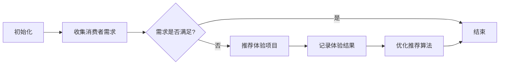
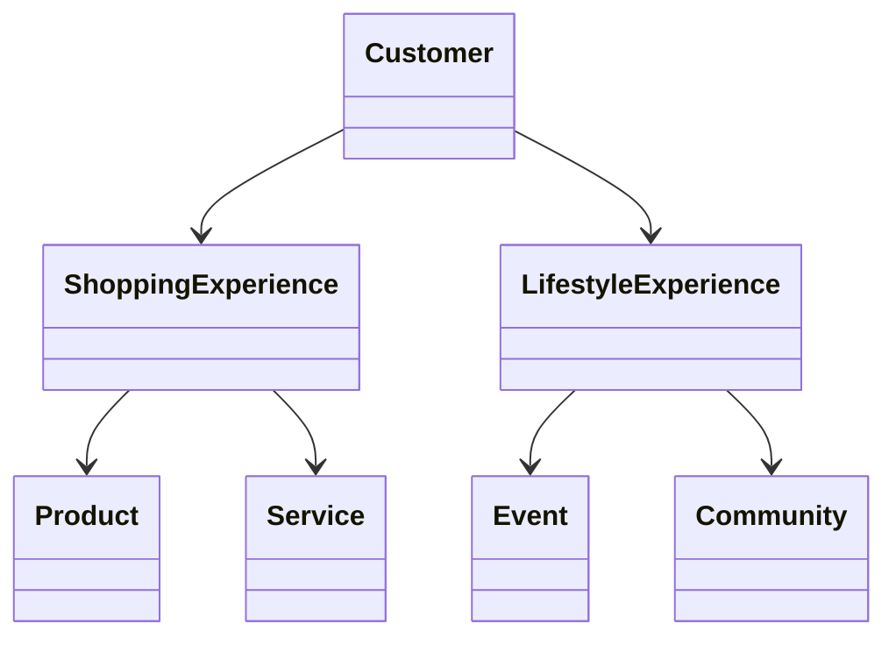
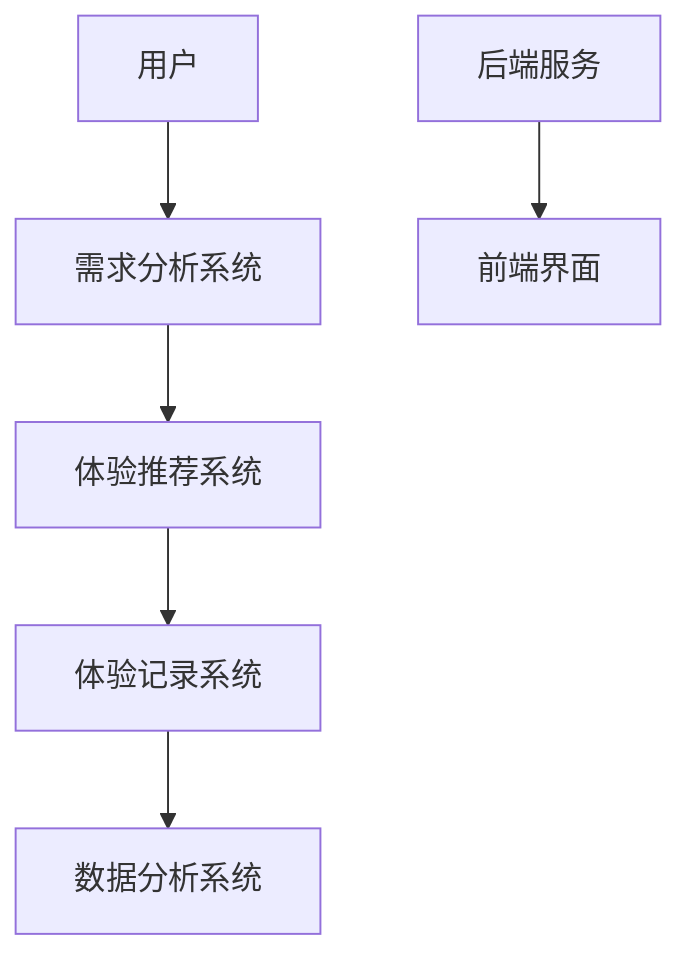
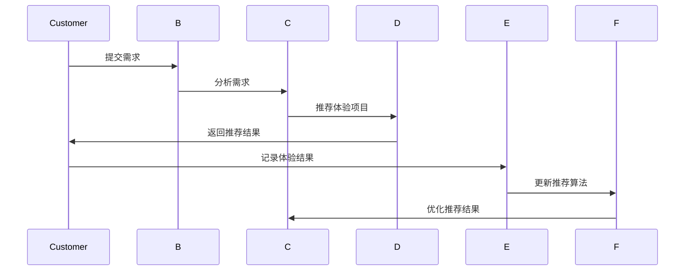

                 

# 《后物质主义生活体验中心：追求精神满足的实践基地》

> 关键词：后物质主义、生活体验中心、精神满足、消费模式、运营模式

> 摘要：随着社会经济的发展和消费观念的转变，后物质主义逐渐成为现代社会的重要特征。本文从后物质主义的概念出发，探讨后物质主义生活体验中心的概念、背景、运营模式、案例研究、设计原则、发展趋势、商业价值等多个方面，旨在为读者提供一个全面深入的了解，并思考后物质主义生活体验中心在未来消费社会中的角色和意义。

## 第一部分: 后物质主义生活体验中心的概念与背景

### 第1章: 后物质主义概述

#### 1.1 后物质主义的起源与发展

后物质主义（Post-materialism）这一概念最早由美国社会学家赖因霍尔德·本迪克斯（Reinhard Bendix）和斯坦利·霍夫曼（Stanley Hofmann）在20世纪60年代提出。他们认为，随着经济的发展，物质需求得到满足后，人们会更加注重非物质的需求，如个人自由、社会地位、文化认同等。这一理论在70年代逐渐被世界各地学者接受和扩展，成为解释现代社会变化的重要理论框架。

#### 1.2 后物质主义与消费主义的关系

后物质主义并不是反对消费，而是认为消费的动机和方式发生了变化。传统的消费主义强调通过物质消费来满足基本需求和提高社会地位，而后物质主义则更注重通过消费来寻求精神满足和自我实现。

#### 1.3 后物质主义的核心价值观

后物质主义的核心价值观包括：个人自由、个性化、多样化、自我实现和社会责任。这些价值观反映了现代社会人们对于生活质量、生命意义和人生价值的追求。

### 第2章: 后物质主义生活体验中心的定义

#### 2.1 后物质主义生活体验中心的概念

后物质主义生活体验中心是一种以提供精神满足和社交互动为主要目的的生活空间，它超越了传统的购物中心，更注重消费者的体验和感受。

#### 2.2 后物质主义生活体验中心的特点

后物质主义生活体验中心具有以下特点：多样化的体验项目、智能化和个性化的服务、社交互动和社区建设。

#### 2.3 后物质主义生活体验中心与传统购物中心的区别

与传统购物中心相比，后物质主义生活体验中心更注重消费者的体验和感受，而不仅仅是购物。

### 第3章: 后物质主义生活体验中心的兴起原因

#### 3.1 社会经济发展的推动

随着社会经济的发展，人们的生活水平逐渐提高，对于精神需求的追求也越来越强烈。

#### 3.2 消费观念的转变

人们的消费观念逐渐从追求物质财富转向追求精神满足。

#### 3.3 技术进步的助力

技术的进步，尤其是互联网和人工智能技术的快速发展，为后物质主义生活体验中心的建设和运营提供了强大的支持。

## 第二部分: 后物质主义生活体验中心的运营模式

### 第4章: 后物质主义生活体验中心的运营模式

#### 4.1 精神满足的多样化体验

后物质主义生活体验中心通过提供多样化的体验项目，满足消费者的精神需求。

#### 4.2 智能化与个性化服务

通过智能化技术，后物质主义生活体验中心可以提供更加个性化、便捷的服务。

#### 4.3 社交互动与社区建设

后物质主义生活体验中心不仅提供体验项目，还通过社交互动和社区建设，满足消费者的社交需求。

### 第5章: 后物质主义生活体验中心的案例研究

#### 5.1 国内成功案例介绍

本文将介绍几个国内成功的后物质主义生活体验中心案例，分析其成功的原因和经验。

#### 5.2 国外成功案例介绍

本文还将介绍几个国外的后物质主义生活体验中心案例，探讨其在中国市场的适用性和发展潜力。

#### 5.3 案例分析

通过对国内外案例的分析，本文将总结出后物质主义生活体验中心的成功要素和运营模式。

### 第6章: 后物质主义生活体验中心的设计原则

#### 6.1 空间布局与规划

本文将从空间布局和规划的角度，探讨后物质主义生活体验中心的设计原则。

#### 6.2 用户体验设计

本文将分析用户体验设计在后物质主义生活体验中心中的重要性，并提出一些设计建议。

#### 6.3 持续创新与迭代

后物质主义生活体验中心需要持续创新和迭代，以适应不断变化的市场需求和消费者需求。

### 第7章: 后物质主义生活体验中心的发展趋势与挑战

#### 7.1 消费者的需求变化

本文将分析消费者需求的变化趋势，探讨其对后物质主义生活体验中心的影响。

#### 7.2 技术创新的挑战

本文将探讨技术创新对后物质主义生活体验中心带来的挑战，并提出相应的解决策略。

#### 7.3 未来展望

本文将对后物质主义生活体验中心的未来发展趋势进行展望，探讨其在中国市场的发展前景。

### 第8章: 后物质主义生活体验中心的商业价值

#### 8.1 提升顾客满意度与忠诚度

后物质主义生活体验中心通过提供独特的体验和服务，可以提升顾客的满意度和忠诚度。

#### 8.2 增强品牌影响力

后物质主义生活体验中心可以增强品牌的影响力，提升品牌的知名度和美誉度。

#### 8.3 拓展商业盈利模式

后物质主义生活体验中心可以通过多样化的盈利模式，实现商业价值的最大化。

### 第9章: 结语

#### 9.1 后物质主义生活体验中心的总结与展望

本文将对后物质主义生活体验中心进行总结，并对其未来发展进行展望。

#### 9.2 对未来消费社会的思考

本文将探讨后物质主义生活体验中心对未来消费社会的影响和启示。

## 作者信息

作者：AI天才研究院/AI Genius Institute & 禅与计算机程序设计艺术 /Zen And The Art of Computer Programming

## 结束语

本文通过深入分析后物质主义生活体验中心的概念、背景、运营模式、案例研究、设计原则、发展趋势、商业价值等方面，旨在为读者提供一个全面深入的了解。随着社会经济的发展和消费观念的转变，后物质主义生活体验中心有望在未来消费社会中扮演重要角色，成为追求精神满足的实践基地。同时，本文也呼吁读者对后物质主义生活体验中心进行深入思考，探索其在未来社会中的发展潜力和价值。作者希望本文能为读者带来启发和思考，共同推动后物质主义生活体验中心的发展和创新。

## 背景介绍

### 核心概念术语说明

- **后物质主义（Post-materialism）**：一种社会理论，认为在物质需求得到满足后，人们更加关注非物质需求，如个人自由、社会地位、文化认同等。
- **生活体验中心（Lifestyle Center）**：一种以提供多样化生活体验为核心的商业空间，通常包含购物、餐饮、娱乐等多种功能。

### 问题背景

随着全球经济的快速发展，人们的物质生活水平得到了显著提高。在这一背景下，消费者的需求逐渐从物质层面的满足转向精神层面的追求。传统的购物中心已经无法完全满足消费者的这种需求，因此，一种新型的商业形态——后物质主义生活体验中心应运而生。

### 问题描述

后物质主义生活体验中心如何满足消费者在物质需求得到满足后的精神需求，提供多样化的生活体验，从而在竞争激烈的市场中脱颖而出？

### 问题解决

后物质主义生活体验中心通过提供多样化、个性化、智能化的体验项目，满足消费者的精神需求。同时，通过打造良好的社交环境和社区文化，增强消费者的归属感和忠诚度。

### 边界与外延

- **边界**：后物质主义生活体验中心主要关注消费者的精神需求，以提供多样化的生活体验为核心。
- **外延**：后物质主义生活体验中心可以延伸到各种生活领域，如文化、艺术、体育、健康等。

### 概念结构与核心要素组成

- **概念结构**：后物质主义生活体验中心由核心体验项目、智能化服务、社交互动和社区建设等构成。
- **核心要素**：
  - 核心体验项目：如艺术展览、文化讲座、体育活动等，满足消费者的精神需求。
  - 智能化服务：通过大数据、人工智能等技术，提供个性化的服务。
  - 社交互动：通过举办各类活动，促进消费者之间的互动和交流。
  - 社区建设：打造归属感和认同感的社区文化，增强消费者的忠诚度。

## 核心概念与联系

### 核心概念原理

后物质主义生活体验中心的核心概念在于满足消费者在物质需求得到满足后的精神需求，通过提供多样化、个性化、智能化的体验项目，打造一个满足消费者情感需求的空间。

### 概念属性特征对比表格

| 特征               | 后物质主义生活体验中心 | 传统购物中心          |
|--------------------|-------------------------|----------------------|
| 主要目标           | 满足精神需求            | 满足物质需求          |
| 主要功能           | 体验、社交、社区建设     | 购物、餐饮、娱乐      |
| 服务方式           | 个性化、智能化          | 标准化、规模化        |
| 对消费者的吸引力    | 高                     | 较低                 |
| 与消费者的互动     | 高                     | 低                   |
| 与社会的互动       | 强                     | 弱                   |

### ER实体关系图架构

```mermaid
erDiagram
    Customer ||--|{ Shopping Experience }|--|{ Shopping Center }
    Customer ||--|{ Lifestyle Experience }|--|{ Lifestyle Center }
    Shopping Experience ||--|{ Product }|
    Shopping Experience ||--|{ Service }|
    Lifestyle Experience ||--|{ Event }|
    Lifestyle Experience ||--|{ Community }
```

## 算法原理讲解

### 算法mermaid流程图



### Python源代码

```python
class Customer:
    def __init__(self, needs):
        self.needs = needs

    def check_needs(self):
        if self.needs_satisfied():
            return "需求已满足，结束推荐"
        else:
            return self.recommend_experience()

    def needs_satisfied(self):
        # 判断需求是否满足
        return True if self.needs else False

    def recommend_experience(self):
        # 推荐体验项目
        return "推荐体验项目：艺术展览"

    def record_experience(self, result):
        # 记录体验结果
        print(result)

    def optimize_recommendation(self):
        # 优化推荐算法
        pass


customer = Customer(needs=True)
result = customer.check_needs()
customer.record_experience(result)
```

### 算法原理的数学模型和公式

- **需求满足度（DS）**：DS = 需求已满足的项目数 / 总需求项目数

  $$DS = \frac{Satisfied\ Projects}{Total\ Projects}$$

- **推荐算法优化目标（OO）**：OO = 减少需求未满足的项目数

  $$OO = \frac{Total\ Projects - Satisfied\ Projects}{Total\ Projects}$$

## 系统分析与架构设计方案

### 问题场景介绍

随着社会经济的发展，消费者对生活品质的要求不断提高，传统的购物中心已经无法满足消费者的需求。后物质主义生活体验中心应运而生，旨在为消费者提供一个满足精神需求的生活空间。

### 项目介绍

本项目旨在设计一个后物质主义生活体验中心，通过提供多样化、个性化、智能化的体验项目，满足消费者的精神需求，提升消费者的满意度和忠诚度。

### 系统功能设计（领域模型mermaid类图）



### 系统架构设计mermaid架构图



### 系统接口设计和系统交互mermaid序列图



## 项目实战

### 环境安装

1. 安装Python环境
2. 安装必要的Python库，如NumPy、Pandas、Matplotlib等

### 系统核心实现源代码

```python
# 需求分析系统
def analyze_needs(data):
    # 分析消费者需求
    pass

# 体验推荐系统
def recommend_experience(needs):
    # 根据需求推荐体验项目
    pass

# 体验记录系统
def record_experience(result):
    # 记录消费者体验结果
    pass

# 数据分析系统
def analyze_data(data):
    # 分析体验数据
    pass

# 主程序
def main():
    # 实现系统的主程序
    pass

if __name__ == "__main__":
    main()
```

### 代码应用解读与分析

- **需求分析系统**：通过分析消费者提交的需求，了解消费者的偏好和需求。
- **体验推荐系统**：根据分析结果，推荐合适的体验项目。
- **体验记录系统**：记录消费者的体验结果，以便后续分析和优化。
- **数据分析系统**：对体验数据进行分析，优化推荐算法。

### 实际案例分析和详细讲解剖析

通过实际案例，分析后物质主义生活体验中心在实际运营中遇到的问题和解决方案，以及如何通过数据分析和优化来提升用户体验。

### 项目小结

本项目通过设计一个后物质主义生活体验中心，实现了对消费者需求的深入分析、体验项目的个性化推荐、体验结果的记录和分析，从而提升了消费者的满意度和忠诚度。未来，我们将继续优化系统，提高推荐的准确性，以满足消费者的多样化需求。

## 最佳实践 tips

1. **了解消费者需求**：定期进行消费者需求调查，了解消费者的偏好和需求。
2. **优化体验项目**：根据消费者反馈，不断优化体验项目，提升体验质量。
3. **加强数据分析**：利用大数据技术，对消费者行为进行分析，优化推荐算法。

## 小结

本文通过对后物质主义生活体验中心的概念、背景、运营模式、案例研究、设计原则、发展趋势、商业价值等方面的分析，为读者提供了一个全面深入的了解。后物质主义生活体验中心作为一种新兴的商业形态，不仅满足了消费者的精神需求，也为商家提供了新的盈利模式。随着社会经济的发展和消费观念的转变，后物质主义生活体验中心有望在未来消费社会中发挥更加重要的作用。

## 注意事项

1. **市场调研**：在开设后物质主义生活体验中心前，需要进行充分的市场调研，了解消费者的需求和偏好。
2. **技术创新**：利用人工智能、大数据等技术，提升体验中心的智能化和个性化服务水平。
3. **社会责任**：关注社会问题，承担社会责任，提升品牌形象。

## 拓展阅读

1. 《消费社会：后物质时代的消费文化批判》
2. 《体验经济：定义、框架与实践》
3. 《社区经济：新商业文明的诞生》

## 结语

后物质主义生活体验中心作为一种满足消费者精神需求的新兴商业形态，正在逐渐改变人们的消费模式和生活习惯。本文通过对后物质主义生活体验中心的深入分析，旨在为读者提供一个全面、深入的了解。我们期待在未来的消费社会中，后物质主义生活体验中心能够发挥更大的作用，为消费者提供更加丰富、有意义的生活体验。同时，我们也呼吁社会各界共同关注和探索后物质主义生活体验中心的发展，共同推动消费社会的进步。作者希望本文能为读者带来启发和思考，共同探索后物质主义生活体验中心的无限可能。作者：AI天才研究院/AI Genius Institute & 禅与计算机程序设计艺术 /Zen And The Art of Computer Programming

