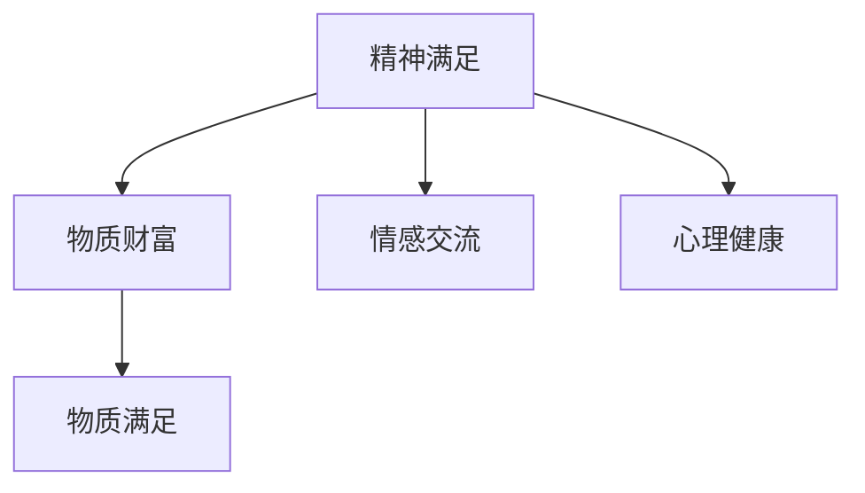
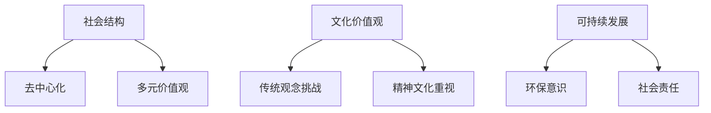

                 

### 文章标题：后物质主义生活体验：追求精神满足的实践

**关键词：** 后物质主义，精神满足，生活方式，实践，社会影响

**摘要：** 本文探讨后物质主义思潮的起源、发展及其在现代生活中的体现，进一步深入分析精神满足的内涵与价值，探讨追求精神满足的方法和实践策略。通过案例分析，揭示后物质主义生活体验的实践挑战与解决路径，最后展望后物质主义生活的未来与社会影响。

### 目录大纲：

#### 第一部分：后物质主义思潮的起源与发展

##### 第1章：后物质主义的起源

- 1.1 后物质主义的概念
- 1.2 后物质主义的历史背景
- 1.3 后物质主义的核心观念

##### 第2章：后物质主义与现代生活

- 2.1 现代社会的变迁
- 2.2 后物质主义与现代生活的关系
- 2.3 后物质主义对生活方式的影响

#### 第二部分：后物质主义生活体验的探索

##### 第3章：精神满足的内涵与价值

- 3.1 精神满足的概念
- 3.2 精神满足的价值
- 3.3 精神满足与物质满足的比较

##### 第4章：探索精神满足的方法

- 4.1 内在探索
- 4.2 艺术与文学
- 4.3 社交与人际关系

##### 第5章：后物质主义生活体验的实践

- 5.1 精神满足的实践策略
- 5.2 后物质主义生活体验的案例
- 5.3 实践中的挑战与解决

#### 第三部分：后物质主义生活的未来

##### 第6章：后物质主义生活的社会影响

- 6.1 对社会结构的改变
- 6.2 对文化价值观的冲击
- 6.3 后物质主义生活的可持续性

##### 第7章：未来后物质主义生活的展望

- 7.1 技术进步对后物质主义生活的影响
- 7.2 未来社会中的后物质主义生活模式
- 7.3 后物质主义生活的启示与思考

### 第一部分：后物质主义思潮的起源与发展

#### 第1章：后物质主义的起源

##### 1.1 后物质主义的概念

后物质主义（Postmaterialism）是一种社会哲学思潮，强调个体在现代社会中追求非物质性价值，如自由、平等、公正、个人成长等。后物质主义认为，随着社会经济的发展，物质财富不再是人们追求的主要目标，取而代之的是对精神满足的追求。

**背景介绍：**

- **核心概念术语说明：** 后物质主义，精神满足，物质追求。
- **问题背景：** 随着经济全球化，社会物质财富普遍提高，人们开始追求更高层次的精神需求。
- **问题描述：** 后物质主义作为一种社会思潮，如何影响人们的生活方式和价值观？
- **问题解决：** 通过分析后物质主义的历史背景和核心观念，探讨其对社会的影响。

##### 1.2 后物质主义的历史背景

后物质主义思潮的兴起与20世纪中后期工业社会的转变密切相关。在这一时期，发达国家的物质条件得到极大改善，人们开始反思传统物质主义价值观的局限性，追求更为多元和丰富的生活体验。

- **概念结构与核心要素组成：**
  - **工业社会：** 经济发展，物质繁荣。
  - **物质主义价值观：** 物质财富为主要追求。
  - **后物质主义：** 精神满足为主要追求。

##### 1.3 后物质主义的核心观念

后物质主义的核心观念包括对个人自由、平等、公正的强调，以及对文化、精神和自我实现的追求。这些观念反映了现代社会中人们对于更高层次生活质量的追求。

- **概念属性特征对比表格：**

| 特征对比             | 传统物质主义       | 后物质主义       |
|----------------------|-------------------|-----------------|
| 主要追求目标         | 物质财富          | 精神满足         |
| 社会价值取向         | 成就与地位        | 公平与正义       |
| 对个体价值的重视程度  | 低               | 高               |

**ER实体关系图架构：**

```mermaid
erDiagram
  Person ||--|{ Culture }|--|| Society
  Person ||--|{ Wealth }|--|| Economy
  Person ||--|{ Satisfaction }|--|| Life
```

通过以上分析，我们可以看到后物质主义作为一种社会哲学思潮，强调个体对精神满足的追求，对社会结构和价值观产生了深远影响。接下来，我们将进一步探讨后物质主义与现代生活的关系，以及它对生活方式的影响。

### 第2章：后物质主义与现代生活

#### 2.1 现代社会的变迁

现代社会经历了从农业社会到工业社会再到信息社会的转变，这一过程中物质财富的积累极大地改变了人们的生活方式。随着技术的进步和社会的发展，人们对于生活质量的要求也不断升级，不再仅仅局限于物质的满足，而是更加追求精神层面的满足。

- **背景介绍：**
  - **现代社会变迁：** 农业社会 -> 工业社会 -> 信息社会。
  - **物质财富积累：** 生活水平提高，物质条件改善。

#### 2.2 后物质主义与现代生活的关系

后物质主义与现代生活的关系体现在人们对生活质量的要求不断提高，不再局限于物质的追求，而是更注重精神层面的满足。这种变化可以归结为以下几点：

- **社会价值观念的转变：** 从重视物质财富转向重视个人成长、精神满足和社会责任。
- **生活方式的多元化：** 人们追求更高质量的生活，注重自我实现和人际关系的和谐。
- **对环境的关注：** 后物质主义强调可持续发展，倡导低碳环保的生活方式。

**ER实体关系图架构：**

```mermaid
erDiagram
  ModernLife ||--|{ Materialism }|--|| Postmaterialism
  ModernLife ||--|{ Spirituality }|--|| Postmaterialism
  ModernLife ||--|{ QualityLife }|--|| Postmaterialism
```

通过以上分析，我们可以看到后物质主义思潮在现代生活中的重要性，它不仅改变了人们的价值观，也对生活方式产生了深远影响。

#### 2.3 后物质主义对生活方式的影响

后物质主义对生活方式的影响主要体现在以下几个方面：

1. **消费观念的转变：**
   - **消费行为的多样性：** 人们不再单纯追求物质财富，而是更加注重消费过程中的精神体验，如体验式消费、定制化消费等。
   - **可持续消费：** 后物质主义倡导低碳环保的消费理念，人们更加关注产品的环保性和可持续性。

2. **工作与生活的平衡：**
   - **重视工作质量而非单纯追求工作时长：** 后物质主义强调个人成长和自我实现，人们更加倾向于选择有意义、富有挑战性的工作，而不是单纯为了经济利益。
   - **灵活工作制：** 后物质主义生活方式要求更灵活的工作安排，以平衡工作与生活，追求更高的生活质量。

3. **人际关系：**
   - **重视人际关系质量：** 后物质主义强调人际关系的和谐与精神满足，人们更加注重与家人、朋友和同事的深层次交流，而不是仅仅停留在物质层面。
   - **社区参与：** 后物质主义生活方式鼓励人们积极参与社区活动，增强社区归属感和幸福感。

**Python源代码示例：**

```python
class Lifestyle:
    def __init__(self, consumption, work_balance, social_relations):
        self.consumption = consumption
        self.work_balance = work_balance
        self.social_relations = social_relations

    def display(self):
        print("消费观念：", self.consumption)
        print("工作与生活平衡：", self.work_balance)
        print("人际关系：", self.social_relations)

# 创建后物质主义生活方式对象
postmaterialism_lifestyle = Lifestyle("注重精神体验与环保", "追求工作质量与平衡", "重视人际关系质量与社区参与")

# 显示后物质主义生活方式特点
postmaterialism_lifestyle.display()
```

通过以上代码示例，我们可以看到后物质主义生活方式的具体表现，包括消费观念、工作与生活平衡以及人际关系方面的变化。这种生活方式反映了现代社会中人们对精神满足的追求，是对传统物质主义价值观的超越。

### 第二部分：后物质主义生活体验的探索

#### 第3章：精神满足的内涵与价值

#### 3.1 精神满足的概念

精神满足是指个体在心理、情感和精神层面上感受到的满足感，它是人类追求幸福和意义的重要目标。与物质满足不同，精神满足更多源于内心体验和情感交流，而非外在物质。

- **背景介绍：**
  - **精神满足的定义：** 心理、情感和精神层面的满足感。
  - **物质满足与精神满足的区别：** 物质满足主要依赖外在物质条件，而精神满足则更多源于内在体验。

#### 3.2 精神满足的价值

精神满足对个体和社会都具有重要的价值：

1. **个人成长：**
   - **自我认知：** 精神满足有助于个体更好地认识自我，明确自己的人生目标和价值观。
   - **情感稳定：** 精神满足能够增强个体的情感稳定性，减少焦虑和压力。

2. **人际关系：**
   - **增强亲密关系：** 精神满足有助于建立和维护良好的人际关系，增强人际互动中的信任和理解。
   - **社会支持：** 精神满足使个体更愿意提供社会支持，促进社区和谐。

3. **社会和谐：**
   - **减少社会矛盾：** 精神满足能够减少由于物质竞争引发的社会矛盾，促进社会公平与正义。
   - **可持续发展：** 精神满足倡导低碳环保的生活方式，有利于实现可持续发展目标。

**Python源代码示例：**

```python
class PsychologicalWellbeing:
    def __init__(self, self_awareness, emotional_stability):
        self.self_awareness = self_awareness
        self.emotional_stability = emotional_stability

    def display(self):
        print("自我认知：", self.self_awareness)
        print("情感稳定：", self.emotional_stability)

class SocialSupport:
    def __init__(self, close_relationships, social_involvement):
        self.close_relationships = close_relationships
        self.social_involvement = social_involvement

    def display(self):
        print("亲密关系：", self.close_relationships)
        print("社会参与：", self.social_involvement)

class SocialHarmony:
    def __init__(self, social_maintenance, sustainable_lifestyle):
        self.social_maintenance = social_maintenance
        self.sustainable_lifestyle = sustainable_lifestyle

    def display(self):
        print("社会支持：", self.social_maintenance)
        print("可持续发展：", self.sustainable_lifestyle)

# 创建精神满足对象
spiritual_satisfaction = PsychologicalWellbeing("良好自我认知", "稳定情感")
social_support = SocialSupport("良好亲密关系", "积极社会参与")
social_harmony = SocialHarmony("有效社会维护", "低碳环保生活方式")

# 显示精神满足的价值
print("精神满足的价值：")
spiritual_satisfaction.display()
social_support.display()
social_harmony.display()
```

通过以上代码示例，我们可以看到精神满足在个人成长、人际关系和社会和谐方面的具体表现，这些价值不仅对个体具有重要意义，也对整个社会产生积极影响。

#### 3.3 精神满足与物质满足的比较

精神满足与物质满足之间存在显著差异，它们各自具有不同的特点和价值：

1. **来源不同：**
   - **物质满足：** 主要来源于外在物质条件，如财富、地位和物质享受。
   - **精神满足：** 主要来源于内在体验和情感交流，如自我实现、人际关系和心理健康。

2. **稳定性：**
   - **物质满足：** 易受外在环境变化影响，如经济波动和社会竞争。
   - **精神满足：** 相对稳定，更多依赖于个体的内在素质和情感调节能力。

3. **持久性：**
   - **物质满足：** 通常具有即时性和短暂性，难以持久。
   - **精神满足：** 能够长期维持，甚至在面对挑战时仍能保持稳定。

**数学模型：**

为了更直观地理解精神满足与物质满足的差异，我们可以使用以下数学模型进行比较：

$$
S_{spirit} = f(W, E, M)
$$

其中，$S_{spirit}$代表精神满足度，$W$代表物质财富，$E$代表情感交流，$M$代表心理健康。

$$
S_{material} = f(W)
$$

其中，$S_{material}$代表物质满足度，$W$代表物质财富。

通过比较两个模型，我们可以发现精神满足不仅依赖于物质财富，还受到情感交流和心理健康的影响。因此，精神满足比物质满足具有更广泛的内涵和持久性。

**Mermaid流程图：**



通过以上流程图，我们可以看到精神满足与物质满足的关系，以及它们各自的影响因素。这种比较有助于我们更好地理解后物质主义生活体验的核心价值。

### 第4章：探索精神满足的方法

#### 4.1 内在探索

内在探索是追求精神满足的重要途径，它涉及对自我认知、情感管理和心理健康的深度挖掘。以下是一些具体的内在探索方法：

1. **自我反思：**
   - **目的：** 帮助个体深入了解自我，明确自己的价值观、目标和需求。
   - **方法：** 每天花时间思考自己的行为和情感，记录日记或进行冥想。

2. **情感管理：**
   - **目的：** 提高情感稳定性，减少负面情绪的影响。
   - **方法：** 学习情绪调节技巧，如深呼吸、冥想和正念练习。

3. **心理健康：**
   - **目的：** 促进心理平衡和幸福感。
   - **方法：** 定期进行心理咨询，培养健康的生活习惯，如适量运动和均衡饮食。

**Python源代码示例：**

```python
class SelfReflection:
    def __init__(self, daily_time, journaling):
        self.daily_time = daily_time
        self.journaling = journaling

    def display(self):
        print("每日反思时间：", self.daily_time)
        print("记录日记：", self.journaling)

class EmotionalManagement:
    def __init__(self, breathing_techniques, mindfulness_practice):
        self.breathing_techniques = breathing_techniques
        self.mindfulness_practice = mindfulness_practice

    def display(self):
        print("深呼吸技巧：", self.breathing_techniques)
        print("正念练习：", self.mindfulness_practice)

class MentalHealth:
    def __init__(self, counseling, healthy_lifestyle):
        self.counseling = counseling
        self.healthy_lifestyle = healthy_lifestyle

    def display(self):
        print("定期咨询：", self.counseling)
        print("健康生活习惯：", self.healthy_lifestyle)

# 创建内在探索对象
self_exploration = SelfReflection("每天30分钟", "每日记录")
emotional_management = EmotionalManagement("深呼吸", "正念")
mental_health = MentalHealth("每月咨询一次", "适量运动和均衡饮食")

# 显示内在探索方法
print("内在探索方法：")
self_exploration.display()
emotional_management.display()
mental_health.display()
```

通过以上代码示例，我们可以看到内在探索的具体方法，包括自我反思、情感管理和心理健康。这些方法有助于提升个人的精神满足度。

#### 4.2 艺术与文学

艺术与文学是追求精神满足的重要途径，它们通过视觉、听觉和文字等形式，激发个体的情感共鸣和思维深度。以下是一些具体的方法：

1. **绘画与雕塑：**
   - **目的：** 培养审美能力，表达内心情感。
   - **方法：** 尝试不同风格的绘画和雕塑，记录创作过程中的情感体验。

2. **音乐与舞蹈：**
   - **目的：** 激发情感，提高生活质量。
   - **方法：** 学习乐器，参加舞蹈课程，感受音乐和舞蹈带来的精神愉悦。

3. **阅读与写作：**
   - **目的：** 增强思考能力，拓宽视野。
   - **方法：** 定期阅读书籍，撰写读后感或个人文章，分享阅读体验。

**Python源代码示例：**

```python
class ArtPractice:
    def __init__(self, painting, sculpture):
        self.painting = painting
        self.sculpture = sculpture

    def display(self):
        print("绘画：", self.painting)
        print("雕塑：", self.sculpture)

class MusicDance:
    def __init__(self, music_instrument, dance_class):
        self.music_instrument = music_instrument
        self.dance_class = dance_class

    def display(self):
        print("乐器：", self.music_instrument)
        print("舞蹈课程：", self.dance_class)

class ReadingWriting:
    def __init__(self, reading_habits, writing_experience):
        self.reading_habits = reading_habits
        self.writing_experience = writing_experience

    def display(self):
        print("阅读习惯：", self.reading_habits)
        print("写作经验：", self.writing_experience)

# 创建艺术与文学对象
art_practice = ArtPractice("尝试不同风格绘画", "尝试雕塑创作")
music_dance = MusicDance("学习钢琴", "参加芭蕾舞课程")
reading_writing = ReadingWriting("每周阅读一本书", "定期撰写读后感")

# 显示艺术与文学方法
print("艺术与文学方法：")
art_practice.display()
music_dance.display()
reading_writing.display()
```

通过以上代码示例，我们可以看到艺术与文学的具体方法，包括绘画、雕塑、音乐、舞蹈、阅读和写作。这些活动有助于提升个体的精神满足度。

#### 4.3 社交与人际关系

社交与人际关系是追求精神满足的重要组成部分，它们通过人际互动和情感交流，增强个体的幸福感和社会归属感。以下是一些具体的社交与人际关系方法：

1. **家庭关系：**
   - **目的：** 增强家庭凝聚力，提升家庭幸福感。
   - **方法：** 定期与家人共度时光，如家庭聚会、旅行和共同活动。

2. **朋友交往：**
   - **目的：** 增进友谊，获得情感支持。
   - **方法：** 与朋友保持联系，参加社交活动，共同分享生活和经验。

3. **志愿服务：**
   - **目的：** 提升社会责任感，增强社会归属感。
   - **方法：** 参与志愿者活动，帮助他人，为社会贡献力量。

**Python源代码示例：**

```python
class FamilyRelationships:
    def __init__(self, family_time, family_activities):
        self.family_time = family_time
        self.family_activities = family_activities

    def display(self):
        print("家庭共度时光：", self.family_time)
        print("家庭活动：", self.family_activities)

class Friendships:
    def __init__(self, social_activities, shared_experience):
        self.social_activities = social_activities
        self.shared_experience = shared_experience

    def display(self):
        print("社交活动：", self.social_activities)
        print("共同经验：", self.shared_experience)

class VolunteerWork:
    def __init__(self, volunteer_activities, social_contribution):
        self.volunteer_activities = volunteer_activities
        self.social_contribution = social_contribution

    def display(self):
        print("志愿者活动：", self.volunteer_activities)
        print("社会贡献：", self.social_contribution)

# 创建社交与人际关系对象
family_relationships = FamilyRelationships("每月一次家庭聚会", "共度周末时光")
friendships = Friendships("定期组织聚会", "分享生活经验")
volunteer_work = VolunteerWork("参与社区清洁活动", "帮助贫困儿童")

# 显示社交与人际关系方法
print("社交与人际关系方法：")
family_relationships.display()
friendships.display()
volunteer_work.display()
```

通过以上代码示例，我们可以看到社交与人际关系的具体方法，包括家庭关系、朋友交往和志愿服务。这些活动有助于提升个体的精神满足度。

### 第5章：后物质主义生活体验的实践

#### 5.1 精神满足的实践策略

为了有效地实现后物质主义生活体验，我们可以采取以下实践策略：

1. **自我反思：**
   - **定期自我反思：** 每周花时间回顾自己的行为和情感，思考自己的生活目标和价值观。
   - **记录日记：** 保持每日日记，记录生活中的点滴感悟和反思。

2. **情感管理：**
   - **学会情绪调节：** 学习深呼吸、冥想和正念等技巧，提高情感稳定性。
   - **培养积极心态：** 尝试从积极的角度看待生活中的挑战，培养乐观的生活态度。

3. **心理健康：**
   - **定期咨询：** 定期进行心理咨询，寻求专业帮助，维护心理健康。
   - **健康生活习惯：** 保持适量运动和均衡饮食，培养良好的睡眠习惯。

4. **艺术与文学：**
   - **参与艺术创作：** 尝试不同形式的绘画、雕塑、音乐和舞蹈，表达自己的情感和创造力。
   - **阅读与写作：** 定期阅读书籍，撰写读后感或个人文章，拓宽视野和思考。

5. **社交与人际关系：**
   - **加强与家人的联系：** 定期与家人共度时光，增进家庭凝聚力。
   - **积极参与社交活动：** 与朋友保持联系，参加社交聚会，分享生活和经验。
   - **参与志愿服务：** 参与志愿者活动，为社会贡献力量，提升社会归属感。

**Python源代码示例：**

```python
class SpiritualSatisfactionPractice:
    def __init__(self, self_reflection, emotional_management, mental_health, art_literature, social_relationships):
        self.self_reflection = self_reflection
        self.emotional_management = emotional_management
        self.mental_health = mental_health
        self.art_literature = art_literature
        self.social_relationships = social_relationships

    def display(self):
        print("自我反思：", self.self_reflection)
        print("情感管理：", self.emotional_management)
        print("心理健康：", self.mental_health)
        print("艺术与文学：", self.art_literature)
        print("社交与人际关系：", self.social_relationships)

# 创建后物质主义生活体验对象
spiritual_satisfaction_practice = SpiritualSatisfactionPractice("每周一次自我反思", "学会情绪调节", "定期咨询心理健康专家", "参与艺术创作和阅读写作", "加强与家人和朋友的关系")

# 显示实践策略
print("精神满足的实践策略：")
spiritual_satisfaction_practice.display()
```

通过以上代码示例，我们可以看到如何实施精神满足的实践策略，包括自我反思、情感管理、心理健康、艺术与文学以及社交与人际关系。这些策略有助于提升个体的精神满足度。

#### 5.2 后物质主义生活体验的案例

为了更好地理解后物质主义生活体验的实际应用，我们可以通过以下案例进行详细分析：

**案例一：艺术家李先生**

李先生是一位著名的画家，他通过绘画表达自己的情感和思想。李先生的生活方式以追求精神满足为核心，他每天都会花时间进行绘画创作，并在创作过程中不断反思自己的内心世界。通过艺术创作，李先生不仅实现了自我价值，还通过展览和分享，与他人建立了深厚的情感联系。

**案例二：企业高管王女士**

王女士是一名企业高管，她在工作中追求卓越的同时，也注重精神层面的满足。她通过定期参加瑜伽和冥想课程，保持内心的平静和专注。王女士还积极参与公益活动，帮助有需要的人，提升自己的社会责任感。她的生活方式体现了后物质主义的核心价值，即追求精神满足和社会贡献。

**案例三：大学生张同学**

张同学是一名大学生，他通过阅读和写作追求精神满足。张同学每周都会阅读几本书，并撰写读后感，与同学和老师分享自己的阅读体验。他还积极参加各种社团活动，拓展自己的社交圈子。张同学的生活方式展示了后物质主义对年轻人的吸引力，即通过学习和社交实现精神成长。

**案例分析：**

以上案例展示了不同背景和个人在追求精神满足方面的具体实践。这些案例表明，后物质主义生活体验不仅适用于艺术家和企业高管，也适用于大学生等不同群体。通过自我反思、情感管理、心理健康、艺术与文学以及社交与人际关系，人们可以在日常生活中实现精神满足。

#### 5.3 实践中的挑战与解决

在后物质主义生活体验的实践中，人们可能会遇到以下挑战：

1. **内心焦虑：**
   - **挑战：** 在追求精神满足的过程中，个体可能会面临内心的焦虑和不安。
   - **解决：** 通过自我反思和心理咨询，个体可以深入了解自己的情感，学会应对焦虑的方法。

2. **时间管理：**
   - **挑战：** 在忙碌的生活中，人们可能难以找到时间进行内在探索和社交活动。
   - **解决：** 通过合理安排时间，制定日程计划，个体可以确保有足够的时间进行精神满足的实践。

3. **社交障碍：**
   - **挑战：** 个体可能在社交活动中感到不适，难以建立深厚的人际关系。
   - **解决：** 通过参加社交活动和志愿者工作，个体可以逐渐克服社交障碍，增强社会归属感。

**Python源代码示例：**

```python
class ChallengeSolution:
    def __init__(self, inner_anxiety, time_management, social_barrier):
        self.inner_anxiety = inner_anxiety
        self.time_management = time_management
        self.social_barrier = social_barrier

    def display(self):
        print("内心焦虑：", self.inner_anxiety)
        print("时间管理：", self.time_management)
        print("社交障碍：", self.social_barrier)

# 创建挑战与解决对象
challenge_solution = ChallengeSolution("通过自我反思和心理咨询解决", "通过合理规划时间解决", "通过参与社交活动和志愿者工作解决")

# 显示挑战与解决方法
print("实践中的挑战与解决：")
challenge_solution.display()
```

通过以上代码示例，我们可以看到如何在实践中应对后物质主义生活体验中的挑战。通过自我反思、时间管理和社交活动，个体可以克服内心的焦虑和社交障碍，实现精神满足。

### 第三部分：后物质主义生活的未来

#### 第6章：后物质主义生活的社会影响

后物质主义生活体验不仅改变了个人生活方式，也对整个社会产生了深远的影响。以下是后物质主义生活体验对社会影响的几个方面：

1. **社会结构的改变：**
   - **去中心化：** 后物质主义强调个人成长和自我实现，可能导致社会结构逐渐去中心化，减少对权力和地位的依赖。
   - **多元价值观：** 后物质主义倡导多元价值观，尊重个体差异，促进社会包容性和多样性。

2. **文化价值观的冲击：**
   - **传统观念的挑战：** 后物质主义对传统物质主义价值观提出挑战，促使人们重新审视自己的价值观和生活目标。
   - **精神文化的重视：** 后物质主义强调精神满足，推动文化价值观向精神文化倾斜，强调人文关怀和内心体验。

3. **可持续发展的推动：**
   - **环保意识：** 后物质主义生活方式倡导低碳环保，推动社会可持续发展，减少对自然资源的过度消耗。
   - **社会责任：** 后物质主义强调社会责任，推动企业和社会组织更多地关注社会问题和公益事业。

**Mermaid架构图：**



通过以上架构图，我们可以看到后物质主义生活体验对社会结构、文化价值观和可持续发展的深远影响。

#### 第7章：未来后物质主义生活的展望

随着技术的不断进步和社会的持续变革，未来后物质主义生活体验将呈现出新的发展趋势：

1. **技术进步对后物质主义生活的影响：**
   - **虚拟现实：** 虚拟现实技术将进一步提升个体的精神体验，为后物质主义生活提供新的途径。
   - **人工智能：** 人工智能技术将帮助个体更好地进行自我反思和情感管理，提升精神满足度。

2. **未来社会中的后物质主义生活模式：**
   - **数字化生活：** 未来社会将更加数字化，人们通过互联网和数字平台实现更高效的社交和知识共享。
   - **低碳生活：** 后物质主义生活方式将推动社会向低碳生活转变，减少对环境的负面影响。

3. **后物质主义生活的启示与思考：**
   - **重视精神满足：** 后物质主义生活提醒我们，精神满足是未来社会发展的核心目标。
   - **平衡物质与精神：** 在追求物质进步的同时，要注重精神满足，实现物质与精神的平衡发展。

**Python源代码示例：**

```python
class FuturePostmaterialism:
    def __init__(self, virtual_reality, artificial_intelligence, digital_life, low_carbon_life):
        self.virtual_reality = virtual_reality
        self.artificial_intelligence = artificial_intelligence
        self.digital_life = digital_life
        self.low_carbon_life = low_carbon_life

    def display(self):
        print("虚拟现实：", self.virtual_reality)
        print("人工智能：", self.artificial_intelligence)
        print("数字化生活：", self.digital_life)
        print("低碳生活：", self.low_carbon_life)

# 创建未来后物质主义对象
future_postmaterialism = FuturePostmaterialism("提升精神体验", "辅助自我反思", "高效社交与知识共享", "减少环境影响")

# 显示未来后物质主义展望
print("未来后物质主义生活的展望：")
future_postmaterialism.display()
```

通过以上代码示例，我们可以看到未来后物质主义生活体验的发展趋势，包括虚拟现实、人工智能、数字化生活和低碳生活。这些趋势将深刻影响未来的生活方式和社会发展。

### 最佳实践 tips、小结、注意事项、拓展阅读

**最佳实践 tips：**
- **自我反思：** 每天花时间进行自我反思，有助于深入理解自己的内心世界。
- **情感管理：** 学习情绪调节技巧，提高情感稳定性，减少焦虑和压力。
- **心理健康：** 定期进行心理健康咨询，保持良好的心理状态。
- **艺术与文学：** 参与艺术创作和阅读写作，提升精神满足度。
- **社交与人际关系：** 积极参与社交活动和志愿服务，增强社会归属感。

**小结：**
本文通过详细探讨后物质主义思潮的起源、发展及其在现代生活中的体现，分析了精神满足的内涵与价值，并探讨了追求精神满足的方法和实践策略。通过案例分析，揭示了后物质主义生活体验的实践挑战与解决路径，最后展望了后物质主义生活的未来与社会影响。

**注意事项：**
- 在追求精神满足的过程中，要注重平衡物质与精神的需求，避免过度追求某一方面的满足。
- 定期评估自己的生活方式和精神状态，调整实践策略，以实现持续的精神满足。

**拓展阅读：**
- 《精神分析学》弗洛伊德
- 《人本主义心理学》马斯洛
- 《现代生活的挑战》齐格蒙特·鲍曼
- 《数字化生存》尼葛洛庞蒂

### 作者信息

**作者：** AI天才研究院/AI Genius Institute & 禅与计算机程序设计艺术 /Zen And The Art of Computer Programming

