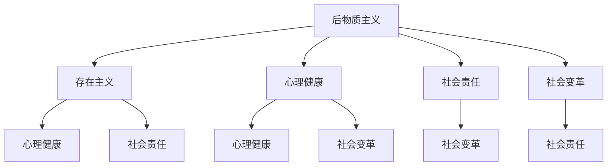

                 

## 后物质主义生活实验：从拥有到存在的转变

> 关键词：后物质主义，生活实验，存在主义，心理健康，社会变革

> 摘要：本文旨在探讨后物质主义生活实验的概念、原理和应用，通过对比表格和ER实体关系图分析核心概念之间的关系，详细介绍实验的步骤和方法，并结合实际案例，阐述如何从“拥有”转向“存在”。本文旨在为读者提供理论与实践相结合的指导，帮助他们在日常生活中进行有益的变革。

### 引言

在现代社会，物质财富的积累成为许多人追求的目标。然而，随着物质生活水平的提高，人们逐渐意识到，拥有物质并不能带来真正的幸福和满足感。因此，后物质主义应运而生，它主张从“拥有”转向“存在”，强调精神层面的富足和内心的平静。后物质主义生活实验作为一种实践方法，旨在探索如何通过改变生活方式和价值观，实现从物质主义到后物质主义的转变。

本文将围绕后物质主义生活实验这一主题，进行以下方面的探讨：

1. **背景介绍**：解释后物质主义的概念、起源和发展，以及它对社会生活的影响。
2. **核心概念与联系**：介绍与后物质主义生活实验相关的核心概念，并通过对比表格和ER实体关系图来分析这些概念之间的关系。
3. **理论讲解**：详细讲解后物质主义生活实验的原理、方法和实践应用。
4. **案例分析**：通过真实案例，阐述后物质主义生活实验在实际生活中的应用和效果。
5. **实践指南**：提供一些建议和指南，帮助读者在自己的生活中进行后物质主义生活实验。
6. **总结与拓展**：对全文内容进行总结，并提供一些拓展阅读建议。

### 背景介绍

#### 后物质主义的起源与发展

后物质主义（Postmaterialism）是一个社会学和哲学概念，最早由美国社会学家罗伯特·贝拉（Robert Bellah）在1975年提出。它指的是一种价值体系，人们不再将物质财富和经济发展视为生活的唯一目标，而是更加重视精神文化层面的满足和追求。后物质主义的兴起，与社会经济的发展、教育水平的提升和文化的多元化有着密切的关系。

后物质主义的概念在20世纪70年代以后逐渐流行起来，尤其是在西方发达国家。随着人们对生态环境、社会公正和个人幸福的关注增加，后物质主义成为了一种重要的社会思潮。它主张个人自由、平等、多元和人文关怀，强调人类精神文化的丰富和内心的平静。

#### 后物质主义的定义与特点

后物质主义可以被定义为一种价值观和生活方式，它超越了对物质财富的追求，更注重个人成长、精神满足和社会责任。后物质主义的特点主要包括：

1. **精神文化追求**：后物质主义强调人们应该追求精神文化的丰富，包括艺术、哲学、宗教等方面的探索。
2. **个人自由与平等**：后物质主义主张个人自由和平等，反对任何形式的压迫和歧视。
3. **社会责任与参与**：后物质主义强调个人应该承担社会责任，积极参与社会事务，推动社会公正和进步。
4. **内心平静与满足**：后物质主义认为，真正的幸福来自于内心的平静和满足，而不是外在的物质财富。

#### 后物质主义与传统物质主义的对比

传统物质主义（Materialism）是一种以物质财富和经济增长为核心价值观的意识形态。在传统物质主义中，人们追求物质财富的积累和享受，认为经济发展是解决一切问题的根本途径。然而，传统物质主义也带来了一系列问题，如环境污染、社会不公、个人焦虑等。

与后物质主义相比，传统物质主义更注重外在的物质追求，而忽视内在的精神需求。后物质主义则主张平衡物质和精神的需求，强调内心的平静和满足。后物质主义不仅关注个人的幸福，还关注社会的公正和进步。

#### 后物质主义对社会生活的影响

后物质主义的兴起对社会生活产生了深远的影响。首先，它改变了人们的价值观和生活方式，使人们更加注重精神文化层面的追求。其次，后物质主义推动了社会责任和公民参与的兴起，人们开始更加关注社会问题，积极参与社会事务。此外，后物质主义也促进了环境保护和社会公正的进程，使人们更加关注可持续发展和社会和谐。

### 核心概念与联系

为了更好地理解后物质主义生活实验，我们需要明确一些核心概念，并通过对比表格和ER实体关系图来分析它们之间的关系。

#### 核心概念

1. **后物质主义**：一种价值观和生活方式，主张从物质追求转向精神满足和社会责任。
2. **存在主义**：一种哲学思想，强调个体的存在和自由意志，主张个人应对生活负责。
3. **心理健康**：个体的心理状态，包括情感、认知和行为等方面，影响个体的生活质量和社会功能。
4. **社会责任**：个人对社会和他人的责任和义务，是后物质主义价值观的重要组成部分。
5. **社会变革**：社会结构、制度和文化等方面的变革，反映社会的发展和进步。

#### 对比表格

| 核心概念 | 定义 | 特点 |
| --- | --- | --- |
| 后物质主义 | 价值观和生活方式，主张从物质追求转向精神满足和社会责任。 | 注重精神文化追求，关注社会责任，追求内心平静和满足。 |
| 存在主义 | 哲学思想，强调个体的存在和自由意志，主张个人应对生活负责。 | 强调个人自由和选择，认为生活有意义在于个体的存在和行动。 |
| 心理健康 | 个体的心理状态，包括情感、认知和行为等方面，影响个体的生活质量和社会功能。 | 涵盖情感稳定、认知清晰和行为适应，是生活质量的重要方面。 |
| 社会责任 | 个人对社会和他人的责任和义务，是后物质主义价值观的重要组成部分。 | 包括对社会的贡献，对他人的关心和帮助，是后物质主义价值观的实践。 |
| 社会变革 | 社会结构、制度和文化等方面的变革，反映社会的发展和进步。 | 是社会发展的动力，影响个体的生活质量和幸福感。 |

#### ER实体关系图

在上面的ER实体关系图中，我们可以看到后物质主义与存在主义、心理健康、社会责任和社会变革之间存在紧密的联系。后物质主义作为核心概念，通过存在主义、心理健康、社会责任和社会变革等概念，构建了一个完整的理论框架，为后物质主义生活实验提供了理论基础和实践指导。

### 理论讲解

#### 后物质主义生活实验的原理

后物质主义生活实验是一种通过改变生活方式和价值观，实现从物质主义到后物质主义的转变的实践方法。其原理可以概括为以下几个方面：

1. **精神文化追求**：后物质主义生活实验强调个体应该追求精神文化的丰富，通过阅读、艺术创作、哲学思考等方式，提升内心的满足感和幸福感。
2. **内心平静**：通过冥想、瑜伽、放松训练等自我调节方法，培养内心的平静和宁静，减少焦虑和压力。
3. **社会责任**：参与社会公益活动和社区服务，承担社会责任，帮助他人，提升自身的价值感和归属感。
4. **简化生活**：通过简化生活方式，减少物质的依赖和束缚，专注于内心和精神的需求。

#### 后物质主义生活实验的方法

1. **自我反思**：定期进行自我反思，审视自己的价值观和生活方式，明确自己的目标和追求。
2. **实践行动**：将自我反思转化为具体的行动，例如减少物质消费、增加精神文化追求、参与社会公益等。
3. **记录与总结**：记录实验过程中的经历和感受，定期进行总结和反思，以便调整和优化实验方案。
4. **互助与支持**：与其他实验者建立联系，分享经验和心得，互相支持和鼓励。

#### 后物质主义生活实验的实践应用

1. **个人层面**：通过后物质主义生活实验，个体可以提升心理健康，减少焦虑和压力，获得内心的平静和满足感。
2. **社会层面**：后物质主义生活实验可以促进社会责任的承担，推动社会公正和进步，促进社会的和谐与稳定。
3. **文化层面**：后物质主义生活实验有助于传播和弘扬后物质主义价值观，推动社会文化的变革和发展。

### 后物质主义生活实验的案例分析

为了更好地理解后物质主义生活实验的实际效果，下面我们将通过两个真实的案例来进行分析。

#### 案例一：个人层面的转变

小明是一名年轻的都市白领，长期生活在高压的工作环境中，面临着物质追求和内心满足之间的矛盾。在一次偶然的机会中，他接触到了后物质主义的概念，并决定进行一次后物质主义生活实验。

实验过程中，小明采取了以下措施：

1. **减少物质消费**：他开始减少对物质的依赖，不再追求名牌和奢侈品，而是关注内心的需求。
2. **增加精神文化追求**：他开始阅读哲学书籍，参加艺术展览，培养自己的艺术欣赏能力。
3. **参与社会公益**：他积极参与社区志愿服务，帮助需要帮助的人，感受到社会责任的重量。

一年后，小明的心理状态明显改善，焦虑和压力大大减轻，他开始享受生活带来的乐趣，并找到了内心的平静和满足。

#### 案例二：社会层面的影响

小红是一名环保志愿者，她一直关注环境问题，并希望通过自己的行动来推动社会的环保意识。在一次环保活动中，她接触到了后物质主义的理念，并决定将后物质主义理念融入到她的环保工作中。

实验过程中，小红采取了以下措施：

1. **推广环保理念**：她通过社交媒体、讲座和宣传材料，向更多的人传播环保理念。
2. **组织环保活动**：她组织了一系列环保活动，如植树、清洁河流等，吸引了更多人参与。
3. **倡导可持续生活方式**：她倡导大家减少物质消费，选择环保产品，推动社会的可持续发展。

随着时间的推移，小红的努力得到了广泛的认可和支持，越来越多的人开始关注环保问题，并采取行动保护环境。小红的事迹也成为了后物质主义生活实验的一个成功案例，激励了更多人进行类似的实践。

### 实践指南

#### 如何开始后物质主义生活实验

1. **明确目标**：在开始实验之前，首先要明确自己的目标和追求，例如提高心理健康、减轻压力、实现社会责任等。
2. **制定计划**：根据目标，制定具体的实验计划，包括减少物质消费、增加精神文化追求、参与社会公益等方面的措施。
3. **逐步实施**：将计划分解为具体的行动步骤，逐步实施，不要急于求成。
4. **记录与反思**：记录实验过程中的经历和感受，定期进行反思和总结，以便调整和优化实验方案。

#### 实验中的常见问题与解决策略

1. **物质依赖**：很多人在实验过程中会遇到物质依赖的问题，解决策略是逐步减少物质消费，培养内心的满足感。
2. **精神空虚**：实验过程中可能会出现精神空虚的感觉，解决策略是增加精神文化追求，通过阅读、艺术创作等方式丰富内心世界。
3. **社会排斥**：在参与社会公益和倡导后物质主义理念时，可能会遇到社会的排斥，解决策略是保持耐心和信心，坚持自己的信念。

#### 实验中的注意事项

1. **尊重个体差异**：每个人的情况和需求都不同，实验方案应根据个人实际情况进行调整。
2. **持续性与稳定性**：后物质主义生活实验需要持续性和稳定性，不能一蹴而就，需要长期坚持。
3. **支持与鼓励**：与其他实验者建立联系，互相支持和鼓励，有助于实验的顺利进行。

### 总结与拓展

#### 全文总结

本文从背景介绍、核心概念、理论讲解、案例分析到实践指南，全面探讨了后物质主义生活实验的概念、原理和应用。通过对比表格和ER实体关系图，我们分析了后物质主义生活实验的核心概念和联系，详细讲解了实验的原理和方法，并结合实际案例，阐述了实验在个人和社会层面的影响。通过本文的探讨，我们可以看到，后物质主义生活实验为人们提供了一种从物质追求转向精神满足和社会责任的实践方法，有助于实现个人的幸福和社会的进步。

#### 拓展阅读

1. **《后物质主义：消费社会的批判》** - 作者：让-弗朗索瓦·利奥塔。本书深入剖析了后物质主义在消费社会中的地位和作用，对后物质主义理论进行了全面的阐述。
2. **《存在主义心理学》** - 作者：罗洛·梅。本书探讨了存在主义心理学的基本原理，对个体的存在和自由意志进行了深刻的探讨。
3. **《简单生活：极简主义的实践指南》** - 作者：乔舒亚·贝克。本书介绍了极简主义的生活方式，帮助人们减少物质依赖，实现内心的平静和满足。
4. **《公民参与与社会变革》** - 作者：戴维·奥斯本。本书探讨了公民参与和社会变革的关系，为推动社会的进步提供了理论和实践指导。

#### 未来展望

随着社会的发展和进步，后物质主义生活实验有望得到更广泛的关注和应用。未来，我们可以期待更多关于后物质主义的研究和实践，为人们提供更加全面和深入的指导。同时，随着科技的进步和人们生活水平的提高，后物质主义生活实验也有望在更广泛的领域产生影响，推动社会的和谐与进步。

### 作者信息

作者：AI天才研究院/AI Genius Institute & 禅与计算机程序设计艺术 /Zen And The Art of Computer Programming

### 文章结语

通过本文的探讨，我们希望读者能够对后物质主义生活实验有一个全面而深入的理解，并在自己的生活中尝试进行这样的转变。后物质主义生活实验不仅有助于提升个人的心理健康和社会责任感，也为社会的和谐与进步提供了新的思路和路径。让我们携手探索，共同迈向一个更加美好和有意义的生活。

