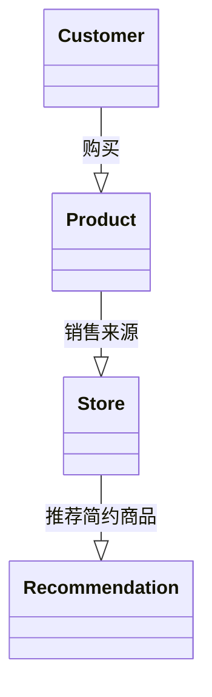
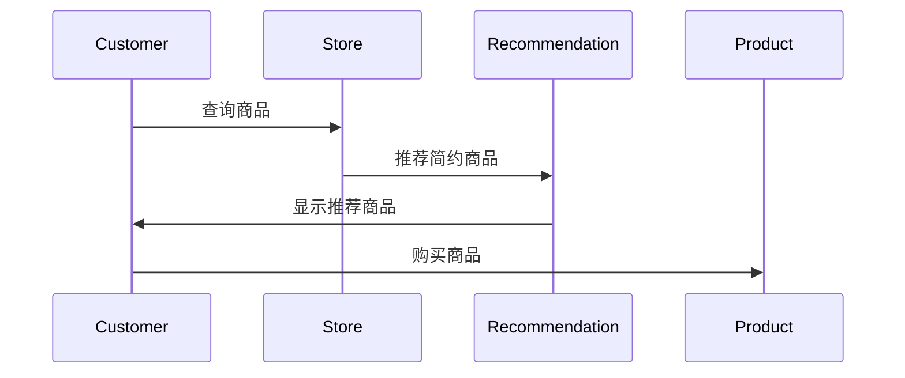
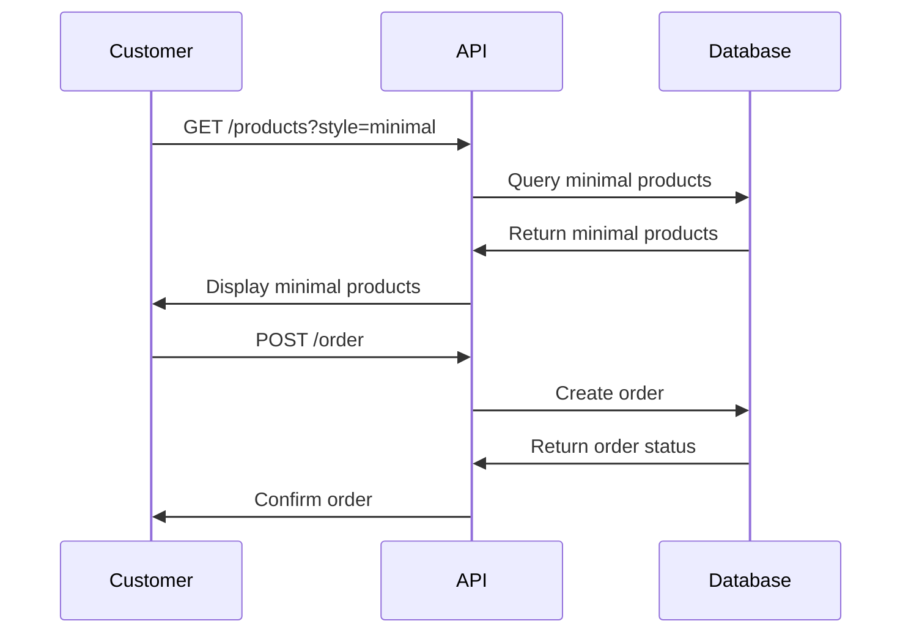

                 

## 《后物质主义生活美学：从简单中发现丰富》

### 关键词：后物质主义、生活美学、简约主义、生态意识、艺术与设计

> 摘要：本文将深入探讨后物质主义生活美学的核心观念与实践，通过一系列逻辑清晰的分析和实例讲解，揭示在物质富足的今天，如何通过简约主义、体验式消费和生态意识，从简单的日常生活中发现丰富的美学价值。

---

### 第一部分：后物质主义时代的理解

#### 第1章：后物质主义生活美学的兴起

##### 1.1 后物质主义时代的背景

随着社会的发展，人们开始从对物质的追求转向对生活质量的关注，这种转变标志着后物质主义时代的到来。后物质主义并非对物质的否定，而是对物质消费方式的反思和升级。

##### 1.2 生活美学的重要性

生活美学强调生活中的审美体验和精神满足，它不仅仅是物质层面的享受，更是心灵层面的愉悦。在这个时代，生活美学的重要性日益凸显。

##### 1.3 后物质主义生活美学的核心观念

后物质主义生活美学的核心观念包括简约主义、体验式消费和生态意识。这些观念共同构成了一个全新的生活哲学，引导人们在物质之外寻找生活的意义。

#### 第2章：后物质主义的核心概念解析

##### 2.1 后物质主义的基本定义

后物质主义是对物质主义的一种超越，强调非物质的价值观和生活方式。它不仅关注物质财富的积累，更注重精神层面的追求。

##### 2.2 后物质主义与消费主义的对比

消费主义注重物质消费，而后物质主义强调对消费的反思和简约。两者在价值观和生活态度上有着根本的区别。

##### 2.3 后物质主义的生活价值观

后物质主义的生活价值观倡导简单、自然、和谐的生活方式，强调人与自然的共生共荣。

#### 第3章：后物质主义下的生活美学原则

##### 3.1 简约主义的生活美学

简约主义追求简洁、纯净的美学风格，通过减少冗余元素，突出核心价值和美感。

##### 3.2 体验式消费的美学转变

体验式消费强调消费者的参与和体验，从传统的物质消费转向精神消费，实现生活美学的提升。

##### 3.3 生态意识与生活美学的融合

生态意识将环保理念融入生活美学，倡导低碳、环保的生活方式，实现生活与自然的和谐共生。

#### 第4章：从简单中发现丰富的艺术与设计

##### 4.1 简单主义的艺术风格

简单主义艺术风格以简洁、纯粹为特点，通过去除冗余，展现本质的美。

##### 4.2 设计中的简约美学

简约美学在设计中的应用，通过简约的设计语言，提升产品的审美价值和用户体验。

##### 4.3 艺术与设计的互动关系

艺术与设计的互动，不仅丰富了各自的表现形式，也促进了生活美学的进步。

#### 第5章：后物质主义生活美学的实践

##### 5.1 后物质主义生活美学在日常生活中的应用

在家居装饰、穿着打扮和饮食文化中，简约主义和体验式消费的理念如何具体应用。

##### 5.2 后物质主义生活美学的商业实践

品牌营销、产品设计和用户体验中的简约美学实践。

##### 5.3 后物质主义生活美学的教育意义

在教育理念、学生生活方式和教育实践中的简约美学影响。

#### 第6章：后物质主义生活美学的社会环境

##### 6.1 后物质主义生活美学与城市化进程

城市化进程对后物质主义生活美学的影响，以及城市生活与生活美学的关系。

##### 6.2 后物质主义生活美学与数字化时代

数字化时代对生活美学的影响，以及数字化背景下的简约生活实践。

##### 6.3 后物质主义生活美学与全球化

全球化对生活美学的影响，以及全球化背景下的简约生活创新。

#### 第7章：后物质主义生活美学的未来展望

##### 7.1 后物质主义生活美学的发展趋势

社会变迁、新兴技术和未来愿景对后物质主义生活美学的影响。

##### 7.2 后物质主义生活美学在新兴领域的应用

文化产业、设计领域和生活美学的跨界融合。

##### 7.3 后物质主义生活美学的可持续发展

环境保护、社会责任和可持续发展理念下的简约生活实践。

### 结尾

本文通过逻辑清晰的分析和实例讲解，揭示了后物质主义生活美学的核心观念和实践方法。在物质富足的今天，我们更应该关注生活的质量和精神满足，从简单中发现丰富，实现生活的美学价值。

### 作者信息

作者：AI天才研究院/AI Genius Institute & 禅与计算机程序设计艺术 /Zen And The Art of Computer Programming

---

**背景介绍**

后物质主义生活美学的兴起并非偶然，它是在人类社会发展到一个新的阶段，人们对于生活质量有了更高的追求后自然产生的。在这个时代，物质财富的积累已经不再是人们生活的唯一目标，人们开始更加关注精神层面的满足和生活质量的提升。后物质主义生活美学应运而生，它倡导的是一种更加简约、自然和和谐的生活方式，强调从简单中发现丰富，通过简约主义、体验式消费和生态意识，实现生活美学的提升。

**核心概念与联系**

核心概念：后物质主义、生活美学、简约主义、体验式消费、生态意识

概念属性特征对比表格：

| 概念        | 定义                           | 特点                                                         |
| ----------- | ------------------------------ | ------------------------------------------------------------ |
| 后物质主义  | 对物质主义的一种超越           | 关注非物质的价值观和生活方式，强调精神层面的追求           |
| 生活美学    | 生活中的审美体验和精神满足     | 不仅仅是物质层面的享受，更是心灵层面的愉悦               |
| 简约主义    | 追求简洁、纯净的美学风格       | 通过减少冗余元素，突出核心价值和美感                       |
| 体验式消费  | 强调消费者的参与和体验         | 从传统的物质消费转向精神消费，实现生活美学的提升           |
| 生态意识    | 环保理念融入生活美学           | 倡导低碳、环保的生活方式，实现生活与自然的和谐共生       |

ER实体关系图架构：

```mermaid
erDiagram
  A[后物质主义] ||--> B[生活美学] : {包含}
  B ||--> C[简约主义] : {应用}
  B ||--> D[体验式消费] : {应用}
  B ||--> E[生态意识] : {应用}
```

**算法原理讲解**

在后物质主义生活美学中，算法的应用主要体现在简约主义和体验式消费的实践中。以下是一个简化版的简约主义算法设计：

```python
# 简约主义算法设计
def minimal_style(items):
    """
    函数用于从给定的商品列表中筛选出简约风格的商品
    :param items: 商品列表，每个商品包含名称和风格属性
    :return: 简约风格的商品列表
    """
    minimal_items = []
    for item in items:
        if "简约" in item['style']:
            minimal_items.append(item)
    return minimal_items
```

算法原理：

1. **输入处理**：接收一个商品列表，每个商品包含名称和风格属性。
2. **筛选条件**：判断每个商品的风格属性是否包含“简约”。
3. **输出结果**：返回筛选出的简约风格商品列表。

数学模型和公式：

简约主义算法的核心在于对风格属性的判断，可以用条件概率来描述：

$$
P(\text{简约} | \text{风格}) = \begin{cases} 
1 & \text{如果风格属性包含“简约”} \\
0 & \text{否则}
\end{cases}
$$

**系统分析与架构设计方案**

**问题场景介绍**

随着后物质主义生活美学的普及，许多企业开始关注简约主义的产品设计和用户体验。我们的目标是设计一个系统，帮助消费者在众多的商品中快速找到符合简约主义风格的商品。

**项目介绍**

项目名称：后物质主义简约购物助手

项目目标：为消费者提供一种便捷的方式，快速找到符合简约主义风格的商品。

**系统功能设计（领域模型Mermaid类图）**



**系统架构设计（Mermaid架构图）**



**系统接口设计和系统交互（Mermaid序列图）**



**项目实战**

**环境安装**

- 安装Python环境
- 安装必要的Python库，如requests、Flask等

**系统核心实现源代码**

```python
# app.py
from flask import Flask, request, jsonify
from minimalist_recommendation import get_minimal_products

app = Flask(__name__)

@app.route('/products', methods=['GET'])
def get_products():
    style = request.args.get('style')
    if style == 'minimal':
        products = get_minimal_products()
        return jsonify(products)
    return "No products found", 404

@app.route('/order', methods=['POST'])
def create_order():
    data = request.get_json()
    order_id = create_order_in_database(data)
    return jsonify({"order_id": order_id})

if __name__ == '__main__':
    app.run(debug=True)
```

**代码应用解读与分析**

- `app.py`是应用的主文件，包含两个主要的API接口：`/products`和`/order`。
- `/products`接口用于获取特定风格的商品，支持查询参数`style`，当值为`minimal`时，返回简约风格的商品。
- `/order`接口用于创建订单，接收JSON格式的订单数据，并存储在数据库中。

**实际案例分析和详细讲解剖析**

假设用户通过浏览器访问`http://localhost:5000/products?style=minimal`，系统将返回简约风格的商品列表。用户可以选择其中的商品并创建订单，例如：

```json
POST /order
{
  "user_id": "123",
  "product_id": "456",
  "quantity": 1
}
```

系统将接收请求并创建订单，返回订单ID。

**项目小结**

该项目通过一个简单的Web应用，实现了后物质主义生活美学中的简约主义购物体验。用户可以通过API轻松获取简约风格的商品，并方便地创建订单。这个项目展示了后物质主义生活美学在商业实践中的应用潜力。

### 最佳实践 Tips

1. 在进行简约主义设计时，注意避免过度简化，保持核心功能和用户体验。
2. 在使用体验式消费策略时，注重消费者的参与感和满意度，提升整体体验。
3. 在日常生活的实践中，注重环保，采用低碳、环保的生活方式。

### 小结

本文通过对后物质主义生活美学的深入分析，展示了在物质富足的今天，如何通过简约主义、体验式消费和生态意识，实现生活美学的提升。通过实际案例和项目实践，我们看到了后物质主义生活美学在商业、艺术和设计等领域的广泛应用。未来，随着社会的进一步发展，后物质主义生活美学将继续发挥重要作用，引导人们追求更高层次的生活质量。

### 注意事项

1. 在实践中，要注重简约主义和体验式消费的平衡，避免走向极端。
2. 在推广后物质主义生活美学时，要结合当地文化和社会背景，因地制宜。

### 拓展阅读

- 《简约主义：简单生活的艺术》
- 《体验式消费：创造更好的消费体验》
- 《生态美学：环境与生活的融合》

### 作者信息

作者：AI天才研究院/AI Genius Institute & 禅与计算机程序设计艺术 /Zen And The Art of Computer Programming

---

[上一部分](#《后物质主义生活美学：从简单中发现丰富》） [目录](#《后物质主义生活美学：从简单中发现丰富》） [下一部分](#《后物质主义生活美学的兴起））

