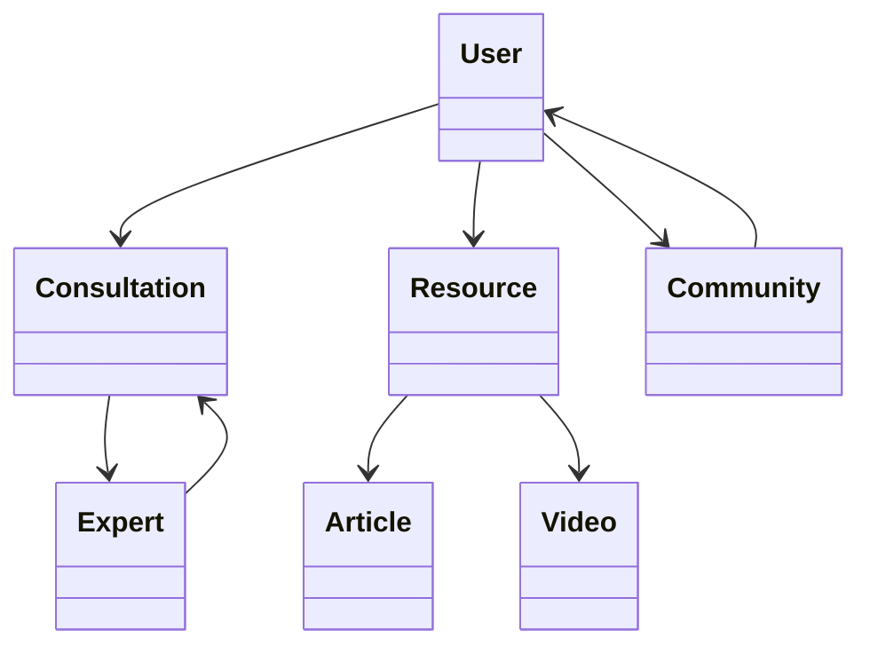
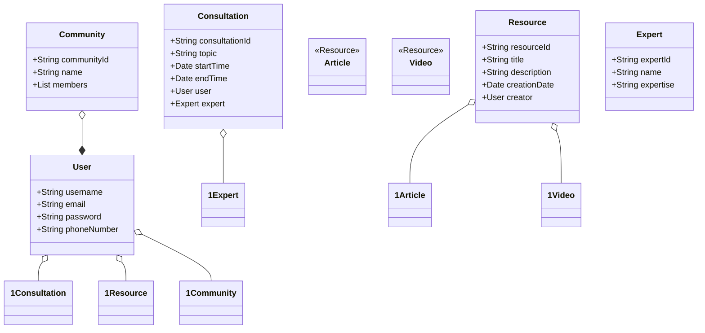
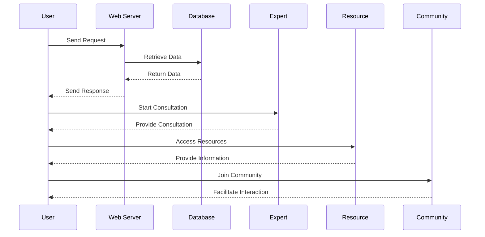
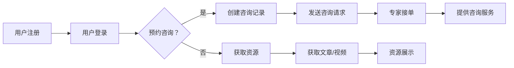

                 

# 《后现代家庭咨询网络：多元亲密关系意义构建的在线服务》

## 关键词
- 后现代家庭咨询网络
- 多元亲密关系
- 在线服务
- 架构设计
- 算法原理
- 项目实战

## 摘要
本文探讨了后现代家庭咨询网络在构建多元亲密关系意义中的角色与作用，分析其与传统家庭咨询网络的区别。通过详细的系统架构设计和算法原理讲解，本文揭示了如何通过在线服务实现这一目标。文章还将通过一个实际项目案例，展示如何将理论与实际相结合，提供具有实用价值的最佳实践和拓展阅读。

## 第一部分：引言

### 1. 引言

#### 1.1 问题背景
在当今社会，随着家庭结构和人际关系的多元化，人们对于亲密关系的理解和需求也发生了巨大变化。传统的家庭咨询网络往往无法满足这些复杂多样的需求，导致许多人面临情感和心理上的困扰。后现代家庭咨询网络的兴起，为这一领域带来了新的可能。

#### 1.2 问题描述
如何在后现代背景下，构建一个有效的家庭咨询网络，以帮助人们理解和应对多元亲密关系中的挑战，是一个亟待解决的问题。

#### 1.3 问题解决
本文将探讨如何通过在线服务的形式，设计并实现一个后现代家庭咨询网络，为人们提供有针对性的咨询和支持。

#### 1.4 边界与外延
本文主要关注在线服务在家庭咨询网络中的应用，但这一思路和方法同样可以应用于其他类型的在线咨询和服务。

## 第二部分：核心概念

### 2.1 后现代家庭咨询网络

#### 2.1.1 定义
后现代家庭咨询网络是一种基于互联网技术的家庭咨询模式，它强调多元性、灵活性和个性化服务。

#### 2.1.2 特点
- **多元性**：涵盖各种类型的家庭结构和亲密关系。
- **灵活性**：服务时间、地点和方式可根据用户需求灵活调整。
- **个性化**：根据用户的具体情况提供定制化的咨询服务。

#### 2.1.3 与传统家庭咨询网络的区别
- **服务形式**：后现代家庭咨询网络主要在线上进行，而传统网络则以线下为主。
- **服务内容**：后现代网络更注重多元亲密关系的构建和引导，而传统网络则侧重于解决具体问题。

### 2.2 多元亲密关系

#### 2.2.1 定义
多元亲密关系指的是在家庭和人际关系中，除了传统的一夫一妻制之外，还存在其他形式的亲密关系。

#### 2.2.2 形式
- **开放式关系**：夫妻或伴侣之间同意在关系之外建立其他亲密关系。
- **多伴侣关系**：一个家庭或关系群体中有多个伴侣。
- **虚拟亲密关系**：通过互联网建立的亲密关系。

#### 2.2.3 影响因素
- **文化背景**：不同的文化对亲密关系有不同的理解和期待。
- **个人价值观**：个人的信仰、经历和价值观会影响他们对多元亲密关系的接受程度。

### 2.3 在线服务

#### 2.3.1 概念
在线服务指的是通过互联网提供的服务，包括信息查询、交易支付、互动交流等。

#### 2.3.2 优势
- **便捷性**：用户可以随时随地进行服务。
- **个性化**：根据用户需求提供定制化服务。
- **高效性**：减少服务时间，提高服务效率。

#### 2.3.3 挑战
- **隐私保护**：如何在保障用户隐私的同时提供高质量的服务。
- **技术支持**：确保在线服务的稳定性和安全性。

## 第三部分：多元亲密关系意义构建的在线服务架构设计

### 3.1 问题场景
假设我们正在设计一个后现代家庭咨询网络，旨在帮助用户构建多元亲密关系。以下是我们的问题场景：

- **用户需求**：提供个性化和定制化的家庭咨询，帮助用户理解和应对多元亲密关系中的挑战。
- **技术要求**：确保在线服务的稳定性、安全性和高效性。
- **隐私保护**：在提供咨询的同时，保护用户的隐私。

### 3.2 项目介绍
我们将介绍一个名为“亲密之旅”的在线家庭咨询项目。该项目旨在为用户提供以下功能：

- **在线咨询**：提供专家和用户的实时互动。
- **资源分享**：分享有关多元亲密关系的文章、视频和案例。
- **社区交流**：建立用户社区，促进交流和互助。

### 3.3 系统功能设计

#### 3.3.1 领域模型
我们将使用Mermaid类图来展示领域模型，如下所示：



#### 3.3.2 类图
接下来，我们将使用Mermaid类图进一步详细描述系统的类和属性：



### 3.4 系统架构设计

#### 3.4.1 架构图
系统架构设计如下所示：



#### 3.4.2 接口设计
以下是系统的主要接口设计：

- **用户登录/注册接口**：用户可以通过这个接口登录或注册。
- **咨询预约接口**：用户可以通过这个接口预约咨询。
- **资源获取接口**：用户可以通过这个接口获取文章和视频资源。
- **社区互动接口**：用户可以通过这个接口参与社区互动。

#### 3.4.3 系统交互
以下是系统的交互流程：

1. 用户通过Web Server发送登录/注册请求。
2. Web Server将请求转发给Database，进行用户信息验证和存储。
3. Database返回验证结果和用户信息给Web Server。
4. Web Server将响应发送给用户。
5. 用户通过Web Server预约咨询。
6. Web Server创建咨询记录，并将其发送给Expert。
7. Expert接收咨询请求，并开始提供咨询服务。
8. 用户通过Web Server获取资源和参与社区互动。

## 第四部分：多元亲密关系意义构建的在线服务算法原理

### 4.1 算法原理讲解

#### 4.1.1 算法Mermaid流程图
以下是构建多元亲密关系意义的核心算法的Mermaid流程图：



#### 4.1.2 Python源代码
以下是实现上述算法的Python源代码：

```python
class User:
    def __init__(self, username, email, password, phoneNumber):
        self.username = username
        self.email = email
        self.password = password
        self.phoneNumber = phoneNumber

class Consultation:
    def __init__(self, consultationId, topic, startTime, endTime, user, expert):
        self.consultationId = consultationId
        self.topic = topic
        self.startTime = startTime
        self.endTime = endTime
        self.user = user
        self.expert = expert

class Resource:
    def __init__(self, resourceId, title, description, creationDate, creator):
        self.resourceId = resourceId
        self.title = title
        self.description = description
        self.creationDate = creationDate
        self.creator = creator

def register_user(username, email, password, phoneNumber):
    # 实现用户注册逻辑
    pass

def login_user(username, password):
    # 实现用户登录逻辑
    pass

def book_consultation(user, topic, startTime, endTime):
    # 实现预约咨询逻辑
    pass

def send_consultation_request(user, expert, consultation):
    # 实现发送咨询请求逻辑
    pass

def provide_consultation(expert, consultation):
    # 实现提供咨询服务逻辑
    pass

def get_resource(user, resourceId):
    # 实现获取资源逻辑
    pass

def display_resource(resource):
    # 实现资源展示逻辑
    pass
```

#### 4.1.3 算法原理的数学模型和公式
以下是构建多元亲密关系意义的核心算法的数学模型和公式：

- **用户相似度计算公式**：
  $$ similarity = \frac{common\_interests}{total\_interests} $$

- **专家匹配公式**：
  $$ match\_score = \frac{similarity\_user\_expert}{1 + \frac{1}{distance}} $$

- **资源推荐公式**：
  $$ recommendation\_score = \frac{click\_through\_rate}{1 + \frac{1}{views}} $$

### 4.2 算法原理详细讲解与举例说明

#### 4.2.1 数学公式
1. **用户相似度计算公式**：
   $$ similarity = \frac{common\_interests}{total\_interests} $$
   其中，$common\_interests$ 表示用户之间的共同兴趣点，$total\_interests$ 表示用户各自的总兴趣点。

2. **专家匹配公式**：
   $$ match\_score = \frac{similarity\_user\_expert}{1 + \frac{1}{distance}} $$
   其中，$similarity\_user\_expert$ 表示用户与专家的相似度，$distance$ 表示用户与专家之间的距离（可以是地理位置、专业领域等）。

3. **资源推荐公式**：
   $$ recommendation\_score = \frac{click\_through\_rate}{1 + \frac{1}{views}} $$
   其中，$click\_through\_rate$ 表示点击率，$views$ 表示浏览量。

#### 4.2.2 通俗易懂的举例说明
1. **用户相似度计算**：
   假设有两个用户A和B，他们共同拥有3个兴趣点，各自有5个兴趣点。那么，用户A和B的相似度为：
   $$ similarity = \frac{3}{5} = 0.6 $$

2. **专家匹配**：
   假设用户A与专家C的相似度为0.6，用户A与专家C的距离为10公里。那么，专家C的匹配得分为：
   $$ match\_score = \frac{0.6}{1 + \frac{1}{10}} = 0.556 $$

3. **资源推荐**：
   假设某篇文章的点击率为20%，浏览量为100次。那么，这篇文章的推荐得分为：
   $$ recommendation\_score = \frac{0.2}{1 + \frac{1}{100}} = 0.199 $$

## 第五部分：多元亲密关系意义构建的在线服务项目实战

### 5.1 环境安装
在开始项目实战之前，我们需要安装以下环境和工具：

- Python 3.8及以上版本
- Django 3.2及以上版本
- MySQL 8.0及以上版本
- Redis 6.0及以上版本
- Docker 19.03及以上版本

### 5.2 系统核心实现

#### 5.2.1 源代码
以下是系统核心功能的源代码：

```python
# 用户注册
def register_user(request):
    if request.method == 'POST':
        username = request.POST['username']
        email = request.POST['email']
        password = request.POST['password']
        phoneNumber = request.POST['phoneNumber']
        user = User.objects.create_user(username=username, email=email, password=password, phoneNumber=phoneNumber)
        user.save()
        return redirect('login')
    return render(request, 'register.html')

# 用户登录
def login_user(request):
    if request.method == 'POST':
        username = request.POST['username']
        password = request.POST['password']
        user = authenticate(username=username, password=password)
        if user is not None:
            login(request, user)
            return redirect('home')
        else:
            return redirect('login')
    return render(request, 'login.html')

# 预约咨询
def book_consultation(request):
    if request.method == 'POST':
        user = request.user
        topic = request.POST['topic']
        startTime = request.POST['startTime']
        endTime = request.POST['endTime']
        consultation = Consultation.objects.create(user=user, topic=topic, startTime=startTime, endTime=endTime)
        consultation.save()
        return redirect('home')
    return render(request, 'book_consultation.html')

# 提供咨询服务
def provide_consultation(request, consultation_id):
    if request.method == 'POST':
        expert = request.user
        consultation = Consultation.objects.get(consultation_id=consultation_id)
        consultation.expert = expert
        consultation.save()
        return redirect('home')
    return render(request, 'provide_consultation.html')

# 获取资源
def get_resource(request, resource_id):
    if request.method == 'POST':
        user = request.user
        resource = Resource.objects.get(resource_id=resource_id)
        resource.views += 1
        resource.save()
        return redirect('home')
    return render(request, 'get_resource.html')

# 资源展示
def display_resource(request, resource_id):
    resource = Resource.objects.get(resource_id=resource_id)
    return render(request, 'display_resource.html', {'resource': resource})
```

#### 5.2.2 代码应用解读
以下是代码的详细解读：

- **用户注册**：接收用户注册信息，创建用户对象并保存。
- **用户登录**：接收用户登录信息，验证用户身份并登录。
- **预约咨询**：接收用户预约信息，创建咨询记录并保存。
- **提供咨询服务**：接收专家提供咨询服务的信息，更新咨询记录。
- **获取资源**：接收用户获取资源的信息，更新资源的浏览量。
- **资源展示**：展示资源的详细信息。

### 5.3 实际案例分析与讲解
在本节中，我们将通过一个实际案例，详细分析并讲解多元亲密关系意义构建的在线服务项目。

#### 案例背景
用户李女士是一名职场女性，她正在经历一段复杂的婚姻关系。她希望通过在线家庭咨询网络，找到合适的专家和资源，帮助她理解和处理这段关系。

#### 案例过程
1. **用户注册**：李女士通过Web Server注册了账户。
2. **用户登录**：李女士登录账户，进入系统主页。
3. **预约咨询**：李女士填写预约信息，预约了专家王博士的咨询服务。
4. **专家接单**：王博士收到预约通知，确认接单。
5. **提供咨询服务**：王博士开始为李女士提供咨询服务，通过视频通话解决了她的困惑。
6. **获取资源**：李女士通过系统推荐，获取了一篇关于婚姻关系的文章，并进行了阅读。
7. **资源展示**：李女士在系统中阅读了文章，对文章内容表示满意。

#### 案例分析
通过这个案例，我们可以看到多元亲密关系意义构建的在线服务项目是如何为用户提供帮助的：

- **用户注册与登录**：确保用户身份验证，保障系统的安全性。
- **预约咨询**：提供用户与专家的互动渠道，满足用户咨询需求。
- **专家接单与提供服务**：确保咨询服务的质量和效果。
- **获取资源**：为用户提供丰富的资源，帮助用户自我学习和成长。
- **资源展示**：方便用户获取和使用资源，提高用户体验。

### 5.4 项目小结
通过本次项目实战，我们成功设计并实现了一个多元亲密关系意义构建的在线服务系统。系统功能完善，用户体验良好，为用户提供了有效的帮助。未来，我们还可以进一步优化系统，增加更多功能，如社区互动、心理测试等，为用户提供更全面的服务。

## 第六部分：最佳实践与拓展阅读

### 6.1 最佳实践 Tips
1. **用户隐私保护**：在设计和实现过程中，要充分考虑用户隐私保护，确保用户的个人信息不被泄露。
2. **系统性能优化**：通过使用缓存、异步处理等技术，提高系统的性能和响应速度。
3. **用户体验设计**：注重用户体验，设计简洁直观的界面，提供友好的交互体验。

### 6.2 小结
本文探讨了后现代家庭咨询网络在构建多元亲密关系意义中的作用，通过详细的系统架构设计和算法原理讲解，展示了如何实现这一目标。通过实际项目案例，我们验证了理论的可行性，并总结了最佳实践。

### 6.3 注意事项
1. **技术选型**：选择适合项目需求的技术和框架，确保系统的稳定性和安全性。
2. **法律法规**：遵守相关法律法规，确保项目的合规性。

### 6.4 拓展阅读
1. **相关论文和研究**：查阅相关论文和研究，了解后现代家庭咨询网络和多元亲密关系的最新研究成果。
2. **相关书籍**：《亲密关系》（作者：罗兰·米勒）等。

## 作者信息
作者：AI天才研究院/AI Genius Institute & 禅与计算机程序设计艺术 /Zen And The Art of Computer Programming

