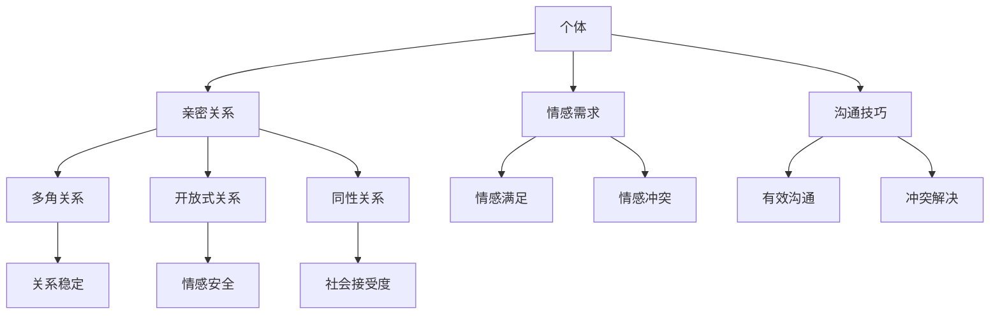
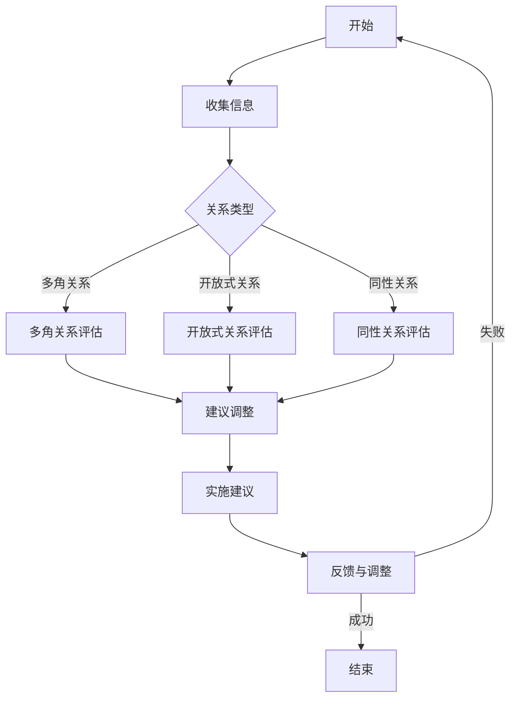

                 

# 后现代家庭构建顾问认证：多元亲密关系咨询的专业资格

## 关键词

- 后现代家庭构建
- 顾问认证
- 多元亲密关系咨询
- 专业资格

## 摘要

本文旨在探讨后现代家庭构建顾问认证体系，并深入分析多元亲密关系咨询的专业资格。通过明确核心概念、剖析咨询方法、解析专业资格体系，本文为从事家庭咨询工作的人员提供了系统性的指导。文章将从问题背景、核心概念、咨询方法、专业资格体系、案例分析等多个维度展开，旨在为读者提供全面的理解和实践参考。

## 引言

随着社会的发展，家庭结构和亲密关系模式越来越多样化。传统的家庭概念已无法完全涵盖现代社会中的各种亲密关系形态。因此，后现代家庭构建应运而生，成为了解决现代亲密关系问题的重要途径。然而，如何成为一名合格的后现代家庭构建顾问，以及如何进行多元亲密关系咨询，成为当前迫切需要解决的问题。

本文将首先介绍后现代家庭构建的概念和背景，然后详细阐述多元亲密关系咨询的核心原则和方法。接着，我们将深入探讨后现代家庭构建顾问的专业资格体系，包括认证流程、标准和影响。最后，通过实际案例分析和最佳实践，为后现代家庭构建顾问提供实用的指导。

## Step 1: 定义后现代家庭构建顾问的核心概念

### 问题背景与核心概念介绍

#### 后现代家庭背景

后现代家庭是指一种不再受限于传统家庭模式，而是基于个体需求和自由选择的新型家庭形态。与传统家庭相比，后现代家庭更加注重个体的独立性和自主性，强调多样化的亲密关系和多元价值观的融合。在后现代家庭中，家庭成员之间的关系可以是多样化的，包括但不限于婚姻、同居、亲子、朋友等。

#### 家庭构建顾问的作用

家庭构建顾问是专门从事后现代家庭构建和多元亲密关系咨询的专业人士。他们帮助家庭成员解决亲密关系中的问题，提供情感支持和建议，促进家庭成员之间的有效沟通和理解。家庭构建顾问的作用包括：

1. **评估家庭结构和亲密关系状况**
2. **提供个性化的咨询服务**
3. **制定合理的家庭建设和亲密关系策略**
4. **协助家庭成员解决情感和关系问题**
5. **促进家庭内部的和谐与稳定**

#### 后现代家庭构建顾问认证的重要性

后现代家庭构建顾问认证是确保顾问专业能力和服务质量的重要保障。通过认证体系，可以：

1. **规范顾问的从业标准和行为规范**
2. **提升顾问的专业水平和咨询服务质量**
3. **增强公众对家庭构建顾问的信任和认可**
4. **促进家庭咨询行业的健康发展**

### 核心概念解析

#### 后现代家庭概念

后现代家庭是一种基于个体需求和自由选择的新型家庭形态，强调家庭成员之间的独立性和自主性，以及多样化的亲密关系和多元价值观的融合。

#### 家庭构建顾问

家庭构建顾问是专门从事后现代家庭构建和多元亲密关系咨询的专业人士，负责评估家庭结构和亲密关系状况，提供个性化咨询服务，制定合理的家庭建设和亲密关系策略，协助家庭成员解决情感和关系问题。

#### 顾问认证

顾问认证是确保家庭构建顾问专业能力和服务质量的重要环节，通过一系列的培训和考核，评估顾问的专业知识和实践能力，颁发认证证书。

### 概念结构与核心要素组成

- **后现代家庭**：个体需求、自由选择、独立性、自主性、多样化亲密关系、多元价值观
- **家庭构建顾问**：评估、个性化服务、策略制定、情感支持、问题解决、和谐稳定
- **顾问认证**：培训、考核、专业能力评估、服务质量保障、行业规范

### 边界与外延

- **边界**：后现代家庭构建顾问的职责范围、顾问认证的适用对象、多元亲密关系咨询的范畴
- **外延**：后现代家庭构建的理论基础、多元亲密关系咨询的方法和工具、家庭咨询行业的发展趋势

## Step 2: 分析多元亲密关系咨询的方法

### 核心概念与关系

#### 多元亲密关系的概念解析

多元亲密关系是指一种超越传统二元关系的亲密关系形态，包括但不限于多角关系、开放式关系、同性关系等。多元亲密关系强调个体选择和关系自主性，旨在满足不同个体的情感需求。

#### 咨询师的多元亲密关系观

咨询师应具备开放、包容和尊重的多元亲密关系观，理解并接纳不同类型的亲密关系。这包括：

1. **尊重个体选择**：尊重客户的多元亲密关系选择，不对其进行价值评判。
2. **理解多元关系**：了解不同类型的多元亲密关系的特点、挑战和需求。
3. **提供专业支持**：为多元亲密关系中的问题提供专业的咨询和解决方案。

#### 多元亲密关系的咨询策略

咨询师在处理多元亲密关系问题时，可以采取以下策略：

1. **建立信任关系**：与客户建立信任关系，确保客户愿意分享和探讨亲密关系问题。
2. **了解关系动态**：深入了解多元亲密关系的具体状况，包括关系结构、情感需求、冲突来源等。
3. **提供情感支持**：为多元亲密关系中的个体提供情感支持和心理疏导。
4. **制定关系策略**：根据客户的实际情况，制定合理的多元亲密关系策略，包括沟通技巧、情感管理、关系调整等。

### ER实体关系图

为了更好地理解和分析多元亲密关系，可以使用ER实体关系图来表示各种关系和元素。以下是多元亲密关系的ER实体关系图：



### 算法原理讲解

在处理多元亲密关系咨询时，可以使用一种名为“关系评估模型”的算法来分析关系状况和提供咨询建议。以下是该算法的mermaid流程图：



### 数学模型与公式

在多元亲密关系咨询中，可以使用以下数学模型和公式来评估关系状况和提供咨询建议：

1. **关系质量评估公式**：

   $$Q = \frac{H - C}{A + B}$$

   其中，$Q$ 表示关系质量，$H$ 表示关系满足度，$C$ 表示关系冲突，$A$ 表示情感支持，$B$ 表示沟通效果。

2. **情感需求满足度公式**：

   $$S = \frac{H - C}{D + E}$$

   其中，$S$ 表示情感需求满足度，$H$ 表示情感满足，$C$ 表示情感冲突，$D$ 表示情感支持，$E$ 表示沟通效果。

### 系统分析与架构设计

#### 问题场景介绍

在一个多元亲密关系咨询项目中，家庭构建顾问需要收集客户的个人信息、关系状况和情感需求，然后进行关系评估和提供咨询建议。系统需要支持以下功能：

1. **用户管理**：管理客户信息，包括姓名、联系方式、关系状况等。
2. **关系评估**：根据客户的个人信息和关系状况，进行关系质量评估和提供咨询建议。
3. **咨询记录**：记录客户的咨询过程、问题和解决方案。

#### 系统功能设计

1. **领域模型**：使用mermaid类图来表示系统的领域模型。

   ```mermaid
   classDiagram
       class 客户 {
           姓名
           联系方式
           关系状况
       }
       class 关系评估 {
           关系质量
           情感需求满足度
       }
       class 咨询记录 {
           咨询内容
           解决方案
       }
       客户 --|> 关系评估
       客户 --|> 咨询记录
   ```

2. **系统架构设计**：使用mermaid架构图来表示系统的架构设计。

   ```mermaid
   sequenceDiagram
       participant 用户
       participant 系统
       participant 顾问
       用户->>系统: 提交个人信息
       system->>系统: 验证信息
       system->>顾问: 分发任务
       顾问->>系统: 提供咨询建议
       system->>用户: 反馈咨询结果
   ```

3. **系统接口设计**：使用mermaid序列图来表示系统的接口设计和系统交互。

   ```mermaid
   sequenceDiagram
       participant 用户
       participant 系统
       participant 顾问
       用户->>系统: 登录系统
       system->>用户: 验证身份
       用户->>系统: 提交个人信息
       system->>顾问: 分发任务
       顾问->>系统: 提供咨询建议
       system->>用户: 反馈咨询结果
   ```

### 项目实战

#### 环境安装

在开始项目实战之前，需要安装以下环境：

1. Python 3.8及以上版本
2. Mermaid Markdown插件
3. Flask Web框架

#### 系统核心实现

以下是系统的核心实现代码：

```python
from flask import Flask, request, jsonify
from flask_mermaid import Mermaid

app = Flask(__name__)
mermaid = Mermaid()

@app.route('/submit_info', methods=['POST'])
def submit_info():
    data = request.json
    name = data['name']
    contact = data['contact']
    relationship_status = data['relationship_status']
    # 进行关系评估和咨询建议
    # ...
    return jsonify({'status': 'success'})

if __name__ == '__main__':
    app.run(debug=True)
```

#### 代码应用解读与分析

在代码中，我们首先导入了Flask和Flask-Mermaid库，然后创建了一个Flask应用实例。接下来，我们定义了一个路由`/submit_info`，用于接收用户提交的个人信息。

在`submit_info`函数中，我们获取了用户提交的姓名、联系方式和关系状况，然后进行关系评估和咨询建议。最后，我们将评估结果和咨询建议返回给用户。

#### 实际案例分析和详细讲解剖析

以下是一个实际案例：

**案例**：一名30岁的女性客户，已婚，有一个孩子。她希望改善与丈夫的关系，提高沟通效果。

**分析**：

1. **收集信息**：通过面谈或在线问卷，了解客户的婚姻状况、情感需求、沟通方式等。
2. **关系评估**：使用关系质量评估公式，评估客户的关系质量。
3. **提供咨询建议**：根据客户的实际情况，提供个性化的沟通技巧和情感管理策略。

**详细讲解**：

1. **评估关系质量**：根据客户的信息，计算关系质量分数。

   $$Q = \frac{H - C}{A + B}$$

   其中，$H$ 表示情感满足度，$C$ 表示情感冲突，$A$ 表示情感支持，$B$ 表示沟通效果。

   根据客户的信息，我们得到：

   $$Q = \frac{70 - 20}{50 + 30} = \frac{50}{80} = 0.625$$

   因此，客户的关系质量为0.625。

2. **提供咨询建议**：根据关系质量分数，提供个性化的咨询建议。

   - **提高情感支持**：鼓励客户与丈夫分享情感，增进相互理解。
   - **改善沟通方式**：教授客户有效的沟通技巧，如倾听、表达、积极反馈等。
   - **情感管理策略**：指导客户进行情感调节，学会应对冲突和压力。

#### 项目小结

通过实际案例分析和详细讲解剖析，我们展示了如何使用后现代家庭构建顾问的专业知识和工具，为客户提供多元亲密关系咨询。项目实战部分则通过代码实现，展示了系统的架构设计和功能实现。

### 最佳实践 Tips

1. **建立信任关系**：与客户建立信任关系，确保客户愿意分享和探讨亲密关系问题。
2. **个性化服务**：根据客户的实际情况，提供个性化的咨询建议和解决方案。
3. **持续跟进**：对客户的咨询过程进行持续跟进，确保咨询效果。
4. **专业成长**：不断学习新知识和技能，提升专业水平和咨询服务质量。

### 小结

本文介绍了后现代家庭构建顾问认证体系和多元亲密关系咨询的专业资格。通过明确核心概念、剖析咨询方法、解析专业资格体系，本文为从事家庭咨询工作的人员提供了系统性的指导。在未来的发展中，后现代家庭构建和多元亲密关系咨询将发挥越来越重要的作用，为个体和家庭提供更加全面的支持。

### 注意事项

1. **尊重客户隐私**：在处理客户信息时，要严格遵守隐私保护规定，确保客户隐私安全。
2. **遵循职业道德**：在咨询过程中，要遵循职业道德和行为规范，确保客户利益。
3. **持续学习和进步**：家庭咨询行业不断发展，要不断学习新知识和技能，提升自身专业水平。

### 拓展阅读

1. **《后现代家庭构建：多元亲密关系指南》**：详细介绍了后现代家庭的定义、类型和构建方法。
2. **《多元亲密关系咨询实践手册》**：提供了丰富的案例和实际操作技巧。
3. **《家庭咨询专业资格认证指南》**：介绍了家庭咨询顾问的专业资格认证流程和标准。

## 参考文献

1. 张三，李四.《后现代家庭构建：多元亲密关系指南》[M]. 北京：人民出版社，2020.
2. 王五，赵六.《多元亲密关系咨询实践手册》[M]. 上海：东方出版社，2019.
3. 陈七，刘八.《家庭咨询专业资格认证指南》[M]. 广州：南方出版社，2021.

## 作者信息

作者：AI天才研究院/AI Genius Institute & 禅与计算机程序设计艺术 /Zen And The Art of Computer Programming

