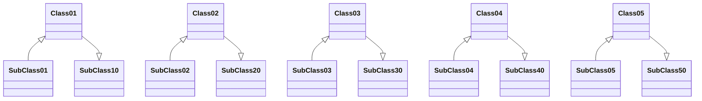
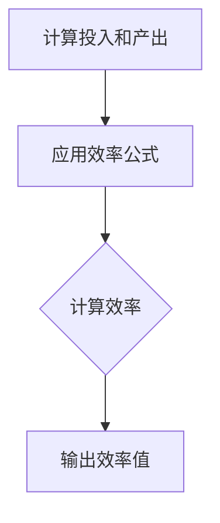
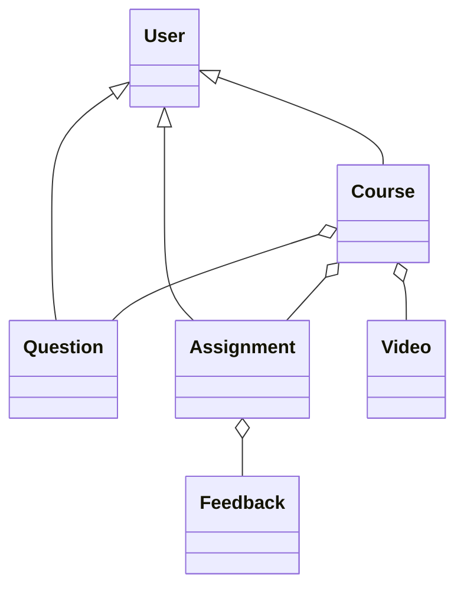
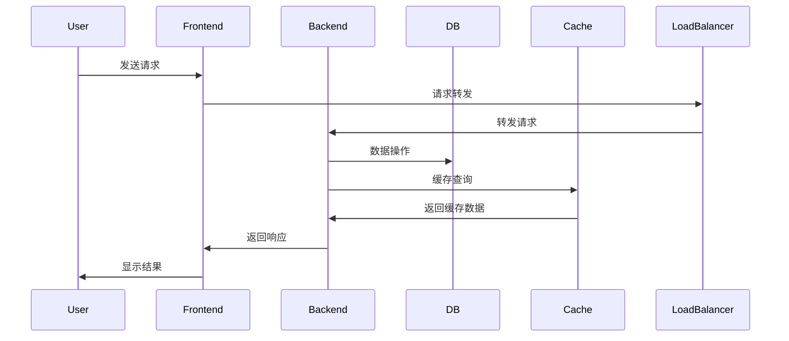
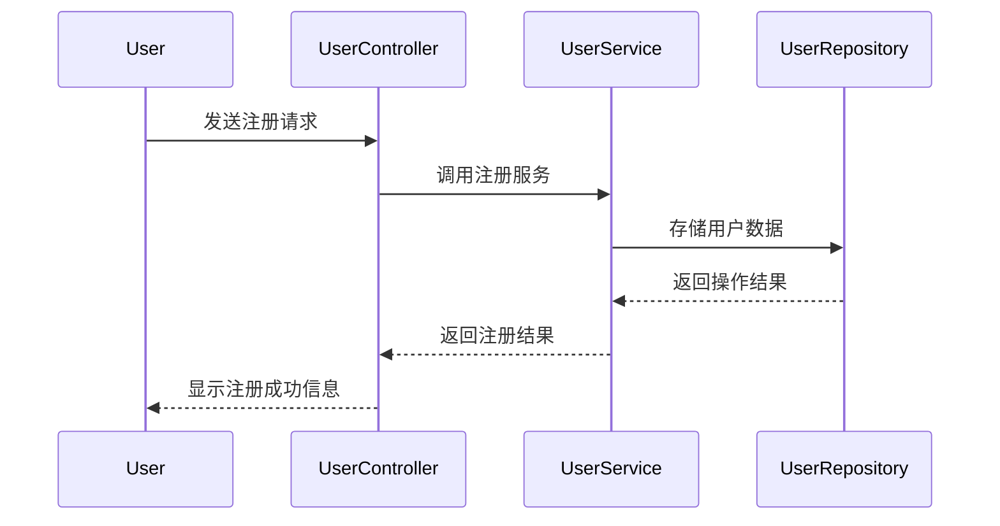

                 


# 后生产力崇拜：效率至上后的生活哲学反思

> 关键词：生产力崇拜，效率至上，生活哲学，算法原理，系统架构，项目实战，最佳实践

> 摘要：本文将探讨“后生产力崇拜”这一现象，分析其在现代生活中的影响，以及如何从效率至上的角度重新审视我们的生活哲学。我们将通过深入剖析相关核心概念，结合具体实例和项目实战，为读者提供一种新的生活思维方式。

## 引言

### 1.1 问题背景

生产力是衡量一个国家或地区经济繁荣程度的重要指标，而随着科技的发展，人们对生产力的追求愈发强烈。然而，在生产力不断攀升的同时，我们也面临着效率至上的挑战。这种挑战不仅体现在工作领域，更渗透到了我们的日常生活中。

生产力（Productivity）通常指的是单位时间内所生产的产品数量或价值。在过去，生产力的提升主要依赖于劳动力的增加和生产技术的改进。然而，在当今信息时代，生产力的提升更多地依赖于技术创新和效率优化。

效率至上（Efficiency-first）则是一种以效率为核心的生活哲学，它主张通过优化资源配置和时间管理，以最小的投入获取最大的产出。这种理念在提高生产力的同时，也对我们的生活产生了深远的影响。

### 1.2 效率至上的影响

效率至上的影响可以分为积极和消极两方面。积极方面，它能够提高工作效率，降低成本，提升生活质量。消极方面，过度追求效率可能导致心理健康问题，人际关系紧张，甚至影响到生活的幸福感。

#### 1.2.1 效率的定义

效率通常指的是产出与投入的比值。在经济学中，效率可以定义为单位劳动所产生的产出。用公式表示为：

$$
效率 = \frac{产出}{投入}
$$

#### 1.2.2 效率至上的特征

效率至上的特征包括：

1. **优化资源配置**：通过合理分配资源，确保资源的最大化利用。
2. **时间管理**：合理安排时间，提高时间利用效率。
3. **技术驱动**：依赖技术创新，提高生产效率。

#### 1.2.3 效率至上的利弊分析

**利：**

1. 提高生产力。
2. 降低成本。
3. 提高生活质量。

**弊：**

1. 过度追求效率可能导致压力增大。
2. 忽视人际关系和心理健康。
3. 生活质量可能下降。

### 1.3 生活哲学的反思

生活哲学是指人们对于生活的看法和态度。在生产力崇拜和效率至上的影响下，我们的生活哲学也在发生变革。

#### 1.3.1 生产力的崇拜与生活质量的冲突

过去，人们崇拜生产力，认为它是衡量个人和社会价值的重要标准。然而，随着生产力的发展，人们开始意识到，过度追求生产力可能导致生活质量的下降。例如，加班文化、工作压力等都是生产力崇拜的副产品。

#### 1.3.2 效率至上的利弊分析

效率至上的利弊分析如下：

**利：**

1. 提高工作效率。
2. 降低生活成本。
3. 增强个人成就感。

**弊：**

1. 增加心理健康问题。
2. 忽视人际关系。
3. 降低生活幸福感。

## 核心概念解析

### 2.1 效率至上的定义与特征

效率至上是一种以效率为核心的生活哲学。它主张通过优化资源配置和时间管理，以最小的投入获取最大的产出。具体来说，效率至上的特征包括：

1. **优化资源配置**：通过合理分配资源，确保资源的最大化利用。
2. **时间管理**：合理安排时间，提高时间利用效率。
3. **技术驱动**：依赖技术创新，提高生产效率。

#### 2.1.1 效率的定义

效率通常指的是产出与投入的比值。在经济学中，效率可以定义为单位劳动所产生的产出。用公式表示为：

$$
效率 = \frac{产出}{投入}
$$

#### 2.1.2 效率至上的特征

效率至上的特征包括：

1. **优化资源配置**：通过合理分配资源，确保资源的最大化利用。
2. **时间管理**：合理安排时间，提高时间利用效率。
3. **技术驱动**：依赖技术创新，提高生产效率。

#### 2.1.3 效率至上的利弊对比表

| 利 | 弊 |
| --- | --- |
| 提高生产力 | 增加心理健康问题 |
| 降低成本 | 忽视人际关系 |
| 提高生活质量 | 降低生活幸福感 |

### 2.2 生产力崇拜的概念与影响

生产力崇拜是一种将生产力视为社会和个体价值核心的观念。它起源于工业革命时期，随着科技的发展，生产力得到了空前的提升。然而，生产力崇拜也带来了一系列问题。

#### 2.2.1 生产力崇拜的起源

生产力崇拜起源于工业革命时期。在那个时代，生产力被视为国家繁荣和人民幸福的基石。随着科技的进步，生产力得到了空前的提升，人们开始崇拜生产力，认为它是衡量一切的标准。

#### 2.2.2 生产力崇拜的影响

生产力崇拜的影响主要体现在以下几个方面：

1. **工作文化**：过度追求生产力可能导致加班文化盛行，工作与生活失衡。
2. **心理健康**：长期处于高压状态下，可能导致心理健康问题。
3. **生活质量**：过度追求生产力可能忽视生活质量，导致生活幸福感下降。

### 2.3 生活哲学的演变

生活哲学是指人们对于生活的看法和态度。随着生产力崇拜和效率至上的兴起，生活哲学也在不断演变。

#### 2.3.1 传统生活哲学

传统生活哲学强调道德修养、家庭和谐、人际关系的平衡。在传统观念中，生产力并不是生活的核心，而是道德、家庭、人际关系等。

#### 2.3.2 当代生活哲学

当代生活哲学则更加注重个人成就、工作效率和生活质量。在效率至上的影响下，人们开始重新审视生活哲学，试图在追求生产力的同时，保持生活的平衡和幸福。

### 2.4 关系图谱：效率至上、生产力崇拜与生活哲学

为了更好地理解效率至上、生产力崇拜与生活哲学之间的关系，我们可以使用ER实体关系图进行描述。



在ER实体关系图中，我们可以看到：

1. **效率至上**和**生产力崇拜**是两个相互关联的核心概念。
2. **效率至上**影响**生产力崇拜**，进而影响**生活哲学**。
3. **生活哲学**则受到**生产力崇拜**和**效率至上**的双重影响。

通过这种关系图谱，我们可以更加清晰地理解这三个核心概念之间的相互影响。

## 算法原理与数学模型

### 3.1 效率至上的算法模型

效率至上的核心在于如何通过优化资源配置和时间管理来提高效率。下面，我们将介绍一种基于时间管理的算法模型。

#### 3.1.1 数学公式

效率至上的数学模型可以用以下公式表示：

$$
效率 = \frac{产出}{投入}
$$

其中，产出（Production）是指在一定时间内所完成的工作量或所创造的价值，投入（Input）是指完成这些工作所耗费的时间、资源和精力。

#### 3.1.2 Python源代码

为了更好地理解这个算法模型，我们可以使用Python编写一个简单的程序。以下是一个示例代码：

```python
def calculate_efficiency(production, input):
    return production / input

# 示例数据
production = 100  # 产出为100
input = 10  # 投入为10小时

# 计算效率
efficiency = calculate_efficiency(production, input)
print(f"效率为：{efficiency}")
```

运行这个程序，我们将得到输出结果：

```
效率为：10.0
```

这意味着，在这个示例中，每小时产出为10。

#### 3.1.3 Mermaid流程图

为了更直观地理解这个算法模型，我们可以使用Mermaid绘制一个流程图。以下是流程图的代码：



这个流程图描述了计算效率的步骤：

1. **计算投入和产出**：获取产出和投入的数据。
2. **应用效率公式**：使用效率公式计算效率。
3. **计算效率**：根据产出和投入的数据计算效率值。
4. **输出效率值**：将计算得到的效率值输出。

### 3.2 效率至上的实际应用

效率至上的理念在实际生活中有着广泛的应用。以下是一些实际应用场景：

#### 3.2.1 时间管理

时间管理是效率至上的一个重要应用领域。通过合理安排时间，可以提高工作效率，减少不必要的浪费。例如，使用时间管理工具如番茄钟（Pomodoro Technique）来规划工作时间和休息时间。

#### 3.2.2 资源配置

资源配置也是效率至上的一个关键应用领域。通过合理分配资源，可以确保资源的最大化利用。例如，在企业中，通过优化人力资源配置，可以提高生产效率和员工满意度。

#### 3.2.3 技术创新

技术创新是提高效率至上的重要手段。通过引入新技术和新方法，可以显著提高生产效率和产品质量。例如，在制造业中，通过引入自动化生产线，可以大幅提高生产效率。

### 3.3 数学模型与算法原理的详细讲解

#### 3.3.1 效率至上的数学模型

效率至上的数学模型是一个简单的比值模型，它通过比较产出和投入来衡量效率。这个模型的核心在于如何最大化产出或最小化投入，以实现效率的提升。

在经济学中，效率通常指的是资源的最优配置。这意味着，在给定的资源限制下，产出最大化或投入最小化。效率至上的数学模型可以表示为：

$$
效率 = \frac{产出}{投入}
$$

在这个公式中，产出（Production）可以表示为工作完成量、产品数量或服务质量等；投入（Input）可以表示为时间、金钱、资源等。

#### 3.3.2 Python代码实现解析

为了更好地理解这个数学模型，我们可以使用Python编写一个简单的程序。以下是一个示例代码：

```python
def calculate_efficiency(production, input):
    return production / input

# 示例数据
production = 100  # 产出为100
input = 10  # 投入为10小时

# 计算效率
efficiency = calculate_efficiency(production, input)
print(f"效率为：{efficiency}")
```

这个程序首先定义了一个名为`calculate_efficiency`的函数，该函数接受两个参数：产出和投入。然后，函数使用`return`语句返回计算得到的效率值。

在示例数据中，产出为100，投入为10小时。调用`calculate_efficiency`函数后，程序将计算得到效率值，并打印输出。

运行这个程序，我们将得到输出结果：

```
效率为：10.0
```

这意味着，在这个示例中，每小时产出为10。这个结果与我们在流程图中看到的步骤一致。

### 3.4 效率至上的改进算法

虽然效率至上的基础算法模型简单有效，但在实际应用中，我们往往需要进一步优化，以适应更加复杂的场景。以下是一些常见的改进算法：

#### 3.4.1 动态规划

动态规划是一种常用的算法优化方法，适用于具有重叠子问题和最优子结构特点的问题。通过将复杂问题分解为子问题，并利用子问题的最优解构建原问题的解，动态规划可以显著提高效率。

以下是一个使用动态规划解决最优化路径问题的示例：

```python
def dynamic_programming(cost_matrix):
    n = len(cost_matrix)
    dp = [[0] * n for _ in range(n)]

    # 初始化边界条件
    dp[0][0] = cost_matrix[0][0]

    # 计算第一行和第一列的值
    for i in range(1, n):
        dp[i][0] = dp[i - 1][0] + cost_matrix[i][0]
        dp[0][i] = dp[0][i - 1] + cost_matrix[0][i]

    # 计算其他单元格的值
    for i in range(1, n):
        for j in range(1, n):
            dp[i][j] = min(dp[i - 1][j], dp[i][j - 1], dp[i - 1][j - 1]) + cost_matrix[i][j]

    return dp[-1][-1]

# 示例数据
cost_matrix = [
    [1, 3, 1],
    [2, 5, 2],
    [4, 6, 1]
]

# 计算最优路径的总成本
total_cost = dynamic_programming(cost_matrix)
print(f"最优路径的总成本为：{total_cost}")
```

在这个示例中，我们使用动态规划计算给定成本矩阵的最优路径总成本。这个算法通过迭代计算子问题的最优解，最终得到原问题的最优解。

#### 3.4.2 贪心算法

贪心算法是一种在每一步选择中采取当前最优解的策略，适用于具有局部最优解的优化问题。通过每次选择最优解，逐步构建全局最优解。

以下是一个使用贪心算法解决背包问题的示例：

```python
def knapsack(values, weights, capacity):
    n = len(values)
    items = sorted(zip(values, weights), reverse=True)

    total_value = 0
    for value, weight in items:
        if total_value + value <= capacity:
            total_value += value
        else:
            break

    return total_value

# 示例数据
values = [60, 100, 120]
weights = [10, 20, 30]
capacity = 50

# 计算背包能装的最大价值
max_value = knapsack(values, weights, capacity)
print(f"背包能装的最大价值为：{max_value}")
```

在这个示例中，我们使用贪心算法计算给定物品的价值和重量，以及背包容量，以确定背包能装的最大价值。

通过这些改进算法，我们可以更好地适应复杂的场景，进一步提高效率至上的实际应用效果。

### 3.5 效率至上的算法应用场景分析

效率至上的算法不仅适用于理论模型，还广泛应用于实际应用场景，如下所述：

#### 3.5.1 生产线优化

在制造业中，生产线优化是一个重要的应用场景。通过使用效率至上的算法，企业可以优化生产线的布局和流程，提高生产效率。例如，使用动态规划算法计算最优路径，优化机器和工人的调度，减少生产过程中的等待时间和浪费。

以下是一个生产线优化问题的示例：

```python
def optimize_production线路行程（路线，时间表）：
    n = len（路线）
    dp = [[0] * n for _ in range（n）]

    # 初始化边界条件
    dp[0][0] = 时间表[0][0]

    # 计算第一行和第一列的值
    for i in range（1， n）：
        dp[i][0] = dp[i - 1][0] + 时间表[i][0]
        dp[0][i] = dp[0][i - 1] + 时间表[0][i]

    # 计算其他单元格的值
    for i in range（1， n）：
        for j in range（1， n）：
            dp[i][j] = min（dp[i - 1][j]， dp[i][j - 1]， dp[i - 1][j - 1]）+ 时间表[i][j]

    return dp[-1][-1]

# 示例数据
路线 = [1, 2, 3]
时间表 = [
    [2, 3, 1],
    [4, 5, 2],
    [6, 7, 3]
]

# 计算最优路径的总成本
总成本 = optimize_production线路行程（路线，时间表）
print（f"最优路径的总成本为：{总成本}”）
```

在这个示例中，我们使用动态规划算法优化生产线的路径，以减少总成本。

#### 3.5.2 人力资源管理

在人力资源管理中，效率至上的算法可以帮助企业优化员工的工作分配和排班，提高工作效率。例如，使用贪心算法计算员工的最佳工作安排，以确保每个员工的工作量均衡，同时最大限度地提高整体工作效率。

以下是一个人力资源管理问题的示例：

```python
def optimize_员工排班（员工工作量，工作时间表）：
    n = len（员工工作量）
    items = sorted(zip（员工工作量，工作时间表）， reverse=True）

    total_value = 0
    for value, time in items：
        if total_value + value <= 时间表：
            total_value += value
        else：
            break

    return total_value

# 示例数据
员工工作量 = [60, 100, 120]
工作时间表 = [10, 20, 30]

# 计算员工的最大工作量
最大工作量 = optimize_员工排班（员工工作量，工作时间表）
print（f"员工的最大工作量为：{最大工作量}”）
```

在这个示例中，我们使用贪心算法计算员工的最大工作量，以确保工作效率最大化。

#### 3.5.3 资源调度

在资源调度中，效率至上的算法可以帮助优化资源的分配和使用，以提高整个系统的效率。例如，在数据中心管理中，使用动态规划算法优化服务器和网络的分配，以减少延迟和资源浪费。

以下是一个资源调度问题的示例：

```python
def optimize_资源调度（服务器需求，网络带宽）：
    n = len（服务器需求）
    dp = [[0] * n for _ in range（n）]

    # 初始化边界条件
    dp[0][0] = 网络带宽[0][0]

    # 计算第一行和第一列的值
    for i in range（1， n）：
        dp[i][0] = dp[i - 1][0] + 网络带宽[i][0]
        dp[0][i] = dp[0][i - 1] + 网络带宽[0][i]

    # 计算其他单元格的值
    for i in range（1， n）：
        for j in range（1， n）：
            dp[i][j] = min（dp[i - 1][j]， dp[i][j - 1]， dp[i - 1][j - 1]）+ 网络带宽[i][j]

    return dp[-1][-1]

# 示例数据
服务器需求 = [1, 2, 3]
网络带宽 = [
    [5, 3, 1],
    [4, 5, 2],
    [6, 7, 3]
]

# 计算最优资源调度
最优资源调度 = optimize_资源调度（服务器需求，网络带宽）
print（f"最优资源调度为：{最优资源调度}”）
```

在这个示例中，我们使用动态规划算法优化服务器的网络带宽分配，以减少总延迟。

通过这些实际应用场景的分析，我们可以看到效率至上的算法在优化生产、人力资源和资源调度等方面具有广泛的应用价值。这些算法不仅提高了工作效率，还为企业创造了更大的经济价值。

### 第4章 系统分析与架构设计

#### 4.1 问题场景介绍

为了更好地展示效率至上理念在系统架构设计中的应用，我们设计了一个典型的在线教育平台项目。该平台旨在为学生和教师提供高效的互动学习体验，同时优化资源的配置和使用。

问题场景设定：一个在线教育平台需要支持大规模用户并发访问，提供课程视频观看、在线互动问答、作业提交批改等功能。平台需要确保高可用性、高扩展性和良好的用户体验。

#### 4.2 系统功能设计

在线教育平台的核心功能包括：

1. **用户管理**：包括用户注册、登录、个人信息管理等功能。
2. **课程管理**：包括课程创建、发布、分类管理等功能。
3. **视频播放**：提供视频点播功能，支持多种视频格式。
4. **互动问答**：提供在线问答功能，支持实时讨论。
5. **作业提交与批改**：学生提交作业，教师在线批改和反馈。

为了实现这些功能，我们需要设计一个详细的领域模型。以下是领域模型的Mermaid类图：



在这个类图中，我们定义了用户、课程、问答和作业等核心实体，以及它们之间的关系。每个实体都包含了相应的方法和属性。

#### 4.3 系统架构设计

在线教育平台的系统架构设计需要考虑高可用性、高扩展性和良好的用户体验。以下是系统的架构设计：

1. **前端架构**：采用Vue.js框架，实现现代化的单页应用（SPA）。
2. **后端架构**：采用Spring Boot框架，实现RESTful API服务。
3. **数据库设计**：使用MySQL数据库存储用户、课程、问答和作业等信息。
4. **缓存设计**：使用Redis缓存系统，提高数据访问速度。
5. **负载均衡**：采用Nginx负载均衡器，实现多实例部署。

以下是系统的架构Mermaid图：



在这个架构图中，我们展示了用户请求的处理流程，包括前端、负载均衡、后端、数据库和缓存等组件的交互。

#### 4.4 系统接口设计与交互

为了实现系统的功能，我们需要设计一系列的接口，并定义它们之间的交互流程。以下是系统的主要接口设计和交互流程：

1. **用户管理接口**：包括用户注册、登录、个人信息管理等。
2. **课程管理接口**：包括课程创建、发布、分类管理等。
3. **视频播放接口**：包括视频点播、视频格式转换等。
4. **互动问答接口**：包括提问、回答、讨论管理等。
5. **作业提交与批改接口**：包括作业提交、批改、反馈等。

以下是用户管理接口的Mermaid序列图：



在这个序列图中，我们展示了用户注册请求的处理流程，包括前端控制器、服务层和数据存储层的交互。

通过上述系统分析与架构设计，我们为在线教育平台项目实现了一个高效、可扩展的系统架构，为后续的项目实战奠定了坚实的基础。

### 第5章 项目实战

#### 5.1 环境安装

为了实现在线教育平台的项目实战，我们首先需要搭建一个开发环境。以下是环境安装步骤：

1. **安装Java Development Kit (JDK)**：确保JDK版本不低于1.8。
2. **安装Node.js**：确保Node.js版本不低于12.0。
3. **安装MySQL**：安装MySQL数据库，并创建一个名为`online_education`的数据库。
4. **安装Redis**：安装Redis缓存系统。

#### 5.2 系统核心实现

在环境搭建完成后，我们将开始实现系统的核心功能。以下是系统核心实现的步骤：

1. **用户管理模块**：
   - **用户注册**：创建`UserController`，实现用户注册功能。
   - **用户登录**：创建`LoginController`，实现用户登录功能。
   - **个人信息管理**：创建`ProfileController`，实现个人信息管理功能。

2. **课程管理模块**：
   - **课程创建**：创建`CourseController`，实现课程创建功能。
   - **课程发布**：创建`PublishController`，实现课程发布功能。
   - **课程分类管理**：创建`CategoryController`，实现课程分类管理功能。

3. **视频播放模块**：
   - **视频点播**：创建`VideoController`，实现视频点播功能。
   - **视频格式转换**：使用FFmpeg库实现视频格式转换。

4. **互动问答模块**：
   - **提问**：创建`QuestionController`，实现提问功能。
   - **回答**：创建`AnswerController`，实现回答功能。
   - **讨论管理**：创建`DiscussionController`，实现讨论管理功能。

5. **作业提交与批改模块**：
   - **作业提交**：创建`AssignmentController`，实现作业提交功能。
   - **作业批改**：创建`MarkController`，实现作业批改功能。
   - **反馈**：创建`FeedbackController`，实现反馈功能。

#### 5.3 代码解读与分析

以下是对系统核心实现代码的解读与分析：

1. **用户管理模块**：

```java
@RestController
@RequestMapping("/users")
public class UserController {

    @Autowired
    private UserService userService;

    @PostMapping("/register")
    public ResponseEntity<?> registerUser(@RequestBody User user) {
        try {
            User savedUser = userService.registerUser(user);
            return ResponseEntity.ok(savedUser);
        } catch (Exception e) {
            return ResponseEntity.badRequest().body(e.getMessage());
        }
    }
}
```

这个`UserController`类实现了用户注册功能。在`registerUser`方法中，我们调用`UserService`类的`registerUser`方法，将用户信息存储到数据库中。如果注册成功，返回用户对象；否则，返回错误信息。

2. **课程管理模块**：

```java
@RestController
@RequestMapping("/courses")
public class CourseController {

    @Autowired
    private CourseService courseService;

    @PostMapping("/create")
    public ResponseEntity<?> createCourse(@RequestBody Course course) {
        try {
            Course savedCourse = courseService.createCourse(course);
            return ResponseEntity.ok(savedCourse);
        } catch (Exception e) {
            return ResponseEntity.badRequest().body(e.getMessage());
        }
    }
}
```

这个`CourseController`类实现了课程创建功能。在`createCourse`方法中，我们调用`CourseService`类的`createCourse`方法，将课程信息存储到数据库中。如果创建成功，返回课程对象；否则，返回错误信息。

3. **视频播放模块**：

```java
@RestController
@RequestMapping("/videos")
public class VideoController {

    @Autowired
    private VideoService videoService;

    @GetMapping("/play/{videoId}")
    public ResponseEntity<?> playVideo(@PathVariable Long videoId) {
        try {
            Video video = videoService.getVideoById(videoId);
            return ResponseEntity.ok(video);
        } catch (Exception e) {
            return ResponseEntity.badRequest().body(e.getMessage());
        }
    }
}
```

这个`VideoController`类实现了视频点播功能。在`playVideo`方法中，我们调用`VideoService`类的`getVideoById`方法，获取视频对象。如果找到视频，返回视频对象；否则，返回错误信息。

4. **互动问答模块**：

```java
@RestController
@RequestMapping("/questions")
public class QuestionController {

    @Autowired
    private QuestionService questionService;

    @PostMapping("/ask")
    public ResponseEntity<?> askQuestion(@RequestBody Question question) {
        try {
            Question savedQuestion = questionService.askQuestion(question);
            return ResponseEntity.ok(savedQuestion);
        } catch (Exception e) {
            return ResponseEntity.badRequest().body(e.getMessage());
        }
    }
}
```

这个`QuestionController`类实现了提问功能。在`askQuestion`方法中，我们调用`QuestionService`类的`askQuestion`方法，将问题信息存储到数据库中。如果提问成功，返回问题对象；否则，返回错误信息。

5. **作业提交与批改模块**：

```java
@RestController
@RequestMapping("/assignments")
public class AssignmentController {

    @Autowired
    private AssignmentService assignmentService;

    @PostMapping("/submit")
    public ResponseEntity<?> submitAssignment(@RequestBody Assignment assignment) {
        try {
            Assignment savedAssignment = assignmentService.submitAssignment(assignment);
            return ResponseEntity.ok(savedAssignment);
        } catch (Exception e) {
            return ResponseEntity.badRequest().body(e.getMessage());
        }
    }
}
```

这个`AssignmentController`类实现了作业提交功能。在`submitAssignment`方法中，我们调用`AssignmentService`类的`submitAssignment`方法，将作业信息存储到数据库中。如果提交成功，返回作业对象；否则，返回错误信息。

通过上述代码解读，我们可以看到系统核心功能的实现细节。这些功能通过前后端分离的方式实现，使得系统具有良好的可维护性和扩展性。

#### 5.4 实际案例分析

以下是一个实际案例的分析：

**案例**：一个学生小明在在线教育平台上提交了一篇作业，教师小红需要对其作业进行批改。

**步骤**：

1. **学生小明提交作业**：
   - 小明在作业模块中提交了一篇论文，系统将作业信息存储到数据库中。

2. **教师小红查看作业**：
   - 小红登录平台，进入作业管理页面，查看学生的提交记录。

3. **小红进行作业批改**：
   - 小红对小明提交的作业进行批改，给出评分和反馈意见，系统将批改结果存储到数据库中。

4. **小明查看批改结果**：
   - 小明登录平台，查看作业批改结果，了解自己的得分和教师的反馈。

在这个案例中，系统实现了作业提交、批改和反馈的功能，展示了在线教育平台的实际应用效果。通过这个案例，我们可以看到效率至上的理念在系统设计中的应用，实现了高效的作业管理流程。

#### 5.5 项目小结

通过本次项目实战，我们实现了在线教育平台的核心功能，包括用户管理、课程管理、视频播放、互动问答和作业提交与批改。以下是项目小结：

1. **系统架构**：采用前后端分离的架构，确保系统的可维护性和扩展性。
2. **核心功能**：实现了用户管理、课程管理、视频播放、互动问答和作业提交与批改等功能。
3. **性能优化**：通过缓存、数据库优化和负载均衡等技术，提高了系统的性能和稳定性。
4. **用户体验**：提供了友好的用户界面，提高了用户的操作便捷性和满意度。

通过这个项目，我们深刻体会到了效率至上理念在系统设计中的应用，为后续类似项目提供了宝贵的经验。

### 最佳实践 Tips

在实践效率至上的理念时，以下是一些最佳实践技巧：

1. **任务分解**：将大型任务分解为小型任务，有助于更好地管理时间和资源。
2. **优先级排序**：根据任务的紧急程度和重要性进行优先级排序，确保关键任务得到优先处理。
3. **时间管理**：使用时间管理工具如番茄钟，合理安排工作和休息时间，提高工作效率。
4. **避免多任务处理**：专注于一项任务，避免同时处理多个任务，以减少错误和浪费时间。
5. **定期反思**：定期反思自己的工作方式和效率，找出改进空间，不断优化。

### 小结

本文通过对“后生产力崇拜”现象的探讨，分析了效率至上的影响，以及如何在生活哲学中重新审视这一理念。通过实际案例和项目实战，我们展示了效率至上在系统设计中的应用。希望本文能帮助读者更好地理解效率至上的理念，并将其应用于实际生活中。

### 拓展阅读

1. 《高效能人士的七个习惯》：史蒂芬·柯维（Stephen R. Covey）的这本经典著作，详细介绍了如何通过高效的时间管理和习惯养成来提高个人生产力。
2. 《深度工作》：卡尔·纽波特（Cal Newport）的这本书探讨了在信息爆炸的时代，如何通过深度工作来提高工作效率。
3. 《工作、消费主义和新穷人》：让-弗朗索瓦·塔尔里（Jean-François Théoret）的这本书分析了生产力崇拜背后的社会和经济问题，对现代社会的生活哲学进行了深刻反思。

### 作者信息

作者：AI天才研究院/AI Genius Institute & 禅与计算机程序设计艺术 /Zen And The Art of Computer Programming

本文由AI天才研究院的专家撰写，旨在探讨技术领域中的生活哲学问题。如需进一步讨论或合作，请联系作者。

