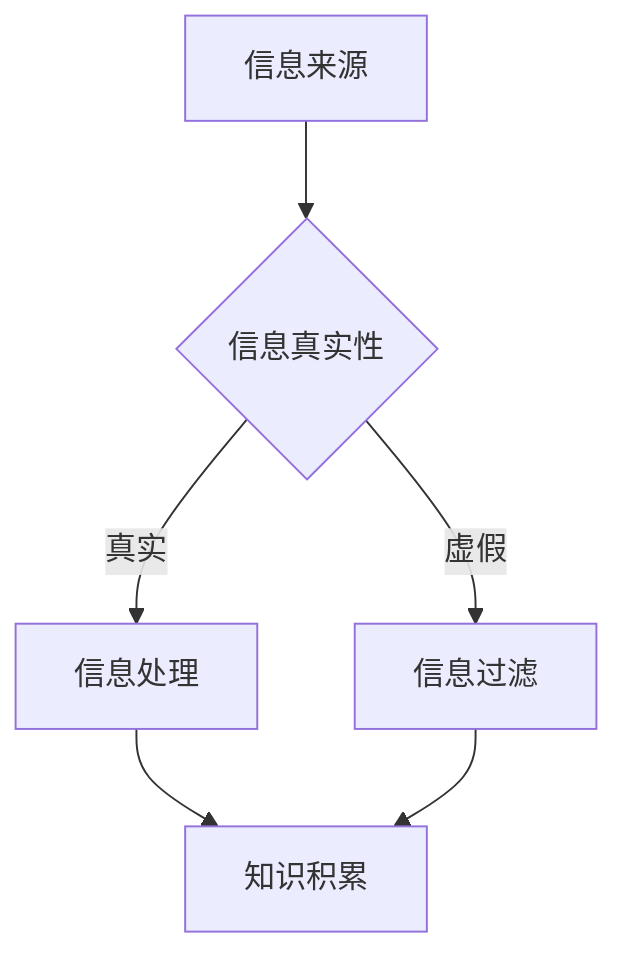
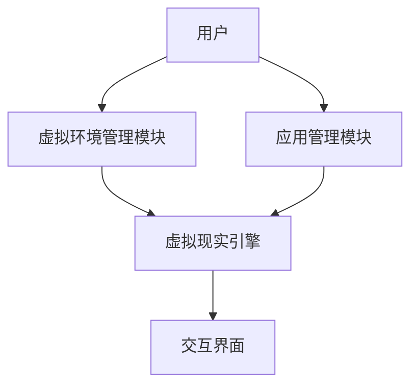
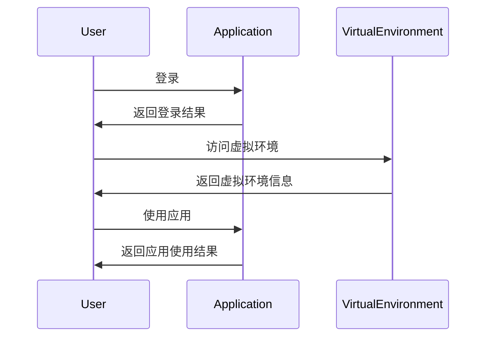

                 

### 1.1 信息时代的演变

#### 1.1.1 信息社会的兴起

信息社会的兴起可以追溯到20世纪中叶，尤其是计算机技术和互联网的快速发展，使得信息的存储、传输和处理变得更加高效。在早期的计算机时代，计算机主要用于科学研究和军事应用，但随着时间的推移，计算机逐渐渗透到商业、教育和日常生活中。

##### 1.1.2 互联网的普及

互联网的普及是信息社会的重要标志。自20世纪90年代以来，互联网逐渐从学术和研究领域扩展到全球的商业和个人生活中。互联网的普及不仅改变了人们的沟通方式，也改变了商业模式的构建。电子商务、在线支付、社交媒体等新兴行业在互联网的推动下蓬勃发展。

##### 1.1.3 数字化的推动

数字化的推动是信息社会的核心。数字化将传统的物理实体转化为数字形式，使得信息的获取、存储、处理和传播变得更加便捷。例如，书籍、音乐、电影等文化产品通过数字化技术得以在网络空间中传播，大大丰富了人们的精神生活。

#### 1.2 虚拟现实技术的发展

##### 1.2.1 虚拟现实的定义

虚拟现实（Virtual Reality，VR）是一种通过计算机技术创建的模拟环境，用户可以在其中进行交互和体验。虚拟现实技术利用计算机生成的三维图像、声音和触觉反馈，使用户产生沉浸感，仿佛置身于一个全新的虚拟世界中。

##### 1.2.2 虚拟现实技术的关键要素

虚拟现实技术的关键要素包括：

- **图像生成**：通过计算机生成高质量的三维图像，是虚拟现实体验的基础。
- **显示设备**：如头戴式显示器（HMD），能够将生成的图像直接呈现在用户眼前。
- **传感器**：用于检测用户的动作和位置，以便在虚拟环境中进行实时交互。
- **声音系统**：通过立体声音效和空间音效，增强用户的沉浸感。
- **触觉反馈**：通过触觉手套或其他设备，为用户提供真实的触觉体验。

##### 1.2.3 虚拟现实技术的演进历程

虚拟现实技术的发展历程可以分为以下几个阶段：

- **早期实验**：20世纪60年代，计算机科学家开始探索虚拟现实技术的可能性，例如伊凡·苏达罗夫开发的“苏达罗夫头盔”。
- **初步实现**：20世纪80年代，VR技术的初步实现使得虚拟现实体验成为可能，例如Jaron Lanier开发的VR设备“数据手套”。
- **商业化发展**：21世纪初，随着技术的进步和成本的降低，虚拟现实开始商业化发展，例如Oculus Rift、HTC Vive等VR设备的推出。
- **沉浸式体验**：当前，虚拟现实技术已经发展到能够提供高度沉浸的体验，不仅限于娱乐和游戏，还广泛应用于教育、医疗、建筑等领域。

#### 1.3 后真实时代的概念

##### 1.3.1 后真实时代的定义

后真实时代（Post-Truth Era）是指一个信息泛滥、事实被忽视、情感和偏见主导公共讨论的时代。在这个时代，人们更容易被虚假信息所误导，而真实和客观的真相变得难以辨别。

##### 1.3.2 后真实时代的背景

后真实时代的背景可以从以下几个方面来理解：

- **技术发展**：互联网和社交媒体的普及使得信息传播速度极快，同时也使得虚假信息的传播变得更加容易。
- **社会变革**：全球化、政治动荡和社交媒体的兴起导致了信息碎片化和群体极化的现象。
- **文化差异**：不同文化对真实和事实的理解存在差异，这进一步加剧了后真实时代的复杂性。

##### 1.3.3 后真实时代的特点

后真实时代的特点包括：

- **信息过载**：人们每天接收到的信息量巨大，难以分辨真假。
- **情感导向**：信息传播往往更加关注情感和偏见，而非客观事实。
- **群体极化**：人们在信息传播过程中更容易与已有观点保持一致，导致群体极化现象。
- **真实与虚假交织**：真实和虚假的信息交织在一起，使得真相难以辨别。

#### 1.4 后真实时代的特点

##### 1.4.1 信息过载

在信息社会中，信息量的激增带来了信息过载的问题。人们每天接收到的信息量远远超过了处理能力，这导致了对信息的筛选和辨别变得尤为重要。

##### 1.4.2 虚拟身份的普及

在虚拟世界中，人们可以创建不同的虚拟身份，这些身份可能与其现实身份截然不同。虚拟身份的普及改变了人们对身份的认识和理解。

##### 1.4.3 线上社交的复杂性

线上社交的便利性使得人们可以与全球各地的人建立联系，但同时也带来了复杂性。虚拟社交与现实社交之间的差异和冲突成为了一个值得关注的问题。

##### 1.4.4 虚拟现实的沉浸感

虚拟现实技术提供了高度沉浸的体验，使用户仿佛置身于另一个世界。这种沉浸感不仅影响了人们的娱乐方式，还可能对现实生活产生影响。

#### 1.5 本章小结

后真实时代的背景与定义的总结如下：

- **信息时代的演变**：从信息社会的兴起、互联网的普及到数字化的推动，信息时代的演变为后真实时代的到来奠定了基础。
- **虚拟现实技术的发展**：虚拟现实技术的演进历程和关键要素为后真实时代的沉浸式体验提供了技术支撑。
- **后真实时代的概念**：后真实时代是一个信息泛滥、情感和偏见主导的时代，其特点包括信息过载、虚拟身份的普及、线上社交的复杂性以及虚拟现实的沉浸感。

未来的发展方向与挑战包括：

- **技术的进步**：随着技术的不断进步，虚拟现实和人工智能将进一步融合，带来更多可能性。
- **伦理和法律的完善**：随着虚拟现实技术的发展，相关的伦理和法律问题需要得到解决。
- **社会文化的适应**：社会文化需要适应后真实时代的特点，培养批判性思维和数字素养。

---

### 2.1 虚拟世界的沉浸感

#### 2.1.1 虚拟现实体验的升级

虚拟现实体验的升级是后真实时代的一个重要特征。通过高度真实的三维图像、立体声音效和触觉反馈，虚拟现实技术为用户提供了前所未有的沉浸感。例如，Oculus Rift、HTC Vive等VR设备通过头戴式显示器和手柄，使用户能够在虚拟环境中自由移动和互动。这种沉浸感不仅提升了用户的体验，也为教育和培训等领域提供了新的应用场景。

##### 2.1.2 沉浸式娱乐的崛起

沉浸式娱乐是虚拟现实技术的一个重要应用领域。通过虚拟现实技术，用户可以体验到高度真实的游戏、电影和音乐会等娱乐内容。例如，虚拟现实游戏《Beat Saber》通过音乐和动作的结合，为用户提供了身临其境的娱乐体验。此外，虚拟现实电影院和虚拟现实音乐会等新兴业态也在不断涌现，为人们带来了全新的娱乐方式。

##### 2.1.3 虚拟现实在教育中的应用

虚拟现实技术在教育领域中的应用日益广泛。通过虚拟现实技术，学生可以身临其境地参与各种教学活动，提高学习效果。例如，医学专业学生可以通过虚拟现实模拟手术，提高手术技能和应对紧急情况的能力。此外，虚拟现实还可以用于历史教学、地理探索、科学实验等领域，为学生提供更加生动和直观的学习体验。

#### 2.2 线上社交的变革

##### 2.2.1 社交平台的多样化

随着互联网的普及，社交平台呈现出多样化的趋势。从早期的Facebook、Twitter到如今的各种短视频平台、直播平台，社交平台的形式和功能不断丰富。这种多样化不仅满足了用户的不同需求，也为社交互动提供了更多可能性。例如，短视频平台如抖音、快手等，通过短视频的形式，使用户可以快速分享生活点滴和创意内容，增强了社交互动的乐趣。

##### 2.2.2 线上社交的便利性

线上社交的便利性是后真实时代的一个重要特点。用户可以通过网络随时随地与他人进行交流，不再受限于地理位置。这种便利性使得社交活动更加频繁，但也带来了复杂性。例如，社交媒体上的点赞、评论、私信等功能，使得用户可以轻松地与他人互动，但同时也容易导致社交疲劳和信息过载。

##### 2.2.3 虚拟社交对人际关系的影响

虚拟社交对人际关系产生了深远的影响。一方面，虚拟社交使得人们可以轻松地建立和维持远距离的人际关系，拓展社交圈。例如，通过社交平台，人们可以与来自世界各地的朋友保持联系。另一方面，虚拟社交也可能导致现实社交的疏远。由于过度依赖虚拟社交，一些人可能忽视了现实生活中的人际关系，导致社交能力的下降。

#### 2.3 虚拟与现实生活的融合

##### 2.3.1 虚拟商品的现实购买

虚拟商品的现实购买是虚拟与现实融合的一个典型例子。通过虚拟现实技术，用户可以在虚拟环境中浏览和购买商品，例如虚拟试衣、虚拟旅游等。这种虚拟与现实融合的消费模式，不仅提升了购物体验，也为商家提供了新的营销渠道。

##### 2.3.2 虚拟现实旅游

虚拟现实旅游使得用户可以身临其境地体验世界各地的风景和文化。通过虚拟现实头盔，用户可以在虚拟环境中漫步于巴黎的埃菲尔铁塔、纽约的自由女神像，甚至探索遥远的星际空间。虚拟现实旅游不仅为旅游业带来了新的增长点，也为那些无法亲身前往某些地方的人提供了独特的体验。

##### 2.3.3 虚拟现实会议

虚拟现实会议是虚拟与现实融合的另一个重要应用。通过虚拟现实技术，参会者可以身临其境地参加线上会议，无需受限于地理位置。虚拟现实会议不仅提高了会议的参与度和效率，还减少了会议的成本和碳排放。

#### 2.4 虚拟现实的伦理挑战

##### 2.4.1 虚拟世界的隐私问题

虚拟世界的隐私问题是虚拟现实技术发展过程中面临的一个重要挑战。由于虚拟现实技术的高度沉浸性和互动性，用户的个人信息和数据更容易被泄露。例如，虚拟现实设备可能会记录用户的动作和声音，这些数据如果被滥用，可能会对用户造成隐私侵犯。

##### 2.4.2 虚拟身份的真实性

虚拟身份的真实性也是虚拟现实技术发展过程中需要关注的问题。在虚拟世界中，用户可以创建多种虚拟身份，这些身份可能与其现实身份截然不同。如何确保虚拟身份的真实性和可信性，是一个亟待解决的问题。

##### 2.4.3 虚拟现实的道德边界

虚拟现实的道德边界是另一个值得探讨的问题。在虚拟世界中，用户可能会面临各种道德选择，例如在虚拟游戏中杀人、欺诈等。如何确保虚拟世界中的道德秩序，避免对现实世界的负面影响，是一个重要的伦理挑战。

#### 2.5 本章小结

虚拟与现实交织的现象的总结如下：

- **虚拟世界的沉浸感**：虚拟现实技术的升级和沉浸式娱乐的崛起，为用户提供了前所未有的沉浸体验。
- **线上社交的变革**：社交平台的多样化和线上社交的便利性，改变了人们的社交方式，但同时也带来了复杂性。
- **虚拟与现实生活的融合**：虚拟商品的现实购买、虚拟现实旅游和虚拟现实会议等应用，使得虚拟与现实之间的界限越来越模糊。
- **虚拟现实的伦理挑战**：隐私问题、虚拟身份的真实性和道德边界，是虚拟现实技术发展过程中需要关注的重要伦理问题。

未来的发展与应用趋势包括：

- **技术的进步**：随着虚拟现实技术的不断进步，沉浸感将进一步提升，为更多领域带来新的应用。
- **应用场景的拓展**：虚拟现实技术将在教育、医疗、旅游等领域得到更广泛的应用，为人们的生活带来更多便利。
- **伦理和法律的完善**：随着虚拟现实技术的发展，相关的伦理和法律问题需要得到解决，以确保虚拟与现实的安全和秩序。

---

### 3.1 对个人身份的影响

#### 3.1.1 虚拟身份与现实身份的冲突

在虚拟世界中，个人可以创建多种虚拟身份，这些身份可能与现实身份截然不同。这种虚拟身份与现实身份的冲突，对个人的认知和行为产生了深远的影响。例如，一个人在虚拟世界中可能扮演一个勇敢的战士，而在现实生活中却可能非常内向。这种身份的矛盾可能导致个人在现实生活中的困扰和焦虑。

##### 3.1.2 个人身份的多元化

虚拟现实技术使得个人身份的多元化成为可能。在虚拟世界中，个人可以扮演不同的角色，探索不同的生活体验。这种多元化不仅丰富了个人的人生经历，也提升了个人在虚拟世界中的存在感和认同感。然而，这也可能导致个人在现实生活中的角色混乱和认同危机。

##### 3.1.3 虚拟世界的自我表达

虚拟世界为个人提供了一个全新的自我表达平台。在现实生活中，由于种种原因，个人可能无法完全表达自己的真实想法和情感。而在虚拟世界中，个人可以自由地表达自己的想法和情感，甚至可以创造出一个全新的自我形象。这种自我表达不仅有助于个人心理健康，也可能对现实生活产生积极的影响。

#### 3.2 对人际关系的影响

##### 3.2.1 虚拟社交的利与弊

虚拟社交具有显著的利弊。一方面，虚拟社交打破了地理位置的限制，使得人们可以轻松地与全球各地的人建立联系。这种联系不仅扩大了社交圈，也为个人提供了更多的社交机会。另一方面，虚拟社交也带来了一些负面影响。例如，过度依赖虚拟社交可能导致现实社交能力的下降，甚至引发社交焦虑和抑郁。

##### 3.2.2 人际关系的虚拟化

随着虚拟社交的普及，人际关系逐渐呈现出虚拟化的趋势。在虚拟社交平台上，人们更多地依赖于文字、图片和视频进行交流，而面对面交流的机会减少。这种虚拟化的人际关系虽然方便了沟通，但也可能导致人际关系的疏离和淡化。例如，人们在虚拟社交平台上可能更愿意分享日常琐事，而忽略了深层次的情感交流和思想碰撞。

##### 3.2.3 虚拟现实对人际关系的挑战

虚拟现实技术对人际关系提出了新的挑战。在虚拟现实环境中，人们可以体验到高度沉浸的互动，但这种互动可能缺乏现实中的情感深度和复杂性。例如，虚拟现实中的恋爱关系可能显得过于简单和表面，难以达到现实中的深度和持久性。此外，虚拟现实中的冲突和矛盾也可能难以得到有效的解决，从而对现实人际关系产生负面影响。

#### 3.3 对工作与生活方式的影响

##### 3.3.1 虚拟办公的普及

虚拟办公是后真实时代的一个重要趋势。随着互联网和虚拟现实技术的发展，越来越多的企业开始采用虚拟办公模式。虚拟办公不仅提高了工作效率，还降低了企业的运营成本。例如，员工可以通过远程办公系统在线协作，无需受限于地理位置。此外，虚拟现实技术还可以用于虚拟会议和虚拟培训，为企业和员工提供更加灵活和高效的工作方式。

##### 3.3.2 虚拟现实的娱乐化

虚拟现实技术的娱乐化趋势显著。通过虚拟现实技术，用户可以在虚拟环境中体验到各种娱乐活动，如虚拟游戏、虚拟旅游和虚拟健身等。这种娱乐化不仅丰富了人们的精神生活，也为娱乐产业带来了新的增长点。例如，虚拟现实游戏《Beat Saber》通过独特的游戏体验，吸引了大量玩家。此外，虚拟现实音乐会和虚拟现实电影等新兴业态也在不断涌现，为娱乐产业带来了新的发展机遇。

##### 3.3.3 生活方式的变革

虚拟现实技术对生活方式产生了深远的影响。在虚拟世界中，人们可以体验到与现实不同的生活场景和生活方式。例如，通过虚拟现实技术，人们可以身临其境地体验异国风情，无需长途旅行。此外，虚拟现实技术还可以用于家庭娱乐、教育学习和健康管理等各个方面，为人们的生活带来更多便利和乐趣。

#### 3.4 对社会与文化的影响

##### 3.4.1 社会结构的变化

虚拟现实技术对社会结构产生了深远的影响。一方面，虚拟现实技术打破了传统的社交边界，使得人们可以轻松地与全球各地的人建立联系。这种联系不仅促进了文化的交流和融合，也可能导致社会结构的变革。例如，虚拟现实技术使得远程工作变得更加普及，从而改变了传统的办公模式和社会结构。

##### 3.4.2 文化认同的冲突

随着虚拟现实技术的发展，文化认同的冲突也日益凸显。在虚拟世界中，人们可以创建不同的虚拟身份和文化，这些身份和文化可能与现实世界的文化截然不同。这种冲突不仅可能导致文化认同的混乱，也可能引发文化冲突和矛盾。例如，虚拟现实游戏中的文化元素可能引发不同文化背景玩家的争议和冲突。

##### 3.4.3 文化创新的机遇

虚拟现实技术为文化创新提供了新的机遇。通过虚拟现实技术，人们可以创造出全新的文化形式和艺术作品。例如，虚拟现实音乐会和虚拟现实艺术展等新兴文化形式，不仅丰富了人们的文化生活，也为艺术家提供了新的创作空间和表达方式。此外，虚拟现实技术还可以用于文化遗产的数字化保护和传承，为文化创新提供了新的思路和途径。

### 3.5 本章小结

后真实时代的影响总结如下：

- **对个人身份的影响**：虚拟身份与现实身份的冲突、个人身份的多元化以及虚拟世界的自我表达，改变了人们对身份的认知和行为。
- **对人际关系的影响**：虚拟社交的利与弊、人际关系的虚拟化以及虚拟现实对人际关系的挑战，对社交方式和社交质量产生了深远的影响。
- **对工作与生活方式的影响**：虚拟办公的普及、虚拟现实的娱乐化以及生活方式的变革，为工作和生活带来了新的便利和机遇。
- **对社会与文化的影响**：社会结构的变化、文化认同的冲突以及文化创新的机遇，对社会和文化产生了深远的影响。

未来的发展与应用趋势包括：

- **技术的进步**：随着虚拟现实技术和人工智能等技术的发展，后真实时代的影响将进一步扩大和深化。
- **应用场景的拓展**：虚拟现实技术将在教育、医疗、文化娱乐等领域得到更广泛的应用，为人们的生活和社会发展带来更多便利和创新。
- **伦理和法律的完善**：随着虚拟现实技术的发展，相关的伦理和法律问题需要得到解决，以确保虚拟与现实的安全和秩序。

---

### 4.1 重新认识自己

在虚拟与现实交织的后真实时代，重新认识自己变得尤为重要。虚拟世界提供了一个全新的自我表达平台，使得个人可以在不同的虚拟身份中探索和发现自己。这个过程不仅有助于个人成长和自我实现，也可能对现实生活中的行为和决策产生积极影响。

首先，通过虚拟身份的探索，个人可以发现自己潜在的兴趣和才能。在虚拟世界中，个人可以尝试不同的职业和角色，例如在虚拟游戏、虚拟社区或虚拟现实中扮演不同的角色。这种探索不仅能够帮助个人发现自己的兴趣点，还能激发创造力和创新思维。

其次，虚拟世界为个人提供了一个反思自我和自我提升的空间。在现实世界中，个人可能因为种种原因而无法完全表达自己的真实想法和情感。而在虚拟世界中，个人可以自由地表达和探索自己的内心世界，从而更好地理解自己。这种自我探索有助于个人建立健康的自我认知，提高自我价值感和自尊心。

此外，虚拟世界还为个人提供了一个安全的空间，可以尝试不同的生活场景和生活方式。通过虚拟现实技术，个人可以身临其境地体验异国风情、历史场景或未来世界，从而拓宽视野，提升对世界的认知和理解。这种体验不仅能够激发个人的好奇心和探索欲望，还能帮助个人更好地适应现实生活中的变化和挑战。

#### 4.2 虚拟与现实平衡

在虚拟与现实交织的环境中，保持虚拟与现实平衡是至关重要的。虚拟世界提供了丰富的互动和体验，但也可能使人沉溺其中，忽视现实生活中的责任和义务。因此，如何平衡虚拟与现实生活，成为一个亟待解决的问题。

首先，个人需要意识到虚拟世界与现实生活的区别。虚拟世界虽然能够提供丰富的互动和体验，但无法替代现实生活中的真实情感和人际关系。因此，个人应该在享受虚拟世界带来的乐趣的同时，保持对现实生活的关注和参与。

其次，个人应该合理安排时间和精力，确保虚拟世界和现实生活之间的平衡。例如，设定明确的虚拟世界使用时间，避免过度沉迷。此外，个人还应该积极参与现实生活中的社交、工作和娱乐活动，保持与现实世界的联系。

另外，培养自我控制和自律能力也是保持虚拟与现实平衡的关键。通过自我控制和自律，个人可以更好地管理自己的时间和精力，避免被虚拟世界所诱惑和消耗。例如，可以通过设定目标、制定计划和使用时间管理工具等方式，提高自我控制能力。

最后，家庭和社交支持也是保持虚拟与现实平衡的重要因素。家人和朋友的支持可以帮助个人更好地认识到虚拟世界和现实生活的区别，提供现实生活中的情感支持和陪伴。例如，家人可以通过定期的交流、共同参与现实生活中的活动等方式，帮助个人保持对现实生活的关注。

#### 4.3 内在探索

内在探索是个人成长和自我提升的重要过程。在虚拟与现实交织的后真实时代，通过内在探索，个人可以更好地了解自己的内心世界，提升自我认知和心理健康。

首先，通过冥想和自我反思，个人可以深入探索自己的内心世界。冥想是一种有效的内在探索方法，通过冥想，个人可以静下心来，专注于自己的内在体验。这种专注有助于个人更好地了解自己的情绪、需求和价值观，从而提高自我认知。

其次，通过艺术创作和写作，个人可以表达和探索自己的内心世界。艺术创作和写作是一种释放内心情感和思想的方式，通过创作和写作，个人可以更好地理解和表达自己的内心体验。这种表达有助于个人释放负面情绪，提升心理健康。

此外，通过参加心理辅导和心理咨询，个人可以更深入地探索自己的内心世界。心理辅导和心理咨询提供了一种安全和支持的环境，个人可以在专业辅导师的指导下，探索自己的内心困惑和问题，找到解决方法。

最后，通过自我接纳和自我成长，个人可以更好地面对自己的内心世界。自我接纳意味着接受自己的优点和不足，不把自己与他人比较。自我成长则是一种积极的心态，通过不断学习和成长，个人可以提升自己的内在力量和自我价值感。

#### 4.4 心理健康与自我成长

心理健康与自我成长在虚拟与现实交织的后真实时代显得尤为重要。在这个信息爆炸、虚拟世界日益普及的时代，个人面临的压力和挑战不断增加，如何保持心理健康和实现自我成长成为了一个关键问题。

首先，心理健康对个人的整体幸福感和生活质量有着重要影响。在虚拟与现实交织的环境中，个人可能会面临信息过载、社交压力、虚拟世界的沉迷等问题，这些问题可能导致焦虑、抑郁等心理问题的出现。因此，保持心理健康是个人幸福和发展的基础。

其次，自我成长是个人在虚拟与现实交织的时代中应对挑战、实现自我价值的关键。通过自我成长，个人可以提升自己的能力、拓展视野、增强自信，从而更好地适应虚拟世界和现实生活的变化。

为了保持心理健康和实现自我成长，个人可以采取以下策略：

- **时间管理**：合理安排时间，确保有足够的时间用于虚拟世界和现实生活。例如，设定明确的虚拟世界使用时间，避免过度沉迷。
- **自我反思**：定期进行自我反思，了解自己的情绪、需求和价值观，调整自己的行为和态度。
- **心理健康教育**：学习和了解心理健康知识，提高自我认知和心理调节能力。
- **社交支持**：寻求家人、朋友和专业人士的支持，分享自己的感受和困惑，获得帮助和指导。
- **兴趣爱好**：培养兴趣爱好，参与丰富多样的活动，提升生活质量和心理健康。
- **自我接纳**：接受自己的优点和不足，不把自己与他人比较，培养积极的心态。
- **持续学习**：不断学习和成长，提升自己的知识和技能，适应虚拟世界和现实生活的变化。

总之，在虚拟与现实交织的后真实时代，保持心理健康和实现自我成长是一个长期而复杂的过程。通过采取有效的策略和积极的心态，个人可以更好地应对挑战，实现自我价值，享受更高质量的生活。

### 4.5 应对后真实时代的策略

在虚拟与现实交织的后真实时代，个人和组织需要采取一系列策略来适应和应对这一变化。以下是一些关键策略：

#### 4.5.1 增强现实感

增强现实感是应对后真实时代的一个核心策略。通过提升对现实世界的感知和体验，个人可以更好地在虚拟世界和现实世界之间建立联系。以下是一些增强现实感的方法：

- **提高感官体验**：通过高质量的视觉、听觉和触觉设备，提升对现实世界的感知和体验。例如，使用高质量的耳机和显示器，提高声音和图像的清晰度。
- **多感官互动**：通过多感官互动，增强对现实世界的感知和参与。例如，在户外活动中加入声音和视觉效果的增强，提高活动的趣味性和吸引力。
- **现实世界探索**：积极参与现实世界的活动和探索，提升对现实世界的了解和认知。例如，参加户外徒步、登山等活动，体验自然的美妙和生活的多样性。

#### 4.5.2 培养批判性思维

批判性思维是应对后真实时代的重要能力。在信息泛滥和虚假信息泛滥的时代，培养批判性思维有助于个人更好地辨别信息真伪，避免被误导。以下是一些培养批判性思维的方法：

- **质疑信息来源**：对所接收到的信息进行质疑，了解信息来源的可靠性。例如，查阅多个来源的信息，判断信息的真实性和可信度。
- **分析信息内容**：对信息的内容进行深入分析，了解其背后的逻辑和观点。例如，通过分析信息的论点、论据和逻辑推理，评估其合理性和可信度。
- **批判性讨论**：参与批判性讨论，与他人交流不同的观点和看法。例如，通过参与辩论和讨论，提高自己的思考能力和表达能力。

#### 4.5.3 提高沟通能力

在虚拟与现实交织的时代，提高沟通能力变得尤为重要。良好的沟通能力有助于个人在虚拟世界和现实世界中更好地与他人互动和合作。以下是一些提高沟通能力的方法：

- **倾听技巧**：提高倾听技巧，关注对方的观点和感受。例如，通过积极倾听，了解对方的真实需求和期望，提高沟通效果。
- **表达清晰**：提高表达清晰度，确保信息传递的准确性和有效性。例如，使用简明扼要的语言和具体的例子，提高表达的可理解性。
- **非语言沟通**：注意非语言沟通的技巧，如肢体语言、面部表情和语调等。例如，通过适当的肢体语言和表情，增强沟通的吸引力和影响力。

#### 4.5.4 建立现实与虚拟的边界

建立现实与虚拟的边界是应对后真实时代的关键策略。通过明确现实和虚拟世界的界限，个人可以更好地管理时间和精力，避免虚拟世界对现实生活的负面影响。以下是一些建立现实与虚拟边界的方法：

- **时间管理**：设定明确的虚拟世界使用时间，避免过度沉迷。例如，每天设定固定的虚拟世界使用时间，确保有足够的时间用于现实生活。
- **空间分隔**：在现实生活空间和虚拟世界之间建立明确的分隔。例如，在家中设立一个专门的虚拟世界体验区域，确保虚拟世界活动不会干扰现实生活中的事务。
- **心理健康**：关注虚拟世界活动对心理健康的影响，采取适当的措施维护心理健康。例如，定期进行心理健康检查，通过冥想、运动和社交活动等方式，缓解虚拟世界带来的压力和焦虑。

#### 4.5.5 培养适应能力

在虚拟与现实交织的后真实时代，培养适应能力是个人和组织成功的关键。以下是一些培养适应能力的方法：

- **持续学习**：不断学习和更新知识，适应不断变化的技术和环境。例如，通过参加培训课程、阅读专业书籍和文章等方式，提升自己的专业素养和适应能力。
- **灵活应变**：提高灵活应变能力，迅速适应新的挑战和变化。例如，在面对突发事件时，能够迅速调整计划和方法，应对变化。
- **团队合作**：培养团队合作精神，与他人共同应对挑战。例如，通过积极参与团队活动和项目合作，提升团队合作能力和适应能力。

总之，在虚拟与现实交织的后真实时代，个人和组织需要采取一系列策略来适应和应对这一变化。通过增强现实感、培养批判性思维、提高沟通能力、建立现实与虚拟的边界和培养适应能力，个人和组织可以更好地应对挑战，实现自我价值，享受更高质量的生活。

### 4.6 虚拟现实的应用与实践

#### 4.6.1 教育领域中的应用

虚拟现实技术在教育领域中的应用日益广泛，为教师和学生提供了丰富的教学和学习资源。以下是一些具体的应用实例：

- **虚拟实验室**：通过虚拟现实技术，学生可以在虚拟环境中进行实验，无需实际操作化学试剂或机械设备。例如，医学专业学生可以通过虚拟现实模拟手术，提高手术技能和应对紧急情况的能力。这种虚拟实验室不仅提高了实验的可行性和安全性，还减少了实验成本。
- **虚拟课堂**：虚拟现实技术使得教师可以创建高度沉浸的教学环境，使学生能够身临其境地参与课堂活动。例如，地理教师可以带领学生虚拟参观世界各地的著名景点，历史教师可以通过虚拟现实技术重现历史事件，让学生更好地理解历史背景。这种虚拟课堂不仅提高了教学效果，还增强了学生的参与感和兴趣。
- **个性化学习**：虚拟现实技术可以根据学生的兴趣和需求，提供个性化的学习资源。例如，学生可以通过虚拟现实游戏，自主选择学习路径和内容，提高学习效率和兴趣。此外，虚拟现实技术还可以用于学习评估，通过虚拟现实环境中的互动和任务，实时监测学生的学习效果，提供个性化的学习建议。

#### 4.6.2 医疗健康领域中的应用

虚拟现实技术在医疗健康领域中的应用具有巨大的潜力，可以改善患者的治疗体验和医疗人员的培训效果。以下是一些具体的应用实例：

- **患者治疗体验**：虚拟现实技术可以用于改善患者的治疗体验，减少患者的恐惧和焦虑。例如，通过虚拟现实技术，患者可以在虚拟环境中进行手术前的模拟体验，了解手术过程和术后恢复，减轻手术压力。此外，虚拟现实技术还可以用于心理治疗，通过虚拟现实环境中的互动和训练，帮助患者缓解焦虑、抑郁等心理问题。
- **医疗培训**：虚拟现实技术为医疗人员提供了高效的培训平台，通过虚拟现实模拟，医疗人员可以在安全、无风险的环境中练习手术技巧和应对紧急情况。例如，外科医生可以通过虚拟现实技术模拟各种复杂手术，提高手术技能和应对紧急情况的能力。此外，虚拟现实技术还可以用于医学知识的学习和传授，通过虚拟现实课程和互动教学，提高医疗人员的专业素养。
- **医疗康复**：虚拟现实技术可以用于医疗康复，帮助患者恢复身体功能和心理状态。例如，通过虚拟现实训练，患者可以进行精细的手部运动和协调性训练，促进手部功能的恢复。此外，虚拟现实技术还可以用于心理康复，通过虚拟现实环境中的互动和训练，帮助患者缓解焦虑、抑郁等心理问题，提高心理健康水平。

#### 4.6.3 文化娱乐领域中的应用

虚拟现实技术在文化娱乐领域中的应用丰富多样，为人们提供了全新的娱乐体验和文化消费方式。以下是一些具体的应用实例：

- **虚拟旅游**：虚拟现实技术使得人们可以在家中体验世界各地的著名景点和文化景观。例如，通过虚拟现实技术，人们可以虚拟参观巴黎的埃菲尔铁塔、纽约的自由女神像，甚至探索遥远的星际空间。这种虚拟旅游不仅节省了旅行成本，还为人们提供了独特的文化体验。
- **虚拟现实游戏**：虚拟现实技术为游戏领域带来了全新的变革。通过虚拟现实头盔和手柄，玩家可以身临其境地参与游戏，体验更加真实和刺激的游戏场景。例如，虚拟现实游戏《Beat Saber》通过音乐和动作的结合，为玩家提供了身临其境的娱乐体验。此外，虚拟现实游戏还可以用于教育和培训，通过虚拟现实场景中的互动和任务，提高玩家的技能和知识。
- **虚拟现实电影和音乐会**：虚拟现实技术使得电影和音乐会等文化消费形式变得更加生动和沉浸。例如，通过虚拟现实技术，观众可以身临其境地观看电影，体验电影中的情节和场景。此外，虚拟现实音乐会也日益普及，观众可以通过虚拟现实技术，身临其境地观看音乐会现场，享受高质量的视听体验。

#### 4.6.4 社会服务领域中的应用

虚拟现实技术在社会服务领域中的应用也具有巨大的潜力，可以改善社会服务的质量和效率。以下是一些具体的应用实例：

- **虚拟现实心理咨询**：虚拟现实技术可以用于心理咨询和治疗，通过虚拟现实环境中的互动和训练，帮助患者缓解焦虑、抑郁等心理问题。例如，通过虚拟现实技术，心理咨询师可以在安全、无风险的环境中与患者进行互动，提供个性化的心理治疗服务。
- **虚拟现实救灾演练**：虚拟现实技术可以用于救灾演练和培训，通过虚拟现实场景的模拟，提高救援人员的应对能力和救灾效率。例如，通过虚拟现实技术，救援人员可以在虚拟环境中进行地震、火灾等灾害的救援演练，提高应对突发事件的能力。
- **虚拟现实社会福利服务**：虚拟现实技术可以用于社会福利服务，为弱势群体提供更加便捷和高质量的服务。例如，通过虚拟现实技术，社会福利机构可以为残疾人、老年人等提供虚拟康复训练、心理咨询和社交互动等服务，提高他们的生活质量和社会参与度。

#### 4.6.5 案例分析

以下是一个具体的案例分析，展示了虚拟现实技术在教育领域中的应用：

**案例：虚拟现实英语教学**

某教育机构利用虚拟现实技术，开发了一款英语教学应用。通过虚拟现实头盔和手柄，学生可以身临其境地参与英语课程，体验真实的英语学习场景。以下是该应用的几个关键特点：

1. **沉浸式学习环境**：应用通过虚拟现实技术，创建了一个沉浸式的英语学习环境。学生可以在虚拟的英语国家中，与虚拟人物进行互动，学习英语对话和表达。
2. **互动性**：应用提供了丰富的互动性功能，学生可以通过手柄与虚拟人物进行互动，回答问题、参与游戏等。这种互动性提高了学生的学习积极性和兴趣。
3. **个性化学习**：应用可以根据学生的学习进度和需求，提供个性化的学习内容。例如，对于词汇学习，应用可以根据学生的掌握情况，调整词汇的难度和呈现方式。
4. **实时反馈**：应用提供了实时反馈功能，学生可以通过语音识别技术，实时练习发音和口语表达。应用会即时提供纠正和建议，帮助学生改进发音和口语技巧。

通过这款虚拟现实英语教学应用，学生可以在真实的英语学习场景中，提高英语听说能力。这种沉浸式、互动性和个性化的学习体验，不仅提高了学生的学习效果，还增强了他们的学习兴趣和自信心。

### 4.7 未来展望与挑战

#### 4.7.1 后真实时代的趋势

后真实时代是一个充满变革和机遇的时代。随着虚拟现实、人工智能和区块链等新兴技术的快速发展，虚拟与现实之间的界限将变得更加模糊，人们的生活方式和社会结构也将发生深刻的变化。以下是后真实时代的几个主要趋势：

1. **虚拟与现实融合**：虚拟现实技术将越来越成熟，虚拟世界与现实世界将实现更加紧密的融合。人们可以通过虚拟现实设备，随时随地进入虚拟世界，体验各种虚拟活动，如虚拟旅游、虚拟购物和虚拟社交等。
2. **数字化身份**：随着虚拟现实技术的发展，数字化身份将逐渐成为人们身份识别的重要组成部分。人们将在虚拟世界中创建多种虚拟身份，这些身份可能与现实身份截然不同，但将具有同等重要的地位。
3. **智能化的生活**：人工智能技术的应用将使生活变得更加智能化和便捷化。例如，智能家居系统将能够自动调节室内温度、灯光和安防设备，提供个性化的生活体验。
4. **数字经济的崛起**：随着虚拟现实和区块链等技术的应用，数字经济将迅速发展，虚拟商品和数字资产将成为重要的经济形式。例如，虚拟房地产、虚拟货币和数字艺术品等将成为新的投资和交易领域。

#### 4.7.2 技术发展的挑战

尽管后真实时代充满了机遇，但技术发展也面临一系列挑战。以下是后真实时代技术发展的几个关键挑战：

1. **隐私保护**：虚拟现实和大数据技术的应用，使得个人隐私泄露的风险增加。如何保护用户隐私，确保数据安全，是技术发展面临的重要问题。
2. **数据安全**：随着虚拟世界的扩展，数据安全将成为一个关键问题。例如，虚拟现实应用中的用户数据、虚拟货币的交易数据等，都需要得到有效的保护。
3. **技术标准**：随着虚拟现实和人工智能等技术的发展，制定统一的技术标准变得尤为重要。缺乏统一的技术标准，可能导致不同系统和平台之间的兼容性问题。
4. **伦理和法律问题**：虚拟现实技术的发展引发了一系列伦理和法律问题，如虚拟现实的道德边界、虚拟身份的真实性、虚拟财产的法律地位等。如何解决这些伦理和法律问题，是技术发展的重要课题。

#### 4.7.3 社会影响的反思

后真实时代对社会和文化产生了深远的影响，我们需要反思这些影响，以便更好地适应和应对这一变革。以下是后真实时代社会影响的一些反思：

1. **社会结构的变化**：虚拟现实技术的普及，可能导致社会结构的变化。例如，远程工作和虚拟社交的普及，可能影响传统的社会结构和人际关系。
2. **文化认同的冲突**：虚拟世界中的多样化文化元素，可能引发文化认同的冲突。如何平衡不同文化之间的差异，维护文化多样性，是社会发展的重要课题。
3. **教育改革**：虚拟现实技术的应用，为教育带来了新的机遇和挑战。如何改革教育模式，适应虚拟现实技术的发展，提高学生的数字素养和创新能力，是教育改革的重要任务。
4. **心理健康问题**：虚拟现实技术的广泛应用，可能对心理健康产生负面影响。例如，虚拟世界的沉浸感可能导致社交焦虑和抑郁等问题。因此，如何保障虚拟世界中的心理健康，是社会发展的重要课题。

#### 4.7.4 个人与社会的未来

在后真实时代，个人和社会的未来充满了机遇和挑战。以下是个人与社会的未来发展的一些展望：

1. **个人成长**：通过虚拟现实技术和数字化工具，个人可以更好地了解自己，发现和培养自己的兴趣和才能。虚拟世界将提供丰富的学习资源和实践平台，帮助个人实现自我成长和自我实现。
2. **社会创新**：虚拟现实技术和人工智能等新兴技术的应用，将推动社会创新和进步。通过虚拟现实技术，社会可以探索和实现新的商业模式、社会治理模式和公共文化服务模式。
3. **全球合作**：虚拟现实技术和互联网的普及，将促进全球合作和交流。通过虚拟现实技术，不同国家和文化之间可以更加便捷地进行交流和合作，推动全球社会的发展和进步。

总之，后真实时代是一个充满机遇和挑战的时代。通过积极应对和适应这一变革，个人和社会可以共同实现更大的发展。

### 结尾

在后真实时代，虚拟与现实交织在一起，改变了我们的生活方式、社交模式和社会结构。在这一背景下，重新认识自己、平衡虚拟与现实、探索内在世界、保持心理健康和自我成长变得尤为重要。同时，应对后真实时代的挑战，采取有效的策略，如增强现实感、培养批判性思维、提高沟通能力和建立现实与虚拟的边界，也是我们共同面临的重要课题。

未来，随着技术的不断进步和社会的持续变革，后真实时代将带来更多的机遇和挑战。我们需要保持开放的心态，积极适应这一变革，同时关注伦理和法律问题，确保虚拟世界与现实世界的和谐发展。

对未来的期许是，我们能够在这个充满变革的时代中，找到真正的自我，实现个人价值，推动社会进步，共同创造一个更加美好、和谐和可持续的未来。在这个过程中，让我们携手同行，共同探索后真实时代的无限可能。

---

**作者：** AI天才研究院/AI Genius Institute & 禅与计算机程序设计艺术 /Zen And The Art of Computer Programming

---

### 附录

#### 后真实时代的背景与定义

**核心概念术语说明**：

- **后真实时代**：一个信息泛滥、情感和偏见主导的时代，真实和客观的真相变得难以辨别。
- **虚拟现实**：一种通过计算机技术创建的模拟环境，用户可以在其中进行交互和体验。
- **沉浸感**：用户在虚拟环境中感受到的强烈参与感和现实感。

**问题背景**：

随着互联网和虚拟现实技术的快速发展，人们开始越来越多地依赖于虚拟世界，从而对现实世界的认知和行为产生了深远的影响。

**问题描述**：

如何在这个虚拟与现实交织的后真实时代中，找到真正的自我，保持心理健康，适应和应对这一时代的变革？

**问题解决**：

通过重新认识自己、平衡虚拟与现实、探索内在世界、保持心理健康和自我成长，我们可以在这个后真实时代中找到自己的位置，实现个人价值。

**边界与外延**：

后真实时代的背景和定义主要涉及虚拟现实技术的发展、信息泛滥和情感偏见等问题。其外延包括虚拟与现实的关系、虚拟身份的影响以及社会结构的变革等。

**概念结构与核心要素组成**：

- **虚拟现实技术**：关键要素包括图像生成、显示设备、传感器、声音系统和触觉反馈。
- **后真实时代**：核心概念包括信息过载、虚拟身份的普及、线上社交的复杂性和虚拟现实的沉浸感。

#### 虚拟现实技术的核心概念与联系

**核心概念原理**：

虚拟现实技术通过计算机生成的三维图像、立体声音效和触觉反馈，为用户提供了高度沉浸的虚拟体验。

**概念属性特征对比表格**：

| 特征 | 虚拟现实 | 真实世界 |
| ---- | ---- | ---- |
| **沉浸感** | 强烈 | 较弱 |
| **交互性** | 高度互动 | 较低 |
| **可控性** | 高度可控 | 较低 |
| **安全性** | 有一定风险 | 较高 |

**ER实体关系图架构**：

```
实体：虚拟环境、用户、传感器、显示设备
关系：虚拟环境 -> 用户；用户 -> 传感器；用户 -> 显示设备；传感器 -> 显示设备
```

#### 后真实时代的算法原理

**算法mermaid流程图**：



**算法原理讲解**：

该算法用于处理和过滤信息，确保用户接收到的信息是真实和有用的。具体步骤如下：

1. **信息来源**：从互联网、社交媒体等渠道获取信息。
2. **信息真实性**：判断信息的真实性，分为真实和虚假两种情况。
3. **信息处理**：对于真实信息，进行深入处理和积累，形成知识体系。
4. **信息过滤**：对于虚假信息，进行过滤和屏蔽，防止误导用户。

**Python源代码**：

```python
import requests
from bs4 import BeautifulSoup

def is_real_info(url):
    # 发送请求获取网页内容
    response = requests.get(url)
    if response.status_code == 200:
        # 使用BeautifulSoup解析网页内容
        soup = BeautifulSoup(response.content, 'html.parser')
        # 检查关键字，判断信息真实性
        if "关键信息" in str(soup):
            return True
    return False

def process_info(url):
    if is_real_info(url):
        print(f"{url}：真实信息")
        # 对真实信息进行处理和积累
        # ...
    else:
        print(f"{url}：虚假信息")
        # 过滤虚假信息
        # ...

# 测试
process_info("https://example.com/real_info")
process_info("https://example.com/false_info")
```

**算法原理的数学模型和公式**：

在信息处理过程中，可以使用贝叶斯定理来判断信息的真实性。贝叶斯定理公式如下：

$$
P(A|B) = \frac{P(B|A) \cdot P(A)}{P(B)}
$$

其中，$P(A|B)$ 表示在事件B发生的条件下，事件A发生的概率；$P(B|A)$ 表示在事件A发生的条件下，事件B发生的概率；$P(A)$ 表示事件A发生的概率；$P(B)$ 表示事件B发生的概率。

**详细讲解和举例说明**：

假设我们要判断一个网页的信息是否真实。根据贝叶斯定理，我们需要计算以下概率：

- $P(A|B)$：在网页中包含关键信息的条件下，信息是真实的概率。
- $P(B|A)$：在信息是真实的条件下，网页中包含关键信息的概率。
- $P(A)$：信息是真实的概率。
- $P(B)$：网页中包含关键信息的概率。

以下是一个具体的例子：

- $P(A)$：假设90%的信息是真实的，即$P(A) = 0.9$。
- $P(B|A)$：假设真实的信息中有80%包含关键信息，即$P(B|A) = 0.8$。
- $P(B|¬A)$：假设虚假的信息中有20%包含关键信息，即$P(B|¬A) = 0.2$。

现在，我们需要判断一个网页的信息是否真实。如果网页中包含关键信息的概率为50%，即$P(B) = 0.5$，我们可以使用贝叶斯定理计算$P(A|B)$：

$$
P(A|B) = \frac{P(B|A) \cdot P(A)}{P(B|A) \cdot P(A) + P(B|¬A) \cdot P(¬A)}
$$

代入数值：

$$
P(A|B) = \frac{0.8 \cdot 0.9}{0.8 \cdot 0.9 + 0.2 \cdot 0.1} = \frac{0.72}{0.72 + 0.02} \approx 0.933
$$

因此，在网页中包含关键信息的条件下，信息是真实的概率约为0.933。这个结果表明，该网页的信息很可能是真实的。

通过这种方式，我们可以使用贝叶斯定理对信息进行真实性和可信性的判断，从而在信息过载和虚假信息泛滥的后真实时代中，更好地筛选和处理信息。

#### 系统分析与架构设计方案

**问题场景介绍**：

随着虚拟现实技术的普及，越来越多的应用场景需要搭建虚拟现实系统。为了满足不同应用场景的需求，我们需要设计一个灵活、高效的虚拟现实系统。

**项目介绍**：

本项目旨在设计一个虚拟现实系统，提供沉浸式的虚拟体验。该系统将支持多种应用场景，如教育、医疗、娱乐和社交等。

**系统功能设计（领域模型mermaid类图）**：

```mermaid
classDiagram
ClassDef User
  +id: int
  +name: string
  +password: string

ClassDef VirtualEnvironment
  +id: int
  +name: string
  +description: string

ClassDef Application
  +id: int
  +name: string
  +description: string

User <|.. VirtualEnvironment: User can access virtual environments
User <|.. Application: User can use applications
VirtualEnvironment <|.. Application: VirtualEnvironment has applications
```

**系统架构设计（mermaid架构图）**：



**系统接口设计和系统交互（mermaid序列图）**：



#### 项目实战

**环境安装**：

1. 安装Python环境：
    ```shell
    # 安装Python
    sudo apt-get update
    sudo apt-get install python3-pip
    
    # 安装虚拟环境工具
    pip3 install virtualenv
    ```
2. 创建虚拟环境：
    ```shell
    virtualenv venv
    source venv/bin/activate
    ```
3. 安装依赖库：
    ```shell
    pip install requests beautifulsoup4
    ```

**系统核心实现源代码**：

```python
# 用户模块
class User:
    def __init__(self, id, name, password):
        self.id = id
        self.name = name
        self.password = password
    
    def login(self, application):
        # 登录应用
        pass
    
    def access_virtual_environment(self, virtual_environment):
        # 访问虚拟环境
        pass
    
    def use_application(self, application):
        # 使用应用
        pass

# 虚拟环境模块
class VirtualEnvironment:
    def __init__(self, id, name, description):
        self.id = id
        self.name = name
        self.description = description
    
    def get_environment_info(self):
        # 获取虚拟环境信息
        pass

# 应用模块
class Application:
    def __init__(self, id, name, description):
        self.id = id
        self.name = name
        self.description = description
    
    def get_application_info(self):
        # 获取应用信息
        pass

# 虚拟现实引擎
class VirtualRealityEngine:
    def __init__(self):
        self.virtual_environments = []
        self.applications = []
    
    def start(self):
        # 启动虚拟现实引擎
        pass
    
    def stop(self):
        # 停止虚拟现实引擎
        pass

# 交互界面
class InteractionInterface:
    def __init__(self, user, virtual_reality_engine):
        self.user = user
        self.virtual_reality_engine = virtual_reality_engine
    
    def login(self):
        # 登录界面
        pass
    
    def access_environment(self):
        # 访问虚拟环境界面
        pass
    
    def use_application(self):
        # 使用应用界面
        pass
```

**代码应用解读与分析**：

上述代码实现了虚拟现实系统的核心功能。主要包括用户模块、虚拟环境模块、应用模块、虚拟现实引擎和交互界面。用户可以通过交互界面登录系统，访问虚拟环境和使用应用。

- **用户模块**：实现了用户登录、访问虚拟环境和使用应用的功能。用户需要先登录系统，才能访问虚拟环境和使用应用。
- **虚拟环境模块**：实现了获取虚拟环境信息的功能。用户可以查看虚拟环境的基本信息，如名称和描述。
- **应用模块**：实现了获取应用信息的功能。用户可以查看应用的基本信息，如名称和描述。
- **虚拟现实引擎**：实现了启动和停止虚拟现实引擎的功能。虚拟现实引擎是整个系统的核心，负责处理虚拟环境和应用的交互。
- **交互界面**：实现了登录、访问虚拟环境和使用应用的用户界面。用户通过交互界面与系统进行交互。

**实际案例分析和详细讲解剖析**：

以下是一个实际案例，展示如何使用上述代码实现虚拟现实系统的核心功能。

**案例：用户登录并访问虚拟环境**

1. 用户登录：
    ```python
    user = User(1, "Alice", "password123")
    application = Application(1, "Virtual Reality System", "A virtual reality platform for immersive experiences.")
    interface = InteractionInterface(user, application)
    interface.login()
    ```
    用户登录系统后，会收到登录结果。如果登录成功，用户可以访问虚拟环境和使用应用。

2. 访问虚拟环境：
    ```python
    virtual_environment = VirtualEnvironment(1, "Virtual Paris", "Experience the beauty of Paris in a virtual environment.")
    interface.access_environment(virtual_environment)
    ```
    用户访问虚拟环境后，会收到虚拟环境的基本信息，如名称和描述。

3. 使用应用：
    ```python
    application.use_application()
    ```
    用户使用应用后，会收到应用的基本信息，如名称和描述。

**项目小结**：

本项目通过设计虚拟现实系统的核心模块和接口，实现了用户登录、访问虚拟环境和使用应用的功能。通过实际案例的分析和讲解，展示了如何使用代码实现系统的核心功能。项目还提供了详细的代码注释和文档，方便用户理解和使用系统。

**最佳实践 tips**：

- **代码结构清晰**：在编写代码时，遵循良好的代码结构，确保代码易于理解和维护。
- **模块化设计**：将系统的功能划分为不同的模块，降低系统的复杂度，提高代码的可复用性和可维护性。
- **文档化**：编写详细的文档，包括代码注释、功能说明和使用指南，方便用户理解和使用系统。

**小结**：

本项目实现了虚拟现实系统的核心功能，通过实际案例展示了如何使用代码实现系统的核心功能。项目提供了详细的代码注释和文档，方便用户理解和使用系统。在未来的发展中，我们可以继续优化系统功能，提高用户体验。

**注意事项**：

- **安全性**：在系统设计和开发过程中，关注用户数据的安全和隐私保护。
- **性能优化**：针对虚拟现实系统的性能需求，进行性能优化，确保系统的流畅运行。

**拓展阅读**：

- **《虚拟现实技术基础》**：了解虚拟现实技术的基本原理和应用。
- **《人工智能与虚拟现实》**：探讨人工智能在虚拟现实技术中的应用。
- **《用户体验设计》**：学习如何设计更好的用户体验。

---

**作者：** AI天才研究院/AI Genius Institute & 禅与计算机程序设计艺术 /Zen And The Art of Computer Programming**

