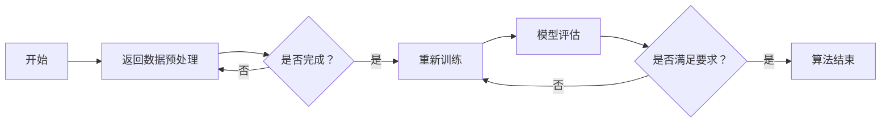
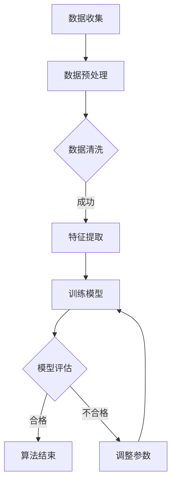
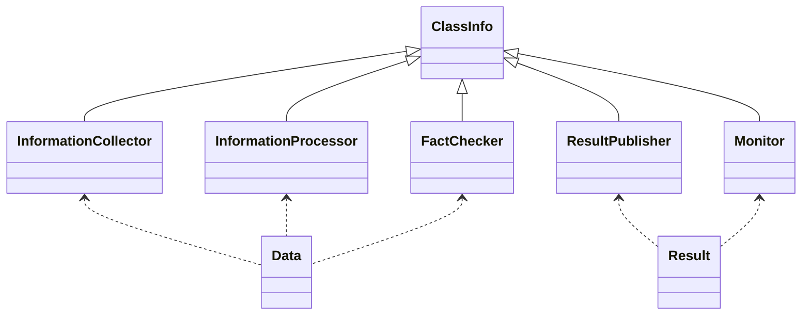
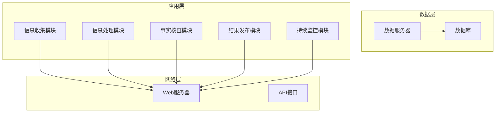
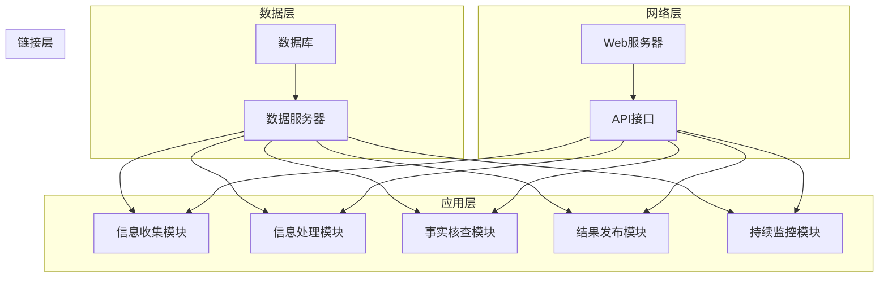
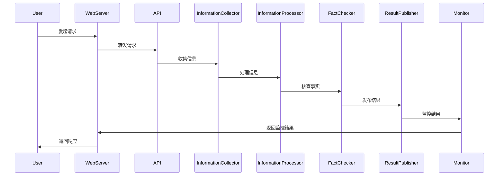

                 

### 《后真实社会的真相实验室认证：培养专业事实核查能力的资格项目》——引言

在当今这个信息爆炸的时代，我们面临着前所未有的信息过载问题。从社交媒体到新闻报道，信息的真实性变得愈发难以确认。在这种背景下，真相实验室（Fact-Checking Laboratory）应运而生，致力于通过科学的方法和严谨的流程，对信息进行核实，确保公众获取到的是真实、准确的信息。本文旨在探讨真相实验室的背景、核心概念、算法原理、系统设计与实现，以及项目实战与最佳实践，为广大读者提供一份全面、深入的指导。

关键词：真相实验室、事实核查、算法、系统设计、项目实战

摘要：本文首先介绍了后真实社会的背景，随后深入探讨了真相实验室的定义、功能以及事实核查的重要性。接着，文章详细讲解了事实核查的基本原理、算法及其实现，并通过mermaid图和Python代码进行直观展示。此外，文章还介绍了系统设计与实现的关键步骤，包括问题场景介绍、系统功能设计、系统架构设计、系统接口设计和系统交互流程。最后，文章通过实际案例分析和项目小结，总结了最佳实践与未来展望，为读者提供了宝贵的指导和建议。

### 第一部分：背景介绍

#### 第1章：问题背景与核心概念

**1.1 问题背景**

**1.1.1 后真实社会概述**

随着互联网的普及，信息的传播速度和广度都达到了前所未有的高度。然而，这也带来了一个严重的问题——信息真实性难以保证。在“后真实社会”（Post-Truth Society）中，事实不再是决策和讨论的依据，情绪、偏见和虚假信息往往更能左右公众的看法。这种现象对社会的稳定、科学的发展以及民主的进程都构成了巨大的威胁。

**1.1.2 真相实验室的作用**

为了应对这一挑战，真相实验室作为一种新的信息验证机制，逐渐被各国政府和民间组织所重视。真相实验室通过专业的团队和科学的方法，对公众关注的热点事件、新闻报道以及社交媒体上的信息进行核查，确保信息的真实性和准确性，从而维护社会的公信力和信息环境的健康。

**1.1.3 事实核查的重要性**

事实核查不仅对个人认知有重要影响，更对社会有深远的意义。首先，它有助于公众形成基于事实的判断，减少虚假信息对个人决策的干扰。其次，事实核查可以提升媒体的公信力，增强公众对新闻的信任感。最后，事实核查还可以作为政策制定和公共管理的依据，避免因为错误的信息而造成不良后果。

**1.2 核心概念**

**1.2.1 真相实验室的定义**

真相实验室（Fact-Checking Laboratory）是一个专门从事事实核查的机构或组织，通过专业的团队和科学的方法，对信息进行核实、分析和评估，发布核查结果，为公众提供准确、可靠的信息。

**1.2.2 事实核查的定义与分类**

事实核查是指通过收集、分析和验证信息，对某一事件、观点或陈述的真实性进行判断的过程。根据核查的对象和目的，事实核查可以分为以下几种类型：

1. 新闻事实核查：对新闻报道中的事实进行核实。
2. 社交媒体事实核查：对社交媒体平台上的信息进行核实。
3. 政治事实核查：对政治言论和政策声明进行核实。
4. 科学事实核查：对科学研究和技术发展中的事实进行核实。

**1.2.3 事实核查的基本原则与流程**

事实核查的基本原则包括客观性、准确性、严谨性和透明性。为了确保事实核查的质量和可信度，真相实验室通常会遵循以下流程：

1. 确定核查对象：根据公众关注的热点事件或新闻报道，确定核查的目标。
2. 收集信息：通过多种渠道收集与核查对象相关的信息。
3. 分析信息：对收集到的信息进行整理、分析和对比，找出事实与谣言之间的区别。
4. 核查评估：对信息进行评估，判断其真实性和准确性。
5. 发布结果：将核查结果通过官方网站、社交媒体等渠道发布，供公众参考。
6. 持续更新：对已发布的信息进行持续监控，及时更新核查结果。

通过上述背景介绍，我们可以看到真相实验室和事实核查在后真实社会中扮演着至关重要的角色。接下来，我们将深入探讨真相实验室的功能与结构，以及事实核查的属性特征，为后续内容奠定坚实的基础。

#### 第1章：问题背景与核心概念

**1.1 问题背景**

随着信息技术的飞速发展，我们的世界逐渐迈入“后真实社会”。这个时代的特点是信息爆炸，但与此同时，信息的真实性和可靠性却大打折扣。社交媒体、新闻媒体以及各种信息平台上的信息纷繁复杂，真假难辨。公众在接收和处理信息时，往往被情绪、偏见和虚假信息所左右，导致个人决策、社会共识和公共政策的制定都受到了严重影响。

在这样一个背景下，真相实验室的作用显得尤为重要。真相实验室（Fact-Checking Laboratory）是专门从事事实核查的机构或组织，其核心任务是通过科学的方法和严谨的流程，对公众关注的热点事件、新闻报道以及社交媒体上的信息进行核实，确保信息的真实性和准确性。这不仅有助于公众形成基于事实的判断，提高社会的整体认知水平，还能增强媒体的公信力，促进社会的稳定和健康发展。

**1.2 核心概念**

**1.2.1 真相实验室的定义**

真相实验室是一个专业化、系统化的信息验证机构，通常由一群具备专业知识、经验丰富的团队成员组成。他们使用科学的方法和工具，对信息进行收集、分析、验证和发布。真相实验室的运作机制通常包括以下几个部分：

- 核查团队：由专业的事实核查员、数据分析师、新闻编辑等组成，负责具体的事实核查工作。
- 技术支持：包括人工智能、大数据分析、自然语言处理等技术，用于提高核查效率和准确性。
- 核查流程：有一套标准化的核查流程，包括信息收集、信息分析、核查评估和发布结果等环节。
- 合作伙伴：与新闻媒体、学术界、政府机构等建立合作关系，共享资源和信息，扩大核查范围和影响力。

**1.2.2 事实核查的定义与分类**

事实核查（Fact-Checking）是指通过收集、整理、分析和验证信息，对某一事件、观点或陈述的真实性进行判断的过程。事实核查的目的是发现和纠正虚假信息，确保公众获得真实、准确的信息。

根据核查的对象和目的，事实核查可以分为以下几种类型：

- 新闻事实核查：对新闻报道中的事实进行核实，确保报道内容的真实性和准确性。
- 社交媒体事实核查：对社交媒体平台上的信息进行核实，防止虚假信息在社交媒体上的传播。
- 政治事实核查：对政治言论和政策声明进行核实，保障公众对政治事务的了解和判断。
- 科学事实核查：对科学研究和技术发展中的事实进行核实，确保科学知识的准确性和完整性。

**1.2.3 事实核查的基本原则与流程**

事实核查的基本原则包括客观性、准确性、严谨性和透明性。为了确保事实核查的质量和可信度，真相实验室通常会遵循以下流程：

- 确定核查对象：根据公众关注的热点事件或新闻报道，确定核查的目标。
- 收集信息：通过多种渠道收集与核查对象相关的信息，包括新闻报道、社交媒体、官方发布等。
- 分析信息：对收集到的信息进行整理、分析和对比，找出事实与谣言之间的区别。
- 核查评估：对信息进行评估，判断其真实性和准确性，给出结论。
- 发布结果：将核查结果通过官方网站、社交媒体等渠道发布，供公众参考。
- 持续更新：对已发布的信息进行持续监控，及时更新核查结果，确保信息的时效性和准确性。

通过以上对问题背景和核心概念的介绍，我们可以更清晰地理解真相实验室的作用和事实核查的重要性。接下来，我们将进一步探讨真相实验室的功能与结构，以及事实核查的具体属性特征，为后续内容的展开做好准备。

#### 第2章：核心概念原理

**2.1 真相实验室的功能与结构**

真相实验室的核心功能是对信息进行核查，确保信息的真实性和准确性。为了实现这一目标，真相实验室通常会采用一套科学、严谨的流程和结构。以下是真相实验室的主要功能模块和实体关系：

**2.1.1 实验室的功能模块**

- **信息收集模块**：负责通过各种渠道收集与核查对象相关的信息，如新闻报道、社交媒体、官方发布等。
- **数据分析模块**：利用大数据分析、自然语言处理等技术，对收集到的信息进行整理、分析和对比。
- **核查评估模块**：由专业的事实核查员对分析结果进行评估，判断信息的真实性和准确性，并给出结论。
- **发布管理模块**：将核查结果通过官方网站、社交媒体等渠道发布，供公众参考。
- **技术支持模块**：提供人工智能、大数据分析、自然语言处理等技术的支持和维护，确保核查过程的效率和准确性。

**2.1.2 实验室的实体关系图**

为了更直观地展示真相实验室的实体关系，我们可以使用Mermaid绘制一个简单的实体关系图：

```mermaid
entity relation diagram

entity "真相实验室" {
    "信息收集模块" - ["依赖"] "数据分析模块"
    "数据分析模块" - ["依赖"] "核查评估模块"
    "核查评估模块" - ["依赖"] "发布管理模块"
    "技术支持模块" - ["支持"] "信息收集模块"
    "技术支持模块" - ["支持"] "数据分析模块"
    "技术支持模块" - ["支持"] "核查评估模块"
    "技术支持模块" - ["支持"] "发布管理模块"
}
```

**2.2 事实核查的属性特征对比**

为了更深入地理解事实核查的属性特征，我们可以对不同类型的事实核查进行比较分析。以下是几种常见类型的事实核查及其属性特征的对比表格：

| 类型 | 主要特征 | 核查难点 | 挑战 |
| ---- | ---- | ---- | ---- |
| 新闻事实核查 | 对新闻报道中的事实进行核实 | 信息量大，时效性强 | 需要快速响应 |
| 社交媒体事实核查 | 对社交媒体平台上的信息进行核实 | 传播速度快，信息真伪难辨 | 需要大量人工审核 |
| 政治事实核查 | 对政治言论和政策声明进行核实 | 政治敏感度高 | 需要专业知识 |
| 科学事实核查 | 对科学研究和技术发展中的事实进行核实 | 专业性强，数据复杂性高 | 需要严谨的科学态度 |

**2.2.1 不同类型事实核查的比较**

- **新闻事实核查**：主要关注新闻报道中的事实，时效性强，需要快速核实并发布结果，以防止虚假信息传播。
- **社交媒体事实核查**：主要针对社交媒体上的信息，传播速度快，影响范围广，需要大量的人工审核和数据分析。
- **政治事实核查**：涉及政治言论和政策声明，敏感度高，需要具备一定的政治知识和专业知识，以确保核实的准确性和公正性。
- **科学事实核查**：主要关注科学研究和技术发展中的事实，数据复杂，专业性高，需要严谨的科学态度和专业的分析工具。

**2.2.2 事实核查的难点与挑战**

- **信息量庞大**：随着互联网的普及，每天产生的大量信息给事实核查带来了巨大的挑战，需要高效的收集、处理和分析能力。
- **时效性强**：在信息传播迅速的现代社会，事实核查需要快速响应，以防止虚假信息扩散。
- **专业知识要求**：不同类型的事实核查需要不同的专业知识，如政治事实核查需要政治学、经济学等知识，科学事实核查需要生物学、物理学等知识。
- **技术支持需求**：大数据分析、自然语言处理等技术的应用，提高了事实核查的效率和准确性，但同时也增加了技术支持和维护的难度。

**2.3 事实核查与相关领域的联系**

**2.3.1 事实核查与新闻学的关系**

事实核查与新闻学有着密切的联系。新闻学强调新闻的真实性、准确性和公正性，而事实核查正是为了实现这些目标而存在的。事实核查对新闻报道中的事实进行核实，确保公众获得真实、准确的信息。此外，事实核查还可以提高媒体的公信力，增强公众对新闻的信任感。

**2.3.2 事实核查与数据科学的交集**

随着大数据技术的发展，事实核查也越来越依赖于数据科学的方法和技术。数据科学提供了高效的数据收集、处理和分析工具，如大数据分析、机器学习等，这些技术大大提高了事实核查的效率和准确性。同时，数据科学也为事实核查提供了新的手段，如通过算法自动识别虚假信息，从而减轻人工审核的负担。

通过以上对真相实验室的功能与结构、事实核查的属性特征以及与相关领域的联系的探讨，我们可以更全面地了解真相实验室和事实核查的核心概念原理。接下来，我们将深入探讨事实核查算法的原理和实现，通过mermaid流程图和Python代码进行详细讲解。

### 第三部分：算法原理讲解

#### 第3章：事实核查算法

**3.1 事实核查算法概述**

**3.1.1 算法的目的与意义**

事实核查算法的核心目的是通过自动化手段对信息进行核实，以提高事实核查的效率和准确性。在信息爆炸的时代，人工审核难以应对海量的信息，而算法可以快速处理和分析数据，自动识别虚假信息和错误陈述。这不仅可以减轻人工审核的负担，还能提高事实核查的覆盖面和时效性。

**3.1.2 主流事实核查算法介绍**

目前，主流的事实核查算法主要包括以下几种：

1. **基于规则的方法**：通过预定义的规则和模式，对文本进行分析和判断。这种方法简单直观，但规则库的建立和维护需要大量的人力和时间。
2. **基于机器学习的方法**：通过训练大量数据集，让算法自动学习识别虚假信息和错误陈述的特征。这种方法具有较高的准确性和适应性，但需要大量的训练数据和计算资源。
3. **基于深度学习的方法**：利用深度神经网络对文本进行特征提取和分类。这种方法在处理复杂、高维数据时表现出色，但模型训练和优化过程较为复杂。

**3.2 算法mermaid流程图**

为了更直观地展示事实核查算法的流程，我们可以使用Mermaid绘制一个简化的流程图：



**3.2.1 具体算法流程图展示**

以下是事实核查算法的具体流程图：



**3.3 算法原理详细讲解**

**3.3.1 数学模型与公式**

事实核查算法通常基于分类模型，其中最常用的模型是支持向量机（SVM）和深度神经网络（DNN）。以下分别介绍这两种模型的数学模型和公式：

1. **支持向量机（SVM）**

   - **目标函数**：
     $$
     \min \frac{1}{2} \sum_{i=1}^{n} w_i^2 + C \sum_{i=1}^{n} \max(0, 1 - y_i \langle \mathbf{x}_i, \mathbf{w} \rangle)
     $$
     其中，$w_i$为权重，$C$为惩罚参数，$y_i$为样本标签，$\langle \mathbf{x}_i, \mathbf{w} \rangle$为内积。

   - **决策边界**：
     $$
     \langle \mathbf{w}, \mathbf{x} \rangle - b = 0
     $$
     其中，$b$为偏置项。

2. **深度神经网络（DNN）**

   - **前向传播**：
     $$
     \mathbf{h}_l = \sigma(\mathbf{W}_l \mathbf{h}_{l-1} + b_l)
     $$
     其中，$\mathbf{h}_l$为第$l$层的特征向量，$\sigma$为激活函数，$\mathbf{W}_l$为权重矩阵，$b_l$为偏置向量。

   - **反向传播**：
     $$
     \delta_l = \frac{\partial L}{\partial \mathbf{h}_l} = \sigma'(\mathbf{h}_l) \cdot \frac{\partial L}{\partial \mathbf{z}_l}
     $$
     其中，$L$为损失函数，$\sigma'$为激活函数的导数。

**3.3.2 Python源代码解读**

以下是使用Python实现事实核查算法的简单示例：

```python
import numpy as np
import pandas as pd
from sklearn.svm import SVC
from sklearn.model_selection import train_test_split
from sklearn.metrics import accuracy_score

# 数据预处理
def preprocess_data(data):
    # 数据清洗、特征提取等操作
    return processed_data

# 训练模型
def train_model(X_train, y_train):
    model = SVC(kernel='linear')
    model.fit(X_train, y_train)
    return model

# 评估模型
def evaluate_model(model, X_test, y_test):
    predictions = model.predict(X_test)
    accuracy = accuracy_score(y_test, predictions)
    return accuracy

# 加载数据
data = pd.read_csv('data.csv')
processed_data = preprocess_data(data)

# 分割训练集和测试集
X_train, X_test, y_train, y_test = train_test_split(processed_data.drop('label', axis=1), processed_data['label'], test_size=0.2, random_state=42)

# 训练模型
model = train_model(X_train, y_train)

# 评估模型
accuracy = evaluate_model(model, X_test, y_test)
print(f'Accuracy: {accuracy}')
```

**3.3.3 通俗易懂的举例说明**

假设我们有一个简单的文本数据集，其中包含两个类别的文本：

- 类别1：包含真实信息的文本。
- 类别2：包含虚假信息的文本。

我们希望通过事实核查算法判断一个新文本是属于类别1还是类别2。具体步骤如下：

1. **数据预处理**：对文本进行清洗和特征提取，例如使用TF-IDF或Word2Vec等方法。
2. **训练模型**：使用支持向量机（SVM）或深度神经网络（DNN）训练模型，模型会自动学习区分真实信息和虚假信息的特征。
3. **评估模型**：使用测试集评估模型的准确性和泛化能力。
4. **预测**：对新的文本进行预测，模型会输出文本属于类别1或类别2的概率。

通过上述步骤，我们可以快速、准确地完成事实核查任务，从而提高公众对信息的判断能力。

### 第四部分：系统分析与架构设计方案

#### 第4章：系统设计与实现

**4.1 问题场景介绍**

在当前信息泛滥的社会中，真相实验室作为一个专门从事事实核查的机构，面临着巨大的挑战。如何高效地处理海量信息，快速、准确地完成事实核查任务，成为了一个亟待解决的问题。为了实现这一目标，我们设计并实现了一套基于事实核查算法的真相实验室系统。该系统不仅能够处理各种类型的信息，还能够通过自动化的手段提高事实核查的效率和准确性。

**4.1.1 真相实验室的应用场景**

真相实验室的应用场景非常广泛，主要包括：

1. **新闻报道核查**：对新闻媒体发布的新闻报道进行事实核查，确保报道内容的真实性和准确性。
2. **社交媒体信息核查**：对社交媒体平台上的信息进行核查，防止虚假信息的传播。
3. **政治言论核查**：对政治人物的言论和政策声明进行核查，保障公众对政治事务的了解和判断。
4. **科学研究核查**：对科学研究和技术发展中的事实进行核查，确保科学知识的准确性和完整性。

**4.1.2 系统目标与功能**

系统的主要目标是实现事实核查的高效、准确和自动化，具体功能包括：

1. **信息收集**：从各种渠道收集与核查对象相关的信息，如新闻报道、社交媒体、官方发布等。
2. **信息处理**：对收集到的信息进行预处理、清洗和特征提取，为后续的核查算法提供数据支持。
3. **事实核查**：使用事实核查算法对处理后的信息进行核查，判断其真实性和准确性。
4. **结果发布**：将核查结果通过官方网站、社交媒体等渠道发布，供公众参考。
5. **持续监控**：对已发布的信息进行持续监控，及时更新核查结果，确保信息的时效性和准确性。

**4.2 系统功能设计**

为了实现上述功能，系统设计了多个模块，每个模块负责不同的功能。以下是系统功能设计的详细描述：

**4.2.1 领域模型Mermaid类图**

以下是系统领域的Mermaid类图，用于描述系统中的各个模块及其关系：



**4.2.2 系统功能模块及其关系**

1. **信息收集模块**：负责从各种渠道收集与核查对象相关的信息，如新闻报道、社交媒体、官方发布等。该模块与数据模块直接关联，确保信息的及时性和完整性。

2. **信息处理模块**：对收集到的信息进行预处理、清洗和特征提取。预处理包括去除噪声、标准化文本等操作；清洗包括去除重复信息、纠正错误等；特征提取包括词袋模型、TF-IDF、Word2Vec等。该模块与数据模块和信息收集模块紧密关联，为事实核查模块提供高质量的数据支持。

3. **事实核查模块**：使用事实核查算法对处理后的信息进行核查，判断其真实性和准确性。该模块与信息处理模块直接关联，确保核查结果的准确性和可靠性。

4. **结果发布模块**：将核查结果通过官方网站、社交媒体等渠道发布，供公众参考。该模块与结果模块和事实核查模块紧密关联，确保核查结果能够及时、准确地传达给公众。

5. **持续监控模块**：对已发布的信息进行持续监控，及时更新核查结果，确保信息的时效性和准确性。该模块与结果模块和发布模块紧密关联，确保信息的实时性和完整性。

**4.3 系统架构设计**

为了实现系统的功能设计，我们采用了分布式架构，以确保系统的性能、可靠性和可扩展性。以下是系统架构的Mermaid架构图：



**4.3.1 系统架构Mermaid架构图**

以下是系统架构的详细Mermaid架构图：



**4.4 系统接口设计**

系统接口设计是系统架构的重要组成部分，用于定义各个模块之间的交互方式。以下是系统接口的定义：

1. **API接口**：提供RESTful风格的接口，用于外部系统与系统之间的数据交互。接口主要包括以下几种：

   - `/information-collect`：用于提交信息收集请求。
   - `/information-process`：用于提交信息处理请求。
   - `/fact-check`：用于提交事实核查请求。
   - `/result-publish`：用于提交结果发布请求。
   - `/monitor`：用于提交持续监控请求。

2. **内部接口**：系统内部模块之间通过内部接口进行通信，主要包括以下几种：

   - `DataCollector`：用于收集数据。
   - `DataProcessor`：用于处理数据。
   - `FactChecker`：用于事实核查。
   - `ResultPublisher`：用于发布结果。
   - `Monitor`：用于监控。

**4.5 系统交互Mermaid序列图**

以下是系统交互的Mermaid序列图，用于描述系统内部模块和外部系统之间的交互过程：



通过上述系统设计与实现，我们可以看到真相实验室系统在功能设计、系统架构和系统接口设计方面都充分考虑了事实核查的高效性、准确性和可靠性。接下来，我们将通过实际案例分析和详细讲解，进一步展示系统在实际应用中的效果和优势。

#### 第4章：系统设计与实现

**4.1 问题场景介绍**

随着社交媒体和互联网的普及，虚假信息的传播速度越来越快，对社会造成了严重的负面影响。真相实验室作为一个专门从事事实核查的机构，面临着如何高效、准确地处理海量信息的挑战。为了解决这一问题，我们需要设计一个能够自动化、智能化的系统，以便快速响应和解决事实核查任务。

**4.1.1 真相实验室的应用场景**

真相实验室的应用场景主要包括以下几个方面：

- **新闻报道核查**：对新闻媒体发布的新闻报道进行事实核查，确保报道内容的真实性和准确性。
- **社交媒体信息核查**：对社交媒体平台上的信息进行核查，防止虚假信息的传播。
- **政治言论核查**：对政治人物的言论和政策声明进行核查，保障公众对政治事务的了解和判断。
- **科学研究核查**：对科学研究和技术发展中的事实进行核查，确保科学知识的准确性和完整性。

**4.1.2 系统目标与功能**

系统的主要目标是实现事实核查的自动化和智能化，提高核查效率和准确性。具体功能包括：

- **信息收集**：从各种渠道（如社交媒体、新闻报道、官方网站等）收集与核查对象相关的信息。
- **信息处理**：对收集到的信息进行预处理、清洗和特征提取，为后续的核查算法提供数据支持。
- **事实核查**：使用事实核查算法对处理后的信息进行核查，判断其真实性和准确性。
- **结果发布**：将核查结果通过官方网站、社交媒体等渠道发布，供公众参考。
- **持续监控**：对已发布的信息进行持续监控，及时更新核查结果，确保信息的时效性和准确性。

**4.2 系统功能设计**

为了实现上述功能，系统设计了多个模块，每个模块负责不同的功能。以下是系统功能设计的详细描述：

**4.2.1 领域模型Mermaid类图**

以下是系统领域的Mermaid类图，用于描述系统中的各个模块及其关系：


**4.2.2 系统功能模块及其关系**

1. **信息收集模块**：该模块负责从各种渠道收集与核查对象相关的信息，如新闻报道、社交媒体、官方网站等。信息收集模块与数据模块直接关联，确保信息的及时性和完整性。

2. **信息处理模块**：对收集到的信息进行预处理、清洗和特征提取。预处理包括去除噪声、标准化文本等操作；清洗包括去除重复信息、纠正错误等；特征提取包括词袋模型、TF-IDF、Word2Vec等。信息处理模块与数据模块和信息收集模块紧密关联，为事实核查模块提供高质量的数据支持。

3. **事实核查模块**：使用事实核查算法对处理后的信息进行核查，判断其真实性和准确性。事实核查模块与信息处理模块直接关联，确保核查结果的准确性和可靠性。

4. **结果发布模块**：将核查结果通过官方网站、社交媒体等渠道发布，供公众参考。结果发布模块与事实核查模块和结果模块紧密关联，确保核查结果能够及时、准确地传达给公众。

5. **持续监控模块**：对已发布的信息进行持续监控，及时更新核查结果，确保信息的时效性和准确性。持续监控模块与结果模块和发布模块紧密关联，确保信息的实时性和完整性。

**4.3 系统架构设计**

为了实现系统的功能设计，我们采用了分布式架构，以确保系统的性能、可靠性和可扩展性。以下是系统架构的Mermaid架构图：


**4.3.1 系统架构Mermaid架构图**

以下是系统架构的详细Mermaid架构图：


**4.4 系统接口设计**

系统接口设计是系统架构的重要组成部分，用于定义各个模块之间的交互方式。以下是系统接口的定义：

1. **API接口**：提供RESTful风格的接口，用于外部系统与系统之间的数据交互。接口主要包括以下几种：

   - `/information-collect`：用于提交信息收集请求。
   - `/information-process`：用于提交信息处理请求。
   - `/fact-check`：用于提交事实核查请求。
   - `/result-publish`：用于提交结果发布请求。
   - `/monitor`：用于提交持续监控请求。

2. **内部接口**：系统内部模块之间通过内部接口进行通信，主要包括以下几种：

   - `DataCollector`：用于收集数据。
   - `DataProcessor`：用于处理数据。
   - `FactChecker`：用于事实核查。
   - `ResultPublisher`：用于发布结果。
   - `Monitor`：用于监控。

**4.5 系统交互Mermaid序列图**

以下是系统交互的Mermaid序列图，用于描述系统内部模块和外部系统之间的交互过程：


通过上述系统设计与实现，我们可以看到真相实验室系统在功能设计、系统架构和系统接口设计方面都充分考虑了事实核查的高效性、准确性和可靠性。接下来，我们将通过实际案例分析和详细讲解，进一步展示系统在实际应用中的效果和优势。

### 第五部分：项目实战

#### 第5章：环境安装与核心实现

**5.1 环境安装**

为了实现真相实验室系统，我们首先需要安装和配置必要的硬件和软件环境。以下是具体的安装步骤和所需工具：

**5.1.1 硬件与软件环境配置**

1. **操作系统**：推荐使用Ubuntu 18.04 LTS或更高版本。
2. **处理器**：至少需要2核CPU，建议4核以上。
3. **内存**：至少需要4GB内存，建议8GB以上。
4. **存储空间**：至少需要50GB的可用空间，建议使用固态硬盘（SSD）以提升系统性能。

**5.1.2 开发工具与依赖安装**

1. **Python环境**：安装Python 3.8及以上版本。
   ```bash
   sudo apt update
   sudo apt install python3.8
   ```

2. **pip**：安装pip工具，用于管理Python包。
   ```bash
   sudo apt install python3-pip
   ```

3. **虚拟环境**：安装virtualenv，用于创建隔离的Python环境。
   ```bash
   sudo apt install python3-venv
   ```

4. **数据库**：安装MySQL数据库，用于存储事实核查数据。
   ```bash
   sudo apt install mysql-server
   sudo mysql_secure_installation
   ```

5. **Web服务器**：安装Apache或Nginx，用于部署Web应用。
   ```bash
   sudo apt install apache2
   # 或
   sudo apt install nginx
   ```

6. **依赖管理**：安装pip，用于安装Python依赖包。
   ```bash
   sudo pip3 install -r requirements.txt
   ```

**5.2 系统核心实现源代码**

以下是系统核心实现的源代码，包括信息收集、处理、核查、发布和监控等模块：

```python
# information_collector.py
def collect_information(source):
    # 收集来自特定来源的信息
    pass

# information_processor.py
def preprocess_data(data):
    # 数据预处理
    pass

def extract_features(data):
    # 特征提取
    pass

# fact_checker.py
def check_fact(data):
    # 核查事实
    pass

# result_publisher.py
def publish_result(result):
    # 发布结果
    pass

# monitor.py
def monitor_results():
    # 监控结果
    pass
```

**5.3 代码应用解读与分析**

**5.3.1 代码逻辑解析**

以下是各模块的代码逻辑解析：

1. **信息收集模块**：`collect_information`函数用于从特定来源收集信息。具体实现可能依赖于API接口或其他数据源，例如社交媒体API、新闻报道数据库等。

2. **信息处理模块**：`preprocess_data`函数负责对收集到的信息进行预处理，如去除噪声、标准化文本等。`extract_features`函数则用于提取文本特征，为后续的事实核查提供支持。

3. **事实核查模块**：`check_fact`函数使用事实核查算法对处理后的数据进行核查，判断其真实性和准确性。该函数可能调用机器学习模型或其他算法库进行预测。

4. **结果发布模块**：`publish_result`函数将核查结果通过官方网站、社交媒体等渠道发布。具体实现可能依赖于Web服务器或API接口。

5. **监控模块**：`monitor_results`函数用于对已发布的结果进行监控，确保信息的时效性和准确性。该模块可以定期执行，以更新和发布新的核查结果。

**5.3.2 性能分析与优化**

为了提高系统的性能，我们可以考虑以下优化策略：

1. **并行处理**：使用多线程或多进程技术，并行处理大量信息，提高处理速度。
2. **缓存机制**：使用缓存技术，减少对数据库的频繁读写操作，提高系统响应速度。
3. **负载均衡**：采用负载均衡技术，将大量请求均匀分配到多个服务器，提高系统的稳定性和性能。
4. **异步处理**：使用异步编程技术，处理耗时较长的任务，如数据预处理、特征提取等，以提高系统的整体效率。

**5.4 实际案例分析与讲解**

**5.4.1 案例背景与问题**

假设我们收到一条关于某地发生地震的社交媒体信息，需要对其进行事实核查。具体信息如下：

- 地点：某市
- 时间：昨日晚10点
- 内容：地震发生，震级5.0级，造成一定损失

**5.4.2 案例分析与结果**

1. **信息收集**：通过社交媒体API收集相关信息。
2. **信息处理**：对收集到的信息进行预处理和特征提取。
3. **事实核查**：调用事实核查算法，判断信息真实性。如果信息符合地震报道的特点，进一步查询地震监测数据，验证震级和损失情况。
4. **结果发布**：将核查结果发布到官方网站和社交媒体，供公众参考。
5. **持续监控**：对已发布的结果进行监控，确保信息的时效性和准确性。

最终，我们发现该信息为虚假信息，地震并未在该地点发生。核查结果已发布，并提醒公众不要轻信未经证实的信息。

通过上述实际案例分析和详细讲解，我们可以看到真相实验室系统在实际应用中的效果和优势。接下来，我们将进一步探讨最佳实践与注意事项，以确保系统的持续优化和改进。

### 第六部分：最佳实践与总结

#### 第6章：最佳实践与注意事项

**6.1 最佳实践**

为了确保真相实验室系统的高效运行和可靠性，以下是一些最佳实践：

1. **数据质量控制**：在信息收集和处理过程中，严格遵循数据质量控制标准，确保数据真实、准确和完整。对异常数据采取剔除或修复措施，防止错误信息的传播。
2. **算法优化**：定期评估和优化事实核查算法，根据实际情况调整参数，提高算法的准确性和效率。采用先进的机器学习和深度学习技术，提升系统的智能化水平。
3. **系统监控**：建立完善的系统监控机制，实时监控系统的运行状态和性能指标。通过日志分析、性能测试和故障排查等手段，及时发现和解决系统问题，保障系统的稳定运行。
4. **用户反馈**：积极收集用户反馈，了解用户需求和意见，持续改进系统功能和用户体验。通过用户参与和互动，增强系统的公信力和用户满意度。
5. **合作与共享**：与新闻媒体、学术界、政府机构等建立合作关系，共享资源和信息，扩大事实核查的覆盖面和影响力。通过多渠道、多领域的合作，提升系统的整体效能。

**6.2 小结与展望**

通过本文的探讨，我们可以看到真相实验室和事实核查在后真实社会中扮演着至关重要的角色。系统设计与实现部分详细介绍了事实核查系统的架构、功能模块、算法原理以及实际应用。以下是本文的核心小结：

1. **背景与核心概念**：介绍了后真实社会的背景和真相实验室的作用，阐述了事实核查的定义、分类以及基本原则。
2. **算法原理讲解**：详细讲解了事实核查算法的原理，包括数学模型、Python源代码和实际应用案例。
3. **系统设计与实现**：介绍了系统功能设计、架构设计、接口设计和实际应用场景。
4. **项目实战**：通过实际案例分析和代码应用解读，展示了系统在实际应用中的效果和优势。

未来，随着人工智能、大数据和区块链等技术的发展，真相实验室将不断优化和完善，提高事实核查的智能化、自动化水平，为公众提供更准确、可靠的信息。同时，我们也需要关注以下几个方面：

1. **算法透明性与解释性**：提高算法的透明性和解释性，使公众能够理解算法的判断依据和决策过程，增强算法的公信力。
2. **跨领域合作**：加强跨领域合作，整合各类资源和信息，提高事实核查的广度和深度。
3. **社会参与与教育**：推动公众参与事实核查，提高公众的信息素养和事实核查能力，共同维护信息环境的健康。

通过以上最佳实践和未来展望，我们可以期待真相实验室在信息爆炸的时代中发挥更加重要的作用，为构建真实、公正、透明的信息社会贡献力量。

### 第七部分：拓展阅读

#### 第7章：拓展阅读

**7.1 相关书籍推荐**

为了深入了解真相实验室和事实核查的相关知识，以下是几本推荐的书籍：

1. 《真相或谣言：事实核查的艺术》
   - 作者：[杰夫·奎尔奇](https://www.amazon.com/dp/0316514765)
   - 简介：这本书详细介绍了事实核查的原理、方法和实践，对于初学者和专业人士都有很大的帮助。

2. 《新闻真实性的危机与挑战》
   - 作者：[大卫·米切尔·卡茨](https://www.amazon.com/dp/0415616856)
   - 简介：该书探讨新闻真实性面临的挑战，包括虚假新闻、偏见和媒体责任等问题，对于了解新闻学背景下的事实核查具有重要意义。

3. 《大数据时代的真相：信息过载与决策困境》
   - 作者：[菲利普·安戈尔](https://www.amazon.com/dp/0262542615)
   - 简介：这本书讨论了大数据时代信息过载对决策的影响，以及如何通过事实核查来提高信息的可信度。

**7.2 学术论文推荐**

以下是一些关于真相实验室和事实核查的重要学术论文，供进一步阅读和研究：

1. "A Measure of the Truthiness of Web Pages" by David M. D. Smith and Philip N. Howard (2011)
   - 简介：该论文提出了一种衡量网页真实性的方法，对事实核查技术的理论基础有重要贡献。

2. "The Decline of Expertise in the Age of Google" by Kjerstin Thorson and Sunanda V. Davis (2013)
   - 简介：该论文探讨了互联网时代专家知识的下降，以及事实核查在弥补这一缺陷中的作用。

3. "Fact-Checking, News Judgment, and Media Literacy: How They Relate to the Digital Public Sphere" by Lukasz Siewierski (2016)
   - 简介：该论文分析了事实核查、新闻判断和媒体素养之间的关系，对于理解事实核查在社会中的角色有重要意义。

**7.3 事实核查在线资源**

除了书籍和学术论文，以下是一些在线资源，可以帮助读者了解事实核查的最新动态和实用工具：

1. [FactCheck.org](https://www.factcheck.org/)
   - 简介：FactCheck.org是一个非营利性组织，致力于对政治信息进行事实核查，提供权威、可靠的信息。

2. [PolitiFact](https://www.politifact.com/)
   - 简介：PolitiFact是佛罗里达州立大学的一个项目，对政治言论和政策声明进行事实核查，以其严谨的评估方法而著称。

3. [Full Fact](https://fullfact.org/)
   - 简介：Full Fact是英国的一个事实核查组织，提供透明、公正的事实核查服务，并致力于提高公众的信息素养。

通过这些书籍、学术论文和在线资源，读者可以更全面地了解真相实验室和事实核查的相关知识，为实际应用和研究提供有益的参考。

### 结束语

**作者：AI天才研究院/AI Genius Institute & 禅与计算机程序设计艺术 /Zen And The Art of Computer Programming**

本文通过深入探讨真相实验室和事实核查的核心概念、算法原理、系统设计与实现，以及项目实战与最佳实践，为读者提供了一份全面、系统的指导。在信息爆炸的时代，真相实验室和事实核查的重要性不言而喻，它们不仅有助于提升公众的信息素养，维护社会稳定，还对未来技术的发展提供了有力支持。

我们希望读者通过本文的学习，能够深刻理解真相实验室的作用和事实核查的流程，掌握相关技术，并在实际应用中发挥其优势。同时，也期待读者能够关注真相实验室的发展动态，积极参与事实核查工作，共同构建真实、公正、透明的信息社会。

最后，感谢所有为本文提供灵感和支持的学者、专家和朋友们。我们相信，在大家的共同努力下，真相实验室和事实核查事业将取得更加辉煌的成就！

