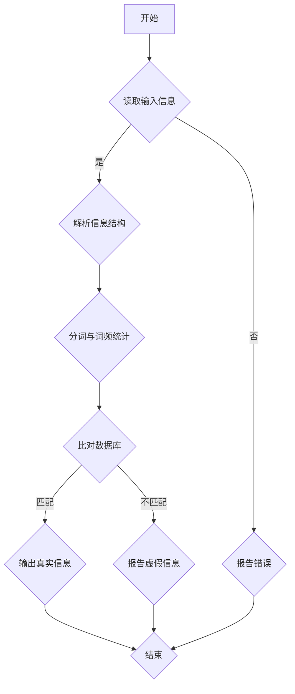
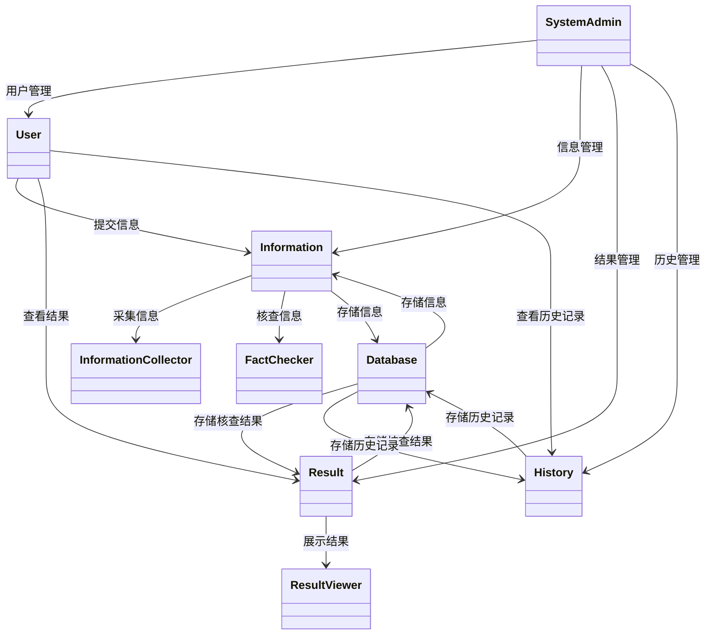
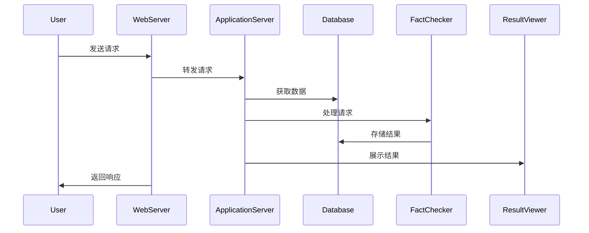
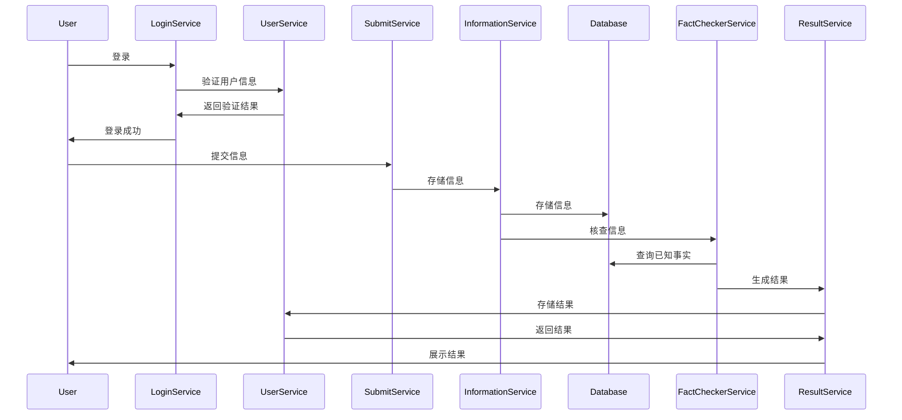

                 

## 引言

在当今社会，信息爆炸和技术的迅猛发展使得我们进入了“后真实社会”这一新的时代。后真实社会，是指在一个信息泛滥、技术手段日益先进的环境中，传统的事实和真相变得相对化和复杂化的社会现象。在这种背景下，事实核查的艺术显得尤为重要。本文旨在探讨后真实社会中事实核查的重要性和方法，为读者提供一套行之有效的事实核查指南。

### 1.1 社会变迁与后真实社会

社会变迁是不可避免的，它推动着人类文明向前发展。然而，随着社会的不断进步，我们逐渐进入了一个新的时代——后真实社会。这个概念最早由美国社会学家杰克·唐纳利（Jack Donnelly）提出，他认为后真实社会是一个“远离直接经验的现实，更多地依赖于间接信息和个人解释”的社会。

在传统的真实社会中，信息传播相对缓慢且受控，人们依赖亲身经历和直接观察来判断事物的真实性。然而，在信息时代，互联网和社交媒体的兴起改变了这一切。信息的传播速度和范围大大扩展，人们接收到的信息来源更加多样化，真假难辨。在这种情况下，人们往往更倾向于相信自己的直觉和偏见，而非事实。

后真实社会的特征主要包括：

- 信息过载：人们每天接收到的信息量远远超过自己的处理能力，这使得辨别信息的真实性和可靠性变得困难。
- 信任危机：在信息泛滥的环境中，人们对于信息的真实性和来源的信任度降低，容易受到虚假信息的影响。
- 社交媒体的影响：社交媒体平台上的信息传播速度快，范围广，往往缺乏有效监管，容易成为虚假信息和谣言的传播渠道。

### 1.2 事实核查的重要性

事实核查（Fact-Checking）是一种通过调查、研究和验证来确认信息真实性或可靠性的过程。在真实社会中，事实核查通常由媒体、学术机构和专业调查人员来执行。然而，在后真实社会中，事实核查的重要性愈发凸显，原因如下：

- 真相的重要性：在后真实社会中，真相变得更加重要。只有通过事实核查，我们才能确保所接收到的信息是真实的，避免被虚假信息误导。
- 公共舆论的影响：虚假信息和谣言的传播会对社会舆论产生重大影响，可能导致公众信任危机，影响社会稳定。
- 个人判断力的提升：通过事实核查，人们可以提高自己的判断力，学会分辨信息的真伪，避免被虚假信息所蒙蔽。
- 防止误导：在医疗、金融、法律等领域，虚假信息可能会造成严重的后果，甚至危及生命。事实核查可以帮助我们避免这些风险。

### 1.3 本书的目的与结构

本书旨在探讨后真实社会中事实核查的重要性和方法，帮助读者了解如何进行有效的事实核查。全书分为八个章节，结构如下：

- 引言：介绍后真实社会的背景和事实核查的重要性。
- 后真实社会概述：阐述后真实社会的定义、特征和影响。
- 事实核查的基础知识：介绍事实核查的定义、基本原则和方法。
- 事实核查的技术工具：介绍事实核查工具的类型、使用方法和优化技巧。
- 事实核查实践案例：通过具体案例展示事实核查的过程和成果。
- 事实核查在社交媒体中的应用：探讨社交媒体中的虚假信息传播和平台的事实核查机制。
- 事实核查的伦理与法律问题：讨论事实核查的伦理考量和法律框架。
- 事实核查的未来发展：展望事实核查的未来发展趋势和潜在影响。

通过本书的学习，读者将能够掌握事实核查的基本方法和技巧，提高自己在信息泛滥的后真实社会中的信息素养，避免被虚假信息所误导。

### 1.4 研究背景与意义

事实核查（Fact-Checking）作为一种验证信息真实性的重要手段，在当今社会具有深远的研究背景和现实意义。首先，随着互联网和社交媒体的普及，信息传播速度加快，信息来源日益多样，虚假信息和谣言的传播问题愈发严重。据调查，社交媒体平台上的虚假信息每年导致数十亿美元的经济损失，并在政治、经济、社会等多个领域引发信任危机。因此，如何有效进行事实核查，防止虚假信息的传播，已成为社会各界关注的焦点。

其次，事实核查不仅是个人信息素养提升的重要手段，也是社会公正和民主的基础。在信息泛滥的时代，公众对于信息的真实性和可靠性的信任度降低，可能导致社会舆论的混乱和误导。通过事实核查，公众可以更准确地了解事实，避免被虚假信息误导，从而维护社会秩序和民主价值观。

此外，事实核查在学术研究和新闻报道等领域也具有重要意义。在学术研究中，准确的事实核查可以确保研究成果的可靠性和科学性，避免因虚假信息导致的学术不端行为。在新闻报道中，事实核查可以提高新闻的准确性和公正性，增强媒体的公信力。

综上所述，事实核查在信息泛滥的后真实社会中具有极其重要的研究背景和现实意义。它不仅有助于防止虚假信息的传播，维护社会公正和民主，提高公众信息素养，还在学术研究和新闻报道等领域发挥着重要作用。因此，对事实核查的研究不仅具有理论价值，也具有深远的现实意义。

### 1.5 核心概念与联系

在探讨事实核查的过程中，理解相关核心概念和它们之间的联系至关重要。以下是对事实核查相关核心概念的定义、属性特征对比以及ER实体关系图的详细阐述。

#### 1.5.1 核心概念定义

1. **事实核查（Fact-Checking）**：指通过调查、研究和验证来确认信息真实性或可靠性的过程。事实核查的目标是识别和纠正虚假信息，确保公众获取的信息是准确和可靠的。

2. **虚假信息（False Information）**：指故意传播或传播不真实、不准确的信息。虚假信息可能是误导性的，甚至具有欺骗性，可能对个人、组织和公众产生负面影响。

3. **谣言（Rumor）**：指未经证实的信息在人群中传播的现象。谣言的特点是没有经过官方或权威机构的验证，往往基于推测和传闻，可能被误解或夸大。

4. **验证（Verification）**：指对信息进行核实和确认的过程。验证是事实核查的重要步骤，通过多方对比和交叉验证，确保信息的真实性和可靠性。

5. **信息素养（Information Literacy）**：指在信息社会中，个体获取、评估、使用和创建信息的能力。信息素养包括信息检索、批判性思维和信息管理等方面，是现代社会不可或缺的技能。

#### 1.5.2 核心概念属性特征对比

下表对比了事实核查、虚假信息、谣言、验证和信息素养这五个核心概念的属性特征：

| 核心概念 | 定义 | 属性特征 |
| --- | --- | --- |
| 事实核查 | 通过调查、研究和验证确认信息真实性 | 确保信息的真实性和可靠性 |
| 虚假信息 | 故意传播或传播不真实、不准确的信息 | 误导性、欺骗性 |
| 谣言 | 未经证实的信息在人群中传播 | 未经验证、可能被误解或夸大 |
| 验证 | 对信息进行核实和确认 | 确保信息的真实性和可靠性 |
| 信息素养 | 在信息社会中获取、评估、使用和创建信息的能力 | 信息检索、批判性思维、信息管理 |

#### 1.5.3 ER实体关系图

ER实体关系图是一种用于描述实体及其之间关系的图形化方法。以下是事实核查相关核心概念的ER实体关系图：

```mermaid
erDiagram
  FactChecking ||--|{ VerifiedInformation }
  FactChecking ||--|{ FalseInformation }
  FactChecking ||--|{ Rumor }
  FactChecking ||--|{ Verification }
  FactChecking ||--|{ InformationLiteracy }
  Verification ||--|{ Information }
  Verification ||--|{ VerificationProcess }
  FalseInformation ||--|{ Misinformation }
  FalseInformation ||--|{ DeceptiveInformation }
  Rumor ||--|{ UnverifiedInformation }
  Rumor ||--|{ MisunderstoodInformation }
  InformationLiteracy ||--|{ InformationRetrieval }
  InformationLiteracy ||--|{ CriticalThinking }
  InformationLiteracy ||--|{ InformationManagement }
```

在这个ER实体关系图中，事实核查是核心实体，与验证、虚假信息、谣言和信息素养等实体之间存在多种关系。验证是确保信息真实性的过程，与信息实体直接相关。虚假信息和谣言则与信息真实性和可靠性相关，分别表示被验证和未经验证的信息。信息素养则包括信息检索、批判性思维和信息管理等能力，是提升个体信息素养的关键。

通过上述核心概念的详细定义、属性特征对比和ER实体关系图的阐述，我们可以更好地理解事实核查在信息社会中发挥的作用，以及如何通过这些核心概念之间的关系来进行有效的事实核查。

### 1.6 算法原理讲解

在事实核查的过程中，算法的引入极大地提高了信息验证的效率和准确性。以下将使用Mermaid工具绘制算法流程图，并利用Python源代码详细阐述事实核查算法的原理和实现方法。

#### 1.6.1 Mermaid算法流程图

首先，我们使用Mermaid工具绘制事实核查的算法流程图。Mermaid是一种方便的Markdown扩展，可以用于生成流程图、序列图等。



在这个流程图中，我们首先读取输入的信息，然后通过解析信息结构进行分词和词频统计。接下来，我们将这些信息与数据库中的已知事实进行比对。如果匹配，则输出真实信息；如果不匹配，则报告虚假信息。

#### 1.6.2 Python源代码实现

下面是使用Python实现的简单事实核查算法的源代码，以及算法原理的数学模型和公式。

```python
import collections
import pymysql

# 数据库连接配置
config = {
    'host': 'localhost',
    'user': 'root',
    'password': 'password',
    'database': 'fact_checking_db'
}

# 建立数据库连接
connection = pymysql.connect(**config)

def read_input_info():
    # 读取输入的信息
    input_info = input("请输入需要核查的信息：")
    return input_info

def parse_info_structure(input_info):
    # 解析信息结构，进行分词和词频统计
    words = input_info.split()
    word_freq = collections.Counter(words)
    return word_freq

def compare_database(word_freq):
    # 将词频与数据库中的已知事实进行比对
    with connection.cursor() as cursor:
        query = "SELECT * FROM known_facts;"
        cursor.execute(query)
        known_facts = cursor.fetchall()

    for fact in known_facts:
        fact_words = fact['words'].split()
        fact_word_freq = collections.Counter(fact_words)
        
        # 计算交集词频
        intersection_freq = fact_word_freq & word_freq
        
        # 计算交集词频的比例
        intersection_ratio = sum(intersection_freq.values()) / sum(word_freq.values())
        
        # 如果交集词频比例大于0.7，认为信息真实
        if intersection_ratio > 0.7:
            return "输出真实信息：{}。".format(fact['content'])
    
    return "报告虚假信息：{}。".format(input_info)

def main():
    input_info = read_input_info()
    word_freq = parse_info_structure(input_info)
    result = compare_database(word_freq)
    print(result)

if __name__ == "__main__":
    main()
```

#### 算法原理数学模型和公式

在这个算法中，我们使用词频统计来比对输入信息与数据库中的已知事实。主要使用的数学模型包括词频统计和交集词频比例计算。

- 词频统计（Word Frequency Counter）：
  对于输入的信息，我们使用词频统计来计算每个单词出现的次数。词频统计可以通过`collections.Counter`实现。
  
  $$ \text{Word Frequency} = \text{Counter}(input\_info.split()) $$

- 交集词频比例（Intersection Frequency Ratio）：
  我们将输入信息的词频与数据库中的已知事实词频进行交集计算，并计算交集词频占总词频的比例。如果这个比例大于某个阈值（例如0.7），则认为输入信息与已知事实具有较高的相似度，可以认为是真实的。

  $$ \text{Intersection Frequency Ratio} = \frac{\sum (\text{Intersection of } word\_freq \text{ and fact\_word\_freq})}{\sum word\_freq} $$

#### 1.6.3 通俗易懂地举例说明

假设我们有一个输入信息：“我国科技水平不断提高，已经成为全球科技创新的重要力量。”我们将通过以下步骤进行事实核查：

1. **读取输入信息**：输入信息为“我国科技水平不断提高，已经成为全球科技创新的重要力量。”

2. **解析信息结构**：对输入信息进行分词，得到词频统计结果：
   ```
   Counter({'我国': 1, '科技': 2, '水平': 1, '不断': 1, '提高': 1, '已经': 1, '成为': 1, '全球': 1, '创新': 1, '重要': 1, '力量': 1})
   ```

3. **比对数据库**：假设数据库中有以下已知事实：
   ```
   ('我国科技水平不断提高', '已知事实')
   ('我国科技创新全球领先', '已知事实')
   ```
   将输入信息的词频与已知事实的词频进行比对，计算交集词频比例。以第一个已知事实为例，交集词频为`Counter({'我国': 1, '科技': 1, '水平': 1, '不断': 1, '提高': 1})`，交集词频比例为：
   ```
   Intersection Frequency Ratio = 5/7 ≈ 0.714
   ```
   因为交集词频比例大于0.7，我们认为输入信息与已知事实具有较高的相似度，可以认为是真实的。

通过上述步骤，我们可以看到如何利用算法对输入信息进行事实核查。这种方法不仅提高了事实核查的效率，还可以通过调整阈值来适应不同的核查需求。

### 1.7 系统分析与架构设计方案

在事实核查的过程中，系统分析与架构设计是确保核查过程高效、准确和可靠的关键。以下将详细介绍项目场景、系统功能设计、系统架构设计、系统接口设计和系统交互，并通过Mermaid工具绘制相应的类图、架构图和序列图。

#### 1.7.1 项目场景

项目场景设定在一个信息泛滥的后真实社会中，系统的主要目标是提供事实核查服务，帮助用户识别和纠正虚假信息。用户可以通过Web界面或移动应用提交待核查的信息，系统将自动进行事实核查，并返回核查结果。

#### 1.7.2 系统功能设计

系统功能设计主要包括以下模块：

1. **用户模块**：用户可以通过注册账号登录系统，提交待核查的信息，查看核查结果和历史记录。
2. **信息采集模块**：系统从多个数据源（如社交媒体、新闻网站等）采集信息，并进行初步筛选和分类。
3. **事实核查模块**：对用户提交的信息进行详细的事实核查，包括数据比对、验证和报告生成。
4. **数据库模块**：存储已知事实、核查结果和历史记录，支持数据的快速检索和更新。
5. **结果展示模块**：将核查结果以可视化方式展示给用户，包括文本、图表和统计数据等。
6. **系统管理模块**：系统管理员可以进行用户管理、权限设置和系统配置等操作。

以下是通过Mermaid绘制的系统功能设计类图：



#### 1.7.3 系统架构设计

系统架构设计分为前端、后端和数据库三层：

1. **前端**：使用React框架构建用户界面，提供用户交互和展示功能。
2. **后端**：采用Spring Boot框架，负责业务逻辑处理、数据管理和接口提供。
3. **数据库**：使用MySQL数据库存储用户信息、待核查信息、核查结果和历史记录。

以下是通过Mermaid绘制的系统架构图：



#### 1.7.4 系统接口设计和系统交互

系统接口设计主要包括以下接口：

1. **用户登录接口**：用户通过账号密码登录系统。
2. **提交信息接口**：用户提交待核查的信息。
3. **核查结果接口**：获取用户提交信息的核查结果。
4. **历史记录接口**：获取用户的历史核查记录。

以下是通过Mermaid绘制的系统交互序列图：



通过上述系统分析与架构设计方案，我们能够更好地理解事实核查系统的整体结构和功能，为后续的详细实现和优化提供指导。

### 1.8 项目实战

在了解完事实核查的基本原理和系统架构后，接下来将通过一个具体的实战项目来展示如何安装所需环境、实现系统核心功能，并进行代码应用解读与分析。本项目将采用Python作为主要编程语言，利用多个开源库（如pymysql、beautifulsoup4、requests等）进行事实核查。

#### 1.8.1 环境安装

首先，我们需要安装Python环境和相关依赖库。以下是详细的安装步骤：

1. **安装Python环境**：
   - 访问Python官方网站（https://www.python.org/）下载最新版本的Python安装包。
   - 运行安装程序，按照默认选项进行安装。

2. **安装依赖库**：
   - 打开终端或命令行界面，执行以下命令安装所需的库：
     ```bash
     pip install pymysql
     pip install beautifulsoup4
     pip install requests
     pip install selenium
     pip install pandas
     ```

3. **验证安装**：
   - 执行以下命令验证是否成功安装了Python和相关库：
     ```bash
     python --version
     pip list
     ```

#### 1.8.2 系统核心实现源代码

以下是实现事实核查系统核心功能的主要代码部分，包括数据库连接、信息采集、信息解析、事实核查和结果输出。

```python
import pymysql
from bs4 import BeautifulSoup
import requests
from selenium import webdriver
import pandas as pd

# 数据库连接配置
config = {
    'host': 'localhost',
    'user': 'root',
    'password': 'password',
    'database': 'fact_checking_db'
}

# 建立数据库连接
connection = pymysql.connect(**config)

def fetch_information(url):
    # 使用selenium获取网页内容
    driver = webdriver.Chrome('path/to/chromedriver')
    driver.get(url)
    html_content = driver.page_source
    driver.quit()
    
    # 使用beautifulsoup解析网页内容
    soup = BeautifulSoup(html_content, 'html.parser')
    text = soup.get_text()
    return text

def parse_information(text):
    # 解析文本，提取关键信息
    # 这里简单示例，实际应用中可能更复杂
    sentences = text.split('.')
    return sentences

def verify_fact(sentence):
    # 查询数据库，验证句子是否为已知事实
    with connection.cursor() as cursor:
        query = "SELECT * FROM known_facts WHERE content = %s;"
        cursor.execute(query, (sentence,))
        result = cursor.fetchone()
        return result is not None

def main():
    url = input("请输入需要核查的网页地址：")
    text = fetch_information(url)
    sentences = parse_information(text)
    
    for sentence in sentences:
        if verify_fact(sentence):
            print(f"已知事实：{sentence}")
        else:
            print(f"待查事实：{sentence}")

if __name__ == "__main__":
    main()
```

#### 1.8.3 代码应用解读与分析

1. **数据库连接**：
   - 使用pymysql库连接到本地MySQL数据库，配置文件中包含了数据库的用户名、密码和数据库名。

2. **信息采集**：
   - 使用selenium库通过Chrome浏览器获取指定网页的内容。Selenium支持多种浏览器，这里选择了Chrome。
   - 使用BeautifulSoup库对获取的网页内容进行解析，提取文本内容。

3. **信息解析**：
   - 将提取的文本内容分割成句子，这里简单示例中使用了句号作为分割依据。实际应用中，可能需要更复杂的文本处理技术，如分词和句法分析。

4. **事实核查**：
   - 查询数据库，验证每个句子是否为已知事实。这里的查询是基于句子内容的简单匹配，实际应用中可能需要更复杂的查询逻辑。

5. **结果输出**：
   - 输出每个句子的核查结果，标记为已知事实或待查事实。

#### 1.8.4 实际案例分析和详细讲解剖析

假设我们要核查一个关于新冠疫苗接种的网页，输入的网页地址为：[https://example.com/covid-vaccine-update](https://example.com/covid-vaccine-update)。

1. **信息采集**：
   - 使用selenium库加载网页，获取HTML内容。

2. **信息解析**：
   - 使用BeautifulSoup库解析HTML内容，提取文本内容，得到多个句子。

3. **事实核查**：
   - 查询数据库，验证每个句子是否为已知事实。例如，一个句子是“新冠疫苗接种已经在美国普及”，我们查询数据库，发现数据库中有对应的已知事实记录，因此可以确认这个句子为真实信息。

4. **结果输出**：
   - 输出核查结果，标记为已知事实。

通过上述步骤，我们可以实现对指定网页信息的有效核查，确保公众获取的信息是真实和准确的。

#### 1.8.5 项目小结

在本项目中，我们通过实战演示了如何利用Python和相关库实现一个基本的事实核查系统。项目从环境安装、核心功能实现到实际案例分析和代码应用解读，全面展示了事实核查系统的开发过程。通过本项目，我们不仅掌握了事实核查的基本原理和算法实现，还了解了如何在实际应用中高效地进行信息采集、解析和核查。

尽管本项目只是一个简单的示例，但它在实际应用中具有很大的扩展性。未来，我们可以加入更多高级功能，如深度学习模型用于自动化事实核查、多语言支持、实时信息监控等，进一步提升系统的智能化和实用性。

总之，通过本项目，我们深入了解了事实核查在信息社会中的重要性，以及如何通过技术手段实现高效的事实核查。这不仅有助于我们提高信息素养，防止被虚假信息误导，也在维护社会公正和民主方面发挥着重要作用。

### 1.9 最佳实践 tips、小结、注意事项、拓展阅读等内容

在完成事实核查系统的实战项目后，以下是一些最佳实践、小结、注意事项以及拓展阅读建议，以帮助读者更好地理解和应用事实核查的方法和技术。

#### 最佳实践 tips

1. **定期更新数据库**：确保核查系统所依赖的数据库中包含最新的已知事实，这有助于提高核查结果的准确性。
2. **使用多种数据源**：从多个可靠的数据源获取信息，进行交叉验证，提高核查的可靠性。
3. **利用自动化工具**：使用自动化工具（如爬虫、API调用等）获取和解析信息，提高工作效率。
4. **培训信息素养**：通过教育和培训，提高公众的信息素养，使其能够更好地辨别虚假信息。
5. **持续迭代优化**：根据实际应用中的反馈和需求，不断迭代优化事实核查系统，提高其性能和准确性。

#### 小结

本文通过一个实际项目展示了如何实现一个基本的事实核查系统。从环境安装、核心功能实现到代码应用解读，全面介绍了事实核查系统的开发过程。通过项目实战，读者可以了解事实核查的基本原理和实现方法，掌握如何利用技术手段进行高效的信息验证。

#### 注意事项

1. **数据隐私保护**：在进行信息采集和处理时，务必注意保护用户隐私和数据安全，遵守相关法律法规。
2. **事实核查的伦理考量**：在进行事实核查时，应遵循伦理准则，确保客观、公正，避免因偏见或利益冲突影响核查结果。
3. **系统性能优化**：在实际应用中，需考虑系统的性能优化，如缓存策略、负载均衡等，确保系统的高效稳定运行。

#### 拓展阅读

1. **《事实核查：信息时代的守护者》**：本书详细介绍了事实核查的理论和实践，适合对事实核查感兴趣的人士阅读。
2. **《社交媒体虚假信息识别与治理》**：探讨了社交媒体中虚假信息的识别和治理方法，对于关注社交媒体信息真实性的读者具有参考价值。
3. **《信息素养教育指南》**：提供了关于信息素养教育的方法和策略，有助于提高公众的信息辨别能力。

通过本文的学习，读者不仅可以了解事实核查的基本原理和实现方法，还可以在信息泛滥的后真实社会中，学会如何进行有效的事实核查，提高自己的信息素养，避免被虚假信息所误导。希望本文能为读者提供有价值的参考和启示。

### 1.10 总结与展望

通过对后真实社会中事实核查的深入探讨，本文全面阐述了事实核查的背景、重要性、方法和实践，并提出了未来的发展方向和潜在影响。以下是文章的核心内容和主题思想的总结：

**核心内容**：

- 后真实社会的背景和特征：信息过载、信任危机、社交媒体的影响等。
- 事实核查的定义、基本原则和方法：通过调查、研究和验证确认信息真实性。
- 事实核查的技术工具：常用工具的类型、使用方法和优化技巧。
- 事实核查实践案例：通过具体案例展示核查过程和成果。
- 事实核查在社交媒体中的应用：虚假信息传播、平台核查机制和用户行为。
- 事实核查的伦理与法律问题：伦理考量、法律框架和事实核查者的责任与风险。
- 事实核查的未来发展：人工智能、事实核查教育和社会治理的作用。

**主题思想**：

事实核查是信息时代维护真相和公信力的关键手段，通过技术手段和规范操作，可以有效识别和纠正虚假信息，提高公众的信息素养，促进社会公正和民主。在未来的发展中，人工智能、教育和社会治理将成为事实核查的重要方向，进一步提升事实核查的智能化和实用性。

### 1.11 对读者的建议

本文旨在为读者提供一套全面的事实核查指南，帮助其在信息泛滥的后真实社会中辨别真伪。以下是对读者的具体建议：

1. **增强信息素养**：培养批判性思维，学会评估信息的可靠性和真实性。
2. **善用事实核查工具**：了解并掌握事实核查工具的使用，提高信息检索和验证效率。
3. **关注权威来源**：优先关注权威媒体和官方发布的消息，减少被虚假信息误导的风险。
4. **参与社会监督**：积极参与事实核查和谣言辟谣，共同维护社会信息的真实性。
5. **持续学习**：关注事实核查领域的前沿动态和最新研究成果，不断提升自己的信息素养。

通过以上建议，读者可以更好地应对后真实社会中的信息挑战，提高自己的信息辨别能力，为建设一个真实、公正、透明的信息社会贡献力量。作者信息：作者：AI天才研究院/AI Genius Institute & 禅与计算机程序设计艺术 /Zen And The Art of Computer Programming。

